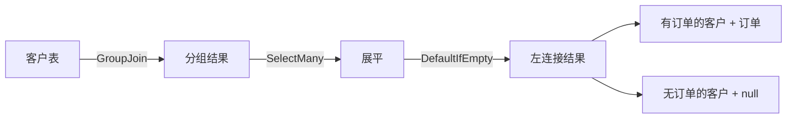
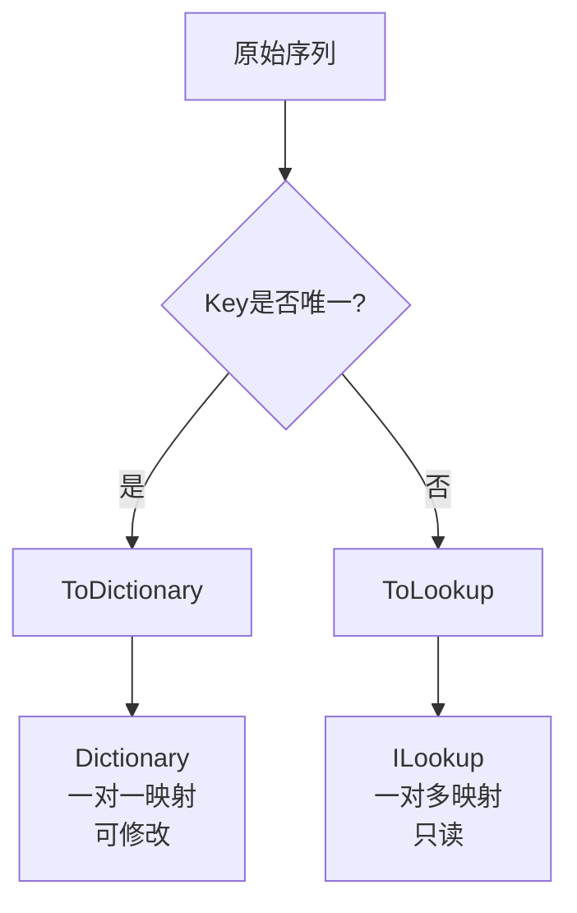
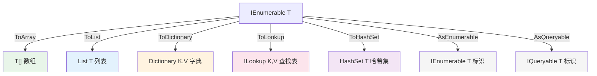

# 生成与转换操作符

LINQ 中的生成操作符用于**从零创建序列**，转换操作符用于**改变序列的容器类型或执行方式**。这两类操作符是 LINQ 查询管线中不可或缺的"胶水"——它们负责数据的输入与输出。

## 一、生成操作符

生成操作符不依赖已有数据源，而是直接产生新的序列。它们全部是 `Enumerable` 类的静态方法，返回 `IEnumerable<T>`。

### 1.1 Range — 生成整数序列

`Enumerable.Range(int start, int count)` 生成从 `start` 开始、包含 `count` 个连续整数的序列。

```csharp
// 基本用法：生成 1~10
var numbers = Enumerable.Range(1, 10);
// 结果：1, 2, 3, 4, 5, 6, 7, 8, 9, 10

// 生成 2020~2025 的年份列表
var years = Enumerable.Range(2020, 6);
// 结果：2020, 2021, 2022, 2023, 2024, 2025
```

**业务场景：生成年份下拉列表**

```csharp
public class YearOption
{
    public int Value { get; set; }
    public string Label { get; set; } = "";
}

// 生成最近10年的下拉选项（从当前年份倒推）
var currentYear = DateTime.Now.Year;
var yearOptions = Enumerable.Range(currentYear - 9, 10)
    .Select(year => new YearOption
    {
        Value = year,
        Label = $"{year}年"
    })
    .Reverse() // 最新的在前
    .ToList();

// 结果：2026年, 2025年, 2024年, ... , 2017年
```

**高级用法：Range + Select 生成复杂序列**

```csharp
// 生成最近30天的日期列表
var recentDays = Enumerable.Range(0, 30)
    .Select(offset => DateTime.Today.AddDays(-offset))
    .ToList();

// 生成序号与数据的配对
var items = new[] { "苹果", "香蕉", "橙子" };
var indexed = Enumerable.Range(0, items.Length)
    .Select(i => new { Index = i + 1, Name = items[i] })
    .ToList();
// 结果：{ Index=1, Name="苹果" }, { Index=2, Name="香蕉" }, { Index=3, Name="橙子" }

// 生成字母表 A-Z
var alphabet = Enumerable.Range(0, 26)
    .Select(i => (char)('A' + i))
    .ToArray();

// 批量生成测试数据
var testUsers = Enumerable.Range(1, 100)
    .Select(i => new User
    {
        Id = i,
        Name = $"用户{i}",
        Email = $"user{i}@example.com",
        CreatedAt = DateTime.Now.AddMinutes(-i)
    })
    .ToList();
```

> **注意**：`Range` 的 `count` 不能为负数，否则抛出 `ArgumentOutOfRangeException`。

### 1.2 Repeat — 重复生成

`Enumerable.Repeat(TResult element, int count)` 生成包含 `count` 个 `element` 副本的序列。

```csharp
// 生成5个0
var zeros = Enumerable.Repeat(0, 5);
// 结果：0, 0, 0, 0, 0

// 生成3个相同的字符串
var placeholders = Enumerable.Repeat("N/A", 3);
// 结果："N/A", "N/A", "N/A"
```

**业务场景：默认值填充与测试数据生成**

```csharp
// 1. 初始化矩阵（二维数组）
var matrix = Enumerable.Range(0, 5)
    .Select(_ => Enumerable.Repeat(0, 5).ToArray())
    .ToArray();
// 5x5 的零矩阵

// 2. 初始化图表的12个月数据（默认0）
var monthlyData = Enumerable.Repeat(0m, 12).ToList();
monthlyData[DateTime.Now.Month - 1] = 15000.00m; // 当月数据

// 3. 测试数据生成：生成100个相同的默认配置
var defaultConfigs = Enumerable.Repeat(new
{
    Timeout = 30,
    RetryCount = 3,
    Enabled = true
}, 100).ToList();

// 4. 生成测试用的订单列表
var testOrders = Enumerable.Repeat(new Order
{
    Status = OrderStatus.Pending,
    Amount = 100m
}, 50).ToList();
```

> **注意**：对于引用类型，`Repeat` 重复的是**同一个引用**，而非深拷贝。如果需要独立对象，应配合 `Select` 使用。

```csharp
// 错误：所有元素指向同一个对象
var bad = Enumerable.Repeat(new List<int>(), 3).ToList();
bad[0].Add(1);
// bad[0]、bad[1]、bad[2] 都包含 1！

// 正确：每次创建新实例
var good = Enumerable.Range(0, 3)
    .Select(_ => new List<int>())
    .ToList();
good[0].Add(1);
// 只有 good[0] 包含 1
```

### 1.3 Empty — 空序列

`Enumerable.Empty<TResult>()` 返回一个类型为 `IEnumerable<TResult>` 的空序列。

```csharp
var empty = Enumerable.Empty<int>();
// 等价于 new int[0]，但更高效——缓存了单例空数组
```

**业务场景：方法返回空集合而非 null**

```csharp
// 反模式：返回 null
public IEnumerable<Order> GetOrders(int userId)
{
    // 没有订单时返回 null
    return null!; // 调用方必须做 null 检查
}

// 正确做法：返回空序列
public IEnumerable<Order> GetOrders(int userId)
{
    var orders = _dbContext.Orders.Where(o => o.UserId == userId);
    return orders.Any() ? orders : Enumerable.Empty<Order>();
}

// 更简洁：LINQ 本身就返回空序列
public IEnumerable<Order> GetOrders(int userId)
{
    return _dbContext.Orders.Where(o => o.UserId == userId);
    // 如果没有匹配项，Where 自然返回空序列
}
```

**其他常见用法**

```csharp
// 1. 初始化空集合
var results = Enumerable.Empty<SearchResult>();

// 2. 聚合操作的初始值
var combined = Enumerable.Empty<Product>()
    .Concat(saleProducts)
    .Concat(discountProducts);

// 3. 条件返回
return isValid
    ? GetData()
    : Enumerable.Empty<DataItem>();

// 4. 单元测试中作为空输入
[TestMethod]
public void Process_EmptyInput_ReturnsEmpty()
{
    var result = Processor.Process(Enumerable.Empty<InputItem>());
    Assert.AreEqual(0, result.Count());
}
```

> **性能提示**：`Empty<TResult>()` 内部缓存了空数组实例，多次调用不会分配新内存。

### 1.4 DefaultIfEmpty — 默认值

`DefaultIfEmpty` 在序列为空时返回一个包含默认值的序列，而非空序列。

```csharp
// 空序列 → 包含 default(int) 的序列
var empty = Enumerable.Empty<int>();
var withDefault = empty.DefaultIfEmpty();
// 结果：0（单个元素）

// 非空序列 → 不变
var nonEmpty = new[] { 1, 2, 3 };
var same = nonEmpty.DefaultIfEmpty();
// 结果：1, 2, 3

// 指定默认值
var withCustomDefault = empty.DefaultIfEmpty(-1);
// 结果：-1
```

**核心用途：Left Join（左连接）**

`DefaultIfEmpty` 是实现 LEFT JOIN 的关键组件，与 `GroupJoin` + `SelectMany` 配合使用：

```csharp
// 左连接：查询所有客户及其订单（包括没有订单的客户）
var leftJoin = customers
    .GroupJoin(orders,
        c => c.Id,
        o => o.CustomerId,
        (customer, customerOrders) => new { customer, customerOrders })
    .SelectMany(
        x => x.customerOrders.DefaultIfEmpty(), // 关键：空订单返回 null
        (x, order) => new
        {
            x.customer.Name,
            OrderId = order?.Id,
            OrderAmount = order?.Amount ?? 0m
        })
    .ToList();

// 查询语法等价写法
var leftJoinQuery = from c in customers
                    join o in orders on c.Id equals o.CustomerId into customerOrders
                    from o in customerOrders.DefaultIfEmpty()
                    select new
                    {
                        c.Name,
                        OrderId = (int?)o?.Id,
                        OrderAmount = o?.Amount ?? 0m
                    };
```



**业务场景：商品与促销的左连接**

```csharp
// 查询所有商品，包括没有促销活动的商品
var productsWithPromo = products
    .GroupJoin(promotions,
        p => p.CategoryId,
        pr => pr.CategoryId,
        (product, promos) => new { product, promos })
    .SelectMany(
        x => x.promos.DefaultIfEmpty(),
        (x, promo) => new
        {
            x.product.Name,
            x.product.Price,
            PromoName = promo?.Name ?? "无促销",
            Discount = promo?.Discount ?? 0m,
            FinalPrice = x.product.Price * (1 - (promo?.Discount ?? 0m))
        })
    .ToList();
```

## 二、转换操作符

转换操作符将 `IEnumerable<T>` 转换为其他集合类型或改变查询的执行方式。它们**触发立即执行**（除 `AsEnumerable` / `AsQueryable` 外）。

### 2.1 ToArray — 转数组

将序列转换为数组，**立即执行**查询。

```csharp
var products = dbContext.Products
    .Where(p => p.IsActive)
    .ToArray(); // 立即执行SQL查询，结果存入数组

// 数组的特点
var arr = new[] { 1, 2, 3 }.ToArray();
// - 长度固定，不可增删
// - 连续内存，访问速度最快
// - 支持 Length 属性（非 Count()）
// - 支持索引直接访问
```

**何时使用 ToArray**

- 需要传递给接受数组参数的 API
- 需要最高效的随机索引访问
- 数据量已知且不需要增删
- 与 `Span<T>` / `Memory<T>` 互操作

```csharp
// 场景：调用只接受数组的API
public void ProcessBatch(byte[] data) { /* ... */ }

var buffer = stream.ReadBytes()
    .ToArray(); // 必须转为数组
ProcessBatch(buffer);

// 场景：高性能索引访问
var lookup = expensiveQuery.ToArray();
for (int i = 0; i < lookup.Length; i++)
{
    // 数组索引访问比 List 更快（无边界检查开销）
    Process(lookup[i]);
}
```

### 2.2 ToList — 转列表

将序列转换为 `List<T>`，**最常用的强制执行方法**。

```csharp
var activeUsers = users
    .Where(u => u.IsActive)
    .OrderBy(u => u.Name)
    .ToList(); // 立即执行，结果存入List

// List的特点
// - 动态大小，支持增删（Add, Remove, Insert等）
// - 支持Count属性（非Count()方法）
// - 支持索引访问和修改
// - 支持ForEach方法
```

**何时使用 ToList**

- 需要多次遍历结果（避免多次枚举）
- 需要 List 特有的 API（Add、Remove、Find 等）
- 需要将结果传递给其他方法并确保已执行
- 需要修改结果集合

```csharp
// 场景1：多次遍历
var orders = orderRepository.GetRecentOrders().ToList();
var totalAmount = orders.Sum(o => o.Amount);    // 第一次遍历
var avgAmount = orders.Average(o => o.Amount);   // 第二次遍历
var topOrders = orders.OrderByDescending(o => o.Amount).Take(5).ToList(); // 第三次遍历

// 场景2：需要List API
var selectedItems = availableItems
    .Where(i => i.IsSelected)
    .ToList();
selectedItems.Add(extraItem); // 需要后续添加元素

// 场景3：确保查询立即执行（尤其在EF Core中）
var results = dbContext.Products
    .Where(p => p.Stock > 0)
    .ToList(); // SQL在此处执行，而非延迟到遍历时
```

### 2.3 ToDictionary — 转字典

将序列转换为 `Dictionary<TKey, TValue>`，通过键选择器建立键值映射。

```csharp
// 基本用法：仅指定Key选择器，Value为整个元素
var userById = users.ToDictionary(u => u.Id);
// Dictionary<int, User>

// 指定Key和Value选择器
var userNameById = users.ToDictionary(u => u.Id, u => u.Name);
// Dictionary<int, string>
```

**重要：重复 Key 抛出异常**

```csharp
// 如果有重复Key，抛出 ArgumentException
var categories = new[]
{
    new { Id = 1, Name = "电子" },
    new { Id = 2, Name = "服装" },
    new { Id = 1, Name = "家电" } // 重复Id=1
};

// 这会抛出异常！
var dict = categories.ToDictionary(c => c.Id);

// 解决方案1：使用分组
var grouped = categories.GroupBy(c => c.Id)
    .ToDictionary(g => g.Key, g => g.ToList());

// 解决方案2：使用ToLookup（推荐）
var lookup = categories.ToLookup(c => c.Id);

// 解决方案3：明确处理冲突
var dictSafe = categories.ToDictionary(
    c => c.Id,
    c => c.Name,
    EqualityComparer<int>.Default // 不解决冲突，只是说明可自定义比较器
);
// 仍然会抛异常，需要先GroupBy去重
```

**业务场景：ID → 实体映射**

```csharp
// 构建用户查找表
var userDict = dbContext.Users
    .ToDictionary(u => u.Id);

// O(1)查找用户
var user = userDict[userId];

// 场景：根据ID列表批量查找
var targetIds = new[] { 101, 205, 310 };
var userLookup = dbContext.Users
    .Where(u => targetIds.Contains(u.Id))
    .ToDictionary(u => u.Id);

foreach (var id in targetIds)
{
    if (userLookup.TryGetValue(id, out var user))
    {
        Console.WriteLine($"{id}: {user.Name}");
    }
}

// 场景：两个集合的关联查找
var productDict = products.ToDictionary(p => p.Id);
var orderItems = orders.SelectMany(o => o.Items)
    .Select(item => new
    {
        item.ProductId,
        ProductName = productDict[item.ProductId].Name,
        item.Quantity,
        Subtotal = item.Quantity * productDict[item.ProductId].Price
    });
```

### 2.4 ToLookup — 转查找表

`ToLookup` 与 `ToDictionary` 类似，但**允许重复 Key**，返回 `ILookup<TKey, TElement>`。

```csharp
// 一对多映射：每个分类对应多个商品
var productsByCategory = products.ToLookup(p => p.CategoryId);
// ILookup<int, Product>

// 遍历
foreach (var group in productsByCategory)
{
    Console.WriteLine($"分类 {group.Key}：");
    foreach (var product in group)
    {
        Console.WriteLine($"  - {product.Name}");
    }
}

// 通过Key查找
var electronics = productsByCategory[1]; // 返回IEnumerable<Product>
// 即使没有对应Key，也返回空序列（而非抛异常）
var notExist = productsByCategory[999]; // 空序列
```

**ToDictionary vs ToLookup 对比**

| 特性 | ToDictionary | ToLookup |
|------|-------------|----------|
| 返回类型 | `Dictionary<TKey, TValue>` | `ILookup<TKey, TElement>` |
| 重复Key | 抛出异常 | 允许，每个Key对应多个值 |
| 无Key查找 | 抛出 `KeyNotFoundException` | 返回空序列 |
| 可修改 | 是（可增删键值对） | 否（只读） |
| 执行时机 | 立即 | 立即 |
| 适用场景 | 一对一映射 | 一对多映射 |



**业务场景：一对多关系映射**

```csharp
// 场景1：学生按班级分组
var studentsByClass = students.ToLookup(s => s.ClassId);
// 查找某班所有学生
var classA = studentsByClass["A001"];

// 场景2：订单按客户分组
var ordersByCustomer = orders.ToLookup(o => o.CustomerId);
// 查找某客户的所有订单
var customerOrders = ordersByCustomer[custId];

// 场景3：日志按日期分组
var logsByDate = logs.ToLookup(l => l.Timestamp.Date);
var todayLogs = logsByDate[DateTime.Today];

// 场景4：多值配置
var configLookup = configurations
    .ToLookup(c => c.Section, c => c.Value);
var dbConfigs = configLookup["Database"];
// Database配置项可能有多个值
```

### 2.5 ToHashSet (.NET 5+)

将序列转换为 `HashSet<T>`，自动去重并支持 O(1) 查找。

```csharp
// 基本用法
var uniqueIds = orderIds.ToHashSet();
// HashSet<int>

// 指定比较器
var caseInsensitive = names.ToHashSet(StringComparer.OrdinalIgnoreCase);

// O(1) 快速判断存在性
if (uniqueIds.Contains(targetId))
{
    // 处理
}
```

**业务场景**

```csharp
// 场景1：快速去重
var allTags = posts.SelectMany(p => p.Tags).ToHashSet();
// 自动去重

// 场景2：快速查找 — 比List.Contains快得多
var blockedUserIds = GetBlockedUsers().Select(u => u.Id).ToHashSet();
var visiblePosts = allPosts.Where(p => !blockedUserIds.Contains(p.AuthorId)).ToList();

// 场景3：集合运算
var setA = listA.ToHashSet();
var setB = listB.ToHashSet();
setA.IntersectWith(setB);  // 交集
setA.UnionWith(setB);       // 并集
setA.ExceptWith(setB);      // 差集

// 性能对比：List.Contains vs HashSet.Contains
// List: O(n) 线性查找
// HashSet: O(1) 哈希查找
// 万级数据时差异显著
```

### 2.6 AsEnumerable — 切换到 IEnumerable

`AsEnumerable` 将 `IQueryable<T>` 强制转换为 `IEnumerable<T>`，使后续操作使用 `Enumerable` 扩展方法（而非 `Queryable`）。

```csharp
// 核心用途：强制客户端执行
var result = dbContext.Products
    .Where(p => p.Price > 100)          // 翻译为SQL
    .AsEnumerable()                      // 切换到IEnumerable
    .Where(p => CustomFilter(p))         // 客户端执行（无法翻译为SQL的方法）
    .ToList();
```

**典型场景：避免 EF Core 翻译不支持的方法**

```csharp
// 问题：EF Core 无法翻译某些C#方法
var result = dbContext.Orders
    .Where(o => o.Description.Contains("关键词"))  // 可以翻译
    .Where(o => Regex.IsMatch(o.Description, @"\d{4}-\d{2}"))  // 无法翻译！
    .ToList(); // 抛出异常或全表拉取

// 解决：AsEnumerable 后在客户端执行
var result = dbContext.Orders
    .Where(o => o.Status == OrderStatus.Completed) // 先在数据库过滤
    .AsEnumerable()                                 // 切换到客户端
    .Where(o => Regex.IsMatch(o.Description, @"\d{4}-\d{2}")) // 客户端正则
    .ToList();
```

> **警告**：`AsEnumerable` 之前的操作在数据库执行，之后的操作在客户端执行。应尽可能将过滤条件放在 `AsEnumerable` 之前，减少传输数据量。

### 2.7 AsQueryable — 切换到 IQueryable

`AsQueryable` 将 `IEnumerable<T>` 包装为 `IQueryable<T>`，主要用于单元测试和接口兼容。

```csharp
// 场景1：单元测试中模拟IQueryable
public class ProductRepository
{
    private readonly IQueryable<Product> _products;

    public ProductRepository(IQueryable<Product> products)
    {
        _products = products;
    }

    public IQueryable<Product> GetActive()
    {
        return _products.Where(p => p.IsActive);
    }
}

// 测试时用内存数据
var testData = new List<Product>
{
    new() { Id = 1, Name = "产品A", IsActive = true },
    new() { Id = 2, Name = "产品B", IsActive = false }
}.AsQueryable(); // 包装为IQueryable

var repo = new ProductRepository(testData);
var active = repo.GetActive().ToList(); // 正常工作
```

> **注意**：对内存集合调用 `AsQueryable()` 并不会让操作在数据库执行，它只是创建了一个包装器。真正影响执行位置的是底层的数据源类型。

## 三、转换操作符全面对比

| 操作 | 返回类型 | 执行时机 | 重复Key | 可修改 | 适用场景 |
|------|---------|---------|---------|--------|---------|
| ToArray | `T[]` | 立即 | N/A | 否 | 高性能索引访问、API参数 |
| ToList | `List<T>` | 立即 | N/A | 是 | 最常用、多次遍历、需增删 |
| ToDictionary | `Dictionary<K,V>` | 立即 | 抛异常 | 是 | 一对一快速查找 |
| ToLookup | `ILookup<K,V>` | 立即 | 允许 | 否 | 一对多分组查找 |
| ToHashSet | `HashSet<T>` | 立即 | 自动去重 | 是 | 快速存在性判断、集合运算 |
| AsEnumerable | `IEnumerable<T>` | 延迟 | N/A | N/A | 强制客户端执行 |
| AsQueryable | `IQueryable<T>` | 延迟 | N/A | N/A | 接口兼容、测试模拟 |



## 四、业务实战场景

### 4.1 缓存数据构建

```csharp
public class ProductCache
{
    private Dictionary<int, Product> _productDict = null!;
    private ILookup<int, Product> _categoryLookup = null!;
    private HashSet<int> _hotProductIds = null!;

    public void Refresh(IEnumerable<Product> products)
    {
        var productList = products.ToList(); // 一次执行，多次使用

        // 构建ID查找表
        _productDict = productList.ToDictionary(p => p.Id);

        // 构建分类查找表（一个分类多个商品）
        _categoryLookup = productList.ToLookup(p => p.CategoryId);

        // 构建热门商品集合
        _hotProductIds = productList
            .Where(p => p.SalesCount > 1000)
            .Select(p => p.Id)
            .ToHashSet();
    }

    public Product? GetById(int id) =>
        _productDict.TryGetValue(id, out var p) ? p : null;

    public IEnumerable<Product> GetByCategory(int categoryId) =>
        _categoryLookup[categoryId];

    public bool IsHotProduct(int id) =>
        _hotProductIds.Contains(id);
}
```

### 4.2 查找表模式 — O(1) 查找

```csharp
// 问题：在订单列表中查找每个产品的信息 — O(n*m)
var result = orders.Select(o => new
{
    o.OrderId,
    ProductName = products.First(p => p.Id == o.ProductId).Name // O(n)查找
});

// 优化：用ToDictionary构建查找表 — O(n+m)
var productDict = products.ToDictionary(p => p.Id);
var result2 = orders.Select(o => new
{
    o.OrderId,
    ProductName = productDict[o.ProductId].Name // O(1)查找
});
```

### 4.3 批量处理 — Chunk + ToList

```csharp
// 批量插入10000条记录，每批500条
var allRecords = Enumerable.Range(1, 10000)
    .Select(i => new Record { Id = i, Data = $"Data{i}" })
    .ToList();

foreach (var chunk in allRecords.Chunk(500))
{
    await dbContext.Records.AddRangeAsync(chunk);
    await dbContext.SaveChangesAsync();
    Console.WriteLine($"已处理 {chunk.Length} 条");
}
```

### 4.4 数据迁移中的类型转换

```csharp
// 从旧系统导出的CSV数据
var csvRows = File.ReadLines("export.csv")
    .Skip(1) // 跳过标题行
    .Select(line => line.Split(','))
    .Where(parts => parts.Length >= 4)
    .Select(parts => new LegacyUser
    {
        Id = int.Parse(parts[0]),
        Name = parts[1].Trim('"'),
        Email = parts[2].Trim('"'),
        IsActive = parts[3] == "1"
    });

// 转换为新系统格式并构建查找结构
var newUsers = csvRows
    .Select(old => new NewUser
    {
        Id = old.Id,
        DisplayName = old.Name,
        Email = old.Email.ToLowerInvariant(),
        Status = old.IsActive ? UserStatus.Active : UserStatus.Inactive
    })
    .ToDictionary(u => u.Id); // 构建ID索引

Console.WriteLine($"已迁移 {newUsers.Count} 个用户");
```

## 五、总结

生成与转换操作符是 LINQ 查询的"入口"和"出口"：

- **生成操作符**（Range、Repeat、Empty）从零创建数据，是构建测试数据和初始化序列的利器
- **DefaultIfEmpty** 是实现左连接的关键，解决了"没有匹配也保留"的需求
- **转换操作符**决定了查询的执行时机和结果的存储形态
- **ToList/ToArray** 最常用，触发立即执行
- **ToDictionary/ToLookup** 构建高效查找结构，是性能优化的基础手段
- **AsEnumerable/AsQueryable** 控制执行位置，是 ORM 场景下必须理解的概念

选择正确的转换操作符，既能确保代码正确性，又能显著提升运行性能。
