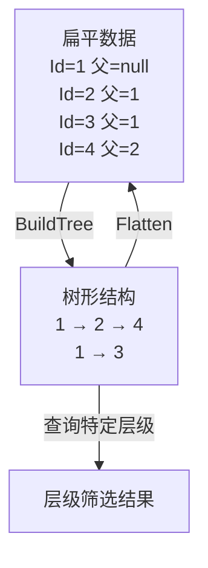

# 高级查询技巧

掌握了 LINQ 的基础操作符后，本节深入探讨查询语法中的高级特性：`let` 子句、`into` 子句、多数据源查询、多键分组、嵌套子查询、递归与树形结构，以及并行 LINQ（PLINQ）。

## 一、let 子句 — 引入中间变量

`let` 子句在查询语法中引入一个范围变量，用于存储中间计算结果，避免重复计算并提高可读性。

### 1.1 基本语法

```csharp
// 无let：重复计算
var query = from p in products
            where p.Price * p.Discount > 100
            select new
            {
                p.Name,
                DiscountedPrice = p.Price * p.Discount, // 重复计算
                Savings = p.Price * (1 - p.Discount)     // 重复计算
            };

// 有let：计算一次，多次使用
var query = from p in products
            let discountedPrice = p.Price * p.Discount
            where discountedPrice > 100
            select new
            {
                p.Name,
                DiscountedPrice = discountedPrice,
                Savings = p.Price - discountedPrice
            };
```

### 1.2 let 的等价方法语法

`let` 子句在编译后被翻译为 `Select`，引入匿名类型来携带中间变量：

```csharp
// 查询语法
from p in products
let discountedPrice = p.Price * p.Discount
where discountedPrice > 100
select new { p.Name, DiscountedPrice = discountedPrice };

// 等价方法语法
products
    .Select(p => new { p, discountedPrice = p.Price * p.Discount })
    .Where(x => x.discountedPrice > 100)
    .Select(x => new { x.p.Name, DiscountedPrice = x.discountedPrice });
```

### 1.3 业务场景：计算字段复用

```csharp
// 场景：订单统计，计算每个订单的总金额和折扣后金额
var orderStats = from o in orders
                 let subtotal = o.Items.Sum(i => i.Price * i.Quantity)
                 let discount = subtotal * o.DiscountRate
                 let total = subtotal - discount
                 where total > 1000
                 orderby total descending
                 select new
                 {
                     o.OrderId,
                     o.CustomerName,
                     Subtotal = subtotal,
                     Discount = discount,
                     Total = total,
                     DiscountPercent = o.DiscountRate * 100
                 };
```

```csharp
// 场景：字符串处理 — 解析日志提取关键信息
var logAnalysis = from log in logLines
                  let parts = log.Split('|')
                  let timestamp = DateTime.Parse(parts[0])
                  let level = parts[1].Trim()
                  let message = parts[2].Trim()
                  where level == "ERROR"
                  orderby timestamp descending
                  select new
                  {
                      Timestamp = timestamp,
                      Level = level,
                      Message = message
                  };
```

### 1.4 多个 let 子句

```csharp
var enrichedOrders = from o in orders
                     let itemTotal = o.Items.Sum(i => i.Price * i.Quantity)
                     let tax = itemTotal * 0.13m
                     let shipping = itemTotal > 200 ? 0 : 15
                     let finalTotal = itemTotal + tax + shipping
                     select new
                     {
                         o.OrderId,
                         ItemTotal = itemTotal,
                         Tax = tax,
                         Shipping = shipping,
                         FinalTotal = finalTotal
                     };
```

## 二、into 子句 — 查询延续

`into` 子句用于"查询延续"——将前一段查询的结果存入新的范围变量，继续后续操作。

### 2.1 group...by...into — 分组后继续查询

`into` 之后的范围变量替代了之前的范围变量，之前的变量不再可用：

```csharp
// 分组后过滤：只保留包含3个以上商品的分组
var largeCategories = from p in products
                      group p by p.CategoryId into g
                      where g.Count() >= 3        // 分组后过滤
                      orderby g.Count() descending
                      select new
                      {
                          CategoryId = g.Key,
                          ProductCount = g.Count(),
                          AvgPrice = g.Average(p => p.Price)
                      };
```


### 2.2 join...into — 分组连接

`join...into` 实现分组连接，将右表的匹配项收集到一个集合中：

```csharp
// 每个客户及其所有订单
var customerOrders = from c in customers
                     join o in orders on c.Id equals o.CustomerId into co
                     select new
                     {
                         c.Name,
                         Orders = co,
                         TotalAmount = co.Sum(o => o.Amount),
                         OrderCount = co.Count()
                     };
```

### 2.3 业务场景：分组后排序与过滤

```csharp
// 场景1：按部门分组，只显示平均薪资>10000的部门，按平均薪资降序
var highSalaryDepts = from e in employees
                      group e by e.Department into dept
                      let avgSalary = dept.Average(e => e.Salary)
                      where avgSalary > 10000
                      orderby avgSalary descending
                      select new
                      {
                          Department = dept.Key,
                          EmployeeCount = dept.Count(),
                          AvgSalary = avgSalary,
                          MaxSalary = dept.Max(e => e.Salary)
                      };

// 场景2：按产品分类分组，找出每个分类中价格最高的产品
var topProducts = from p in products
                  group p by p.CategoryId into g
                  let top = g.OrderByDescending(x => x.Price).First()
                  select new
                  {
                      CategoryId = g.Key,
                      TopProduct = top.Name,
                      TopPrice = top.Price,
                      ProductCount = g.Count()
                  };
```

## 三、多数据源查询

### 3.1 多个 from 子句

多个 `from` 子句等价于 `SelectMany`，实现交叉连接或扁平化：

```csharp
// 交叉连接：所有颜色与尺码的组合
var combinations = from color in new[] { "红", "蓝", "黑" }
                   from size in new[] { "S", "M", "L", "XL" }
                   select $"{color}-{size}";
// 结果：红-S, 红-M, 红-L, 红-XL, 蓝-S, 蓝-M, ...

// 等价方法语法
var combinations2 = new[] { "红", "蓝", "黑" }
    .SelectMany(color => new[] { "S", "M", "L", "XL" },
        (color, size) => $"{color}-{size}");
```

### 3.2 from + join 组合

```csharp
// 场景：查询订单，关联客户和产品信息
var orderDetails = from o in orders
                   join c in customers on o.CustomerId equals c.Id
                   from item in o.Items
                   join p in products on item.ProductId equals p.Id
                   select new
                   {
                       o.OrderId,
                       CustomerName = c.Name,
                       ProductName = p.Name,
                       item.Quantity,
                       Subtotal = item.Quantity * p.Price
                   };
```

### 3.3 业务场景：跨集合关联查询

```csharp
// 场景：从多个数据源汇总报表
var salesReport = from sale in sales
                  join product in products on sale.ProductId equals product.Id
                  join customer in customers on sale.CustomerId equals customer.Id
                  join region in regions on customer.RegionId equals region.Id
                  let revenue = sale.Quantity * product.Price
                  group new { sale, product, customer, region, revenue }
                      by new { region.Name, product.Category } into g
                  select new
                  {
                      Region = g.Key.Name,
                      Category = g.Key.Category,
                      TotalRevenue = g.Sum(x => x.revenue),
                      TotalQuantity = g.Sum(x => x.sale.Quantity),
                      CustomerCount = g.Select(x => x.customer.Id).Distinct().Count()
                  };
```

## 四、GroupBy 多键分组

### 4.1 匿名类型作为 Key

```csharp
// 按年和月分组
var monthlySales = orders
    .GroupBy(o => new { o.OrderDate.Year, o.OrderDate.Month })
    .Select(g => new
    {
        g.Key.Year,
        g.Key.Month,
        OrderCount = g.Count(),
        TotalAmount = g.Sum(o => o.Amount)
    })
    .OrderBy(x => x.Year).ThenBy(x => x.Month);

// 查询语法
var monthlySalesQuery = from o in orders
                         group o by new { o.OrderDate.Year, o.OrderDate.Month } into g
                         orderby g.Key.Year, g.Key.Month
                         select new
                         {
                             g.Key.Year,
                             g.Key.Month,
                             OrderCount = g.Count(),
                             TotalAmount = g.Sum(o => o.Amount)
                         };
```

### 4.2 业务场景：按部门与职级分组

```csharp
// 场景1：按部门和职级统计薪资
var salaryStats = employees
    .GroupBy(e => new { e.Department, e.Level })
    .Select(g => new
    {
        g.Key.Department,
        g.Key.Level,
        Count = g.Count(),
        AvgSalary = g.Average(e => e.Salary),
        MinSalary = g.Min(e => e.Salary),
        MaxSalary = g.Max(e => e.Salary)
    })
    .OrderBy(x => x.Department).ThenBy(x => x.Level);

// 场景2：按年月和产品分类生成销售热力图数据
var heatmapData = sales
    .GroupBy(s => new
    {
        s.SaleDate.Year,
        s.SaleDate.Month,
        s.Product.Category
    })
    .Select(g => new
    {
        g.Key.Year,
        g.Key.Month,
        g.Key.Category,
        Revenue = g.Sum(s => s.Amount)
    });
```

### 4.3 多键分组的注意事项

```csharp
// 注意：匿名类型的EqualityComparer基于所有属性
// 以下两组Key被视为不同（即使Year和Month相同）
var key1 = new { Year = 2024, Month = 6 };
var key2 = new { Year = 2024, Month = 6 };
// key1.Equals(key2) == true ✓

// 但如果属性名不同则不相等
var key3 = new { Y = 2024, M = 6 };
// key1.Equals(key3) == false ✗

// 字符串拼接作为Key — 不推荐但有时方便
var groupKey = $"{order.OrderDate.Year}-{order.OrderDate.Month:D2}";
// 简单但丧失类型安全，且无法分别访问年/月
```

## 五、嵌套子查询

### 5.1 Select 中嵌套 LINQ

```csharp
// 每个客户及其订单列表
var customersWithOrders = customers.Select(c => new
{
    c.Id,
    c.Name,
    Orders = orders.Where(o => o.CustomerId == c.Id).ToList(),
    TotalSpent = orders.Where(o => o.CustomerId == c.Id).Sum(o => o.Amount)
});

// 优化：使用GroupJoin避免重复查询
var customersWithOrdersOpt = customers
    .GroupJoin(orders, c => c.Id, o => o.CustomerId, (c, co) => new
    {
        c.Id,
        c.Name,
        Orders = co.ToList(),
        TotalSpent = co.Sum(o => o.Amount)
    });
```

### 5.2 Where 中嵌套 LINQ（Contains 模式）

```csharp
// 查找有订单的客户
var customersWithOrders = customers
    .Where(c => orders.Any(o => o.CustomerId == c.Id))
    .ToList();

// 等价：使用Contains（更高效）
var customerIdsWithOrders = orders.Select(o => o.CustomerId).Distinct();
var activeCustomers = customers
    .Where(c => customerIdsWithOrders.Contains(c.Id))
    .ToList();

// 查询语法
var activeCustomersQuery = from c in customers
                           where orders.Any(o => o.CustomerId == c.Id)
                           select c;
```

### 5.3 业务场景

```csharp
// 场景1：查找订单金额超过10000的VIP客户
var vipCustomers = customers
    .Where(c => orders.Where(o => o.CustomerId == c.Id)
                      .Sum(o => o.Amount) > 10000)
    .Select(c => new
    {
        c.Name,
        TotalSpent = orders.Where(o => o.CustomerId == c.Id).Sum(o => o.Amount)
    })
    .ToList();

// 场景2：查找每个分类中价格高于平均价的产品
var aboveAvgProducts = products
    .GroupBy(p => p.CategoryId)
    .SelectMany(g => g.Where(p => p.Price > g.Average(x => x.Price)))
    .ToList();

// 场景3：查找最近30天有登录但无订单的用户
var inactiveUsers = users
    .Where(u => u.LastLoginDate >= DateTime.Today.AddDays(-30))
    .Where(u => !orders.Any(o => o.CustomerId == u.Id &&
                                  o.OrderDate >= DateTime.Today.AddDays(-30)))
    .ToList();
```

## 六、递归与树形结构

### 6.1 Flatten 递归展平

LINQ 本身不支持递归，但可以结合自定义扩展方法处理树形数据：

```csharp
// 树形节点定义
public class TreeNode
{
    public int Id { get; set; }
    public string Name { get; set; } = "";
    public int? ParentId { get; set; }
    public List<TreeNode> Children { get; set; } = new();
}

// 递归展平扩展方法
public static class TreeExtensions
{
    public static IEnumerable<TreeNode> Flatten(this TreeNode node)
    {
        yield return node;
        foreach (var child in node.Children.SelectMany(Flatten))
        {
            yield return child;
        }
    }

    public static IEnumerable<TreeNode> Flatten(
        this IEnumerable<TreeNode> nodes)
    {
        return nodes.SelectMany(Flatten);
    }
}
```

### 6.2 业务场景：组织架构树遍历

```csharp
// 构建组织架构树
var departments = new List<TreeNode>
{
    new() { Id = 1, Name = "总部", ParentId = null },
    new() { Id = 2, Name = "技术部", ParentId = 1 },
    new() { Id = 3, Name = "前端组", ParentId = 2 },
    new() { Id = 4, Name = "后端组", ParentId = 2 },
    new() { Id = 5, Name = "市场部", ParentId = 1 },
    new() { Id = 6, Name = "国内组", ParentId = 5 },
};

// 从扁平列表构建树
var tree = BuildTree(departments, null);

static List<TreeNode> BuildTree(List<TreeNode> all, int? parentId)
{
    return all
        .Where(d => d.ParentId == parentId)
        .Select(d => new TreeNode
        {
            Id = d.Id,
            Name = d.Name,
            ParentId = d.ParentId,
            Children = BuildTree(all, d.Id)
        })
        .ToList();
}

// 展平树 → 获取所有节点
var allNodes = tree.Flatten().ToList();
// 结果：总部, 技术部, 前端组, 后端组, 市场部, 国内组

// 查找某节点的所有后代
var techDescendants = tree
    .Flatten()
    .SkipWhile(n => n.Id != 2)  // 找到技术部
    .ToList();

// 按层级筛选
var level2 = tree.Flatten()
    .Where(n => /* 层级逻辑 */ true)
    .ToList();
```

### 6.3 菜单树构建

```csharp
public class MenuItem
{
    public int Id { get; set; }
    public string Title { get; set; } = "";
    public string Url { get; set; } = "";
    public int? ParentId { get; set; }
    public int SortOrder { get; set; }
    public List<MenuItem> Children { get; set; } = new();
}

// 从数据库扁平数据构建菜单树
static List<MenuItem> BuildMenuTree(List<MenuItem> flatItems, int? parentId = null)
{
    return flatItems
        .Where(m => m.ParentId == parentId)
        .OrderBy(m => m.SortOrder)
        .Select(m => new MenuItem
        {
            Id = m.Id,
            Title = m.Title,
            Url = m.Url,
            ParentId = m.ParentId,
            SortOrder = m.SortOrder,
            Children = BuildMenuTree(flatItems, m.Id)
        })
        .ToList();
}

// 使用
var menuTree = BuildMenuTree(dbMenuItems);
```



## 七、并行 LINQ (PLINQ)

PLINQ 是 LINQ 的并行版本，利用多核 CPU 并行处理数据。

### 7.1 基本使用

```csharp
// 启用并行处理
var result = dataSource
    .AsParallel()
    .Where(x => ExpensiveFilter(x))
    .Select(x => ExpensiveTransform(x))
    .ToList();

// 指定并行度
var result2 = dataSource
    .AsParallel()
    .WithDegreeOfParallelism(4) // 最多4个线程
    .Where(x => ExpensiveFilter(x))
    .Select(x => ExpensiveTransform(x))
    .ToList();

// 支持取消
var cts = new CancellationTokenSource();
var result3 = dataSource
    .AsParallel()
    .WithCancellation(cts.Token)
    .Select(x => Process(x))
    .ToList();

// 超时取消
cts.CancelAfter(TimeSpan.FromSeconds(30));
```

### 7.2 ForAll — 并行遍历

```csharp
// ForAll：并行执行操作，不收集结果
dataSource
    .AsParallel()
    .ForAll(item =>
    {
        // 并行写入日志、发送通知等
        logger.Write(item);
    });

// 注意：ForAll不保证顺序
```

### 7.3 顺序保留

```csharp
// 默认不保证顺序（性能最优）
var unordered = data.AsParallel()
    .Select(x => Transform(x))
    .ToList(); // 结果顺序可能与输入不同

// 需要保留顺序时
var ordered = data.AsParallel()
    .AsOrdered() // 保留原始顺序
    .Select(x => Transform(x))
    .ToList();
```

### 7.4 适用与不适用场景

| 场景 | 是否适用PLINQ | 原因 |
|------|-------------|------|
| CPU密集型数据转换 | 适用 | 多核并行加速 |
| 大数据集过滤/映射 | 适用 | 计算密集可并行 |
| IO操作（文件/网络） | 不适用 | 应使用async/await |
| 顺序敏感的处理 | 不适用 | 并行破坏顺序 |
| 数据量小（<1000） | 不适用 | 并行开销超过收益 |
| 集合很小+操作简单 | 不适用 | 委托调用开销占比过大 |
| 需要线程安全的副作用 | 不适用 | 需要额外同步机制 |

### 7.5 性能陷阱

```csharp
// 陷阱1：并行开销超过收益
var result = Enumerable.Range(1, 100)
    .AsParallel()      // 数据量太小，并行无意义
    .Select(x => x * 2) // 操作太简单
    .ToList();
// 串行执行更快！

// 陷阱2：线程安全问题
var list = new List<int>();
Enumerable.Range(1, 10000)
    .AsParallel()
    .ForAll(x => list.Add(x)); // List不是线程安全的！
// 结果可能丢失元素或抛异常

// 正确做法
var result = Enumerable.Range(1, 10000)
    .AsParallel()
    .Select(x => x)
    .ToList(); // PLINQ内部线程安全地收集结果

// 陷阱3：共享状态的lambda
int counter = 0;
var result = data.AsParallel()
    .Select(x =>
    {
        counter++; // 竞态条件！
        return x * counter;
    })
    .ToList();
```

### 7.6 PLINQ 性能实测参考

```csharp
// 简单性能测试框架
var data = Enumerable.Range(1, 10_000_000).ToArray();

// 串行
var sw = Stopwatch.StartNew();
var serialResult = data
    .Where(x => x % 3 == 0)
    .Select(x => Math.Sqrt(x))
    .Sum();
sw.Stop();
Console.WriteLine($"串行: {sw.ElapsedMilliseconds}ms");

// 并行
sw.Restart();
var parallelResult = data
    .AsParallel()
    .Where(x => x % 3 == 0)
    .Select(x => Math.Sqrt(x))
    .Sum();
sw.Stop();
Console.WriteLine($"并行: {sw.ElapsedMilliseconds}ms");

// 典型结果（8核CPU）：
// 串行: 350ms
// 并行: 80ms
// 加速比: ~4.4x
```

## 八、综合实战

### 8.1 多维度销售报表

```csharp
// 结合let、into、多数据源、多键分组的综合查询
var salesReport = from sale in sales
                  join product in products on sale.ProductId equals product.Id
                  join customer in customers on sale.CustomerId equals customer.Id
                  let revenue = sale.Quantity * product.Price
                  let quarter = (sale.SaleDate.Month - 1) / 3 + 1
                  group new { sale, product, revenue } by new
                  {
                      customer.Region,
                      product.Category,
                      Year = sale.SaleDate.Year,
                      Quarter = quarter
                  } into g
                  let totalRevenue = g.Sum(x => x.revenue)
                  where totalRevenue > 50000
                  orderby totalRevenue descending
                  select new
                  {
                      g.Key.Region,
                      g.Key.Category,
                      g.Key.Year,
                      g.Key.Quarter,
                      TotalRevenue = totalRevenue,
                      SalesCount = g.Count(),
                      AvgOrderValue = totalRevenue / g.Count()
                  };
```

### 8.2 组织架构统计分析

```csharp
// 基于树形数据的统计
var orgStats = from dept in allDepartments.Flatten()
               let employeeCount = employees.Count(e => e.DeptId == dept.Id)
               let totalSalary = employees.Where(e => e.DeptId == dept.Id)
                                           .Sum(e => e.Salary)
               where employeeCount > 0
               orderby employeeCount descending
               select new
               {
                   dept.Name,
                   EmployeeCount = employeeCount,
                   TotalSalary = totalSalary,
                   AvgSalary = employeeCount > 0 ? totalSalary / employeeCount : 0
               };
```

## 九、总结

| 技巧 | 核心用途 | 关键词 |
|------|---------|--------|
| let 子句 | 引入中间变量，避免重复计算 | 查询语法专用 |
| into 子句 | 查询延续，分组后继续操作 | group...into, join...into |
| 多 from | 多数据源交叉/关联 | 等价SelectMany |
| 多键 GroupBy | 多维度分组 | 匿名类型作Key |
| 嵌套子查询 | 集合间的包含/关联判断 | Contains/Any模式 |
| 递归树形 | 树形数据展平与构建 | 自定义扩展方法 |
| PLINQ | 多核并行加速CPU密集操作 | AsParallel |

这些高级技巧使 LINQ 能够应对更复杂的业务场景，但也需要注意可读性与性能的平衡。在团队协作中，应优先选择清晰易懂的写法，必要时添加注释说明复杂查询的意图。
