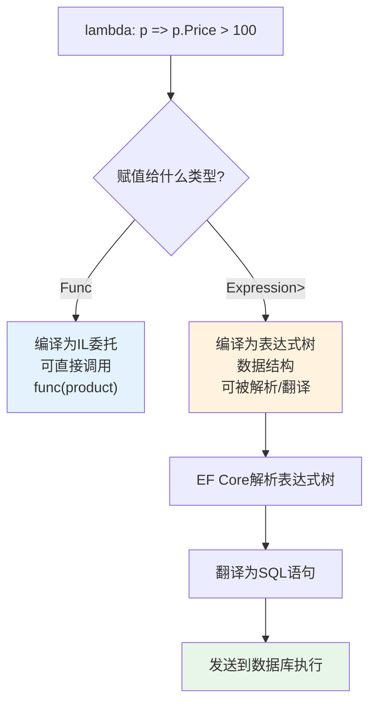
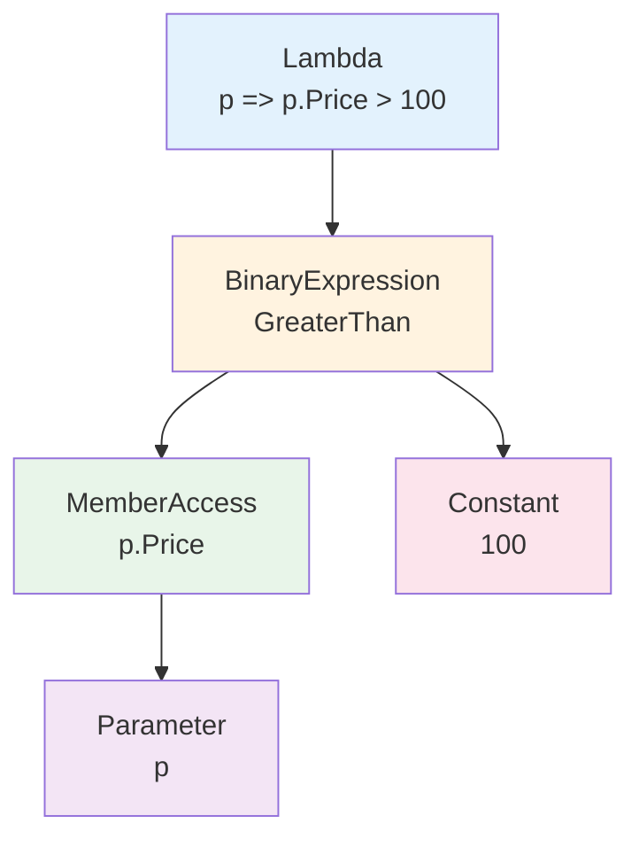
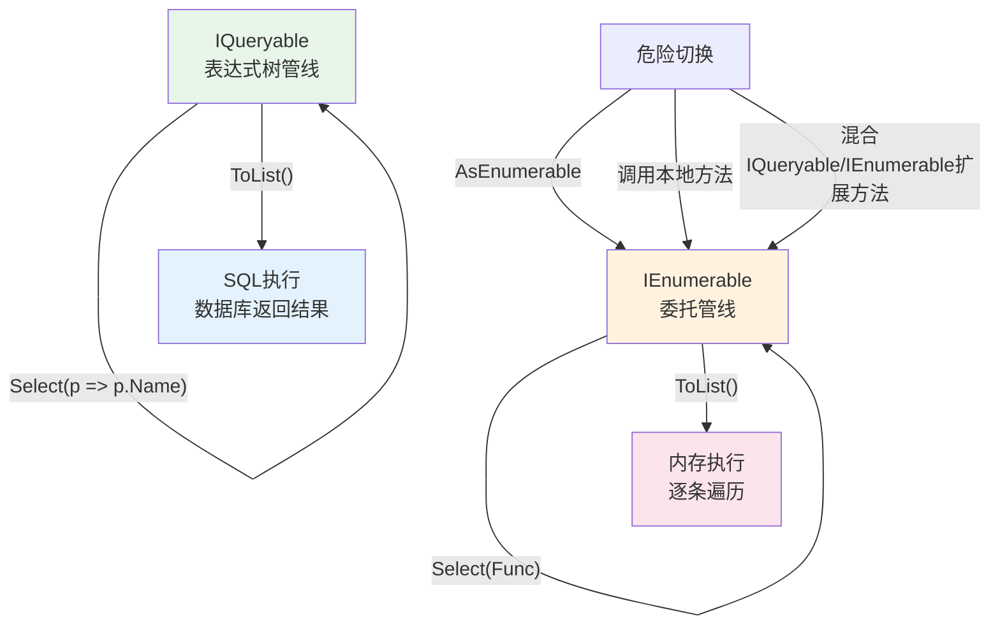
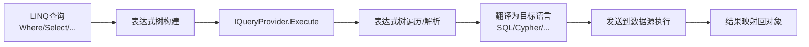

# 表达式树与动态查询

表达式树（Expression Tree）是 LINQ 能够将 C# 代码翻译为 SQL 的核心技术。理解表达式树不仅有助于深入理解 LINQ 的工作原理，更是构建动态查询、实现灵活过滤条件的基础。

## 一、表达式树基础

### 1.1 两种委托形式

```csharp
// 普通委托 — 直接编译为可执行的IL代码
Func<Product, bool> func = p => p.Price > 100;

// 表达式树 — 编译为数据结构（表达式树），可被解析和翻译
Expression<Func<Product, bool>> expr = p => p.Price > 100;
```

看似只差一个类型，但本质完全不同：



### 1.2 为什么 IQueryable 需要表达式树

```csharp
// IEnumerable 的 Where 接受 Func
public static IEnumerable<T> Where<T>(
    this IEnumerable<T> source,
    Func<T, bool> predicate);  // IL委托 → 客户端逐条判断

// IQueryable 的 Where 接受 Expression
public static IQueryable<T> Where<T>(
    this IQueryable<T> source,
    Expression<Func<T, bool>> predicate);  // 表达式树 → 可翻译为SQL
```

`IQueryable` 接受表达式树，因为它需要**解析**你的意图并翻译为查询语言（如SQL），而不是直接在内存中执行。

### 1.3 简单验证

```csharp
Expression<Func<Product, bool>> expr = p => p.Price > 100;

// 查看表达式树的结构
Console.WriteLine(expr.ToString());
// 输出：p => (p.Price > 100)

// 手动编译并执行
var compiled = expr.Compile();  // 编译为Func<Product, bool>
bool result = compiled(new Product { Price = 200 }); // true

// 表达式树的节点信息
Console.WriteLine(expr.Body.NodeType);        // GreaterThan
Console.WriteLine(expr.Body.Type);            // Boolean
Console.WriteLine(expr.Parameters[0].Name);   // p
```

## 二、Expression 结构

### 2.1 表达式树的节点类型

表达式树由不同类型的节点组成，每种节点对应 `ExpressionType` 枚举的一个值：

| 节点类型 | ExpressionType | 示例 |
|---------|---------------|------|
| 参数 | Parameter | `p` |
| 常量 | Constant | `100` |
| 二元运算 | GreaterThan, And, Or | `p.Price > 100` |
| 成员访问 | MemberAccess | `p.Price` |
| 方法调用 | Call | `p.Name.Contains("A")` |
| Lambda | Lambda | `p => ...` |
| 条件 | Conditional | `p.Price > 100 ? ... : ...` |
| 类型转换 | Convert | `(int)p.Price` |

### 2.2 手动构建表达式树

不需要 lambda 语法，可以用 API 手动构建表达式树：

```csharp
// 目标：p => p.Price > 100

// 步骤1：创建参数
ParameterExpression param = Expression.Parameter(typeof(Product), "p");

// 步骤2：访问属性 p.Price
MemberExpression priceProperty = Expression.Property(param, "Price");

// 步骤3：创建常量 100
ConstantExpression constant = Expression.Constant(100, typeof(decimal));

// 步骤4：构建二元表达式 p.Price > 100
BinaryExpression body = Expression.GreaterThan(priceProperty, constant);

// 步骤5：构建Lambda
Expression<Func<Product, bool>> lambda =
    Expression.Lambda<Func<Product, bool>>(body, param);

// 使用
var compiled = lambda.Compile();
bool result = compiled(new Product { Price = 200 }); // true
```



### 2.3 查看表达式树

```csharp
Expression<Func<Product, bool>> expr = p => p.Price > 100 && p.IsActive;

// 1. ToString() — 人类可读的表示
Console.WriteLine(expr.ToString());
// 输出：p => ((p.Price > 100) AndAlso p.IsActive)

// 2. DebugView — 更详细的结构信息（调试时可用）
// 在调试器中查看 expr.DebugView

// 3. 遍历表达式树
void PrintExpression(Expression expr, int indent = 0)
{
    var prefix = new string(' ', indent * 2);
    Console.WriteLine($"{prefix}{expr.NodeType}: {expr.Type.Name}");

    switch (expr)
    {
        case BinaryExpression binary:
            PrintExpression(binary.Left, indent + 1);
            PrintExpression(binary.Right, indent + 1);
            break;
        case MemberExpression member:
            PrintExpression(member.Expression!, indent + 1);
            break;
        case LambdaExpression lambda:
            PrintExpression(lambda.Body, indent + 1);
            break;
    }
}
```

## 三、动态查询构建

### 3.1 场景：后台管理系统的多条件组合查询

典型的后台管理系统搜索表单：

```csharp
public class ProductFilter
{
    public string? Name { get; set; }
    public decimal? MinPrice { get; set; }
    public decimal? MaxPrice { get; set; }
    public int? CategoryId { get; set; }
    public bool? IsActive { get; set; }
}
```

### 3.2 方法1：if 条件逐步追加 Where

最简单直观的方式：

```csharp
public List<Product> Search(ProductFilter filter)
{
    var query = dbContext.Products.AsQueryable();

    if (!string.IsNullOrEmpty(filter.Name))
        query = query.Where(p => p.Name.Contains(filter.Name));

    if (filter.MinPrice.HasValue)
        query = query.Where(p => p.Price >= filter.MinPrice.Value);

    if (filter.MaxPrice.HasValue)
        query = query.Where(p => p.Price <= filter.MaxPrice.Value);

    if (filter.CategoryId.HasValue)
        query = query.Where(p => p.CategoryId == filter.CategoryId.Value);

    if (filter.IsActive.HasValue)
        query = query.Where(p => p.IsActive == filter.IsActive.Value);

    return query.ToList();
}
```

**优点**：简单直观，EF Core 会将所有 Where 合并为一个 SQL WHERE 子句。

**缺点**：无法动态组合 OR 条件，无法处理复杂逻辑。

### 3.3 方法2：Expression 组合（And/Or）

更灵活的方式 — 组合多个表达式：

```csharp
public static class ExpressionExtensions
{
    /// <summary>
    /// 组合两个表达式为 AndAlso
    /// </summary>
    public static Expression<Func<T, bool>> And<T>(
        this Expression<Func<T, bool>> left,
        Expression<Func<T, bool>> right)
    {
        var parameter = Expression.Parameter(typeof(T));

        // 替换两个表达式中的参数为同一个
        var leftBody = ReplaceParameter(left.Body, left.Parameters[0], parameter);
        var rightBody = ReplaceParameter(right.Body, right.Parameters[0], parameter);

        var body = Expression.AndAlso(leftBody, rightBody);
        return Expression.Lambda<Func<T, bool>>(body, parameter);
    }

    /// <summary>
    /// 组合两个表达式为 OrElse
    /// </summary>
    public static Expression<Func<T, bool>> Or<T>(
        this Expression<Func<T, bool>> left,
        Expression<Func<T, bool>> right)
    {
        var parameter = Expression.Parameter(typeof(T));

        var leftBody = ReplaceParameter(left.Body, left.Parameters[0], parameter);
        var rightBody = ReplaceParameter(right.Body, right.Parameters[0], parameter);

        var body = Expression.OrElse(leftBody, rightBody);
        return Expression.Lambda<Func<T, bool>>(body, parameter);
    }

    private static Expression ReplaceParameter(
        Expression expression,
        ParameterExpression oldParam,
        ParameterExpression newParam)
    {
        return new ParameterReplacer(oldParam, newParam).Visit(expression);
    }
}

/// <summary>
/// 参数替换器 — 将表达式树中的参数替换为新参数
/// </summary>
public class ParameterReplacer : ExpressionVisitor
{
    private readonly ParameterExpression _oldParam;
    private readonly ParameterExpression _newParam;

    public ParameterReplacer(
        ParameterExpression oldParam,
        ParameterExpression newParam)
    {
        _oldParam = oldParam;
        _newParam = newParam;
    }

    protected override Expression VisitParameter(ParameterExpression node)
    {
        return node == _oldParam ? _newParam : base.VisitParameter(node);
    }
}
```

**使用 Expression 组合**

```csharp
public List<Product> Search(ProductFilter filter)
{
    // 从"永真"条件开始
    Expression<Func<Product, bool>> predicate = p => true;

    if (!string.IsNullOrEmpty(filter.Name))
    {
        Expression<Func<Product, bool>> nameFilter =
            p => p.Name.Contains(filter.Name);
        predicate = predicate.And(nameFilter);
    }

    if (filter.MinPrice.HasValue)
    {
        Expression<Func<Product, bool>> minPriceFilter =
            p => p.Price >= filter.MinPrice.Value;
        predicate = predicate.And(minPriceFilter);
    }

    if (filter.MaxPrice.HasValue)
    {
        Expression<Func<Product, bool>> maxPriceFilter =
            p => p.Price <= filter.MaxPrice.Value;
        predicate = predicate.And(maxPriceFilter);
    }

    if (filter.CategoryId.HasValue)
    {
        Expression<Func<Product, bool>> categoryFilter =
            p => p.CategoryId == filter.CategoryId.Value;
        predicate = predicate.And(categoryFilter);
    }

    // 根据条件选择And或Or
    if (filter.IsActive.HasValue)
    {
        Expression<Func<Product, bool>> activeFilter =
            p => p.IsActive == filter.IsActive.Value;
        predicate = predicate.And(activeFilter);
    }

    return dbContext.Products.Where(predicate).ToList();
}
```

### 3.4 更优雅的动态查询库

实际项目中推荐使用成熟的动态查询库，避免重复造轮子：

```csharp
// 1. System.Linq.Dynamic.Core — 字符串动态查询
var result = dbContext.Products
    .Where("Price > @0 && CategoryId == @1", 100, 5)
    .OrderBy("Name descending")
    .ToList();

// 2. PredicateBuilder (LinqKit) — 更友好的表达式构建
var predicate = PredicateBuilder.New<Product>(true);

if (!string.IsNullOrEmpty(filter.Name))
    predicate = predicate.And(p => p.Name.Contains(filter.Name));

if (filter.MinPrice.HasValue)
    predicate = predicate.And(p => p.Price >= filter.MinPrice.Value);

var result = dbContext.Products
    .AsExpandable()  // LinqKit扩展
    .Where(predicate)
    .ToList();
```

## 四、动态排序

### 4.1 按字符串属性名排序

```csharp
// 需求：前端传入排序字段名和方向，后端动态排序
// GET /api/products?sortBy=Price&sortDir=desc

public static class QueryableExtensions
{
    /// <summary>
    /// 按属性名动态排序
    /// </summary>
    public static IOrderedQueryable<T> OrderBy<T>(
        this IQueryable<T> source,
        string propertyName,
        bool descending = false)
    {
        var param = Expression.Parameter(typeof(T), "x");
        var property = Expression.Property(param, propertyName);
        var lambda = Expression.Lambda(property, param);

        var methodName = descending ? "OrderByDescending" : "OrderBy";
        var method = typeof(Queryable).GetMethods()
            .Where(m => m.Name == methodName && m.GetParameters().Length == 2)
            .Single()
            .MakeGenericMethod(typeof(T), property.Type);

        return (IOrderedQueryable<T>)method.Invoke(
            source, new object[] { source, lambda })!;
    }

    /// <summary>
    /// 动态ThenBy
    /// </summary>
    public static IOrderedQueryable<T> ThenBy<T>(
        this IOrderedQueryable<T> source,
        string propertyName,
        bool descending = false)
    {
        var param = Expression.Parameter(typeof(T), "x");
        var property = Expression.Property(param, propertyName);
        var lambda = Expression.Lambda(property, param);

        var methodName = descending ? "ThenByDescending" : "ThenBy";
        var method = typeof(Queryable).GetMethods()
            .Where(m => m.Name == methodName && m.GetParameters().Length == 2)
            .Single()
            .MakeGenericMethod(typeof(T), property.Type);

        return (IOrderedQueryable<T>)method.Invoke(
            source, new object[] { source, lambda })!;
    }
}
```

**使用示例**

```csharp
// 前端传入排序参数
var sortBy = "Price";
var sortDir = "desc";

var result = dbContext.Products
    .Where(p => p.IsActive)
    .OrderBy(sortBy, sortDir == "desc")
    .ThenBy("Name")
    .ToList();

// 生成的SQL：... WHERE IsActive = 1 ORDER BY Price DESC, Name ASC
```

### 4.2 反射 vs Expression 性能对比

```csharp
// 反射方式 — 每次调用都走反射
public static IOrderedQueryable<T> OrderByReflection<T>(
    this IQueryable<T> source, string property)
{
    // 反射获取属性信息（可缓存优化）
    var propInfo = typeof(T).GetProperty(property);
    // ...较慢
}

// Expression方式 — 构建表达式树后EF Core可翻译为SQL
// 反射只在构建表达式时用一次，执行由数据库完成

// 结论：Expression方式更适合IQueryable场景
```

## 五、IQueryable vs IEnumerable 深入

### 5.1 同一段代码两种执行方式

```csharp
// 同样的Where调用，不同的数据源类型 → 不同的执行方式

// 方式1：IEnumerable（内存集合）
IEnumerable<Product> memorySource = GetProductsList();
var result1 = memorySource
    .Where(p => p.Price > 100)   // Enumerable.Where → 客户端逐条判断
    .Select(p => p.Name);

// 方式2：IQueryable（数据库查询）
IQueryable<Product> dbSource = dbContext.Products;
var result2 = dbSource
    .Where(p => p.Price > 100)   // Queryable.Where → 翻译为SQL WHERE
    .Select(p => p.Name);        // 翻译为SQL SELECT
```

### 5.2 常见陷阱：在 IQueryable 上调用 Func 方法

```csharp
// 危险！这会导致全表拉取
var result = dbContext.Products
    .Where(p => IsExpensive(p))  // Func<Product, bool>！
    .ToList();
// SQL: SELECT * FROM Products — 没有WHERE子句！
// 所有数据拉到内存后再用IsExpensive过滤

// 正确：保持表达式树
var result2 = dbContext.Products
    .Where(p => p.Price > 1000)  // Expression<Func<Product, bool>>
    .ToList();
// SQL: SELECT * FROM Products WHERE Price > 1000

// 区别的根源
bool IsExpensive(Product p) => p.Price > 1000;
// 这是个普通方法，不是表达式树
// 编译器无法将方法调用翻译为SQL
```

### 5.3 隐式切换回 IEnumerable

```csharp
// 很多操作会隐式将IQueryable切换为IEnumerable
var result = dbContext.Orders
    .Where(o => o.Amount > 100)
    .Select(o => new
    {
        o.Id,
        Total = o.Items.Sum(i => i.Price * i.Quantity) // 导航属性
    })
    .ToList();
// 如果Items未配置Include，可能导致N+1问题或客户端评估
```



### 5.4 EF Core 客户端评估警告

```csharp
// EF Core 3.0+ 会在客户端评估时抛出异常（而非静默执行）
var result = dbContext.Products
    .Where(p => CustomBusinessLogic(p)) // 无法翻译
    .ToList();
// 抛出 InvalidOperationException:
// "The LINQ expression could not be translated..."

// 解决方案1：先在数据库过滤已知条件
var result2 = dbContext.Products
    .Where(p => p.IsActive)           // 可翻译
    .AsEnumerable()                    // 显式切换到客户端
    .Where(p => CustomBusinessLogic(p)) // 客户端执行
    .ToList();

// 解决方案2：将逻辑改写为可翻译的形式
var result3 = dbContext.Products
    .Where(p => p.Price > threshold && p.Category.Name == targetCategory)
    .ToList(); // 全部可翻译为SQL
```

## 六、自定义 LINQ Provider 概述

### 6.1 核心接口

```csharp
// IQueryable<T> — 可查询的数据源
public interface IQueryable<T> : IEnumerable<T>
{
    Type ElementType { get; }
    Expression Expression { get; }      // 表达式树
    IQueryProvider Provider { get; }    // 查询提供者
}

// IQueryProvider — 负责执行查询
public interface IQueryProvider
{
    IQueryable CreateQuery(Expression expression);
    IQueryable<TElement> CreateQuery<TElement>(Expression expression);
    object? Execute(Expression expression);
    TResult Execute<TResult>(Expression expression);
}
```

### 6.2 翻译管线



### 6.3 常见的 LINQ Provider

| Provider | 目标数据源 | 翻译目标 |
|----------|----------|---------|
| EF Core | 关系型数据库 | SQL |
| NHibernate | 关系型数据库 | HQL/SQL |
| MongoDB Driver | MongoDB | MongoDB查询 |
| Cosmos DB SDK | Azure Cosmos DB | SQL API |
| Elasticsearch Nest | Elasticsearch | JSON DSL |
| LINQ to Twitter | Twitter API | HTTP请求 |

### 6.4 了解即可 — 不深入实现

自定义 LINQ Provider 是一项复杂的工作，需要：
1. 实现 `IQueryable<T>` 和 `IQueryProvider`
2. 遍历并解析表达式树
3. 将表达式翻译为目标查询语言
4. 执行查询并将结果映射回对象

对于大多数开发者，**使用**现有的 Provider（尤其是 EF Core）已经足够。理解表达式树的原理有助于写出更高效的查询和排查翻译失败的问题。

## 七、综合实战

### 7.1 通用动态查询服务

```csharp
/// <summary>
/// 通用动态查询服务 — 支持多条件And/Or组合和动态排序
/// </summary>
public class DynamicQueryService<T> where T : class
{
    /// <summary>
    /// 动态查询
    /// </summary>
    public List<T> Query(
        IQueryable<T> source,
        List<FilterCondition> filters,
        string? sortBy = null,
        bool sortDesc = false)
    {
        var predicate = BuildPredicate(filters);
        var query = source.Where(predicate);

        if (!string.IsNullOrEmpty(sortBy))
        {
            query = query.OrderBy(sortBy, sortDesc);
        }

        return query.ToList();
    }

    private Expression<Func<T, bool>> BuildPredicate(
        List<FilterCondition> filters)
    {
        if (filters.Count == 0)
            return x => true;

        var predicate = BuildExpression(filters[0]);

        for (int i = 1; i < filters.Count; i++)
        {
            var next = BuildExpression(filters[i]);
            predicate = filters[i].Logic == "Or"
                ? predicate.Or(next)
                : predicate.And(next);
        }

        return predicate;
    }

    private Expression<Func<T, bool>> BuildExpression(FilterCondition filter)
    {
        var param = Expression.Parameter(typeof(T), "x");
        var property = Expression.Property(param, filter.Field);
        var constant = Expression.Constant(
            Convert.ChangeType(filter.Value, property.Type));

        BinaryExpression body = filter.Operator switch
        {
            "=" => Expression.Equal(property, constant),
            "!=" => Expression.NotEqual(property, constant),
            ">" => Expression.GreaterThan(property, constant),
            "<" => Expression.LessThan(property, constant),
            ">=" => Expression.GreaterThanOrEqual(property, constant),
            "<=" => Expression.LessThanOrEqual(property, constant),
            _ => Expression.Equal(property, constant)
        };

        return Expression.Lambda<Func<T, bool>>(body, param);
    }
}

public class FilterCondition
{
    public string Field { get; set; } = "";
    public string Operator { get; set; } = "=";
    public object Value { get; set; } = "";
    public string Logic { get; set; } = "And"; // And 或 Or
}
```

### 7.2 使用示例

```csharp
// 前端传入的查询条件
var filters = new List<FilterCondition>
{
    new() { Field = "Price", Operator = ">=", Value = 100 },
    new() { Field = "CategoryId", Operator = "=", Value = 5 },
    new() { Field = "Name", Operator = "!=", Value = "测试", Logic = "Or" }
};

var service = new DynamicQueryService<Product>();
var result = service.Query(
    dbContext.Products,
    filters,
    sortBy: "Price",
    sortDesc: true
);

// 生成的SQL大致为：
// SELECT * FROM Products
// WHERE Price >= 100 AND CategoryId = 5 OR Name != '测试'
// ORDER BY Price DESC
```

## 八、总结

| 主题 | 核心要点 |
|------|---------|
| 表达式树基础 | `Expression<Func<T,bool>>` 是数据结构，可被解析和翻译 |
| 手动构建 | `Expression.Parameter/Property/Constant/GreaterThan/Lambda` |
| 动态查询 | if追加Where最简单；Expression组合更灵活 |
| 动态排序 | 通过反射/Expression获取属性，构建OrderBy表达式 |
| IQueryable vs IEnumerable | 前者翻译为SQL在数据库执行，后者在客户端逐条执行 |
| 客户端评估陷阱 | 在IQueryable上调用本地方法会导致全表拉取 |
| 自定义Provider | 了解概念即可：IQueryable + IQueryProvider + 表达式树遍历 |

表达式树是理解 LINQ 与 ORM 交互的核心。掌握它，不仅能写出正确的动态查询，更能理解为什么某些 LINQ 语句能翻译为高效 SQL，而另一些则会导致性能灾难。
