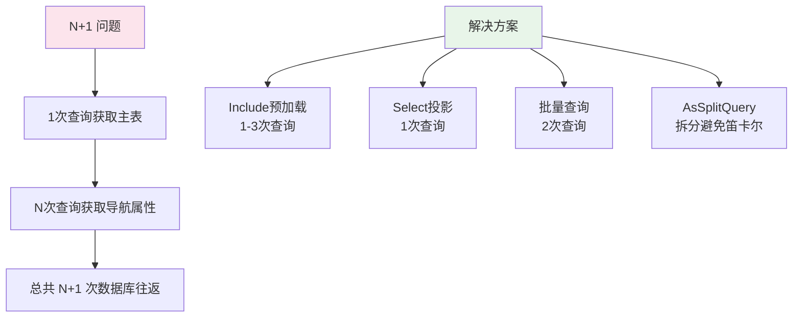
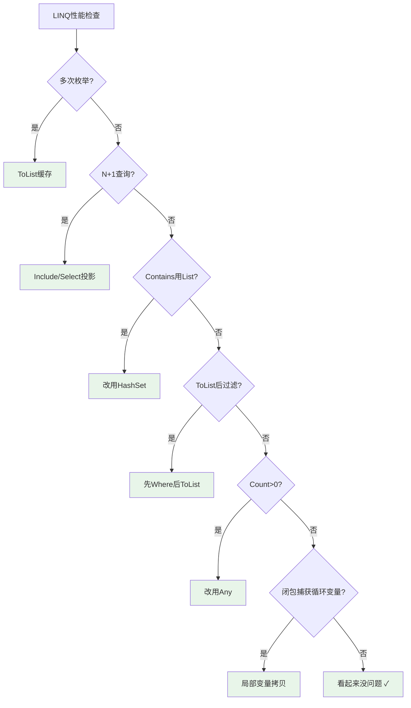

# LINQ 性能优化与常见陷阱

LINQ 极大地提升了代码的可读性和开发效率，但它也引入了一系列性能陷阱。理解这些陷阱的成因和解决方式，是从"会写 LINQ"到"写好 LINQ"的关键一步。

## 一、多次枚举陷阱

### 1.1 问题：对同一个 IEnumerable 多次遍历

```csharp
// 危险：GetResults() 可能执行了数据库查询或复杂计算
IEnumerable<Order> results = GetResults();

// 第一次遍历：执行查询
var count = results.Count();

// 第二次遍历：再次执行查询！
var top3 = results.Take(3).ToList();

// 第三次遍历：又一次执行查询！
foreach (var item in results)
{
    Console.WriteLine(item.Id);
}
```

每次遍历 `IEnumerable` 都可能重新执行底层的查询逻辑，导致：
- 数据库被查询3次
- 复杂计算被重复执行3次
- 文件被重新读取3次

### 1.2 检测方法

- **ReSharper / Rider**：警告 "Possible multiple enumeration of IEnumerable"
- **代码审查**：关注 `IEnumerable<T>` 类型的参数和变量是否被多次使用

### 1.3 解决：ToList() 缓存结果

```csharp
// 修复：ToList() 立即执行一次，后续遍历内存中的List
List<Order> results = GetResults().ToList(); // 执行一次

var count = results.Count;    // List.Count 属性，O(1)
var top3 = results.Take(3);   // 遍历内存List
foreach (var item in results)  // 遍历内存List
{
    Console.WriteLine(item.Id);
}
```

### 1.4 何时需要 ToList

| 场景 | 需要 ToList | 原因 |
|------|-----------|------|
| 多次遍历结果 | 是 | 避免重复执行 |
| 传递给其他方法 | 是 | 确保调用方遍历时数据仍有效 |
| 结果需要复用 | 是 | 缓存结果 |
| 在查询中添加/删除元素 | 是 | 需要 List API |
| EF Core 查询后立即使用 | 是 | 避免 DbContext 关闭后延迟加载失败 |

### 1.5 何时不需要 ToList

| 场景 | 不需要 ToList | 原因 |
|------|-------------|------|
| 只遍历一次 | 否 | 流式处理更省内存 |
| 大数据量内存敏感 | 否 | 百万级数据ToList可能OOM |
| 流式处理管道 | 否 | yield return 保持惰性 |
| 只需判断 Any/Count | 否 | Any() 只检查第一个元素 |

```csharp
// 不需要ToList的场景：流式处理
var processed = File.ReadLines("huge.csv")  // 逐行读取，不加载全文件
    .Select(ParseLine)
    .Where(IsValid)
    .Select(Transform)
    .Take(100);  // 只取前100条

// 这里ToList会加载全部数据到内存 — 不必要
foreach (var item in processed)
{
    WriteToDb(item);
}
```

## 二、闭包陷阱

### 2.1 经典问题：循环中的闭包捕获

```csharp
// 陷阱：for循环中的闭包
var actions = new List<Func<int>>();
for (int i = 0; i < 5; i++)
{
    actions.Add(() => i); // 所有lambda捕获同一个变量i
}

foreach (var action in actions)
{
    Console.Write(action() + " "); // 5 5 5 5 5
}
// 期望：0 1 2 3 4，实际：5 5 5 5 5
// 因为循环结束时i=5，所有lambda读取到的都是5
```

### 2.2 foreach 的闭包行为（C# 5.0 修复）

```csharp
// C# 5.0之前：foreach与for有相同的闭包陷阱
// C# 5.0及以后：foreach每次迭代创建新的循环变量副本

var actions = new List<Func<string>>();
foreach (var item in new[] { "A", "B", "C" })
{
    actions.Add(() => item); // C# 5.0+每次迭代item是新的变量
}

foreach (var action in actions)
{
    Console.Write(action() + " "); // A B C ✓（C# 5.0+）
}
```

### 2.3 LINQ 中的闭包陷阱

```csharp
// 陷阱1：在Select中捕获循环变量
var ids = new[] { 1, 2, 3 };
var queries = new List<IQueryable<Product>>();

// for循环 — 闭包陷阱
for (int i = 0; i < ids.Length; i++)
{
    queries.Add(dbContext.Products.Where(p => p.CategoryId == ids[i]));
    // 所有查询都引用ids[3] — 越界！
}

// 修复：局部变量拷贝
for (int i = 0; i < ids.Length; i++)
{
    int id = ids[i]; // 每次迭代创建新变量
    queries.Add(dbContext.Products.Where(p => p.CategoryId == id));
}

// 陷阱2：Select中使用外部变量
var threshold = 100;
var expensiveProducts = products
    .Select(p => new { p.Name, IsExpensive = p.Price > threshold });
// threshold可能在Select执行前被修改

// 陷阱3：并行LINQ中的共享状态
int count = 0;
Parallel.ForEach(items, item =>
{
    count++; // 竞态条件！
});
```

### 2.4 解决方案

```csharp
// 方案1：局部变量拷贝（for循环）
for (int i = 0; i < ids.Length; i++)
{
    int localI = i;
    // 使用localI代替i
}

// 方案2：使用foreach替代for（C# 5.0+）
foreach (var id in ids)
{
    // id在每次迭代中是独立的
}

// 方案3：LINQ直接传入参数
var queries = ids.Select(id =>
    dbContext.Products.Where(p => p.CategoryId == id))
    .ToList(); // lambda参数天然是独立的

// 方案4：Interlocked（并行场景）
int count = 0;
Parallel.ForEach(items, item =>
{
    Interlocked.Increment(ref count); // 线程安全
});
```

## 三、N+1 查询问题

### 3.1 什么是 N+1 问题

EF Core 中最常见且影响最大的性能问题：

```csharp
// N+1问题：查询1次获取N条订单，然后N次查询获取每条订单的客户
var orders = dbContext.Orders.ToList(); // 1次查询

foreach (var order in orders)
{
    // 每次访问Customer导航属性，触发一次额外查询！
    Console.WriteLine($"{order.Customer.Name}: {order.Amount}");
    // N次查询（N=订单数量）
}
// 总查询数：1 + N = N+1
```

### 3.2 检测方法

```csharp
// 启用EF Core敏感数据日志
optionsBuilder.EnableSensitiveDataLogging();
optionsBuilder.LogTo(Console.WriteLine, LogLevel.Warning);

// 查看SQL日志：如果看到大量相同模式的查询
// SELECT * FROM Customers WHERE Id = @p0
// SELECT * FROM Customers WHERE Id = @p1
// SELECT * FROM Customers WHERE Id = @p2
// ...这就是N+1问题
```

### 3.3 解决方案

```csharp
// 方案1：Include 预加载（Eager Loading）
var orders = dbContext.Orders
    .Include(o => o.Customer)        // JOIN查询，一次获取
    .Include(o => o.Items)           // 再JOIN订单项
    .ThenInclude(i => i.Product)     // 再JOIN产品
    .ToList();
// 总查询数：1（或3，取决于加载策略）

// 方案2：Select 投影 — 只取需要的字段
var orderSummaries = dbContext.Orders
    .Select(o => new
    {
        o.Id,
        CustomerName = o.Customer.Name,
        o.Amount
    })
    .ToList();
// 单次JOIN查询，只传输需要的字段

// 方案3：批量查询（手动）
var orders = dbContext.Orders.ToList();
var customerIds = orders.Select(o => o.CustomerId).Distinct().ToList();
var customers = dbContext.Customers
    .Where(c => customerIds.Contains(c.Id))
    .ToDictionary(c => c.Id);
// 2次查询，而非N+1次

// 方案4：拆分查询（EF Core 5.0+）
var orders = dbContext.Orders
    .Include(o => o.Items)
    .ThenInclude(i => i.Product)
    .AsSplitQuery() // 拆分为多个查询，避免笛卡尔爆炸
    .ToList();
```



### 3.4 N+1 的变体

```csharp
// 变体1：子集合的N+1
var categories = dbContext.Categories.ToList();
foreach (var cat in categories)
{
    var products = dbContext.Products
        .Where(p => p.CategoryId == cat.Id).ToList(); // 每个分类一次查询
}

// 修复
var categoriesWithProducts = dbContext.Categories
    .Include(c => c.Products)
    .ToList();

// 变体2：DTO映射中的隐式N+1
var result = dbContext.Orders.Select(o => new OrderDto
{
    Id = o.Id,
    CustomerName = o.Customer.Name, // 需要Include
    ItemCount = o.Items.Count       // 需要Include
}).ToList();
// 如果Customer和Items没有Include，可能触发N+1
```

## 四、LINQ vs 原生代码性能

### 4.1 LINQ 的额外开销

```csharp
// for循环
int sum = 0;
for (int i = 0; i < array.Length; i++)
{
    sum += array[i];
}

// LINQ
int sum = array.Sum();
```

LINQ 版本的额外开销：
- **委托调用**：每个元素调用一次 `Func<int, bool>` 委托
- **迭代器对象**：`WhereEnumerable` 等迭代器需要分配在堆上
- **方法调用栈**：多层扩展方法调用
- **边界检查**：迭代器的 `MoveNext()` 包含状态机逻辑

### 4.2 何时 LINQ 更慢

```csharp
// 简单循环 + 简单操作 — LINQ开销占比显著
// for循环：~5ns/元素
// LINQ：~30ns/元素（6倍差距）

// 但绝对值很小：百万次遍历只差~25ms
// 大多数业务场景中完全可以接受
```

### 4.3 何时 LINQ 可接受

- **可读性收益**远大于微秒级性能差异
- 数据量在合理范围内（< 百万级）
- 非热路径代码
- I/O 操作是瓶颈（数据库查询 >> LINQ开销）

### 4.4 何时避免 LINQ

| 场景 | 原因 | 替代方案 |
|------|------|---------|
| 热路径/高频调用 | 微秒级开销累积 | 原生for循环 |
| 游戏循环（60fps） | 每帧16ms预算 | Span + for |
| 实时系统 | GC压力（迭代器分配） | struct迭代器 / Span |
| 百万级简单过滤 | 委托调用开销大 | for + if |
| 向量化计算 | LINQ无法利用SIMD | Vector<T> / Span |

## 五、大数据量优化

### 5.1 优化1：查找表代替嵌套 Where

```csharp
// 反模式：嵌套Where — O(n*m)
var result = orders.Select(o => new
{
    o.Id,
    ProductName = products.First(p => p.Id == o.ProductId).Name // O(n)
});

// 优化：ToDictionary查找表 — O(n+m)
var productDict = products.ToDictionary(p => p.Id);
var result2 = orders.Select(o => new
{
    o.Id,
    ProductName = productDict[o.ProductId].Name // O(1)
});

// 性能对比（10万订单 + 1万产品）：
// 嵌套Where：~30秒（10万×1万次查找）
// 查找表：~50ms（10万+1万次查找）
```

### 5.2 优化2：HashSet 代替 Contains

```csharp
// 反模式：List.Contains — O(n)每次查找
var blockedIds = GetBlockedUserIds(); // List<int>
var visiblePosts = posts
    .Where(p => !blockedIds.Contains(p.AuthorId)) // O(m*n)
    .ToList();

// 优化：HashSet.Contains — O(1)每次查找
var blockedIdSet = GetBlockedUserIds().ToHashSet(); // HashSet<int>
var visiblePosts2 = posts
    .Where(p => !blockedIdSet.Contains(p.AuthorId)) // O(m)
    .ToList();

// 性能对比（100万posts + 1万blockedIds）：
// List.Contains：~10秒
// HashSet.Contains：~100ms
```

### 5.3 优化3：PLINQ 并行处理

```csharp
var result = largeDataset
    .AsParallel()
    .WithDegreeOfParallelism(Environment.ProcessorCount)
    .Where(x => ExpensiveFilter(x))
    .Select(x => ExpensiveTransform(x))
    .ToList();
```

### 5.4 优化4：流式处理

```csharp
// 反模式：全量加载到内存
var allData = File.ReadLines("huge.csv").ToList(); // 可能OOM
var result = allData.Where(IsValid).Select(Transform);

// 优化：流式管道，不ToList
var result2 = File.ReadLines("huge.csv")  // 逐行读取
    .Select(ParseLine)
    .Where(IsValid)
    .Select(Transform)
    .Take(10000);  // 处理到足够即停

// yield return 自定义流式方法
static IEnumerable<TResult> ProcessStream<TSource, TResult>(
    IEnumerable<TSource> source,
    Func<TSource, bool> filter,
    Func<TSource, TResult> transform)
{
    foreach (var item in source)
    {
        if (filter(item))
        {
            yield return transform(item);
        }
    }
}
```

### 5.5 优化5：分块处理（Chunk）

```csharp
// 场景：批量处理大数据，避免单次操作过大
var largeDataset = GetMillionRecords();

foreach (var chunk in largeDataset.Chunk(1000))
{
    // 每次处理1000条
    await dbContext.BulkInsertAsync(chunk);
    Console.WriteLine($"已处理 {chunk.Length} 条");
}
```

## 六、IQueryable 性能陷阱

### 6.1 客户端评估

```csharp
// 陷阱：IEnumerable方法导致拉全表
var result = dbContext.Products
    .Where(p => p.Price > 100)        // 数据库过滤 ✓
    .Select(p => new
    {
        p.Name,
        FormattedPrice = FormatPrice(p.Price) // 无法翻译！
    })
    .ToList();
// EF Core 3.0+会抛出异常

// 修复：先投影可翻译的部分
var result2 = dbContext.Products
    .Where(p => p.Price > 100)
    .Select(p => new { p.Name, p.Price }) // 全部可翻译
    .AsEnumerable()                       // 切换到客户端
    .Select(p => new
    {
        p.Name,
        FormattedPrice = FormatPrice(p.Price) // 客户端格式化
    })
    .ToList();
```

### 6.2 不支持的翻译

```csharp
// EF Core无法翻译的方法
var bad = dbContext.Orders
    .Where(o => o.Description.StartsWith("VIP"))
    .Where(o => Regex.IsMatch(o.Code, @"\d{4}")) // 无法翻译
    .ToList();

// 解决：分离数据库查询和客户端处理
var good = dbContext.Orders
    .Where(o => o.Description.StartsWith("VIP")) // 数据库过滤
    .AsEnumerable()
    .Where(o => Regex.IsMatch(o.Code, @"\d{4}")) // 客户端过滤
    .ToList();
```

### 6.3 AsNoTracking 与 Select 投影

```csharp
// 只读查询：关闭变更跟踪，提升性能
var products = dbContext.Products
    .AsNoTracking() // 不跟踪实体变更，节省内存和CPU
    .Where(p => p.IsActive)
    .ToList();

// 只需部分字段：使用Select投影
var productNames = dbContext.Products
    .Where(p => p.IsActive)
    .Select(p => new { p.Id, p.Name, p.Price }) // 只查3个字段
    .ToList();
// SELECT Id, Name, Price FROM Products WHERE IsActive = 1
// 而非 SELECT * FROM Products WHERE IsActive = 1
```

## 七、内存优化

### 7.1 大集合 ToList 的内存占用

```csharp
// 100万条Product记录
// 每条约200字节 → ToList()需要约200MB内存
var allProducts = dbContext.Products.ToList(); // 200MB

// 优化：只取需要的字段
var summaries = dbContext.Products
    .Select(p => new { p.Id, p.Name }) // 每条约50字节
    .ToList(); // 约50MB
```

### 7.2 IEnumerable 流式处理 vs List 内存缓存

```csharp
// 流式处理：每次只有一个元素在内存中
var stream = dbContext.Products
    .Where(p => p.IsActive)
    .Select(p => new { p.Id, p.Name })
    .AsEnumerable(); // 不立即加载

foreach (var item in stream) // 逐条处理
{
    Export(item);
}
// 内存占用：~1个对象

// List缓存：所有元素同时在内存中
var list = dbContext.Products
    .Where(p => p.IsActive)
    .Select(p => new { p.Id, p.Name })
    .ToList(); // 立即加载全部

foreach (var item in list)
{
    Export(item);
}
// 内存占用：~N个对象
```

### 7.3 Span/Memory 与 LINQ

```csharp
// LINQ本身不支持Span（因为Span不能装箱）
// 但可以用MemoryMarshal在特定场景结合

int[] array = GetLargeArray();
var span = array.AsSpan();

// 对Span使用原生循环（最高性能）
int sum = 0;
foreach (int item in span)
{
    if (item > 100) sum += item;
}

// 如果需要LINQ，只能转回IEnumerable
var sumLinq = array.Where(x => x > 100).Sum();
// 性能差约5-10倍，但代码更简洁
```

## 八、常见性能反模式

### 8.1 反模式清单

**反模式1：Count() > 0 代替 Any()**

```csharp
// 差：Count()遍历整个序列（某些情况）
if (products.Count() > 0) { }

// 好：Any()只检查是否有元素
if (products.Any()) { }

// 性能差异：
// Count()：可能需要遍历全部元素
// Any()：只需检查第一个元素是否存在
```

**反模式2：OrderBy().OrderBy() 覆盖排序**

```csharp
// 错误：第二个OrderBy覆盖第一个
var result = products
    .OrderBy(p => p.Price)     // 被覆盖！
    .OrderBy(p => p.Name);     // 只按Name排序

// 正确：多级排序用ThenBy
var result2 = products
    .OrderBy(p => p.Name)
    .ThenBy(p => p.Price);     // 先按Name，再按Price
```

**反模式3：Select 中包含副作用**

```csharp
// 危险：Select不应有副作用
var result = products
    .Select(p =>
    {
        File.WriteAllText($"log/{p.Id}.txt", p.Name); // 副作用！
        return p;
    })
    .ToList();
// 延迟执行意味着副作用时机不可控
// 多次枚举会多次执行副作用

// 正确：副作用放在foreach中
foreach (var p in products)
{
    File.WriteAllText($"log/{p.Id}.txt", p.Name);
}
```

**反模式4：在 Where 中使用复杂计算**

```csharp
// 差：每次Where判断都重复计算
var result = products
    .Where(p => CalculateScore(p) > 80)    // 每次计算
    .OrderByDescending(p => CalculateScore(p)) // 又计算一次
    .Select(p => new { p.Name, Score = CalculateScore(p) }); // 再计算一次

// 好：先Select计算，再Where过滤
var result2 = products
    .Select(p => new { p, Score = CalculateScore(p) }) // 计算一次
    .Where(x => x.Score > 80)
    .OrderByDescending(x => x.Score)
    .Select(x => new { x.p.Name, x.Score });
```

**反模式5：ToList() 后再 Where**

```csharp
// 差：先加载全部到内存，再过滤
var result = dbContext.Products
    .ToList()                    // 加载全表到内存！
    .Where(p => p.Price > 100)  // 内存中过滤
    .ToList();

// 好：先过滤，再加载数据
var result2 = dbContext.Products
    .Where(p => p.Price > 100)  // 数据库过滤
    .ToList();                   // 只加载过滤后的数据
```

**反模式6：用 Join 代替导航属性（EF Core 场景）**

```csharp
// 多余：EF Core中直接用导航属性更简洁高效
var result = from o in dbContext.Orders
             join c in dbContext.Customers on o.CustomerId equals c.Id
             select new { o.Id, c.Name };

// 更好：直接使用导航属性
var result2 = dbContext.Orders
    .Include(o => o.Customer)
    .Select(o => new { o.Id, o.Customer.Name });
// EF Core自动生成JOIN
```

**反模式7：链式 Where 导致逻辑不清**

```csharp
// 可读性差
var result = products
    .Where(p => p.IsActive)
    .Where(p => p.Stock > 0)
    .Where(p => p.Price > 100)
    .Where(p => p.CategoryId == 5);

// 可读性好（逻辑合并）
var result2 = products
    .Where(p => p.IsActive && p.Stock > 0 && p.Price > 100 && p.CategoryId == 5);

// 性能方面：链式Where并不差（EF Core会合并为单个WHERE子句）
// 但纯内存LINQ中，链式Where确实增加迭代器嵌套层级
```

### 8.2 反模式速查表

| 反模式 | 问题 | 正确做法 |
|--------|------|---------|
| `Count() > 0` | 遍历全序列 | 使用 `Any()` |
| `OrderBy().OrderBy()` | 覆盖排序 | 使用 `ThenBy()` |
| Select中副作用 | 执行时机不可控 | 放在foreach中 |
| Where中重复计算 | 重复执行 | 先Select再Where |
| ToList后Where | 全表加载 | 先Where再ToList |
| 手动Join | 冗余代码 | 使用导航属性 |
| 闭包捕获循环变量 | 值错误 | 局部变量拷贝 |

## 九、性能优化检查清单

在实际开发中，可以通过以下清单快速排查 LINQ 性能问题：



## 十、总结

| 陷阱 | 严重程度 | 典型表现 | 解决方案 |
|------|---------|---------|---------|
| 多次枚举 | 中 | 重复数据库查询 | ToList缓存 |
| 闭包陷阱 | 高 | 结果值全部相同 | 局部变量拷贝 |
| N+1查询 | 极高 | SQL日志大量重复查询 | Include/投影 |
| Count代替Any | 低 | 不必要的全序列遍历 | Any() |
| ToList后过滤 | 高 | 全表加载到内存 | 先Where后ToList |
| 客户端评估 | 高 | EF Core异常/慢查询 | AsEnumerable显式切换 |
| Select副作用 | 中 | 不可控行为 | 放在foreach |

**核心原则**：

1. **理解延迟执行**：LINQ 默认延迟执行，ToList/ToArray 触发立即执行
2. **关注执行位置**：IQueryable 在数据库执行，IEnumerable 在客户端执行
3. **减少数据传输**：Select 投影只取需要的字段，AsNoTracking 减少跟踪开销
4. **构建查找表**：用 ToDictionary/ToLookup/ToHashSet 将 O(n²) 降为 O(n)
5. **避免 N+1**：Include 预加载或 Select 投影，永远不要在循环中访问导航属性

掌握这些优化技巧后，你可以在保持 LINQ 优雅语法的同时，确保查询性能达到生产级别的要求。
