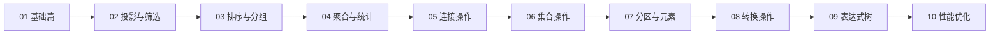

# LINQ — 语言集成查询

LINQ是C#最强大的数据查询能力，从内存集合到数据库，一套语法走天下。

无论你操作的是内存中的 `List<T>`、数据库中的表、XML文档还是JSON数据，LINQ都提供统一的查询模型——**相同的语法，不同的数据源，一致的思维模式**。

## 学习路径



## 章节导航

| 章节 | 说明 | 核心内容 |
|------|------|----------|
| 01 · 基础篇 | LINQ核心概念与语法体系 | 查询语法、方法语法、延迟执行、标准运算符 |
| 02 · 投影与筛选 | 数据的提取与过滤 | Select、SelectMany、Where、OfType |
| 03 · 排序与分组 | 数据的排序与归类 | OrderBy、ThenBy、GroupBy、ToLookup |
| 04 · 聚合与统计 | 数据的汇总计算 | Count、Sum、Average、Min、Max、Aggregate |
| 05 · 连接操作 | 多数据源的关联 | Join、GroupJoin、Zip、交叉连接 |
| 06 · 集合操作 | 集合间的运算 | Union、Intersect、Except、Concat、Distinct |
| 07 · 分区与元素 | 数据的截取与定位 | Take、Skip、First、Single、ElementAt |
| 08 · 转换操作 | 数据形态的变换 | ToList、ToDictionary、AsEnumerable、AsQueryable |
| 09 · 表达式树 | IQueryable的底层机制 | Expression、表达式树构建与解析 |
| 10 · 性能优化 | LINQ的性能陷阱与调优 | 延迟执行陷阱、内存优化、EF Core查询优化 |

## 为什么学习LINQ

::: info 一行代码 vs 循环嵌套
传统方式需要嵌套循环、临时集合、条件判断才能完成的筛选，LINQ一行代码就能表达。
:::

```csharp
// 传统方式：找出价格大于100的活跃商品名称
var result = new List<string>();
foreach (var product in products)
{
    if (product.Price > 100 && product.IsActive)
    {
        result.Add(product.Name);
    }
}

// LINQ方式：同样的逻辑，更清晰的表达
var result = products
    .Where(p => p.Price > 100 && p.IsActive)
    .Select(p => p.Name)
    .ToList();
```

## 适用人群

- 有C#基础，想系统掌握LINQ的开发者
- 使用EF Core进行数据库操作的后端开发者
- 希望写出更简洁、更具表达力代码的程序员
- 面试中需要深入理解LINQ机制的求职者
