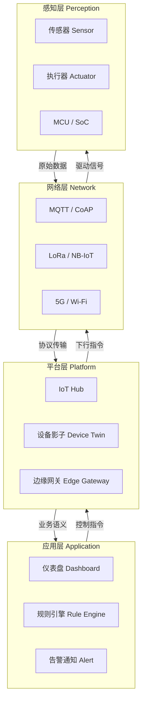
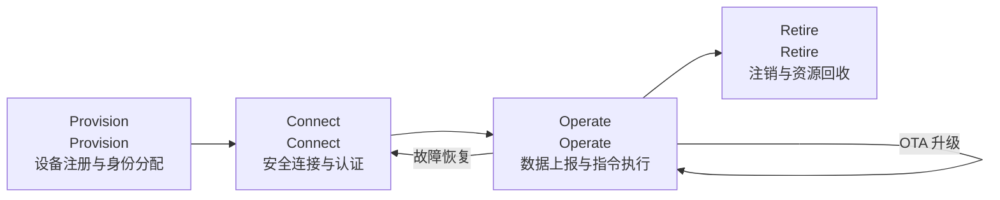

# 物联网架构全景

物联网（IoT）并非单一技术，而是一套从感知到决策的完整技术栈。本文梳理 IoT 四层架构、端-边-云-用模式、行业垂直领域差异，以及设备全生命周期管理——为后续 .NET IoT 开发奠定全局视野。

## 1. IoT 四层架构



### 1.1 感知层（Perception Layer）

| 组件 | 说明 | 典型器件 |
|------|------|----------|
| 传感器 | 将物理量转为电信号 | BME280（温湿度）、MPU6050（加速度） |
| 执行器 | 将电信号转为物理动作 | SG90（舵机）、继电器模块 |
| MCU/SoC | 数据采集与简单处理 | ESP32、STM32、RP2040 |

::: tip 传感器 vs 执行器
传感器是"看"——从环境中获取数据；执行器是"做"——改变环境状态。一个完整的 IoT 节点通常同时包含两者。
:::

### 1.2 网络层（Network Layer）

| 协议 | 场景 | 特点 |
|------|------|------|
| MQTT | 局域网/云端 | 轻量 Pub/Sub，QoS 保证 |
| CoAP | 受限设备 | UDP 基础，类似 HTTP 语义 |
| LoRa | 远距离低功耗 | 数公里覆盖，kbps 级带宽 |
| NB-IoT | 蜂窝物联网 | 运营商网络，广覆盖低功耗 |
| Wi-Fi | 高带宽短距 | 视频流、大量数据 |
| 5G | 超低延迟 | 工业远程控制、自动驾驶 |

### 1.3 平台层（Platform Layer）

- **IoT Hub**：设备接入、身份认证、消息路由
- **设备影子（Device Twin）**：期望状态与上报状态的同步
- **边缘网关**：协议转换、本地过滤、离线自治

### 1.4 应用层（Application Layer）

- **可视化仪表盘**：实时数据展示
- **规则引擎**：条件触发动作（如温度 > 30°C 发告警）
- **告警与通知**：邮件/短信/Webhook 推送

## 2. 端-边-云-用架构模式


| 层级 | 职责 | 典型技术 |
|------|------|----------|
| 端（Device） | 数据采集、执行指令 | ESP32、树莓派、.NET nanoFramework |
| 边（Edge） | 协议转换、本地决策、数据过滤 | Azure IoT Edge、K3s、.NET Worker Service |
| 云（Cloud） | 大规模存储、分析、模型训练 | Azure IoT Hub、AWS IoT Core |
| 用（User） | 人机交互、业务流程 | Web Dashboard、移动 App |

::: important 边缘计算的核心价值
边缘节点不是简单的"中转站"，它的三个核心价值是：**低延迟响应**（本地决策不绕云端）、**带宽优化**（过滤聚合再上传）、**离线自治**（断网时仍可运行）。工业场景中断网 1 秒就可能造成严重损失，边缘自治是刚需。
:::

## 3. 行业垂直领域

### 3.1 智能家居（Smart Home）

- 协议：Zigbee、Z-Wave、Matter、Wi-Fi
- 场景：灯光控制、安防报警、环境监测
- 特点：消费级、低复杂度、高用户体验要求

### 3.2 工业物联网（IIoT）

- 协议：Modbus、OPC UA、MQTT
- 场景：设备监控、预测性维护、产线优化
- 特点：高可靠性、实时性、恶劣环境适应

### 3.3 智慧农业

- 协议：LoRa、NB-IoT
- 场景：土壤监测、灌溉控制、温室管理
- 特点：广覆盖、低功耗、野外部署

### 3.4 智慧城市

- 协议：5G、NB-IoT、LoRaWAN
- 场景：路灯控制、停车管理、环境监测
- 特点：海量设备、多部门协同、数据安全

### 3.5 医疗物联网（IoMT）

- 协议：BLE、Wi-Fi
- 场景：可穿戴监护、远程诊疗、药品追溯
- 特点：数据隐私合规（HIPAA）、高精度要求

## 4. IoT vs IIoT vs IoMT

| 维度 | IoT（消费） | IIoT（工业） | IoMT（医疗） |
|------|-------------|-------------|-------------|
| 可靠性 | 中 | 极高 | 高 |
| 延迟容忍 | 秒级 | 毫秒级 | 亚秒级 |
| 安全等级 | 中 | 高 | 极高（合规） |
| 典型协议 | Wi-Fi/Matter | Modbus/OPC UA | BLE/HL7 |
| 部署规模 | 十~百 | 千~万 | 百~千 |
| 断网容忍 | 可接受 | 不可接受 | 部分可接受 |

## 5. 关键数据与趋势

- 全球 IoT 设备数量：2025 年预计超过 **750 亿台**（IDC）
- 工业物联网市场：2026 年规模达 **1.1 万亿美元**（MarketsandMarkets）
- 边缘计算支出：年复合增长率 **16.5%**（Gartner）
- .NET IoT 生态：System.Device.Gpio 月下载量超 **50 万次**（NuGet）

::: warning 中国市场特殊考量
中国 IoT 市场有独特的协议生态（如 OneNET、阿里云 IoT），网络层以 NB-IoT 和 4G Cat.1 为主流。出海项目需关注协议差异和数据合规（GDPR vs 数据安全法）。
:::

## 6. 设备全生命周期



### 6.1 Provision（注册）

- 为设备分配唯一标识（Device ID、X.509 证书）
- 在 IoT Hub 中注册设备信息
- 写入连接凭据（连接字符串或 SAS Token）

### 6.2 Connect（连接）

- 设备使用 MQTT/HTTPS 连接 IoT Hub
- TLS 双向认证
- 设备影子同步初始状态

### 6.3 Operate（运行）

- 周期性上报遥测数据（Telemetry）
- 接收云端下行指令（C2D Message）
- OTA 固件更新
- 设备影子状态同步

### 6.4 Retire（退役）

- 吊销设备证书
- 从 IoT Hub 注销
- 清理历史数据（GDPR/数据安全法要求）

## 7. .NET 开发者视角

```csharp
// 设备生命周期管理伪代码
public class DeviceLifecycle
{
    public async Task ProvisionAsync(string deviceId)
    {
        // 在 IoT Hub 注册设备
        var device = await registryManager.AddDeviceAsync(new Device(deviceId));
        Console.WriteLine($"设备 {deviceId} 注册成功，Key: {device.Authentication.SymmetricKey.PrimaryKey}");
    }

    public async Task ConnectAsync(string connectionString)
    {
        var client = DeviceClient.CreateFromConnectionString(connectionString, TransportType.Mqtt);
        await client.OpenAsync();
        Console.WriteLine("设备已连接到 IoT Hub");
    }

    public async Task OperateAsync(DeviceClient client, CancellationToken ct)
    {
        while (!ct.IsCancellationRequested)
        {
            var telemetry = new { temperature = Random.Shared.Next(20, 35), humidity = Random.Shared.Next(40, 70) };
            var message = new Message(Encoding.UTF8.GetBytes(JsonSerializer.Serialize(telemetry)));
            await client.SendEventAsync(message);
            await Task.Delay(TimeSpan.FromSeconds(5), ct);
        }
    }

    public async Task RetireAsync(string deviceId)
    {
        await registryManager.RemoveDeviceAsync(deviceId);
        Console.WriteLine($"设备 {deviceId} 已退役");
    }
}
```

> 参考：[Azure IoT Hub 设备生命周期](https://learn.microsoft.com/zh-cn/azure/iot-hub/iot-hub-devguide-device-twins)

## 面试技巧

1. **"IoT 四层架构是什么？"** —— 感知→网络→平台→应用，逐层说明职责和数据流向，重点讲清网络层协议选型逻辑（距离/带宽/功耗三角）。

2. **"边缘计算和云计算的区别？"** —— 边缘强调低延迟、离线自治、带宽优化；云端强调算力、存储、全局分析。二者是互补不是替代。面试时举具体例子：工业场景断网 1 秒阀门未关闭的后果。

3. **"IoT 和 IIoT 有什么不同？"** —— 从可靠性、实时性、安全性、协议生态四个维度对比。强调 IIoT 的 OT（Operational Technology）属性和 IT/OT 融合趋势。

4. **"设备生命周期怎么管理？"** —— Provision→Connect→Operate→Retire 四阶段，重点讲 Provisioning 的安全身份分配（X.509 vs SAS Token）和 Retire 时的凭据回收。

5. **"LoRa 和 NB-IoT 怎么选？"** —— LoRa 适合私有网络、自建基站、低频上报；NB-IoT 适合运营商网络、广覆盖、无需自建基础设施。关键看是否需要双向通信频率和部署成本。
