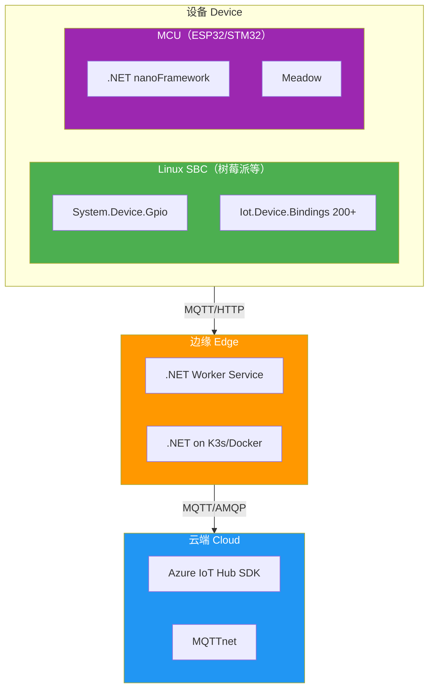
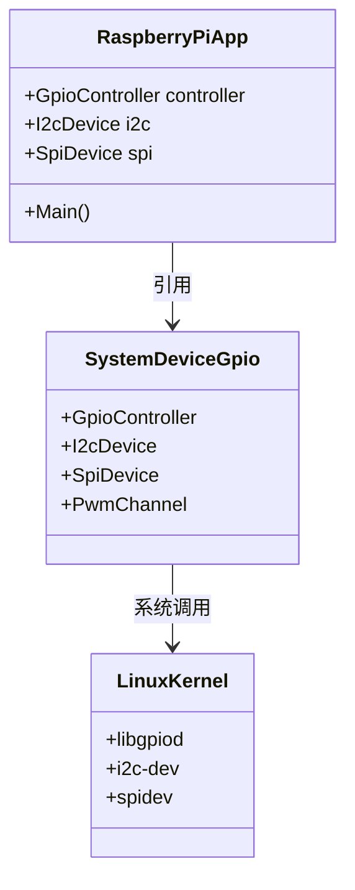

# .NET IoT 生态概览

.NET 在物联网领域的生态远比大多数人想象的成熟——从底层 GPIO 控制到 200+ 设备绑定，从 MCU 上的 nanoFramework 到云端的 Azure IoT SDK，.NET 开发者可以用同一套语言覆盖 IoT 全栈。本文梳理 .NET IoT 的核心库、框架选型与社区资源。

## 1. .NET IoT 技术栈全景



## 2. 核心库详解

### 2.1 System.Device.Gpio

GPIO/I2C/SPI/PWM 的底层访问库，是 .NET IoT 的基石。

| 功能 | 类 | 说明 |
|------|----|------|
| GPIO | `GpioController` | 数字输入输出、中断 |
| I2C | `I2cDevice` | I2C 总线读写 |
| SPI | `SpiDevice` | SPI 全双工通信 |
| PWM | `PwmChannel` | 脉宽调制输出 |

```csharp
// 最简 GPIO 示例：点亮 LED
using System.Device.Gpio;

using var controller = new GpioController();
controller.OpenPin(18, PinMode.Output);
controller.Write(18, PinValue.High);   // LED 亮
await Task.Delay(1000);
controller.Write(18, PinValue.Low);    // LED 灭
```

> 参考：[System.Device.Gpio 官方文档](https://learn.microsoft.com/zh-cn/dotnet/iot/)

::: tip 跨平台驱动
System.Device.Gpio 在 Linux 上使用 libgpiod，Windows IoT 上使用 WinRT API，macOS 上使用 Objective-C 桥接——上层代码无需修改。
:::

### 2.2 Iot.Device.Bindings

200+ 即用型设备绑定库，覆盖传感器、显示屏、马达驱动等。

| 分类 | 示例设备 | NuGet 包 |
|------|----------|----------|
| 温湿度 | BME280、DHT11/22 | `Iot.Device.Bmxx80` |
| 显示屏 | SSD1306 (OLED)、LCD 1602 | `Iot.Device.Ssd1306` |
| ADC | MCP3008、ADS1115 | `Iot.Device.Mcp3xxx` |
| 马达 | A4988 (步进电机)、L298N | `Iot.Device.A4988` |
| GPS | NEO-6M | `Iot.Device.Nmea0183` |
| 距离 | HC-SR04 | `Iot.Device.Hcsr04` |

```csharp
// BME280 温湿度传感器读取
using System.Device.I2c;
using Iot.Device.Bmxx80;
using Iot.Device.Bmxx80.FilteringMode;

var i2cSettings = new I2cConnectionSettings(busId: 1, deviceAddress: Bme280.DefaultI2cAddress);
using var i2cDevice = I2cDevice.Create(i2cSettings);
using var bme280 = new Bme280(i2cDevice);

// 读取一次
var readResult = await bme280.ReadAsync();
Console.WriteLine($"温度: {readResult.Temperature.Celsius:F1}°C");
Console.WriteLine($"湿度: {readResult.Humidity.Percent:F1}%");
Console.WriteLine($"气压: {readResult.Pressure.Hectopascal:F1} hPa");
```

> 参考：[Iot.Device.Bindings GitHub 仓库](https://github.com/dotnet/iot/tree/main/src/devices)

### 2.3 MQTTnet

.NET 生态最成熟的 MQTT 库，支持客户端和服务端。

```csharp
// MQTT 发布者示例
using MQTTnet;
using MQTTnet.Client;

var factory = new MqttFactory();
using var client = factory.CreateMqttClient();

var options = new MqttClientOptionsBuilder()
    .WithTcpServer("broker.emqx.io", 1883)
    .Build();

await client.ConnectAsync(options);

var message = new MqttApplicationMessageBuilder()
    .WithTopic("sensors/temperature")
    .WithPayload("25.3")
    .Build();

await client.PublishAsync(message);
Console.WriteLine("消息已发布");
```

> 参考：[MQTTnet GitHub](https://github.com/dotnet/MQTTnet)

### 2.4 Microsoft.Azure.Devices.Client

Azure IoT Hub 设备端 SDK，支持 MQTT/HTTPS/AMQP。

```csharp
using Microsoft.Azure.Devices.Client;
using System.Text;

var connectionString = "HostName=your-hub.azure-devices.net;DeviceId=myDevice;SharedAccessKey=xxx";
using var deviceClient = DeviceClient.CreateFromConnectionString(connectionString, TransportType.Mqtt);

var telemetry = new Message(Encoding.UTF8.GetBytes("{\"temperature\":25.3}"));
await deviceClient.SendEventAsync(telemetry);
```

> 参考：[Azure IoT Hub Device SDK](https://learn.microsoft.com/zh-cn/azure/iot-hub/iot-hub-devguide-sdks)

## 3. 框架选型对比

### 3.1 全 .NET on Linux SBC（树莓派）



| 优势 | 劣势 |
|------|------|
| 完整 .NET 生态（LINQ、async、DI） | 功耗较高（RPi4 约 3-7W） |
| NuGet 生态直接可用 | 体积较大，不适合嵌入式 |
| 调试/部署体验好 | 启动时间约 1-3 秒 |
| 200+ 设备绑定 | 成本较高（RPi4 约 $35-55） |

### 3.2 .NET nanoFramework on MCU

| 优势 | 劣势 |
|------|------|
| 运行在 MCU（ESP32、STM32） | BCL 子集，不是完整 .NET |
| 低功耗（mA 级） | 无 LINQ、部分异步模式受限 |
| 实时性好 | 生态较小，第三方库少 |
| 成本低（ESP32 约 $3-5） | 调试需要专用工具 |

```csharp
// nanoFramework 上的 GPIO（API 与 System.Device.Gpio 高度一致）
using System.Device.Gpio;

var controller = new GpioController();
controller.OpenPin(2, PinMode.Output);
while (true)
{
    controller.Write(2, PinValue.High);
    Thread.Sleep(500);
    controller.Write(2, PinValue.Low);
    Thread.Sleep(500);
}
```

> 参考：[nanoFramework 官网](https://www.nanoframework.net/)

### 3.3 Meadow (Wilderness Labs)

| 优势 | 劣势 |
|------|------|
| 完整 .NET Standard 2.1 | 硬件选择有限（仅 Meadow 板） |
| 专业 IoT 硬件设计 | 社区规模较小 |
| 内置 Wi-Fi/BLE | 价格较高（$40+） |
| Meadow.Cloud 集成 | 依赖特定生态 |

> 参考：[Wilderness Labs Meadow](https://www.wildernesslabs.co/)

### 3.4 选型决策表

| 场景 | 推荐 | 原因 |
|------|------|------|
| 原型验证/学习 | 树莓派 + 完整 .NET | 开发体验最好，设备绑定丰富 |
| 低功耗 MCU 产品 | nanoFramework | 运行在 ESP32，成本极低 |
| 专业 IoT 产品 | Meadow | 完整 .NET + 专用硬件 |
| 边缘网关 | 树莓派/Jetson + .NET | 需要完整运行时和容器支持 |
| 云端 IoT 服务 | Azure Functions + IoT Hub | 无服务器架构，弹性伸缩 |

::: warning nanoFramework 的 BCL 限制
nanoFramework 实现了 .NET Standard 的子集，以下功能**不可用**：
- `System.Linq` 大部分方法
- `System.Reflection.Emit`
- `System.Threading.Tasks` 部分模式
- `System.Net.Http`（需用 `System.Net.WebRequest` 替代）

迁移现有 .NET 代码到 nanoFramework 时务必先检查 API 兼容性。
:::

## 4. NuGet 包速查

| 包名 | 用途 | 版本 |
|------|------|------|
| `System.Device.Gpio` | GPIO/I2C/SPI/PWM 底层访问 | 3.x |
| `Iot.Device.Bindings` | 200+ 设备绑定元包 | 3.x |
| `MQTTnet` | MQTT 客户端/服务端 | 4.x |
| `Microsoft.Azure.Devices.Client` | Azure IoT Hub 设备 SDK | 1.x |
| `NModbus` | Modbus RTU/TCP 通信 | 3.x |
| `System.IO.Ports` | 串口通信 | 8.x |
| `Newtonsoft.Json` / `System.Text.Json` | JSON 序列化 | - |

::: tip 按需引用 Iot.Device.Bindings
`Iot.Device.Bindings` 是元包，会拉取所有 200+ 设备库。生产环境建议只引用具体设备包，如 `Iot.Device.Bmxx80`、`Iot.Device.Ssd1306`，减小发布体积。
:::

## 5. 社区与资源

| 资源 | 链接 | 说明 |
|------|------|------|
| dotnet/iot GitHub | https://github.com/dotnet/iot | 官方仓库，设备绑定源码 |
| nanoFramework | https://github.com/nanoframework | MCU 上的 .NET |
| MQTTnet | https://github.com/dotnet/MQTTnet | MQTT 协议实现 |
| .NET IoT 文档 | https://learn.microsoft.com/dotnet/iot/ | 微软官方教程 |
| Wilderness Labs | https://www.wildernesslabs.co/ | Meadow 开发板 |
| .NET IoT 示例 | https://github.com/dotnet/iot/tree/main/samples | 官方代码示例 |

## 面试技巧

1. **"System.Device.Gpio 支持哪些硬件接口？"** —— GPIO、I2C、SPI、PWM 四类。强调它只是底层抽象，设备级操作由 Iot.Device.Bindings 提供。

2. **"树莓派上用 .NET 和用 Python 做物联网有什么区别？"** —— .NET 强类型、async/await、完整生态（DI、测试、NuGet）；Python 生态更广（Adafruit、RPi.GPIO）但缺少编译期检查。强调选型取决于团队技术栈。

3. **"nanoFramework 和完整 .NET 的区别？"** —— nanoFramework 运行在 MCU，BCL 是子集，没有完整 LINQ/Reflection；优势是低功耗低成本。强调"不是取代，是不同场景"。

4. **"Iot.Device.Bindings 为什么要单独拆包？"** —— 避免元包臃肿。生产部署只引用需要的设备包（如 `Iot.Device.Bmxx80`），减小发布体积和启动时间。

5. **".NET 在 IoT 领域的劣势是什么？"** —— 社区规模不如 Python/C++、MCU 支持有限（nanoFramework 生态小）、冷启动延迟比原生代码高。诚实回答比回避更有加分。
