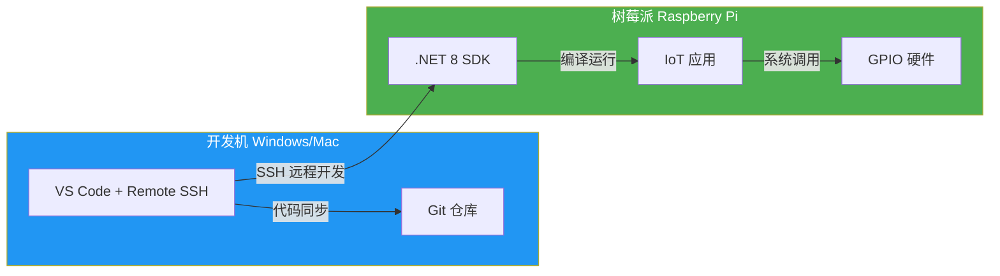

# 开发环境搭建

工欲善其事，必先利其器。本文从零搭建一套完整的 .NET IoT 开发环境：树莓派系统安装→.NET SDK 部署→VS Code 远程开发→第一个 LED 闪烁程序。全程 SSH 无头模式，无需外接显示器。

## 1. 开发工作流全景



## 2. 树莓派系统安装

### 2.1 硬件准备

| 硬件 | 规格 | 备注 |
|------|------|------|
| 树莓派 4B | 4GB 或 8GB 内存 | 推荐 4GB 起步 |
| microSD 卡 | ≥ 32GB, Class 10 / A2 | 推荐 SanDisk Extreme |
| 电源 | USB-C 5V/3A | 必须 3A，否则不稳定 |
| 网线 | Cat5e+ | 或使用 Wi-Fi |

::: warning 电源问题是最常见的坑
树莓派 4B 满载功耗约 7W，如果电源只提供 5V/2A，会出现随机重启、USB 设备掉线、GPIO 行为异常等问题。务必使用官方电源或标注 5V/3A 的适配器。
:::

### 2.2 系统刷写（无头模式）

```bash
# 1. 下载 Raspberry Pi Imager
# https://www.raspberrypi.com/software/

# 2. 选择镜像：Raspberry Pi OS (64-bit) Lite（无桌面版，更省资源）
# 3. 在 Imager 中点击齿轮图标，预先配置：
#    - 开启 SSH（使用密码认证）
#    - 设置用户名/密码（如 pi/raspberry）
#    - 配置 Wi-Fi（SSID + 密码）
# 4. 写入 SD 卡
```

### 2.3 首次连接

```bash
# 方式1：通过主机名连接（mDNS）
ssh pi@raspberrypi.local

# 方式2：通过 IP 连接（路由器后台查看）
ssh pi@192.168.1.100

# 验证系统
uname -a
# Linux raspberrypi 6.6.x #1 SMP aarch64 GNU/Linux

cat /etc/os-release
# VERSION="12 (bookworm)"
```

### 2.4 基础配置

```bash
# 更新系统
sudo apt update && sudo apt upgrade -y

# 启用必要接口
sudo raspi-config
# -> Interface Options -> I2C -> Enable
# -> Interface Options -> SPI  -> Enable
# -> Interface Options -> Serial Port -> Enable (disable login shell, enable hardware)

# 安装依赖
sudo apt install -y libgpiod2 i2c-tools spi-tools
```

## 3. 安装 .NET 8 SDK

### 3.1 自动安装脚本

```bash
# 下载并运行官方安装脚本
curl -sSL https://dot.net/v1/dotnet-install.sh | bash /dev/stdin --channel 8.0

# 添加到 PATH（追加到 ~/.bashrc）
echo 'export DOTNET_ROOT=$HOME/.dotnet' >> ~/.bashrc
echo 'export PATH=$PATH:$DOTNET_ROOT' >> ~/.bashrc
source ~/.bashrc

# 验证安装
dotnet --version
# 8.0.xxx
```

### 3.2 验证 GPIO 访问权限

```bash
# 检查 gpio 用户组
groups $(whoami)
# 如果没有 gpio 组，添加：
sudo usermod -aG gpio $(whoami)

# 重新登录后生效
exit
ssh pi@raspberrypi.local
```

::: important 权限问题
如果运行 .NET 程序时 GPIO 报 `UnauthorizedAccessException`，通常是用户不在 `gpio` 组中。运行 `sudo usermod -aG gpio $USER` 后**必须重新登录**才能生效。
:::

## 4. VS Code 远程开发

### 4.1 安装扩展

在 VS Code 中安装：
1. **Remote - SSH** (`ms-vscode-remote.remote-ssh`)
2. **C# Dev Kit** (`ms-dotnettools.csdevkit`)

### 4.2 配置 SSH 连接

```
# ~/.ssh/config（开发机上）
Host rpi
    HostName raspberrypi.local
    User pi
    IdentityFile ~/.ssh/id_rsa
```

### 4.3 连接并打开项目

1. VS Code → `Ctrl+Shift+P` → `Remote-SSH: Connect to Host` → 选择 `rpi`
2. 连接后在树莓派上创建项目（见下一节）

### 4.4 远程调试配置

```json
// .vscode/launch.json
{
    "version": "0.2.0",
    "configurations": [
        {
            "name": "远程调试 IoT 应用",
            "type": "coreclr",
            "request": "launch",
            "program": "${workspaceFolder}/bin/Debug/net8.0/IotApp.dll",
            "args": [],
            "cwd": "${workspaceFolder}",
            "stopAtEntry": false,
            "console": "integratedTerminal"
        }
    ]
}
```

## 5. 第一个 IoT 程序：LED 闪烁

### 5.1 创建项目

```bash
# 在树莓派上创建项目
mkdir -p ~/iot-projects/BlinkLed
cd ~/iot-projects/BlinkLed
dotnet new console
dotnet add package System.Device.Gpio
```

### 5.2 硬件接线

```
树莓派 GPIO 18 (物理引脚 12)
    │
    ├── 220Ω 电阻
    │
    ├── LED 长脚（正极）
    │
LED 短脚（负极）
    │
树莓派 GND (物理引脚 6)
```

::: tip LED 电阻选择
红色/黄色 LED 正向压降约 2V，绿色约 2.2V，蓝色/白色约 3V。GPIO 输出 3.3V，所以：
- 红色 LED：R = (3.3 - 2.0) / 0.01 = 130Ω，220Ω 安全余量足够
- 蓝色 LED：R = (3.3 - 3.0) / 0.01 = 30Ω，可用 47-100Ω
:::

### 5.3 代码实现

```csharp
// Program.cs
using System.Device.Gpio;

const int ledPin = 18;
using var controller = new GpioController();

controller.OpenPin(ledPin, PinMode.Output);
Console.WriteLine("LED 闪烁程序启动，按 Ctrl+C 退出");

using var cts = new CancellationTokenSource();
Console.CancelKeyPress += (_, e) =>
{
    e.Cancel = true;
    cts.Cancel();
};

try
{
    while (!cts.Token.IsCancellationRequested)
    {
        controller.Write(ledPin, PinValue.High);
        Console.Write("● ");
        await Task.Delay(500, cts.Token);

        controller.Write(ledPin, PinValue.Low);
        Console.Write("○ ");
        await Task.Delay(500, cts.Token);
    }
}
finally
{
    controller.Write(ledPin, PinValue.Low);
    Console.WriteLine("\nLED 已关闭");
}
```

### 5.4 运行

```bash
dotnet run
# ● ○ ● ○ ● ○ ...

# 或发布后运行
dotnet publish -c Release -o ./publish
./publish/BlinkLed
```

## 6. 替代方案

### 6.1 Docker 运行 .NET IoT

```dockerfile
# Dockerfile
FROM mcr.microsoft.com/dotnet/sdk:8.0 AS build
WORKDIR /src
COPY *.csproj .
RUN dotnet restore
COPY . .
RUN dotnet publish -c Release -o /app

FROM mcr.microsoft.com/dotnet/runtime:8.0
WORKDIR /app
COPY --from=build /app .

# 容器内需要 GPIO 设备访问
# --device /dev/gpiomem --device /dev/i2c-1 --device /dev/spidev0.0
ENTRYPOINT ["dotnet", "BlinkLed.dll"]
```

```bash
# 构建并运行（需传入 GPIO 设备）
docker build -t blink-led .
docker run --rm \
    --device /dev/gpiomem \
    --device /dev/i2c-1 \
    blink-led
```

::: warning Docker 中访问 GPIO
Docker 容器默认无法访问主机 GPIO。运行时必须通过 `--device` 参数将 `/dev/gpiomem`、`/dev/i2c-*`、`/dev/spidev*` 等设备映射到容器内。I2C/SPI 还需要对应的内核模块已加载。
:::

### 6.2 Windows IoT Core（已停更）

Windows IoT Core 曾是微软的嵌入式 Windows 方案，但已于 2023 年停止支持。**不建议新项目使用**，现有项目应迁移到 Linux + .NET 方案。

## 7. 树莓派 GPIO 引脚图

```
                    树莓派 4B 40-pin GPIO
            3V3  ● 1   2 ● 5V
     I2C SDA ● 3   4 ● 5V
     I2C SCL ● 5   6 ● GND
      GPIO 4 ● 7   8 ● GPIO 14 (UART TXD)
         GND ● 9  10 ● GPIO 15 (UART RXD)
     GPIO 17 ●11  12 ● GPIO 18 (PWM0)  ← LED 接这里
     GPIO 27 ●13  14 ● GND
     GPIO 22 ●15  16 ● GPIO 23
         3V3 ●17  18 ● GPIO 24
    SPI MOSI ●19  20 ● GND
    SPI MISO ●21  22 ● GPIO 25
    SPI SCLK ●23  24 ● SPI CE0
         GND ●25  26 ● SPI CE1
     I2C ID ●27  28 ● I2C ID
     GPIO 5 ●29  30 ● GND
     GPIO 6 ●31  32 ● GPIO 12 (PWM0)
    GPIO 13 ●33  34 ● GND
    GPIO 16 ●35  36 ● GPIO 16
    GPIO 26 ●37  38 ● GPIO 20
         GND ●39  40 ● GPIO 21
```

> 参考：[Raspberry Pi GPIO 引脚定义](https://www.raspberrypi.com/documentation/computers/raspberry-pi.html#gpio)

## 面试技巧

1. **"如何在树莓派上部署 .NET 应用？"** —— 三种方式：直接安装 SDK + `dotnet run`；`dotnet publish` 后拷贝发布目录；Docker 容器化部署。强调生产环境推荐独立部署（self-contained）或 Docker。

2. **"VS Code 远程开发怎么配置？"** —— Remote-SSH 扩展 + SSH config 配置 + C# Dev Kit。核心是开发机编辑，树莓派上编译运行，GPIO 操作必须在树莓派本地执行。

3. **"Docker 里能访问 GPIO 吗？"** —— 默认不能，需要 `--device /dev/gpiomem` 映射。I2C 和 SPI 同理。面试时强调容器隔离与硬件访问的矛盾。

4. **"为什么选 64 位系统？"** —— .NET 8 已不再支持 32 位 Arm（armhf），必须用 64 位（aarch64）。如果面试官问兼容性，明确说明这是 .NET 8 的硬性要求。

5. **"树莓派电源不足会有什么问题？"** —— 随机重启、USB 设备掉线、GPIO 电平不稳导致传感器读数异常、SD 卡文件系统损坏。这是 IoT 硬件调试中最容易被忽略的问题。
