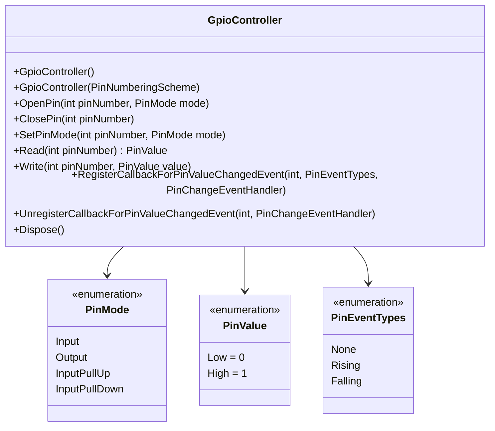
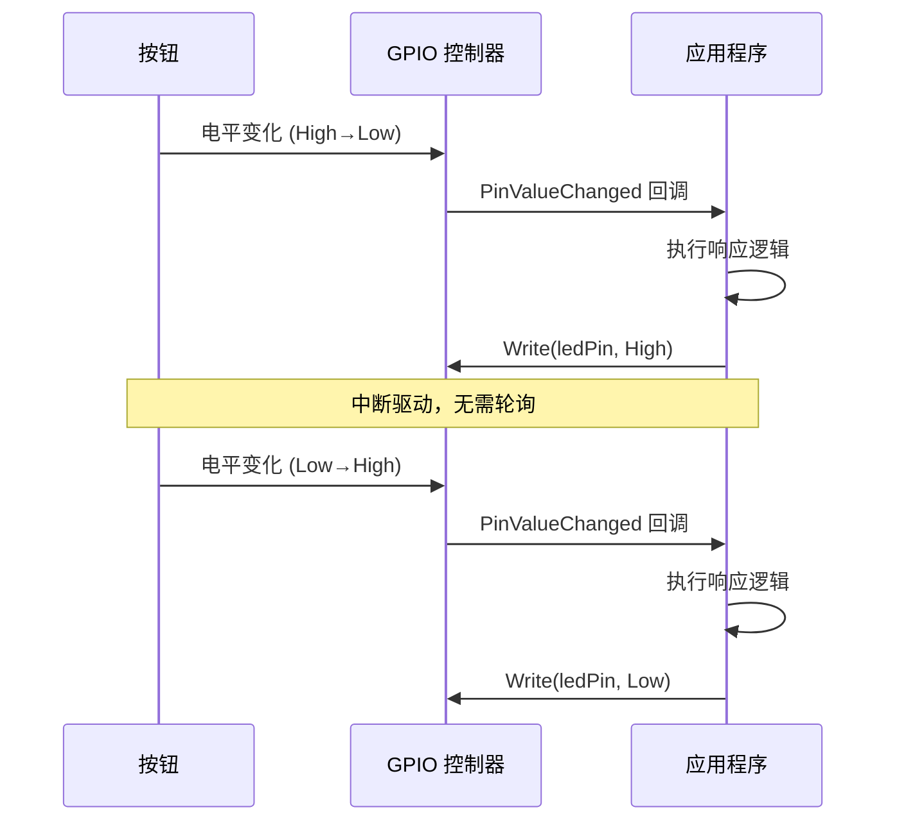

# GPIO 数字输入输出

GPIO（General Purpose Input/Output）是 IoT 开发的起点——一切硬件交互都从数字信号的读写开始。本文深入 System.Device.Gpio 的 API 体系，涵盖输出控制、输入读取、事件中断、去抖动，以及性能优化策略。

## 1. GpioController 核心 API



### 1.1 引脚模式

| 模式 | 说明 | 典型用途 |
|------|------|----------|
| `Output` | 推挽输出，驱动 LED/继电器 | 控制执行器 |
| `Input` | 浮空输入，电平不确定 | 不推荐，噪声大 |
| `InputPullUp` | 内部上拉，默认高电平 | 按钮检测（低有效） |
| `InputPullDown` | 内部下拉，默认低电平 | 按钮检测（高有效） |

::: important 上拉/下拉电阻的必要性
浮空输入引脚会像天线一样拾取环境噪声，读数随机跳变。树莓派内部有可配置的上拉/下拉电阻（约 50kΩ），通过 `InputPullUp`/`InputPullDown` 模式启用。外部电路无上拉/下拉时，**必须**使用内部上拉或下拉。
:::

## 2. 输出：LED 闪烁

### 2.1 硬件接线

```
GPIO 18 ─── 220Ω ─── LED(+) ─── LED(-) ─── GND
```

### 2.2 代码实现

```csharp
using System.Device.Gpio;

const int ledPin = 18;
using var controller = new GpioController();

controller.OpenPin(ledPin, PinMode.Output);

for (int i = 0; i < 10; i++)
{
    controller.Write(ledPin, PinValue.High);
    Console.WriteLine("LED ON");
    Thread.Sleep(500);

    controller.Write(ledPin, PinValue.Low);
    Console.WriteLine("LED OFF");
    Thread.Sleep(500);
}
```

### 2.3 交通灯序列

```csharp
using System.Device.Gpio;

const int redPin = 17;
const int yellowPin = 27;
const int greenPin = 22;

using var controller = new GpioController();

int[] pins = { redPin, yellowPin, greenPin };
foreach (var pin in pins)
{
    controller.OpenPin(pin, PinMode.Output);
}

void SetLight(int pin)
{
    foreach (var p in pins)
        controller.Write(p, PinValue.Low);
    controller.Write(pin, PinValue.High);
}

// 红灯 3s → 绿灯 3s → 黄灯 1s 循环
using var cts = new CancellationTokenSource();
Console.CancelKeyPress += (_, e) => { e.Cancel = true; cts.Cancel(); };

while (!cts.Token.IsCancellationRequested)
{
    SetLight(redPin);
    Task.Delay(3000).Wait();
    SetLight(greenPin);
    Task.Delay(3000).Wait();
    SetLight(yellowPin);
    Task.Delay(1000).Wait();
}

// 清理
foreach (var pin in pins)
    controller.Write(pin, PinValue.Low);
```

## 3. 输入：按钮检测

### 3.1 硬件接线

```
3V3 ─── 按钮 ───┬─── GPIO 17
                │
              10kΩ (外部下拉，或用 InputPullDown)
                │
               GND
```

### 3.2 轮询方式

```csharp
using System.Device.Gpio;

const int buttonPin = 17;
const int ledPin = 18;

using var controller = new GpioController();
controller.OpenPin(buttonPin, PinMode.InputPullDown);
controller.OpenPin(ledPin, PinMode.Output);

Console.WriteLine("按下按钮点亮 LED（轮询模式）...");

while (true)
{
    var buttonState = controller.Read(buttonPin);
    controller.Write(ledPin, buttonState);
    Thread.Sleep(50); // 20Hz 轮询
}
```

::: warning 轮询的问题
轮询方式虽然简单，但存在三个问题：①CPU 持续占用（即使 50ms 间隔）；②事件响应延迟取决于轮询间隔；③漏检极短脉冲（如旋转编码器）。中断方式可以解决这些问题。
:::

### 3.3 事件驱动方式（中断）



```csharp
using System.Device.Gpio;

const int buttonPin = 17;
const int ledPin = 18;

using var controller = new GpioController();
controller.OpenPin(buttonPin, PinMode.InputPullDown);
controller.OpenPin(ledPin, PinMode.Output);

// 注册中断回调
controller.RegisterCallbackForPinValueChangedEvent(
    buttonPin,
    PinEventTypes.Rising | PinEventTypes.Falling,
    (sender, args) =>
    {
        if (args.ChangeType == PinEventTypes.Rising)
        {
            Console.WriteLine("按钮按下");
            controller.Write(ledPin, PinValue.High);
        }
        else if (args.ChangeType == PinEventTypes.Falling)
        {
            Console.WriteLine("按钮释放");
            controller.Write(ledPin, PinValue.Low);
        }
    });

Console.WriteLine("按下按钮点亮 LED（中断模式），按回车退出...");
Console.ReadLine();
```

## 4. 去抖动（Debounce）

机械按钮在按下/释放瞬间会产生多次电平跳变（抖动），通常持续 5-50ms。


### 4.1 简单时间去抖

```csharp
using System.Device.Gpio;

const int buttonPin = 17;
using var controller = new GpioController();
controller.OpenPin(buttonPin, PinMode.InputPullDown);

DateTimeOffset lastChange = DateTimeOffset.MinValue;
TimeSpan debounceTime = TimeSpan.FromMilliseconds(50);

controller.RegisterCallbackForPinValueChangedEvent(
    buttonPin,
    PinEventTypes.Rising | PinEventTypes.Falling,
    (sender, args) =>
    {
        var now = DateTimeOffset.UtcNow;
        if (now - lastChange < debounceTime)
            return; // 忽略抖动

        lastChange = now;
        Console.WriteLine($"按钮事件: {args.ChangeType} @ {now:HH:mm:ss.fff}");
    });

Console.WriteLine("去抖动测试，按回车退出...");
Console.ReadLine();
```

### 4.2 计数器应用（去抖实战）

```csharp
using System.Device.Gpio;

const int buttonPin = 17;
using var controller = new GpioController();
controller.OpenPin(buttonPin, PinMode.InputPullDown);

int count = 0;
DateTimeOffset lastPress = DateTimeOffset.MinValue;

controller.RegisterCallbackForPinValueChangedEvent(
    buttonPin,
    PinEventTypes.Rising,
    (sender, args) =>
    {
        var now = DateTimeOffset.UtcNow;
        if (now - lastPress < TimeSpan.FromMilliseconds(200))
            return;

        lastPress = now;
        count++;
        Console.WriteLine($"点击次数: {count}");
    });

Console.WriteLine("点击计数器，按回车退出...");
Console.ReadLine();
```

## 5. GPIO 中断深入

### 5.1 上升沿与下降沿

| 事件类型 | 含义 | 典型场景 |
|----------|------|----------|
| `PinEventTypes.Rising` | Low → High | 按钮按下（上拉输入） |
| `PinEventTypes.Falling` | High → Low | 按钮按下（下拉输入） |
| `Rising \| Falling` | 任意变化 | 旋转编码器、双边沿检测 |

::: tip 中断 vs 轮询的性能差异
轮询 20Hz（50ms 间隔）CPU 占用约 1-2%，但最大延迟 50ms；中断模式 CPU 占用接近 0%，延迟在微秒级。对于实时性要求高的场景（旋转编码器、脉冲计数），必须使用中断。
:::

### 5.2 多引脚中断

```csharp
using System.Device.Gpio;

const int button1Pin = 17;
const int button2Pin = 27;

using var controller = new GpioController();
controller.OpenPin(button1Pin, PinMode.InputPullDown);
controller.OpenPin(button2Pin, PinMode.InputPullDown);

void OnPinChanged(object sender, PinValueChangedEventArgs args)
{
    string pinName = args.PinNumber switch
    {
        button1Pin => "按钮1",
        button2Pin => "按钮2",
        _ => "未知"
    };
    Console.WriteLine($"{pinName} (GPIO {args.PinNumber}): {args.ChangeType}");
}

controller.RegisterCallbackForPinValueChangedEvent(
    button1Pin, PinEventTypes.Rising | PinEventTypes.Falling, OnPinChanged);
controller.RegisterCallbackForPinValueChangedEvent(
    button2Pin, PinEventTypes.Rising | PinEventTypes.Falling, OnPinChanged);

Console.WriteLine("双按钮测试，按回车退出...");
Console.ReadLine();
```

## 6. Dispose 模式

```csharp
// 推荐：using 声明确保资源释放
using var controller = new GpioController();
controller.OpenPin(18, PinMode.Output);
controller.Write(18, PinValue.High);
// using 结束时自动 ClosePin + 释放底层资源

// 不推荐：忘记释放
var badController = new GpioController();
badController.OpenPin(18, PinMode.Output);
// 如果异常退出，GPIO 引脚状态可能残留
```

::: important 引脚状态管理
`GpioController.Dispose()` 会关闭所有已打开的引脚，但**不会**自动将引脚设为 Low。如果需要确保程序退出时 LED 熄灭，在 `finally` 块中显式 `Write(pin, PinValue.Low)`。
:::

## 7. 性能对比：轮询 vs 中断

| 指标 | 轮询（50ms 间隔） | 中断 |
|------|-------------------|------|
| CPU 占用 | 1-2% | < 0.1% |
| 最大延迟 | 50ms | < 1ms |
| 最小可检脉冲 | ~50ms | ~1μs |
| 代码复杂度 | 低 | 中 |
| 适用场景 | 简单状态查询 | 实时事件响应 |

```csharp
// 高频轮询（仅特殊场景使用，如无中断支持的引脚）
using var controller = new GpioController();
controller.OpenPin(17, PinMode.InputPullDown);

var lastState = controller.Read(17);
var sw = System.Diagnostics.Stopwatch.StartNew();
int changes = 0;

while (sw.Elapsed < TimeSpan.FromSeconds(10))
{
    var currentState = controller.Read(17);
    if (currentState != lastState)
    {
        changes++;
        lastState = currentState;
    }
    // 无延迟：纯轮询，CPU 100% 占用
}

Console.WriteLine($"10 秒内检测到 {changes} 次变化");
```

> 参考：[System.Device.Gpio 官方文档](https://learn.microsoft.com/zh-cn/dotnet/api/system.device.gpio.gpiocontroller)

## 面试技巧

1. **"GPIO 的四种输入模式有什么区别？"** —— Input（浮空，噪声大）、InputPullUp（内部上拉，默认 High）、InputPullDown（内部下拉，默认 Low）。强调浮空输入是反模式，实际项目必须选上拉或下拉。

2. **"轮询和中断怎么选？"** —— 低频状态查询用轮询（简单），实时事件响应用中断（高效）。关键指标：响应延迟、CPU 占用、最小可检脉冲宽度。面试时给具体例子——按钮去抖 50ms 轮询足够，旋转编码器必须中断。

3. **"为什么需要去抖动？"** —— 机械触点在闭合/断开瞬间会弹跳，产生多次电平跳变。硬件方案：RC 滤波电路；软件方案：时间窗口过滤（50ms 内的重复事件忽略）。

4. **"System.Device.Gpio 的 Dispose 做了什么？"** —— 关闭所有打开的引脚，释放 libgpiod 文件描述符。但**不会**重置引脚电平。面试加分点：说明 `finally` 块中显式设 Low 的必要性。

5. **"多个引脚的中断能共用回调吗？"** —— 可以，通过 `PinValueChangedEventArgs.PinNumber` 区分来源。但注意回调在同一个线程执行，耗时操作会阻塞其他引脚的事件处理。
