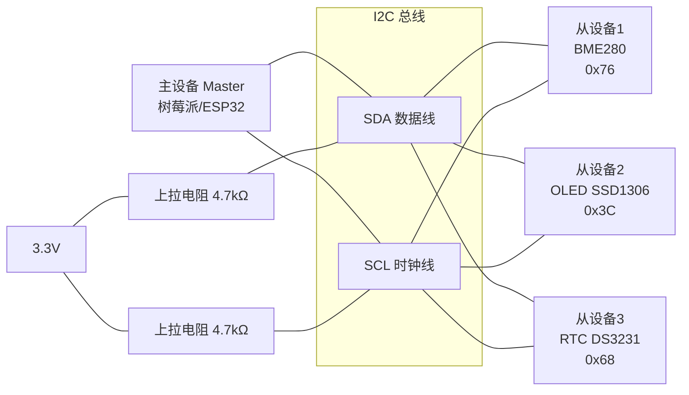
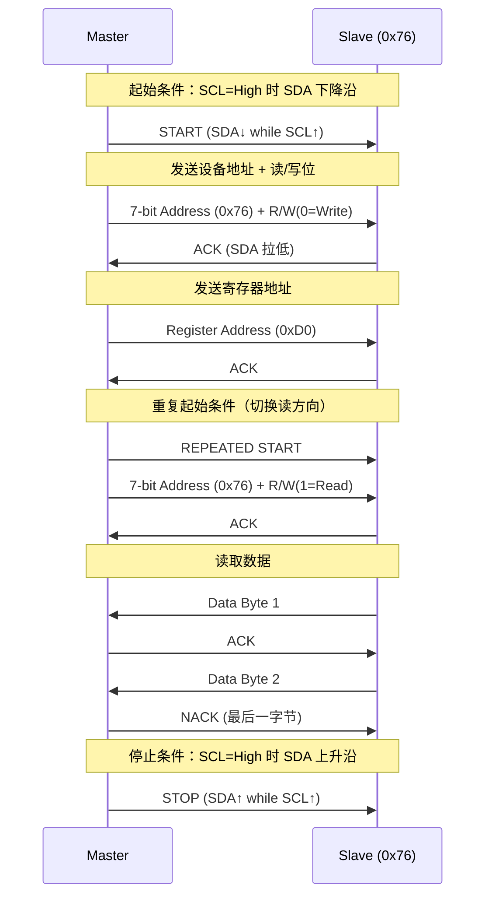
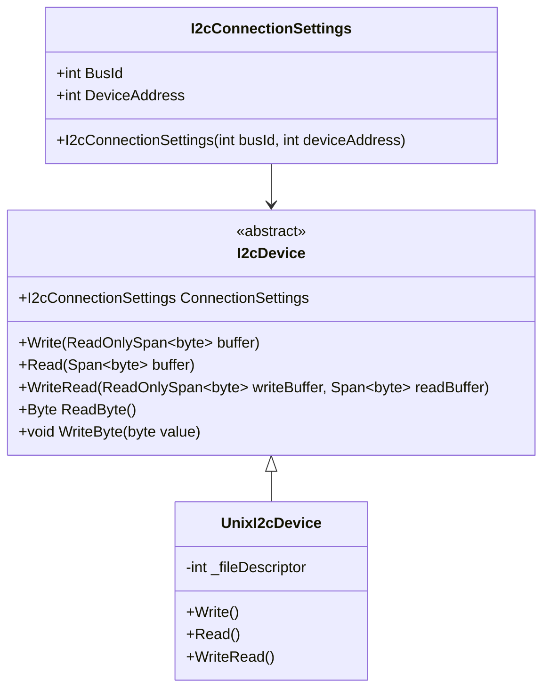
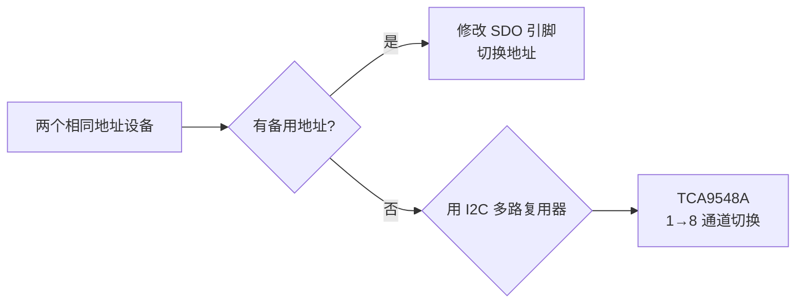

# I2C 总线通信

I2C（Inter-Integrated Circuit）是 IoT 中最常用的芯片级通信总线——两根线挂多个设备，简洁高效。本文从协议原理到 System.Device.I2c 的实战开发，覆盖 BME280 传感器读取、I2C 总线扫描、多设备地址冲突等常见工程问题。

## 1. I2C 协议原理

### 1.1 基本架构



| 特性 | 说明 |
|------|------|
| 线数 | 2（SDA + SCL） |
| 模式 | 主从（Master-Slave），一主多从 |
| 寻址 | 7-bit（0x00-0x7F）或 10-bit |
| 速率 | 标准模式 100kHz / 快速模式 400kHz |
| 距离 | 板级通信，通常 < 1m |

### 1.2 通信时序



### 1.3 速度模式

| 模式 | 速率 | 用途 |
|------|------|------|
| Standard | 100 kHz | 慢速传感器 |
| Fast | 400 kHz | 大多数 IoT 传感器 |
| Fast Plus | 1 MHz | 高速 ADC |
| High Speed | 3.4 MHz | 专业应用 |

::: warning 上拉电阻
I2C 总线是开漏输出，必须外接上拉电阻。树莓派内部有 1.8kΩ 上拉（可软件启用），但通常不够，建议外部接 4.7kΩ 到 3.3V。没有上拉电阻会导致通信失败或数据错乱。
:::

## 2. System.Device.I2c API

### 2.1 核心类



### 2.2 基本读写

```csharp
using System.Device.I2c;

// 创建 I2C 设备（总线1，地址0x76）
var settings = new I2cConnectionSettings(busId: 1, deviceAddress: 0x76);
using var device = I2cDevice.Create(settings);

// 写入单个字节（写寄存器地址）
device.WriteByte(0xD0); // BME280 chip ID 寄存器

// 读取单个字节
byte chipId = device.ReadByte();
Console.WriteLine($"Chip ID: 0x{chipId:X2}"); // 应输出 0x58

// WriteRead：先写寄存器地址，再读数据（最常用模式）
byte[] writeBuffer = { 0xD0 };
byte[] readBuffer = new byte[1];
device.WriteRead(writeBuffer, readBuffer);
Console.WriteLine($"Chip ID: 0x{readBuffer[0]:X2}");

// 读取多个字节
byte[] regAddr = { 0x88 }; // BME280 温度校准数据起始
byte[] calibData = new byte[6];
device.WriteRead(regAddr, calibData);
```

> 参考：[System.Device.I2c 官方文档](https://learn.microsoft.com/zh-cn/dotnet/api/system.device.i2c.i2cdevice)

## 3. 实战：BME280 温湿度气压传感器

### 3.1 硬件接线

```
树莓派          BME280 模块
 3V3 ────────── VIN
 GND ────────── GND
 SDA (GPIO 2) ── SDA
 SCL (GPIO 3) ── SCL
```

### 3.2 使用 Iot.Device.Bindings

```bash
dotnet add package Iot.Device.Bmxx80
dotnet add package Iot.Device.Bindings
```

```csharp
using System.Device.I2c;
using Iot.Device.Bmxx80;
using Iot.Device.Bmxx80.FilteringMode;

// 创建 I2C 连接
var i2cSettings = new I2cConnectionSettings(busId: 1, Bme280.DefaultI2cAddress);
using var i2cDevice = I2cDevice.Create(i2cSettings);
using var bme280 = new Bme280(i2cDevice);

// 设置采样参数（可选，默认即可）
bme280.TemperatureSampling = Sampling.LowPower;
bme280.PressureSampling = Sampling.UltraHighResolution;
bme280.HumiditySampling = Sampling.Standard;

// 读取数据
var result = await bme280.ReadAsync();

Console.WriteLine($"温度: {result.Temperature.Celsius:F2} °C");
Console.WriteLine($"湿度: {result.Humidity.Percent:F1} %");
Console.WriteLine($"气压: {result.Pressure.Hectopascal:F1} hPa");

// 计算海拔（基于海平面标准气压 1013.25 hPa）
double altitude = 44330 * (1 - Math.Pow(result.Pressure.Hectopascal / 1013.25, 1.0 / 5.255));
Console.WriteLine($"估算海拔: {altitude:F0} m");
```

### 3.3 底层寄存器直接操作（理解原理）

```csharp
using System.Device.I2c;

var settings = new I2cConnectionSettings(busId: 1, deviceAddress: 0x76);
using var device = I2cDevice.Create(settings);

// 读取芯片 ID（寄存器 0xD0，应返回 0x58）
byte chipId = ReadRegister8(device, 0xD0);
Console.WriteLine($"Chip ID: 0x{chipId:X2}");

if (chipId != 0x58)
    throw new InvalidOperationException("BME280 未检测到或地址错误");

static byte ReadRegister8(I2cDevice device, byte register)
{
    device.WriteByte(register);
    return device.ReadByte();
}

static ushort ReadRegister16LE(I2cDevice device, byte register)
{
    Span<byte> buffer = stackalloc byte[2];
    device.WriteRead(new[] { register }, buffer);
    return (ushort)(buffer[0] | (buffer[1] << 8));
}
```

::: tip BME280 地址选择
BME280 有两个可能的 I2C 地址：`0x76`（SDO 接 GND）和 `0x77`（SDO 接 VCC）。大多数模块默认使用 `0x76`，购买时确认。`Bme280.DefaultI2cAddress` 常量为 `0x76`，如果模块地址是 `0x77`，使用 `Bme280.SecondaryI2cAddress`。
:::

## 4. I2C 总线扫描器

调试 I2C 时最常用的工具——扫描总线上所有已连接的设备地址。

```csharp
using System.Device.I2c;

const int busId = 1;
Console.WriteLine($"扫描 I2C 总线 {busId}...");
Console.WriteLine("     0  1  2  3  4  5  6  7  8  9  A  B  C  D  E  F");

for (int row = 0; row < 8; row++)
{
    Console.Write($"{row * 16:X2}: ");
    for (int col = 0; col < 16; col++)
    {
        int address = row * 16 + col;
        // 地址 0x00-0x07 和 0x78-0x7F 为保留地址
        if (address < 0x08 || address > 0x77)
        {
            Console.Write("   ");
            continue;
        }

        try
        {
            var settings = new I2cConnectionSettings(busId, address);
            using var device = I2cDevice.Create(settings);
            device.ReadByte(); // 尝试读取，有响应说明设备存在
            Console.Write($"{address:X2} ");
        }
        catch
        {
            Console.Write("-- ");
        }
    }
    Console.WriteLine();
}
```

典型输出：
```
     0  1  2  3  4  5  6  7  8  9  A  B  C  D  E  F
00:                               -- -- -- -- -- -- -- --
10: -- -- -- -- -- -- -- -- -- -- -- -- -- -- -- --
20: -- -- -- -- -- -- -- -- -- -- -- -- -- -- -- --
30: -- -- -- -- -- -- -- -- -- -- -- 3C -- -- -- --
40: -- -- -- -- -- -- -- -- -- -- -- -- -- -- -- --
50: -- -- -- -- -- -- -- -- -- -- -- -- -- -- -- --
60: -- -- -- -- -- -- -- -- 68 -- -- -- -- -- -- --
70: -- -- -- -- -- -- 76 -- --
```
→ 检测到 0x3C（OLED）、0x68（RTC）、0x76（BME280）

## 5. 常见问题与解决

### 5.1 地址冲突

两个相同地址的设备无法挂同一总线。解决方案：



### 5.2 I2C 多路复用器 TCA9548A

```csharp
using System.Device.I2c;

// TCA9548A 地址通常为 0x70
var muxSettings = new I2cConnectionSettings(1, 0x70);
using var mux = I2cDevice.Create(muxSettings);

// 选择通道 0
mux.WriteByte(0x01); // bit0 = 通道0

// 现在可以访问通道0上的设备
var device0Settings = new I2cConnectionSettings(1, 0x76);
using var device0 = I2cDevice.Create(device0Settings);
byte id0 = device0.ReadByte();

// 切换到通道 1
mux.WriteByte(0x02); // bit1 = 通道1

// 访问通道1上的设备
var device1Settings = new I2cConnectionSettings(1, 0x76);
using var device1 = I2cDevice.Create(device1Settings);
byte id1 = device1.ReadByte();
```

### 5.3 总线锁死恢复

当从设备未正确释放 SDA 时，总线会锁死。恢复步骤：

```csharp
// I2C 总线恢复：手动产生 9 个 SCL 时钟
using System.Device.Gpio;

using var controller = new GpioController();
controller.OpenPin(3, PinMode.Output); // SCL

for (int i = 0; i < 9; i++)
{
    controller.Write(3, PinValue.Low);
    Thread.Sleep(1);
    controller.Write(3, PinValue.High);
    Thread.Sleep(1);
}

Console.WriteLine("I2C 总线恢复完成，请重新初始化设备");
```

### 5.4 启用树莓派 I2C

```bash
# 检查 I2C 是否启用
ls /dev/i2c-*
# /dev/i2c-1

# 如果不存在，启用 I2C
sudo raspi-config
# -> Interface Options -> I2C -> Enable

# 安装 i2c-tools
sudo apt install i2c-tools

# 使用 i2cdetect 扫描
i2cdetect -y 1
```

> 参考：[Raspberry Pi I2C 配置](https://www.raspberrypi.com/documentation/computers/config_txt.html#i2c)

## 面试技巧

1. **"I2C 和 SPI 的区别？"** —— I2C 两线多设备（地址寻址），速度较慢（≤400kHz）；SPI 四线（CS 片选），速度更快（可达数十 MHz）。I2C 适合传感器多、布线空间小；SPI 适合高速数据传输。

2. **"I2C 地址冲突怎么解决？"** —— 三种方案：①修改设备地址（SDO 引脚切换 0x76/0x77）；②使用 I2C 多路复用器 TCA9548A；③换用 SPI 接口版本的同型号芯片。

3. **"I2C 总线锁死是什么？怎么恢复？"** —— 从设备在发送数据时异常，未释放 SDA，导致主设备无法产生 START/STOP 条件。恢复方法：切换 SCL 为 GPIO，手动产生 9 个时钟脉冲让从设备完成传输并释放 SDA。

4. **"WriteRead 和分开 Write+Read 有什么区别？"** —— `WriteRead` 在写和读之间发送 Repeated START（而不是 STOP+START），保持总线占用，防止其他主设备抢占总线。多主环境下必须用 `WriteRead`。

5. **"I2C 上拉电阻选多大？"** —— 标准模式 100kHz 用 4.7kΩ，快速模式 400kHz 用 2.2kΩ-4.7kΩ。电阻太大会导致上升沿变慢（RC 时间常数），电阻太小会增加功耗。树莓派内部有 1.8kΩ 上拉，通常外部 4.7kΩ 足够。
