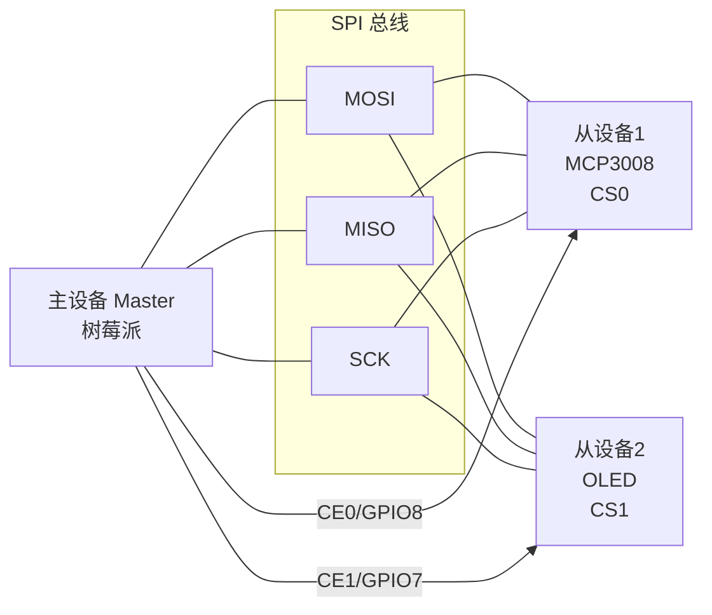
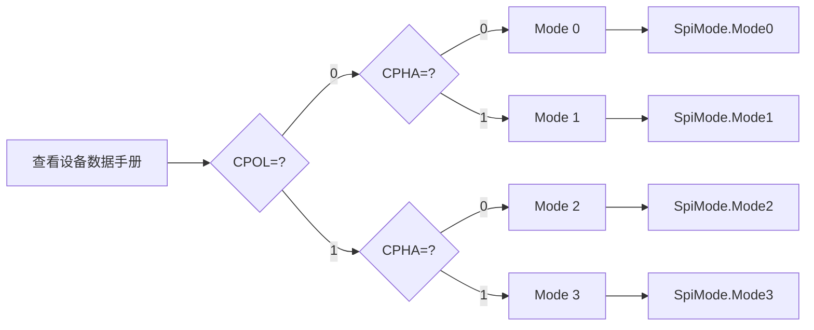
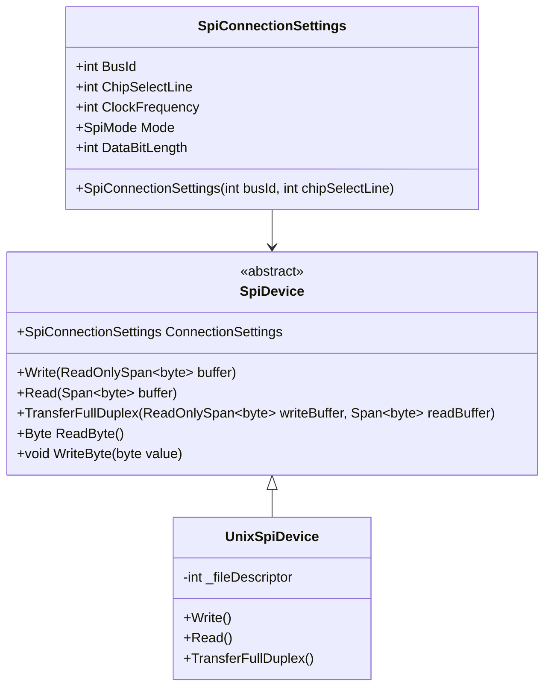

# SPI 高速通信

当 I2C 的 400kHz 不够用——高速 ADC 采样、显示屏刷新、Flash 存储——SPI 是答案。四线全双工、时钟可达数十 MHz，是 IoT 中高速外设通信的首选。本文从 SPI 四种模式到 System.Device.Spi 实战，以 MCP3008 ADC 为例完成模拟信号读取。

## 1. SPI 协议原理

### 1.1 信号线

| 信号 | 方向 | 说明 |
|------|------|------|
| SCK (Serial Clock) | 主→从 | 时钟信号，由主设备驱动 |
| MOSI (Master Out Slave In) | 主→从 | 主设备发送数据 |
| MISO (Master In Slave Out) | 从→主 | 从设备发送数据 |
| CS/CE (Chip Select) | 主→从 | 片选，低电平有效 |



::: tip SPI vs I2C 的根本区别
SPI 用**片选线**（CS）区分设备，每个设备独占一根 CS；I2C 用**地址**区分，共用两线。SPI 的代价是引脚数多（每增加一个设备多一根 CS），优势是全双工、速度快、无地址冲突。
:::

### 1.2 四种工作模式

SPI 模式由 CPOL（时钟极性）和 CPHA（时钟相位）决定：

| 模式 | CPOL | CPHA | 空闲时钟 | 采样边沿 | 典型设备 |
|------|------|------|----------|----------|----------|
| Mode 0 | 0 | 0 | Low | 上升沿 | MCP3008、大多数传感器 |
| Mode 1 | 0 | 1 | Low | 下降沿 | 部分显示屏 |
| Mode 2 | 1 | 0 | High | 下降沿 | 较少 |
| Mode 3 | 1 | 1 | High | 上升沿 | SD 卡、部分 Flash |



::: warning 模式不匹配是最常见的 SPI 错误
主从设备必须使用相同的 SPI 模式。模式不匹配时不会报错（没有 ACK/NACK 机制），但读出的数据全是乱码。调试时第一件事就是确认双方的 CPOL/CPHA 设置。
:::

### 1.3 SPI 信号时序

```
Mode 0 (CPOL=0, CPHA=0):
CS  ‾‾‾‾‾\___________________________________________/‾‾‾‾‾
SCL ______/‾\_/‾\_/‾\_/‾\_/‾\_/‾\_/‾\_/‾\_/‾\________
MOSI ----< D7 >< D6 >< D5 >< D4 >< D3 >< D2 >< D1 >< D0 >---
MISO ----< D7 >< D6 >< D5 >< D4 >< D3 >< D2 >< D1 >< D0 >---

全双工：MOSI 和 MISO 同时传输，每个时钟周期交换 1 bit
```

## 2. System.Device.Spi API

### 2.1 核心类



### 2.2 基本读写

```csharp
using System.Device.Spi;

// 创建 SPI 连接设置
var settings = new SpiConnectionSettings(busId: 0, chipSelectLine: 0)
{
    ClockFrequency = 1_000_000,      // 1 MHz
    Mode = SpiMode.Mode0,            // CPOL=0, CPHA=0
    DataBitLength = 8                 // 每次 8 bit
};

using var device = SpiDevice.Create(settings);

// 全双工传输（SPI 特有：同时发送和接收）
byte[] writeBuffer = { 0x01, 0x80, 0x00 }; // MCP3008 读取通道0
byte[] readBuffer = new byte[3];
device.TransferFullDuplex(writeBuffer, readBuffer);

// 只写
device.Write(new byte[] { 0x0A });

// 只读
byte[] data = new byte[10];
device.Read(data);
```

> 参考：[System.Device.Spi 官方文档](https://learn.microsoft.com/zh-cn/dotnet/api/system.device.spi.spidevice)

## 3. 实战：MCP3008 ADC + 电位器

MCP3008 是 8 通道 10-bit ADC，将模拟信号转为数字值，是树莓派读取模拟传感器（电位器、光敏电阻、温度等）的关键芯片。

### 3.1 硬件接线

```
树莓派              MCP3008
 3V3 ─────────────── VDD (16)
 3V3 ─────────────── VREF (15)
 GND ─────────────── AGND (14)
 GND ─────────────── DGND (9)
 SCLK (GPIO 11) ──── CLK (13)
 MOSI (GPIO 10) ──── DIN (11)
 MISO (GPIO 9)  ──── DOUT (12)
 CE0  (GPIO 8)  ──── CS/SHDN (10)

 电位器:
 3V3 ─── 电位器两端 ─── GND
         中间抽头 ────── CH0 (1)
```

### 3.2 使用 Iot.Device.Bindings

```bash
dotnet add package Iot.Device.Mcp3xxx
```

```csharp
using System.Device.Spi;
using Iot.Device.Mcp3xxx;

var spiSettings = new SpiConnectionSettings(busId: 0, chipSelectLine: 0)
{
    ClockFrequency = 1_000_000,
    Mode = SpiMode.Mode0
};

using var spiDevice = SpiDevice.Create(spiSettings);
using var mcp3008 = new Mcp3008(spiDevice);

Console.WriteLine("MCP3008 ADC 读取（电位器）");
Console.WriteLine("按 Ctrl+C 退出");

using var cts = new CancellationTokenSource();
Console.CancelKeyPress += (_, e) => { e.Cancel = true; cts.Cancel(); };

while (!cts.Token.IsCancellationRequested)
{
    // 读取通道 0
    int rawValue = mcp3008.Read(0);
    double voltage = rawValue * 3.3 / 1023; // 10-bit: 0-1023 → 0-3.3V
    double percentage = rawValue * 100.0 / 1023;

    Console.WriteLine($"原始值: {rawValue,4} | 电压: {voltage:F2}V | 百分比: {percentage:F1}%");
    await Task.Delay(200, cts.Token);
}
```

### 3.3 底层协议解析（理解原理）

MCP3008 的 SPI 协议需要 3 字节传输：

```csharp
using System.Device.Spi;

var settings = new SpiConnectionSettings(0, 0)
{
    ClockFrequency = 1_000_000,
    Mode = SpiMode.Mode0
};

using var device = SpiDevice.Create(settings);

int ReadMcp3008Channel(SpiDevice spi, int channel)
{
    // MCP3008 协议：
    // Byte 0: 0000 0001 (起始位)
    // Byte 1: 1SGG xxxx (S=单端/差分, GG=通道号, 通道0 = 1000 0000)
    // Byte 2: 0000 0000 (空字节，读回低2位结果)

    byte[] writeBuffer = { 0x01, (byte)(0x80 | (channel << 4)), 0x00 };
    byte[] readBuffer = new byte[3];

    spi.TransferFullDuplex(writeBuffer, readBuffer);

    // readBuffer[1] 低2位 + readBuffer[2] 全8位 = 10-bit 结果
    int value = ((readBuffer[1] & 0x03) << 8) | readBuffer[2];
    return value; // 0-1023
}

int adcValue = ReadMcp3008Channel(device, 0);
Console.WriteLine($"ADC 值: {adcValue}");
```

## 4. SPI vs I2C 对比

| 维度 | SPI | I2C |
|------|-----|-----|
| 信号线 | 4（SCK+MOSI+MISO+CS） | 2（SDA+SCL） |
| 双工 | 全双工 | 半双工 |
| 速度 | 通常 1-50 MHz | 100 kHz / 400 kHz |
| 寻址 | 硬件片选（每设备一根 CS） | 软件地址（7-bit） |
| 地址冲突 | 无（片选隔离） | 可能（同地址设备） |
| 距离 | 短（< 30cm） | 稍长（< 1m） |
| 引脚消耗 | 3 + N（N = 从设备数） | 固定 2 |
| 适用场景 | 高速 ADC、显示屏、Flash | 传感器、EEPROM、RTC |

::: important 选型原则
- **用 SPI 的场景**：需要高速数据（>1MHz）、全双工通信、已有 CS 引脚可用
- **用 I2C 的场景**：引脚紧张、多设备共享总线、速度要求不高
- **两者都行的场景**：大多数温湿度/压力传感器同时支持 I2C 和 SPI，看引脚预算决定
:::

## 5. 多 SPI 设备管理

### 5.1 多 CS 线方案

```csharp
using System.Device.Spi;

// 设备1：MCP3008 (CS0)
var settings1 = new SpiConnectionSettings(0, 0) { ClockFrequency = 1_000_000, Mode = SpiMode.Mode0 };
using var device1 = SpiDevice.Create(settings1);

// 设备2：另一个 SPI 设备 (CS1)
var settings2 = new SpiConnectionSettings(0, 1) { ClockFrequency = 5_000_000, Mode = SpiMode.Mode3 };
using var device2 = SpiDevice.Create(settings2);

// 两个设备可以有不同的时钟频率和 SPI 模式
// SpiDevice 会在每次操作时切换配置
```

::: tip 不同设备的时钟频率和模式
SPI 总线上的不同设备可以有不同的时钟频率和模式。System.Device.Spi 会在每次 `TransferFullDuplex` 调用时重新配置总线参数。但注意切换会有少量开销，高频场景建议同一模式的设备挂同一总线。
:::

### 5.2 GPIO 软件片选

当硬件 CS 线不够用时，可以用任意 GPIO 做软件片选：

```csharp
using System.Device.Gpio;
using System.Device.Spi;

const int softCsPin = 25; // 使用 GPIO 25 作为软件片选

using var controller = new GpioController();
controller.OpenPin(softCsPin, PinMode.Output);
controller.Write(softCsPin, PinValue.High); // 默认不选中

// SPI 设备使用 -1 表示无硬件片选
var settings = new SpiConnectionSettings(0, -1) { ClockFrequency = 1_000_000, Mode = SpiMode.Mode0 };
using var spi = SpiDevice.Create(settings);

// 手动片选 + 传输
controller.Write(softCsPin, PinValue.Low);  // 选中设备
byte[] writeData = { 0x01, 0x80, 0x00 };
byte[] readData = new byte[3];
spi.TransferFullDuplex(writeData, readData);
controller.Write(softCsPin, PinValue.High); // 取消选中
```

## 6. 常见陷阱

| 问题 | 原因 | 解决 |
|------|------|------|
| 读数全为 0xFF | SPI 模式不匹配 | 查数据手册，确认 CPOL/CPHA |
| 读数随机乱码 | 时钟频率过高 | 降低 ClockFrequency |
| 通信不稳定 | 连线过长/无地线 | 缩短连线，确保 GND 共地 |
| 部分数据正确 | 数据位长度设置错误 | 确认 DataBitLength 与设备匹配 |
| CS 未生效 | 误用软件片选但设了硬件 CS | 统一片选方案 |

::: warning SPI 连线长度限制
SPI 是同步高速总线，信号反射和串扰会随连线长度增加。经验值：1MHz 时线长不超过 30cm，10MHz 时不超过 10cm。长距离通信请换用 RS-485 或 CAN 总线。
:::

> 参考：[SPI 协议规范](https://www.coreesotech.com/wp-content/uploads/2020/08/SPI_specification.pdf)

## 面试技巧

1. **"SPI 四种模式怎么选？"** —— 看设备数据手册的 CPOL/CPHA 值，直接映射到 `SpiMode.Mode0-3`。MCP3008 是 Mode0，SD 卡是 Mode3。面试时重点讲清 CPOL 决定时钟空闲电平，CPHA 决定采样边沿。

2. **"SPI 全双工是什么意思？"** —— MOSI 和 MISO 同时传输，每个时钟周期主从各交换 1 bit。对比 I2C 的半双工（同一时间只能发或收），SPI 效率更高。`TransferFullDuplex` 是 SPI 的核心方法。

3. **"多 SPI 设备怎么管理？"** —— 每个设备一根 CS 线，传输前拉低对应 CS。硬件 CS 用 `SpiConnectionSettings.ChipSelectLine`，软件 CS 用 GPIO 手动控制。多设备可以有不同的时钟频率和模式。

4. **"MCP3008 的协议为什么这么奇怪？"** —— MCP3008 的 3 字节协议是历史设计：Byte0 是启动信号，Byte1 包含通道配置，Byte2 是空填充。解析时取 Byte1 低2位 + Byte2 全8位拼成 10-bit 值。建议用 `Iot.Device.Mcp3xxx` 封装库避免手写协议。

5. **"SPI 和 I2C 怎么选？"** —— 需要高速（>1MHz）选 SPI，引脚紧张选 I2C。面试加分点：很多传感器同时支持两种接口，I2C 版本通常便宜但速度慢，SPI 版本适合高频采样。
