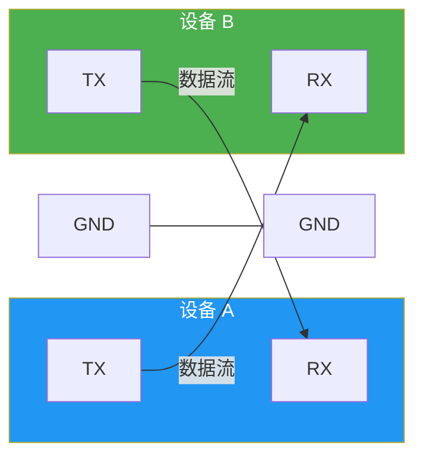

# UART 串口与 PWM

UART 串口是 IoT 中最古老的通信方式之一——两根线、异步通信、调试利器。PWM 则是控制"模拟"输出的数字魔法——电机转速、LED 亮度、舵机角度都靠它。本文覆盖 .NET 中的串口通信与 PWM 输出实战。

## 1. UART 串口通信

### 1.1 基本原理



| 参数 | 说明 | 常见值 |
|------|------|--------|
| BaudRate | 比特率 | 9600, 115200 |
| DataBits | 数据位 | 7, 8 |
| Parity | 校验位 | None, Even, Odd |
| StopBits | 停止位 | 1, 1.5, 2 |

::: tip TX 交叉连接
UART 通信的关键：A 的 TX 接 B 的 RX，A 的 RX 接 B 的 TX。**必须交叉**，并且双方共地（GND 相连）。忘记共地是最常见的串口调试错误。
:::

### 1.2 UART 数据帧

```
空闲(高) ─┐  ┌───┬───┬───┬───┬───┬───┬───┬───┬───┬──────┐ ──── 空闲(高)
           │  │D0 │D1 │D2 │D3 │D4 │D5 │D6 │D7 │ P │ Stop │
           └──┘   │   │   │   │   │   │   │   │   │      │
          Start   └───────────────────────────┘   │      │
                  数据位 (5-8 bit)            Parity  Stop bit(s)
```

## 2. System.IO.Ports.SerialPort

### 2.1 基本操作

```csharp
using System.IO.Ports;

// 获取可用串口
string[] ports = SerialPort.GetPortNames();
Console.WriteLine($"可用串口: {string.Join(", ", ports)}");

// 创建并配置串口
using var serialPort = new SerialPort("/dev/ttyS0", 9600)
{
    DataBits = 8,
    Parity = Parity.None,
    StopBits = StopBits.One,
    ReadTimeout = 1000,
    WriteTimeout = 1000
};

serialPort.Open();

// 写入数据
serialPort.WriteLine("AT"); // 发送 AT 指令
serialPort.Write(new byte[] { 0x01, 0x02, 0x03 }, 0, 3); // 发送原始字节

// 读取数据
string response = serialPort.ReadLine(); // 读取一行（到 \n）
int bytesRead = serialPort.Read(buffer, 0, buffer.Length); // 读取指定长度

serialPort.Close();
```

> 参考：[System.IO.Ports 官方文档](https://learn.microsoft.com/zh-cn/dotnet/api/system.io.ports.serialport)

### 2.2 事件驱动读取

```csharp
using System.IO.Ports;

using var serialPort = new SerialPort("/dev/ttyS0", 9600)
{
    DataBits = 8,
    Parity = Parity.None,
    StopBits = StopBits.One
};

serialPort.Open();

// 注册数据接收事件
serialPort.DataReceived += (sender, args) =>
{
    var sp = (SerialPort)sender;
    int bytesToRead = sp.BytesToRead;
    byte[] buffer = new byte[bytesToRead];
    sp.Read(buffer, 0, bytesToRead);
    string text = System.Text.Encoding.UTF8.GetString(buffer);
    Console.Write($"收到: {text}");
};

Console.WriteLine("串口监听中，按回车退出...");
Console.ReadLine();
```

::: warning DataReceived 事件的线程模型
`DataReceived` 事件在后台线程触发，不在 UI 线程。如果在 WPF/WinForms 中更新 UI，需要使用 `Dispatcher.Invoke` 或 `Control.Invoke` 回到 UI 线程。控制台应用中直接使用即可。
:::

## 3. 实战：NEO-6M GPS 模块

### 3.1 硬件接线

```
树莓派              NEO-6M GPS
 TX (GPIO 14) ────── RX
 RX (GPIO 15) ────── TX
 3V3 ─────────────── VCC
 GND ─────────────── GND
```

### 3.2 NMEA 语句解析

```csharp
using System.IO.Ports;
using System.Text.RegularExpressions;

using var serialPort = new SerialPort("/dev/ttyS0", 9600)
{
    DataBits = 8,
    Parity = Parity.None,
    StopBits = StopBits.One
};

serialPort.Open();

serialPort.DataReceived += (_, _) =>
{
    while (serialPort.BytesToRead > 0)
    {
        string line = serialPort.ReadLine().Trim();

        // 只处理 GPRMC 和 GPGGA 语句
        if (line.StartsWith("$GPRMC") || line.StartsWith("$GNRMC"))
        {
            ParseRMC(line);
        }
        else if (line.StartsWith("$GPGGA") || line.StartsWith("$GNGGA"))
        {
            ParseGGA(line);
        }
    }
};

Console.WriteLine("GPS 数据监听中，按回车退出...");
Console.ReadLine();

void ParseRMC(string sentence)
{
    // $GPRMC,123519,A,4807.038,N,01131.000,E,022.4,084.4,230394,003.1,W*6A
    string[] parts = sentence.Split(',');
    if (parts.Length < 10 || parts[2] != "A") return; // A=有效, V=无效

    double lat = ParseCoordinate(parts[3], parts[4]); // 纬度
    double lon = ParseCoordinate(parts[5], parts[6]); // 经度
    double speed = double.Parse(parts[7]); // 速度（节）
    double course = double.Parse(parts[8]); // 航向（度）

    Console.WriteLine($"[RMC] 位置: {lat:F6}, {lon:F6} | 速度: {speed:F1} 节 | 航向: {course:F1}°");
}

void ParseGGA(string sentence)
{
    // $GPGGA,123519,4807.038,N,01131.000,E,1,08,0.9,545.4,M,47.0,M,,*47
    string[] parts = sentence.Split(',');
    if (parts.Length < 10) return;

    int satellites = int.Parse(parts[7]);
    double hdop = double.Parse(parts[8]);
    double altitude = double.Parse(parts[9]);

    Console.WriteLine($"[GGA] 卫星数: {satellites} | HDOP: {hdop:F1} | 海拔: {altitude:F1}m");
}

double ParseCoordinate(string value, string direction)
{
    // ddmm.mmmm 或 dddmm.mmmm 格式
    double raw = double.Parse(value);
    int degrees = (int)(raw / 100);
    double minutes = raw - degrees * 100;
    double result = degrees + minutes / 60.0;
    return direction is "S" or "W" ? -result : result;
}
```

> 参考：[NMEA 0183 协议](https://www.nmea.org/assets/011620190115AMTAISStandardsManualV4.1.0.pdf)

## 4. PWM 脉宽调制

### 4.1 基本概念


| 参数 | 说明 | 公式 |
|------|------|------|
| Frequency | 频率，每秒周期数 | f = 1/T |
| DutyCycle | 占空比，高电平时间占比 | D = t_high / T |
| 等效电压 | 平均输出电压 | V = Vcc × D |

```
50% 占空比:  ┌──┐  ┌──┐  ┌──┐
             │  │  │  │  │  │
          ───┘  └──┘  └──┘  └──

25% 占空比:  ┌─┐    ┌─┐    ┌─┐
             │ │    │ │    │ │
          ───┘ └────┘ └────┘ └────

75% 占空比:  ┌───┐  ┌───┐  ┌───┐
             │   │  │   │  │   │
          ───┘   └──┘   └──┘   └─
```

### 4.2 System.Device.Pwm API

```csharp
using System.Device.Pwm;

// 创建 PWM 通道
// chip: 0, channel: 0 对应 GPIO 18 (PWM0)
using var pwm = PwmChannel.Create(chip: 0, channel: 0, frequency: 50, dutyCyclePercentage: 0.0);

pwm.Start(); // 启动 PWM 输出

// 设置占空比（0.0 - 1.0）
pwm.DutyCyclePercentage = 0.5; // 50%

// 设置频率
pwm.Frequency = 1000; // 1 kHz

// 同时调频率和占空比
pwm.ChangeDutyCyclePercentage(0.75); // 75%

pwm.Stop(); // 停止 PWM 输出
```

> 参考：[System.Device.Pwm 官方文档](https://learn.microsoft.com/zh-cn/dotnet/api/system.device.pwm.pwmchannel)

## 5. 实战：SG90 舵机控制

### 5.1 舵机原理

SG90 舵机需要 50Hz PWM 信号，脉宽决定角度：

| 角度 | 脉宽 | 占空比 (50Hz) |
|------|------|---------------|
| 0° | 0.5 ms | 2.5% |
| 90° | 1.5 ms | 7.5% |
| 180° | 2.5 ms | 12.5% |

```
50Hz 周期 = 20ms
0.5ms / 20ms = 2.5%    → 0°
1.5ms / 20ms = 7.5%    → 90°
2.5ms / 20ms = 12.5%   → 180°
```

### 5.2 硬件接线

```
树莓派              SG90 舵机
 GPIO 18 (PWM0) ──── 信号线 (橙/黄)
 5V ──────────────── VCC (红)
 GND ─────────────── GND (棕)
```

::: warning 舵机电源
SG90 空载电流约 100mA，堵转可达 700mA。树莓派 5V 引脚最大输出约 1.2A（与 USB 外设共享），多个舵机或负载较重时**务必使用独立电源**，否则会导致树莓派重启。
:::

### 5.3 代码实现

```csharp
using System.Device.Pwm;

const double minDutyCycle = 2.5;  // 0°   → 0.5ms / 20ms
const double maxDutyCycle = 12.5;  // 180° → 2.5ms / 20ms

using var pwm = PwmChannel.Create(chip: 0, channel: 0, frequency: 50, dutyCyclePercentage: 0);
pwm.Start();

Console.WriteLine("SG90 舵机控制（输入 0-180 角度，q 退出）");

while (true)
{
    Console.Write("角度: ");
    string? input = Console.ReadLine();
    if (input == "q") break;

    if (!double.TryParse(input, out double angle)) continue;
    angle = Math.Clamp(angle, 0, 180);

    double dutyCycle = minDutyCycle + (maxDutyCycle - minDutyCycle) * angle / 180.0;
    pwm.DutyCyclePercentage = dutyCycle / 100.0;

    Console.WriteLine($"角度: {angle:F0}° → 占空比: {dutyCycle:F1}%");
}

// 缓慢扫动示例
Console.WriteLine("舵机缓慢扫动 0°→180°→0°...");
for (double angle = 0; angle <= 180; angle += 1)
{
    double dutyCycle = minDutyCycle + (maxDutyCycle - minDutyCycle) * angle / 180.0;
    pwm.DutyCyclePercentage = dutyCycle / 100.0;
    await Task.Delay(15); // ~3 秒完成一次 0→180
}

for (double angle = 180; angle >= 0; angle -= 1)
{
    double dutyCycle = minDutyCycle + (maxDutyCycle - minDutyCycle) * angle / 180.0;
    pwm.DutyCyclePercentage = dutyCycle / 100.0;
    await Task.Delay(15);
}

pwm.Stop();
```

## 6. LED 亮度控制（PWM）

```csharp
using System.Device.Pwm;

// LED 呼吸灯效果
using var pwm = PwmChannel.Create(chip: 0, channel: 0, frequency: 1000, dutyCyclePercentage: 0);
pwm.Start();

Console.WriteLine("LED 呼吸灯，按 Ctrl+C 退出");

using var cts = new CancellationTokenSource();
Console.CancelKeyPress += (_, e) => { e.Cancel = true; cts.Cancel(); };

while (!cts.Token.IsCancellationRequested)
{
    // 渐亮
    for (double d = 0; d <= 1.0; d += 0.01)
    {
        pwm.DutyCyclePercentage = d;
        await Task.Delay(10, cts.Token);
    }

    // 渐暗
    for (double d = 1.0; d >= 0; d -= 0.01)
    {
        pwm.DutyCyclePercentage = d;
        await Task.Delay(10, cts.Token);
    }
}

pwm.Stop();
```

## 7. 硬件 PWM vs 软件 PWM

| 特性 | 硬件 PWM | 软件 PWM |
|------|----------|----------|
| 精度 | 高（硬件计时器） | 低（受线程调度影响） |
| CPU 占用 | 接近 0 | 中（需持续 GPIO 操作） |
| 频率上限 | 数十 MHz | 数十 kHz |
| 可用引脚 | 有限（RPi4 仅 GPIO 12/13/18/19） | 任意 GPIO |
| 适用场景 | 舵机、电机控制 | LED 调光等低精度场景 |

::: important 树莓派 4 的硬件 PWM 引脚
RPi4 有两个 PWM 通道，每个通道两根引脚（可互换）：
- PWM0: GPIO 12 (物理引脚 32) 或 GPIO 18 (物理引脚 12)
- PWM1: GPIO 13 (物理引脚 33) 或 GPIO 19 (物理引脚 35)

其他引脚只能做软件 PWM。舵机控制必须用硬件 PWM 以保证时序精度。
:::

## 8. 电机速度控制（L298N H 桥）

```csharp
using System.Device.Gpio;
using System.Device.Pwm;

// L298N 接线
const int in1Pin = 17;  // 方向控制1
const int in2Pin = 27;  // 方向控制2
// PWM 接 GPIO 18 控制速度

using var controller = new GpioController();
controller.OpenPin(in1Pin, PinMode.Output);
controller.OpenPin(in2Pin, PinMode.Output);

using var pwm = PwmChannel.Create(0, 0, frequency: 1000, dutyCyclePercentage: 0);
pwm.Start();

// 正转
controller.Write(in1Pin, PinValue.High);
controller.Write(in2Pin, PinValue.Low);
pwm.DutyCyclePercentage = 0.5; // 50% 速度
await Task.Delay(2000);

// 加速
pwm.DutyCyclePercentage = 0.8; // 80% 速度
await Task.Delay(2000);

// 反转
controller.Write(in1Pin, PinValue.Low);
controller.Write(in2Pin, PinValue.High);
pwm.DutyCyclePercentage = 0.5;
await Task.Delay(2000);

// 停止
controller.Write(in1Pin, PinValue.Low);
controller.Write(in2Pin, PinValue.Low);
pwm.DutyCyclePercentage = 0;
pwm.Stop();
```

## 9. UART 调试技巧

| 工具 | 用途 | 命令 |
|------|------|------|
| `minicom` | 串口终端 | `minicom -D /dev/ttyS0 -b 9600` |
| `screen` | 串口终端 | `screen /dev/ttyS0 9600` |
| `stty` | 查看串口配置 | `stty -F /dev/ttyS0` |
| `cat` | 读取原始数据 | `cat /dev/ttyS0` |
| `echo` | 发送数据 | `echo -n "AT" > /dev/ttyS0` |

::: warning 树莓派串口配置
树莓派 4 有两个串口：`/dev/ttyS0`（mini UART）和 `/dev/ttyAMA0`（PL011）。默认蓝牙占用 PL011，mini UART 给 GPIO 14/15。如果需要更稳定的串口通信，可以在 `/boot/config.txt` 中添加 `dtoverlay=disable-bt` 将 PL011 释放给 GPIO。
:::

## 面试技巧

1. **"UART 和 I2C/SPI 的区别？"** —— UART 是异步点对点（无时钟线，靠约定波特率），I2C/SPI 是同步总线。UART 适合长距离（RS-485 可达千米），I2C/SPI 适合板级通信。强调"异步"意味着双方必须波特率一致。

2. **"PWM 控制舵机的原理？"** —— 50Hz 信号，脉宽 0.5-2.5ms 对应 0-180°。本质是占空比映射到角度。面试加分点：解释为什么频率必须是 50Hz（舵机内部电路设计决定），过高或过低都无法正确驱动。

3. **"硬件 PWM 和软件 PWM 的区别？"** —— 硬件 PWM 由独立计时器产生，不占 CPU，精度高；软件 PWM 用 GPIO 模拟，受线程调度影响，精度低但引脚灵活。舵机控制必须用硬件 PWM。

4. **"串口通信为什么需要共地？"** —— 信号电压是相对于 GND 的参考。不共地时两端参考电平不同，接收端无法正确判断 0/1。这是串口调试中排名第一的坑。

5. **"NMEA 语句怎么解析？"** —— 按 `,` 分割，根据语句类型（$GPRMC/$GPGGA）提取字段。坐标是 ddmm.mmmm 格式，需要转换为十进制度。面试时现场写一个 `ParseCoordinate` 函数很有加分。
