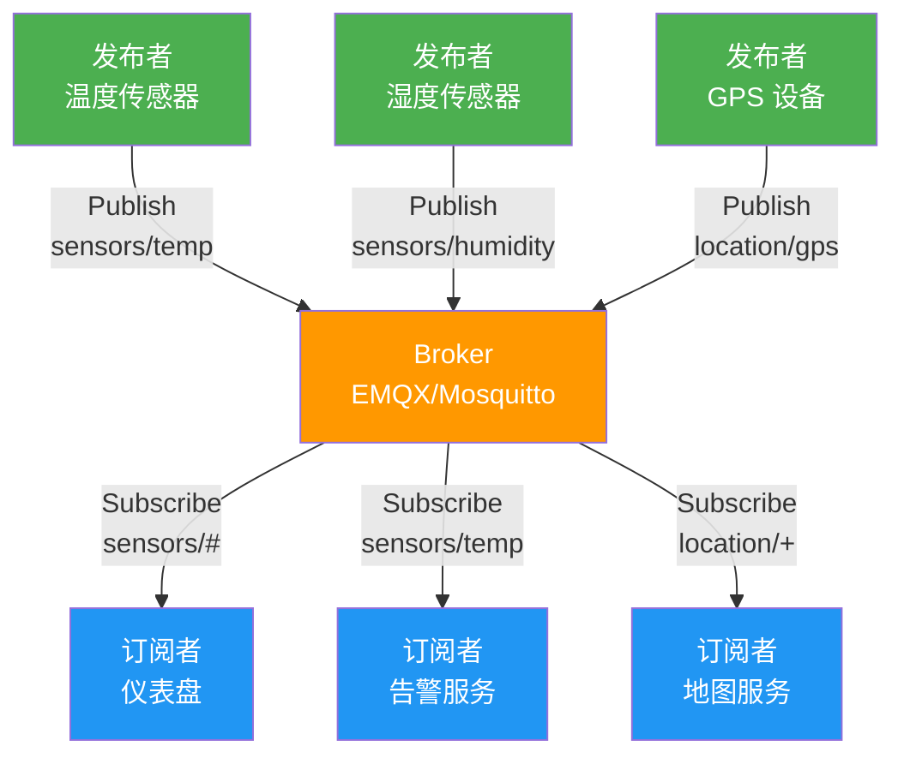
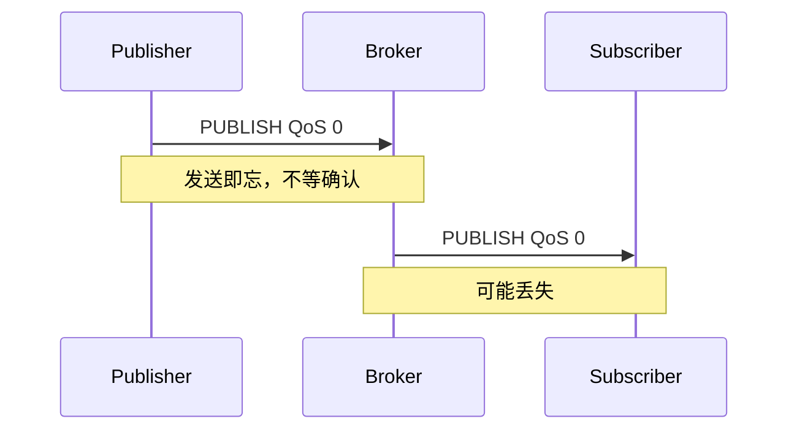
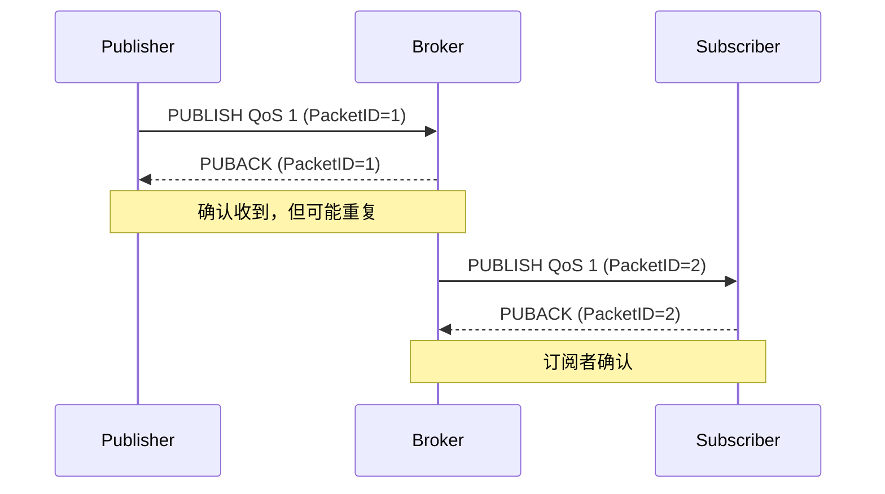
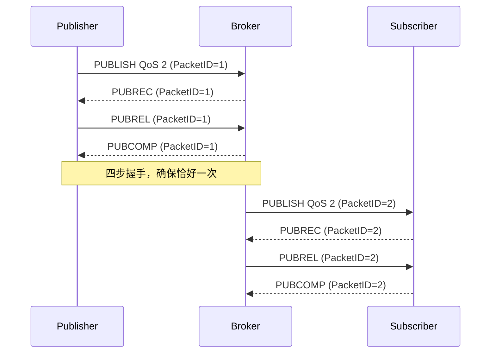

# MQTT 协议深度

MQTT 是 IoT 通信的事实标准——轻量、可靠、支持弱网环境。本文从 Pub/Sub 模型到 QoS 保证、从 LWT 到 MQTT 5.0 新特性，用 MQTTnet 构建完整的 .NET 发布/订阅系统。

## 1. MQTT 核心模型

### 1.1 Pub/Sub 架构



| 概念 | 说明 |
|------|------|
| Broker | 消息中间件，负责消息路由 |
| Publisher | 向 Broker 发布消息 |
| Subscriber | 从 Broker 订阅消息 |
| Topic | 消息主题，层级分隔用 `/` |
| Payload | 消息内容（二进制） |

### 1.2 Topic 层级与通配符

| 通配符 | 含义 | 示例 | 匹配 |
|--------|------|------|------|
| `+` | 单层通配 | `sensors/+/temp` | `sensors/room1/temp` |
| `#` | 多层通配 | `sensors/#` | `sensors/room1/temp`、`sensors/room2/humidity` |
| 无 | 精确匹配 | `sensors/room1/temp` | 仅 `sensors/room1/temp` |

```
sensors/room1/temp       ← 精确
sensors/room1/humidity   ← 精确
sensors/+/temp            ← 匹配任意房间的温度
sensors/room1/+           ← 匹配 room1 的所有传感器
sensors/#                 ← 匹配所有传感器数据
$SYS/#                    ← Broker 系统主题（$ 开头，# 不匹配）
```

::: important Topic 设计最佳实践
- 层级从左到右由宽到窄：`区域/设备/数据类型`（如 `factory1/line2/temperature`）
- 避免过深层级（建议 ≤ 5 层）
- 不要在 Topic 中传递业务数据（如 `sensor/{id}` 而非 `sensor/12345`）
- `$` 开头的 Topic 不会匹配 `#` 通配符
:::

## 2. QoS 服务质量

### 2.1 QoS 0 —— 最多一次（At Most Once）



```csharp
var message = new MqttApplicationMessageBuilder()
    .WithTopic("sensors/temperature")
    .WithPayload("25.3")
    .WithQualityOfServiceLevel(MQTTnet.Protocol.MqttQualityOfServiceLevel.AtMostOnce)
    .Build();
```

### 2.2 QoS 1 —— 至少一次（At Least Once）



```csharp
var message = new MqttApplicationMessageBuilder()
    .WithTopic("sensors/temperature")
    .WithPayload("25.3")
    .WithQualityOfServiceLevel(MQTTnet.Protocol.MqttQualityOfServiceLevel.AtLeastOnce)
    .Build();
```

### 2.3 QoS 2 —— 恰好一次（Exactly Once）



```csharp
var message = new MqttApplicationMessageBuilder()
    .WithTopic("sensors/temperature")
    .WithPayload("25.3")
    .WithQualityOfServiceLevel(MQTTnet.Protocol.MqttQualityOfServiceLevel.ExactlyOnce)
    .Build();
```

### 2.4 QoS 选型

| QoS | 延迟 | 可靠性 | 开销 | 适用场景 |
|-----|------|--------|------|----------|
| 0 | 最低 | 可能丢 | 最小 | 高频遥测（丢几条无所谓） |
| 1 | 中 | 可能重复 | 中 | 大多数 IoT 场景 |
| 2 | 最高 | 不丢不重 | 最大 | 关键指令（如关阀） |

::: warning QoS 降级规则
MQTT 协议规定：最终消息的 QoS 取发布者和订阅者中**较低**的那个。如果发布者用 QoS 2，但订阅者订阅时指定 QoS 0，实际消息按 QoS 0 投递。设计时注意订阅端的 QoS 设置。
:::

## 3. 高级特性

### 3.1 Last Will and Testament（LWT）

设备异常断线时，Broker 自动发布其遗嘱消息。

```csharp
var options = new MqttClientOptionsBuilder()
    .WithTcpServer("broker.emqx.io", 1883)
    .WithClientId("device-001")
    .WithWillMessage(new MqttApplicationMessageBuilder()
        .WithTopic("devices/device-001/status")
        .WithPayload("offline")
        .WithQualityOfServiceLevel(MQTTnet.Protocol.MqttQualityOfServiceLevel.AtLeastOnce)
        .WithRetainFlag(true)
        .Build())
    .Build();
```

::: tip LWT 的典型用途
- 设备上下线监控：遗嘱 Topic 设为 `devices/{id}/status`，payload 为 `offline`
- 连接时立即发布 `online` 到同一 Topic
- 监控端订阅 `devices/+/status` 即可实时感知所有设备状态
:::

### 3.2 Retained Message（保留消息）

Broker 保存最新一条保留消息，新订阅者立即收到。

```csharp
// 发布保留消息
var message = new MqttApplicationMessageBuilder()
    .WithTopic("devices/device-001/config")
    .WithPayload("{\"interval\":5000}")
    .WithRetainFlag(true)
    .Build();

await client.PublishAsync(message);

// 新订阅者订阅后立即收到此消息
```

### 3.3 Clean Session vs Persistent Session

| 模式 | 行为 | 适用 |
|------|------|------|
| Clean Session = true | 连接时清除所有状态，断线后消息丢弃 | 短连接、临时设备 |
| Clean Session = false | 断线期间 Broker 缓存 QoS 1/2 消息 | 长连接、需要离线消息 |

```csharp
// Clean Session（默认）
var options = new MqttClientOptionsBuilder()
    .WithTcpServer("broker.emqx.io")
    .WithCleanSession(true)
    .Build();

// Persistent Session
var options = new MqttClientOptionsBuilder()
    .WithTcpServer("broker.emqx.io")
    .WithCleanSession(false)
    .WithClientId("persistent-device-001") // 持久会话必须有固定 ClientId
    .Build();
```

## 4. MQTTnet 实战

### 4.1 安装

```bash
dotnet add package MQTTnet
```

### 4.2 完整的发布者（传感器模拟）

```csharp
using MQTTnet;
using MQTTnet.Client;
using System.Text.Json;

var factory = new MqttFactory();
using var client = factory.CreateMqttClient();

var options = new MqttClientOptionsBuilder()
    .WithTcpServer("broker.emqx.io", 1883)
    .WithClientId($"sensor-{Environment.MachineName}")
    .WithWillMessage(new MqttApplicationMessageBuilder()
        .WithTopic("devices/sensor-001/status")
        .WithPayload("offline")
        .WithRetainFlag(true)
        .Build())
    .Build();

// 连接
await client.ConnectAsync(options);
Console.WriteLine("已连接到 Broker");

// 上线通知
var onlineMsg = new MqttApplicationMessageBuilder()
    .WithTopic("devices/sensor-001/status")
    .WithPayload("online")
    .WithRetainFlag(true)
    .Build();
await client.PublishAsync(onlineMsg);

// 定时发布传感器数据
using var cts = new CancellationTokenSource();
Console.CancelKeyPress += (_, e) => { e.Cancel = true; cts.Cancel(); };

while (!cts.Token.IsCancellationRequested)
{
    var sensorData = new
    {
        deviceId = "sensor-001",
        temperature = 20 + Random.Shared.NextDouble() * 15,
        humidity = 40 + Random.Shared.NextDouble() * 30,
        timestamp = DateTime.UtcNow
    };

    var message = new MqttApplicationMessageBuilder()
        .WithTopic("sensors/room1/data")
        .WithPayload(JsonSerializer.Serialize(sensorData))
        .WithQualityOfServiceLevel(MQTTnet.Protocol.MqttQualityOfServiceLevel.AtLeastOnce)
        .Build();

    await client.PublishAsync(message, CancellationToken.None);
    Console.WriteLine($"已发布: {sensorData.temperature:F1}°C / {sensorData.humidity:F1}%");
    await Task.Delay(5000, cts.Token);
}

// 优雅断开
var disconnectOptions = new MqttClientDisconnectOptionsBuilder()
    .WithReason(MQTTnet.Client.Disconnecting.MqttClientDisconnectOptionsReason.NormalDisconnection)
    .Build();
await client.DisconnectAsync(disconnectOptions);
```

### 4.3 完整的订阅者（数据接收）

```csharp
using MQTTnet;
using MQTTnet.Client;
using System.Text.Json;

var factory = new MqttFactory();
using var client = factory.CreateMqttClient();

// 消息处理回调
client.ApplicationMessageReceivedAsync += e =>
{
    string topic = e.ApplicationMessage.Topic;
    string payload = System.Text.Encoding.UTF8.GetString(e.ApplicationMessage.PayloadSegment);
    Console.WriteLine($"[{topic}] {payload}");

    // 解析 JSON
    if (topic.StartsWith("sensors/"))
    {
        try
        {
            var data = JsonSerializer.Deserialize<SensorData>(payload);
            Console.WriteLine($"  → 温度: {data.Temperature:F1}°C, 湿度: {data.Humidity:F1}%");
        }
        catch (JsonException ex)
        {
            Console.WriteLine($"  → JSON 解析失败: {ex.Message}");
        }
    }

    return Task.CompletedTask;
};

var options = new MqttClientOptionsBuilder()
    .WithTcpServer("broker.emqx.io", 1883)
    .WithClientId($"dashboard-{Guid.NewGuid():N}")
    .WithCleanSession(true)
    .Build();

await client.ConnectAsync(options);

// 订阅主题
var subscribeOptions = new MqttClientSubscribeOptionsBuilder()
    .WithTopicFilter("sensors/#")
    .WithTopicFilter("devices/+/status")
    .Build();

await client.SubscribeAsync(subscribeOptions);
Console.WriteLine("已订阅 sensors/# 和 devices/+/status");
Console.WriteLine("按回车退出...");
Console.ReadLine();

await client.DisconnectAsync();
record SensorData(string DeviceId, double Temperature, double Humidity, DateTime Timestamp);
```

## 5. Broker 选型

| Broker | 开源 | 性能 | 特点 |
|--------|------|------|------|
| EMQX | 是（基础版） | 百万级连接 | 企业级、规则引擎、MQTT 5.0 |
| Mosquitto | 是 | 万级连接 | 轻量、易部署、适合开发测试 |
| HiveMQ | 否 | 百万级连接 | 商业版、扩展性强 |
| VerneMQ | 是 | 十万级连接 | 分布式、高可用 |

```bash
# Docker 快速启动 Mosquitto（开发测试用）
docker run -d --name mosquitto -p 1883:1883 -p 9001:9001 eclipse-mosquitto

# Docker 启动 EMQX（生产级）
docker run -d --name emqx -p 1883:1883 -p 8083:8083 -p 18083:18083 emqx/emqx
# 管理界面: http://localhost:18083 (admin/public)
```

## 6. MQTT 5.0 新特性

| 特性 | 说明 | 用途 |
|------|------|------|
| Reason Code | 断开/拒绝原因码 | 精确诊断连接问题 |
| Shared Subscription | `$share/group/topic` | 负载均衡 |
| Topic Alias | 用数字替代长 Topic 名 | 减少带宽消耗 |
| Message Expiry | 消息过期时间 | 过时数据自动丢弃 |
| User Property | 键值对元数据 | 自定义扩展 |

```csharp
// MQTT 5.0 共享订阅（负载均衡）
var subscribeOptions = new MqttClientSubscribeOptionsBuilder()
    .WithTopicFilter("$share/group1/sensors/#") // 共享订阅
    .Build();

// MQTT 5.0 消息属性
var message = new MqttApplicationMessageBuilder()
    .WithTopic("sensors/temperature")
    .WithPayload("25.3")
    .WithMessageExpiryInterval(60) // 60 秒后过期
    .WithContentType("application/json")
    .WithResponseTopic("commands/response")
    .WithCorrelationData(Guid.NewGuid().ToByteArray())
    .Build();
```

> 参考：[MQTT 5.0 规范](https://docs.oasis-open.org/mqtt/mqtt/v5.0/mqtt-v5.0.html)

## 面试技巧

1. **"MQTT 的 QoS 三个级别分别适用什么场景？"** —— QoS0 用于高频遥测（丢几条无所谓），QoS1 用于大多数场景（可能重复但应用层去重），QoS2 用于关键指令（如关阀门，不允许丢和重）。面试时强调 QoS2 开销大，大多数场景用 QoS1。

2. **"什么是 LWT？怎么用？"** —— Last Will and Testament，设备连接时注册遗嘱消息，异常断线后 Broker 自动发布。典型用法：上线发 `online`，遗嘱发 `offline`，监控端订阅 `devices/+/status`。

3. **"MQTT Topic 通配符 `+` 和 `#` 的区别？"** —— `+` 匹配单层（`sensors/+/temp`），`#` 匹配多层且只能在末尾（`sensors/#`）。`#` 不能匹配 `$` 开头的系统主题。面试时手写几个 Topic 匹配示例。

4. **"MQTT 5.0 比 3.1.1 有什么改进？"** —— Reason Code（诊断更精确）、Shared Subscription（消费者组负载均衡）、Topic Alias（减少带宽）、Message Expiry（消息过期）、User Property（自定义元数据）。实际项目从 3.1.1 迁移到 5.0 主要是为了共享订阅和原因码。

5. **"MQTTnet 发布消息时 QoS1 可能重复，怎么处理？"** —— 应用层去重：在 Payload 中携带唯一消息 ID（如 GUID 或时间戳+序列号），消费端维护最近消息 ID 缓存，重复 ID 直接丢弃。或者用 QoS2，但性能代价较大。
