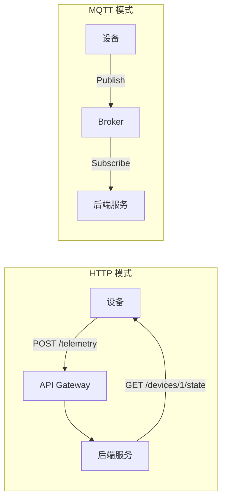
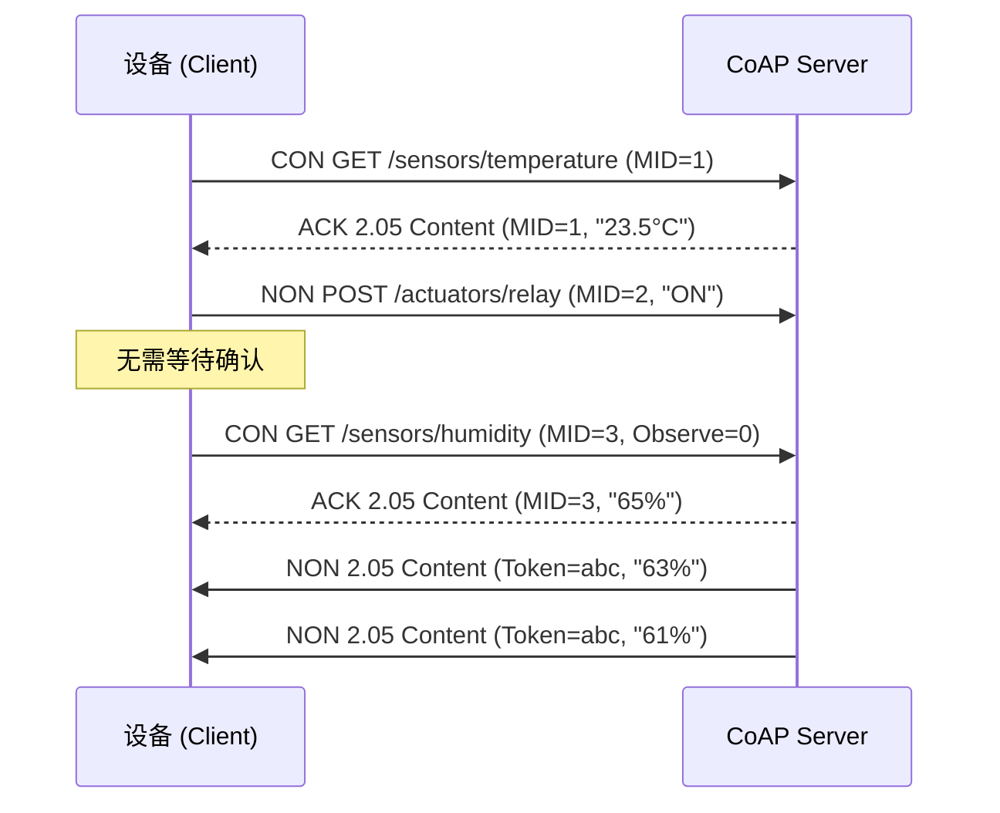
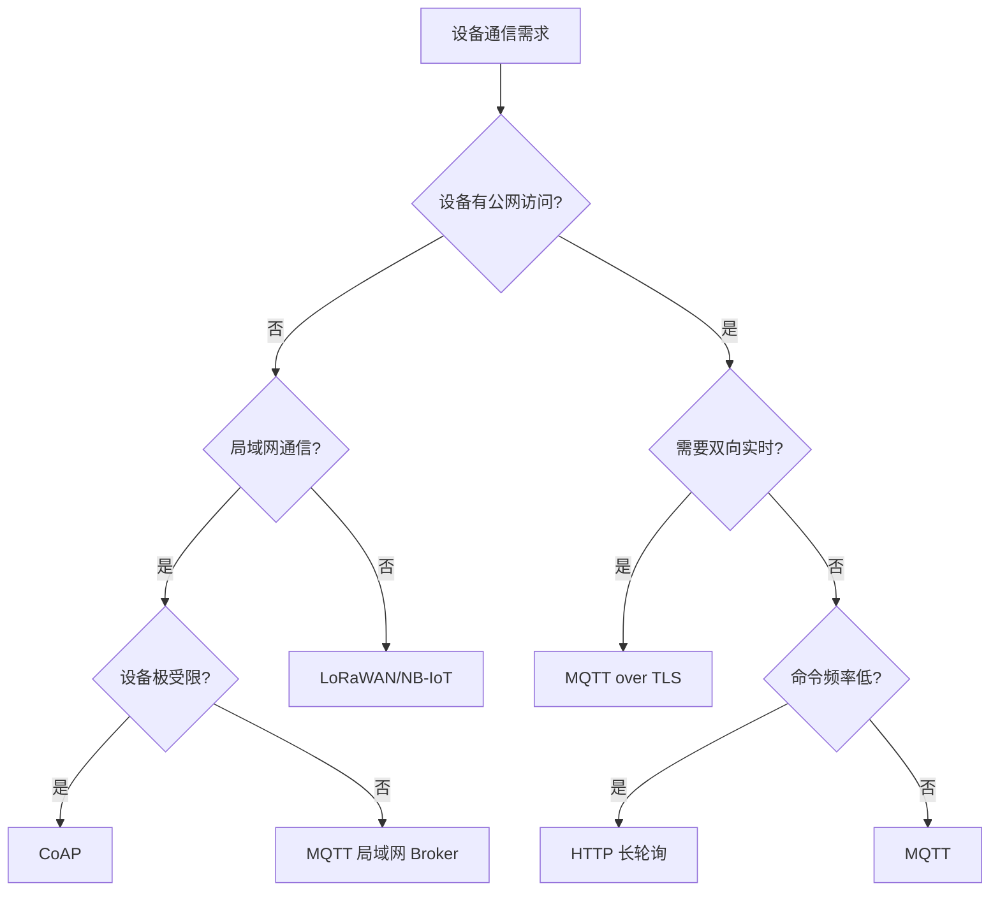

# HTTP 与 CoAP

## 一、HTTP 在 IoT 中的应用

### 1.1 为什么 IoT 设备也用 HTTP

虽然 MQTT 是 IoT 的首选协议，但 HTTP 仍然是许多场景的务实选择：

- **已有基础设施**：企业内网已有 RESTful API 体系，设备直接复用
- **防火墙友好**：HTTP/HTTPS 几乎不被任何网络设备拦截
- **开发简单**：任何语言都有成熟的 HTTP 客户端库
- **云端集成**：AWS API Gateway / Azure Functions 原生支持 HTTP



### 1.2 .NET HttpClient 设备端示例

```csharp
using System.Net.Http;
using System.Text;
using System.Text.Json;

public class HttpTelemetryClient
{
    private readonly HttpClient _httpClient;
    private readonly string _deviceId;

    public HttpTelemetryClient(string deviceId, string baseUrl)
    {
        _deviceId = deviceId;
        _httpClient = new HttpClient
        {
            BaseAddress = new Uri(baseUrl),
            Timeout = TimeSpan.FromSeconds(10)
        };
        _httpClient.DefaultRequestHeaders.Add("X-Device-Id", deviceId);
    }

    public async Task SendTelemetryAsync(Dictionary<string, object> metrics)
    {
        var payload = new
        {
            deviceId = _deviceId,
            timestamp = DateTime.UtcNow,
            metrics
        };

        var json = JsonSerializer.Serialize(payload);
        var content = new StringContent(json, Encoding.UTF8, "application/json");

        try
        {
            var response = await _httpClient.PostAsync("/api/telemetry", content);
            response.EnsureSuccessStatusCode();
        }
        catch (HttpRequestException ex)
        {
            Console.WriteLine($"Telemetry send failed: {ex.Message}");
            // 本地缓存，稍后重试
        }
    }
}

// 使用示例
var client = new HttpTelemetryClient("sensor-001", "https://iot-api.example.com");
await client.SendTelemetryAsync(new Dictionary<string, object>
{
    ["temperature"] = 23.5,
    ["humidity"] = 65.2
});
```

### 1.3 HTTP 长轮询与 Server-Sent Events

设备需要接收云端命令时，可采用以下模式：

| 模式 | 方向 | 延迟 | 连接开销 | 适用场景 |
|------|------|------|----------|----------|
| 轮询 | 设备→云 | 高（取决于间隔） | 每次新建连接 | 简单、低频命令 |
| 长轮询 | 设备→云 | 中 | 保持连接 | 中等频率 |
| SSE | 云→设备 | 低 | 持久连接 | 单向推送通知 |
| Webhook | 云→设备 | 低 | 无持续连接 | 设备有公网 IP |

::: tip 选型建议
如果设备在 NAT 后面且无公网 IP，长轮询是唯一可行的 HTTP 方案。否则优先选择 MQTT。
:::

---

## 二、CoAP 协议

### 2.1 CoAP 是什么

CoAP（Constrained Application Protocol）是专为资源受限设备设计的 Web 协议：

- **基于 UDP**：无需 TCP 三次握手，开销极小
- **类 RESTful**：GET / POST / PUT / DELETE 方法
- **异步通信**：CON（Confirmable）和 NON（Non-Confirmable）消息
- **观察模式**：类似 SSE，服务端主动推送资源变化
- **块传输**：分块传输大 payload
- **DTLS 安全**：基于 UDP 的 TLS



### 2.2 CoAP 消息模型

| 消息类型 | 缩写 | 说明 | 可靠性 |
|----------|------|------|--------|
| Confirmable | CON | 需要确认，重传机制 | 可靠 |
| Non-Confirmable | NON | 不需确认 | 尽力交付 |
| Acknowledgement | ACK | 对 CON 的确认 | — |
| Reset | RST | 拒绝消息 | — |

CoAP 响应码映射：

| CoAP 码 | HTTP 等价 | 含义 |
|---------|-----------|------|
| 2.01 | 201 Created | 资源已创建 |
| 2.04 | 204 No Content | 成功，无内容 |
| 2.05 | 200 OK | 成功，有内容 |
| 4.04 | 404 Not Found | 资源不存在 |
| 5.03 | 503 Service Unavailable | 服务不可用 |

### 2.3 .NET CoAP 实践

使用 [CoAP.NET](https://github.com/Polarbeargo/CoAP.NET) 库：

```csharp
using CoAP;
using CoAP.Server;
using CoAP.Server.Resources;

// ===== CoAP Server =====
public class TemperatureResource : Resource
{
    private double _temperature = 23.5;

    public TemperatureResource() : base("sensors/temperature")
    {
        Attributes.Title = "Temperature Sensor";
        Attributes.AddInterfaceDescription("sensor");
        Attributes.AddResourceType("temperature-c");
        Attributes.Observable = true;
        // 启用观察模式
        ObserveRelationships = new List<ObserveRelationship>();
    }

    protected override void DoGet(CoapExchange exchange)
    {
        // 普通请求：返回当前值
        string payload = $"{{\"value\":{_temperature},\"unit\":\"°C\"}}";
        exchange.Respond(ContentType.ApplicationJson, payload);
    }

    public void UpdateTemperature(double newValue)
    {
        _temperature = newValue;
        // 通知所有观察者
        Changed();
    }
}

// 启动 CoAP Server
var server = new CoapServer();
server.Add(new TemperatureResource());
server.Start();

// ===== CoAP Client =====
var client = new CoapClient(new Uri("coap://192.168.1.100/sensors/temperature"));

// 普通请求
var response = client.Get();
Console.WriteLine($"Temperature: {response.PayloadString}");

// 观察模式（类似 SSE）
client.Observe(response =>
{
    Console.WriteLine($"Update: {response.PayloadString}");
});
```

### 2.4 CoAP 观察模式详解

观察模式是 CoAP 最强大的特性，允许设备订阅资源变化：

```
客户端 → 服务器: GET /sensors/temperature (Observe=0, 注册)
服务器 → 客户端: 2.05 Content "23.5°C" (Token=abc)
服务器 → 客户端: 2.05 Content "24.1°C" (Token=abc) ← 推送
服务器 → 客户端: 2.05 Content "23.8°C" (Token=abc) ← 推送
客户端 → 服务器: GET /sensors/temperature (Observe=1, 取消)
```

::: important CoAP vs MQTT 观察对比
- CoAP 观察是**基于资源**的：订阅某个 URI 的变化
- MQTT 订阅是**基于主题**的：订阅某个 topic 的消息
- CoAP 观察需要服务器维护客户端状态，MQTT 由 Broker 维护
:::

---

## 三、HTTP vs CoAP vs MQTT 对比

| 维度 | HTTP | CoAP | MQTT |
|------|------|------|------|
| 传输层 | TCP | UDP | TCP |
| 模式 | 请求-响应 | 请求-响应 + 观察 | 发布-订阅 |
| 头部开销 | 数百字节 | 4 字节 | 2 字节 |
| 最低功耗 | 高 | 低 | 中 |
| 双向通信 | 长轮询/SSE | 观察/异步 | 原生支持 |
| QoS | 无 | CON/NON | 0/1/2 |
| 发现 | 无 | /well-known/core | 无 |
| 缓存 | 支持 | 支持 | 不支持 |
| 安全 | TLS | DTLS | TLS |
| 防火墙穿透 | 极好 | 较差 | 较好 |
| 适用场景 | 云端 API、已有基础设施 | 受限设备、局域网 | 通用 IoT 通信 |

::: warning CoAP 的坑
CoAP 基于 UDP，在企业 NAT/防火墙后可能无法穿透。如果设备在公网环境，优先选择 MQTT over TLS。
:::

---

## 四、协议选型决策



---

## 五、实战：.NET 多协议网关

将 CoAP 设备数据转发到 MQTT 云端：

```csharp
public class CoapToMqttBridge : BackgroundService
{
    private readonly CoapClient _coapClient;
    private readonly MqttFactory _mqttFactory;
    private readonly IMqttClient _mqttClient;

    public CoapToMqttBridge()
    {
        _coapClient = new CoapClient(new Uri("coap://192.168.1.100/sensors/temperature"));
        _mqttFactory = new MqttFactory();
        _mqttClient = _mqttFactory.CreateMqttClient();
    }

    protected override async Task ExecuteAsync(CancellationToken stoppingToken)
    {
        // 连接 MQTT Broker
        var options = _mqttFactory.CreateClientOptionsBuilder()
            .WithTcpServer("mqtt.example.com", 8883)
            .WithTls()
            .WithCredentials("gateway-01", "password")
            .Build();
        await _mqttClient.ConnectAsync(options, stoppingToken);

        // 订阅 CoAP 观察
        _coapClient.Observe(response =>
        {
            // 转发到 MQTT
            var message = new MqttApplicationMessageBuilder()
                .WithTopic("devices/gateway-01/temperature")
                .WithPayload(response.PayloadString)
                .WithQualityOfServiceLevel(MQTTnet.Protocol.MqttQualityOfServiceLevel.AtLeastOnce)
                .Build();

            _mqttClient.PublishAsync(message, stoppingToken).Wait();
        });

        await Task.Delay(Timeout.Infinite, stoppingToken);
    }
}
```

---

## 面试技巧

1. **HTTP vs MQTT**：面试常问"为什么 IoT 不直接用 HTTP"，核心答案是头部开销大、无法双向推送、TCP 连接维持成本高
2. **CoAP 观察模式**：理解 CON/NON 和 Observe 机制，这是 CoAP 的核心差异化
3. **DTLS**：CoAP 安全用 DTLS 而非 TLS，面试可能问为什么（因为 UDP）
4. **协议转换**：实际项目中经常需要 CoAP→MQTT 网关，理解桥接模式
5. **选型原则**：没有"最好"的协议，只有"最合适"的——根据网络环境、设备能力、通信模式综合决策
