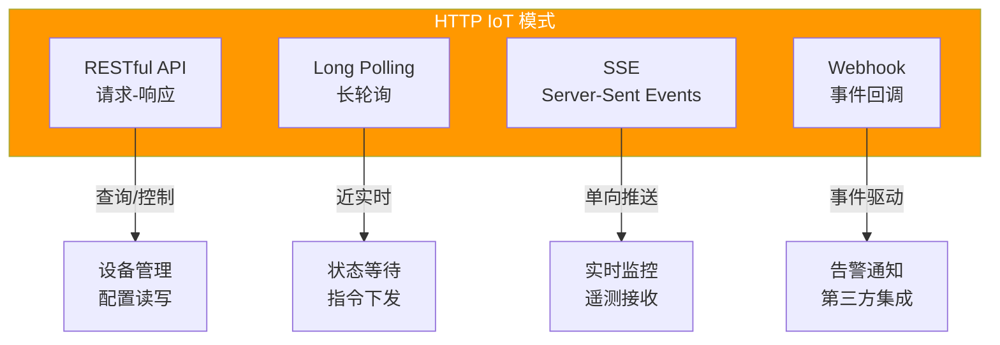
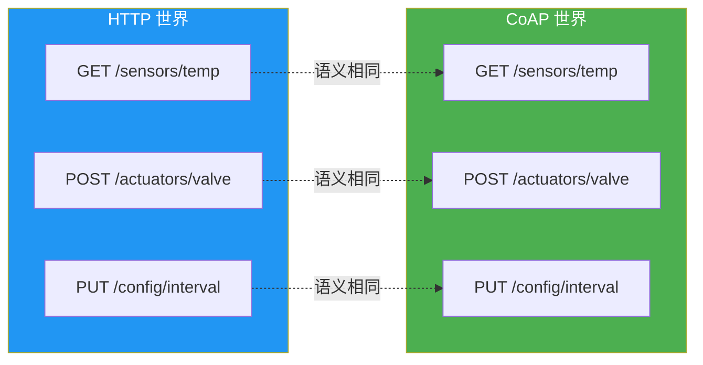
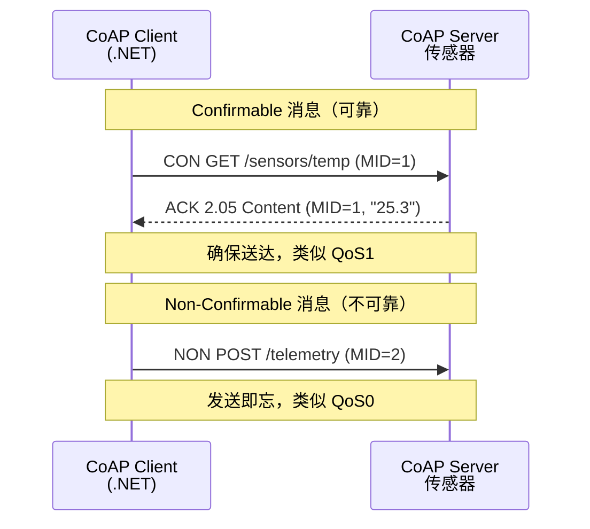
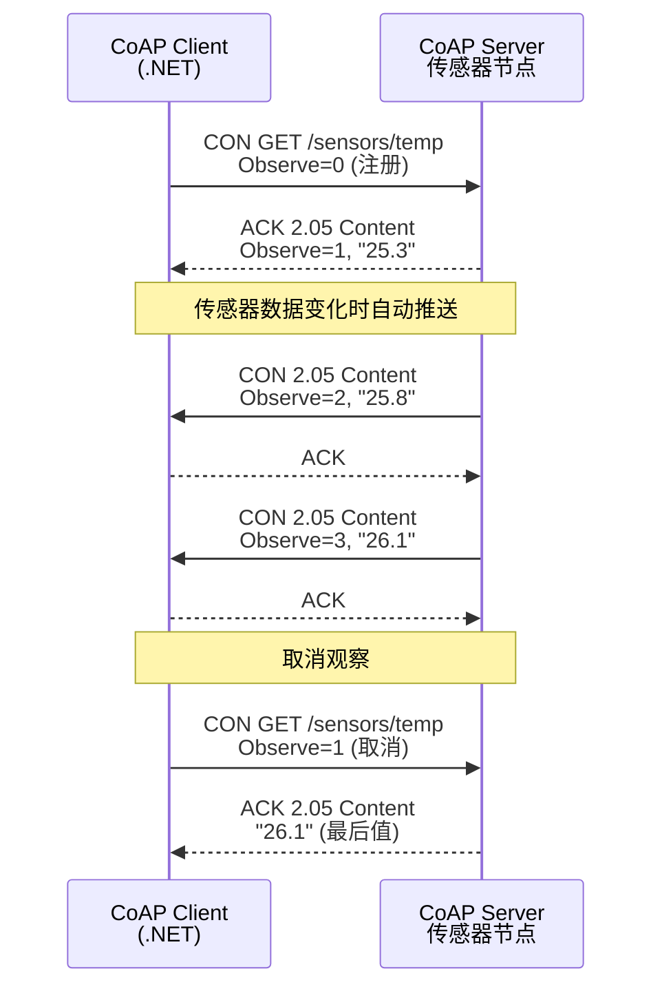
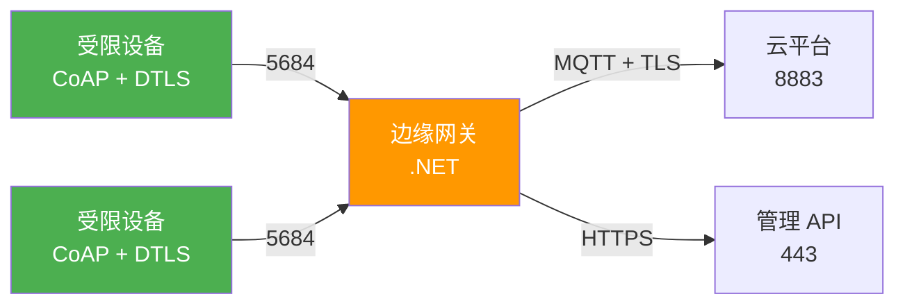

# HTTP 与 CoAP

HTTP 是互联网的通用语言，CoAP 是为受限设备量身定制的"轻量 HTTP"。两者共享 REST 语义，但面向截然不同的场景：HTTP 适合网关和云端的 API 交互，CoAP 适合 RAM < 10KB 的传感器节点。本文从 HTTP 的 IoT 模式到 CoAP 的 observe 机制，用 .NET 构建完整的设备通信能力。

## 1. HTTP 在 IoT 中的应用

### 1.1 IoT 中的 HTTP 模式



| 模式 | 方向 | 实时性 | 连接 | 适用场景 |
|------|------|--------|------|----------|
| RESTful API | 双向（请求-响应） | 低 | 短连接 | 设备管理、配置读写 |
| Long Polling | 服务端→客户端 | 中 | 长连接 | 指令下发、状态等待 |
| SSE | 服务端→客户端 | 高 | 持久连接 | 实时监控、遥测推送 |
| Webhook | 服务端→第三方 | 中 | 事件触发 | 告警通知、第三方集成 |

### 1.2 受限设备分类

| 类别 | RAM | Flash | 典型芯片 | 适合协议 |
|------|-----|-------|----------|----------|
| Class 1 | > 10 KB | > 100 KB | ESP32、STM32F4 | HTTP、MQTT |
| Class 2 | 10-50 KB | 50-250 KB | STM32F1、nRF52 | CoAP、MQTT-SN |
| Class 3 | < 10 KB | < 50 KB | ATmega328、MSP430 | CoAP、自定义协议 |

::: tip 什么时候用 HTTP？
- 设备资源充足（Class 1，RAM > 10KB）
- 已有 RESTful 基础设施（API Gateway、反向代理）
- 需要 Web 仪表盘直接访问设备
- 设备数量少（< 100 台），不需要 Pub/Sub
- 大多数 IoT 项目：HTTP 用于管理 API，MQTT 用于遥测上报
:::

## 2. RESTful API 与设备通信

### 2.1 设备 API 设计

```csharp
// ASP.NET Core 设备管理 API
using Microsoft.AspNetCore.Mvc;

[ApiController]
[Route("api/devices/{deviceId}")]
public class DeviceController : ControllerBase
{
    private readonly DeviceStateManager _stateManager;

    public DeviceController(DeviceStateManager stateManager)
    {
        _stateManager = stateManager;
    }

    // GET /api/devices/thermostat-01/telemetry
    [HttpGet("telemetry")]
    public async Task<ActionResult<TelemetryData>> GetTelemetry(string deviceId)
    {
        var data = await _stateManager.GetLatestTelemetryAsync(deviceId);
        if (data == null) return NotFound();
        return Ok(data);
    }

    // GET /api/devices/thermostat-01/config
    [HttpGet("config")]
    public async Task<ActionResult<DeviceConfig>> GetConfig(string deviceId)
    {
        var config = await _stateManager.GetConfigAsync(deviceId);
        return Ok(config);
    }

    // PUT /api/devices/thermostat-01/config
    [HttpPut("config")]
    public async Task<ActionResult> UpdateConfig(
        string deviceId, [FromBody] DeviceConfig config)
    {
        await _stateManager.UpdateConfigAsync(deviceId, config);
        return NoContent();
    }

    // POST /api/devices/thermostat-01/commands/reboot
    [HttpPost("commands/{command}")]
    public async Task<ActionResult> ExecuteCommand(string deviceId, string command)
    {
        var result = await _stateManager.ExecuteCommandAsync(deviceId, command);
        return result.Success ? Ok(result) : BadRequest(result);
    }
}

public record TelemetryData(double Temperature, double Humidity, DateTime Timestamp);
public record DeviceConfig(double TargetTemperature, int SampleInterval, bool AlertEnabled);
public record CommandResult(bool Success, string Message);
```

### 2.2 HttpClient 设备客户端

```csharp
using System.Net.Http.Json;
using System.Text.Json;

class DeviceHttpClient
{
    private readonly HttpClient _client;
    private readonly string _deviceId;

    public DeviceHttpClient(string baseUrl, string deviceId)
    {
        _client = new HttpClient { BaseAddress = new Uri(baseUrl) };
        _deviceId = deviceId;
        _client.DefaultRequestHeaders.Add("X-Device-Id", deviceId);
    }

    // 上报遥测数据
    public async Task SendTelemetryAsync(TelemetryData data)
    {
        var response = await _client.PostAsJsonAsync(
            $"/api/devices/{_deviceId}/telemetry", data);
        response.EnsureSuccessStatusCode();
    }

    // 获取配置
    public async Task<DeviceConfig?> GetConfigAsync()
    {
        return await _client.GetFromJsonAsync<DeviceConfig>(
            $"/api/devices/{_deviceId}/config");
    }

    // 更新配置
    public async Task UpdateConfigAsync(DeviceConfig config)
    {
        var response = await _client.PutAsJsonAsync(
            $"/api/devices/{_deviceId}/config", config);
        response.EnsureSuccessStatusCode();
    }

    // 上报遥测循环
    public async Task RunTelemetryLoopAsync(CancellationToken ct)
    {
        while (!ct.IsCancellationRequested)
        {
            var data = new TelemetryData(
                Temperature: 20 + Random.Shared.NextDouble() * 15,
                Humidity: 40 + Random.Shared.NextDouble() * 30,
                Timestamp: DateTime.UtcNow);

            try
            {
                await SendTelemetryAsync(data);
                Console.WriteLine($"遥测已上报: {data.Temperature:F1}°C");
            }
            catch (HttpRequestException ex)
            {
                Console.WriteLine($"上报失败: {ex.Message}");
            }

            await Task.Delay(5000, ct);
        }
    }
}
```

::: warning HTTP 长连接保活
HttpClient 默认不会保持长连接。对于频繁上报的设备，建议：
- 使用 `SocketsHttpHandler` 配置 `PooledConnectionLifetime`
- 设置 `Keep-Alive` 头部
- 避免每次请求创建新的 HttpClient（使用 IHttpClientFactory）
:::

## 3. Long Polling 与 SSE

### 3.1 Long Polling（长轮询）

```csharp
// 服务端：挂起请求直到有数据或超时
[HttpGet("commands/pending")]
public async Task<ActionResult<PendingCommand>> GetPendingCommand(
    string deviceId, CancellationToken cancellationToken)
{
    // 等待命令或 30 秒超时
    using var cts = CancellationTokenSource.CreateLinkedTokenSource(cancellationToken);
    cts.CancelAfter(TimeSpan.FromSeconds(30));

    try
    {
        var command = await _stateManager.WaitForCommandAsync(deviceId, cts.Token);
        return Ok(command);
    }
    catch (OperationCanceledException)
    {
        // 超时无命令，返回 204
        return NoContent();
    }
}

// 客户端：持续长轮询
class LongPollingClient
{
    private readonly HttpClient _client;
    private readonly string _deviceId;

    public async Task ListenForCommandsAsync(CancellationToken ct)
    {
        while (!ct.IsCancellationRequested)
        {
            try
            {
                var response = await _client.GetAsync(
                    $"/api/devices/{_deviceId}/commands/pending", ct);

                if (response.StatusCode == System.Net.HttpStatusCode.OK)
                {
                    var command = await response.Content.ReadFromJsonAsync<PendingCommand>(ct);
                    if (command != null)
                    {
                        Console.WriteLine($"收到命令: {command.Name}");
                        await ExecuteCommandAsync(command);
                    }
                }
                // 204 = 无命令，立即发起下一次轮询
            }
            catch (TaskCanceledException)
            {
                // 超时，继续轮询
            }
        }
    }

    private async Task ExecuteCommandAsync(PendingCommand command)
    {
        // 执行命令逻辑
        Console.WriteLine($"执行: {command.Name}, 参数: {command.Parameters}");
    }
}

public record PendingCommand(string Name, Dictionary<string, object> Parameters);
```

### 3.2 Server-Sent Events（SSE）

```csharp
// 服务端：SSE 推送
[HttpGet("telemetry/stream")]
public async Task StreamTelemetry(string deviceId, CancellationToken cancellationToken)
{
    Response.ContentType = "text/event-stream";
    Response.Headers.Add("Cache-Control", "no-cache");
    Response.Headers.Add("Connection", "keep-alive");

    while (!cancellationToken.IsCancellationRequested)
    {
        var data = await _stateManager.GetLatestTelemetryAsync(deviceId);
        if (data != null)
        {
            // SSE 格式: "data: {json}\n\n"
            var json = JsonSerializer.Serialize(data);
            await Response.WriteAsync($"data: {json}\n\n", cancellationToken);
            await Response.Body.FlushAsync(cancellationToken);
        }

        await Task.Delay(1000, cancellationToken);
    }
}

// 客户端：接收 SSE
class SseClient
{
    public async Task ListenAsync(string url, CancellationToken ct)
    {
        using var client = new HttpClient();
        using var response = await client.GetAsync(url, HttpCompletionOption.ResponseHeadersRead, ct);
        using var stream = await response.Content.ReadAsStreamAsync(ct);
        using var reader = new StreamReader(stream);

        while (!reader.EndOfStream && !ct.IsCancellationRequested)
        {
            var line = await reader.ReadLineAsync(ct);
            if (line?.StartsWith("data: ") == true)
            {
                var json = line["data: ".Length..];
                var data = JsonSerializer.Deserialize<TelemetryData>(json);
                Console.WriteLine($"SSE: {data?.Temperature:F1}°C / {data?.Humidity:F1}%");
            }
        }
    }
}
```

## 4. Webhook 事件通知

```csharp
// 服务端：注册和触发 Webhook
public class WebhookService
{
    private readonly List<WebhookSubscription> _subscriptions = new();
    private readonly HttpClient _httpClient = new();

    public void Subscribe(WebhookSubscription subscription)
    {
        _subscriptions.Add(subscription);
    }

    public async Task NotifyAsync(string eventType, object payload)
    {
        var webhookPayload = new
        {
            eventType,
            timestamp = DateTime.UtcNow,
            data = payload
        };

        var targets = _subscriptions.Where(s => s.EventTypes.Contains(eventType));

        foreach (var sub in targets)
        {
            try
            {
                await _httpClient.PostAsJsonAsync(sub.CallbackUrl, webhookPayload);
            }
            catch (Exception ex)
            {
                Console.WriteLine($"Webhook 通知失败 ({sub.CallbackUrl}): {ex.Message}");
            }
        }
    }
}

public record WebhookSubscription(string CallbackUrl, string[] EventTypes);
```

## 5. CoAP 协议

### 5.1 CoAP 概述

CoAP（Constrained Application Protocol）是专为受限设备设计的 Web 传输协议：



| 特性 | HTTP | CoAP |
|------|------|------|
| 传输层 | TCP | UDP |
| 头部大小 | ~200B | 4B |
| 方法 | GET/POST/PUT/DELETE | GET/POST/PUT/DELETE |
| 响应码 | 200/201/404/500 | 2.01/2.04/4.04/5.00 |
| 安全 | TLS | DTLS |
| 推送 | SSE/WebSocket | Observe |
| 发现 | 无 | /.well-known/core |

### 5.2 CoAP 报文结构

```
CoAP 报文（4 字节固定头）:

|0 1|2 3 4 5 6 7|8 9 10 11|12 13 14 15|
|Ver|    Type   |   TKL   |    Code    |
|            Message ID                |
|          Token (0-8B)                |
|          Options (变长)               |
|          Payload Marker (0xFF)       |
|          Payload (变长)               |

Ver = 01 (版本1)
Type: 00=CON, 01=NON, 10=ACK, 11=RST
Code: 0.01=GET, 0.02=POST, 0.03=PUT, 0.04=DELETE
```

### 5.3 CON/NON 消息模式



::: important CoAP 响应码
CoAP 响应码格式为 `c.dd`：
- **2.01** Created（类似 HTTP 201）
- **2.04** Changed（类似 HTTP 204）
- **2.05** Content（类似 HTTP 200）
- **4.04** Not Found（类似 HTTP 404）
- **4.08** Request Entity Incomplete
- **5.00** Internal Server Error
:::

## 6. CoAP Observe 模式

### 6.1 Observe 机制

Observe 是 CoAP 的"订阅"机制，类似 SSE 但基于 UDP：



### 6.2 .NET CoAP Observe 示例

```csharp
using CoAP;
using CoAP.Endpoints;

class CoapObserveExample
{
    static async Task Main(string[] args)
    {
        // 创建 CoAP 客户端
        var client = new CoapClient();

        // 目标资源 URI
        var resourceUri = new Uri("coap://192.168.1.50/sensors/temperature");

        // === Observe 注册 ===
        Console.WriteLine("注册 Observe: /sensors/temperature");

        var observeRequest = client.NewRequest(Method.GET, resourceUri);
        observeRequest.MarkObserve();

        client.Observe(resourceUri, (response) =>
        {
            if (response != null && response.Payload != null)
            {
                string payload = System.Text.Encoding.UTF8.GetString(response.Payload);
                Console.WriteLine($"[Observe] 温度更新: {payload} (序号: {response.ObserveSequence})");
            }
        });

        Console.WriteLine("正在监听温度变化，按回车退出...");
        Console.ReadLine();

        // 取消 Observe
        client.CancelObserve(resourceUri);
        Console.WriteLine("已取消 Observe");
    }
}
```

### 6.3 CoAP 服务端（.NET）

```csharp
using CoAP;
using CoAP.Server;
using CoAP.Server.Resources;

class CoapSensorServer
{
    static void Main(string[] args)
    {
        var server = new CoapServer();

        // 注册传感器资源
        server.Add(new TemperatureResource());
        server.Add(new HumidityResource());

        server.Start();
        Console.WriteLine("CoAP 服务器已启动 (coap://localhost:5683)");
        Console.WriteLine("可用资源:");
        Console.WriteLine("  coap://localhost/sensors/temperature");
        Console.WriteLine("  coap://localhost/sensors/humidity");
        Console.ReadLine();
    }
}

class TemperatureResource : Resource
{
    private readonly Random _random = new();
    private double _currentTemp = 22.0;

    public TemperatureResource()
        : base("sensors/temperature")
    {
        Attributes.Title = "Temperature Sensor";
        Attributes.AddResourceType("temperature");
        Attributes.AddInterfaceDescription("core.s");
        Observable = true; // 启用 Observe

        // 模拟温度变化，通知观察者
        _ = SimulateTemperatureChangesAsync();
    }

    protected override void DoGet(CoapExchange exchange)
    {
        string payload = $"{{\"value\":{_currentTemp:F1},\"unit\":\"C\",\"timestamp\":\"{DateTime.UtcNow:O}\"}}";
        exchange.Respond(StatusCode.Content, payload, MediaType.ApplicationJson);
    }

    protected override void DoPut(CoapExchange exchange)
    {
        // 更新温度阈值等配置
        string payload = System.Text.Encoding.UTF8.GetString(exchange.Request.Payload);
        exchange.Respond(StatusCode.Changed);
    }

    private async Task SimulateTemperatureChangesAsync()
    {
        while (true)
        {
            await Task.Delay(5000);
            _currentTemp += _random.NextDouble() * 2 - 1;
            _currentTemp = Math.Clamp(_currentTemp, 15, 35);

            // 通知所有 Observe 客户端
            Changed();
            Console.WriteLine($"温度更新: {_currentTemp:F1}°C");
        }
    }
}

class HumidityResource : Resource
{
    private readonly Random _random = new();
    private double _currentHumidity = 55.0;

    public HumidityResource()
        : base("sensors/humidity")
    {
        Attributes.Title = "Humidity Sensor";
        Attributes.AddResourceType("humidity");
        Observable = true;

        _ = SimulateHumidityChangesAsync();
    }

    protected override void DoGet(CoapExchange exchange)
    {
        string payload = $"{{\"value\":{_currentHumidity:F1},\"unit\":\"%\",\"timestamp\":\"{DateTime.UtcNow:O}\"}}";
        exchange.Respond(StatusCode.Content, payload, MediaType.ApplicationJson);
    }

    private async Task SimulateHumidityChangesAsync()
    {
        while (true)
        {
            await Task.Delay(8000);
            _currentHumidity += _random.NextDouble() * 4 - 2;
            _currentHumidity = Math.Clamp(_currentHumidity, 30, 80);
            Changed();
        }
    }
}
```

## 7. CoAP Block Transfer（块传输）

受限设备的 MTU 通常较小（64-127 字节），CoAP 通过 Block Transfer 分片传输大负载：

```csharp
// CoAP Block 传输选项
// Block1: 用于请求体分片（PUT/POST 大数据）
// Block2: 用于响应体分片（GET 大数据）

// 传输一个 500 字节的固件到设备
// Block size = 64 字节
// 需要约 8 个 Block 请求

// Block 选项格式: [NUM(4bit)][M(1bit)][SZX(3bit)]
// M = More (是否还有后续块)
// SZX = Block 大小编码 (0=16B, 1=32B, ..., 6=1024B)
```

::: tip Block Transfer 场景
- 固件 OTA 更新：设备 RAM 有限，无法一次接收完整固件
- 大数据查询：批量读取历史传感器数据
- 证书分发：下发 X.509 证书链到受限设备
:::

## 8. DTLS 安全

### 8.1 DTLS vs TLS

| 特性 | TLS | DTLS |
|------|-----|------|
| 传输层 | TCP | UDP |
| 连接 | 面向连接 | 无连接 |
| 握手 | 可靠 | 带重传的握手 |
| 记录层 | 有序 | 可能乱序/丢包 |
| 适配 CoAP | 不适合 | 原生适配 |

### 8.2 CoAP + DTLS 配置

```csharp
// CoAP over DTLS (CoAPS)
// 默认端口: 5684 (DTLS) vs 5683 (UDP)

// 使用 TinyDTLS 或 Mbed TLS 库
// .NET 环境可通过以下方式实现 DTLS:

// 方案1: 使用 CoAP.net 库的 DTLS 支持
var client = new CoapClient();
var dtlsUri = new Uri("coaps://192.168.1.50/sensors/temperature"); // coaps = DTLS

// 方案2: 网关模式——设备 CoAP/DTLS → 网关 → MQTT/TLS → 云端
// 受限设备使用 DTLS 连接网关
// 网关使用 TLS 连接云平台
```



::: warning DTLS 的挑战
- UDP 不保证交付，DTLS 需要自带重传机制
- 消息可能乱序到达，DTLS 需要处理重放攻击
- 受限设备计算能力有限，ECDHE 握手耗时较长
- 建议：使用预共享密钥（PSK）模式降低握手开销
:::

## 9. HTTP vs CoAP vs MQTT 对比

| 维度 | HTTP | CoAP | MQTT |
|------|------|------|------|
| **传输层** | TCP | UDP | TCP |
| **模式** | Req/Res | Req/Res + Observe | Pub/Sub |
| **头部开销** | ~200B | 4B | 2B |
| **推送能力** | SSE/Webhook | Observe | 原生支持 |
| **安全性** | TLS | DTLS | TLS |
| **资源需求** | 高 | 极低 | 低 |
| **防火墙友好** | 是 | 否（UDP 常被阻） | 是（TCP） |
| **浏览器支持** | 原生 | 需代理 | 需 WebSocket |
| **发现机制** | 无 | /.well-known/core | 无 |
| **缓存** | 内置 | 内置 | 无 |
| **最佳场景** | 管理 API | 受限传感器 | 遥测上报 |

::: important 协议选择决策
1. **设备 RAM > 10KB** → MQTT（遥测） + HTTP（管理）
2. **设备 RAM < 10KB** → CoAP（所有通信）
3. **需要 Web 仪表盘** → HTTP/SSE（前端） + MQTT/CoAP（设备端，通过网关转换）
4. **工业现场** → Modbus（现场） + MQTT（上云），不用 HTTP/CoAP
:::

## 参考链接

- [CoAP RFC 7252](https://datatracker.ietf.org/doc/html/rfc7252)
- [CoAP Observe RFC 7641](https://datatracker.ietf.org/doc/html/rfc7641)
- [CoAP Block Transfer RFC 7959](https://datatracker.ietf.org/doc/html/rfc7959)
- [DTLS 1.2 RFC 6347](https://datatracker.ietf.org/doc/html/rfc6347)
- [CoAP.net GitHub](https://github.com/Nickersoft/coap.net)
- [ASP.NET Core SSE](https://learn.microsoft.com/aspnet/core/fundamentals/minimal-apis)
- [HttpClient 最佳实践](https://learn.microsoft.com/dotnet/architecture/microservices/implement-resilient-applications/use-httpclientfactory-to-implement-resilient-http-requests)
- [OWASP IoT Top 10](https://owasp.org/www-project-internet-of-things/)

## 面试技巧

1. **"HTTP 和 CoAP 的区别？为什么 IoT 需要 CoAP？"** —— HTTP 基于 TCP，头部大（~200B），适合资源充足的设备；CoAP 基于 UDP，头部仅 4B，专为受限设备设计。IoT 需要 CoAP 是因为很多传感器 RAM < 10KB，无法运行 TCP/TLS 协议栈。面试时强调：CoAP 不是替代 HTTP，而是受限场景的补充。

2. **"CoAP 的 Observe 机制是什么？"** —— 类似 SSE 的订阅模式，客户端在 GET 请求中添加 Observe=0 注册，服务端在数据变化时主动推送通知（带递增序号）。与 MQTT Pub/Sub 的区别：Observe 是单个资源粒度，MQTT 是 Topic 粒度；Observe 基于 UDP，MQTT 基于 TCP。

3. **"HTTP 的 Long Polling 和 SSE 有什么区别？"** —— Long Polling 是客户端主动轮询，服务端挂起直到有数据或超时，每次响应后需重新发起请求；SSE 是服务端主动推送，一次连接持续发送数据，浏览器原生支持。IoT 场景：Long Polling 适合指令下发（客户端拉取），SSE 适合实时监控（服务端推送）。

4. **"CoAP over DTLS 和 MQTT over TLS 怎么选？"** —— DTLS 基于 UDP，适合受限设备（低内存、低功耗），但 UDP 可能被防火墙阻拦；TLS 基于 TCP，防火墙友好但开销更大。选择依据：设备资源和网络环境。大多数项目用 MQTT + TLS，只在设备极度受限时用 CoAP + DTLS。

5. **"Webhook 在 IoT 中怎么用？"** —— 事件驱动的第三方通知。IoT 平台检测到告警时，向预注册的 URL 发送 HTTP POST 请求。典型场景：温度越限 → Webhook → 钉钉/企业微信告警；设备离线 → Webhook → 运维系统自动创建工单。与 MQTT 的区别：Webhook 是平台主动推送到第三方，MQTT 是设备到平台的通信。
