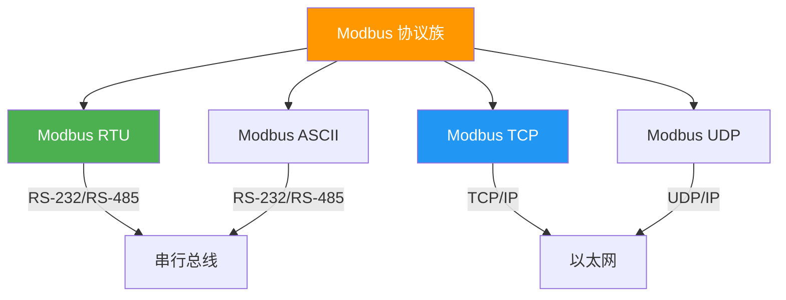
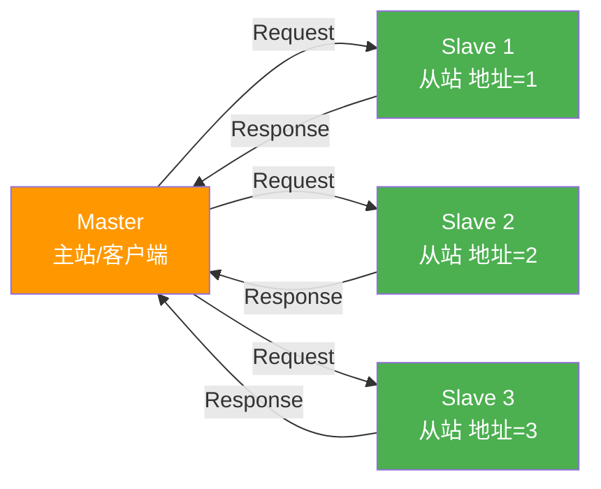
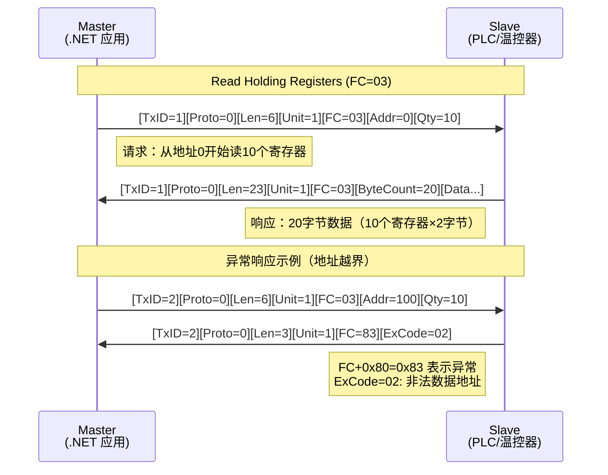
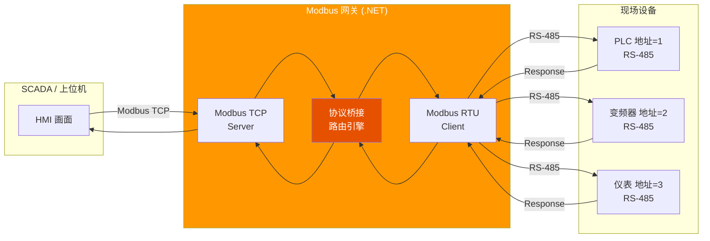
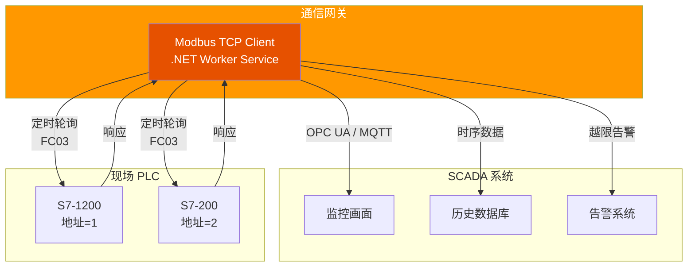

# Modbus 工业协议

Modbus 是工业自动化领域最广泛使用的通信协议——简单、开放、可靠。从 PLC 到 SCADA，从串行总线到以太网，Modbus 覆盖了工业通信的核心场景。本文从数据模型到 NModbus 实战，构建完整的 .NET 工业通信能力。

## 1. Modbus 协议概述

### 1.1 Modbus 家族



| 变体 | 传输层 | 编码 | 典型场景 |
|------|--------|------|----------|
| Modbus RTU | RS-485/RS-232 | 二进制 | 串行总线、现场设备 |
| Modbus ASCII | RS-485/RS-232 | ASCII 字符 | 调试、低速场景 |
| Modbus TCP | TCP/IP | 二进制 | 以太网、SCADA 集成 |
| Modbus UDP | UDP/IP | 二进制 | 广播场景（少用） |

::: tip 为什么 Modbus 经久不衰？
- **开放免费**：无专利、无授权费
- **简单**：协议规范仅几十页，实现成本低
- **生态庞大**：几乎所有 PLC 和工业设备都支持
- **互操作性强**：不同厂商设备可直接通信
:::

### 1.2 主从架构



- **Master（主站）**：发起请求，一个 Modbus 网络只有一个主站
- **Slave（从站）**：被动响应，每个从站有唯一地址（1-247）
- 地址 0 为广播地址，从站不响应广播

## 2. 数据模型

### 2.1 四种数据类型

| 数据类型 | 前缀 | 读写 | 地址范围 | 说明 |
|----------|------|------|----------|------|
| Coils | 0x | 读/写 | 00001-09999 | 线圈——布尔量输出（开关） |
| Discrete Inputs | 1x | 只读 | 10001-19999 | 离散输入——布尔量输入（开关状态） |
| Input Registers | 3x | 只读 | 30001-39999 | 输入寄存器——16位只读值（传感器读数） |
| Holding Registers | 4x | 读/写 | 40001-49999 | 保持寄存器——16位可读写值（配置参数） |

::: important 地址前缀的含义
`40001` 中的 `4` 表示 Holding Register，实际协议中的地址是 `0`（40001 - 40001 = 0）。Modbus 协议地址从 0 开始，但人机界面通常从 1 开始，这是历史惯例。
:::

### 2.2 数据示例

```
设备地址 = 1 的温控器：

0x 地址空间 (Coils):
  00001 = 运行状态（ON/OFF）
  00002 = 告警使能

1x 地址空间 (Discrete Inputs):
  10001 = 过温保护触发
  10002 = 传感器故障

3x 地址空间 (Input Registers):
  30001 = 当前温度值（×10，如 253 = 25.3°C）
  30002 = 当前湿度值（×10）

4x 地址空间 (Holding Registers):
  40001 = 目标温度设定值（×10）
  40002 = 温度告警阈值（×10）
  40003 = 采样间隔（秒）
```

## 3. 功能码

### 3.1 常用功能码

| 功能码 | 名称 | 操作对象 | 说明 |
|--------|------|----------|------|
| 01 | Read Coils | 0x | 读取一组线圈状态 |
| 02 | Read Discrete Inputs | 1x | 读取一组离散输入 |
| 03 | Read Holding Registers | 4x | 读取一组保持寄存器 |
| 04 | Read Input Registers | 3x | 读取一组输入寄存器 |
| 05 | Write Single Coil | 0x | 写入单个线圈 |
| 06 | Write Single Register | 4x | 写入单个保持寄存器 |
| 15 | Write Multiple Coils | 0x | 写入多个线圈 |
| 16 | Write Multiple Registers | 4x | 写入多个保持寄存器 |

### 3.2 Modbus TCP 报文结构

```
Modbus TCP 请求帧（Read Holding Registers）：

| 字段           | 长度 | 值          | 说明               |
|----------------|------|-------------|-------------------|
| Transaction ID | 2B   | 0x0001      | 事务标识           |
| Protocol ID    | 2B   | 0x0000      | 协议标识（Modbus=0）|
| Length         | 2B   | 0x0006      | 后续字节数         |
| Unit ID        | 1B   | 0x01        | 从站地址           |
| Function Code  | 1B   | 0x03        | 功能码             |
| Start Address  | 2B   | 0x0000      | 起始地址           |
| Quantity       | 2B   | 0x000A      | 读取数量（10个）    |
```

### 3.3 Modbus TCP 读取事务流程



::: warning 异常响应
当从站返回异常时，功能码最高位置 1（如 FC=03 变为 0x83），后跟异常码：

| 异常码 | 含义 |
|--------|------|
| 01 | 非法功能码 |
| 02 | 非法数据地址 |
| 03 | 非法数据值 |
| 04 | 从站故障 |
:::

## 4. NModbus 实战

### 4.1 安装

```bash
dotnet add package NModbus
```

> 参考：[NModbus GitHub](https://github.com/NModbus/NModbus)

### 4.2 Modbus TCP 读取温度示例

```csharp
using System.Net.Sockets;
using NModbus;

class ModbusTcpReader
{
    static async Task Main(string[] args)
    {
        // 创建 TCP 连接
        using var client = new TcpClient();
        await client.ConnectAsync("127.0.0.1", 502); // Modbus TCP 默认端口

        // 创建 Modbus Master
        var factory = new ModbusFactory();
        IModbusMaster master = factory.CreateMaster(client);
        master.Transport.ReadTimeout = 3000;
        master.Transport.WriteTimeout = 3000;
        master.Transport.Retries = 3;

        byte slaveId = 1; // 从站地址

        // === 读取 Holding Registers (FC=03) ===
        // 从地址 0 开始读 10 个寄存器
        ushort[] registers = await master.ReadHoldingRegistersAsync(
            slaveId, startAddress: 0, numberOfPoints: 10);

        Console.WriteLine("=== Holding Registers ===");
        for (int i = 0; i < registers.Length; i++)
        {
            Console.WriteLine($"  4000{i + 1:D2}: {registers[i]}");
        }

        // 温度值（×10 存储，需要除以 10）
        double temperature = registers[0] / 10.0;
        double humidity = registers[1] / 10.0;
        Console.WriteLine($"\n当前温度: {temperature:F1}°C");
        Console.WriteLine($"当前湿度: {humidity:F1}%");

        // === 读取 Input Registers (FC=04) ===
        ushort[] inputRegs = await master.ReadInputRegistersAsync(
            slaveId, startAddress: 0, numberOfPoints: 5);

        Console.WriteLine("\n=== Input Registers ===");
        for (int i = 0; i < inputRegs.Length; i++)
        {
            Console.WriteLine($"  3000{i + 1:D2}: {inputRegs[i]}");
        }

        // === 读取 Coils (FC=01) ===
        bool[] coils = await master.ReadCoilsAsync(
            slaveId, startAddress: 0, numberOfPoints: 2);

        Console.WriteLine("\n=== Coils ===");
        Console.WriteLine($"  00001 (运行状态): {(coils[0] ? "ON" : "OFF")}");
        Console.WriteLine($"  00002 (告警使能): {(coils[1] ? "ON" : "OFF")}");

        // === 写入单个 Holding Register (FC=06) ===
        // 设置目标温度为 25.0°C（存储值 = 250）
        await master.WriteSingleRegisterAsync(slaveId, startAddress: 0, registerValue: 250);
        Console.WriteLine("\n已设置目标温度: 25.0°C");

        // === 写入单个 Coil (FC=05) ===
        await master.WriteSingleCoilAsync(slaveId, startAddress: 1, value: true);
        Console.WriteLine("已启用告警");

        client.Close();
    }
}
```

### 4.3 Modbus RTU 串口通信

```csharp
using System.IO.Ports;
using NModbus;

class ModbusRtuReader
{
    static async Task Main(string[] args)
    {
        // 打开串口
        using var port = new SerialPort("COM3", 9600, Parity.None, 8, StopBits.One);
        port.Open();

        // 创建 Modbus RTU Master
        var factory = new ModbusFactory();
        IModbusMaster master = factory.CreateRtuMaster(port);
        master.Transport.ReadTimeout = 3000;
        master.Transport.WriteTimeout = 3000;

        byte slaveId = 1;

        // 读取 Holding Registers
        ushort[] registers = await master.ReadHoldingRegistersAsync(
            slaveId, startAddress: 0, numberOfPoints: 10);

        for (int i = 0; i < registers.Length; i++)
        {
            Console.WriteLine($"Register {i}: {registers[i]}");
        }

        port.Close();
    }
}
```

::: important RTU 串口参数
Modbus RTU 常见串口配置：**9600/19200 bps, 8N1**（8位数据、无校验、1位停止位）或 **8E1**（偶校验）。务必与从站设备配置一致，否则通信失败。
:::

## 5. CRC 校验（RTU）

Modbus RTU 使用 CRC-16 校验确保数据完整性：

```csharp
public static class ModbusCrc
{
    /// <summary>
    /// 计算 Modbus RTU CRC-16 校验值
    /// </summary>
    public static ushort Compute(byte[] data)
    {
        ushort crc = 0xFFFF;

        foreach (byte b in data)
        {
            crc ^= b;

            for (int i = 0; i < 8; i++)
            {
                if ((crc & 0x0001) != 0)
                {
                    crc >>= 1;
                    crc ^= 0xA001;
                }
                else
                {
                    crc >>= 1;
                }
            }
        }

        return crc; // 低字节在前（Little-Endian）
    }

    /// <summary>
    /// 验证完整 RTU 帧（含尾部 2 字节 CRC）
    /// </summary>
    public static bool Validate(byte[] frame)
    {
        if (frame.Length < 4) return false;

        int dataLength = frame.Length - 2;
        byte[] data = new byte[dataLength];
        Array.Copy(frame, 0, data, 0, dataLength);

        ushort computed = Compute(data);
        ushort received = (ushort)(frame[dataLength] | (frame[dataLength + 1] << 8));

        return computed == received;
    }
}

// 使用示例
byte[] requestFrame = { 0x01, 0x03, 0x00, 0x00, 0x00, 0x0A }; // 从站1，FC03，地址0，读10个
ushort crc = ModbusCrc.Compute(requestFrame);
byte[] fullFrame = [.. requestFrame, (byte)(crc & 0xFF), (byte)(crc >> 8)];
Console.WriteLine($"CRC: 0x{crc:X4}");
```

## 6. Modbus 网关设计

### 6.1 TCP↔RTU 桥接架构



### 6.2 .NET 网关实现

```csharp
using System.Net;
using System.Net.Sockets;
using System.IO.Ports;
using NModbus;

class ModbusGateway
{
    private static IModbusMaster? _rtuMaster;
    private static ModbusTcpSlave? _tcpSlave;
    private static SerialPort? _serialPort;

    static async Task Main(string[] args)
    {
        // 初始化 RTU Master（串口侧）
        _serialPort = new SerialPort("COM3", 9600, Parity.None, 8, StopBits.One);
        _serialPort.Open();

        var factory = new ModbusFactory();
        _rtuMaster = factory.CreateRtuMaster(_serialPort);

        // 初始化 TCP Slave（以太网侧，监听来自 SCADA 的请求）
        var tcpListener = new TcpListener(IPAddress.Any, 502);
        _tcpSlave = factory.CreateSlave(tcpListener);

        // 注册请求处理器，将 TCP 请求转发到 RTU 总线
        _tcpSlave.ModbusRequestReceived += OnModbusRequestReceived;

        // 启动 TCP Slave
        await _tcpSlave.ListenAsync();

        Console.WriteLine("Modbus 网关已启动 (TCP:502 → RTU:COM3)");
        Console.WriteLine("按回车退出...");
        Console.ReadLine();

        _serialPort.Close();
    }

    /// <summary>
    /// 将 TCP 请求桥接到 RTU 总线
    /// </summary>
    private static async Task OnModbusRequestReceived(ModbusRequestEventArgs e)
    {
        try
        {
            switch (e.Request.FunctionCode)
            {
                case ModbusFunctionCodes.ReadHoldingRegisters:
                    var readRequest = (ReadHoldingRegistersRequest)e.Request;
                    var data = await _rtuMaster!.ReadHoldingRegistersAsync(
                        e.Request.SlaveAddress,
                        readRequest.StartAddress,
                        readRequest.NumberOfPoints);
                    // 将读取的数据写回 TCP 响应
                    e.Response = new ReadHoldingRegistersResponse(
                        e.Request.SlaveAddress,
                        readRequest.NumberOfPoints,
                        data);
                    break;

                case ModbusFunctionCodes.WriteSingleRegister:
                    var writeRequest = (WriteSingleRegisterRequest)e.Request;
                    await _rtuMaster!.WriteSingleRegisterAsync(
                        e.Request.SlaveAddress,
                        writeRequest.StartAddress,
                        writeRequest.RegisterValue);
                    break;
            }
        }
        catch (Exception ex)
        {
            Console.WriteLine($"[网关错误] {ex.Message}");
            e.Response = new SlaveExceptionResponse(
                e.Request.SlaveAddress,
                e.Request.FunctionCode,
                ModbusExceptionCode.SlaveDeviceFailure);
        }
    }
}
```

## 7. 工业场景

### 7.1 PLC 通信

| 场景 | 说明 | 典型功能码 |
|------|------|------------|
| 读取 PLC 状态 | 获取运行/停止/故障状态 | FC01/FC02 |
| 读写工艺参数 | 温度设定值、PID 参数 | FC03/FC06 |
| 控制设备启停 | 启动/停止电机、阀门 | FC05/FC0F |
| 批量数据采集 | 产线数据集中采集 | FC03/FC04 |

### 7.2 SCADA 集成



### 7.3 .NET Worker Service 数据采集

```csharp
using NModbus;
using System.Net.Sockets;
using System.Text.Json;

class PlcDataCollector : BackgroundService
{
    private readonly ILogger<PlcDataCollector> _logger;

    public PlcDataCollector(ILogger<PlcDataCollector> logger)
    {
        _logger = logger;
    }

    protected override async Task ExecuteAsync(CancellationToken stoppingToken)
    {
        while (!stoppingToken.IsCancellationRequested)
        {
            try
            {
                using var client = new TcpClient();
                await client.ConnectAsync("192.168.1.100", 502, stoppingToken);

                var factory = new ModbusFactory();
                IModbusMaster master = factory.CreateMaster(client);
                master.Transport.ReadTimeout = 5000;

                // 轮询 PLC 数据
                ushort[] registers = await master.ReadHoldingRegistersAsync(
                    slaveAddress: 1, startAddress: 0, numberOfPoints: 10,
                    stoppingToken);

                var telemetry = new
                {
                    deviceId = "plc-line1",
                    temperature = registers[0] / 10.0,
                    pressure = registers[1] / 10.0,
                    rpm = registers[2],
                    status = registers[3],
                    timestamp = DateTime.UtcNow
                };

                _logger.LogInformation(
                    "采集数据: {Data}", JsonSerializer.Serialize(telemetry));

                // TODO: 发送到 MQTT / IoT Hub / 时序数据库
            }
            catch (Exception ex)
            {
                _logger.LogError(ex, "PLC 数据采集失败");
            }

            await Task.Delay(TimeSpan.FromSeconds(5), stoppingToken);
        }
    }
}
```

::: warning 轮询间隔设置
Modbus 轮询间隔需根据从站响应时间和总线负载综合考量：
- 单次请求响应时间通常 10-100ms
- RS-485 总线上每次只允许一个请求（半双工）
- 建议轮询间隔 ≥ 从站数量 × 单次响应时间 × 2
- 过快的轮询会导致总线拥堵和响应超时
:::

## 参考链接

- [Modbus 协议规范](https://modbus.org/docs/Modbus_Application_Protocol_V1_1b3.pdf)
- [Modbus over Serial Line](https://modbus.org/docs/Modbus_over_Serial_Line_V1_02.pdf)
- [Modbus over TCP/IP](https://modbus.org/docs/Modbus_Messaging_Implementation_Guide_V1_0a.pdf)
- [NModbus GitHub](https://github.com/NModbus/NModbus)
- [NModbus NuGet](https://www.nuget.org/packages/NModbus)
- [Modbus TCP 与 RTU 区别](https://www.modbus.org/faq.php)

## 面试技巧

1. **"Modbus RTU 和 TCP 的区别？"** —— RTU 基于 RS-485 串行总线，二进制编码，CRC-16 校验，半双工；TCP 基于以太网，在 MBAP 头中增加事务 ID 和长度字段，无 CRC（TCP 自带校验），全双工。RTU 适合现场总线，TCP 适合 SCADA 集成。

2. **"四种数据类型（0x/1x/3x/4x）分别是什么？"** —— Coils（0x，布尔读写）、Discrete Inputs（1x，布尔只读）、Input Registers（3x，16位只读）、Holding Registers（4x，16位读写）。面试时强调 3x 和 4x 最常用，3x 用于传感器数据，4x 用于配置参数。

3. **"功能码 03 和 04 有什么区别？"** —— FC03 读 Holding Registers（4x，可读写），FC04 读 Input Registers（3x，只读）。语义上，Input Registers 是设备自动采集的传感器数据，Holding Registers 是可配置的参数。实际使用中很多设备混用，面试时从语义角度区分。

4. **"如何设计 Modbus 网关？"** —— TCP↔RTU 桥接，以太网侧作为 TCP Slave 接收 SCADA 请求，串口侧作为 RTU Master 转发到现场设备。核心难点：并发请求序列化（RS-485 半双工）、超时处理、异常码映射。面试时画架构图并讲清请求转发流程。

5. **"Modbus RTU 的 CRC 怎么计算？"** —— CRC-16/MODBUS，初始值 0xFFFF，多项式 0xA001（0x8005 反转），低字节在前。面试时说清算法步骤即可：逐字节异或，每位判断最低位，为 1 则右移后异或 0xA001，为 0 则直接右移。
