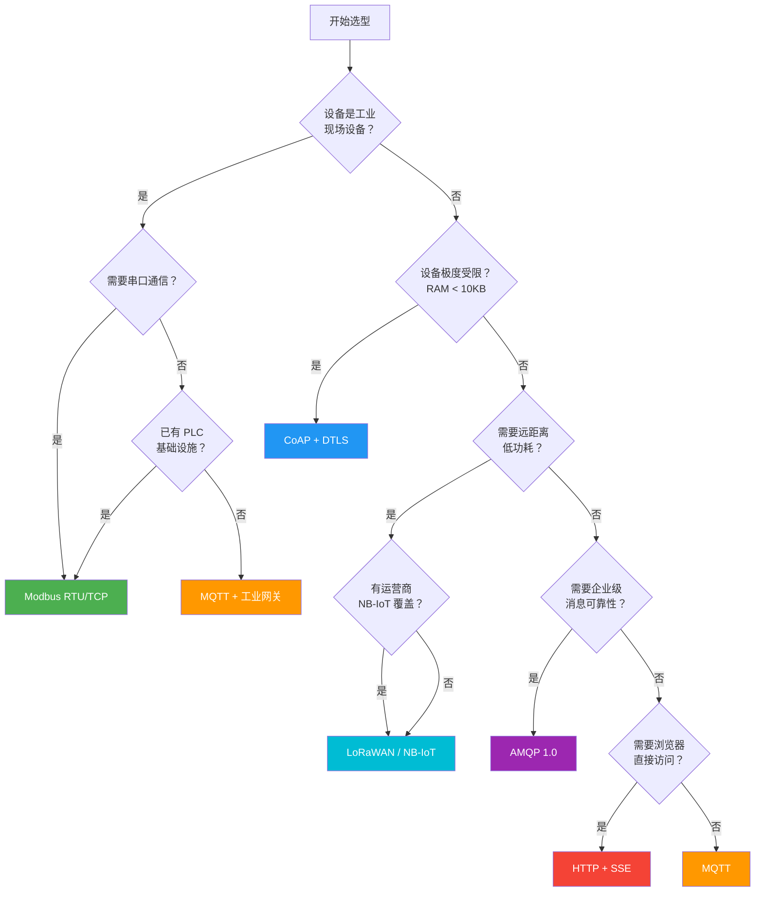
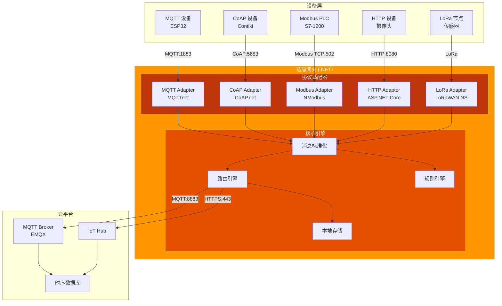
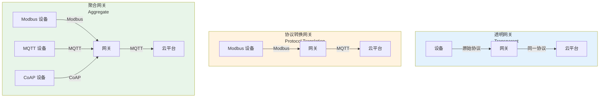
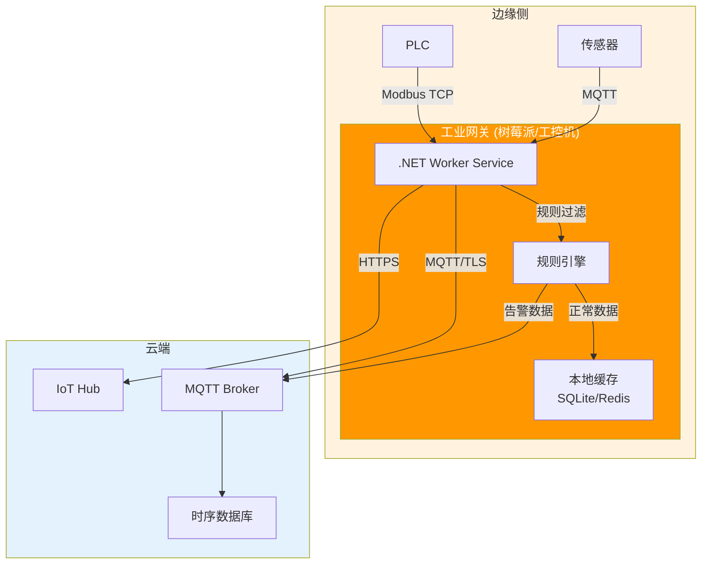

# 协议选型与网关设计

IoT 项目最大的架构决策之一就是通信协议选择——选错了协议，后期的改造成本可能数倍于初期投入。本文从协议对比矩阵到选型决策流，从多协议网关架构到 .NET Worker Service 实现，构建完整的协议工程能力。

## 1. 协议对比矩阵

### 1.1 六大主流协议

| 维度 | MQTT | HTTP | CoAP | Modbus | AMQP | LoRaWAN |
|------|------|------|------|--------|------|---------|
| **传输层** | TCP | TCP | UDP | TCP/Serial | TCP | LPWAN |
| **模式** | Pub/Sub | Req/Res | Req/Res | Master/Slave | Pub/Sub | ADR |
| **带宽** | 极低 | 高 | 极低 | 低 | 中 | 极低 |
| **延迟** | 低 | 中 | 低 | 低 | 低 | 高（秒级） |
| **功耗** | 低 | 高 | 极低 | 低 | 中 | 极低 |
| **安全** | TLS | TLS | DTLS | 无（RTU）/TLS（TCP） | TLS | AES-128 |
| **可靠性** | QoS 0/1/2 | 状态码 | CON/NON | CRC/超时重试 | 确认机制 | ADR |
| **复杂度** | 低 | 低 | 中 | 低 | 高 | 中 |
| **适用规模** | 百万级 | 千级 | 万级 | 百级 | 十万级 | 万级 |
| **典型场景** | 遥测上报 | REST API | 受限设备 | 工业现场 | 企业集成 | 远距离采集 |

### 1.2 关键指标量化

```
协议开销（单包最小头部字节数）：
  MQTT:    2B 固定头 + Topic
  HTTP:    ~200B（请求行 + 头部）
  CoAP:    4B 固定头
  Modbus:  8B MBAP + PDU
  AMQP:    8B 帧头 + 指令
  LoRaWAN: 0-13B MAC 层
```

::: tip 选择协议的第一原则
不要追求"万能协议"。绝大多数 IoT 项目只需要 **MQTT + HTTP** 两种协议：设备遥测用 MQTT，管理 API 用 HTTP。只在有明确需求时才引入 CoAP（极度受限设备）、Modbus（工业现场）或 AMQP（企业消息集成）。
:::

## 2. 协议选型决策流

### 2.1 决策流程图



### 2.2 典型选型场景

| 场景 | 推荐协议 | 理由 |
|------|----------|------|
| 智能家居 | MQTT + HTTP | Wi-Fi 环境，设备资源充足 |
| 工厂设备监控 | Modbus TCP + MQTT 网关 | 现场设备用 Modbus，上云用 MQTT |
| 智慧农业 | LoRaWAN + MQTT 网关 | 野外广覆盖、低功耗 |
| 受限传感器 | CoAP + DTLS | RAM < 10KB，UDP 节省资源 |
| 车联网 | MQTT + HTTP | 实时遥测 + 管理 API |
| 医疗设备 | MQTT + TLS 1.3 | 安全要求高，BLE 采集 + MQTT 上传 |

## 3. 多协议网关架构

### 3.1 整体架构



### 3.2 统一消息模型

```csharp
/// <summary>
/// 网关统一消息格式——所有协议适配器输出此格式
/// </summary>
public record GatewayMessage
{
    /// <summary>设备唯一标识</summary>
    public required string DeviceId { get; init; }

    /// <summary>原始协议</summary>
    public required string Protocol { get; init; } // MQTT, CoAP, Modbus, HTTP

    /// <summary>消息类型</summary>
    public required string MessageType { get; init; } // Telemetry, Command, Status, Alarm

    /// <summary>标准化负载（JSON）</summary>
    public required string Payload { get; init; }

    /// <summary>时间戳</summary>
    public DateTime Timestamp { get; init; } = DateTime.UtcNow;

    /// <summary>QoS 等级</summary>
    public int QoS { get; init; } = 1;

    /// <summary>是否保留</summary>
    public bool Retain { get; init; } = false;

    /// <summary>原始 Topic/地址</summary>
    public string? SourceTopic { get; init; }
}
```

## 4. .NET 网关实现

### 4.1 协议适配器接口

```csharp
/// <summary>
/// 协议适配器抽象接口
/// </summary>
public interface IProtocolAdapter : IAsyncDisposable
{
    /// <summary>协议名称</summary>
    string ProtocolName { get; }

    /// <summary>启动适配器</summary>
    Task StartAsync(CancellationToken cancellationToken);

    /// <summary>停止适配器</summary>
    Task StopAsync(CancellationToken cancellationToken);
}

/// <summary>
/// 消息总线接口——适配器通过此接口发送标准化消息
/// </summary>
public interface IMessageBus
{
    /// <summary>发布消息到网关核心</summary>
    Task PublishAsync(GatewayMessage message, CancellationToken cancellationToken = default);

    /// <summary>订阅消息</summary>
    IAsyncEnumerable<GatewayMessage> SubscribeAsync(
        Func<GatewayMessage, bool> filter, CancellationToken cancellationToken = default);
}
```

### 4.2 MQTT 适配器

```csharp
using MQTTnet;
using MQTTnet.Client;

public class MqttAdapter : IProtocolAdapter
{
    private readonly IMessageBus _messageBus;
    private IMqttClient? _client;
    private readonly string _brokerHost;
    private readonly int _brokerPort;

    public string ProtocolName => "MQTT";

    public MqttAdapter(IMessageBus messageBus, string brokerHost = "localhost", int brokerPort = 1883)
    {
        _messageBus = messageBus;
        _brokerHost = brokerHost;
        _brokerPort = brokerPort;
    }

    public async Task StartAsync(CancellationToken cancellationToken)
    {
        var factory = new MqttFactory();
        _client = factory.CreateMqttClient();

        var options = new MqttClientOptionsBuilder()
            .WithTcpServer(_brokerHost, _brokerPort)
            .WithClientId($"gateway-mqtt-{Guid.NewGuid():N}")
            .Build();

        _client.ApplicationMessageReceivedAsync += async e =>
        {
            var message = new GatewayMessage
            {
                DeviceId = ExtractDeviceId(e.ApplicationMessage.Topic),
                Protocol = "MQTT",
                MessageType = ClassifyMessage(e.ApplicationMessage.Topic),
                Payload = System.Text.Encoding.UTF8.GetString(e.ApplicationMessage.PayloadSegment),
                SourceTopic = e.ApplicationMessage.Topic
            };

            await _messageBus.PublishAsync(message, cancellationToken);
        };

        await _client.ConnectAsync(options, cancellationToken);

        // 订阅所有设备数据
        var subscribeOptions = new MqttClientSubscribeOptionsBuilder()
            .WithTopicFilter("devices/#")
            .WithTopicFilter("sensors/#")
            .Build();

        await _client.SubscribeAsync(subscribeOptions, cancellationToken);
        Console.WriteLine("[MQTT Adapter] 已启动并订阅 devices/#, sensors/#");
    }

    public async Task StopAsync(CancellationToken cancellationToken)
    {
        if (_client?.IsConnected == true)
        {
            await _client.DisconnectAsync(cancellationToken: cancellationToken);
        }
    }

    private static string ExtractDeviceId(string topic)
    {
        var parts = topic.Split('/');
        return parts.Length >= 2 ? parts[1] : "unknown";
    }

    private static string ClassifyMessage(string topic)
    {
        if (topic.Contains("/data") || topic.Contains("/telemetry")) return "Telemetry";
        if (topic.Contains("/command") || topic.Contains("/cmd")) return "Command";
        if (topic.Contains("/status")) return "Status";
        if (topic.Contains("/alarm")) return "Alarm";
        return "Telemetry";
    }

    public async ValueTask DisposeAsync()
    {
        if (_client != null)
        {
            await StopAsync(CancellationToken.None);
            _client.Dispose();
        }
    }
}
```

### 4.3 Modbus 适配器

```csharp
using System.Net.Sockets;
using NModbus;

public class ModbusAdapter : IProtocolAdapter
{
    private readonly IMessageBus _messageBus;
    private readonly Dictionary<byte, string> _deviceMap;
    private readonly string _modbusHost;
    private readonly int _modbusPort;
    private PeriodicTimer? _timer;

    public string ProtocolName => "Modbus";

    public ModbusAdapter(IMessageBus messageBus, string modbusHost = "192.168.1.100", int modbusPort = 502)
    {
        _messageBus = messageBus;
        _modbusHost = modbusHost;
        _modbusPort = modbusPort;
        _deviceMap = new Dictionary<byte, string>
        {
            [1] = "plc-line1",
            [2] = "plc-line2",
            [3] = "instrument-01"
        };
    }

    public async Task StartAsync(CancellationToken cancellationToken)
    {
        _timer = new PeriodicTimer(TimeSpan.FromSeconds(5));
        Console.WriteLine("[Modbus Adapter] 已启动，轮询间隔 5 秒");

        while (await _timer.WaitForNextTickAsync(cancellationToken))
        {
            try
            {
                using var client = new TcpClient();
                await client.ConnectAsync(_modbusHost, _modbusPort, cancellationToken);

                var factory = new ModbusFactory();
                IModbusMaster master = factory.CreateMaster(client);
                master.Transport.ReadTimeout = 3000;

                foreach (var (slaveId, deviceId) in _deviceMap)
                {
                    ushort[] registers = await master.ReadHoldingRegistersAsync(
                        slaveId, startAddress: 0, numberOfPoints: 10, cancellationToken);

                    var payload = new
                    {
                        temperature = registers[0] / 10.0,
                        pressure = registers[1] / 10.0,
                        status = registers[3]
                    };

                    var message = new GatewayMessage
                    {
                        DeviceId = deviceId,
                        Protocol = "Modbus",
                        MessageType = "Telemetry",
                        Payload = System.Text.Json.JsonSerializer.Serialize(payload)
                    };

                    await _messageBus.PublishAsync(message, cancellationToken);
                }
            }
            catch (Exception ex)
            {
                Console.WriteLine($"[Modbus Adapter] 轮询失败: {ex.Message}");
            }
        }
    }

    public Task StopAsync(CancellationToken cancellationToken)
    {
        _timer?.Dispose();
        return Task.CompletedTask;
    }

    public ValueTask DisposeAsync()
    {
        _timer?.Dispose();
        return ValueTask.CompletedTask;
    }
}
```

### 4.4 完整的 Worker Service 网关

```csharp
using Microsoft.Extensions.DependencyInjection;
using Microsoft.Extensions.Hosting;
using Microsoft.Extensions.Logging;

class Program
{
    static async Task Main(string[] args)
    {
        var builder = Host.CreateDefaultBuilder(args);

        builder.ConfigureServices((context, services) =>
        {
            // 注册消息总线
            services.AddSingleton<IMessageBus, InMemoryMessageBus>();

            // 注册协议适配器
            services.AddSingleton<IProtocolAdapter, MqttAdapter>();
            services.AddSingleton<IProtocolAdapter, ModbusAdapter>();

            // 注册网关核心服务
            services.AddHostedService<GatewayCoreService>();

            // 注册上游转发服务
            services.AddHostedService<UpstreamForwarder>();
        });

        var host = builder.Build();
        await host.RunAsync();
    }
}

/// <summary>
/// 网关核心服务——启动所有协议适配器
/// </summary>
public class GatewayCoreService : IHostedService
{
    private readonly IEnumerable<IProtocolAdapter> _adapters;
    private readonly ILogger<GatewayCoreService> _logger;

    public GatewayCoreService(
        IEnumerable<IProtocolAdapter> adapters,
        ILogger<GatewayCoreService> logger)
    {
        _adapters = adapters;
        _logger = logger;
    }

    public async Task StartAsync(CancellationToken cancellationToken)
    {
        _logger.LogInformation("网关核心服务启动中...");

        foreach (var adapter in _adapters)
        {
            try
            {
                await adapter.StartAsync(cancellationToken);
                _logger.LogInformation("适配器 {Protocol} 已启动", adapter.ProtocolName);
            }
            catch (Exception ex)
            {
                _logger.LogError(ex, "适配器 {Protocol} 启动失败", adapter.ProtocolName);
            }
        }
    }

    public async Task StopAsync(CancellationToken cancellationToken)
    {
        foreach (var adapter in _adapters)
        {
            await adapter.StopAsync(cancellationToken);
        }
    }
}

/// <summary>
/// 上游转发服务——将标准化消息转发到云平台
/// </summary>
public class UpstreamForwarder : BackgroundService
{
    private readonly IMessageBus _messageBus;
    private readonly ILogger<UpstreamForwarder> _logger;

    public UpstreamForwarder(IMessageBus messageBus, ILogger<UpstreamForwarder> logger)
    {
        _messageBus = messageBus;
        _logger = logger;
    }

    protected override async Task ExecuteAsync(CancellationToken stoppingToken)
    {
        _logger.LogInformation("上游转发服务已启动");

        await foreach (var message in _messageBus.SubscribeAsync(
            m => m.MessageType == "Telemetry", stoppingToken))
        {
            try
            {
                // 转换为上游 MQTT 消息格式
                var upstreamTopic = $"upstream/{message.DeviceId}/telemetry";
                _logger.LogDebug("转发: {Topic} ← [{Protocol}] {Payload}",
                    upstreamTopic, message.Protocol, message.Payload);

                // TODO: 实际转发到云平台 MQTT Broker
                // await _upstreamClient.PublishAsync(upstreamTopic, message.Payload, stoppingToken);
            }
            catch (Exception ex)
            {
                _logger.LogError(ex, "消息转发失败");
            }
        }
    }
}

/// <summary>
/// 内存消息总线（简单实现）
/// </summary>
public class InMemoryMessageBus : IMessageBus
{
    private readonly Channel<GatewayMessage> _channel = Channel.CreateUnbounded<GatewayMessage>();

    public async Task PublishAsync(GatewayMessage message, CancellationToken cancellationToken = default)
    {
        await _channel.Writer.WriteAsync(message, cancellationToken);
    }

    public async IAsyncEnumerable<GatewayMessage> SubscribeAsync(
        Func<GatewayMessage, bool> filter,
        [System.Runtime.CompilerServices.EnumeratorCancellation] CancellationToken cancellationToken = default)
    {
        await foreach (var message in _channel.Reader.ReadAllAsync(cancellationToken))
        {
            if (filter(message))
            {
                yield return message;
            }
        }
    }
}
```

## 5. 边缘网关模式

### 5.1 三种网关模式



| 模式 | 功能 | 复杂度 | 适用场景 |
|------|------|--------|----------|
| 透明 | 协议不变，仅转发 | 低 | 设备直连云平台，需 TLS 终结 |
| 协议转换 | 旧协议→MQTT/HTTP | 中 | 遗留设备上云（Modbus→MQTT） |
| 聚合 | 多协议接入，统一上云 | 高 | 异构设备环境（工厂、园区） |

::: important 选择网关模式
- **新项目** → 透明网关（设备原生 MQTT，网关只做 TLS 卸载和认证）
- **旧设备改造** → 协议转换网关（Modbus/OPC UA → MQTT）
- **混合环境** → 聚合网关（多协议适配 + 统一上云）
:::

### 5.2 网关部署架构



::: warning 网关离线自治
边缘网关**必须**具备离线自治能力：
1. **本地缓存**：断网时数据写入 SQLite/Redis，恢复后断点续传
2. **本地规则**：关键告警不依赖云端，网关本地触发
3. **心跳上报**：网关自身状态定期上报，云端监控网关健康
:::

## 参考链接

- [MQTT 5.0 规范](https://docs.oasis-open.org/mqtt/mqtt/v5.0/mqtt-v5.0.html)
- [CoAP RFC 7252](https://datatracker.ietf.org/doc/html/rfc7252)
- [Modbus 协议规范](https://modbus.org/specs.php)
- [AMQP 1.0 规范](https://www.oasis-open.org/committees/amqp/)
- [LoRaWAN 规范](https://lora-alliance.org/resource_hub/lorawan-specification-v1-0-4/)
- [Azure IoT Edge 网关模式](https://learn.microsoft.com/azure/iot-edge/iot-edge-as-gateway)
- [.NET Worker Service 文档](https://learn.microsoft.com/dotnet/core/extensions/workers)

## 面试技巧

1. **"MQTT、CoAP、HTTP 三种协议怎么选？"** —— MQTT 适合设备遥测（Pub/Sub、QoS、低带宽）；CoAP 适合极度受限设备（UDP、4B 头部、DTLS）；HTTP 适合管理 API 和浏览器访问。大多数项目 MQTT + HTTP 就够了，只在 RAM < 10KB 的设备才考虑 CoAP。

2. **"边缘网关的三种模式是什么？"** —— 透明网关（协议不变，仅做 TLS 卸载和认证）、协议转换网关（旧协议→MQTT，如 Modbus→MQTT）、聚合网关（多协议适配统一上云）。面试时强调选型依据：新项目用透明，旧设备改造用协议转换，混合环境用聚合。

3. **"如何设计多协议网关的消息模型？"** —— 定义统一消息格式（DeviceId、Protocol、MessageType、Payload、Timestamp），各协议适配器负责将原始消息转换为统一格式。关键：Payload 统一用 JSON，MessageType 枚举（Telemetry/Command/Status/Alarm），网关核心只处理统一格式。

4. **"网关断网怎么办？"** —— 离线自治三要素：本地缓存（SQLite/Redis 存储断网期间数据，恢复后断点续传）、本地规则（关键告警不依赖云端，网关本地触发）、心跳上报（网关自身状态定期上报，云端监控网关健康）。面试时用具体场景说明：工厂断网 30 分钟，网关本地缓存 3600 条数据，网络恢复后按时间戳续传。

5. **"协议适配器怎么解耦？"** —— 适配器模式 + 消息总线。适配器实现统一接口（IProtocolAdapter），通过消息总线（IMessageBus）发布标准化消息。网关核心和上游转发只依赖消息总线，不依赖具体协议。新增协议只需新增适配器，无需修改核心逻辑。
