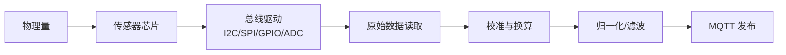
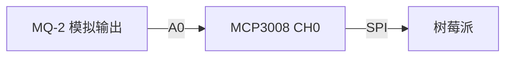

# 环境传感器

环境传感器是 IoT 项目中最常见的一类传感器，涵盖温湿度、气压、光照、气体浓度等物理量。本章将使用 .NET 的 `Iot.Device.Bindings` NuGet 包驱动 BME280、BH1750、MQ-2、DHT11/DHT22 等主流传感器，并介绍数据归一化与滤波方法。

## 数据流全景

从传感器原始信号到 MQTT 发布，数据经过多个处理阶段：



::: tip Iot.Device.Bindings 简介
`Iot.Device.Bindings` 是 .NET IoT 官方库，封装了数百种传感器/执行器的驱动。它基于 `System.Device.Gpio`，提供统一的使用模式：创建总线 → 实例化设备 → 读取数据。无需手写寄存器操作。
:::

## 项目准备

创建控制台项目并安装依赖：

```bash
dotnet new console -n EnvSensorDemo
cd EnvSensorDemo
dotnet add package Iot.Device.Bindings
dotnet add package System.Device.Gpio
dotnet add package MQTTnet
```

::: important 运行要求
- 需要 Linux 环境（树莓派 / Ubuntu 虚拟机）或启用了 GPIO 仿真的 Windows
- I2C 设备需启用 `i2c-arm` 并确认总线号（通常 `/dev/i2c-1`）
- 执行 `i2cdetect -y 1` 确认传感器地址
:::

---

## BME280 — 温湿度气压三合一

BME280 是博世出品的环境传感器，通过 I2C 总线通信，可同时测量温度（±1°C）、湿度（±3%）、气压（±1 hPa）。

### 接线

| BME280 引脚 | 树莓派引脚 |
|-------------|-----------|
| VIN | 3.3V (Pin 1) |
| GND | GND (Pin 6) |
| SDA | SDA (Pin 3, GPIO2) |
| SCL | SCL (Pin 5, GPIO3) |

### 完整代码

```csharp
using System;
using System.Device.I2c;
using System.Threading;
using Iot.Device.Bmxx80;
using Iot.Device.Bmxx80.FilteringMode;

const int I2cBusId = 1;
const int Bme280Address = 0x76; // 部分模块为 0x77

using var i2cDevice = I2cDevice.Create(new I2cConnectionSettings(I2cBusId, Bme280Address));
using var bme280 = new Bme280(i2cDevice);

// 配置采样参数（更高的采样率 = 更精确但更慢）
bme280.TemperatureSampling = Sampling.LowPower;
bme280.PressureSampling = Sampling.UltraHighResolution;
bme280.HumiditySampling = Sampling.Standard;

// 设置 IIR 滤波器，减少短期波动
bme280.FilterMode = Bme280FilteringMode.X4;

Console.WriteLine("BME280 环境监测启动...\n");

while (true)
{
    // 执行一次测量（读取所有通道）
    var result = bme280.Read();

    if (result.Temperature.HasValue && result.Pressure.HasValue && result.Humidity.HasValue)
    {
        var temp = result.Temperature.Value.DegreesCelsius;
        var pressure = result.Pressure.Value.Hectopascals;
        var humidity = result.Humidity.Value.Percent;

        // 计算海拔（基于标准大气压）
        var altitude = 44330.0 * (1.0 - Math.Pow(pressure / 1013.25, 1.0 / 5.255));

        Console.WriteLine($"温度: {temp:F1} °C");
        Console.WriteLine($"湿度: {humidity:F1} %");
        Console.WriteLine($"气压: {pressure:F1} hPa");
        Console.WriteLine($"海拔: {altitude:F1} m");
        Console.WriteLine("---");
    }
    else
    {
        Console.WriteLine("读取失败，检查接线和地址");
    }

    Thread.Sleep(2000);
}
```

::: warning I2C 地址注意
BME280 模块默认地址可能是 `0x76` 或 `0x77`，取决于 SDO 引脚电平。如果读取失败，先用 `i2cdetect -y 1` 确认实际地址。
:::

---

## BH1750 — 光照强度

BH1750 是数字光照传感器，量程 1-65535 lux，I2C 接口，无需校准。

```csharp
using System;
using System.Device.I2c;
using System.Threading;
using Iot.Device.Bh1750;

const int I2cBusId = 1;
const int Bh1750Address = 0x23; // ADDR 引脚低电平; 高电平为 0x5C

using var i2cDevice = I2cDevice.Create(new I2cConnectionSettings(I2cBusId, Bh1750Address));
using var bh1750 = new Bh1750(i2cDevice);

// 选择测量模式
bh1750.MeasuringMode = Bh1750MeasuringMode.ContinuouslyHighResolutionMode;
// 高分辨率模式: 分辨率 1 lux, 测量时间约 120ms

Console.WriteLine("BH1750 光照监测\n");

while (true)
{
    var lux = bh1750.Illuminance;
    Console.WriteLine($"光照强度: {lux:F1} lux");

    // 常见参考值
    // < 10 lux: 夜晚
    // 100-300 lux: 室内照明
    // 300-500 lux: 办公室
    // > 10000 lux: 直射阳光
    if (lux < 10)
        Console.WriteLine("  → 环境较暗");
    else if (lux > 10000)
        Console.WriteLine("  → 强光直射");

    Thread.Sleep(500);
}
```

---

## MQ-2 — 气体传感器（通过 MCP3008 ADC）

MQ-2 是模拟气体传感器，检测 LPG、丙烷、甲烷等可燃气体。由于树莓派没有 ADC，需通过 MCP3008（SPI ADC）读取模拟值。

### 接线示意



### 代码

```csharp
using System;
using System.Device.Spi;
using System.Threading;
using Iot.Device.Adc;

// SPI 配置（MCP3008）
var spiSettings = new SpiConnectionSettings(0, 0)
{
    ClockFrequency = 1000000, // 1 MHz
    Mode = SpiMode.Mode0
};

using var spiDevice = SpiDevice.Create(spiSettings);
using var mcp3008 = new Mcp3008(spiDevice);

const int Channel = 0;       // MQ-2 连接到 CH0
const double Vref = 3.3;     // 参考电压
const double LoadResistance = 5.0; // MQ-2 负载电阻 (kΩ)

Console.WriteLine("MQ-2 气体浓度监测\n");

while (true)
{
    // 读取 ADC 原始值 (0-1023)
    int rawValue = mcp3008.Read(Channel);
    double voltage = rawValue * Vref / 1023.0;

    // 计算传感器电阻 Rs
    double rs = (Vref - voltage) / voltage * LoadResistance;

    // 使用 MQ-2 数据手册的 Rs/Ro 比值曲线估算浓度
    // 此处简化：假设 Ro 在清洁空气中约 10kΩ
    double ro = 10.0;
    double ratio = rs / ro;

    // 近似 LPG 浓度（基于数据手册曲线）
    // 实际应用中需要多点校准
    double ppm = Math.Pow(10, (Math.Log10(ratio) - 0.35) / -0.65);

    Console.WriteLine($"ADC 原始值: {rawValue}");
    Console.WriteLine($"电压: {voltage:F3} V");
    Console.WriteLine($"Rs/Ro 比值: {ratio:F2}");
    Console.WriteLine($"估算 LPG 浓度: {ppm:F0} ppm");

    if (ppm > 200)
        Console.WriteLine("⚠ 警告: 可燃气体浓度偏高！");

    Thread.Sleep(1000);
}
```

::: warning MQ-2 预热
MQ-2 传感器上电后需要 20-60 秒预热才能稳定读数。首次使用或长期存放后，预热时间可能需要 5 分钟以上。
:::

---

## DHT11 / DHT22 — 温湿度（GPIO）

DHT 系列使用单总线协议（非标准 I2C），通过 GPIO 数据引脚通信。`Iot.Device.Bindings` 提供了完整的驱动。

```csharp
using System;
using System.Device.Gpio;
using System.Threading;
using Iot.Device.Dhtxx;

const int DataPin = 4; // GPIO4

using var dht = new Dht22(DataPin);

Console.WriteLine("DHT22 温湿度监测\n");

while (true)
{
    var temp = dht.Temperature;
    var humidity = dht.Humidity;

    if (dht.IsLastReadSuccessful)
    {
        Console.WriteLine($"温度: {temp.Celsius:F1} °C");
        Console.WriteLine($"湿度: {humidity.Percent:F1} %");
    }
    else
    {
        // DHT 读取失败较常见（时序敏感），重试即可
        Console.WriteLine("读取失败，下一周期重试");
    }

    Thread.Sleep(2500); // DHT22 最短采样间隔 2 秒
}
```

::: important DHT11 vs DHT22
| 特性 | DHT11 | DHT22 |
|------|-------|-------|
| 温度范围 | 0~50°C (±2°C) | -40~80°C (±0.5°C) |
| 湿度范围 | 20~80% (±5%) | 0~100% (±2%) |
| 采样频率 | 1 Hz | 0.5 Hz |
| 价格 | 低 | 中 |

精度要求高时首选 DHT22，原型验证可用 DHT11。
:::

---

## 传感器数据归一化与滤波

原始传感器数据通常包含噪声和异常值，需要归一化与滤波处理。

### 滑动平均滤波

最简单有效的低通滤波，适合消除高频噪声：

```csharp
public class MovingAverageFilter
{
    private readonly Queue<double> _buffer;
    private readonly int _windowSize;
    private double _sum;

    public MovingAverageFilter(int windowSize)
    {
        _windowSize = windowSize;
        _buffer = new Queue<double>(windowSize);
    }

    public double Add(double value)
    {
        if (_buffer.Count >= _windowSize)
        {
            _sum -= _buffer.Dequeue();
        }

        _buffer.Enqueue(value);
        _sum += value;

        return _sum / _buffer.Count;
    }
}
```

### 简易卡尔曼滤波

卡尔曼滤波器在噪声环境中表现优于滑动平均，适用于动态变化的传感器：

```csharp
public class SimpleKalmanFilter
{
    private double _estimate;
    private double _errorEstimate;
    private readonly double _errorMeasure;  // 测量噪声
    private readonly double _q;             // 过程噪声

    public SimpleKalmanFilter(double errorMeasure, double errorEstimate, double q)
    {
        _errorMeasure = errorMeasure;
        _errorEstimate = errorEstimate;
        _q = q;
        _estimate = 0;
    }

    public double Update(double measurement)
    {
        // 预测步骤
        _errorEstimate += _q;

        // 更新步骤：计算卡尔曼增益
        double kalmanGain = _errorEstimate / (_errorEstimate + _errorMeasure);

        // 修正估计值
        _estimate += kalmanGain * (measurement - _estimate);
        _errorEstimate *= (1 - kalmanGain);

        return _estimate;
    }
}
```

### 综合使用示例

```csharp
var tempFilter = new SimpleKalmanFilter(
    errorMeasure: 0.5,    // 预期测量噪声 ±0.5°C
    errorEstimate: 2.0,   // 初始估计误差
    q: 0.01               // 过程噪声（越小越平滑，越大响应越快）
);

// 在传感器读取循环中使用
var result = bme280.Read();
if (result.Temperature.HasValue)
{
    double rawTemp = result.Temperature.Value.DegreesCelsius;
    double filteredTemp = tempFilter.Update(rawTemp);
    Console.WriteLine($"原始: {rawTemp:F2}°C → 滤波: {filteredTemp:F2}°C");
}
```

---

## MQTT 数据发布

将传感器数据通过 MQTT 发布到消息代理，是 IoT 系统的标准做法：

```csharp
using MQTTnet;
using MQTTnet.Client;

// 创建 MQTT 客户端
var factory = new MqttFactory();
using var mqttClient = factory.CreateMqttClient();

var options = new MqttClientOptionsBuilder()
    .WithTcpServer("broker.emqx.io", 1883)
    .WithClientId($"env-sensor-{Environment.MachineName}")
    .WithCleanSession()
    .Build();

await mqttClient.ConnectAsync(options);

// 发布传感器数据
async Task PublishSensorData(string sensorId, string type, double value, string unit)
{
    var payload = $$"""
    {
        "deviceId": "{{sensorId}}",
        "timestamp": "{{DateTime.UtcNow:O}}",
        "metric": "{{type}}",
        "value": {{value:F2}},
        "unit": "{{unit}}"
    }
    """;

    var message = new MqttApplicationMessageBuilder()
        .WithTopic($"iot/sensors/{sensorId}/{type}")
        .WithPayload(payload)
        .WithAtLeastOnceQoS()
        .Build();

    await mqttClient.PublishAsync(message);
}

// 在读取循环中调用
await PublishSensorData("bme280-01", "temperature", filteredTemp, "°C");
```

---

## 校准与错误处理

### 传感器校准

```csharp
public class SensorCalibration
{
    /// <summary>
    /// 两点线性校准：用两个已知参考点映射传感器值
    /// </summary>
    public static (double slope, double offset) TwoPointCalibration(
        (double raw, double ref_) point1,
        (double raw, double ref_) point2)
    {
        double slope = (point2.ref_ - point1.ref_) / (point2.raw - point1.raw);
        double offset = point1.ref_ - slope * point1.raw;
        return (slope, offset);
    }

    /// <summary>
    /// 应用校准参数
    /// </summary>
    public static double ApplyCalibration(double rawValue, double slope, double offset)
    {
        return slope * rawValue + offset;
    }
}

// 使用示例：用冰水(0°C)和沸水(100°C)两点校准
var (slope, offset) = SensorCalibration.TwoPointCalibration(
    point1: (raw: -2.5, ref_: 0.0),   // 冰水实测 -2.5°C
    point2: (raw: 98.3, ref_: 100.0)   // 沸水实测 98.3°C
);
double calibrated = SensorCalibration.ApplyCalibration(rawTemp, slope, offset);
```

### 异常值过滤

```csharp
public class OutlierFilter
{
    private readonly List<double> _history = new();
    private readonly int _windowSize;
    private readonly double _sigmaThreshold;

    public OutlierFilter(int windowSize = 10, double sigmaThreshold = 3.0)
    {
        _windowSize = windowSize;
        _sigmaThreshold = sigmaThreshold;
    }

    public (bool isValid, double value) Check(double value)
    {
        if (_history.Count < 3)
        {
            _history.Add(value);
            return (true, value);
        }

        double mean = _history.Average();
        double stdDev = Math.Sqrt(_history.Select(x => Math.Pow(x - mean, 2)).Average());

        bool isValid = Math.Abs(value - mean) <= _sigmaThreshold * stdDev;

        if (isValid)
        {
            if (_history.Count >= _windowSize)
                _history.RemoveAt(0);
            _history.Add(value);
        }

        return (isValid, isValid ? value : mean);
    }
}
```

---

## 参考链接

- [Iot.Device.Bindings GitHub 仓库](https://github.com/dotnet/iot/tree/main/src/devices)
- [BME280 数据手册](https://www.bosch-sensortec.com/media/boschsensortec/downloads/datasheets/bst-bme280-ds002.pdf)
- [BH1750 数据手册](https://www.mouser.com/datasheet/2/348/bh1750fvi-e-186247.pdf)
- [MCP3008 数据手册](https://www.microchip.com/en-us/product/MCP3008)
- [DHT11/DHT22 驱动源码](https://github.com/dotnet/iot/tree/main/src/devices/Dhtxx)
- [System.Device.Gpio 文档](https://learn.microsoft.com/dotnet/api/system.device.gpio)
- [MQTTnet 官方文档](https://github.com/dotnet/MQTTnet)

---

## 面试技巧

::: tip 面试高频问题
1. **I2C 和 SPI 的区别？什么时候选 I2C？**
   - I2C 两线制（SDA+SCL）、多从设备、速率较低（标准 100kHz/快速 400kHz）；SPI 四线制、全双工、速率可达数十 MHz。传感器类低速设备优先 I2C，高速 ADC/显示屏选 SPI。

2. **传感器数据如何去噪？滑动平均 vs 卡尔曼滤波？**
   - 滑动平均实现简单、计算量小，适合稳态信号；卡尔曼滤波有状态预测能力，适合动态跟踪，但需调参。面试中答出"卡尔曼增益的意义"是加分项。

3. **MQ-2 模拟传感器在树莓派上如何读取？**
   - 树莓派无 ADC，需外接 MCP3008 等 ADC 芯片通过 SPI 读取模拟值，再换算为电阻/浓度。

4. **Iot.Device.Bindings 的设计模式是什么？**
   - 面向对象封装：每种设备一个类，构造函数接收总线对象（I2cDevice / SpiDevice / GpioController），通过 Read/Write 方法暴露高层 API，隐藏寄存器细节。
:::
