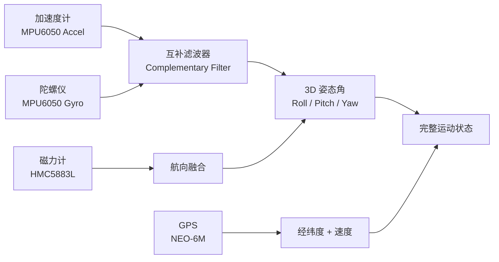
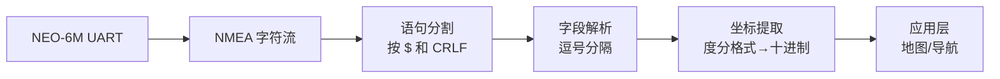
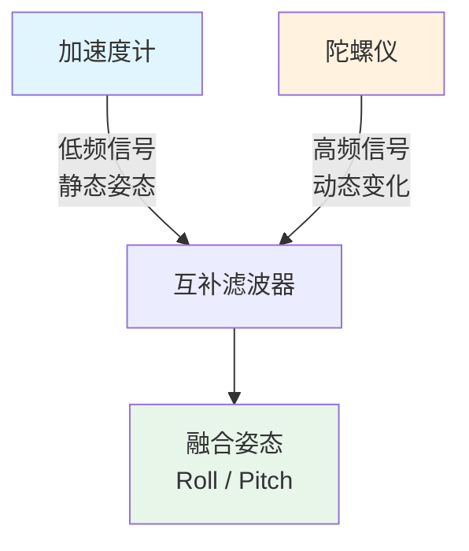

# 运动与定位

运动与定位传感器是机器人、无人机、穿戴设备的核心组件。本章涵盖六轴 IMU（MPU6050）、GPS 定位（NEO-6M）和磁力计（HMC5883L），并介绍传感器融合的基本原理。

## 传感器融合流程



---

## MPU6050 — 六轴加速度计 + 陀螺仪

MPU6050 集成三轴加速度计和三轴陀螺仪，I2C 接口，是 IMU（惯性测量单元）的经典选择。

### 寄存器映射

| 地址 | 名称 | 内容 |
|------|------|------|
| 0x3B-0x40 | ACCEL_XOUT | 加速度 X/Y/Z（每轴 16 位） |
| 0x41-0x42 | TEMP_OUT | 温度 |
| 0x43-0x48 | GYRO_XOUT | 角速度 X/Y/Z（每轴 16 位） |
| 0x6B | PWR_MGMT_1 | 电源管理（唤醒控制） |
| 0x19 | SMPLRT_DIV | 采样率分频 |
| 0x1B | GYRO_CONFIG | 陀螺仪量程 |
| 0x1C | ACCEL_CONFIG | 加速度计量程 |

### 完整读取代码

```csharp
using System;
using System.Device.I2c;
using System.Threading;
using Iot.Device.Mpu6889;

// MPU6050 在 Iot.Device.Bindings 中通过 Mpu6889/Mpu6050 驱动支持
// 此处展示底层寄存器操作方式以理解原理

const int I2cBusId = 1;
const int Mpu6050Address = 0x68; // AD0 接低电平; 高电平为 0x69

using var i2c = I2cDevice.Create(new I2cConnectionSettings(I2cBusId, Mpu6050Address));

// 唤醒 MPU6050（清除 PWR_MGMT_1 的 sleep 位）
i2c.Write(new byte[] { 0x6B, 0x00 });
Thread.Sleep(100);

// 配置加速度计量程 ±2g
i2c.Write(new byte[] { 0x1C, 0x00 });

// 配置陀螺仪量程 ±250°/s
i2c.Write(new byte[] { 0x1B, 0x00 });

// 配置采样率 1kHz / (1+7) = 125Hz
i2c.Write(new byte[] { 0x19, 0x07 });

// 低通滤波器 ~44Hz
i2c.Write(new byte[] { 0x1A, 0x03 });

Console.WriteLine("MPU6050 六轴 IMU 读取\n");

while (true)
{
    // 读取加速度（6 字节）
    var accelData = ReadRegisters(i2c, 0x3B, 6);
    short ax = (short)((accelData[0] << 8) | accelData[1]);
    short ay = (short)((accelData[2] << 8) | accelData[3]);
    short az = (short)((accelData[4] << 8) | accelData[5]);

    // 读取陀螺仪（6 字节）
    var gyroData = ReadRegisters(i2c, 0x43, 6);
    short gx = (short)((gyroData[0] << 8) | gyroData[1]);
    short gy = (short)((gyroData[2] << 8) | gyroData[3]);
    short gz = (short)((gyroData[4] << 8) | gyroData[5]);

    // 转换为物理单位
    // ±2g 量程: 灵敏度 16384 LSB/g
    const double AccelSensitivity = 16384.0;
    // ±250°/s 量程: 灵敏度 131 LSB/(°/s)
    const double GyroSensitivity = 131.0;

    double axG = ax / AccelSensitivity;
    double ayG = ay / AccelSensitivity;
    double azG = az / AccelSensitivity;

    double gxDS = gx / GyroSensitivity;
    double gyDS = gy / GyroSensitivity;
    double gzDS = gz / GyroSensitivity;

    // 通过加速度计算倾斜角（静态时）
    double roll  = Math.Atan2(ayG, azG) * 180.0 / Math.PI;
    double pitch = Math.Atan2(-axG, Math.Sqrt(ayG * ayG + azG * azG)) * 180.0 / Math.PI;

    Console.WriteLine($"加速度: X={axG:F3}g  Y={ayG:F3}g  Z={azG:F3}g");
    Console.WriteLine($"角速度: X={gxDS:F1}°/s  Y={gyDS:F1}°/s  Z={gzDS:F1}°/s");
    Console.WriteLine($"倾斜: Roll={roll:F1}°  Pitch={pitch:F1}°");
    Console.WriteLine("---");

    Thread.Sleep(100);
}

static byte[] ReadRegisters(I2cDevice device, byte register, int length)
{
    device.WriteByte(register);
    return device.Read(length);
}
```

::: tip 量程选择
- 加速度计：±2g（精密运动检测）/ ±4g（日常活动）/ ±8g（冲击检测）/ ±16g（高速碰撞）
- 陀螺仪：±250°/s（精密稳定）/ ±500°/s（手势识别）/ ±1000°/s（快速旋转）/ ±2000°/s（无人机翻滚）
- 量程越小灵敏度越高，选择适合应用场景的量程。
:::

---

## NEO-6M GPS — 卫星定位

NEO-6M 通过 UART 输出 NMEA 格式的定位数据，速率默认 9600 baud。

### NMEA 语句解析

核心语句：

- `$GPGGA` — 定位数据（经纬度、卫星数、HDOP、海拔）
- `$GPRMC` — 推荐定位数据（时间、状态、经纬度、速度、航向）



### 完整代码

```csharp
using System;
using System.IO.Ports;
using System.Text.RegularExpressions;

const string PortName = "/dev/ttyS0"; // 树莓派串口
const int BaudRate = 9600;

using var serialPort = new SerialPort(PortName, BaudRate)
{
    DataBits = 8,
    Parity = Parity.None,
    StopBits = StopBits.One,
    NewLine = "\r\n"
};

serialPort.Open();
Console.WriteLine("NEO-6M GPS 定位读取\n");

string buffer = string.Empty;

while (true)
{
    if (serialPort.BytesToRead > 0)
    {
        buffer += serialPort.ReadExisting();

        // 按行解析 NMEA 语句
        int newlineIdx;
        while ((newlineIdx = buffer.IndexOf("\r\n")) >= 0)
        {
            string sentence = buffer.Substring(0, newlineIdx).Trim();
            buffer = buffer.Substring(newlineIdx + 2);

            if (sentence.StartsWith("$GPGGA") || sentence.StartsWith("$GNGGA"))
            {
                ParseGGA(sentence);
            }
            else if (sentence.StartsWith("$GPRMC") || sentence.StartsWith("$GNRMC"))
            {
                ParseRMC(sentence);
            }
        }
    }

    Thread.Sleep(50);
}

void ParseGGA(string sentence)
{
    // $GPGGA,hhmmss.ss,llll.ll,a,yyyyy.yy,a,x,xx,x.x,x.x,M,x.x,M,x.x,xxxx*hh
    var fields = sentence.Split(',');
    if (fields.Length < 15) return;

    string fixStatus = fields[6];
    if (fixStatus == "0")
    {
        Console.WriteLine("GPS: 未定位（等待卫星信号...）");
        return;
    }

    double latitude = ParseCoordinate(fields[2], fields[3]);
    double longitude = ParseCoordinate(fields[4], fields[5]);
    int satellites = int.Parse(fields[7]);
    double hdop = double.Parse(fields[8]);
    double altitude = double.Parse(fields[9]);

    Console.WriteLine($"=== GGA 定位 ===");
    Console.WriteLine($"纬度: {latitude:F6}°");
    Console.WriteLine($"经度: {longitude:F6}°");
    Console.WriteLine($"卫星数: {satellites}");
    Console.WriteLine($"HDOP: {hdop}");
    Console.WriteLine($"海拔: {altitude} m");
    Console.WriteLine($"Google Maps: https://maps.google.com/?q={latitude},{longitude}");
}

void ParseRMC(string sentence)
{
    var fields = sentence.Split(',');
    if (fields.Length < 12) return;

    if (fields[2] != "A") return; // V = 无效, A = 有效

    double latitude = ParseCoordinate(fields[3], fields[4]);
    double longitude = ParseCoordinate(fields[5], fields[6]);
    double speedKnots = double.Parse(fields[7]);
    double speedKmh = speedKnots * 1.852;
    double course = fields[8].Length > 0 ? double.Parse(fields[8]) : 0;

    Console.WriteLine($"速度: {speedKmh:F1} km/h  航向: {course:F1}°");
}

double ParseCoordinate(string value, string direction)
{
    // NMEA 格式: ddmm.mmmm 或 dddmm.mmmm
    int dotIndex = value.IndexOf('.');
    int degreeLength = dotIndex - 2;

    double degrees = double.Parse(value.Substring(0, degreeLength));
    double minutes = double.Parse(value.Substring(degreeLength));

    double decimalDegrees = degrees + minutes / 60.0;

    if (direction == "S" || direction == "W")
        decimalDegrees = -decimalDegrees;

    return decimalDegrees;
}
```

::: important GPS 定位注意事项
- 首次冷启动定位可能需要 30 秒到数分钟
- 室内通常无法定位，需在窗边或户外
- HDOP（水平精度因子）< 1 为优秀，> 4 较差
- 多路径效应（高楼反射信号）会导致定位漂移
:::

---

## HMC5883L — 磁力计与电子罗盘

HMC5883L 是三轴磁力计，I2C 接口，用于测量地磁场方向，计算电子罗盘航向角。

```csharp
using System;
using System.Device.I2c;
using System.Threading;

const int I2cBusId = 1;
const int HmcAddress = 0x1E;

using var i2c = I2cDevice.Create(new I2cConnectionSettings(I2cBusId, HmcAddress));

// 配置：8 倍增益 (±1.3 Ga 量程)，连续测量模式
i2c.Write(new byte[] { 0x01, 0x20 }); // Configuration Register B: Gain = 1090 LSB/Ga
i2c.Write(new byte[] { 0x02, 0x00 }); // Mode Register: Continuous measurement

const double GaussPerLSB = 1.0 / 1090.0; // 8 倍增益灵敏度

Console.WriteLine("HMC5883L 电子罗盘\n");

while (true)
{
    // 读取 6 字节磁力数据
    i2c.WriteByte(0x03);
    var data = i2c.Read(6);

    short mx = (short)((data[0] << 8) | data[1]);
    short mz = (short)((data[2] << 8) | data[3]); // 注意: Z 在 X 和 Y 之间
    short my = (short)((data[4] << 8) | data[5]);

    // 转换为高斯
    double mxG = mx * GaussPerLSB;
    double myG = my * GaussPerLSB;
    double mzG = mz * GaussPerLSB;

    // 计算航向角（假设设备水平放置）
    double heading = Math.Atan2(myG, mxG) * 180.0 / Math.PI;

    // 转换为 0-360°
    if (heading < 0) heading += 360;

    // 磁偏角校正（根据所在地查询）
    // 北京约 -6°, 上海约 -5°
    double declination = -6.0;
    heading += declination;
    if (heading < 0) heading += 360;
    if (heading >= 360) heading -= 360;

    string direction = heading switch
    {
        >= 337.5 or < 22.5 => "北",
        >= 22.5 and < 67.5 => "东北",
        >= 67.5 and < 112.5 => "东",
        >= 112.5 and < 157.5 => "东南",
        >= 157.5 and < 202.5 => "南",
        >= 202.5 and < 247.5 => "西南",
        >= 247.5 and < 292.5 => "西",
        _ => "西北"
    };

    Console.WriteLine($"磁力: X={mxG:F3} Y={myG:F3} Z={mzG:F3} Ga");
    Console.WriteLine($"航向: {heading:F1}° ({direction})");
    Console.WriteLine("---");

    Thread.Sleep(200);
}
```

::: warning 磁力计校准
HMC5883L 受硬铁干扰（附近铁磁材料）和软铁干扰（附近导磁材料）影响很大。实际使用前必须进行校准：
1. 旋转设备采集各方向数据
2. 计算各轴偏移量和缩放因子
3. 读取时减去偏移再应用缩放

未校准的磁力计航向误差可达 20° 以上。
:::

---

## 传感器融合 — 互补滤波器

单独使用加速度计或陀螺仪都有局限：

- **加速度计**：静态姿态准确，但动态时受运动加速度干扰
- **陀螺仪**：动态响应快，但存在漂移（积分误差累积）

互补滤波器用简单的高/低通组合解决这个问题：



```csharp
public class ComplementaryFilter
{
    private double _roll;
    private double _pitch;
    private readonly double _alpha; // 高通滤波系数 (0.95~0.98)
    private DateTime _lastUpdate;

    public ComplementaryFilter(double alpha = 0.96)
    {
        _alpha = alpha;
        _lastUpdate = DateTime.UtcNow;
    }

    public (double roll, double pitch) Update(
        double ax, double ay, double az,  // 加速度 (g)
        double gx, double gy, double gz)  // 角速度 (°/s)
    {
        var now = DateTime.UtcNow;
        double dt = (now - _lastUpdate).TotalSeconds;
        _lastUpdate = now;

        if (dt <= 0 || dt > 1.0) dt = 0.01; // 防护

        // 加速度计姿态角（低频可靠）
        double accelRoll  = Math.Atan2(ay, az) * 180.0 / Math.PI;
        double accelPitch = Math.Atan2(-ax, Math.Sqrt(ay * ay + az * az)) * 180.0 / Math.PI;

        // 陀螺仪积分（高频可靠）
        double gyroRoll  = _roll  + gx * dt;
        double gyroPitch = _pitch + gy * dt;

        // 互补融合
        _roll  = _alpha * gyroRoll  + (1 - _alpha) * accelRoll;
        _pitch = _alpha * gyroPitch + (1 - _alpha) * accelPitch;

        return (_roll, _pitch);
    }
}
```

### 完整 IMU 融合示例

```csharp
var filter = new ComplementaryFilter(alpha: 0.96);

while (true)
{
    // 读取 MPU6050 数据（复用前面的读取代码）
    var accelData = ReadRegisters(i2c, 0x3B, 6);
    var gyroData  = ReadRegisters(i2c, 0x43, 6);

    double ax = (short)((accelData[0] << 8) | accelData[1]) / 16384.0;
    double ay = (short)((accelData[2] << 8) | accelData[3]) / 16384.0;
    double az = (short)((accelData[4] << 8) | accelData[5]) / 16384.0;

    double gx = (short)((gyroData[0] << 8) | gyroData[1]) / 131.0;
    double gy = (short)((gyroData[2] << 8) | gyroData[3]) / 131.0;

    var (roll, pitch) = filter.Update(ax, ay, az, gx, gy, 0);

    Console.WriteLine($"融合姿态: Roll={roll:F1}°  Pitch={pitch:F1}°");
    Thread.Sleep(20); // ~50Hz
}
```

::: tip 互补滤波 vs 卡尔曼滤波 vs Mahony 滤波
| 方法 | 计算量 | 精度 | 调参难度 | 适用场景 |
|------|--------|------|----------|----------|
| 互补滤波 | 极低 | 中 | 低（1 个参数） | 原型、简单姿态 |
| 卡尔曼滤波 | 中 | 高 | 中（多参数） | 精密跟踪 |
| Mahony 滤波 | 中 | 高 | 中 | 无人机（含磁力计融合） |

大多数 IoT 场景互补滤波已经够用。无人机等高动态场景建议 Mahony 或 EKF。
:::

---

## 3D 姿态可视化

将 Roll/Pitch/Yaw 映射为 3D 坐标，方便在 UI 中展示设备姿态：

```csharp
public static class AttitudeVisualization
{
    /// <summary>
    /// 将欧拉角转为旋转矩阵，计算设备坐标系下的方向向量
    /// </summary>
    public static (double x, double y, double z) GetForwardVector(
        double rollDeg, double pitchDeg, double yawDeg)
    {
        double roll  = rollDeg  * Math.PI / 180.0;
        double pitch = pitchDeg * Math.PI / 180.0;
        double yaw   = yawDeg   * Math.PI / 180.0;

        // 初始前方向量 (0, 0, 1)
        double x = Math.Sin(yaw) * Math.cos(pitch);
        double y = -Math.Sin(pitch);
        double z = Math.Cos(yaw) * Math.cos(pitch);

        return (x, y, z);
    }

    /// <summary>
    /// 生成 ASCII 姿态指示器
    /// </summary>
    public static string RenderAttitudeIndicator(double pitch, double roll)
    {
        // 简化版: 用字符位置表示俯仰和横滚
        int pitchBar = (int)Math.Clamp(pitch / 2 + 10, 0, 20);
        int rollBar  = (int)Math.Clamp(roll / 2 + 10, 0, 20);

        var sb = new StringBuilder();
        sb.AppendLine($"  俯仰: |{"|".PadLeft(pitchBar).PadRight(20)}| {pitch:F1}°");
        sb.AppendLine($"  横滚: |{"|".PadLeft(rollBar).PadRight(20)}| {roll:F1}°");
        return sb.ToString();
    }
}
```

---

## 参考链接

- [MPU6050 寄存器映射](https://invensense.tdk.com/wp-content/uploads/2015/02/MPU-6000-Register-Map1.pdf)
- [MPU6050 数据手册](https://invensense.tdk.com/products/motion-tracking/6-axis/mpu-6050/)
- [NEO-6M 数据手册](https://www.u-blox.com/en/product/neo-6-series)
- [NMEA 0183 语句参考](https://www.gpsinformation.org/dale/nmea.htm)
- [HMC5883L 数据手册](https://cdn-shop.adafruit.com/datasheets/HMC5883.pdf)
- [互补滤波器论文](https://d1wqtxts1xzle7.cloudfront.net/)
- [Iot.Device.Bindings MPU 驱动](https://github.com/dotnet/iot/tree/main/src/devices/Mpu6889)
- [.NET 串口通信文档](https://learn.microsoft.com/dotnet/api/system.io.ports.serialport)

---

## 面试技巧

::: tip 面试高频问题
1. **加速度计和陀螺仪各自的优缺点？为什么要融合？**
   - 加速度计：测静态重力方向准，动态受运动加速度干扰（"噪声大"）；陀螺仪：短期精度高，长期积分漂移。融合用加速度计修正陀螺仪漂移。

2. **互补滤波器的 alpha 参数如何选择？**
   - alpha 越接近 1，越信任陀螺仪（更平滑但漂移慢修正）；越接近 0，越信任加速度计（响应快但噪声大）。典型值 0.95-0.98，取值取决于采样率和运动特性。

3. **NMEA 坐标如何转换为十进制度？**
   - NMEA 格式为 `ddmm.mmmm`，度 = 整数部分，分 = 小数部分 ÷ 60 后加到度上。面试时手写转换逻辑是常见考点。

4. **磁力计为什么需要校准？什么是硬铁/软铁干扰？**
   - 硬铁干扰：附近永磁体/电流产生固定偏移（加法误差）；软铁干扰：导磁材料扭曲磁场（乘法误差）。校准就是估算并消除这两种偏移。

5. **什么是万向节锁（Gimbal Lock）？如何避免？**
   - 欧拉角表示中，当 Pitch = ±90° 时，Roll 和 Yaw 退化（自由度丢失）。解决方案：使用四元数（Quaternion）表示旋转。面试中能提到四元数是加分项。
:::
