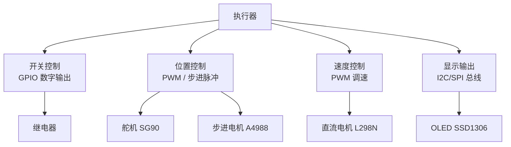
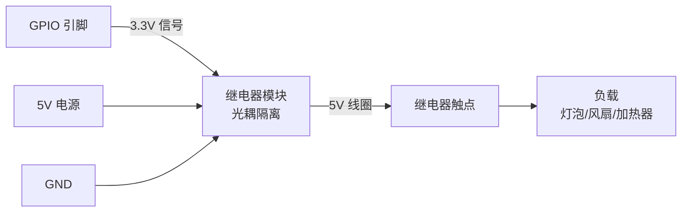
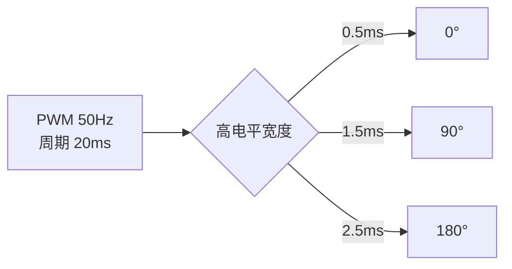
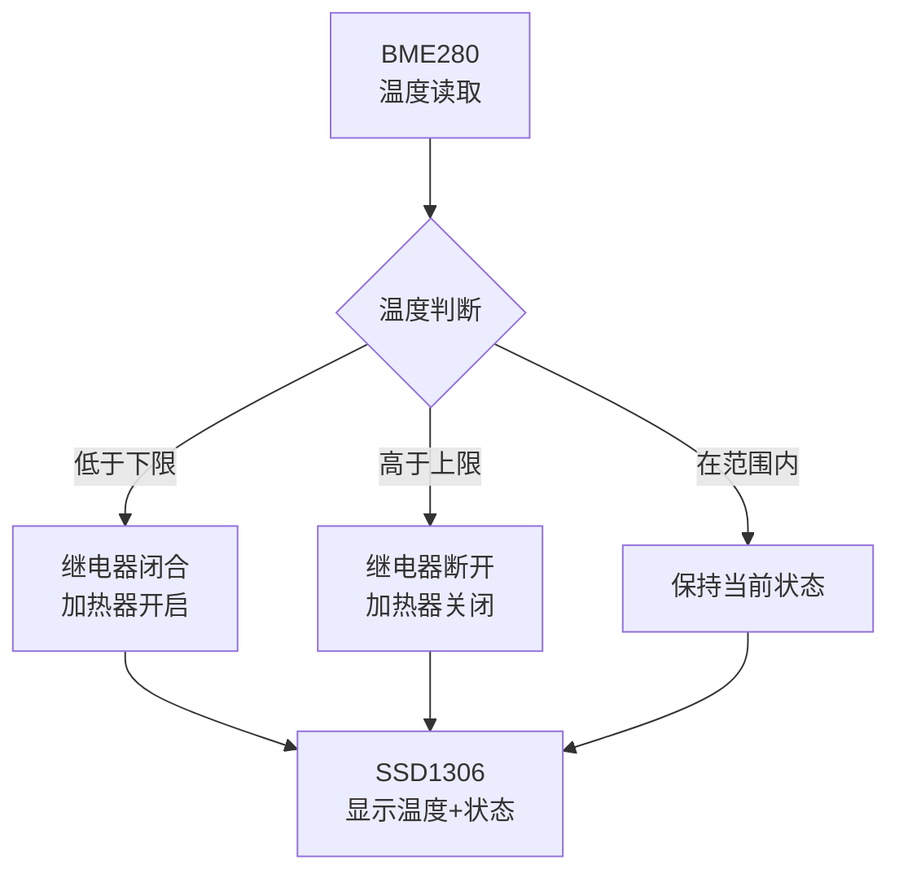

# 执行器与控制

传感器感知世界，执行器改变世界。本章介绍 .NET IoT 驱动继电器、步进电机、舵机、OLED 显示屏和直流电机的方法，并构建一个完整的恒温器示例。

## 执行器分类



---

## 继电器 — 数字开关控制

继电器用小电流信号控制大电流负载，是 IoT 控制家电、照明等 AC/DC 负载的标准方案。

### 接线与原理



::: warning 安全须知
- 继电器模块通常需要 5V 供电，但控制信号兼容 3.3V
- 控制 AC 市电（220V）时必须注意绝缘和安全距离
- 感性负载（电机、电磁阀）必须加装续流二极管或 RC 吸收电路
- **绝不在通电状态下触碰继电器的 AC 端子**
:::

### 代码

```csharp
using System;
using System.Device.Gpio;
using System.Threading;

const int RelayPin = 17; // GPIO17

using var controller = new GpioController();
controller.OpenPin(RelayPin, PinMode.Output);

Console.WriteLine("继电器控制示例 (输入 ON/OFF/EXIT)");

while (true)
{
    var input = Console.ReadLine()?.ToUpper();

    switch (input)
    {
        case "ON":
            controller.Write(RelayPin, PinValue.High);
            Console.WriteLine("继电器: 闭合 (负载通电)");
            break;
        case "OFF":
            controller.Write(RelayPin, PinValue.Low);
            Console.WriteLine("继电器: 断开 (负载断电)");
            break;
        case "EXIT":
            controller.Write(RelayPin, PinValue.Low); // 安全关闭
            return;
    }
}
```

::: tip 继电器模块逻辑
- 大多数继电器模块为**低电平触发**（Active Low）：GPIO 输出 Low 时继电器吸合
- 少数模块为高电平触发，务必确认模块规格
- 可通过模块上的跳线帽切换触发方式
:::

---

## 步进电机 A4988 — 精确旋转

A4988 是步进电机驱动器，通过 DIR（方向）、STEP（脉冲）、ENABLE（使能）三个引脚控制，支持 1~1/16 细分。

### 接线

| A4988 引脚 | 树莓派引脚 | 说明 |
|-----------|-----------|------|
| DIR | GPIO20 | 方向控制 |
| STEP | GPIO21 | 脉冲输入 |
| ENABLE | GPIO16 | 使能（低电平有效） |
| VMOT | 12V | 电机电源 |
| GND | GND | 共地 |

### 代码

```csharp
using System;
using System.Device.Gpio;
using System.Threading;

const int DirPin    = 20;
const int StepPin   = 21;
const int EnablePin = 16;

using var controller = new GpioController();
controller.OpenPin(DirPin, PinMode.Output);
controller.OpenPin(StepPin, PinMode.Output);
controller.OpenPin(EnablePin, PinMode.Output);

// 使能驱动器（低电平有效）
controller.Write(EnablePin, PinValue.Low);

void RotateSteps(int steps, bool clockwise, int pulseDelayUs = 800)
{
    controller.Write(DirPin, clockwise ? PinValue.High : PinValue.Low);
    Thread.Sleep(1); // 方向信号建立时间

    for (int i = 0; i < steps; i++)
    {
        controller.Write(StepPin, PinValue.High);
        Thread.Sleep(TimeSpan.FromMicroseconds(pulseDelayUs));
        controller.Write(StepPin, PinValue.Low);
        Thread.Sleep(TimeSpan.FromMicroseconds(pulseDelayUs));
    }
}

void RotateAngle(double angle, bool clockwise)
{
    // NEMA 17 步进电机: 200 步/圈 (1.8°/步)
    // 全步模式: steps = angle / 1.8
    // 1/16 细分: steps = angle / 1.8 * 16
    const int Microsteps = 1; // 全步，按 A4988 跳线设置
    int steps = (int)(angle / 1.8 * Microsteps);
    RotateSteps(steps, clockwise);
}

Console.WriteLine("步进电机控制");

// 正转 360°
Console.WriteLine("正转一圈...");
RotateAngle(360, clockwise: true);
Thread.Sleep(500);

// 反转 90°
Console.WriteLine("反转 90°...");
RotateAngle(90, clockwise: false);

// 失能驱动器（减少发热）
controller.Write(EnablePin, PinValue.High);
Console.WriteLine("完成，驱动器已失能");
```

::: important 微细分与精度
A4988 通过 MS1/MS2/MS3 引脚配置细分模式：
| MS1 | MS2 | MS3 | 细分 |
|-----|-----|-----|------|
| L | L | L | 全步 |
| H | L | L | 1/2 |
| L | H | L | 1/4 |
| H | H | L | 1/8 |
| H | H | H | 1/16 |

细分越精细，运动越平滑，但力矩略有下降。1/8 或 1/16 细分是大多数应用的最佳选择。
:::

---

## 舵机 SG90 — 角度控制

SG90 是 9g 微型舵机，通过 PWM 信号控制角度（0°~180°），常用于小型机械臂和云台。

### PWM 原理



### 代码

```csharp
using System;
using System.Device.Gpio;
using System.Device.Pwm;
using System.Threading;

const int ServoPin = 18; // GPIO18 (PWM0)

using var pwmChannel = PwmChannel.Create(0, 0, frequency: 50, dutyCycle: 0);
// 频率 50Hz → 周期 20ms

pwmChannel.Start();

void SetAngle(double angle)
{
    // SG90: 0.5ms (0°) ~ 2.5ms (180°) 在 20ms 周期内
    // 占空比: 0.5/20 = 2.5% ~ 2.5/20 = 12.5%
    double minPulse = 2.5;  // %
    double maxPulse = 12.5; // %
    double dutyCycle = minPulse + (maxPulse - minPulse) * angle / 180.0;
    dutyCycle /= 100.0; // 转为 0~1 比例

    pwmChannel.DutyCycle = dutyCycle;
}

Console.WriteLine("舵机 SG90 角度控制");

// 扫描 0° → 180° → 0°
for (double angle = 0; angle <= 180; angle += 10)
{
    SetAngle(angle);
    Console.WriteLine($"角度: {angle:F0}°");
    Thread.Sleep(200);
}

for (double angle = 180; angle >= 0; angle -= 10)
{
    SetAngle(angle);
    Console.WriteLine($"角度: {angle:F0}°");
    Thread.Sleep(200);
}

pwmChannel.Stop();
```

::: warning 舵机供电
SG90 工作电压 4.8-6V，**不要从树莓派 5V 引脚直接供电**（电流不足可能导致树莓派重启）。应使用独立 5V 电源，并共地。
:::

---

## OLED SSD1306 显示屏

SSD1306 是 0.96 寸 OLED 显示屏驱动芯片，128x64 像素，I2C 接口，非常适合显示传感器数据。

### 代码

```csharp
using System;
using System.Device.I2c;
using System.Drawing;
using System.Threading;
using Iot.Device.Ssd13xx;

const int I2cBusId = 1;
const int Ssd1306Address = 0x3C;

using var i2cDevice = I2cDevice.Create(new I2cConnectionSettings(I2cBusId, Ssd1306Address));
using var ssd1306 = new Ssd1306(i2cDevice, width: 128, height: 64);

// 初始化显示
ssd1306.ClearDisplay();
ssd1306.DisplayOn();

Console.WriteLine("SSD1306 OLED 显示示例");

// 绘制文本（使用内置字体）
void DrawText(int x, int y, string text, bool invert = false)
{
    // 使用 Iot.Device.Bindings 的字体渲染
    ssd1306.DrawHorizontalLine(0, 0, 128, invert);
    // 简化: 实际使用 Ssd1306 的 DrawBitmap 方法渲染字体
}

// 使用绘图 API
for (int i = 0; i < 5; i++)
{
    ssd1306.ClearDisplay();

    // 绘制标题栏
    ssd1306.DrawHorizontalLine(0, 12, 128, true);
    ssd1306.DrawHorizontalLine(0, 52, 128, true);

    // 绘制进度条
    int barWidth = (int)(i / 5.0 * 120);
    for (int y = 14; y < 50; y++)
    {
        for (int x = 4; x < 4 + barWidth; x++)
        {
            ssd1306.DrawPixel(x, y, true);
        }
    }

    ssd1306.Display();
    Thread.Sleep(500);
}

ssd1306.ClearDisplay();
ssd1306.Display();
```

::: tip 更好的字体渲染
`Iot.Device.Bindings` 的 Ssd1306 驱动内置位图字体有限。如需显示中文或复杂文本，建议：
1. 使用 `SixLabors.ImageSharp` 先渲染到 Bitmap
2. 再转为单色位图写入 OLED
3. 或使用 `Iot.Device.Ssd13xx.Ssd1306` 的 `DrawBitmap` 方法
:::

---

## 直流电机 L298N — PWM 调速 + 方向

L298N 是双 H 桥电机驱动模块，可驱动两路直流电机，通过 PWM 控制速度，GPIO 控制方向。

### 接线

| L298N 引脚 | 树莓派 | 说明 |
|-----------|--------|------|
| IN1 | GPIO5 | 电机 A 方向位 1 |
| IN2 | GPIO6 | 电机 A 方向位 2 |
| ENA | GPIO18 (PWM) | 电机 A 使能/PWM |
| 12V | 12V 电源 | 电机供电 |
| GND | GND | 共地 |

### 代码

```csharp
using System;
using System.Device.Gpio;
using System.Device.Pwm;
using System.Threading;

const int In1Pin = 5;
const int In2Pin = 6;

using var controller = new GpioController();
controller.OpenPin(In1Pin, PinMode.Output);
controller.OpenPin(In2Pin, PinMode.Output);

using var pwm = PwmChannel.Create(0, 0, frequency: 1000, dutyCycle: 0);
pwm.Start();

void SetMotorSpeed(double speed)
{
    // speed: -1.0 (全速反转) ~ 1.0 (全速正转), 0 = 停止
    if (speed > 0)
    {
        controller.Write(In1Pin, PinValue.High);
        controller.Write(In2Pin, PinValue.Low);
        pwm.DutyCycle = speed;
    }
    else if (speed < 0)
    {
        controller.Write(In1Pin, PinValue.Low);
        controller.Write(In2Pin, PinValue.High);
        pwm.DutyCycle = -speed;
    }
    else
    {
        controller.Write(In1Pin, PinValue.Low);
        controller.Write(In2Pin, PinValue.Low);
        pwm.DutyCycle = 0;
    }
}

Console.WriteLine("直流电机 L298N 控制");

// 正转加速
for (double s = 0; s <= 1.0; s += 0.1)
{
    SetMotorSpeed(s);
    Console.WriteLine($"正转速度: {s * 100:F0}%");
    Thread.Sleep(300);
}

// 减速停止
SetMotorSpeed(0);
Thread.Sleep(500);

// 反转 50%
SetMotorSpeed(-0.5);
Thread.Sleep(2000);

// 停止
SetMotorSpeed(0);
pwm.Stop();
Console.WriteLine("电机已停止");
```

::: warning L298N 发热问题
L298N 使用双极性晶体管，压降约 2V，效率较低（约 60%），大电流时发热明显。如需高效驱动，推荐使用 MOSFET 驱动器如 TB6612FNG 或 DRV8833。
:::

---

## 安全注意事项

| 风险 | 防护措施 |
|------|----------|
| 高压触电 | 继电器控制 AC 时使用绝缘外壳，断电操作 |
| 电机反电动势 | 感性负载并联续流二极管 |
| 电源反接 | 串联保护二极管或使用防反接模块 |
| ESD 损坏 | 操作前释放静电，使用防静电手环 |
| 过热 | 电机驱动器加装散热片，PWM 占空比不超过 90% |
| 短路 | 电源串联保险丝，电机线并联 0.1μF 电容 |

::: important 隔离原则
控制侧（树莓派 3.3V）和负载侧（12V/220V）必须电气隔离。继电器模块自带光耦隔离；电机驱动器通过逻辑电平隔离。切勿将负载电源接到树莓派。
:::

---

## 综合实战 — 恒温器

将 BME280 + 继电器 + SSD1306 组合，构建一个完整的恒温控制器：



```csharp
using System;
using System.Device.Gpio;
using System.Device.I2c;
using System.Threading;
using Iot.Device.Bmxx80;

// 配置
const double TargetTemp    = 25.0;  // 目标温度
const double Hysteresis    = 1.0;   // 滞回区间 ±1°C
const int RelayPin         = 17;
const int I2cBusId         = 1;
const int Bme280Address    = 0x76;

// 初始化 BME280
using var i2c = I2cDevice.Create(new I2cConnectionSettings(I2cBusId, Bme280Address));
using var bme280 = new Bme280(i2c);

// 初始化继电器
using var gpio = new GpioController();
gpio.OpenPin(RelayPin, PinMode.Output);
gpio.Write(RelayPin, PinValue.Low); // 初始关闭

bool heaterOn = false;

Console.WriteLine($"恒温器启动 - 目标温度: {TargetTemp}°C (滞回: ±{Hysteresis}°C)\n");

while (true)
{
    var result = bme280.Read();

    if (!result.Temperature.HasValue)
    {
        Console.WriteLine("传感器读取失败");
        Thread.Sleep(5000);
        continue;
    }

    double temp = result.Temperature.Value.DegreesCelsius;
    double humidity = result.Humidity?.Percent ?? 0;

    // 滞回控制逻辑（防止继电器频繁切换）
    if (!heaterOn && temp < TargetTemp - Hysteresis)
    {
        heaterOn = true;
        gpio.Write(RelayPin, PinValue.High);
        Console.WriteLine($"[{DateTime.Now:HH:mm:ss}] 温度 {temp:F1}°C < {TargetTemp - Hysteresis:F1}°C → 加热器开启");
    }
    else if (heaterOn && temp > TargetTemp + Hysteresis)
    {
        heaterOn = false;
        gpio.Write(RelayPin, PinValue.Low);
        Console.WriteLine($"[{DateTime.Now:HH:mm:ss}] 温度 {temp:F1}°C > {TargetTemp + Hysteresis:F1}°C → 加热器关闭");
    }

    // 显示状态
    string status = heaterOn ? "🔥 加热中" : "✓ 恒温";
    Console.WriteLine($"[{DateTime.Now:HH:mm:ss}] {temp:F1}°C / {humidity:F0}% | {status}");

    Thread.Sleep(2000);
}
```

::: tip 滞回控制（Hysteresis Control）
滞回控制是工业温控的标准方法。不使用单一阈值（会导致继电器在阈值附近反复开关），而是设置上下限：
- 温度降到 **下限以下** 才开启加热
- 温度升到 **上限以上** 才关闭加热
- 上下限之间的区间就是"滞回带"

滞回带宽度需要根据系统热惯性调整：太窄则继电器频繁动作，太宽则温度波动大。
:::

---

## 参考链接

- [A4988 步进电机驱动数据手册](https://www.pololu.com/file/0J450/A4988.pdf)
- [SG90 舵机规格](https://www.towerpro.com.tw/product/sg90-7/)
- [SSD1306 OLED 驱动数据手册](https://cdn-shop.adafruit.com/datasheets/SSD1306.pdf)
- [L298N 数据手册](https://www.st.com/en/motor-drivers/l298n.html)
- [Iot.Device.Bindings SSD1306 驱动](https://github.com/dotnet/iot/tree/main/src/devices/Ssd13xx)
- [System.Device.Pwm 文档](https://learn.microsoft.com/dotnet/api/system.device.pwm)
- [TB6612FNG 替代方案](https://www.pololu.com/category/11/brushed-dc-motor-drivers)

---

## 面试技巧

::: tip 面试高频问题
1. **继电器控制感性负载为什么要加续流二极管？**
   - 感性负载（继电器线圈、电机）断电瞬间，电流不能突变，产生反电动势（可达电源电压的数倍）。续流二极管提供泄放回路，保护驱动电路。

2. **步进电机细分的作用？如何选择？**
   - 细分将一步分为多个微步，使运动更平滑、减少共振和噪声。1/8 细分在精度和平滑性间取得平衡，是大多数应用的首选。精度要求极高时用 1/16，高速时用全步或 1/2。

3. **PWM 控制舵机的原理？频率和占空比的关系？**
   - 舵机需要 50Hz（20ms 周期）PWM，通过高电平脉宽 0.5~2.5ms 映射 0°~180° 角度。占空比 = 脉宽 / 周期。

4. **什么是滞回控制？为什么不用简单阈值？**
   - 单一阈值在噪声或慢变化信号下会导致执行器频繁开关（chattering）。滞回控制在开/关之间设置区间，避免频繁切换，延长执行器寿命。

5. **H 桥的工作原理？如何实现电机正反转？**
   - H 桥由 4 个开关管组成 H 形拓扑。对角开关管导通时电流一个方向流过电机；另一对角导通时电流反向，实现正反转。同一侧两个管子同时导通会造成短路（shoot-through），驱动芯片内部有死区时间保护。
:::
