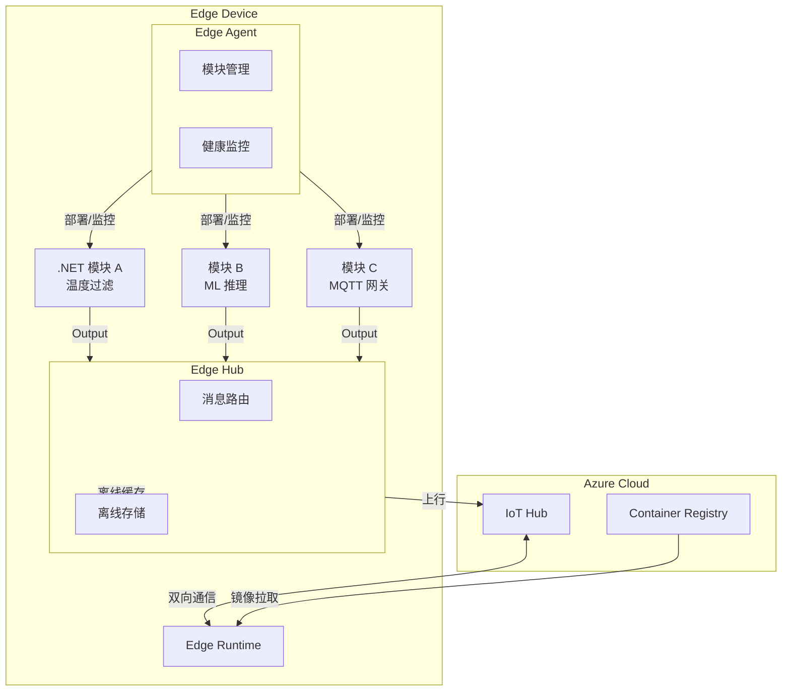
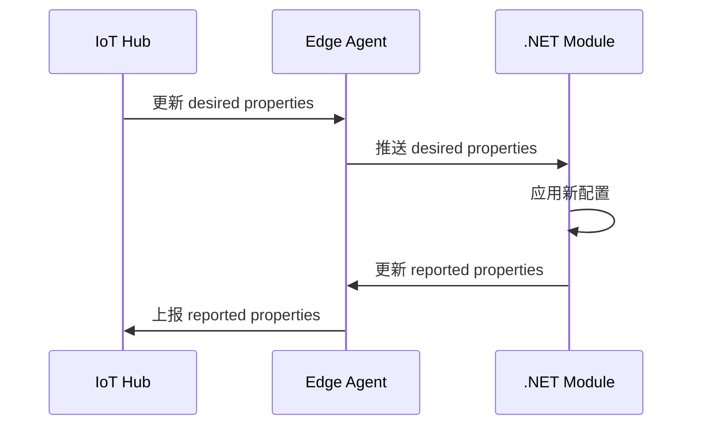
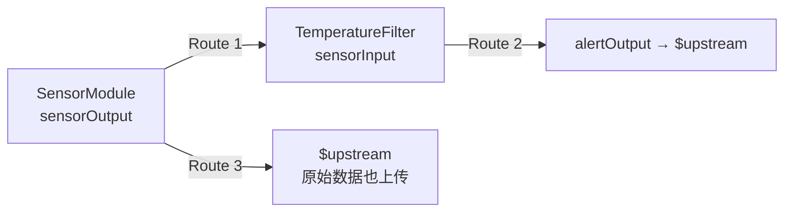
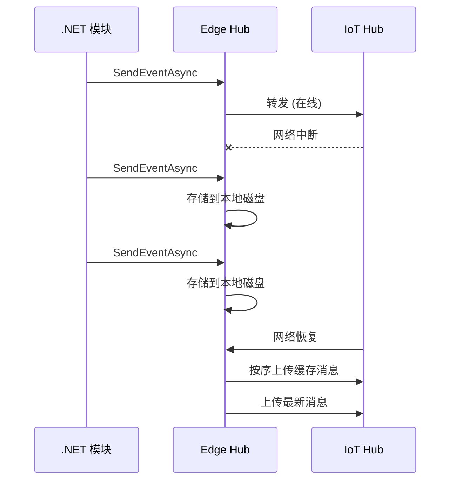

# Azure IoT Edge

Azure IoT Edge 将云智能下推到边缘设备，在本地执行数据过滤、聚合和 AI 推理，减少延迟和带宽消耗。本章介绍 IoT Edge 架构、.NET 模块开发、Module Twin 和离线支持。

## 架构概览



::: tip Edge Agent vs Edge Hub
- **Edge Agent**：模块生命周期管理（部署、启动、停止、重启），监控模块健康状态
- **Edge Hub**：模块间消息路由和上行到 IoT Hub，支持离线存储转发
两者本身也是容器化模块，由 IoT Hub 部署配置管理。
:::

---

## Edge Runtime 安装

在 Linux 设备上安装 IoT Edge Runtime：

```bash
# 1. 添加 Microsoft 软件源
curl https://packages.microsoft.com/config/ubuntu/22.04/packages-microsoft-prod.deb > ./packages-microsoft-prod.deb
sudo dpkg -i ./packages-microsoft-prod.deb
rm ./packages-microsoft-prod.deb

# 2. 安装 moby 引擎和 IoT Edge
sudo apt-get update
sudo apt-get install -y moby-engine moby-cli aziot-edge

# 3. 使用连接字符串配置设备
sudo iotedge config mp --connection-string '<DEVICE_CONNECTION_STRING>'

# 4. 应用配置
sudo iotedge config apply

# 5. 验证
sudo iotedge list
sudo iotedge check
```

::: important 系统要求
- Linux（Ubuntu 18.04+、Debian 10+、Raspbian Stretch+）
- 最低 1GB RAM、2GB 磁盘空间
- 容器引擎：Moby（推荐）或 Docker CE
- Windows 上可使用 IoT Edge for Linux on Windows (EFLOW)
:::

---

## 部署 .NET 模块

### 创建模块项目

```bash
# 使用 .NET 模板创建 IoT Edge 模块
dotnet new iotedge模块 -n TemperatureFilter -r linux/arm64
# 或使用 Visual Studio / VS Code 的 Azure IoT Edge 扩展
```

### Dockerfile（.NET 8）

```dockerfile
# 多阶段构建 - 适用于 ARM64 和 AMD64
FROM mcr.microsoft.com/dotnet/sdk:8.0 AS build
WORKDIR /src

COPY TemperatureFilter.csproj .
RUN dotnet restore -r linux-arm64

COPY . .
RUN dotnet publish -c Release -o /app -r linux-arm64 --self-contained false

FROM mcr.microsoft.com/dotnet/runtime:8.0-bookworm-slim-arm64v8
WORKDIR /app
COPY --from=build /app .

# 非 root 用户运行
RUN useradd -ms /bin/bash moduleuser
USER moduleuser

ENTRYPOINT ["dotnet", "TemperatureFilter.dll"]
```

::: tip 多架构构建
使用 `docker buildx` 同时构建 ARM64 和 AMD64 镜像：
```bash
docker buildx create --use
docker buildx build --platform linux/arm64,linux/amd64 \
  -t myacr.azurecr.io/temp-filter:1.0 . --push
```
:::

### module.json

```json
{
  "$schema-version": "1.0.0",
  "name": "TemperatureFilter",
  "version": "1.0.0",
  "image": {
    "repository": "myacr.azurecr.io/temp-filter",
    "tag": {
      "version": "1.0.0",
      "platforms": {
        "arm64": "./Dockerfile.arm64",
        "amd64": "./Dockerfile.amd64"
      }
    },
    "buildOptions": []
  }
}
```

### 部署清单（deployment manifest）

```json
{
  "modulesContent": {
    "$edgeAgent": {
      "properties.desired": {
        "schemaVersion": "1.1",
        "runtime": {
          "type": "docker",
          "settings": {
            "minDockerVersion": "v1.25",
            "loggingOptions": "",
            "registryCredentials": {
              "myacr": {
                "username": "$ACR_USERNAME",
                "password": "$ACR_PASSWORD",
                "address": "myacr.azurecr.io"
              }
            }
          }
        },
        "systemModules": {
          "edgeAgent": {
            "type": "docker",
            "env": {},
            "settings": {
              "image": "mcr.microsoft.com/azureiotedge-agent:1.4",
              "createOptions": ""
            }
          },
          "edgeHub": {
            "type": "docker",
            "settings": {
              "image": "mcr.microsoft.com/azureiotedge-hub:1.4",
              "createOptions": "{\"HostConfig\":{\"PortBindings\":{\"8883/tcp\":[{\"HostPort\":\"8883\"}],\"443/tcp\":[{\"HostPort\":\"443\"}],\"5671/tcp\":[{\"HostPort\":\"5671\"}]}}}"
            },
            "status": "running",
            "restartPolicy": "always"
          }
        },
        "modules": {
          "TemperatureFilter": {
            "version": "1.0",
            "type": "docker",
            "status": "running",
            "restartPolicy": "always",
            "settings": {
              "image": "myacr.azurecr.io/temp-filter:1.0.0",
              "createOptions": ""
            }
          }
        }
      }
    },
    "$edgeHub": {
      "properties.desired": {
        "schemaVersion": "1.2",
        "routes": {
          "TempFilterToIoTHub": {
            "route": "FROM /messages/modules/TemperatureFilter/outputs/alertOutput INTO $upstream",
            "priority": 0,
            "timeToLiveSecs": 7200
          },
          "SensorToTempFilter": {
            "route": "FROM /messages/modules/SensorModule/outputs/sensorOutput INTO BrokeredEndpoint(\"/modules/TemperatureFilter/inputs/sensorInput\")"
          }
        },
        "storeAndForwardConfiguration": {
          "timeToLiveSecs": 7200
        }
      }
    }
  }
}
```

---

## Module Twin — 模块配置同步

Module Twin 类似 Device Twin，为边缘模块提供期望属性（desired）和报告属性（reported）的同步机制。



### .NET Module Twin 代码

```csharp
using Microsoft.Azure.Devices.Client;
using Microsoft.Azure.Devices.Client.Transport.Mqtt;
using System.Text;
using System.Text.Json;

class TemperatureFilterModule
{
    static ModuleClient? _moduleClient;
    static double _threshold = 30.0; // 默认阈值

    static async Task Main(string[] args)
    {
        // 使用 MQTT 传输（Edge Hub 默认协议）
        var mqttSetting = new MqttTransportSettings(TransportType.Mqtt_Tcp_Only);
        var transportSettings = new ITransportSettings[] { mqttSetting };

        _moduleClient = await ModuleClient.CreateFromEnvironmentAsync(transportSettings);
        await _moduleClient.OpenAsync();

        Console.WriteLine("IoT Edge 模块已启动");

        // 注册 Twin 回调：监听 desired properties 变化
        await _moduleClient.SetDesiredPropertyUpdateCallbackAsync(
            OnDesiredPropertyChanged, null);

        // 读取初始 Twin
        var twin = await _moduleClient.GetTwinAsync();
        if (twin.Properties.Desired.Contains("TemperatureThreshold"))
        {
            _threshold = twin.Properties.Desired["TemperatureThreshold"];
            Console.WriteLine($"从 Twin 读取阈值: {_threshold}°C");
        }

        // 注册消息输入处理器
        await _moduleClient.SetInputMessageHandlerAsync(
            "sensorInput", OnMessageReceived, null);

        // 报告初始状态
        await ReportProperties("Initialized", _threshold);

        // 保持运行
        var tcs = new TaskCompletionSource();
        Console.CancelKeyPress += (_, e) => { e.Cancel = true; tcs.SetResult(); };
        await tcs.Task;

        _moduleClient.Dispose();
    }

    static Task OnDesiredPropertyChanged(TwinCollection desiredProperties, object? userContext)
    {
        if (desiredProperties.Contains("TemperatureThreshold"))
        {
            _threshold = desiredProperties["TemperatureThreshold"];
            Console.WriteLine($"阈值更新为: {_threshold}°C");
        }

        return ReportProperties("ThresholdUpdated", _threshold);
    }

    static async Task OnMessageReceived(Message message, object? userContext)
    {
        var payload = Encoding.UTF8.GetString(message.GetBytes());
        var data = JsonSerializer.Deserialize<SensorData>(payload);

        if (data == null) return;

        Console.WriteLine($"收到: 温度={data.Temperature:F1}°C, 设备={data.DeviceId}");

        if (data.Temperature > _threshold)
        {
            var alert = new
            {
                data.DeviceId,
                data.Temperature,
                Threshold = _threshold,
                AlertTime = DateTime.UtcNow,
                Message = $"温度 {_threshold}°C 超限"
            };

            var alertJson = JsonSerializer.Serialize(alert);
            var alertMessage = new Message(Encoding.UTF8.GetBytes(alertJson));
            alertMessage.Properties.Add("contentType", "application/json");
            alertMessage.Properties.Add("alertType", "temperature");

            await _moduleClient!.SendEventAsync("alertOutput", alertMessage);
            Console.WriteLine($"⚠ 已发送告警: 温度 {data.Temperature:F1}°C > {_threshold}°C");
        }
    }

    static async Task ReportProperties(string status, double threshold)
    {
        var reported = new TwinCollection
        {
            ["Status"] = status,
            ["CurrentThreshold"] = threshold,
            ["LastUpdated"] = DateTime.UtcNow.ToString("O")
        };
        await _moduleClient!.UpdateReportedPropertiesAsync(reported);
    }
}

record SensorData(string DeviceId, double Temperature, double Humidity);
```

---

## Edge Hub 消息路由

消息路由定义模块间和模块到云的数据流向：



路由语法（类 SQL）：

```
FROM <source> INTO <destination>
```

- `FROM /messages/modules/{moduleId}/outputs/{output}` — 模块输出
- `INTO $upstream` — 发送到 IoT Hub
- `INTO BrokeredEndpoint("/modules/{moduleId}/inputs/{input}")` — 发送到模块输入

::: important 路由优先级
当多条路由匹配同一消息时，按 `priority` 字段排序执行。`timeToLiveSecs` 控制离线缓存时间，Edge Hub 重新连接后自动重发。
:::

---

## 离线支持 — 存储转发

Edge Hub 内置离线能力，网络中断时自动缓存消息，恢复后按序上传：



离线配置关键参数：

```json
{
  "storeAndForwardConfiguration": {
    "timeToLiveSecs": 7200  // 消息最长缓存 2 小时
  }
}
```

::: warning 离线限制
- 缓存存储在 Edge 设备磁盘，空间有限
- `timeToLiveSecs` 过期消息会被丢弃
- Twin 变更在离线期间排队，恢复后同步
- Direct Method 在离线期间不可用
:::

---

## 调试边缘模块

### 本地调试

```bash
# 在开发机上直接运行模块（跳过 Edge Runtime）
dotnet run -- \
  --EdgeHubConnectionString="<connection_string>" \
  --EdgeModuleId="TemperatureFilter"
```

### 查看日志

```bash
# 查看模块日志
sudo iotedge logs TemperatureFilter --follow

# 查看 Edge Agent 日志（部署问题）
sudo iotedge logs edgeAgent --follow

# 查看 Edge Hub 日志（消息路由问题）
sudo iotedge logs edgeHub --follow

# 查看模块状态
sudo iotedge list
sudo iotedge check
```

### 远程调试 (VS Code)

1. 在 Dockerfile 中安装 VSDBG 调试器
2. 使用 `docker cp` 将调试器注入运行中容器
3. VS Code 附加到容器进程

---

## 参考链接

- [Azure IoT Edge 官方文档](https://learn.microsoft.com/azure/iot-edge/)
- [IoT Edge 模块开发指南](https://learn.microsoft.com/azure/iot-edge/module-development)
- [Azure IoT Edge .NET 示例](https://github.com/Azure-Samples/azure-iotedge-dotnet)
- [部署清单参考](https://learn.microsoft.com/azure/iot-edge/module-composition)
- [Edge Hub 离线能力](https://learn.microsoft.com/azure/iot-edge/offline-capabilities)
- [Microsoft.Azure.Devices.Client SDK](https://learn.microsoft.com/dotnet/api/microsoft.azure.devices.client)

---

## 面试技巧

::: tip 面试高频问题
1. **IoT Edge 解决了什么问题？**
   - 降低延迟（本地处理）、节省带宽（过滤后上传）、离线运行（断网不中断）、数据隐私（敏感数据不出设备）。面试时举具体场景更有说服力，如工厂质检、实时视频分析。

2. **Edge Agent 和 Edge Hub 的区别？**
   - Agent 是"管理者"：部署模块、监控健康、报告状态；Hub 是"邮局"：消息路由、协议转换、离线缓存。两者协作完成边缘运行时功能。

3. **Module Twin 和 Device Twin 的区别？**
   - Device Twin 针对整台设备，Module Twin 针对设备上的单个模块。每个模块有独立的 Twin，可独立配置和监控。模块间通过 Edge Hub 路由通信，而非直接 Twin 同步。

4. **离线存储转发的原理？**
   - Edge Hub 在本地磁盘缓存上行消息（TTL 可配），网络恢复后按时间序上传。需要配置 `storeAndForwardConfiguration.timeToLiveSecs`。面试时强调"不丢消息"和"磁盘空间有限"的权衡。

5. **如何在边缘设备上调试 .NET 模块？**
   - 方式一：设置环境变量直接在开发机运行（跳过容器化）；方式二：使用 `iotedge logs` 查看日志；方式三：VS Code 远程附加调试器到容器中。
:::
