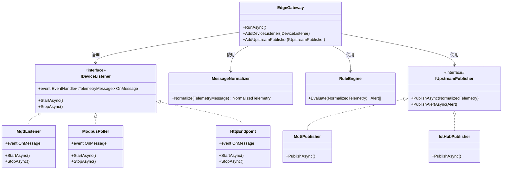

# 自定义边缘网关

当 Azure IoT Edge 等托管方案不适用时（如私有化部署、特殊协议、成本约束），可以用 .NET 构建自定义边缘网关。本章介绍基于 Worker Service 的网关架构设计、协议适配、消息归一化和规则引擎。

## 网关架构



---

## Worker Service 骨架

.NET Worker Service 是长运行服务的理想宿主：

```bash
dotnet new worker -n EdgeGateway
cd EdgeGateway
dotnet add package MQTTnet
dotnet add package Microsoft.Extensions.Hosting
dotnet add package System.Text.Json
```

### 核心模型定义

```csharp
// Models/TelemetryMessage.cs
namespace EdgeGateway.Models;

/// <summary>
/// 设备原始遥测消息
/// </summary>
public record RawTelemetry(
    string DeviceId,
    string Protocol,
    DateTime Timestamp,
    Dictionary<string, object> Payload
);

/// <summary>
/// 归一化后的标准遥测
/// </summary>
public record NormalizedTelemetry(
    string DeviceId,
    string DeviceType,
    DateTime Timestamp,
    Dictionary<string, double> Metrics,
    Dictionary<string, string> Metadata
);

/// <summary>
/// 告警
/// </summary>
public record Alert(
    string DeviceId,
    string RuleId,
    string Severity,
    string Message,
    DateTime Timestamp,
    Dictionary<string, double> TriggerValues
);
```

### 网关主服务

```csharp
// Services/EdgeGatewayService.cs
using EdgeGateway.Models;
using EdgeGateway.Listeners;
using EdgeGateway.Publishers;
using Microsoft.Extensions.Options;

namespace EdgeGateway.Services;

public class EdgeGatewayService : BackgroundService
{
    private readonly List<IDeviceListener> _listeners;
    private readonly MessageNormalizer _normalizer;
    private readonly RuleEngine _ruleEngine;
    private readonly List<IUpstreamPublisher> _publishers;
    private readonly ILogger<EdgeGatewayService> _logger;

    public EdgeGatewayService(
        IEnumerable<IDeviceListener> listeners,
        MessageNormalizer normalizer,
        RuleEngine ruleEngine,
        IEnumerable<IUpstreamPublisher> publishers,
        ILogger<EdgeGatewayService> logger)
    {
        _listeners = listeners.ToList();
        _normalizer = normalizer;
        _ruleEngine = ruleEngine;
        _publishers = publishers.ToList();
        _logger = logger;
    }

    protected override async Task ExecuteAsync(CancellationToken stoppingToken)
    {
        _logger.LogInformation("边缘网关启动");

        // 注册消息处理
        foreach (var listener in _listeners)
        {
            listener.OnMessage += HandleRawMessage;
            await listener.StartAsync(stoppingToken);
        }

        _logger.LogInformation("已启动 {Count} 个设备监听器", _listeners.Count);

        // 等待停止信号
        await Task.Delay(Timeout.Infinite, stoppingToken);
    }

    private async void HandleRawMessage(object? sender, RawTelemetry raw)
    {
        try
        {
            // 1. 归一化
            var normalized = _normalizer.Normalize(raw);
            _logger.LogDebug("归一化: 设备={DeviceId}, 指标数={Count}",
                normalized.DeviceId, normalized.Metrics.Count);

            // 2. 规则评估
            var alerts = _ruleEngine.Evaluate(normalized);
            foreach (var alert in alerts)
            {
                _logger.LogWarning("告警: {Message} (设备={DeviceId}, 严重度={Severity})",
                    alert.Message, alert.DeviceId, alert.Severity);

                foreach (var publisher in _publishers)
                {
                    await publisher.PublishAlertAsync(alert);
                }
            }

            // 3. 上游发布
            foreach (var publisher in _publishers)
            {
                await publisher.PublishAsync(normalized);
            }
        }
        catch (Exception ex)
        {
            _logger.LogError(ex, "处理消息失败: 设备={DeviceId}", raw.DeviceId);
        }
    }

    public override async Task StopAsync(CancellationToken cancellationToken)
    {
        _logger.LogInformation("边缘网关停止");

        foreach (var listener in _listeners)
        {
            await listener.StopAsync(cancellationToken);
            listener.OnMessage -= HandleRawMessage;
        }

        await base.StopAsync(cancellationToken);
    }
}
```

---

## 协议适配器

### MQTT 监听器

```csharp
// Listeners/MqttListener.cs
using EdgeGateway.Models;
using MQTTnet;
using MQTTnet.Client;

namespace EdgeGateway.Listeners;

public class MqttListener : IDeviceListener
{
    private readonly IMqttClient _client;
    private readonly MqttClientOptions _options;
    private readonly string[] _topics;
    private readonly ILogger<MqttListener> _logger;

    public event EventHandler<RawTelemetry>? OnMessage;

    public MqttListener(IOptions<GatewayConfig> config, ILogger<MqttListener> logger)
    {
        _logger = logger;
        var mqttConfig = config.Value.Mqtt;

        var factory = new MqttFactory();
        _client = factory.CreateMqttClient();
        _options = new MqttClientOptionsBuilder()
            .WithTcpServer(mqttConfig.Host, mqttConfig.Port)
            .WithClientId(mqttConfig.ClientId)
            .WithCleanSession(false)
            .Build();

        _topics = mqttConfig.SubscribeTopics;
    }

    public async Task StartAsync(CancellationToken ct)
    {
        _client.ApplicationMessageReceivedAsync += e =>
        {
            var payload = System.Text.Encoding.UTF8.GetString(e.ApplicationMessage.PayloadSegment);
            var topic = e.ApplicationMessage.Topic;

            // 从 topic 提取设备 ID (格式: devices/{deviceId}/telemetry)
            var parts = topic.Split('/');
            string deviceId = parts.Length >= 2 ? parts[1] : "unknown";

            var raw = new RawTelemetry(
                DeviceId: deviceId,
                Protocol: "MQTT",
                Timestamp: DateTime.UtcNow,
                Payload: System.Text.Json.JsonSerializer
                    .Deserialize<Dictionary<string, object>>(payload) ?? new()
            );

            OnMessage?.Invoke(this, raw);
            return Task.CompletedTask;
        };

        await _client.ConnectAsync(_options, ct);

        foreach (var topic in _topics)
        {
            await _client.SubscribeAsync(new MqttTopicFilterBuilder()
                .WithTopic(topic)
                .WithQualityOfServiceLevel(MQTTnet.Protocol.MqttQualityOfServiceLevel.AtLeastOnce)
                .Build());
            _logger.LogInformation("已订阅: {Topic}", topic);
        }
    }

    public async Task StopAsync(CancellationToken ct)
    {
        if (_client.IsConnected)
            await _client.DisconnectAsync(cancellationToken: ct);
    }
}
```

### Modbus 轮询器

```csharp
// Listeners/ModbusPoller.cs
using EdgeGateway.Models;
using System.Net.Sockets;

namespace EdgeGateway.Listeners;

public class ModbusPoller : IDeviceListener
{
    private readonly List<ModbusDeviceConfig> _devices;
    private readonly ILogger<ModbusPoller> _logger;
    private CancellationTokenSource? _cts;

    public event EventHandler<RawTelemetry>? OnMessage;

    public ModbusPoller(IOptions<GatewayConfig> config, ILogger<ModbusPoller> logger)
    {
        _devices = config.Value.Modbus.Devices;
        _logger = logger;
    }

    public Task StartAsync(CancellationToken ct)
    {
        _cts = CancellationTokenSource.CreateLinkedTokenSource(ct);

        foreach (var device in _devices)
        {
            _ = PollDeviceAsync(device, _cts.Token);
        }

        return Task.CompletedTask;
    }

    private async Task PollDeviceAsync(ModbusDeviceConfig device, CancellationToken ct)
    {
        using var tcp = new TcpClient();
        await tcp.ConnectAsync(device.Host, device.Port, ct);
        _logger.LogInformation("Modbus 连接: {Host}:{Port} (Slave={SlaveId})",
            device.Host, device.Port, device.SlaveId);

        while (!ct.IsCancellationRequested)
        {
            try
            {
                var payload = new Dictionary<string, object>();

                foreach (var reg in device.Registers)
                {
                    // 简化: 实际使用 NModbus 库
                    ushort value = await ReadHoldingRegister(tcp, device.SlaveId, reg.Address);
                    payload[reg.Name] = reg.Scale > 0 ? value * reg.Scale : value;
                }

                var raw = new RawTelemetry(
                    DeviceId: device.DeviceId,
                    Protocol: "Modbus",
                    Timestamp: DateTime.UtcNow,
                    Payload: payload
                );

                OnMessage?.Invoke(this, raw);
            }
            catch (Exception ex)
            {
                _logger.LogError(ex, "Modbus 轮询失败: {DeviceId}", device.DeviceId);
            }

            await Task.Delay(device.PollIntervalMs, ct);
        }
    }

    private async Task<ushort> ReadHoldingRegister(TcpClient tcp, byte slaveId, ushort address)
    {
        // 简化实现: 构造 Modbus TCP 请求帧
        var stream = tcp.GetStream();
        byte[] request = BuildReadRequest(slaveId, address, 1);
        await stream.WriteAsync(request);

        byte[] response = new byte[9];
        await stream.ReadAsync(response, 0, response.Length);

        return (ushort)((response[8] << 8) | response[9]);
    }

    private static byte[] BuildReadRequest(byte slaveId, ushort address, ushort count)
    {
        return new byte[] {
            0x00, 0x01,       // Transaction ID
            0x00, 0x00,       // Protocol ID
            0x00, 0x06,       // Length
            slaveId,           // Unit ID
            0x03,              // Function: Read Holding Registers
            (byte)(address >> 8), (byte)(address & 0xFF),
            (byte)(count >> 8), (byte)(count & 0xFF)
        };
    }

    public Task StopAsync(CancellationToken ct)
    {
        _cts?.Cancel();
        return Task.CompletedTask;
    }
}
```

### HTTP 端点

```csharp
// Listeners/HttpEndpoint.cs
using EdgeGateway.Models;
using Microsoft.AspNetCore.Builder;
using Microsoft.AspNetCore.Hosting;
using Microsoft.Extensions.Hosting;

namespace EdgeGateway.Listeners;

public class HttpEndpoint : IDeviceListener
{
    private WebApplication? _app;
    private readonly ILogger<HttpEndpoint> _logger;

    public event EventHandler<RawTelemetry>? OnMessage;

    public HttpEndpoint(ILogger<HttpEndpoint> logger)
    {
        _logger = logger;
    }

    public async Task StartAsync(CancellationToken ct)
    {
        var builder = WebApplication.CreateBuilder();
        builder.WebHost.UseUrls("http://0.0.0.0:8080");

        _app = builder.Build();

        _app.MapPost("/api/telemetry/{deviceId}", (string deviceId, Dictionary<string, object> payload) =>
        {
            var raw = new RawTelemetry(
                DeviceId: deviceId,
                Protocol: "HTTP",
                Timestamp: DateTime.UtcNow,
                Payload: payload
            );

            OnMessage?.Invoke(this, raw);
            return Results.Ok();
        });

        _app.MapGet("/health", () => Results.Ok(new { status = "healthy", time = DateTime.UtcNow }));

        await _app.StartAsync(ct);
        _logger.LogInformation("HTTP 端点已启动: http://0.0.0.0:8080");
    }

    public async Task StopAsync(CancellationToken ct)
    {
        if (_app != null)
            await _app.StopAsync(ct);
    }
}
```

---

## 消息归一化

将不同协议的原始数据转为统一模型：

```csharp
// Services/MessageNormalizer.cs
using EdgeGateway.Models;

namespace EdgeGateway.Services;

public class MessageNormalizer
{
    private readonly Dictionary<string, DeviceMappingConfig> _deviceMappings;

    public MessageNormalizer(IOptions<GatewayConfig> config)
    {
        // 从配置加载设备映射规则
        _deviceMappings = config.Value.DeviceMappings
            .ToDictionary(m => m.DeviceId);
    }

    public NormalizedTelemetry Normalize(RawTelemetry raw)
    {
        var metrics = new Dictionary<string, double>();
        var metadata = new Dictionary<string, string>
        {
            ["protocol"] = raw.Protocol,
            ["source"] = raw.DeviceId
        };

        // 尝试获取设备映射
        if (_deviceMappings.TryGetValue(raw.DeviceId, out var mapping))
        {
            metadata["deviceType"] = mapping.DeviceType;
            metadata["location"] = mapping.Location ?? "unknown";

            // 按映射规则提取指标
            foreach (var fieldMap in mapping.FieldMappings)
            {
                if (raw.Payload.TryGetValue(fieldMap.SourceField, out var value))
                {
                    double numericValue = Convert.ToDouble(value) * fieldMap.Scale + fieldMap.Offset;
                    metrics[fieldMap.TargetField] = Math.Round(numericValue, fieldMap.Precision);
                }
            }
        }
        else
        {
            // 无映射: 尝试自动转换所有数值字段
            foreach (var kvp in raw.Payload)
            {
                if (double.TryParse(kvp.Value?.ToString(), out var numValue))
                {
                    metrics[kvp.Key] = numValue;
                }
            }
            metadata["deviceType"] = "unknown";
        }

        return new NormalizedTelemetry(
            DeviceId: raw.DeviceId,
            DeviceType: metadata.GetValueOrDefault("deviceType", "unknown"),
            Timestamp: raw.Timestamp,
            Metrics: metrics,
            Metadata: metadata
        );
    }
}
```

---

## 规则引擎

基于阈值的简单规则引擎，支持条件告警和转发控制：

```csharp
// Services/RuleEngine.cs
using EdgeGateway.Models;

namespace EdgeGateway.Services;

public class RuleEngine
{
    private readonly List<RuleConfig> _rules;

    public RuleEngine(IOptions<GatewayConfig> config)
    {
        _rules = config.Value.Rules;
    }

    public List<Alert> Evaluate(NormalizedTelemetry telemetry)
    {
        var alerts = new List<Alert>();

        foreach (var rule in _rules.Where(r => r.Enabled))
        {
            // 检查设备匹配
            if (rule.DeviceId != "*" && rule.DeviceId != telemetry.DeviceId)
                continue;
            if (rule.DeviceType != "*" && rule.DeviceType != telemetry.DeviceType)
                continue;

            // 检查指标是否存在
            if (!telemetry.Metrics.TryGetValue(rule.Metric, out var value))
                continue;

            // 评估条件
            bool triggered = rule.Operator switch
            {
                "gt" => value > rule.Threshold,
                "gte" => value >= rule.Threshold,
                "lt" => value < rule.Threshold,
                "lte" => value <= rule.Threshold,
                "eq" => Math.Abs(value - rule.Threshold) < 0.001,
                _ => false
            };

            if (triggered)
            {
                alerts.Add(new Alert(
                    DeviceId: telemetry.DeviceId,
                    RuleId: rule.Id,
                    Severity: rule.Severity,
                    Message: rule.MessageTemplate
                        .Replace("{metric}", rule.Metric)
                        .Replace("{value}", value.ToString("F1"))
                        .Replace("{threshold}", rule.Threshold.ToString("F1")),
                    Timestamp: DateTime.UtcNow,
                    TriggerValues: new Dictionary<string, double>
                    {
                        [rule.Metric] = value,
                        ["threshold"] = rule.Threshold
                    }
                ));
            }
        }

        return alerts;
    }
}
```

---

## 配置文件

```json
// appsettings.json
{
  "GatewayConfig": {
    "Mqtt": {
      "Host": "192.168.1.100",
      "Port": 1883,
      "ClientId": "edge-gateway-01",
      "SubscribeTopics": [ "devices/+/telemetry", "sensors/+/data" ]
    },
    "Modbus": {
      "Devices": [
        {
          "DeviceId": "plc-workshop-01",
          "Host": "192.168.1.200",
          "Port": 502,
          "SlaveId": 1,
          "PollIntervalMs": 5000,
          "Registers": [
            { "Name": "temperature", "Address": 100, "Scale": 0.1 },
            { "Name": "pressure", "Address": 101, "Scale": 0.01 },
            { "Name": "motorSpeed", "Address": 102, "Scale": 1.0 }
          ]
        }
      ]
    },
    "DeviceMappings": [
      {
        "DeviceId": "bme280-01",
        "DeviceType": "environment",
        "Location": "workshop-a",
        "FieldMappings": [
          { "SourceField": "temp", "TargetField": "temperature", "Scale": 1.0, "Offset": 0.0, "Precision": 1 },
          { "SourceField": "hum", "TargetField": "humidity", "Scale": 1.0, "Offset": 0.0, "Precision": 0 },
          { "SourceField": "pres", "TargetField": "pressure", "Scale": 1.0, "Offset": 0.0, "Precision": 1 }
        ]
      }
    ],
    "Rules": [
      {
        "Id": "temp-high",
        "Enabled": true,
        "DeviceType": "environment",
        "DeviceId": "*",
        "Metric": "temperature",
        "Operator": "gt",
        "Threshold": 35.0,
        "Severity": "warning",
        "MessageTemplate": "温度 {value}°C 超过阈值 {threshold}°C"
      },
      {
        "Id": "humidity-low",
        "Enabled": true,
        "DeviceType": "environment",
        "DeviceId": "*",
        "Metric": "humidity",
        "Operator": "lt",
        "Threshold": 20.0,
        "Severity": "info",
        "MessageTemplate": "湿度 {value}% 低于阈值 {threshold}%"
      }
    ],
    "Upstream": {
      "Type": "Mqtt",
      "Host": "cloud-broker.example.com",
      "Port": 8883,
      "Topic": "gateway/{gatewayId}/telemetry",
      "AlertTopic": "gateway/{gatewayId}/alerts"
    }
  }
}
```

---

## DI 注册与健康检查

```csharp
// Program.cs
using EdgeGateway.Listeners;
using EdgeGateway.Publishers;
using EdgeGateway.Services;

var builder = Host.CreateDefaultBuilder(args);

builder.ConfigureServices((context, services) =>
{
    services.Configure<GatewayConfig>(
        context.Configuration.GetSection("GatewayConfig"));

    // 监听器
    services.AddSingleton<IDeviceListener, MqttListener>();
    services.AddSingleton<IDeviceListener, ModbusPoller>();
    services.AddSingleton<IDeviceListener, HttpEndpoint>();

    // 核心服务
    services.AddSingleton<MessageNormalizer>();
    services.AddSingleton<RuleEngine>();

    // 发布器
    services.AddSingleton<IUpstreamPublisher, MqttPublisher>();

    // 网关主服务
    services.AddHostedService<EdgeGatewayService>();

    // 健康检查
    services.AddHealthChecks()
        .AddCheck("gateway", () => Microsoft.Extensions.Diagnostics.HealthChecks.HealthCheckResult.Healthy());
});

var host = builder.Build();
await host.RunAsync();
```

---

## 日志与健康

```csharp
// 在 EdgeGatewayService 中添加
private void LogHealthStatus()
{
    var status = new
    {
        Listeners = _listeners.Select(l => l.GetType().Name).ToList(),
        Publishers = _publishers.Select(p => p.GetType().Name).ToList(),
        Uptime = DateTime.UtcNow - _startTime
    };

    _logger.LogInformation("网关状态: {Status}",
        System.Text.Json.JsonSerializer.Serialize(status));
}

// 定期健康上报（在 ExecuteAsync 中添加）
using var timer = new PeriodicTimer(TimeSpan.FromMinutes(1));
while (await timer.WaitForNextTickAsync(stoppingToken))
{
    LogHealthStatus();
}
```

---

## 参考链接

- [.NET Worker Service 文档](https://learn.microsoft.com/dotnet/core/extensions/workers)
- [MQTTnet GitHub](https://github.com/dotnet/MQTTnet)
- [NModbus 库](https://github.com/NModbus/NModbus)
- [ASP.NET Core 最小 API](https://learn.microsoft.com/aspnet/core/fundamentals/minimal-apis)
- [.NET 依赖注入](https://learn.microsoft.com/dotnet/core/extensions/dependency-injection)
- [健康检查文档](https://learn.microsoft.com/aspnet/core/host-and-deploy/health-checks)

---

## 面试技巧

::: tip 面试高频问题
1. **为什么需要自定义网关而不是直接连云？**
   - 协议转换（Modbus/BACnet → MQTT/HTTP）、数据预处理（减少带宽）、离线缓冲、本地规则引擎（低延迟告警）。面试中强调"边缘智能"的概念。

2. **Worker Service 和普通控制台应用的区别？**
   - Worker Service 内置 DI、配置、日志、优雅关闭（IHostedService）、Windows Service/Linux systemd 集成。控制台应用需要手动实现这些基础设施。

3. **如何保证消息不丢失？**
   - 上游发布失败时本地缓存重试；MQTT QoS 1/2 至少一次投递；关键消息持久化到 SQLite/文件后确认。面试中提到"至少一次"和"恰好一次"语义的区别。

4. **网关如何处理设备动态上下线？**
   - MQTT: 设备 LWT（Last Will）消息通知离线；Modbus: 轮询超时检测；HTTP: 心跳端点。网关维护设备在线状态表，定时清理超时设备。

5. **规则引擎如何避免告警风暴？**
   - 告警去重（同一设备同一规则在窗口期内只触发一次）、告警抑制（高级别告警抑制低级别）、告警升级（持续 N 分钟后提升严重度）。这些是工业 IoT 的通用实践。
:::
