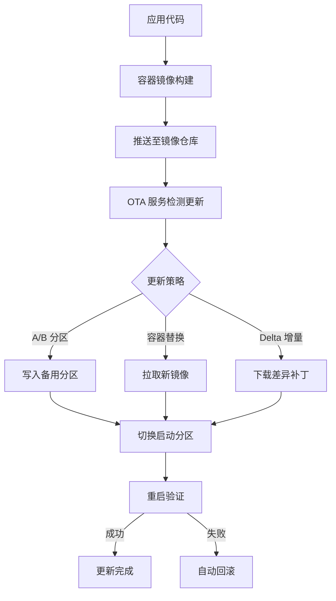
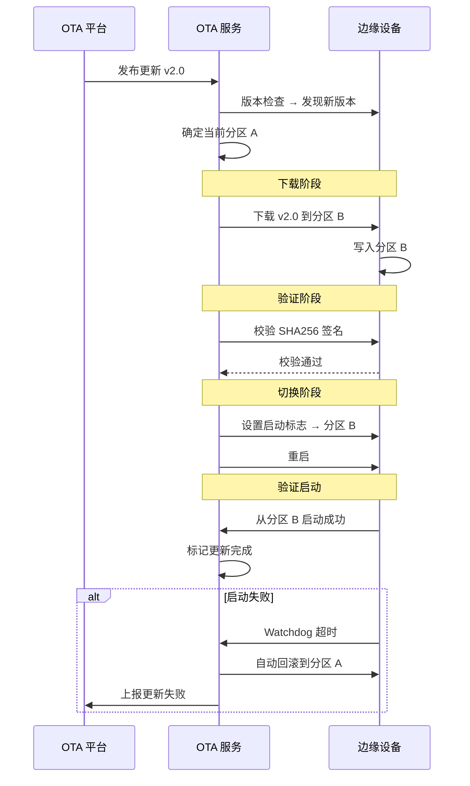
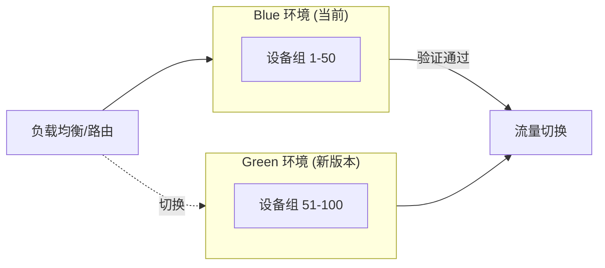

# 容器化与 OTA 更新

容器化是 IoT 边缘部署的基础设施，OTA（Over-The-Air）更新是远程维护设备的核心能力。本章介绍 .NET 8 Alpine 容器化、Docker Compose 编排，以及 A/B 分区、Delta 增量更新等 OTA 策略。

## 容器化与 OTA 关系



---

## Docker for IoT

### .NET 8 Alpine Dockerfile

Alpine 镜像体积极小（~50MB vs Debian ~150MB），适合存储有限的边缘设备：

```dockerfile
# ===== 多阶段构建 =====

# 阶段1: 构建
FROM --platform=$BUILDPLATFORM mcr.microsoft.com/dotnet/sdk:8.0-alpine AS build
ARG TARGETARCH
WORKDIR /src

# 先复制项目文件，利用 Docker 缓存层
COPY EdgeGateway.csproj .
RUN dotnet restore -r linux-musl-$TARGETARCH

COPY . .
RUN dotnet publish -c Release -o /app \
    -r linux-musl-$TARGETARCH \
    --self-contained false \
    -p:PublishTrimmed=true \
    -p:TrimMode=partial

# 阶段2: 运行
FROM mcr.microsoft.com/dotnet/runtime:8.0-alpine-amd64 AS runtime-amd64
FROM mcr.microsoft.com/dotnet/runtime:8.0-alpine-arm64 AS runtime-arm64

# 根据目标架构选择基础镜像
ARG TARGETARCH
FROM runtime-${TARGETARCH} AS final

WORKDIR /app

# 安全: 非 root 用户
RUN adduser -D appuser
COPY --from=build /app .
USER appuser

# 健康检查
HEALTHCHECK --interval=30s --timeout=5s --retries=3 \
    CMD wget -qO- http://localhost:8080/health || exit 1

ENTRYPOINT ["dotnet", "EdgeGateway.dll"]
```

::: tip 多架构构建
```bash
# 创建 buildx 构建器
docker buildx create --name iot-builder --use

# 同时构建 ARM64 和 AMD64 并推送
docker buildx build \
  --platform linux/arm64,linux/amd64 \
  -t myregistry.io/edge-gateway:1.2.0 \
  --push .
```
:::

### 精简镜像技巧

| 技术 | 镜像大小减少 | 注意事项 |
|------|-------------|---------|
| Alpine 基础镜像 | ~100MB | 使用 musl libc，少数库不兼容 |
| PublishTrimmed | ~30-50% | 反射依赖需添加 trimming 配置 |
| PublishSingleFile | 无（单文件方便部署） | 调试稍复杂 |
| AOT 编译 | ~40% + 启动更快 | 不支持动态加载 |

::: warning Trimming 注意
使用 `PublishTrimmed=true` 时，反射相关代码可能被错误裁剪。解决方法：
1. 在项目文件中添加 `[DynamicDependency]` 特性
2. 配置 `TrimmerRootAssembly` 保留入口
3. 或使用 `TrimMode=partial` 只裁剪 SDK 代码
:::

---

## Docker Compose 编排

在边缘设备上用 Docker Compose 编排多个服务：

```yaml
# docker-compose.yml
version: '3.8'

services:
  edge-gateway:
    image: myregistry.io/edge-gateway:1.2.0
    container_name: edge-gateway
    restart: always
    ports:
      - "8080:8080"
    volumes:
      - ./appsettings.json:/app/appsettings.Production.json:ro
      - gateway-data:/data
    environment:
      - DOTNET_ENVIRONMENT=Production
      - Gateway__Mqtt__Host=mosquitto
      - Gateway__Upstream__Host=cloud-broker.example.com
    depends_on:
      mosquitto:
        condition: service_healthy
    healthcheck:
      test: ["CMD", "wget", "-qO-", "http://localhost:8080/health"]
      interval: 30s
      timeout: 5s
      retries: 3

  mosquitto:
    image: eclipse-mosquitto:2
    container_name: mosquitto
    restart: always
    ports:
      - "1883:1883"
    volumes:
      - ./mosquitto.conf:/mosquitto/config/mosquitto.conf:ro
      - mosquitto-data:/mosquitto/data
    healthcheck:
      test: ["CMD", "mosquitto_pub", "-t", "health", "-m", "ok"]
      interval: 10s

  ota-service:
    image: myregistry.io/ota-service:1.0.0
    container_name: ota-service
    restart: always
    volumes:
      - /var/run/docker.sock:/var/run/docker.sock:ro
      - ota-data:/data
    environment:
      - OTA__RegistryUrl=myregistry.io
      - OTA__CheckInterval=300

  watchtower:
    image: containrrr/watchtower
    container_name: watchtower
    restart: always
    volumes:
      - /var/run/docker.sock:/var/run/docker.sock
    command: --interval 300 --cleanup edge-gateway

volumes:
  gateway-data:
  mosquitto-data:
  ota-data:
```

::: important Docker Socket 安全
挂载 `/var/run/docker.sock` 意味着容器可以控制宿主 Docker。仅对信任的服务（如 OTA 服务）开放，并确保镜像来源可信。
:::

---

## 容器镜像仓库

### Azure Container Registry

```bash
# 创建 ACR
az acr create --name myacr --sku Basic --resource-group myRG

# 登录
az acr login --name myacr

# 推送镜像
docker tag edge-gateway:1.2.0 myacr.azurecr.io/edge-gateway:1.2.0
docker push myacr.azurecr.io/edge-gateway:1.2.0

# 边缘设备拉取（使用 token 认证）
docker login myacr.azurecr.io -u <token-name> -p <token-password>
docker pull myacr.azurecr.io/edge-gateway:1.2.0
```

### Harbor（私有化部署）

```bash
# Docker Compose 部署 Harbor
curl -sL https://github.com/goharbor/harbor/releases/download/v2.8.0/harbor-online-installer-v2.8.0.tgz | tar xz
cd harbor
./install.sh
# 访问 https://harbor.local 管理界面
```

::: tip 镜像仓库选型
| 仓库 | 适用场景 | 成本 |
|------|---------|------|
| Azure ACR | Azure 云部署 | 按存储+流量 |
| Harbor | 私有化、合规 | 自建服务器 |
| Docker Hub | 开源/测试 | 免费（有限制） |
| AWS ECR | AWS 云部署 | 按存储+流量 |
:::

---

## OTA 固件更新

### A/B 分区策略

A/B 分区是最安全的 OTA 方案，设备始终有一个可回退的备份系统：



### .NET OTA 服务实现

```csharp
// Services/OtaUpdateService.cs
using System.Security.Cryptography;
using System.Text.Json;

namespace EdgeGateway.Services;

public class OtaUpdateService : BackgroundService
{
    private readonly HttpClient _httpClient;
    private readonly ILogger<OtaUpdateService> _logger;
    private readonly OtaConfig _config;

    public OtaUpdateService(
        HttpClient httpClient,
        IOptions<OtaConfig> config,
        ILogger<OtaUpdateService> logger)
    {
        _httpClient = httpClient;
        _logger = logger;
        _config = config.Value;
    }

    protected override async Task ExecuteAsync(CancellationToken stoppingToken)
    {
        _logger.LogInformation("OTA 服务启动, 检查间隔: {Interval}s", _config.CheckIntervalSeconds);

        using var timer = new PeriodicTimer(
            TimeSpan.FromSeconds(_config.CheckIntervalSeconds));

        while (await timer.WaitForNextTickAsync(stoppingToken))
        {
            try
            {
                await CheckAndUpdateAsync(stoppingToken);
            }
            catch (Exception ex)
            {
                _logger.LogError(ex, "OTA 检查失败");
            }
        }
    }

    private async Task CheckAndUpdateAsync(CancellationToken ct)
    {
        // 1. 检查远程版本
        var versionInfo = await GetLatestVersionAsync(ct);
        if (versionInfo == null) return;

        var currentVersion = GetCurrentVersion();
        if (versionInfo.Version <= currentVersion)
        {
            _logger.LogDebug("已是最新版本: {Version}", currentVersion);
            return;
        }

        _logger.LogInformation("发现新版本: {Current} → {New}",
            currentVersion, versionInfo.Version);

        // 2. 确定目标分区
        var currentPartition = GetCurrentPartition();
        var targetPartition = currentPartition == "A" ? "B" : "A";
        var targetPath = targetPartition == "A"
            ? _config.PartitionAPath
            : _config.PartitionBPath;

        _logger.LogInformation("目标分区: {Partition} ({Path})", targetPartition, targetPath);

        // 3. 下载更新
        var tempPath = Path.Combine(_config.TempDir, $"update-{versionInfo.Version}.tmp");
        await DownloadAsync(versionInfo.DownloadUrl, tempPath, ct);

        // 4. 校验签名
        if (!await VerifyAsync(tempPath, versionInfo.Sha256, versionInfo.Signature))
        {
            _logger.LogError("校验失败! 丢弃更新");
            File.Delete(tempPath);
            return;
        }

        // 5. 应用更新
        await ApplyUpdateAsync(tempPath, targetPath, ct);

        // 6. 切换启动分区
        SetBootPartition(targetPartition);

        // 7. 重启
        _logger.LogInformation("更新完成, 即将重启...");
        await Task.Delay(2000, ct);
        RestartDevice();
    }

    private async Task<VersionInfo?> GetLatestVersionAsync(CancellationToken ct)
    {
        var response = await _httpClient.GetAsync(
            $"{_config.ServerUrl}/api/versions/latest?device={_config.DeviceId}", ct);

        if (!response.IsSuccessStatusCode) return null;

        var json = await response.Content.ReadAsStringAsync(ct);
        return JsonSerializer.Deserialize<VersionInfo>(json);
    }

    private Version GetCurrentVersion()
    {
        var versionFile = Path.Combine(_config.DataDir, "version.txt");
        if (File.Exists(versionFile))
        {
            var text = File.ReadAllText(versionFile).Trim();
            return Version.TryParse(text, out var v) ? v : new Version(1, 0);
        }
        return new Version(1, 0);
    }

    private string GetCurrentPartition()
    {
        var flagFile = Path.Combine(_config.DataDir, "active_partition.txt");
        return File.Exists(flagFile) ? File.ReadAllText(flagFile).Trim() : "A";
    }

    private async Task DownloadAsync(string url, string targetPath, CancellationToken ct)
    {
        _logger.LogInformation("下载: {Url}", url);
        Directory.CreateDirectory(Path.GetDirectoryName(targetPath)!);

        using var response = await _httpClient.GetAsync(url, HttpCompletionOption.ResponseHeadersRead, ct);
        response.EnsureSuccessStatusCode();

        var totalBytes = response.Content.Headers.ContentLength ?? -1;
        var bytesRead = 0L;

        using var contentStream = await response.Content.ReadAsStreamAsync(ct);
        using var fileStream = new FileStream(targetPath, FileMode.Create, FileAccess.Write);

        var buffer = new byte[81920];
        int read;
        while ((read = await contentStream.ReadAsync(buffer, ct)) > 0)
        {
            await fileStream.WriteAsync(buffer.AsMemory(0, read), ct);
            bytesRead += read;

            if (totalBytes > 0 && bytesRead % (1024 * 1024) == 0)
            {
                var progress = (double)bytesRead / totalBytes * 100;
                _logger.LogInformation("下载进度: {Progress:F0}% ({MB}/{TotalMB}MB)",
                    progress,
                    bytesRead / (1024 * 1024),
                    totalBytes / (1024 * 1024));
            }
        }
    }

    private async Task<bool> VerifyAsync(string filePath, string expectedSha256, string? signature)
    {
        // SHA256 校验
        using var sha256 = SHA256.Create();
        using var stream = File.OpenRead(filePath);
        var hash = await sha256.ComputeHashAsync(stream);
        var actualSha256 = Convert.ToHexString(hash).ToLowerInvariant();

        if (actualSha256 != expectedSha256.ToLowerInvariant())
        {
            _logger.LogError("SHA256 不匹配: 期望={Expected}, 实际={Actual}",
                expectedSha256, actualSha256);
            return false;
        }

        // 签名校验（使用 RSA 公钥）
        if (!string.IsNullOrEmpty(signature) && !string.IsNullOrEmpty(_config.PublicKeyPath))
        {
            using var rsa = RSA.Create();
            rsa.ImportFromPem(File.ReadAllText(_config.PublicKeyPath));

            var signatureBytes = Convert.FromBase64String(signature);
            return rsa.VerifyData(
                await File.ReadAllBytesAsync(filePath),
                signatureBytes,
                HashAlgorithmName.SHA256,
                RSASignaturePadding.Pkcs1);
        }

        return true;
    }

    private async Task ApplyUpdateAsync(string sourcePath, string targetPath, CancellationToken ct)
    {
        _logger.LogInformation("应用更新到: {Path}", targetPath);

        // 备份当前目标分区
        var backupPath = targetPath + ".bak";
        if (Directory.Exists(targetPath))
        {
            if (Directory.Exists(backupPath))
                Directory.Delete(backupPath, true);
            Directory.Move(targetPath, backupPath);
        }

        // 解压/复制更新文件
        Directory.CreateDirectory(targetPath);
        // 假设下载的是 zip 包
        System.IO.Compression.ZipFile.ExtractToDirectory(sourcePath, targetPath);

        // 清理临时文件
        File.Delete(sourcePath);

        await Task.CompletedTask;
    }

    private void SetBootPartition(string partition)
    {
        var flagFile = Path.Combine(_config.DataDir, "active_partition.txt");
        File.WriteAllText(flagFile, partition);
        _logger.LogInformation("启动分区设为: {Partition}", partition);
    }

    private void RestartDevice()
    {
        // Linux: 使用 systemctl 或 reboot
        // 注意: 实际生产中需要更优雅的重启机制
        using var process = System.Diagnostics.Process.Start(
            new System.Diagnostics.ProcessStartInfo
            {
                FileName = "sudo",
                Arguments = "systemctl restart edge-gateway",
                UseShellExecute = false
            });
    }
}

// 配置模型
public record OtaConfig(
    string ServerUrl,
    string DeviceId,
    int CheckIntervalSeconds,
    string PartitionAPath,
    string PartitionBPath,
    string DataDir,
    string TempDir,
    string? PublicKeyPath
);

// 版本信息
public record VersionInfo(
    Version Version,
    string DownloadUrl,
    string Sha256,
    string? Signature,
    DateTime ReleaseDate,
    string? ReleaseNotes
);
```

---

## Delta 增量更新

对于带宽受限的边缘场景，全量更新代价高。Delta 更新只传输新旧版本的差异：

```csharp
public class DeltaUpdateService
{
    /// <summary>
    /// 生成差异文件（服务端使用）
    /// 使用 bsdiff 算法生成二进制差异
    /// </summary>
    public static void CreateDelta(string oldFile, string newFile, string deltaFile)
    {
        // 实际使用 bsdiff 库: https://github.com/bsdiff/bsdiff
        // 此处为概念示意
        var oldBytes = File.ReadAllBytes(oldFile);
        var newBytes = File.ReadAllBytes(newFile);

        // 简化: 计算差异区域
        // 实际 bsdiff 使用后缀排序 + 差分编码
        Console.WriteLine($"旧版本: {oldBytes.Length} bytes");
        Console.WriteLine($"新版本: {newBytes.Length} bytes");
        Console.WriteLine($"理论差异: ~{Math.Abs(newBytes.Length - oldBytes.Length)} bytes");
    }

    /// <summary>
    /// 应用差异补丁（设备端使用）
    /// </summary>
    public static void ApplyDelta(string oldFile, string deltaFile, string outputFile)
    {
        // bspatch: old + delta → new
        var oldBytes = File.ReadAllBytes(oldFile);
        var deltaBytes = File.ReadAllBytes(deltaFile);

        // 简化示意: 实际使用 bspatch 库
        Console.WriteLine($"基础文件: {oldBytes.Length} bytes");
        Console.WriteLine($"差异补丁: {deltaBytes.Length} bytes");
        Console.WriteLine($"节省带宽: {(1 - (double)deltaBytes.Length / (oldBytes.Length + deltaBytes.Length)) * 100:F1}%");
    }
}
```

::: tip Delta 更新实践
- 使用 [bsdiff/bspatch](https://github.com/bsdiff/bsdiff) 生成和应用差异
- .NET 可通过 P/Invoke 或 [bsdiff.net](https://www.nuget.org/packages/bsdiff.net/) 调用
- 对于 50MB 的镜像，增量补丁通常只有 5-15MB（90%+ 节省）
- 服务端需要维护历史版本以生成差异
:::

---

## 更新编排策略

### 滚动更新

逐台更新设备，降低整体风险：

```csharp
public class RollingUpdateOrchestrator
{
    private readonly List<string> _deviceGroups;
    private readonly int _batchSize;
    private readonly TimeSpan _stabilizationPeriod;

    public async Task ExecuteAsync(VersionInfo version, CancellationToken ct)
    {
        for (int i = 0; i < _deviceGroups.Count; i++)
        {
            var batch = _deviceGroups.Skip(i * _batchSize).Take(_batchSize);
            Console.WriteLine($"更新批次 {i + 1}: {batch.Count()} 台设备");

            // 并行推送更新到当前批次
            var tasks = batch.Select(d => PushUpdateAsync(d, version, ct));
            var results = await Task.WhenAll(tasks);

            // 等待稳定期
            Console.WriteLine($"等待稳定期: {_stabilizationPeriod.TotalMinutes} 分钟");
            await Task.Delay(_stabilizationPeriod, ct);

            // 检查批次健康度
            var failures = results.Count(r => !r.Success);
            var failureRate = (double)failures / results.Length;

            if (failureRate > 0.1) // 失败率 > 10% 暂停
            {
                Console.WriteLine($"⚠ 批次失败率 {failureRate:P0} 过高, 暂停更新");
                break;
            }

            Console.WriteLine($"批次 {i + 1} 完成, 失败率 {failureRate:P0}");
        }
    }

    private Task<UpdateResult> PushUpdateAsync(string deviceId, VersionInfo version, CancellationToken ct)
    {
        // 通过 MQTT/HTTP 通知设备下载更新
        return Task.FromResult(new UpdateResult(deviceId, true));
    }
}

record UpdateResult(string DeviceId, bool Success);
```

### Blue-Green 部署

同时维护两套环境，切换流量实现零停机：



---

## 安全与回滚

### Watchdog 看门狗

```csharp
public class WatchdogService : BackgroundService
{
    private readonly ILogger<WatchdogService> _logger;
    private readonly TimeSpan _timeout;
    private DateTime _lastKick;

    public WatchdogService(ILogger<WatchdogService> logger, IOptions<OtaConfig> config)
    {
        _logger = logger;
        _timeout = TimeSpan.FromSeconds(config.Value.WatchdogTimeoutSeconds);
        _lastKick = DateTime.UtcNow;
    }

    public void Kick()
    {
        _lastKick = DateTime.UtcNow;
    }

    protected override async Task ExecuteAsync(CancellationToken stoppingToken)
    {
        while (!stoppingToken.IsCancellationRequested)
        {
            var elapsed = DateTime.UtcNow - _lastKick;
            if (elapsed > _timeout)
            {
                _logger.LogError("看门狗超时! 应用可能无响应, 执行回滚");

                // 回滚到备份分区
                var currentPartition = File.ReadAllText("/data/active_partition.txt").Trim();
                var rollbackPartition = currentPartition == "A" ? "B" : "A";
                File.WriteAllText("/data/active_partition.txt", rollbackPartition);

                _logger.LogWarning("已回滚到分区: {Partition}", rollbackPartition);

                // 重启服务
                using var process = System.Diagnostics.Process.Start(
                    new System.Diagnostics.ProcessStartInfo
                    {
                        FileName = "sudo",
                        Arguments = "systemctl restart edge-gateway"
                    });

                break;
            }

            await Task.Delay(5000, stoppingToken);
        }
    }
}
```

---

## 参考链接

- [.NET Docker 官方镜像](https://hub.docker.com/_/microsoft-dotnet)
- [Docker 多架构构建](https://docs.docker.com/build/building/multi-platform/)
- [Azure Container Registry](https://learn.microsoft.com/azure/container-registry/)
- [Harbor 开源镜像仓库](https://github.com/goharbor/harbor)
- [bsdiff 差异算法](https://github.com/bsdiff/bsdiff)
- [Watchtower 自动更新](https://github.com/containrrr/watchtower)
- [Mender OTA 平台](https://github.com/mendersoftware/mender)
- [SWUpdate Linux 更新框架](https://github.com/sbabic/swupdate)

---

## 面试技巧

::: tip 面试高频问题
1. **A/B 分区更新的原理？为什么比单分区安全？**
   - 设备有两个系统分区，始终从活动分区启动。更新写入非活动分区，成功后切换启动标志。启动失败时 Watchdog 触发自动回滚到旧分区。核心优势：**总是有可回退的系统**。

2. **Delta 增量更新的原理？适用场景？**
   - 使用 bsdiff 等算法计算新旧版本二进制差异，只传输差异部分。设备端用 bspatch 将旧版本+补丁合成新版本。适合带宽受限（蜂窝网络）和大量设备同时更新（减少服务器压力）。

3. **如何保证 OTA 更新的安全性？**
   - 三重保障：SHA256 校验完整性、RSA 签名验证来源、HTTPS 传输加密。此外，下载失败不影响运行系统（写入非活动分区），启动失败有 Watchdog 自动回滚。

4. **Docker 镜像为什么用 Alpine？注意事项？**
   - Alpine 体积小（基础镜像 ~5MB vs Debian ~80MB），启动快。但使用 musl libc 而非 glibc，某些 .NET 库可能不兼容（如 System.Drawing）。.NET 8 Alpine 镜像已很稳定，大多数场景可用。

5. **滚动更新和蓝绿部署的区别？**
   - 滚动更新：逐批替换，渐进式，回滚慢；蓝绿：两套并行，瞬间切换，回滚快但资源占用翻倍。IoT 场景通常用滚动更新（设备多、可容忍短暂不一致），关键系统用蓝绿。
:::
