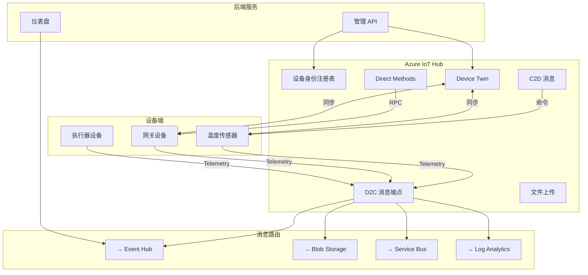
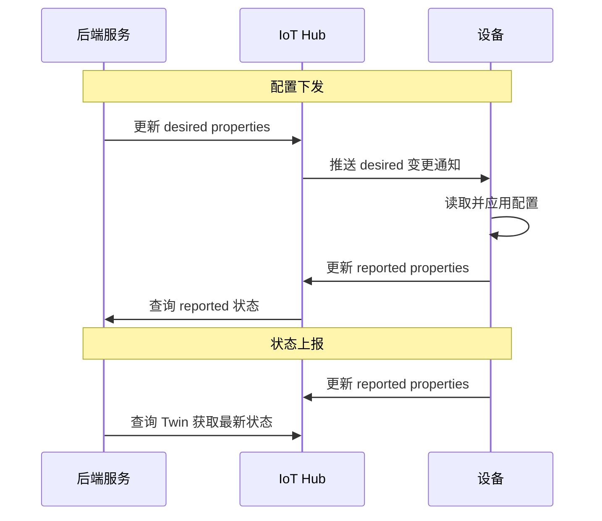

# Azure IoT Hub 深度

Azure IoT Hub 是微软托管的 IoT 云平台核心服务，提供设备身份管理、双向通信、设备孪生、消息路由等能力。本章深入介绍 IoT Hub 的核心概念和 .NET SDK 实战。

## IoT Hub 数据流全景



---

## 核心概念

### 通信模式对比

| 模式 | 方向 | 用途 | 可靠性 | 延迟 |
|------|------|------|--------|------|
| D2C 消息 | 设备→云 | 遥测数据上报 | At-least-once | 秒级 |
| C2D 消息 | 云→设备 | 命令/通知 | At-most-once | 秒级 |
| Direct Method | 云↔设备 | RPC 调用 | 请求-响应 | 秒级（超时可控） |
| Device Twin | 云↔设备 | 配置/状态同步 | 最终一致 | 分钟级 |
| 文件上传 | 设备→云 | 大文件/图片 | At-least-once | 分钟级 |

::: tip 选择通信模式
- **实时遥测** → D2C 消息
- **一次性命令** → C2D 消息
- **需要确认的命令** → Direct Method
- **持久配置同步** → Device Twin desired/reported properties
- **图片/日志/固件** → 文件上传
:::

---

## 设备端 SDK

### 安装

```bash
dotnet add package Microsoft.Azure.Devices.Client
```

### 设备连接与遥测上报

```csharp
using Microsoft.Azure.Devices.Client;
using System.Text;
using System.Text.Json;

class ThermostatDevice
{
    private static DeviceClient? _deviceClient;
    private static string _connectionString = "<DEVICE_CONNECTION_STRING>";

    static async Task Main(string[] args)
    {
        // 创建设备客户端
        _deviceClient = DeviceClient.CreateFromConnectionString(_connectionString,
            TransportType.Mqtt);

        Console.WriteLine("恒温器设备已连接到 IoT Hub");

        // 注册回调
        await RegisterCallbacksAsync();

        // 模拟遥测上报
        await SendTelemetryLoopAsync();
    }

    static async Task RegisterCallbacksAsync()
    {
        // 1. 接收 C2D 消息
        await _deviceClient!.SetReceiveMessageHandlerAsync(OnC2DMessage, null);

        // 2. 接收 Direct Method
        await _deviceClient.SetMethodHandlerAsync("SetTemperature", OnSetTemperature, null);
        await _deviceClient.SetMethodHandlerAsync("Reboot", OnReboot, null);

        // 3. 监听 Twin desired properties 变化
        await _deviceClient.SetDesiredPropertyUpdateCallbackAsync(OnDesiredPropertyChanged, null);
    }

    // === D2C 消息：遥测上报 ===

    static async Task SendTelemetryLoopAsync()
    {
        double currentTemp = 22.0;
        var random = new Random();

        while (true)
        {
            // 模拟温度变化
            currentTemp += random.NextDouble() * 2 - 1;
            currentTemp = Math.Clamp(currentTemp, 15, 35);

            var telemetry = new
            {
                temperature = Math.Round(currentTemp, 1),
                humidity = Math.Round(40 + random.NextDouble() * 30, 0),
                timestamp = DateTime.UtcNow
            };

            var messageJson = JsonSerializer.Serialize(telemetry);
            using var message = new Message(Encoding.UTF8.GetBytes(messageJson));

            // 设置消息属性（可用于路由）
            message.Properties.Add("sensorType", "BME280");
            message.Properties.Add("location", "workshop-a");

            // 设置消息过期时间
            message.ExpiryTimeUtc = DateTime.UtcNow.AddMinutes(5);

            await _deviceClient!.SendEventAsync(message);
            Console.WriteLine($"[D2C] 遥测已发送: {currentTemp:F1}°C");

            await Task.Delay(5000);
        }
    }

    // === C2D 消息：接收云端命令 ===

    static async Task OnC2DMessage(Message message, object? userContext)
    {
        var payload = Encoding.UTF8.GetString(message.GetBytes());
        Console.WriteLine($"[C2D] 收到消息: {payload}");

        // 完成消息（确认接收）
        await _deviceClient!.CompleteAsync(message);
    }

    // === Direct Method：RPC 调用 ===

    static Task<MethodResponse> OnSetTemperature(MethodRequest methodRequest, object? userContext)
    {
        var payload = JsonSerializer.Deserialize<Dictionary<string, double>>(
            methodRequest.DataAsJson);

        if (payload != null && payload.TryGetValue("targetTemperature", out var target))
        {
            Console.WriteLine($"[DirectMethod] 设置目标温度: {target}°C");

            var response = JsonSerializer.Serialize(new
            {
                status = "accepted",
                targetTemperature = target,
                message = $"目标温度设为 {target}°C"
            });

            return Task.FromResult(new MethodResponse(
                Encoding.UTF8.GetBytes(response), 200));
        }

        return Task.FromResult(new MethodResponse(400));
    }

    static async Task<MethodResponse> OnReboot(MethodRequest methodRequest, object? userContext)
    {
        var payload = JsonSerializer.Deserialize<Dictionary<string, int>>(
            methodRequest.DataAsJson);

        int delaySeconds = payload?.GetValueOrDefault("delaySeconds", 5) ?? 5;

        Console.WriteLine($"[DirectMethod] 收到重启命令, 延迟 {delaySeconds} 秒");

        // 立即返回响应
        var response = new MethodResponse(Encoding.UTF8.GetBytes(
            JsonSerializer.Serialize(new { status = "rebooting", delaySeconds })), 200);

        // 异步执行重启
        _ = Task.Run(async () =>
        {
            await Task.Delay(delaySeconds * 1000);
            Console.WriteLine("设备重启中...");
        });

        return response;
    }

    // === Device Twin：配置同步 ===

    static async Task OnDesiredPropertyChanged(
        TwinCollection desiredProperties, object? userContext)
    {
        Console.WriteLine("[Twin] 收到 desired properties 更新:");

        if (desiredProperties.Contains("telemetryInterval"))
        {
            int interval = desiredProperties["telemetryInterval"];
            Console.WriteLine($"  遥测间隔: {interval} 秒");
        }

        if (desiredProperties.Contains("alertThreshold"))
        {
            double threshold = desiredProperties["alertThreshold"];
            Console.WriteLine($"  告警阈值: {threshold}°C");
        }

        // 更新 reported properties 确认配置已应用
        var reported = new TwinCollection
        {
            ["telemetryInterval"] = desiredProperties.Contains("telemetryInterval")
                ? (int)desiredProperties["telemetryInterval"] : 5,
            ["alertThreshold"] = desiredProperties.Contains("alertThreshold")
                ? (double)desiredProperties["alertThreshold"] : 30.0,
            ["configApplied"] = true,
            ["lastConfigUpdate"] = DateTime.UtcNow.ToString("O")
        };

        await _deviceClient!.UpdateReportedPropertiesAsync(reported);
        Console.WriteLine("[Twin] reported properties 已更新");
    }
}
```

---

## Device Twin 同步模式

Device Twin 是 JSON 文档，包含三部分：

```json
{
  "deviceId": "thermostat-01",
  "tags": {
    "location": "workshop-a",
    "department": "manufacturing"
  },
  "properties": {
    "desired": {
      "telemetryInterval": 10,
      "alertThreshold": 35.0,
      "firmwareVersion": "2.0.0"
    },
    "reported": {
      "telemetryInterval": 10,
      "alertThreshold": 35.0,
      "currentTemperature": 24.5,
      "firmwareVersion": "1.5.0",
      "lastReboot": "2026-05-20T10:30:00Z"
    }
  }
}
```



::: important Twin 版本号
Twin 的每个属性都有 `$version` 元数据。设备端应对比版本号，避免覆盖更新的配置。desired properties 变更时，IoT Hub 会发送包含 `$version` 的通知。
:::

---

## 消息路由

IoT Hub 内置消息路由引擎，根据消息属性或 Twin 变更事件自动分发数据：

```csharp
// 后端服务：查看路由配置
using Microsoft.Azure.Devices;

class RouteManager
{
    private static ServiceClient? _serviceClient;

    static async Task Main()
    {
        _serviceClient = ServiceClient.CreateFromConnectionString("<IOTHUB_CONNECTION_STRING>");

        // 发送 C2D 消息
        await SendC2DMessage();

        // 调用 Direct Method
        await InvokeDirectMethod();
    }

    static async Task SendC2DMessage()
    {
        var payload = JsonSerializer.Serialize(new
        {
            action = "setMode",
            mode = "heating",
            targetTemperature = 25.0
        });

        using var message = new Message(Encoding.UTF8.GetBytes(payload));
        message.MessageId = Guid.NewGuid().ToString();
        message.Properties.Add("priority", "high");

        await _serviceClient!.SendAsync("thermostat-01", message);
        Console.WriteLine("C2D 消息已发送");
    }

    static async Task InvokeDirectMethod()
    {
        var method = new CloudToDeviceMethod("SetTemperature",
            responseTimeout: TimeSpan.FromSeconds(30));

        method.SetPayloadJson(JsonSerializer.Serialize(new
        {
            targetTemperature = 28.0
        }));

        var result = await _serviceClient!.InvokeDeviceMethodAsync("thermostat-01", method);

        Console.WriteLine($"Direct Method 响应: {result.Status}");
        Console.WriteLine($"Payload: {result.GetPayloadAsJson()}");
    }
}
```

### 路由查询语法

```
-- 按消息属性路由
sensorType = 'BME280' AND location = 'workshop-a'

-- 按消息体路由（需启用 body 路由）
$body.temperature > 30

-- Twin 变更路由
is_defined($twin.properties.desired.alertThreshold)

-- 按设备连接事件路由
connectionEventType = 'deviceConnected'
```

---

## IoT Hub 层级与扩展

| 特性 | Free | S1 | S2 | S3 |
|------|------|----|----|-----|
| 消息/天 | 8,000 | 400,000 | 6,000,000 | 300,000,000 |
| 设备数 | 500 | 不限 | 不限 | 不限 |
| 消息大小 | 128KB | 256KB | 256KB | 256KB |
| 路由端点 | 1 | 10 | 10 | 10 |
| Direct Method | ✓ | ✓ | ✓ | ✓ |
| Device Twin | ✓ | ✓ | ✓ | ✓ |
| 价格 | 免费 | ~$25/月 | ~$250/月 | ~$2500/月 |

::: warning 扩展建议
- S1 适合 < 1000 台设备的场景
- 超过 1000 台设备建议 S2 或使用 IoT Hub 分区
- 使用自动缩放避免突发流量丢消息
- 考虑 IoT Central（托管 SaaS）降低运维复杂度
:::

---

## 参考链接

- [Azure IoT Hub 文档](https://learn.microsoft.com/azure/iot-hub/)
- [Device Client SDK](https://learn.microsoft.com/dotnet/api/microsoft.azure.devices.client)
- [Service Client SDK](https://learn.microsoft.com/dotnet/api/microsoft.azure.devices)
- [Device Twin 理解](https://learn.microsoft.com/azure/iot-hub/iot-hub-devguide-device-twins)
- [消息路由文档](https://learn.microsoft.com/azure/iot-hub/iot-hub-devguide-messages-d2c)
- [Direct Method 文档](https://learn.microsoft.com/azure/iot-hub/iot-hub-devguide-direct-methods)
- [IoT Hub 定价](https://azure.microsoft.com/pricing/details/iot-hub/)
- [IoT Hub 限制与配额](https://learn.microsoft.com/azure/iot-hub/iot-hub-devguide-quotas-throttles)

---

## 面试技巧

::: tip 面试高频问题
1. **D2C、C2D、Direct Method、Device Twin 四种通信模式的区别和场景？**
   - D2C：设备主动上报遥测（高频、单向）；C2D：云端下发一次性通知（低频、不确认执行）；Direct Method：同步 RPC（需确认、有超时）；Twin：配置/状态双向同步（持久、最终一致）。面试时用表格对比更有说服力。

2. **Device Twin 的 desired 和 reported 属性如何协同？**
   - 后端写入 desired，设备读取 desired 并应用，然后更新 reported 确认。后端通过对比 desired 和 reported 判断配置是否生效。版本号 `$version` 防止旧配置覆盖新配置。

3. **IoT Hub 消息路由有什么用？**
   - 根据消息属性或内容自动将数据分发到不同目标（Event Hub、Blob、Service Bus），无需额外代码。典型场景：温度告警路由到 Service Bus 触发函数，正常数据路由到 Blob 存储。

4. **Direct Method 的超时和限制？**
   - 默认超时 30 秒（可配置 5-300 秒），设备必须在线才能调用。不支持队列。大量设备同时调用时受 IoT Hub 限流。面试时对比 C2D 消息（支持离线队列）说明何时选 Direct Method。

5. **如何处理 IoT Hub 限流？**
   - 了解各 SKU 的限流阈值（S1: 100 请求/秒/单元）；使用批量 API 减少请求数；设备端实施指数退避重试；使用多个 IoT Hub 分区（Hub 路由）分散负载。
:::
