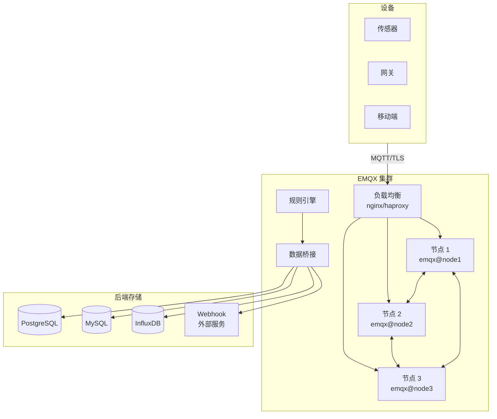
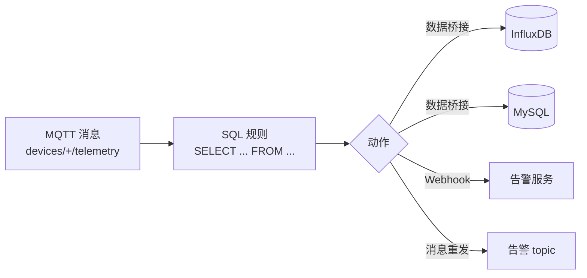

# 开源 MQTT 平台 EMQX

EMQX 是高性能开源 MQTT 消息代理，单节点支持千万级连接，内置规则引擎和数据桥接能力。本章介绍 EMQX 部署、认证授权、规则引擎和 .NET 客户端集成。

## EMQX 架构



---

## 安装与部署

### Docker 部署（推荐）

```bash
# 单节点
docker run -d \
  --name emqx \
  -p 1883:1883 \
  -p 8083:8083 \
  -p 8084:8084 \
  -p 8883:8883 \
  -p 18083:18083 \
  emqx/emqx:5.1

# 访问管理面板: http://localhost:18083
# 默认账号: admin / public
```

### Docker Compose 集群

```yaml
version: '3.8'

services:
  emqx1:
    image: emqx/emqx:5.1
    container_name: emqx1
    environment:
      - EMQX_NAME=emqx
      - EMQX_HOST=node1.emqx.io
      - EMQX_CLUSTER__DISCOVERY_STRATEGY=static
      - EMQX_CLUSTER__STATIC__SEEDS=[emqx1@node1.emqx.io,emqx2@node2.emqx.io]
    hostname: node1.emqx.io
    ports:
      - "1883:1883"
      - "18083:18083"

  emqx2:
    image: emqx/emqx:5.1
    container_name: emqx2
    environment:
      - EMQX_NAME=emqx
      - EMQX_HOST=node2.emqx.io
      - EMQX_CLUSTER__DISCOVERY_STRATEGY=static
      - EMQX_CLUSTER__STATIC__SEEDS=[emqx1@node1.emqx.io,emqx2@node2.emqx.io]
    hostname: node2.emqx.io
```

::: tip 端口说明
| 端口 | 协议 | 用途 |
|------|------|------|
| 1883 | MQTT | TCP 连接 |
| 8883 | MQTTS | TLS 加密连接 |
| 8083 | WebSocket | WS 连接 |
| 8084 | WSS | WebSocket TLS |
| 18083 | HTTP | 管理面板 API |
:::

---

## 认证

### 用户名/密码认证

```bash
# 通过 Dashboard 添加: 认证 → 创建 → Password-Based → Built-in Database
# 或通过 REST API
curl -X POST 'http://localhost:18083/api/v5/authentication' \
  -u admin:public \
  -H 'Content-Type: application/json' \
  -d '{
    "backend": "built_in_database",
    "mechanism": "password_based",
    "password_hash_algorithm": {
      "name": "sha256",
      "salt_position": "suffix"
    },
    "user_id_type": "username"
  }'

# 添加用户
curl -X POST 'http://localhost:18083/api/v5/authentication/built_in_database/users' \
  -u admin:public \
  -H 'Content-Type: application/json' \
  -d '{
    "user_id": "device-001",
    "password": "secure-password-123",
    "is_superuser": false
  }'
```

### JWT 认证

```bash
# EMQX 配置 JWT 认证
curl -X POST 'http://localhost:18083/api/v5/authentication' \
  -u admin:public \
  -H 'Content-Type: application/json' \
  -d '{
    "mechanism": "jwt",
    "backend": "jwt",
    "from": "password",
    "algorithm": "hmac-based",
    "secret": "my-jwt-secret-key",
    "secret_base64_encoded": false
  }'
```

.NET 端生成 JWT Token：

```csharp
using System.IdentityModel.Tokens.Jwt;
using System.Security.Claims;
using System.Text;
using Microsoft.IdentityModel.Tokens;

public static class EmqxJwtGenerator
{
    public static string GenerateToken(string deviceId, string secret, int expireMinutes = 60)
    {
        var key = new SymmetricSecurityKey(Encoding.UTF8.GetBytes(secret));
        var credentials = new SigningCredentials(key, SecurityAlgorithms.HmacSha256);

        var claims = new[]
        {
            new Claim("sub", deviceId),
            new Claim("username", deviceId),
            // EMQX 可从 JWT 中提取 ACL 信息
            new Claim("acl", JsonSerializer.Serialize(new[]
            {
                new { permission = "allow", action = "publish", topic = $"devices/{deviceId}/telemetry" },
                new { permission = "allow", action = "subscribe", topic = $"devices/{deviceId}/commands" }
            }))
        };

        var token = new JwtSecurityToken(
            issuer: "iot-platform",
            audience: "emqx",
            claims: claims,
            expires: DateTime.UtcNow.AddMinutes(expireMinutes),
            signingCredentials: credentials
        );

        return new JwtSecurityTokenHandler().WriteToken(token);
    }
}
```

### X.509 客户端证书认证

```bash
# EMQX 配置 TLS 和客户端证书认证
# emqx.conf
listeners.ssl.default {
  bind = 8883
  ssl_options {
    cacertfile = "/etc/emqx/certs/ca.crt"
    certfile = "/etc/emqx/certs/server.crt"
    keyfile = "/etc/emqx/certs/server.key"
    verify = verify_peer
    fail_if_no_peer_cert = true
  }
  enable_authn = true
  authentication {
    mechanism = "cert"
    backend = "cert"
    username = "cn"  # 从证书 CN 字段提取用户名
  }
}
```

---

## 授权（ACL）

```bash
# 基于 ACL 规则的授权
# 文件方式: etc/acl.conf
{allow, {user, "dashboard"}, subscribe, ["$SYS/#"]}.
{allow, {user, "device-+"}, publish, ["devices/%c/telemetry"]}.
{allow, {user, "device-+"}, subscribe, ["devices/%c/commands"]}.
{deny, all, subscribe, ["$SYS/#"]}.
{deny, all, publish, ["$SYS/#"]}.
{allow, all}.

# %c = 客户端 ID, %u = 用户名
```

::: important 最小权限原则
- 设备只能发布到自己的 topic：`devices/{deviceId}/telemetry`
- 设备只能订阅自己的命令 topic：`devices/{deviceId}/commands`
- 禁止设备订阅 `$SYS` 系统 topic
- 管理服务使用独立账号，拥有更宽权限
:::

---

## 规则引擎

EMQX 规则引擎使用 SQL 语法处理消息，实现数据桥接和转换：



### SQL 规则示例

```sql
-- 从遥测消息中提取温度超限数据
SELECT
  payload.temperature AS temperature,
  payload.humidity AS humidity,
  clientid AS device_id,
  timestamp AS event_time
FROM "devices/+/telemetry"
WHERE payload.temperature > 35

-- 动作1: 桥接到 InfluxDB
-- 动作2: 发布到 alerts/temperature topic
-- 动作3: Webhook 通知告警服务
```

```sql
-- 聚合统计: 每 10 秒计算平均温度
SELECT
  avg(payload.temperature) AS avg_temp,
  count(*) AS sample_count,
  clientid AS device_id
FROM "devices/+/telemetry"
GROUP BY clientid, timestamp DIV 10000
HAVING avg(payload.temperature) > 30
```

### 通过 REST API 创建规则

```bash
curl -X POST 'http://localhost:18083/api/v5/rules' \
  -u admin:public \
  -H 'Content-Type: application/json' \
  -d '{
    "id": "temp_alert",
    "sql": "SELECT payload.temperature as temp, clientid as device FROM \"devices/+/telemetry\" WHERE payload.temperature > 35",
    "actions": [
      {
        "function": "republish",
        "args": {
          "topic": "alerts/temperature",
          "payload": "{\"device\": \"${device}\", \"temperature\": ${temp}, \"alert\": true, \"time\": ${timestamp}}"
        }
      }
    ],
    "description": "温度超限告警规则"
  }'
```

### 数据桥接到数据库

```bash
# 桥接到 MySQL
curl -X POST 'http://localhost:18083/api/v5/bridges' \
  -u admin:public \
  -H 'Content-Type: application/json' \
  -d '{
    "type": "mysql",
    "name": "mysql_bridge",
    "mysql": {
      "server": "mysql-server:3306",
      "database": "iot_db",
      "username": "emqx",
      "password": "emqx_password",
      "sql": "INSERT INTO telemetry (device_id, temperature, humidity, timestamp) VALUES (${clientid}, ${payload.temperature}, ${payload.humidity}, NOW())"
    }
  }'
```

---

## EMQX + .NET 客户端

### 基本连接

```csharp
using MQTTnet;
using MQTTnet.Client;
using System.Text;
using System.Text.Json;

public class EmqxClient
{
    private IMqttClient? _client;
    private readonly string _host;
    private readonly int _port;

    public EmqxClient(string host, int port = 1883)
    {
        _host = host;
        _port = port;
    }

    public async Task ConnectAsync(string clientId, string username, string password)
    {
        var factory = new MqttFactory();
        _client = factory.CreateMqttClient();

        var options = new MqttClientOptionsBuilder()
            .WithTcpServer(_host, _port)
            .WithClientId(clientId)
            .WithCredentials(username, password)
            .WithCleanSession(false)
            .WithKeepAlivePeriod(TimeSpan.FromSeconds(60))
            .Build();

        // 连接断开回调
        _client.DisconnectedAsync += async e =>
        {
            Console.WriteLine($"断开连接: {e.Reason}");
            if (!e.ClientWasConnected)
            {
                await Task.Delay(5000);
                try
                {
                    await _client.ConnectAsync(options);
                }
                catch { }
            }
        };

        // 消息接收回调
        _client.ApplicationMessageReceivedAsync += OnMessageReceived;

        await _client.ConnectAsync(options);
        Console.WriteLine($"已连接到 EMQX: {_host}:{_port}");
    }

    private Task OnMessageReceived(MqttApplicationMessageReceivedEventArgs e)
    {
        var payload = Encoding.UTF8.GetString(e.ApplicationMessage.PayloadSegment);
        var topic = e.ApplicationMessage.Topic;

        Console.WriteLine($"[收到] topic={topic}, payload={payload}");
        return Task.CompletedTask;
    }

    // 发布遥测
    public async Task PublishTelemetryAsync(string deviceId, object data)
    {
        var topic = $"devices/{deviceId}/telemetry";
        var payload = JsonSerializer.Serialize(data);

        var message = new MqttApplicationMessageBuilder()
            .WithTopic(topic)
            .WithPayload(payload)
            .WithQualityOfServiceLevel(MQTTnet.Protocol.MqttQualityOfServiceLevel.AtLeastOnce)
            .WithRetainFlag(false)
            .Build();

        await _client!.PublishAsync(message);
    }

    // 订阅命令
    public async Task SubscribeCommandsAsync(string deviceId)
    {
        var topic = $"devices/{deviceId}/commands";
        var options = new MqttTopicFilterBuilder()
            .WithTopic(topic)
            .WithQualityOfServiceLevel(MQTTnet.Protocol.MqttQualityOfServiceLevel.AtLeastOnce)
            .Build();

        await _client!.SubscribeAsync(options);
        Console.WriteLine($"已订阅: {topic}");
    }
}
```

### 共享订阅（负载均衡）

EMQX 支持共享订阅，同一组消费者分摊消息：

```csharp
// 共享订阅格式: $share/{group}/{topic}
// 同一组内的客户端轮流接收消息
var sharedTopic = "$share/processor-group/devices/+/telemetry";

await _client!.SubscribeAsync(new MqttTopicFilterBuilder()
    .WithTopic(sharedTopic)
    .Build());

Console.WriteLine("已加入共享订阅组: processor-group");
```

::: tip 共享订阅场景
- 多个后端服务处理遥测数据，每个消息只需处理一次
- 水平扩展消费端，提升处理吞吐量
- 分组名相同的消费者属于同一组，消息在组内轮询分发
:::

---

## $SYS 系统主题监控

EMQX 通过 `$SYS` 主题发布系统指标：

```csharp
// 订阅系统指标
await _client.SubscribeAsync(new MqttTopicFilterBuilder()
    .WithTopic("$SYS/brokers/+/clients/+/connected")
    .Build());

await _client.SubscribeAsync(new MqttTopicFilterBuilder()
    .WithTopic("$SYS/brokers/+/stats/connections/count")
    .Build());

await _client.SubscribeAsync(new MqttTopicFilterBuilder()
    .WithTopic("$SYS/brokers/+/stats/messages/received")
    .Build());
```

常用 `$SYS` 主题：

| 主题 | 内容 |
|------|------|
| `$SYS/brokers/+/clients/+/connected` | 客户端上线事件 |
| `$SYS/brokers/+/clients/+/disconnected` | 客户端下线事件 |
| `$SYS/brokers/+/stats/connections/count` | 当前连接数 |
| `$SYS/brokers/+/stats/messages/received` | 接收消息数 |
| `$SYS/brokers/+/stats/messages/sent` | 发送消息数 |
| `$SYS/brokers/+/stats/bytes/received` | 接收字节数 |

---

## 限流与连接配额

```bash
# 配置连接速率限制
# emqx.conf
limiter {
  client {
    rate = "1000/s"
    capacity = 1000
  }
  message_in {
    rate = "5000/s"
    capacity = 5000
  }
}

# 连接配额
listeners.tcp.default {
  bind = 1883
  max_connections = 100000
  max_conn_rate = 1000
}
```

::: warning 限流策略
- 连接速率限制：防止 DDoS，超出限制的连接被拒绝
- 消息速率限制：防止单设备刷消息，影响其他设备
- 共享订阅组限流：控制消费端处理速率
- 生产环境务必配置限流，避免单设备故障影响全局
:::

---

## 参考链接

- [EMQX 官方文档](https://docs.emqx.com/zh/emqx/latest/)
- [EMQX GitHub](https://github.com/emqx/emqx)
- [MQTTnet GitHub](https://github.com/dotnet/MQTTnet)
- [EMQX 规则引擎](https://docs.emqx.com/zh/emqx/latest/data-integration/rule-engine.html)
- [EMQX 数据桥接](https://docs.emqx.com/zh/emqx/latest/data-integration/data-bridge.html)
- [EMQX 认证](https://docs.emqx.com/zh/emqx/latest/access-control/authn/authn.html)
- [EMQX 授权](https://docs.emqx.com/zh/emqx/latest/access-control/authz/authz.html)
- [EMQX 共享订阅](https://docs.emqx.com/zh/emqx/latest/mqtt/shared-subscription.html)

---

## 面试技巧

::: tip 面试高频问题
1. **EMQX 和 Mosquitto 的区别？什么时候选 EMQX？**
   - Mosquitto 轻量、单线程、适合小规模；EMQX 高性能、集群化、内置规则引擎和数据桥接。设备数 < 1000 选 Mosquitto，> 1000 或需要规则引擎选 EMQX。

2. **MQTT 共享订阅的原理？**
   - 共享订阅 `$share/{group}/{topic}` 让同组消费者分摊消息。EMQX 在组内使用轮询或随机策略分发。解决了"多个消费者订阅同一 topic 每人收到一份"的重复消费问题。

3. **EMQX 规则引擎 SQL 能做什么？**
   - 过滤（WHERE 条件）、转换（SELECT 字段映射）、聚合（GROUP BY + avg/count）、桥接（INSERT 到数据库）、重发（republish 到另一个 topic）。替代了传统需要 Kafka + Flink 的流处理链路。

4. **如何保证 MQTT 消息不丢失？**
   - QoS 1（至少一次）+ CleanSession=false（离线消息缓存）；QoS 2（恰好一次）性能差，一般不用；EMQX 消息持久化（配置消息保留时间）。注意：QoS 只保证 broker 到客户端的投递，不保证端到端。

5. **JWT 认证 vs 用户名/密码认证 vs 证书认证？**
   - 用户名/密码：简单，适合设备数少的场景；JWT：无状态，适合大规模设备，但 token 泄露风险大；X.509 证书：安全性最高，支持双向认证，但证书管理复杂。生产环境推荐证书认证 + ACL。
:::
