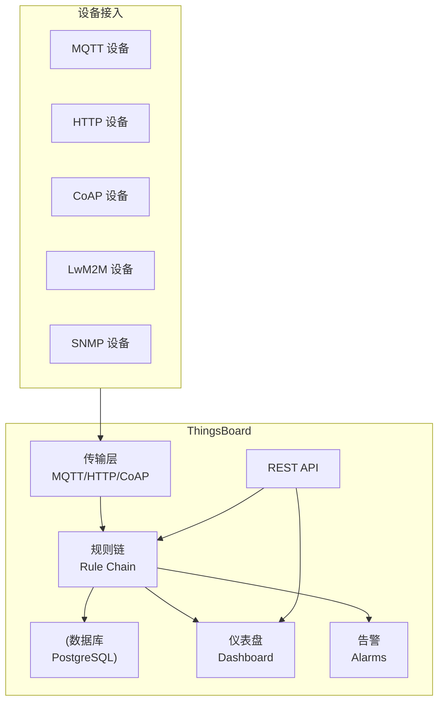
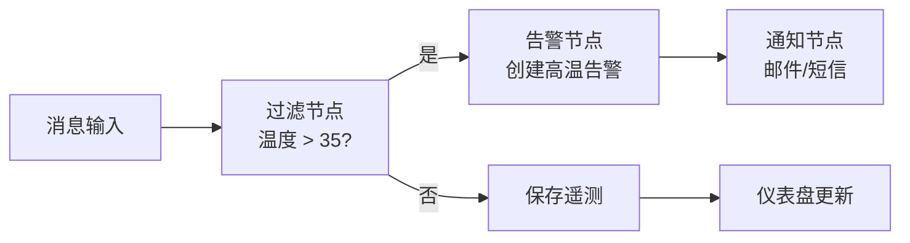
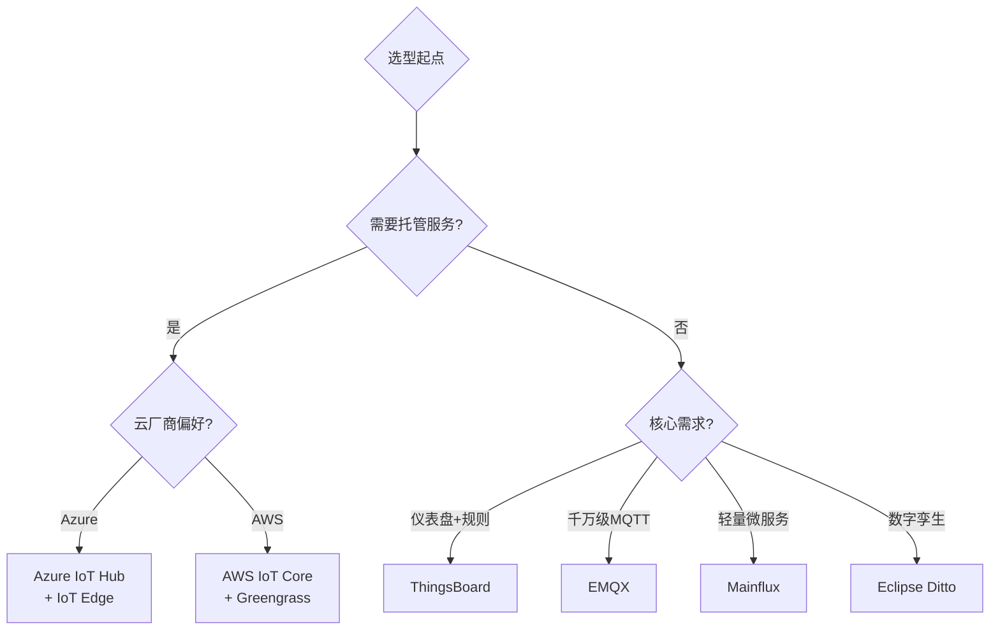

# ThingsBoard 与 IoT 平台选型

IoT 平台是设备管理、数据采集、规则处理和可视化的基础设施。本章介绍 ThingsBoard 开源平台的实战使用，并从 10+ 维度对比主流 IoT 平台，帮助做出选型决策。

## ThingsBoard 概览



---

## ThingsBoard 部署

### Docker 安装

```yaml
# docker-compose.yml
version: '3.8'

services:
  thingsboard:
    image: thingsboard/tb-postgres:3.5
    container_name: thingsboard
    ports:
      - "9090:9090"    # Web UI
      - "1883:1883"    # MQTT
      - "5683:5683/udp" # CoAP
      - "7070:7070"    # Edge RPC
    environment:
      TB_QUEUE_TYPE: in-memory
      SPRING_DATASOURCE_URL: "jdbc:postgresql://postgres:5432/thingsboard"
      SPRING_DATASOURCE_USERNAME: thingsboard
      SPRING_DATASOURCE_PASSWORD: thingsboard
    volumes:
      - tb-data:/data
      - tb-logs:/var/log/thingsboard
    depends_on:
      - postgres

  postgres:
    image: postgres:15
    container_name: tb-postgres
    environment:
      POSTGRES_DB: thingsboard
      POSTGRES_USER: thingsboard
      POSTGRES_PASSWORD: thingsboard
    volumes:
      - pg-data:/var/lib/postgresql/data

volumes:
  tb-data:
  tb-logs:
  pg-data:
```

```bash
# 启动
docker compose up -d

# 查看初始管理员密码
docker logs thingsboard 2>&1 | grep "System Administrator"
# 默认: sysadmin@thingsboard.org / sysadmin

# 访问: http://localhost:9090
```

::: important 数据库选择
- **PostgreSQL**：生产推荐，支持大量设备和历史数据
- **Hybrid (PostgreSQL + Cassandra)**：高写入场景，遥测数据存 Cassandra
- **In-memory**：仅开发/测试用，重启数据丢失
:::

---

## 设备配置与遥测

### 创建设备和 Token

```bash
# 通过 REST API 创建设备
curl -X POST 'http://localhost:9090/api/device' \
  -H "X-Authorization: Bearer ${JWT_TOKEN}" \
  -H 'Content-Type: application/json' \
  -d '{
    "name": "thermostat-01",
    "type": "thermostat",
    "label": "workshop-a"
  }'

# 获取设备 Token
curl -X GET "http://localhost:9090/api/device/${DEVICE_ID}/credentials" \
  -H "X-Authorization: Bearer ${JWT_TOKEN}"
```

### .NET HTTP 设备接入

```csharp
using System.Net.Http;
using System.Text;
using System.Text.Json;

public class ThingsBoardHttpClient
{
    private readonly HttpClient _httpClient;
    private readonly string _accessToken;

    public ThingsBoardHttpClient(string host, string accessToken)
    {
        _httpClient = new HttpClient { BaseAddress = new Uri(host) };
        _accessToken = accessToken;
    }

    /// <summary>
    /// 上报遥测数据
    /// POST /api/v1/{token}/telemetry
    /// </summary>
    public async Task SendTelemetryAsync(object telemetry)
    {
        var url = $"/api/v1/{_accessToken}/telemetry";
        var json = JsonSerializer.Serialize(telemetry);
        var content = new StringContent(json, Encoding.UTF8, "application/json");

        var response = await _httpClient.PostAsync(url, content);
        response.EnsureSuccessStatusCode();
    }

    /// <summary>
    /// 上报设备属性
    /// POST /api/v1/{token}/attributes
    /// </summary>
    public async Task SendAttributesAsync(object attributes)
    {
        var url = $"/api/v1/{_accessToken}/attributes";
        var json = JsonSerializer.Serialize(attributes);
        var content = new StringContent(json, Encoding.UTF8, "application/json");

        var response = await _httpClient.PostAsync(url, content);
        response.EnsureSuccessStatusCode();
    }

    /// <summary>
    /// 获取共享属性（服务端下发的配置）
    /// GET /api/v1/{token}/attributes?sharedKeys=config
    /// </summary>
    public async Task<JsonElement?> GetSharedAttributesAsync(string keys = "config")
    {
        var url = $"/api/v1/{_accessToken}/attributes?sharedKeys={keys}";
        var response = await _httpClient.GetAsync(url);
        response.EnsureSuccessStatusCode();

        var json = await response.Content.ReadAsStringAsync();
        using var doc = JsonDocument.Parse(json);
        return doc.RootElement.GetProperty("shared").GetProperty(keys);
    }

    /// <summary>
    /// 订阅 RPC 命令（长轮询）
    /// POST /api/v1/{token}/rpc
    /// </summary>
    public async Task SubscribeRpcAsync(CancellationToken ct)
    {
        var url = $"/api/v1/{_accessToken}/rpc";
        var content = new StringContent("{}", Encoding.UTF8, "application/json");

        while (!ct.IsCancellationRequested)
        {
            try
            {
                var response = await _httpClient.PostAsync(url, content, ct);
                if (response.IsSuccessStatusCode)
                {
                    var body = await response.Content.ReadAsStringAsync(ct);
                    Console.WriteLine($"[RPC] 收到命令: {body}");

                    // 解析并执行 RPC
                    var rpc = JsonSerializer.Deserialize<RpcRequest>(body);
                    if (rpc != null)
                    {
                        await HandleRpcAsync(rpc);
                    }
                }
            }
            catch (TaskCanceledException) { break; }
            catch (Exception ex)
            {
                Console.WriteLine($"RPC 订阅异常: {ex.Message}");
                await Task.Delay(1000, ct);
            }
        }
    }

    private async Task HandleRpcAsync(RpcRequest rpc)
    {
        Console.WriteLine($"执行 RPC: method={rpc.Method}, params={rpc.Params}");

        var result = rpc.Method switch
        {
            "setTemperature" => new { success = true, temperature = 25.0 },
            "getStatus" => new { status = "online", uptime = 3600 },
            _ => new { success = false, error = "unknown method" }
        };

        // 回复 RPC 结果
        var url = $"/api/v1/{_accessToken}/rpc/{rpc.Id}";
        var json = JsonSerializer.Serialize(result);
        await _httpClient.PostAsync(url, new StringContent(json, Encoding.UTF8, "application/json"));
    }
}

record RpcRequest(string Id, string Method, JsonElement Params);
```

### .NET MQTT 设备接入

```csharp
using MQTTnet;
using MQTTnet.Client;
using System.Text;
using System.Text.Json;

public class ThingsBoardMqttClient
{
    private IMqttClient? _client;

    public async Task ConnectAsync(string host, string accessToken)
    {
        var factory = new MqttFactory();
        _client = factory.CreateMqttClient();

        var options = new MqttClientOptionsBuilder()
            .WithTcpServer(host, 1883)
            .WithClientId(accessToken)  // ThingsBoard: Token 作为 ClientId
            .WithCredentials(accessToken, "")  // 用户名=Token, 密码为空
            .Build();

        _client.ApplicationMessageReceivedAsync += OnMessage;

        await _client.ConnectAsync(options);
        Console.WriteLine("已连接到 ThingsBoard MQTT");

        // 订阅 RPC 请求 topic
        await _client.SubscribeAsync(new MqttTopicFilterBuilder()
            .WithTopic("v1/devices/me/rpc/request/+")
            .Build());

        // 订阅共享属性变更
        await _client.SubscribeAsync(new MqttTopicFilterBuilder()
            .WithTopic("v1/devices/me/attributes")
            .Build());
    }

    public async Task SendTelemetryAsync(object data)
    {
        var json = JsonSerializer.Serialize(data);
        var message = new MqttApplicationMessageBuilder()
            .WithTopic("v1/devices/me/telemetry")
            .WithPayload(json)
            .Build();

        await _client!.PublishAsync(message);
    }

    public async Task SendAttributesAsync(object attributes)
    {
        var json = JsonSerializer.Serialize(attributes);
        var message = new MqttApplicationMessageBuilder()
            .WithTopic("v1/devices/me/attributes")
            .WithPayload(json)
            .Build();

        await _client!.PublishAsync(message);
    }

    private Task OnMessage(MqttApplicationMessageReceivedEventArgs e)
    {
        var topic = e.ApplicationMessage.Topic;
        var payload = Encoding.UTF8.GetString(e.ApplicationMessage.PayloadSegment);

        if (topic.StartsWith("v1/devices/me/rpc/request/"))
        {
            var requestId = topic.Split('/').Last();
            Console.WriteLine($"[RPC] request={requestId}, payload={payload}");

            // 回复 RPC
            var responseTopic = $"v1/devices/me/rpc/response/{requestId}";
            var response = JsonSerializer.Serialize(new { success = true });

            _client!.PublishAsync(new MqttApplicationMessageBuilder()
                .WithTopic(responseTopic)
                .WithPayload(response)
                .Build()).Wait();
        }

        return Task.CompletedTask;
    }
}
```

---

## 规则链与告警

ThingsBoard 的规则链是可视化编排的数据处理管线：



常用规则节点：

| 节点 | 功能 |
|------|------|
| Message Type Filter | 按消息类型过滤 |
| Script Filter | JS 脚本条件判断 |
| Save Timeseries | 保存时序数据 |
| Create Alarm | 创建告警 |
| Clear Alarm | 清除告警 |
| Send Email | 发送邮件通知 |
| REST API Call | 调用外部 API |
| MQTT / Kafka | 转发到消息系统 |
| Change Originator | 切换消息来源设备 |

---

## 仪表盘构建

ThingsBoard 内置可视化编辑器，无需前端代码即可构建监控面板：

1. **部件库**：折线图、仪表盘、地图、表格、状态指示器
2. **数据绑定**：部件自动关联设备遥测 key
3. **实时更新**：WebSocket 推送数据变化
4. **权限控制**：按租户/客户隔离仪表盘

---

## IoT 平台全面对比

| 维度 | Azure IoT Hub | AWS IoT Core | ThingsBoard | EMQX | Mainflux | Eclipse Ditto |
|------|--------------|-------------|-------------|------|----------|---------------|
| **协议** | MQTT/AMQP/HTTP | MQTT/HTTP | MQTT/HTTP/CoAP/LwM2M | MQTT/WS | MQTT/HTTP/WS | MQTT/HTTP |
| **部署** | 云托管 | 云托管 | 自建/云 | 自建/云 | 自建/云 | 自建/云 |
| **扩展性** | 自动缩放 | 自动缩放 | 集群缩放 | 集群(千万连接) | 微服务缩放 | 微服务缩放 |
| **成本** | 按消息量 | 按消息量 | 开源免费/企业付费 | 开源免费/企业付费 | 开源免费 | 开源免费 |
| **社区** | 微软生态 | AWS 生态 | 活跃(15k+ star) | 活跃(13k+ star) | 中等 | 中等(Eclipse) |
| **仪表盘** | 无(需 Power BI) | 无(需 Grafana) | 内置强大 | 无(需第三方) | 基础 | 无 |
| **规则引擎** | 消息路由 | Rules | 可视化规则链 | SQL 规则引擎 | 基础 | 数字孪生策略 |
| **设备管理** | Device Twin/注册表 | Device Shadow/Registry | 完整CRMD | ACL | 完整 | Digital Twin |
| **安全** | TLS/X.509/SAS/DPS | TLS/X.509/IAM | TLS/X.509/JWT | TLS/X.509/JWT | TLS/X.509/JWT | TLS/X.509 |
| **离线支持** | Twin 缓存 | Shadow 缓存 | 属性缓存 | 消息保留 | 无 | 无 |
| **边缘支持** | IoT Edge | Greengrass | ThingsBoard Edge | 无 | 无 | 无 |
| **数字孪生** | DTDL/Plug and Play | TwinMaker | 基础 | 无 | 基础 | 核心能力 |
| **技术栈** | .NET SDK | Java/Python SDK | Java 后端 | Erlang 后端 | Go 后端 | Java 后端 |
| **适用场景** | Azure 生态企业 | AWS 生态企业 | 需仪表盘的项目 | 高并发 MQTT | 轻量级 IoT | 数字孪生场景 |

### 决策矩阵



::: tip 选型建议
1. **企业级托管**：选 Azure IoT Hub 或 AWS IoT Core，减少运维，按量付费
2. **需要可视化仪表盘**：选 ThingsBoard，开箱即用的 Dashboard 和规则链
3. **纯 MQTT 高并发**：选 EMQX，Erlang 天然适合高并发消息
4. **私有化合规**：选 ThingsBoard 或 EMQX，数据不出机房
5. **数字孪生**：选 Eclipse Ditto，专为孪生建模设计
6. **.NET 技术栈团队**：Azure IoT Hub 有最完善的 .NET SDK
:::

### 开源 vs 托管

| 维度 | 开源(ThingsBoard/EMQX) | 托管(Azure/AWS) |
|------|----------------------|-----------------|
| 初始成本 | 低(服务器费用) | 低(按量付费) |
| 运维成本 | 高(需自建团队) | 低(云厂商负责) |
| 数据主权 | 完全控制 | 受云厂商政策约束 |
| 扩展性 | 需手动扩容 | 自动缩放 |
| 可定制性 | 高(可改源码) | 低(受 API 限制) |
| SLA | 自行保障 | 云厂商 99.9%+ |
| 上手速度 | 中(需部署配置) | 快(开箱即用) |

---

## 参考链接

- [ThingsBoard 官方文档](https://thingsboard.io/docs/)
- [ThingsBoard GitHub](https://github.com/thingsboard/thingsboard)
- [EMQX GitHub](https://github.com/emqx/emqx)
- [Mainflux GitHub](https://github.com/mainflux/mainflux)
- [Eclipse Ditto](https://github.com/eclipse-ditto/ditto)
- [Azure IoT Hub 文档](https://learn.microsoft.com/azure/iot-hub/)
- [AWS IoT Core 文档](https://docs.aws.amazon.com/iot/)
- [ThingsBoard .NET SDK](https://github.com/thingsboard/thingsboard-dotnet-client)

---

## 面试技巧

::: tip 面试高频问题
1. **ThingsBoard 的规则链如何工作？**
   - 规则链是有向无环图（DAG），消息从入口流入，经过过滤、转换、动作等节点处理。每个节点可配置 JS 脚本，支持复杂逻辑。类比：可视化版 Apache NiFi / Flink。面试时画一个简单规则链说明数据流向。

2. **EMQX 和 ThingsBoard 如何配合？**
   - EMQX 作为 MQTT Broker 处理设备连接和消息路由；ThingsBoard 作为 IoT 平台处理设备管理、规则引擎和可视化。EMQX 通过数据桥接将消息转发到 ThingsBoard 的 MQTT 接口。各取所长。

3. **开源 vs 托管 IoT 平台如何选？**
   - 关键看：数据主权（合规要求）、团队技术能力（运维能力）、成本模型（设备数 vs 消息量）、定制需求。面试时用具体场景说明：如"金融/医疗行业数据不能出境"选开源，"初创公司快速验证"选托管。

4. **ThingsBoard 和 Azure IoT Hub 的 Device Twin 有何区别？**
   - Azure Twin 是 JSON 文档，支持 desired/reported 双向同步，有版本控制；ThingsBoard 的 attributes 分为 client/server/shared 三种，shared 类似 desired，但同步机制不如 Azure 精细（无版本号、无增量推送）。

5. **大规模设备接入（百万级）需要注意什么？**
   - 连接层：EMQX 集群 + 负载均衡；数据层：时序数据库(InfluxDB/TDengine)替代关系型库；规则层：规则引擎批量处理，非逐条；监控层：连接数、消息速率、延迟实时监控；安全层：证书认证 + ACL，杜绝非法连接。
:::
