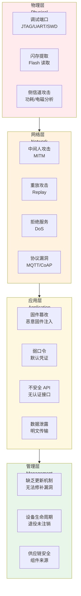
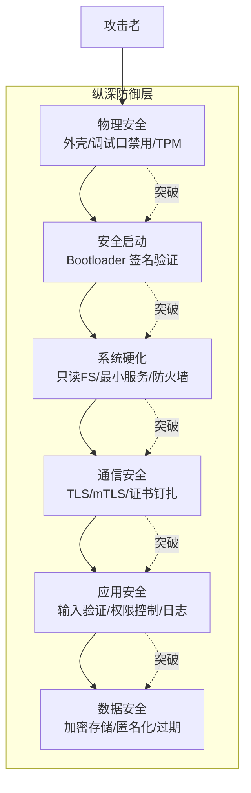
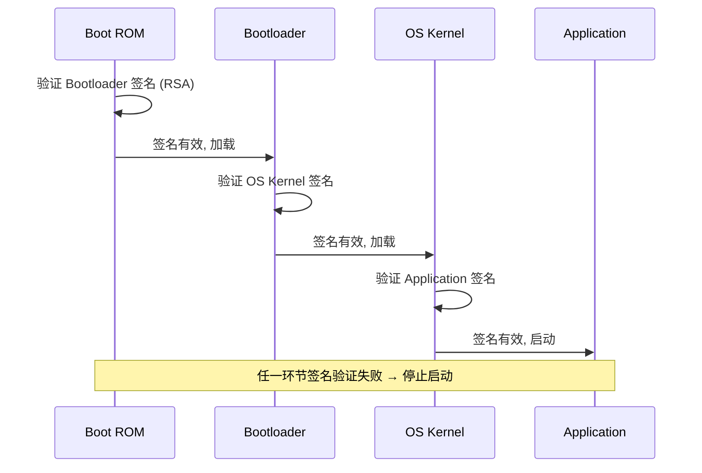

# IoT 安全威胁与防护

IoT 设备数量庞大、部署分散、资源受限，使其成为安全攻击的高价值目标。本章介绍 IoT 威胁模型、OWASP IoT Top 10、攻击面分析，以及纵深防御策略。

## IoT 安全层次模型



---

## STRIDE 威胁模型

STRIDE 是微软提出的安全威胁分类框架，对 IoT 系统建模：

| 威胁类型 | 属性 | IoT 示例 |
|----------|------|---------|
| **S**poofing（仿冒） | 身份认证 | 伪造设备身份接入 MQTT Broker |
| **T**ampering（篡改） | 完整性 | 修改固件或遥测数据 |
| **R**epudiation（抵赖） | 不可否认性 | 设备否认发送过控制指令 |
| **I**nformation Disclosure（信息泄露） | 机密性 | 侧信道获取加密密钥 |
| **D**enial of Service（拒绝服务） | 可用性 | DDoS 攻击 MQTT Broker |
| **E**levation of Privilege（提权） | 授权 | 普通设备获取管理员权限 |

### IoT 场景 STRIDE 分析

```csharp
// 威胁建模示例：温度监控系统
public class ThreatModel
{
    public record Threat(
        string Id,
        string Category,    // STRIDE
        string Description,
        string Impact,
        string Mitigation,
        string Priority     // High/Medium/Low
    );

    public static List<Threat> AnalyzeTemperatureMonitorSystem()
    {
        return new List<Threat>
        {
            new("T001", "Spoofing",
                "攻击者伪造传感器身份，发送虚假温度数据",
                "错误的温度控制决策，可能导致设备损坏",
                "mTLS 双向认证 + 设备唯一证书",
                "High"),

            new("T002", "Tampering",
                "攻击者截获并修改 MQTT 消息中的温度值",
                "控制中心收到虚假数据，告警系统失效",
                "MQTT over TLS + 消息签名",
                "High"),

            new("T003", "Repudiation",
                "设备执行了危险操作但无法追溯来源",
                "无法审计和追责",
                "操作日志 + 数字签名 + 不可变审计链",
                "Medium"),

            new("T004", "Information Disclosure",
                "未加密的 MQTT 暴露设备信息和网络拓扑",
                "攻击者获取设备列表和通信模式",
                "TLS 加密所有通信 + topic 混淆",
                "Medium"),

            new("T005", "Denial of Service",
                "大量伪造连接耗尽 MQTT Broker 资源",
                "合法设备无法上报数据，监控中断",
                "限流 + 黑名单 + DDoS 防护",
                "High"),

            new("T006", "Elevation of Privilege",
                "利用固件漏洞获取设备 root 权限",
                "完全控制设备，横向攻击其他系统",
                "安全启动 + 只读文件系统 + 最小权限",
                "High")
        };
    }
}
```

---

## OWASP IoT Top 10

OWASP（开放 Web 应用安全项目）针对 IoT 的十大风险：

### I1: 弱口令或可猜测凭证

```csharp
// .NET 密码强度验证
public class PasswordPolicy
{
    public static (bool isValid, string[] errors) Validate(string password)
    {
        var errors = new List<string>();

        if (password.Length < 12)
            errors.Add("密码长度至少 12 位");

        if (!password.Any(char.IsUpper))
            errors.Add("需包含大写字母");

        if (!password.Any(char.IsLower))
            errors.Add("需包含小写字母");

        if (!password.Any(char.IsDigit))
            errors.Add("需包含数字");

        if (!password.Any(c => "!@#$%^&*()_+-=[]{}|;':\",./<>?".Contains(c)))
            errors.Add("需包含特殊字符");

        // 检查常见弱口令
        var weakPasswords = new[] { "admin", "password", "12345678", "admin123" };
        if (weakPasswords.Any(w => password.ToLowerInvariant().Contains(w)))
            errors.Add("密码包含常见弱口令模式");

        return (errors.Count == 0, errors.ToArray());
    }

    /// <summary>
    /// 生成安全随机密码
    /// </summary>
    public static string GenerateSecure(int length = 16)
    {
        const string chars = "abcdefghijklmnopqrstuvwxyzABCDEFGHIJKLMNOPQRSTUVWXYZ0123456789!@#$%^&*";
        var random = RandomNumberGenerator.Create();
        var bytes = new byte[length];
        random.GetBytes(bytes);
        return new string(bytes.Select(b => chars[b % chars.Length]).ToArray());
    }
}
```

::: warning 默认凭证是最大风险
- Mirai 僵尸网络利用 60+ 种 IoT 设备的默认密码
- 每台设备出厂后**必须**强制修改默认密码
- 批量部署时使用每设备唯一密码（从主密钥派生）
:::

### I2: 不安全的网络服务

- 关闭不必要的端口和服务（Telnet、FTP、UPnP）
- 使用防火墙限制入站连接
- 网络分段：设备网络与管理网络隔离

### I3: 不安全的生态系统接口

```csharp
// API 安全基线
public class SecureApiController : ControllerBase
{
    // 1. 所有接口强制认证
    [Authorize]
    [HttpGet("api/devices/{id}")]
    public async Task<IActionResult> GetDevice(string id)
    {
        // 2. 检查用户是否有权访问该设备
        var userId = User.FindFirst(ClaimTypes.NameIdentifier)?.Value;
        if (!await _deviceService.HasAccessAsync(userId, id))
            return Forbid();

        // 3. 输入验证
        if (string.IsNullOrWhiteSpace(id) || id.Length > 64)
            return BadRequest("Invalid device ID");

        // 4. 速率限制（防止暴力枚举）
        // 使用 AspNetCoreRateLimit 中间件

        var device = await _deviceService.GetAsync(id);
        return Ok(device);
    }
}
```

### I4: 缺乏安全更新机制

- OTA 更新必须签名验证
- 支持 A/B 分区回滚
- 通知用户可用更新
- 不能强制更新（用户自主权）

### I5: 使用不安全组件

```xml
<!-- 定期检查依赖漏洞 -->
<!-- 使用 dotnet list package --vulnerable -->
<!-- 或 GitHub Dependabot / Snyk -->

<!-- 项目文件中固定版本号 -->
<ItemGroup>
  <PackageReference Include="MQTTnet" Version="4.3.7.120" />
  <PackageReference Include="Microsoft.Azure.Devices.Client" Version="1.42.0" />
</ItemGroup>
```

### I6: 隐私保护不足

- 最小数据收集（只采集必要数据）
- 数据匿名化/脱敏
- 本地处理优先（边缘计算）
- 数据保留策略（自动过期删除）

### I7: 不安全的数据传输

- 所有通信使用 TLS 1.2+
- MQTT over TLS (端口 8883)
- HTTPS for REST API
- 证书钉扎防 MITM

### I8: 缺乏设备管理

- 设备生命周期管理（注册→运行→退役）
- 远程配置更新
- 安全审计日志
- 设备证书轮换

### I9: 不安全的默认配置

```csharp
// 安全默认配置
public class SecureDefaults
{
    public static MqttClientOptions GetSecureMqttOptions(string host, string deviceId)
    {
        return new MqttClientOptionsBuilder()
            .WithTcpServer(host, 8883)              // TLS 端口
            .WithTls(o =>
            {
                o.UseTls = true;
                o.SslProtocol = System.Security.Authentication.SslProtocols.Tls12;
                o.CertificateValidationHandler = ValidateServerCert;
            })
            .WithCredentials(deviceId, GenerateToken())
            .WithCleanSession(false)
            .WithKeepAlivePeriod(TimeSpan.FromSeconds(30))
            .Build();
    }

    private static bool ValidateServerCert(MqttClientCertificateValidationEventArgs e)
    {
        // 证书钉扎: 只信任预定义的 CA
        var expectedThumbprint = "A1B2C3D4..."; // 预置的 CA 指纹
        return e.Certificate.Thumbprint == expectedThumbprint;
    }
}
```

### I10: 缺乏物理硬化

---

## 攻击面详解

### 物理攻击

| 攻击方式 | 目标 | 防护 |
|----------|------|------|
| JTAG/UART 调试口 | 获取 Shell / 提取固件 | 烧毁调试熔丝、禁用调试接口 |
| Flash 提取 | 离线分析固件 / 提取密钥 | Flash 加密、外部 TPM |
| 侧信道分析 | 通过功耗/电磁推算密钥 | 恒定时间算法、噪声注入 |
| 故障注入 | 电压/时钟毛刺绕过安全检查 | 电压监控、时钟冗余 |

```csharp
// 检测调试器附加
public class TamperDetection
{
    /// <summary>
    /// 检测是否被调试器附加
    /// </summary>
    public static bool IsDebuggerAttached()
    {
        return System.Diagnostics.Debugger.IsAttached;
    }

    /// <summary>
    /// 检测外壳打开（通过 GPIO 状态）
    /// </summary>
    public static bool IsCaseOpened(GpioController gpio, int tamperPin)
    {
        // 防篡改开关：外壳打开时 GPIO 状态变化
        return gpio.Read(tamperPin) == PinValue.High;
    }

    /// <summary>
    /// 安全擦除敏感数据
    /// </summary>
    public static void SecureClear(ref byte[] data)
    {
        // 多次覆写防止冷启动攻击恢复
        for (int i = 0; i < 3; i++)
        {
            for (int j = 0; j < data.Length; j++)
            {
                data[j] = 0xAA;
            }
            for (int j = 0; j < data.Length; j++)
            {
                data[j] = 0x55;
            }
        }
        Array.Clear(data, 0, data.Length);
    }
}
```

### 网络攻击

```csharp
// 防重放攻击：消息加时间戳和 nonce
public class AntiReplay
{
    private readonly HashSet<string> _usedNonces = new();
    private readonly TimeSpan _maxAge;

    public AntiReplay(TimeSpan maxAge)
    {
        _maxAge = maxAge;
    }

    public (bool isValid, string reason) ValidateMessage(
        string nonce, DateTime timestamp)
    {
        // 检查时间窗口
        if (DateTime.UtcNow - timestamp > _maxAge)
            return (false, "消息已过期");

        if (DateTime.UtcNow - timestamp < TimeSpan.Zero)
            return (false, "消息时间在未来");

        // 检查 nonce 是否重复
        lock (_usedNonces)
        {
            if (!_usedNonces.Add(nonce))
                return (false, "nonce 已使用（重放攻击）");
        }

        return (true, "验证通过");
    }

    // 定期清理过期 nonce
    public void Cleanup()
    {
        // 实际使用中用 Redis 等分布式存储
    }
}
```

---

## 纵深防御



### 安全启动（Secure Boot）



::: important 安全启动链
- ROM 中固化的公钥验证 Bootloader
- Bootloader 验证 OS 内核
- OS 内核验证应用
- 任何层级签名不匹配 → 拒绝启动 → 防止固件篡改
- 私钥只在安全环境（HSM）中使用，设备只存公钥
:::

### 硬件安全模块（TPM/SE050）

```csharp
// TPM 密钥操作概念示例
public class TpmKeyStore
{
    /// <summary>
    /// 使用 TPM 保护密钥（概念代码，实际使用 Tpm.Net 库）
    /// </summary>
    public static void StoreKeyInTpm()
    {
        // TPM 2.0 操作流程:
        // 1. 在 TPM 内部生成密钥对（私钥永不离开 TPM）
        // 2. 公钥可导出用于外部验证
        // 3. 签名/解密操作在 TPM 内执行
        // 4. 密钥绑定到 PCR（Platform Configuration Register）
        //    - 只有系统完整时密钥才可用

        Console.WriteLine("TPM 密钥存储流程:");
        Console.WriteLine("1. 生成密钥对 → 私钥留在 TPM 内部");
        Console.WriteLine("2. 导出公钥 → 用于证书签发");
        Console.WriteLine("3. 签名操作 → 数据送入 TPM, 签名返回");
        Console.WriteLine("4. PCR 绑定 → 系统被篡改时密钥不可用");
    }

    /// <summary>
    /// 基于 TPM 的设备身份证明
    /// </summary>
    public static byte[] AttestDeviceIdentity()
    {
        // TPM Attestation:
        // 1. TPM 签名的 PCR 值证明系统未被篡改
        // 2. EK (Endorsement Key) 证明设备身份
        // 3. AIK (Attestation Identity Key) 保护隐私

        Console.WriteLine("设备证明: TPM EK + PCR Quote → 云端验证");
        return Array.Empty<byte>();
    }
}
```

### 固件签名与验证

```csharp
using System.Security.Cryptography;

public class FirmwareSigner
{
    /// <summary>
    /// 对固件进行签名（构建服务器上执行）
    /// </summary>
    public static string SignFirmware(byte[] firmwareData, string privateKeyPem)
    {
        using var rsa = RSA.Create();
        rsa.ImportFromPem(privateKeyPem);

        // 先计算哈希，再签名
        using var sha256 = SHA256.Create();
        var hash = sha256.ComputeHash(firmwareData);
        var signature = rsa.SignHash(hash, HashAlgorithmName.SHA256, RSASignaturePadding.Pkcs1);

        return Convert.ToBase64String(signature);
    }

    /// <summary>
    /// 验证固件签名（设备端执行）
    /// </summary>
    public static bool VerifyFirmware(
        byte[] firmwareData, string signatureBase64, string publicKeyPem)
    {
        using var rsa = RSA.Create();
        rsa.ImportFromPem(publicKeyPem);

        var signature = Convert.FromBase64String(signatureBase64);

        using var sha256 = SHA256.Create();
        var hash = sha256.ComputeHash(firmwareData);

        return rsa.VerifyHash(hash, signature, HashAlgorithmName.SHA256, RSASignaturePadding.Pkcs1);
    }
}
```

---

## 参考链接

- [OWASP IoT Top 10](https://owasp.org/www-project-internet-of-things/)
- [STRIDE 威胁模型](https://learn.microsoft.com/azure/security/develop/threat-modeling-tool-threats)
- [NIST IoT 安全指南](https://csrc.nist.gov/publications/detail/sp/800-183/final)
- [IoT 安全基础 (ENISA)](https://www.enisa.europa.eu/publications/baseline-security-recommendations-for-iot)
- [TPM 2.0 规范](https://trustedcomputinggroup.org/resource/tpm-library-specification/)
- [NXP SE050 安全芯片](https://www.nxp.com/products/security-and-authentication/authentication/edgelock-se050-plug-and-trust-secure-element-family:SE050)
- [Tpm.Net 库](https://github.com/microsoft/TSS.MSR)

---

## 面试技巧

::: tip 面试高频问题
1. **IoT 安全和传统 Web 安全最大的区别？**
   - 物理攻击面（攻击者可接触设备）、资源受限（难以运行重型安全软件）、大量默认凭证、缺乏更新机制、生命周期长（5-15 年不更新）。面试中强调"物理攻击面"是 IoT 独有的。

2. **什么是安全启动？为什么 IoT 设备需要？**
   - 启动链每一步验证下一步的签名，任何篡改导致启动中止。防止固件植入后门/恶意代码。没有安全启动，攻击者可通过 JTAG 刷入任意固件。

3. **TPM 在 IoT 中的作用？**
   - 安全存储密钥（私钥永不离开芯片）、设备身份证明（EK/AIK）、系统完整性度量（PCR）、密封数据（绑定系统状态）。面试时强调"私钥不离开 TPM"是核心安全属性。

4. **如何防止 MQTT 重放攻击？**
   - 每条消息加时间戳 + nonce，接收端校验时间窗口和 nonce 唯一性。nonce 可用 GUID 或递增序列号。分布式环境下 nonce 需用 Redis 等共享存储去重。

5. **IoT 设备的安全开发生命周期？**
   - 威胁建模（STRIDE）→ 安全设计 → 安全编码 → 静态分析（SAST）→ 渗透测试 → 安全发布 → OTA 补丁 → 退役（证书吊销/数据擦除）。面试中强调"安全是过程，不是功能"。
:::
