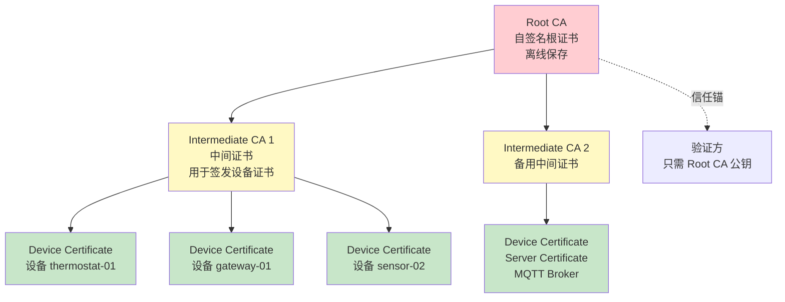
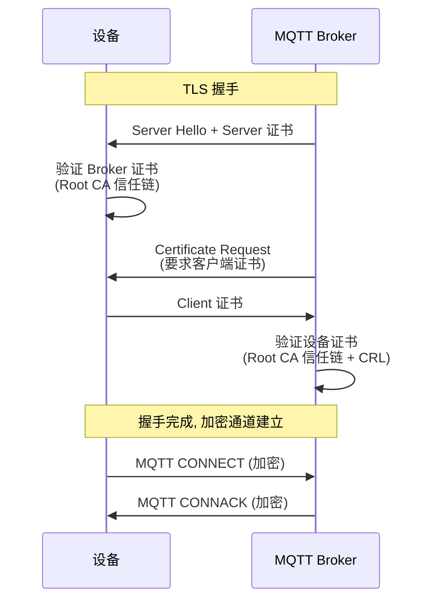

# TLS 与证书体系

TLS 是 IoT 通信安全的基石，X.509 证书是设备身份的核心载体。本章深入 TLS 协议、证书链、自签名 CA 搭建、mTLS 双向认证和 .NET TLS 编程。

## 证书链层次



::: tip 为什么需要中间 CA？
- Root CA 私钥离线保存（最大限度保护），不直接签发设备证书
- 中间 CA 可按部门/用途/地域分设，单独吊销不影响其他
- 设备证书量大，签发和吊销由中间 CA 处理，Root CA 零风险
- 验证方只需信任 Root CA，自动信任整个链
:::

---

## TLS 协议要点

### TLS 1.2 vs TLS 1.3

| 特性 | TLS 1.2 | TLS 1.3 |
|------|---------|---------|
| 握手 RTT | 2 | 1 (0-RTT 可选) |
| 密码套件 | 37 个（含不安全算法） | 5 个（全部安全） |
| 前向保密 | 可选 | 强制 |
| 已知漏洞 | BEAST/POODLE/RC4 | 无 |
| IoT 适用 | 广泛支持 | 新设备推荐 |

### IoT 适用密码套件

```
# TLS 1.2 推荐套件（优先级排序）
TLS_ECDHE_ECDSA_WITH_AES_128_GCM_SHA256     # 首选: ECC + AES-128
TLS_ECDHE_ECDSA_WITH_AES_256_GCM_SHA384     # 高安全: ECC + AES-256
TLS_ECDHE_RSA_WITH_AES_128_GCM_SHA256       # RSA 兼容
TLS_ECDHE_RSA_WITH_AES_256_GCM_SHA384

# TLS 1.3 套件（自动协商）
TLS_AES_128_GCM_SHA256                       # 首选
TLS_AES_256_GCM_SHA384
TLS_CHACHA20_POLY1305_SHA256                 # 无 AES 硬件加速时

# 避免使用
# TLS_RSA_WITH_*         — 无前向保密
# TLS_*_CBC_*            — 易受 Padding Oracle 攻击
# TLS_*_RC4_*            — RC4 已不安全
# TLS_*_3DES_*           — 性能差且不安全
```

::: important ECC vs RSA for IoT
- ECC (ECDSA/ECDHE) 密钥更短（256 bit ≈ RSA 3072 bit）、计算更快、带宽更省
- 适合资源受限的 IoT 设备
- 推荐曲线: `prime256v1` (P-256) / `secp384r1` (P-384)
:::

---

## 自签名 CA 搭建

### 创建 Root CA

```bash
# 1. 生成 Root CA 私钥
openssl genpkey -algorithm EC -pkeyopt ec_paramgen_curve:P-256 \
  -out ca-private.key

# 2. 生成 Root CA 证书
openssl req -new -x509 -key ca-private.key \
  -days 3650 \
  -subj "/C=CN/O=MyIoT/CN=MyIoT Root CA" \
  -sha256 \
  -out ca-cert.pem

# 3. 验证
openssl x509 -in ca-cert.pem -text -noout | head -20
```

### 创建中间 CA

```bash
# 1. 生成中间 CA 私钥
openssl genpkey -algorithm EC -pkeyopt ec_paramgen_curve:P-256 \
  -out intermediate-private.key

# 2. 生成中间 CA CSR
openssl req -new -key intermediate-private.key \
  -subj "/C=CN/O=MyIoT/CN=MyIoT Intermediate CA 01" \
  -out intermediate.csr

# 3. 用 Root CA 签发中间 CA 证书
openssl x509 -req -in intermediate.csr \
  -CA ca-cert.pem -CAkey ca-private.key \
  -CAcreateserial \
  -days 1825 \
  -sha256 \
  -extfile <(cat <<EOF
basicConstraints = critical, CA:TRUE, pathlen:0
keyUsage = critical, digitalSignature, keyCertSign, cRLSign
subjectKeyIdentifier = hash
authorityKeyIdentifier = keyid:always
EOF
  ) \
  -out intermediate-cert.pem

# 4. 创建证书链
cat intermediate-cert.pem ca-cert.pem > full-chain.pem
```

### 签发设备证书

```bash
# 1. 生成设备私钥
openssl genpkey -algorithm EC -pkeyopt ec_paramgen_curve:P-256 \
  -out device-thermostat-01.key

# 2. 生成设备 CSR
openssl req -new -key device-thermostat-01.key \
  -subj "/C=CN/O=MyIoT/CN=thermostat-01" \
  -out device-thermostat-01.csr

# 3. 用中间 CA 签发设备证书
openssl x509 -req -in device-thermostat-01.csr \
  -CA intermediate-cert.pem -CAkey intermediate-private.key \
  -CAcreateserial \
  -days 365 \
  -sha256 \
  -extfile <(cat <<EOF
basicConstraints = CA:FALSE
keyUsage = critical, digitalSignature, keyEncipherment
extendedKeyUsage = clientAuth, serverAuth
subjectKeyIdentifier = hash
authorityKeyIdentifier = keyid:always
subjectAltName = DNS:thermostat-01.iot.local, IP:192.168.1.100
EOF
  ) \
  -out device-thermostat-01.crt

# 4. 创建设备完整证书链
cat device-thermostat-01.crt intermediate-cert.pem ca-cert.pem \
  > device-thermostat-01-full-chain.pem
```

::: warning 私钥保护
- Root CA 私钥必须离线保存（加密 U 盘 / HSM）
- 中间 CA 私钥存于签发服务器，限制访问权限
- 设备私钥存于设备安全存储（TPM / 加密分区），明文私钥不应出现在日志或配置中
:::

---

## mTLS 双向认证

mTLS（Mutual TLS）要求客户端和服务器互相验证证书，是 IoT 设备认证的标准方案：



### .NET mTLS 客户端

```csharp
using System.Net.Security;
using System.Security.Authentication;
using System.Security.Cryptography.X509Certificates;
using MQTTnet;
using MQTTnet.Client;
using MQTTnet.Ssl;

public class MqttMtlsClient
{
    public static async Task ConnectWithMtlsAsync()
    {
        var factory = new MqttFactory();
        using var client = factory.CreateMqttClient();

        // 加载证书
        var caCert = new X509Certificate2("ca-cert.pem");
        var deviceCert = new X509Certificate2(
            "device-thermostat-01-full-chain.pem",
            (string?)null, // 无密码
            X509KeyStorageFlags.MachineKeySet);

        var options = new MqttClientOptionsBuilder()
            .WithTcpServer("mqtt.iot.local", 8883)
            .WithTls(o =>
            {
                o.UseTls = true;
                o.SslProtocol = SslProtocols.Tls12 | SslProtocols.Tls13;
                o.Certificates = new List<X509Certificate>
                {
                    deviceCert
                };

                // 自定义证书验证
                o.CertificateValidationHandler = CustomCertValidation;
            })
            .WithClientId("thermostat-01")
            .WithCleanSession(false)
            .Build();

        await client.ConnectAsync(options);
        Console.WriteLine("mTLS 连接成功!");
    }

    /// <summary>
    /// 自定义证书验证回调
    /// </summary>
    private static bool CustomCertValidation(MqttClientCertificateValidationEventArgs e)
    {
        var chain = e.Chain;
        var errors = e.SslPolicyErrors;

        // 加载受信 Root CA
        var caCert = new X509Certificate2("ca-cert.pem");

        if (errors == SslPolicyErrors.None)
            return true;

        // 处理 RemoteCertificateChainErrors
        if (errors.HasFlag(SslPolicyErrors.RemoteCertificateChainErrors))
        {
            // 检查服务器证书是否由我们的 CA 签发
            var serverCert = new X509Certificate2(e.Certificate);
            using var verifier = new X509Chain();

            // 添加受信 CA
            verifier.ChainPolicy.ExtraStore.Add(caCert);
            verifier.ChainPolicy.RevocationMode = X509RevocationMode.NoCheck;
            verifier.ChainPolicy.VerificationFlags =
                X509VerificationFlags.AllowUnknownCertificateAuthority;

            var isValid = verifier.Build(serverCert);

            if (isValid)
            {
                // 额外验证: 证书指纹/主题匹配
                Console.WriteLine($"服务器证书验证通过: {serverCert.Subject}");
                return true;
            }

            Console.WriteLine($"证书链验证失败");
            foreach (var status in verifier.ChainStatus)
            {
                Console.WriteLine($"  {status.Status}: {status.StatusInformation}");
            }
        }

        return false;
    }
}
```

### .NET SslStream 服务端

```csharp
using System.Net;
using System.Net.Security;
using System.Net.Sockets;
using System.Security.Authentication;
using System.Security.Cryptography.X509Certificates;

public class MqttMtlsServer
{
    public static async Task StartAsync()
    {
        var listener = new TcpListener(IPAddress.Any, 8883);
        listener.Start();
        Console.WriteLine("mTLS 服务端监听 8883...");

        // 加载服务器证书和 CA
        var serverCert = new X509Certificate2(
            "server-full-chain.pem",
            (string?)null,
            X509KeyStorageFlags.MachineKeySet);

        var caCert = new X509Certificate2("ca-cert.pem");

        while (true)
        {
            var tcpClient = await listener.AcceptTcpClientAsync();
            _ = HandleClientAsync(tcpClient, serverCert, caCert);
        }
    }

    private static async Task HandleClientAsync(
        TcpClient tcpClient, X509Certificate2 serverCert, X509Certificate2 caCert)
    {
        try
        {
            using var sslStream = new SslStream(
                tcpClient.GetStream(), false);

            // 配置 mTLS: 要求客户端证书
            var options = new SslServerAuthenticationOptions
            {
                ServerCertificate = serverCert,
                ClientCertificateRequired = true,  // 要求客户端证书
                EnabledSslProtocols = SslProtocols.Tls12 | SslProtocols.Tls13,
                CertificateRevocationCheckMode = X509RevocationMode.NoCheck,
                // 客户端证书验证回调
                RemoteCertificateValidationCallback = (sender, cert, chain, errors) =>
                {
                    if (cert == null) return false;

                    using var verifier = new X509Chain();
                    verifier.ChainPolicy.ExtraStore.Add(caCert);
                    verifier.ChainPolicy.RevocationMode = X509RevocationMode.NoCheck;
                    verifier.ChainPolicy.VerificationFlags =
                        X509VerificationFlags.AllowUnknownCertificateAuthority;

                    var clientCert = new X509Certificate2(cert);
                    var isValid = verifier.Build(clientCert);

                    if (isValid)
                    {
                        Console.WriteLine($"客户端认证通过: {clientCert.Subject}");
                        return true;
                    }

                    Console.WriteLine($"客户端证书无效: {clientCert.Subject}");
                    return false;
                }
            };

            await sslStream.AuthenticateAsServerAsync(options);

            Console.WriteLine($"mTLS 握手完成: {sslStream.RemoteCertificate?.Subject}");
        }
        catch (Exception ex)
        {
            Console.WriteLine($"客户端处理异常: {ex.Message}");
        }
        finally
        {
            tcpClient.Close();
        }
    }
}
```

---

## Let's Encrypt（IoT 网关）

Let's Encrypt 提供免费的自动签发证书，适合有域名的 IoT 网关：

```bash
# 安装 certbot
sudo apt install certbot

# 获取证书（standalone 模式）
sudo certbot certonly --standalone \
  -d gateway.myiot.com \
  --agree-tos \
  --email admin@myiot.com

# 证书文件位置
# /etc/letsencrypt/live/gateway.myiot.com/fullchain.pem
# /etc/letsencrypt/live/gateway.myiot.com/privkey.pem

# 自动续期（crontab）
0 0 1 * * certbot renew --quiet --deploy-hook "systemctl restart mqtt-broker"
```

::: tip Let's Encrypt 限制
- 证书有效期 90 天（需自动续期）
- 每周最多签发 50 张证书/域名
- 只能签发公网可验证的域名证书
- 不适合内网设备（内网用自签名 CA）
- IoT 网关（有公网域名）用 Let's Encrypt，内网设备用自签名 CA
:::

---

## 证书轮换与续期

```csharp
public class CertificateRotation
{
    private readonly string _certPath;
    private readonly string _keyPath;
    private X509Certificate2? _currentCert;
    private DateTime _certExpiry;

    public CertificateRotation(string certPath, string keyPath)
    {
        _certPath = certPath;
        _keyPath = keyPath;
    }

    public async Task MonitorAndRotateAsync(CancellationToken ct)
    {
        while (!ct.IsCancellationRequested)
        {
            await LoadCertificateAsync();

            // 证书过期前 30 天触发轮换
            var daysUntilExpiry = (_certExpiry - DateTime.UtcNow).TotalDays;

            if (daysUntilExpiry < 30)
            {
                Console.WriteLine($"证书将在 {daysUntilExpiry:F0} 天后过期, 开始轮换");
                await RequestNewCertificateAsync();
                await ReloadCertificateAsync();
            }

            // 每小时检查一次
            await Task.Delay(TimeSpan.FromHours(1), ct);
        }
    }

    private async Task LoadCertificateAsync()
    {
        _currentCert = new X509Certificate2(_certPath);
        _certExpiry = _currentCert.NotAfter;
        Console.WriteLine($"当前证书过期时间: {_certExpiry:yyyy-MM-dd}");
    }

    private async Task RequestNewCertificateAsync()
    {
        // 向内部 CA 或 Let's Encrypt 申请新证书
        // 1. 生成新 CSR
        using var rsa = RSA.Create(2048);
        var csr = new CertificateRequest(
            "CN=thermostat-01,O=MyIoT,C=CN", rsa, HashAlgorithmName.SHA256, RSASignaturePadding.Pkcs1);

        // 2. 提交 CSR 到 CA
        // var newCert = await SubmitCsrToCaAsync(csr);

        // 3. 替换证书文件
        Console.WriteLine("新证书已获取并保存");
    }

    private async Task ReloadCertificateAsync()
    {
        // 重新加载证书，无需重启服务
        await LoadCertificateAsync();
        // 通知 MQTT 客户端重新连接
        Console.WriteLine("证书已重载");
    }
}
```

---

## 证书钉扎（Certificate Pinning）

```csharp
public class CertificatePinning
{
    private readonly HashSet<string> _pinnedThumbprints;

    public CertificatePinning(IEnumerable<string> trustedThumbprints)
    {
        _pinnedThumbprints = new HashSet<string>(trustedThumbprints,
            StringComparer.OrdinalIgnoreCase);
    }

    /// <summary>
    /// 验证服务器证书指纹是否在白名单中
    /// </summary>
    public bool ValidatePin(X509Certificate2 certificate)
    {
        var thumbprint = certificate.Thumbprint;

        if (_pinnedThumbprints.Contains(thumbprint))
        {
            Console.WriteLine($"证书钉扎验证通过: {thumbprint}");
            return true;
        }

        Console.WriteLine($"证书钉扎验证失败: {thumbprint}");
        Console.WriteLine($"期望: {string.Join(", ", _pinnedThumbprints)}");
        return false;
    }

    /// <summary>
    /// 获取证书指纹（用于配置白名单）
    /// </summary>
    public static string GetThumbprint(string certPath)
    {
        using var cert = new X509Certificate2(certPath);
        return cert.Thumbprint;
    }
}

// 使用
var pinner = new CertificatePinning(new[]
{
    "A1B2C3D4E5F6...",  // 生产服务器证书指纹
    "1A2B3C4D5E6F..."   // 备用证书指纹
});
```

::: warning 证书钉扎注意事项
- 钉扎指纹时需配置备用证书指纹，否则证书轮换后客户端无法连接
- 可钉扎 CA 证书而非叶子证书，减少轮换时更新频率
- 移动端/IoT 客户端硬编码指纹后，更新指纹需要发版
- 建议钉扎中间 CA 指纹而非设备证书指纹
:::

---

## MQTT over TLS (8883)

```bash
# EMQX 配置 MQTT over TLS
# emqx.conf
listeners.ssl.default {
  bind = 8883
  ssl_options {
    cacertfile = "/etc/emqx/certs/ca.crt"
    certfile = "/etc/emqx/certs/server.crt"
    keyfile = "/etc/emqx/certs/server.key"
    verify = verify_peer
    fail_if_no_peer_cert = true  # 强制 mTLS
    versions = ["tlsv1.3", "tlsv1.2"]
    ciphers = [
      "TLS_AES_128_GCM_SHA256",
      "TLS_AES_256_GCM_SHA384",
      "ECDHE-ECDSA-AES128-GCM-SHA256",
      "ECDHE-ECDSA-AES256-GCM-SHA384"
    ]
  }
}
```

---

## 常见 TLS 错误排查

| 错误 | 原因 | 解决 |
|------|------|------|
| `RemoteCertificateNameMismatch` | 证书 CN/SAN 与连接域名不匹配 | 修正 SAN 或使用正确域名 |
| `RemoteCertificateChainErrors` | 证书链不完整或 CA 不受信 | 提供完整证书链 + Root CA |
| `RemoteCertificateNotAvailable` | 服务器未返回证书 | 检查服务器 TLS 配置 |
| `AuthenticationException` | 协议版本不匹配 | 确保两端支持相同 TLS 版本 |
| `HandshakeFailure` | 密码套件不匹配 | 检查客户端/服务器支持的套件 |

```bash
# 调试 TLS 连接
openssl s_client -connect mqtt.iot.local:8883 \
  -CAfile ca-cert.pem \
  -cert device-thermostat-01.crt \
  -key device-thermostat-01.key \
  -servername mqtt.iot.local

# 检查证书链
openssl verify -CAfile ca-cert.pem -untrusted intermediate-cert.pem device-thermostat-01.crt

# 检查证书详情
openssl x509 -in device-thermostat-01.crt -text -noout

# 检查证书过期
openssl x509 -in device-thermostat-01.crt -checkend 2592000  # 30天内过期?
```

---

## 参考链接

- [TLS 1.3 RFC 8446](https://datatracker.ietf.org/doc/html/rfc8446)
- [X.509 证书 RFC 5280](https://datatracker.ietf.org/doc/html/rfc5280)
- [Let's Encrypt 文档](https://letsencrypt.org/docs/)
- [OpenSSL 官方文档](https://www.openssl.org/docs/)
- [.NET SslStream 文档](https://learn.microsoft.com/dotnet/api/system.net.security.sslstream)
- [.NET 证书验证](https://learn.microsoft.com/dotnet/api/system.security.cryptography.x509certificates)
- [EMQX TLS 配置](https://docs.emqx.com/zh/emqx/latest/listener/tls-ssl.html)
- [MQTT Security MQTT over TLS](https://mqtt.org/security/)

---

## 面试技巧

::: tip 面试高频问题
1. **TLS 1.2 和 1.3 的主要区别？IoT 选哪个？**
   - TLS 1.3 握手只需 1 RTT（1.2 需 2），去除了不安全密码套件，强制前向保密。IoT 设备如支持 TLS 1.3 则优先使用（更快更安全），不支持则 TLS 1.2 + ECDHE + AES-128-GCM。

2. **mTLS 和普通 TLS 的区别？为什么 IoT 需要 mTLS？**
   - 普通 TLS 只验证服务器身份；mTLS 双向验证，客户端也要出示证书。IoT 需要mTLS 因为：设备身份需要强认证（密码易泄露）、无需存储密码、证书可吊销、支持细粒度授权。

3. **自签名 CA 和公共 CA 的区别？什么时候用自签名？**
   - 公共 CA（Let's Encrypt/DigiCert）证书被操作系统/浏览器自动信任，但只能签发公网域名证书；自签名 CA 可签发内网/IP/设备证书，但需在所有信任方手动安装 Root CA。IoT 内网场景用自签名 CA，公网网关用 Let's Encrypt。

4. **证书轮换如何实现零停机？**
   - 新旧证书并存期（grace period）：签发新证书后，客户端和服务器同时信任新旧证书；旧证书过期前完成所有客户端更新；使用短-lived 证书（90天）+ 自动轮换而非长证书手动替换。

5. **证书钉扎的优缺点？**
   - 优点：防 MITM（即使 CA 被入侵也无法伪造）；缺点：证书轮换时需更新客户端代码，可能导致大规模连接中断。折中方案：钉扎中间 CA 而非叶子证书，或设置 fallback 机制。
:::
