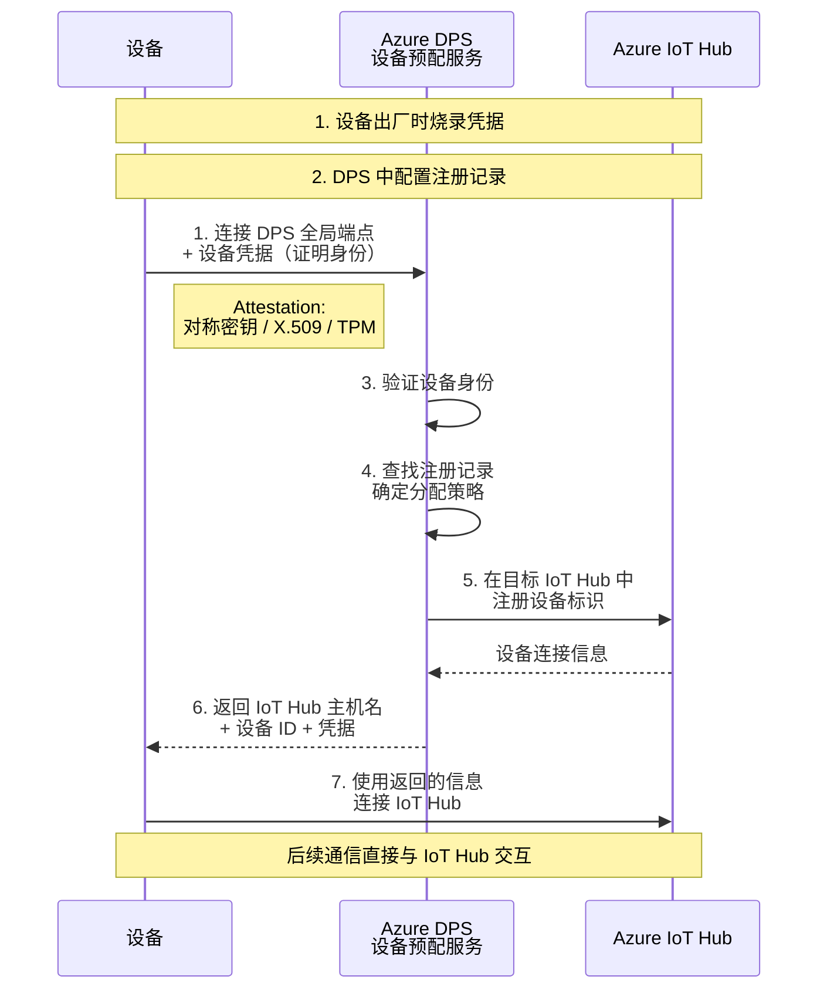
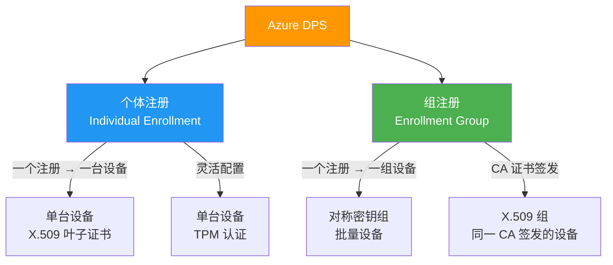
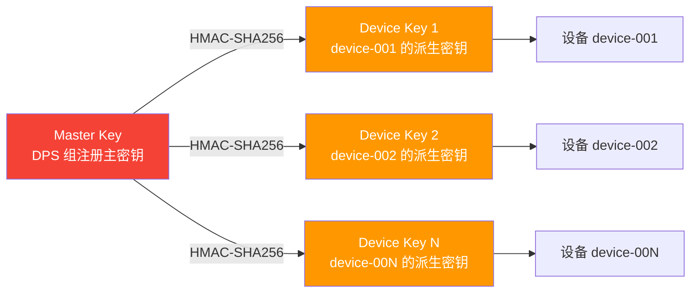
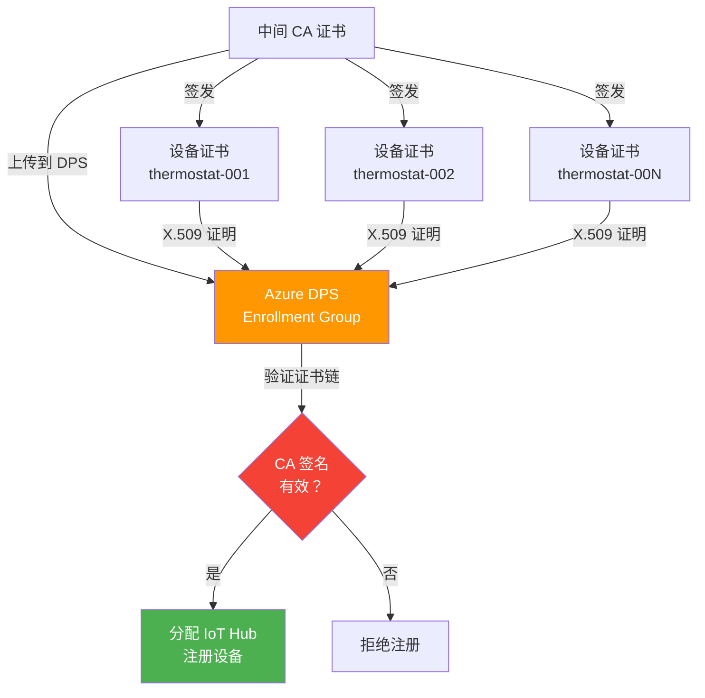

# 设备配置服务 DPS

当 IoT 设备从几十台增长到数千台时，手动注册每台设备变得不可持续。Azure Device Provisioning Service（DPS）提供自动化、安全的规模化设备预配能力——设备出厂后首次通电即可自动完成身份认证和 IoT Hub 分配。

## 1. DPS 核心概念

### 1.1 DPS 工作流



::: tip DPS 的核心价值
- **零接触部署**：设备出厂后无需人工配置，首次上电自动注册
- **统一入口**：所有设备先连 DPS，再由 DPS 分配到不同 IoT Hub
- **灵活分配**：基于注册策略（静态/加权/自定义）决定设备归属
- **安全证明**：三种证明方式，从低成本到高安全递进
:::

### 1.2 三种证明方式

| 证明方式 | 安全等级 | 复杂度 | 成本 | 适用场景 |
|----------|----------|--------|------|----------|
| 对称密钥（Symmetric Key） | 中 | 低 | 低 | 开发测试、低成本设备 |
| X.509 证书 | 高 | 中 | 中 | 生产环境、规模化部署 |
| TPM | 最高 | 高 | 高 | 高安全要求、防物理攻击 |

## 2. 注册方式

### 2.1 个体注册 vs 组注册



| 特性 | 个体注册 | 组注册 |
|------|----------|--------|
| 粒度 | 单台设备 | 一组设备 |
| 证明方式 | 全部支持 | 对称密钥、X.509 |
| 设备配置 | 每台可不同 | 组内共享 |
| 适用规模 | 少量设备 | 大规模部署 |
| 管理开销 | 高（逐台注册） | 低（一次注册） |

### 2.2 分配策略

| 策略 | 说明 | 示例 |
|------|------|------|
| 静态分配（Static） | 注册时指定目标 IoT Hub | 所有生产线 A 的设备 → Hub-A |
| 加权分配（Weighted） | 按权重随机分配到多个 Hub | Hub-A: 70%, Hub-B: 30% |
| 延迟分配（Latency） | 分配到延迟最低的 Hub | 就近区域分配 |
| 自定义分配（Custom） | Azure Function 自定义逻辑 | 根据设备型号/区域决定 Hub |

## 3. 对称密钥组注册

### 3.1 密钥派生机制



::: important 为什么不直接使用 Master Key？
每个设备使用从 Master Key 派生的唯一密钥，而非直接使用 Master Key。原因：1) Master Key 泄露不等于所有设备密钥泄露；2) 单个设备密钥泄露可吊销该设备，不影响其他；3) 每台设备的密钥唯一，可追溯。
:::

### 3.2 派生密钥计算

```csharp
using System.Security.Cryptography;
using System.Text;

public class SymmetricKeyDerivation
{
    /// <summary>
    /// 从 DPS 组注册的 Master Key 派生设备密钥
    /// 算法: HMAC-SHA256(masterKey, deviceId)
    /// </summary>
    public static string DeriveDeviceKey(string masterKey, string deviceId)
    {
        // Master Key 是 Base64 编码的
        byte[] masterKeyBytes = Convert.FromBase64String(masterKey);
        byte[] deviceIdBytes = Encoding.UTF8.GetBytes(deviceId);

        using var hmac = new HMACSHA256(masterKeyBytes);
        byte[] derivedKey = hmac.ComputeHash(deviceIdBytes);

        return Convert.ToBase64String(derivedKey);
    }

    /// <summary>
    /// 生成 SAS Token 用于设备认证
    /// </summary>
    public static string GenerateSasToken(
        string resourceUri,
        string deviceKey,
        int ttlMinutes = 60)
    {
        DateTime expires = DateTime.UtcNow.AddMinutes(ttlMinutes);
        long expiresEpoch = new DateTimeOffset(expires).ToUnixTimeSeconds();

        string scope = $"{resourceUri}\n{expiresEpoch}";
        byte[] keyBytes = Convert.FromBase64String(deviceKey);

        using var hmac = new HMACSHA256(keyBytes);
        byte[] signature = hmac.ComputeHash(Encoding.UTF8.GetBytes(scope));

        string signedEncoded = Uri.EscapeDataString(Convert.ToBase64String(signature));
        return $"SharedAccessSignature sr={resourceUri}&sig={signedEncoded}&se={expiresEpoch}";
    }
}

// 使用示例
string masterKey = "your-dps-group-master-key-base64";
string deviceId = "device-001";

string deviceKey = SymmetricKeyDerivation.DeriveDeviceKey(masterKey, deviceId);
Console.WriteLine($"设备 {deviceId} 派生密钥: {deviceKey}");
```

### 3.3 .NET DPS 对称密钥预配

```csharp
using Microsoft.Azure.Devices.Provisioning.Client;
using Microsoft.Azure.Devices.Provisioning.Client.Transport;
using Microsoft.Azure.Devices.Shared;
using System.Security.Cryptography;
using System.Text;

class SymmetricKeyProvisioning
{
    // DPS 全局端点
    private const string GlobalEndpoint = "global.azure-devices-provisioning.net";
    // DPS ID Scope（在 DPS 概览页获取）
    private const string IdScope = "0ne00XXXXXX";
    // 组注册 Master Key
    private const string MasterKey = "your-master-key-base64";

    static async Task Main(string[] args)
    {
        string deviceId = $"device-{Environment.MachineName}";

        // 1. 派生设备密钥
        string deviceKey = SymmetricKeyDerivation.DeriveDeviceKey(MasterKey, deviceId);
        Console.WriteLine($"设备 ID: {deviceId}");
        Console.WriteLine($"派生密钥: {deviceKey}");

        // 2. 创建 DPS 客户端
        using var transport = new ProvisioningTransportHandlerAmqp();
        var security = new SecurityProviderSymmetricKey(deviceId, deviceKey, MasterKey);

        var provClient = ProvisioningDeviceClient.Create(
            GlobalEndpoint,
            IdScope,
            security,
            transport);

        // 3. 注册设备
        Console.WriteLine("正在向 DPS 注册设备...");
        DeviceRegistrationResult result = await provClient.RegisterAsync();

        if (result.Status == ProvisioningRegistrationStatusType.Assigned)
        {
            Console.WriteLine($"注册成功!");
            Console.WriteLine($"  IoT Hub: {result.AssignedHub}");
            Console.WriteLine($"  Device ID: {result.DeviceId}");

            // 4. 使用返回的信息连接 IoT Hub
            await ConnectToIoTHubAsync(result.AssignedHub, deviceId, deviceKey);
        }
        else
        {
            Console.WriteLine($"注册失败: {result.Status}");
            Console.WriteLine($"  错误消息: {result.ErrorMessage}");
        }
    }

    /// <summary>
    /// 使用预配结果连接 IoT Hub
    /// </summary>
    private static async Task ConnectToIoTHubAsync(
        string assignedHub, string deviceId, string deviceKey)
    {
        var authMethod = new DeviceAuthenticationWithRegistrySymmetricKey(
            deviceId, deviceKey);

        var client = Microsoft.Azure.Devices.Client.DeviceClient.Create(
            assignedHub, authMethod,
            Microsoft.Azure.Devices.Client.TransportType.Mqtt);

        await client.OpenAsync();
        Console.WriteLine($"已连接到 IoT Hub: {assignedHub}");

        // 发送遥测
        var telemetry = new
        {
            deviceId,
            temperature = 20 + Random.Shared.NextDouble() * 15,
            timestamp = DateTime.UtcNow
        };

        var message = new Microsoft.Azure.Devices.Client.Message(
            Encoding.UTF8.GetBytes(System.Text.Json.JsonSerializer.Serialize(telemetry)));
        await client.SendEventAsync(message);
        Console.WriteLine("遥测已发送");
    }
}
```

## 4. X.509 证书组注册

### 4.1 注册流程



### 4.2 .NET X.509 预配

```csharp
using Microsoft.Azure.Devices.Provisioning.Client;
using Microsoft.Azure.Devices.Provisioning.Client.Transport;
using System.Security.Cryptography.X509Certificates;

class X509Provisioning
{
    private const string GlobalEndpoint = "global.azure-devices-provisioning.net";
    private const string IdScope = "0ne00XXXXXX";

    static async Task Main(string[] args)
    {
        // 1. 加载设备证书（含私钥的 PFX 文件）
        string certPath = "device-thermostat-001.pfx";
        string certPassword = "device-cert-password";

        using var certificate = new X509Certificate2(
            certPath, certPassword,
            X509KeyStorageFlags.EphemeralKeySet);

        Console.WriteLine($"设备证书: {certificate.Subject}");
        Console.WriteLine($"指纹: {certificate.Thumbprint}");

        // 2. 创建 X.509 安全提供者
        using var security = new SecurityProviderX509Certificate(certificate);

        // 3. 创建 DPS 客户端
        using var transport = new ProvisioningTransportHandlerAmqp();
        var provClient = ProvisioningDeviceClient.Create(
            GlobalEndpoint,
            IdScope,
            security,
            transport);

        // 4. 注册设备
        Console.WriteLine("正在通过 X.509 证书向 DPS 注册...");
        DeviceRegistrationResult result = await provClient.RegisterAsync();

        if (result.Status == ProvisioningRegistrationStatusType.Assigned)
        {
            Console.WriteLine($"X.509 预配成功!");
            Console.WriteLine($"  IoT Hub: {result.AssignedHub}");
            Console.WriteLine($"  Device ID: {result.DeviceId}");

            // 5. 连接 IoT Hub
            using var hubClient = Microsoft.Azure.Devices.Client.DeviceClient.Create(
                result.AssignedHub,
                new Microsoft.Azure.Devices.Client.DeviceAuthenticationWithX509Certificate(
                    result.DeviceId, certificate),
                Microsoft.Azure.Devices.Client.TransportType.Mqtt);

            await hubClient.OpenAsync();
            Console.WriteLine("X.509 设备已连接到 IoT Hub");
        }
        else
        {
            Console.WriteLine($"X.509 预配失败: {result.Status}");
            Console.WriteLine($"  错误: {result.ErrorMessage}");
        }
    }
}
```

::: important X.509 组注册最佳实践
1. **上传中间 CA 到 DPS**（而非 Root CA），降低 Root CA 暴露风险
2. **中间 CA 证书需要所有权证明**：DPS 要求验证你确实持有该 CA 的私钥（签发一个验证证书）
3. **设备证书 CN 通常作为 Device ID**
4. **生产环境启用 CRL/OCSP 检查**，及时吊销被盗设备
:::

## 5. 零接触规模化预配

### 5.1 批量预配 1000 台设备

```csharp
using Microsoft.Azure.Devices.Provisioning.Service;
using System.Security.Cryptography;
using System.Text;

class BulkProvisioning
{
    private const string DpsConnectionString = "HostName=my-dps.azure-devices-provisioning.net;SharedAccessKeyName=provisioningserviceowner;SharedAccessKey=...";
    private const string MasterKey = "your-group-master-key-base64";
    private const string IdScope = "0ne00XXXXXX";
    private const string GlobalEndpoint = "global.azure-devices-provisioning.net";

    /// <summary>
    /// 批量生成设备预配信息
    /// </summary>
    static async Task BulkProvisionAsync(int deviceCount)
    {
        using var dpsClient = ProvisioningServiceClient.CreateFromConnectionString(DpsConnectionString);

        Console.WriteLine($"开始批量预配 {deviceCount} 台设备...");

        // 获取或创建组注册
        string enrollmentGroupId = "factory-line-a-devices";
        EnrollmentGroup enrollmentGroup;

        try
        {
            enrollmentGroup = await dpsClient.GetEnrollmentGroupAsync(enrollmentGroupId);
            Console.WriteLine($"已有组注册: {enrollmentGroupId}");
        }
        catch
        {
            // 创建新的对称密钥组注册
            enrollmentGroup = new EnrollmentGroup(enrollmentGroupId,
                new SymmetricKeyAttestation(MasterKey, null))
            {
                ProvisioningStatus = ProvisioningStatus.Enabled,
                // 静态分配到指定 IoT Hub
                AllocationPolicy = AllocationPolicy.Static,
                IotHubs = new List<string>
                {
                    "my-hub.azure-devices.net"
                },
                // 设备初始 Twin
                InitialTwinState = new TwinState(
                    new TwinCollection("{\"location\":\"factory-a\",\"line\":\"line-1\"}"),
                    null)
            };

            enrollmentGroup = await dpsClient.CreateOrUpdateEnrollmentGroupAsync(enrollmentGroup);
            Console.WriteLine($"已创建组注册: {enrollmentGroupId}");
        }

        // 生成设备预配信息
        var deviceProvisioningInfos = new List<DeviceProvisioningInfo>();

        for (int i = 1; i <= deviceCount; i++)
        {
            string deviceId = $"line-a-device-{i:D4}";
            string deviceKey = SymmetricKeyDerivation.DeriveDeviceKey(MasterKey, deviceId);

            deviceProvisioningInfos.Add(new DeviceProvisioningInfo
            {
                DeviceId = deviceId,
                DeviceKey = deviceKey,
                IdScope = IdScope,
                GlobalEndpoint = GlobalEndpoint
            });
        }

        // 输出预配信息（实际项目中写入设备安全存储或打印标签）
        foreach (var info in deviceProvisioningInfos)
        {
            Console.WriteLine($"设备: {info.DeviceId}, 密钥: {info.DeviceKey[..16]}...");
        }

        Console.WriteLine($"已生成 {deviceCount} 台设备的预配信息");
        Console.WriteLine("设备首次上电时将自动通过 DPS 完成注册和分配");
    }
}

public record DeviceProvisioningInfo
{
    public required string DeviceId { get; init; }
    public required string DeviceKey { get; init; }
    public required string IdScope { get; init; }
    public required string GlobalEndpoint { get; init; }
}
```

### 5.2 自定义分配策略

```csharp
// Azure Function - 自定义分配策略
// 当 DPS 收到设备注册请求时调用此函数

public static class CustomAllocationFunction
{
    [FunctionName("DpsCustomAllocation")]
    public static async Task<HttpResponseData> Run(
        [HttpTrigger(AuthorizationLevel.Function, "post")] HttpRequestData req,
        FunctionContext context)
    {
        var logger = context.GetLogger("DpsCustomAllocation");

        // 解析 DPS 请求
        string requestBody = await new StreamReader(req.Body).ReadToEndAsync();
        var dpsRequest = System.Text.Json.JsonSerializer.Deserialize<DpsAllocationRequest>(requestBody);

        logger.LogInformation($"DPS 自定义分配: 设备={dpsRequest?.DeviceRuntimeContext?.RegistrationId}");

        // 根据设备信息决定分配目标
        string targetHub = dpsRequest?.DeviceRuntimeContext?.RegistrationId switch
        {
            var id when id.StartsWith("line-a") => "my-hub-a.azure-devices.net",
            var id when id.StartsWith("line-b") => "my-hub-b.azure-devices.net",
            _ => "my-hub-default.azure-devices.net" // 默认 Hub
        };

        // 构造响应
        var response = req.CreateResponse(System.Net.HttpStatusCode.OK);
        response.Headers.Add("Content-Type", "application/json");

        var allocationResult = new
        {
            iotHubHostName = targetHub,
            initialTwin = new
            {
                properties = new
                {
                    desired = new Dictionary<string, object>
                    {
                        ["allocatedBy"] = "custom-policy",
                        ["allocatedAt"] = DateTime.UtcNow.ToString("O"),
                        ["targetHub"] = targetHub
                    }
                }
            }
        };

        await response.WriteStringAsync(
            System.Text.Json.JsonSerializer.Serialize(allocationResult));

        return response;
    }
}

// DPS 请求模型
public record DpsAllocationRequest(
    DpsDeviceRuntimeContext DeviceRuntimeContext,
    string? LinkedHub,
    string? EnrollmentGroupId);

public record DpsDeviceRuntimeContext(
    string RegistrationId,
    string? TpmEndorsementKey,
    Dictionary<string, string>? Payload);
```

::: warning 自定义分配策略注意事项
- Azure Function 响应时间必须 < 5 秒，否则 DPS 超时
- Function 必须返回 `iotHubHostName`（目标 IoT Hub 主机名）
- 可返回 `initialTwin` 设置设备初始状态
- DPS 需配置 Function 的 HTTP 触发 URL 和访问密钥
:::

## 6. .NET SDK 安装

```bash
# DPS 设备端 SDK
dotnet add package Microsoft.Azure.Devices.Provisioning.Client
dotnet add package Microsoft.Azure.Devices.Provisioning.Transport.Amqp
dotnet add package Microsoft.Azure.Devices.Provisioning.Transport.Mqtt

# DPS 服务端 SDK（管理注册记录）
dotnet add package Microsoft.Azure.Devices.Provisioning.Service

# IoT Hub 设备端 SDK
dotnet add package Microsoft.Azure.Devices.Client
```

> 参考：[Azure IoT Provisioning SDK](https://github.com/Azure/azure-iot-sdk-csharp)

## 参考链接

- [Azure DPS 文档](https://learn.microsoft.com/azure/iot-dps/)
- [设备预配概念](https://learn.microsoft.com/azure/iot-dps/about-iot-dps)
- [对称密钥证明](https://learn.microsoft.com/azure/iot-dps/concepts-symmetric-key-attestation)
- [X.509 证书证明](https://learn.microsoft.com/azure/iot-dps/concepts-x509-attestation)
- [TPM 证明](https://learn.microsoft.com/azure/iot-dps/concepts-tpm-attestation)
- [自定义分配策略](https://learn.microsoft.com/azure/iot-dps/how-to-use-custom-allocation-policies)
- [.NET Provisioning SDK](https://learn.microsoft.com/dotnet/api/microsoft.azure.devices.provisioning.client)
- [Provisioning Service SDK](https://learn.microsoft.com/dotnet/api/microsoft.azure.devices.provisioning.service)

## 面试技巧

1. **"DPS 的作用是什么？为什么不能直接在 IoT Hub 注册设备？"** —— DPS 解决规模化预配问题。直接注册需要预先知道目标 IoT Hub 和设备凭据，DPS 提供统一入口，设备首次上电自动完成身份验证和 Hub 分配。类比：IoT Hub 注册是"手动开户"，DPS 是"自助开户机"。

2. **"对称密钥组注册的密钥派生原理？"** —— 组注册有一个 Master Key，每个设备的密钥 = HMAC-SHA256(MasterKey, deviceId)。这样 Master Key 不会出现在设备上，单台设备密钥泄露不影响其他设备。面试时写伪代码：`deviceKey = HMAC-SHA256(masterKey, "device-001")`。

3. **"X.509 证书组注册的流程？"** —— 1) 生成中间 CA；2) 上传中间 CA 到 DPS 并完成所有权证明；3) 用中间 CA 签发设备证书；4) 设备携带证书连 DPS；5) DPS 验证证书链有效后分配 IoT Hub。面试时强调上传的是中间 CA 而非 Root CA。

4. **"三种证明方式怎么选？"** —— 对称密钥：低成本、开发测试、快速验证；X.509：生产环境首选，证书可吊销、可审计、可规模化；TPM：最高安全，防物理提取密钥，但硬件成本高、实现复杂。大多数生产项目选 X.509。

5. **"如何实现零接触部署？"** —— 设备出厂时烧录最小凭据（对称密钥或 X.509 证书 + DPS 全局端点 + ID Scope），首次上电自动连 DPS → 证明身份 → 分配 Hub → 连接 Hub。关键：凭据出厂即固化，无需现场配置。面试时画完整流程图并说明每步的安全保障。
