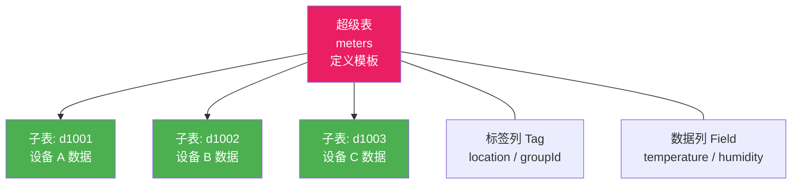

# 时序数据库

IoT 设备每秒产生海量带时间戳的数据点——温度、压力、流量……传统关系型数据库在写入吞吐、存储压缩和时序查询上力不从心。时序数据库（TSDB）专为这一场景而生：高吞吐写入、高效压缩、时间窗口聚合。本文对比 InfluxDB、TimescaleDB、TDengine 三大方案，并用 .NET 实现从写入、降采样到查询的完整链路。

## 1. IoT 数据管道全景


::: tip 为什么需要专用时序数据库？
关系型数据库可以存时序数据，但三大瓶颈决定了专业场景必须用 TSDB：**写入瓶颈**（IoT 设备可能每秒万级数据点，B-tree 索引扛不住）、**存储膨胀**（没有列式压缩，1 万台设备 × 10 指标 × 1 秒采样 = 年增 3TB+）、**查询低效**（时间窗口聚合需要全表扫描）。
:::

## 2. InfluxDB

InfluxDB 是最流行的开源时序数据库，v2 版本自带 UI、Flux 查询语言和任务引擎。

### 2.1 核心概念

| 概念 | 类比 | 说明 |
|------|------|------|
| Bucket | 数据库 | 存储数据的容器，可设置保留策略 |
| Measurement | 表 | 一组时序数据的逻辑分组，如 `temperature` |
| Tag | 索引列 | 用于过滤，如 `device_id`、`location` |
| Field | 数据列 | 实际测量值，如 `value=23.5` |
| Timestamp | 主键 | 纳秒精度时间戳 |

```
// Line Protocol 示例
temperature,device_id=sensor01,location=warehouse value=23.5,humidity=65.2 1704067200000000000
```

::: important Tag vs Field 的选择原则
**Tag 参与索引，Field 不参与**。把经常用于 `WHERE` 过滤的维度设为 Tag（如设备 ID、区域），把测量值设为 Field（如温度、湿度）。Tag 值是字符串，Field 值可以是整数、浮点数、字符串、布尔值。错误地把高基数维度（如时间戳本身）设为 Tag 会导致索引爆炸。
:::

### 2.2 Flux 查询语言

```flux
// 查询最近 1 小时 sensor01 的温度平均值，按 5 分钟窗口聚合
from(bucket: "iot-data")
  |> range(start: -1h)
  |> filter(fn: (r) => r._measurement == "temperature")
  |> filter(fn: (r) => r.device_id == "sensor01")
  |> aggregateWindow(every: 5m, fn: mean, createEmpty: false)
  |> yield(name: "mean")
```

### 2.3 .NET 集成：InfluxDB.Client

```csharp
// NuGet: InfluxDB.Client
using InfluxDB.Client;
using InfluxDB.Client.Api.Domain;
using InfluxDB.Client.Writes;

public class InfluxDbService
{
    private readonly InfluxDBClient _client;
    private readonly string _bucket;
    private readonly string _org;

    public InfluxDbService(string url, string token, string bucket, string org)
    {
        _bucket = bucket;
        _org = org;
        _client = InfluxDBClientFactory.Create(url, token);
    }

    // 批量写入数据点
    public async Task WriteBatchAsync(IEnumerable<SensorData> dataPoints)
    {
        using var writeApi = _client.GetWriteApiAsync();

        var points = dataPoints.Select(d => PointData
            .Measurement("temperature")
            .Tag("device_id", d.DeviceId)
            .Tag("location", d.Location)
            .Field("value", d.Temperature)
            .Field("humidity", d.Humidity)
            .Timestamp(d.Timestamp, WritePrecision.Ms));

        await writeApi.WritePointsAsync(points, _bucket, _org);
    }

    // 查询最近 N 小时的聚合数据
    public async Task<List<AggregatedResult>> QueryAggregateAsync(
        string deviceId, string range, string window)
    {
        var flux = $"""
            from(bucket: "{_bucket}")
              |> range(start: -{range})
              |> filter(fn: (r) => r._measurement == "temperature")
              |> filter(fn: (r) => r.device_id == "{deviceId}")
              |> aggregateWindow(every: {window}, fn: mean, createEmpty: false)
              |> yield(name: "mean")
            """;

        var tables = await _client.GetQueryApi().QueryAsync(flux, _org);

        return tables.SelectMany(t => t.Records).Select(r => new AggregatedResult
        {
            Time = r.GetTimeInDateTime()!.Value,
            Field = r.GetField(),
            Value = r.GetValue()
        }).ToList();
    }

    public void Dispose() => _client?.Dispose();
}

public record SensorData(
    string DeviceId, string Location,
    double Temperature, double Humidity, DateTime Timestamp);

public record AggregatedResult(DateTime Time, string Field, object? Value);
```

### 2.4 写入性能优化

```csharp
// 高性能批量写入：使用同步 WriteApi + 批量配置
public class InfluxDbBatchWriter
{
    private readonly WriteApi _writeApi;

    public InfluxDbBatchWriter(InfluxDBClient client, string bucket, string org)
    {
        var options = WriteOptions.CreateNew()
            .BatchSize(5000)           // 每批 5000 条
            .FlushInterval(1000)       // 1 秒刷新
            .JitterInterval(200)       // 随机抖动避免同步写入
            .RetryInterval(2000)       // 重试间隔
            .MaxRetries(3)
            .Build();

        _writeApi = client.GetWriteApi(options);
        _writeApi.EventHandler += (sender, eventArgs) =>
        {
            if (eventArgs is WriteErrorEvent error)
                Console.Error.WriteLine($"写入失败: {error.Exception.Message}");
        };
    }

    public void Enqueue(SensorData data)
    {
        var point = PointData
            .Measurement("temperature")
            .Tag("device_id", data.DeviceId)
            .Tag("location", data.Location)
            .Field("value", data.Temperature)
            .Field("humidity", data.Humidity)
            .Timestamp(data.Timestamp, WritePrecision.Ms);

        _writeApi.WritePoint(point);
    }

    public void Flush() => _writeApi.Flush();
}
```

::: warning Line Protocol 是最快写入方式
InfluxDB 支持三种写入方式：PointData 对象（最方便）、Line Protocol 字符串（最快）、JSON（已废弃）。追求极致吞吐时直接构造 Line Protocol 字符串，省去序列化开销：

```csharp
// 直接用 Line Protocol 写入，避免对象序列化
var line = $"temperature,device_id={deviceId},location={loc} value={temp},humidity={hum} {ts}";
writeApi.WriteRecord(line, WritePrecision.Ms, bucket, org);
```
:::

## 3. TimescaleDB

TimescaleDB 是 PostgreSQL 扩展，继承 PostgreSQL 全部能力（JOIN、GIS、窗口函数），同时通过 Hypertable 实现时序优化。

### 3.1 核心概念

| 概念 | 说明 |
|------|------|
| Hypertable | 自动分区的时间大表，对应用透明 |
| Chunk | Hypertable 的一个时间分区 |
| Continuous Aggregate | 物化视图，自动刷新的降采样表 |
| Retention Policy | 自动过期清理策略 |

### 3.2 建表与配置

```sql
-- 创建扩展
CREATE EXTENSION IF NOT EXISTS timescaledb;

-- 创建时序表
CREATE TABLE sensor_data (
    time        TIMESTAMPTZ       NOT NULL,
    device_id   TEXT              NOT NULL,
    location    TEXT              NOT NULL,
    temperature DOUBLE PRECISION  NOT NULL,
    humidity    DOUBLE PRECISION
);

-- 转为 Hypertable（按 time 分区，每 7 天一个 chunk）
SELECT create_hypertable('sensor_data', 'time',
    chunk_time_interval => INTERVAL '7 days');

-- 创建索引加速 Tag 过滤
CREATE INDEX idx_device ON sensor_data (device_id, time DESC);

-- 连续聚合：5 分钟降采样
CREATE MATERIALIZED VIEW sensor_5min
WITH (timescaledb.continuous) AS
SELECT
    time_bucket('5 minutes', time) AS bucket,
    device_id,
    location,
    AVG(temperature)  AS avg_temp,
    MAX(temperature)  AS max_temp,
    MIN(temperature)  AS min_temp,
    COUNT(*)          AS samples
FROM sensor_data
GROUP BY bucket, device_id, location;

-- 自动刷新连续聚合
SELECT add_continuous_aggregate_policy('sensor_5min',
    start_offset    => INTERVAL '3 hours',
    end_offset      => INTERVAL '1 hour',
    schedule_interval => INTERVAL '30 minutes');

-- 保留策略：原始数据保留 90 天
SELECT add_retention_policy('sensor_data', INTERVAL '90 days');
```

### 3.3 .NET 集成：Npgsql

```csharp
// NuGet: Npgsql
using Npgsql;

public class TimescaleDbService
{
    private readonly string _connStr;

    public TimescaleDbService(string connStr) => _connStr = connStr;

    // 批量写入：使用 COPY 协议高速导入
    public async Task BulkInsertAsync(IEnumerable<SensorData> data)
    {
        await using var conn = new NpgsqlConnection(_connStr);
        await conn.OpenAsync();

        await using var writer = conn.BeginBinaryImport(
            "COPY sensor_data (time, device_id, location, temperature, humidity) FROM STDIN (FORMAT BINARY)");

        foreach (var d in data)
        {
            writer.StartRow();
            writer.Write(d.Timestamp, NpgsqlDbType.TimestampTz);
            writer.Write(d.DeviceId, NpgsqlDbType.Text);
            writer.Write(d.Location, NpgsqlDbType.Text);
            writer.Write(d.Temperature, NpgsqlDbType.Double);
            writer.Write(d.Humidity, NpgsqlDbType.Double);
        }

        await writer.CompleteAsync();
    }

    // 查询聚合数据
    public async Task<List<AggregatedResult>> QueryAggregateAsync(
        string deviceId, TimeSpan range, string window)
    {
        var sql = $"""
            SELECT bucket, avg_temp, max_temp, min_temp, samples
            FROM sensor_5min
            WHERE device_id = @deviceId
              AND bucket > NOW() - @range
            ORDER BY bucket DESC
            """;

        await using var conn = new NpgsqlConnection(_connStr);
        await conn.OpenAsync();
        await using var cmd = new NpgsqlCommand(sql, conn);
        cmd.Parameters.AddWithValue("deviceId", deviceId);
        cmd.Parameters.AddWithValue("range", range);

        var results = new List<AggregatedResult>();
        await using var reader = await cmd.ExecuteReaderAsync();
        while (await reader.ReadAsync())
        {
            results.Add(new AggregatedResult(
                reader.GetDateTime(0), "temperature",
                new { avg = reader.GetDouble(1), max = reader.GetDouble(2),
                      min = reader.GetDouble(3), samples = reader.GetInt64(4) }
            ));
        }
        return results;
    }
}
```

::: tip 为什么选 TimescaleDB？
如果你已经有 PostgreSQL 基础设施，或者需要时序数据与业务表 JOIN（如设备元数据、用户信息），TimescaleDB 是最佳选择——零学习成本，SQL 全兼容，同时享受时序优化。
:::

## 4. TDengine

TDengine 是国产开源时序数据库，专为 IoT 场景优化，单机写入性能可达 **100 万数据点/秒**。

### 4.1 超级表模型



| 概念 | 说明 |
|------|------|
| 超级表（STable） | 模板：定义列结构 + 标签列，本身不存数据 |
| 子表 | 基于超级表创建，继承列结构，每个设备一张子表 |
| 标签（Tag） | 静态元数据，用于过滤，如 `location`、`groupId` |

```sql
-- 创建超级表
CREATE STABLE meters (ts TIMESTAMP, temperature FLOAT, humidity FLOAT)
    TAGS (location BINARY(64), group_id INT);

-- 为每台设备创建子表
CREATE TABLE d1001 USING meters TAGS ('warehouse-A', 1);
CREATE TABLE d1002 USING meters TAGS ('warehouse-B', 2);

-- 写入数据
INSERT INTO d1001 VALUES (NOW, 23.5, 65.2);
INSERT INTO d1002 VALUES (NOW, 18.3, 72.1);

-- 按超级表聚合查询（自动合并所有子表）
SELECT _wstart, AVG(temperature), MAX(temperature)
FROM meters
WHERE ts > NOW - 1h AND location = 'warehouse-A'
INTERVAL(5m);
```

### 4.2 .NET 集成

```csharp
// NuGet: TDengine.Driver
using TDengine.Driver;
using TDengine.Driver.Impl;

public class TDengineService : IDisposable
{
    private IntPtr _conn;

    public TDengineService(string host, string db)
    {
        _conn = ConnectDb(host, db);
    }

    private IntPtr ConnectDb(string host, string db)
    {
        var conn = LibTaos.TaosConnect(host, "root", "taosdata", db, 6030);
        if (conn == IntPtr.Zero)
            throw new Exception("TDengine 连接失败");
        return conn;
    }

    // 批量写入
    public void WriteBatch(string table, IEnumerable<SensorData> data)
    {
        var sql = string.Join("; ", data.Select(d =>
            $"INSERT INTO {table}_{d.DeviceId} USING meters TAGS " +
            $"('{d.Location}', 1) VALUES " +
            $"('{d.Timestamp:yyyy-MM-dd HH:mm:ss.fff}', {d.Temperature}, {d.Humidity})"));

        var res = LibTaos.TaosQuery(_conn, sql);
        LibTaos.FreeResult(res);
    }

    // 查询聚合数据
    public List<(DateTime Time, double Avg, double Max)> QueryAggregate(
        string location, int minutes, string interval)
    {
        var sql = $"""
            SELECT _wstart, AVG(temperature), MAX(temperature)
            FROM meters
            WHERE ts > NOW - {minutes}m AND location = '{location}'
            INTERVAL({interval})
            """;

        var res = LibTaos.TaosQuery(_conn, sql);
        var results = new List<(DateTime, double, double)>();

        // 遍历结果集
        while (LibTaos.TaosFetchRow(res) != IntPtr.Zero)
        {
            var ts = LibTaos.GetTimestamp(res, 0);
            var avg = LibTaos.GetDouble(res, 1);
            var max = LibTaos.GetDouble(res, 2);
            results.Add((DateTime.UnixEpoch.AddMilliseconds(ts), avg, max));
        }

        LibTaos.FreeResult(res);
        return results;
    }

    public void Dispose()
    {
        if (_conn != IntPtr.Zero)
            LibTaos.TaosClose(_conn);
    }
}
```

## 5. 降采样策略

时序数据量随时间线性增长，不可能永远保存原始精度。降采样是必选项：原始数据保留短期，聚合数据长期保留。


### InfluxDB 降采样 Task

```flux
// InfluxDB Task：每 5 分钟执行，将原始数据降采样到 1 分钟
option task = {name: "downsample-1m", every: 5m}

from(bucket: "iot-raw")
  |> range(start: -task.every)
  |> filter(fn: (r) => r._measurement == "temperature")
  |> aggregateWindow(every: 1m, fn: mean, createEmpty: false)
  |> to(bucket: "iot-1m", org: "my-org")
```

### TimescaleDB 连续聚合级联

```sql
-- 1 分钟降采样
CREATE MATERIALIZED VIEW sensor_1min WITH (timescaledb.continuous) AS
SELECT time_bucket('1 min', time) AS bucket, device_id, location,
       AVG(temperature) AS avg_temp, MAX(temperature) AS max_temp, MIN(temperature) AS min_temp
FROM sensor_data GROUP BY bucket, device_id, location;

-- 1 小时降采样（基于 1 分钟视图）
CREATE MATERIALIZED VIEW sensor_1hour WITH (timescaledb.continuous) AS
SELECT time_bucket('1 hour', bucket) AS bucket, device_id, location,
       AVG(avg_temp) AS avg_temp, MAX(max_temp) AS max_temp, MIN(min_temp) AS min_temp
FROM sensor_1min GROUP BY bucket, device_id, location;

-- 1 天降采样（基于 1 小时视图）
CREATE MATERIALIZED VIEW sensor_1day WITH (timescaledb.continuous) AS
SELECT time_bucket('1 day', bucket) AS bucket, device_id, location,
       AVG(avg_temp) AS avg_temp, MAX(max_temp) AS max_temp, MIN(min_temp) AS min_temp
FROM sensor_1hour GROUP BY bucket, device_id, location;
```

## 6. 常见查询模式

### 6.1 最新值查询

```csharp
// InfluxDB: 获取设备最新一条记录
var lastValueFlux = $"""
    from(bucket: "{_bucket}")
      |> range(start: -30d)
      |> filter(fn: (r) => r._measurement == "temperature" and r.device_id == "{deviceId}")
      |> last()
    """;

// TimescaleDB: 获取设备最新一条记录
// SELECT DISTINCT ON (device_id) * FROM sensor_data WHERE device_id = @id ORDER BY time DESC LIMIT 1;

// TDengine: 获取设备最新一条记录
// SELECT LAST(*) FROM meters WHERE device_id = 'sensor01';
```

### 6.2 时间窗口聚合

```csharp
// InfluxDB: 过去 24 小时每 5 分钟平均温度
var windowFlux = $"""
    from(bucket: "{_bucket}")
      |> range(start: -24h)
      |> filter(fn: (r) => r._measurement == "temperature")
      |> aggregateWindow(every: 5m, fn: mean, createEmpty: false)
    """;
```

### 6.3 异常检测查询

```sql
-- TimescaleDB: Z-score 异常检测
SELECT time, device_id, temperature,
       ABS(temperature - AVG(temperature) OVER w) /
       NULLIF(STDDEV(temperature) OVER w, 0) AS z_score
FROM sensor_data
WHERE time > NOW() - INTERVAL '1 hour'
WINDOW w AS (PARTITION BY device_id ORDER BY time ROWS BETWEEN 60 PRECEDING AND CURRENT ROW)
HAVING z_score > 3;  -- 超过 3 倍标准差视为异常
```

## 7. 三大时序数据库对比

| 维度 | InfluxDB | TimescaleDB | TDengine |
|------|----------|-------------|----------|
| **引擎类型** | 自研存储引擎 | PostgreSQL 扩展 | 自研存储引擎 |
| **查询语言** | Flux / InfluxQL | SQL（完整） | SQL-like |
| **写入吞吐** | ~50 万点/秒 | ~20 万点/秒 | ~100 万点/秒 |
| **压缩比** | ~10:1 | ~5:1 | ~10:1~20:1 |
| **集群** | 付费版（OSS 不支持） | 原生支持 | 开源支持 |
| **JOIN 能力** | 不支持 | 完整 SQL JOIN | 有限 |
| **生态成熟度** | 高（Telegraf/Grafana） | 高（PG 生态） | 中（国产生态） |
| **.NET SDK** | InfluxDB.Client | Npgsql | TDengine.Driver |
| **适用场景** | 纯时序、云原生 | 时序+业务混合 | 超大规模 IoT、国产化 |

::: important 如何选择？
- **纯 IoT 时序场景 + 云原生** → InfluxDB：生态最成熟，Telegraf+Grafana 开箱即用
- **时序 + 业务数据混合** → TimescaleDB：复用 PostgreSQL 生态，SQL 全兼容
- **超大规模 + 国产化要求** → TDengine：写入性能最强，国产信创友好
:::

## 8. 保留策略

数据是有生命周期的——原始数据越新越有价值，越旧越可降精度。

| 数据精度 | 典型保留期 | 存储占比 |
|----------|-----------|---------|
| 原始（1s） | 7~30 天 | 70% |
| 分钟级 | 30~180 天 | 20% |
| 小时级 | 1~2 年 | 8% |
| 天级 | 永久 | 2% |

```csharp
// InfluxDB: 设置 Bucket 保留策略
var bucket = await _client.GetBucketsApi()
    .CreateBucketAsync(new BucketPostRequest(
        name: "iot-raw",
        orgID: orgId,
        retentionRules: new List<BucketRetentionRules>
        {
            new BucketRetentionRules(type: BucketRetentionRules.TypeEnum.Expire,
                                      everySeconds: 7 * 24 * 3600) // 7 天
        }));
```

> 参考：[InfluxDB 官方文档](https://docs.influxdata.com/influxdb/v2/) | [TimescaleDB 官方文档](https://docs.timescale.com/) | [TDengine 官方文档](https://docs.taosdata.com/)

## 面试技巧

1. **"时序数据库和关系型数据库的核心区别？"** —— 三点：写入模型（追加为主，极少更新/删除）、存储模型（列式压缩，按时间分区）、查询模型（时间窗口聚合为主，非点查询）。面试时画时间轴说明降采样的必要性。

2. **"InfluxDB 的 Tag 和 Field 怎么选？"** —— Tag 是索引维度，用于过滤和 GROUP BY；Field 是数据值，用于聚合计算。关键避坑：高基数维度（如时间戳、UUID）不能做 Tag，否则索引爆炸。

3. **"降采样策略怎么设计？"** —— 原始→分钟→小时→天级联，每层保留期递增。强调连续聚合（TimescaleDB）和 Task（InfluxDB）的自动化，避免手动 ETL。

4. **"三大时序数据库怎么选？"** —— 按"时序纯度"和"SQL 需求"两个维度回答：纯时序选 InfluxDB，需要 JOIN 选 TimescaleDB，超大规模/国产化选 TDengine。加分项：提到集群方案的差异（InfluxDB OSS 不支持集群）。

5. **"时序数据的保留策略怎么做？"** —— 热数据原始保留、温数据降采样保留、冷数据归档到对象存储。结合具体数字说明存储成本（1 万设备 × 10 指标 × 1 秒采样 ≈ 年增 3TB 原始数据）。
