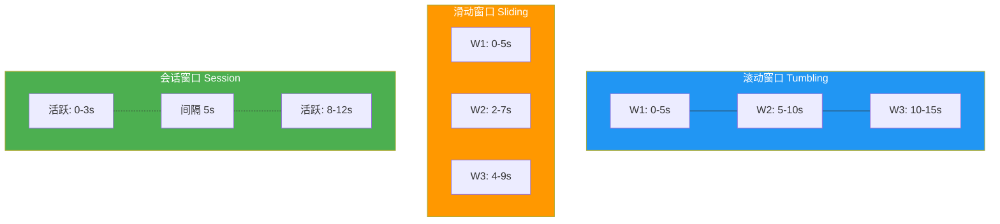
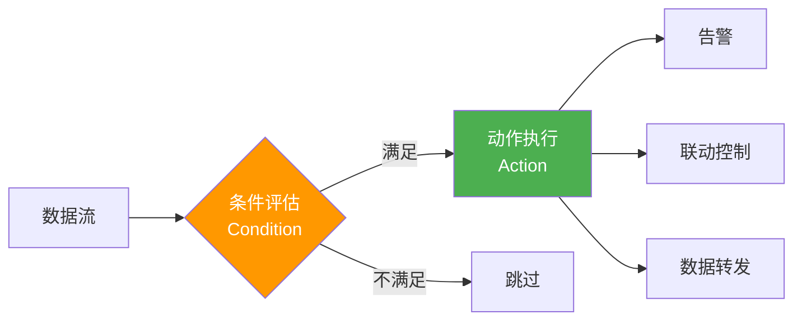
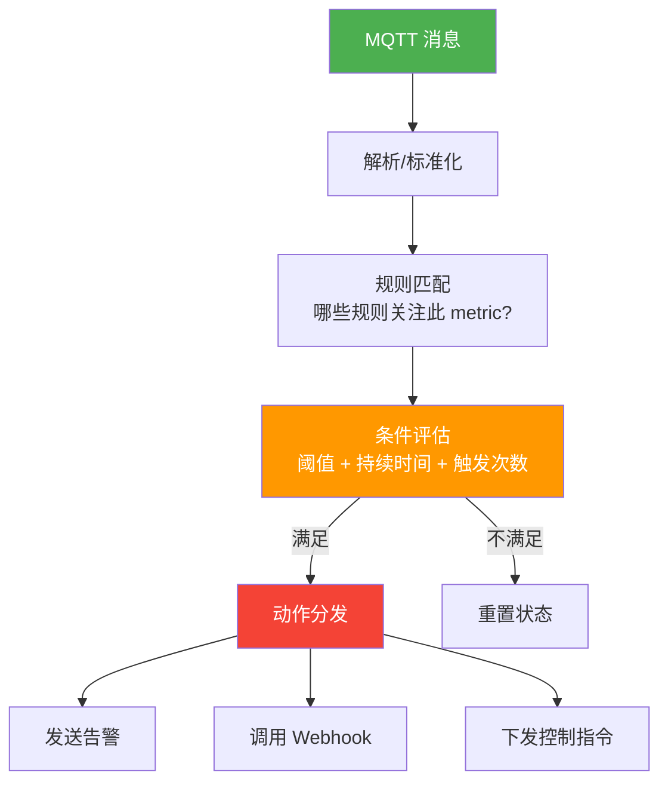
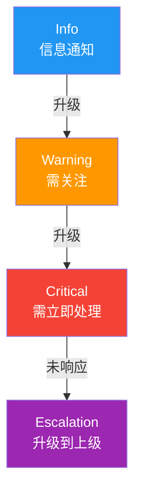
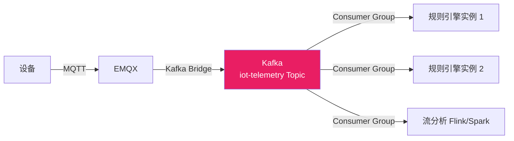

# 流处理与规则引擎

IoT 数据像流水一样持续到达——温度传感器每秒上报、PLC 每 100ms 刷新寄存器。批处理来不及，必须用流处理实时消费、实时判断、实时响应。本文从流处理核心概念出发，用 .NET 构建一个可配置的规则引擎，并集成 MQTTnet 实现端到端告警链路。

## 1. 流处理核心概念

### 1.1 窗口类型



| 窗口类型 | 特点 | IoT 场景 |
|----------|------|----------|
| 滚动窗口（Tumbling） | 固定大小，不重叠 | 每分钟平均温度 |
| 滑动窗口（Sliding） | 固定大小，有重叠 | 过去 5 分钟的滑动平均（每秒更新） |
| 会话窗口（Session） | 按活跃间隔动态划分 | 设备上下线会话 |

### 1.2 异常检测方法

| 方法 | 原理 | 适用场景 |
|------|------|----------|
| 静态阈值 | value > threshold | 温度超限、电量过低 |
| Z-score | |x - μ| / σ > k | 统计异常，设备漂移 |
| 变化率 | |Δx / Δt| > rate | 突变检测，传感器故障 |
| CEP 复合事件 | 事件序列模式匹配 | 连续 N 次超限 → 告警升级 |

::: warning 阈值 ≠ 规则
"温度 > 40°C 发告警"是阈值，"温度 > 40°C 持续 5 分钟"是规则。规则引擎的核心是**时间语义**——持续多久、几次触发、多长时间窗口内——不能简化为 if-else。
:::

## 2. 规则引擎设计

### 2.1 规则模型



一条规则由三部分组成：

```json
{
  "id": "rule-temp-alert",
  "name": "温度超高告警",
  "condition": {
    "metric": "temperature",
    "operator": "GreaterThan",
    "threshold": 40.0,
    "duration": "00:05:00",
    "occurrences": 3
  },
  "actions": [
    { "type": "Alert", "level": "Critical", "message": "设备 {deviceId} 温度 {value}°C 超限" },
    { "type": "Webhook", "url": "https://api.example.com/alert" }
  ],
  "enabled": true
}
```

### 2.2 规则评估管线



## 3. .NET 规则引擎实现

### 3.1 规则模型定义

```csharp
public enum AlertLevel { Info, Warning, Critical, Escalation }

public enum ComparisonOperator
{
    GreaterThan, LessThan, GreaterThanOrEqual,
    LessThanOrEqual, Equals, NotEquals
}

public record RuleCondition(
    string Metric,
    ComparisonOperator Operator,
    double Threshold,
    TimeSpan? Duration,       // 持续时间
    int? Occurrences          // 触发次数
);

public record RuleAction(
    string Type,              // Alert / Webhook / MqttCommand
    AlertLevel? Level,
    string? Message,
    string? Url,
    string? Topic,
    string? Payload
);

public record Rule(
    string Id,
    string Name,
    RuleCondition Condition,
    List<RuleAction> Actions,
    bool Enabled
);
```

### 3.2 条件评估器

```csharp
public class ConditionEvaluator
{
    // 滑动窗口：记录每次触发时间
    private readonly Dictionary<string, List<DateTime>> _triggerHistory = new();

    public bool Evaluate(string ruleId, double value, RuleCondition condition)
    {
        // 基本阈值判断
        if (!EvaluateOperator(value, condition.Operator, condition.Threshold))
        {
            // 条件不满足，清除历史
            _triggerHistory.Remove(ruleId);
            return false;
        }

        // 无持续时间和次数要求，直接触发
        if (condition.Duration is null && condition.Occurrences is null)
            return true;

        var now = DateTime.UtcNow;
        if (!_triggerHistory.ContainsKey(ruleId))
            _triggerHistory[ruleId] = new List<DateTime>();

        _triggerHistory[ruleId].Add(now);

        // 清理过期记录
        var windowStart = condition.Duration.HasValue
            ? now - condition.Duration.Value
            : DateTime.MinValue;
        _triggerHistory[ruleId].RemoveAll(t => t < windowStart);

        // 检查持续时间
        if (condition.Duration.HasValue)
        {
            var firstInWindow = _triggerHistory[ruleId].First();
            if (now - firstInWindow < condition.Duration.Value)
                return false;
        }

        // 检查触发次数
        if (condition.Occurrences.HasValue &&
            _triggerHistory[ruleId].Count < condition.Occurrences.Value)
            return false;

        return true;
    }

    private static bool EvaluateOperator(double value, ComparisonOperator op, double threshold) => op switch
    {
        ComparisonOperator.GreaterThan => value > threshold,
        ComparisonOperator.LessThan => value < threshold,
        ComparisonOperator.GreaterThanOrEqual => value >= threshold,
        ComparisonOperator.LessThanOrEqual => value <= threshold,
        ComparisonOperator.Equals => Math.Abs(value - threshold) < 0.0001,
        ComparisonOperator.NotEquals => Math.Abs(value - threshold) >= 0.0001,
        _ => false
    };
}
```

### 3.3 动作分发器

```csharp
public interface IActionHandler
{
    string ActionType { get; }
    Task ExecuteAsync(RuleAction action, Dictionary<string, object> context);
}

public class AlertActionHandler : IActionHandler
{
    public string ActionType => "Alert";

    public async Task ExecuteAsync(RuleAction action, Dictionary<string, object> context)
    {
        var message = action.Message ?? "告警触发";
        // 替换模板变量
        foreach (var (key, val) in context)
            message = message.Replace($"{{{key}}}", val?.ToString());

        Console.WriteLine($"[{action.Level}] {DateTime.UtcNow:HH:mm:ss} {message}");
        // 实际项目中：写入数据库、推送通知等
        await Task.CompletedTask;
    }
}

public class WebhookActionHandler : IActionHandler
{
    private readonly HttpClient _http;

    public WebhookActionHandler(HttpClient http) => _http = http;

    public string ActionType => "Webhook";

    public async Task ExecuteAsync(RuleAction action, Dictionary<string, object> context)
    {
        if (action.Url is null) return;

        var payload = new
        {
            rule = context.GetValueOrDefault("ruleId"),
            level = action.Level?.ToString(),
            message = action.Message,
            timestamp = DateTime.UtcNow,
            data = context
        };

        var response = await _http.PostAsJsonAsync(action.Url, payload);
        response.EnsureSuccessStatusCode();
    }
}

public class ActionDispatcher
{
    private readonly Dictionary<string, IActionHandler> _handlers;

    public ActionDispatcher(IEnumerable<IActionHandler> handlers) =>
        _handlers = handlers.ToDictionary(h => h.ActionType);

    public async Task DispatchAsync(List<RuleAction> actions, Dictionary<string, object> context)
    {
        foreach (var action in actions)
        {
            if (_handlers.TryGetValue(action.Type, out var handler))
            {
                try { await handler.ExecuteAsync(action, context); }
                catch (Exception ex)
                {
                    Console.Error.WriteLine($"动作执行失败 [{action.Type}]: {ex.Message}");
                }
            }
        }
    }
}
```

### 3.4 规则引擎核心

```csharp
public class RuleEngine
{
    private readonly List<Rule> _rules = new();
    private readonly ConditionEvaluator _evaluator = new();
    private readonly ActionDispatcher _dispatcher;

    public RuleEngine(ActionDispatcher dispatcher) => _dispatcher = dispatcher;

    public void LoadRules(IEnumerable<Rule> rules) =>
        _rules.AddRange(rules.Where(r => r.Enabled));

    public async Task ProcessAsync(string metric, double value, string deviceId)
    {
        var context = new Dictionary<string, object>
        {
            ["deviceId"] = deviceId,
            ["metric"] = metric,
            ["value"] = value,
            ["timestamp"] = DateTime.UtcNow
        };

        foreach (var rule in _rules.Where(r => r.Condition.Metric == metric))
        {
            if (_evaluator.Evaluate(rule.Id, value, rule.Condition))
            {
                context["ruleId"] = rule.Id;
                context["ruleName"] = rule.Name;
                await _dispatcher.DispatchAsync(rule.Actions, context);
            }
        }
    }
}
```

## 4. 集成 MQTTnet

```csharp
// NuGet: MQTTnet
using MQTTnet;
using MQTTnet.Client;

public class MqttRuleEngineWorker : BackgroundService
{
    private readonly RuleEngine _engine;
    private readonly IMqttClient _mqttClient;
    private readonly MqttClientOptions _mqttOptions;

    public MqttRuleEngineWorker(RuleEngine engine)
    {
        _engine = engine;
        var factory = new MqttFactory();
        _mqttClient = factory.CreateMqttClient();

        _mqttOptions = new MqttClientOptionsBuilder()
            .WithTcpServer("localhost", 1883)
            .WithClientId("rule-engine-worker")
            .Build();

        _mqttClient.ApplicationMessageReceivedAsync += HandleMessageAsync;
    }

    protected override async Task ExecuteAsync(CancellationToken ct)
    {
        await _mqttClient.ConnectAsync(_mqttOptions, ct);
        await _mqttClient.SubscribeAsync(new MqttTopicFilterBuilder()
            .WithTopic("sensors/+/telemetry").Build(), ct);

        // 保持运行直到取消
        var tcs = new TaskCompletionSource();
        ct.Register(() => tcs.SetResult());
        await tcs.Task;
    }

    private async Task HandleMessageAsync(MqttApplicationMessageReceivedEventArgs e)
    {
        // Topic 格式: sensors/{deviceId}/telemetry
        var segments = e.ApplicationMessage.Topic.Split('/');
        if (segments.Length < 2) return;

        var deviceId = segments[1];
        var json = JsonSerializer.Deserialize<JsonElement>(e.ApplicationMessage.Payload);

        // 遍历所有指标，送入规则引擎
        foreach (var property in json.EnumerateObject())
        {
            if (property.Value.ValueKind == JsonValueKind.Number)
            {
                await _engine.ProcessAsync(property.Name, property.Value.GetDouble(), deviceId);
            }
        }
    }
}
```

::: tip 规则引擎的冷启动问题
刚启动时没有历史数据，"持续 5 分钟"的条件无法立即判断。解决方案：启动时从时序数据库加载最近窗口的数据预热触发历史，或者启动后设置一个 warm-up 期，期间只记录不告警。
:::

## 5. 告警体系

### 5.1 告警级别



| 级别 | 含义 | 通知渠道 | 响应要求 |
|------|------|----------|----------|
| Info | 正常事件记录 | 日志 | 无需响应 |
| Warning | 需关注但不紧急 | 邮件/IM | 24h 内处理 |
| Critical | 需立即处理 | 短信/电话 | 15min 内响应 |
| Escalation | 升级到上级 | 电话/短信轰炸 | 立即响应 |

### 5.2 告警升级逻辑

```csharp
public class AlertEscalationService
{
    private readonly Dictionary<string, AlertLevel> _alertLevels = new();
    private readonly Dictionary<string, DateTime> _lastResponseTime = new();

    public async Task ProcessAlertAsync(string deviceId, AlertLevel level, string message)
    {
        var currentLevel = _alertLevels.GetValueOrDefault(deviceId);

        // 告警升级：级别递增
        if (level > currentLevel)
        {
            _alertLevels[deviceId] = level;
            await SendNotificationAsync(deviceId, level, message);
        }

        // Critical 超过 15 分钟未响应，自动升级
        if (currentLevel == AlertLevel.Critical)
        {
            var elapsed = DateTime.UtcNow - _lastResponseTime.GetValueOrDefault(deviceId);
            if (elapsed > TimeSpan.FromMinutes(15))
            {
                _alertLevels[deviceId] = AlertLevel.Escalation;
                await SendNotificationAsync(deviceId, AlertLevel.Escalation,
                    $"设备 {deviceId} Critical 告警超时未响应，已升级！");
            }
        }
    }

    public void Acknowledge(string deviceId)
    {
        _alertLevels.Remove(deviceId);
        _lastResponseTime[deviceId] = DateTime.UtcNow;
    }

    private async Task SendNotificationAsync(string device, AlertLevel level, string msg)
    {
        // 根据级别选择通知渠道
        var channels = level switch
        {
            AlertLevel.Info => new[] { "log" },
            AlertLevel.Warning => new[] { "email", "im" },
            AlertLevel.Critical => new[] { "sms", "phone" },
            AlertLevel.Escalation => new[] { "sms", "phone", "escalation-call" },
            _ => Array.Empty<string>()
        };

        foreach (var channel in channels)
            Console.WriteLine($"[{channel}] {level}: {msg}");

        await Task.CompletedTask;
    }
}
```

## 6. Apache Kafka 高吞吐流

当设备规模超过万级，MQTT Broker 直接推送到规则引擎的模式会遇到瓶颈。Kafka 作为分布式流平台，提供高吞吐、持久化、回放能力。



```csharp
// NuGet: Confluent.Kafka
using Confluent.Kafka;

public class KafkaTelemetryConsumer : BackgroundService
{
    private readonly IConsumer<string, string> _consumer;
    private readonly RuleEngine _engine;

    public KafkaTelemetryConsumer(RuleEngine engine)
    {
        _engine = engine;
        var config = new ConsumerConfig
        {
            BootstrapServers = "localhost:9092",
            GroupId = "rule-engine-group",
            AutoOffsetReset = AutoOffsetReset.Latest,
            EnableAutoCommit = false  // 手动提交，确保处理完成
        };
        _consumer = new ConsumerBuilder<string, string>(config).Build();
    }

    protected override async Task ExecuteAsync(CancellationToken ct)
    {
        _consumer.Subscribe("iot-telemetry");

        while (!ct.IsCancellationRequested)
        {
            var result = _consumer.Consume(ct);
            try
            {
                var data = JsonSerializer.Deserialize<TelemetryMessage>(result.Message.Value);
                if (data is not null)
                {
                    await _engine.ProcessAsync(data.Metric, data.Value, data.DeviceId);
                }
                _consumer.Commit(result);
            }
            catch (Exception ex)
            {
                Console.Error.WriteLine($"消息处理失败: {ex.Message}");
                // 不提交，下次重新消费
            }
        }
    }
}

public record TelemetryMessage(string DeviceId, string Metric, double Value, DateTime Timestamp);
```

::: important Kafka vs MQTT 定位差异
MQTT 是设备接入协议（轻量、低功耗），Kafka 是服务端流平台（高吞吐、持久化）。二者不替代，而是串联：设备→MQTT→Kafka Bridge→Kafka→消费者。Kafka 解决的是服务端横向扩展问题。
:::

## 7. 实战：温度告警系统

完整的温度监控告警系统，支持 JSON 配置规则、MQTT 数据接入、多级告警。

```csharp
// Program.cs — 完整可运行的温度告警系统
var builder = Host.CreateDefaultBuilder(args);

builder.ConfigureServices((context, services) =>
{
    // 注册动作处理器
    services.AddSingleton<IActionHandler, AlertActionHandler>();
    services.AddSingleton<IActionHandler, WebhookActionHandler>();
    services.AddSingleton<ActionDispatcher>();
    services.AddSingleton<RuleEngine>();
    services.AddSingleton<AlertEscalationService>();

    // 加载规则
    services.AddSingleton(sp =>
    {
        var rules = LoadRulesFromJson("rules.json");
        var engine = sp.GetRequiredService<RuleEngine>();
        engine.LoadRules(rules);
        return engine;
    });

    services.AddHostedService<MqttRuleEngineWorker>();
});

var host = builder.Build();
await host.RunAsync();

static List<Rule> LoadRulesFromJson(string path)
{
    var json = File.ReadAllText(path);
    return JsonSerializer.Deserialize<List<Rule>>(json,
        new JsonSerializerOptions { PropertyNameCaseInsensitive = true }) ?? new();
}
```

```json
// rules.json — 规则配置文件
[
  {
    "Id": "temp-warning",
    "Name": "温度偏高预警",
    "Condition": {
      "Metric": "temperature",
      "Operator": "GreaterThan",
      "Threshold": 35.0,
      "Duration": "00:02:00",
      "Occurrences": null
    },
    "Actions": [
      { "Type": "Alert", "Level": "Warning", "Message": "设备 {deviceId} 温度 {value}°C 偏高" }
    ],
    "Enabled": true
  },
  {
    "Id": "temp-critical",
    "Name": "温度超高告警",
    "Condition": {
      "Metric": "temperature",
      "Operator": "GreaterThan",
      "Threshold": 40.0,
      "Duration": "00:01:00",
      "Occurrences": 3
    },
    "Actions": [
      { "Type": "Alert", "Level": "Critical", "Message": "设备 {deviceId} 温度 {value}°C 严重超限！" },
      { "Type": "Webhook", "Url": "https://hooks.example.com/alert" }
    ],
    "Enabled": true
  },
  {
    "Id": "humidity-low",
    "Name": "湿度过低告警",
    "Condition": {
      "Metric": "humidity",
      "Operator": "LessThan",
      "Threshold": 20.0,
      "Duration": null,
      "Occurrences": null
    },
    "Actions": [
      { "Type": "Alert", "Level": "Info", "Message": "设备 {deviceId} 湿度 {value}% 过低" }
    ],
    "Enabled": true
  }
]
```

> 参考：[MQTTnet 官方仓库](https://github.com/dotnet/MQTTnet) | [Confluent.Kafka 文档](https://docs.confluent.io/kafka-clients/dotnet/current/overview.html) | [Apache Flink](https://flink.apache.org/) | [复杂事件处理 CEP](https://en.wikipedia.org/wiki/Complex_event_processing)

## 面试技巧

1. **"流处理和批处理的区别？"** —— 流处理逐条处理、低延迟、无界数据；批处理攒批处理、高吞吐、有界数据。IoT 场景用流处理是因为告警不能等——温度超标 5 分钟后才发通知就晚了。

2. **"规则引擎怎么设计？"** —— 三要素：条件（阈值+持续时间+触发次数）、动作（告警/联动/转发）、状态管理（滑动窗口内的触发历史）。面试时画出条件评估流程图，重点讲持续时间语义。

3. **"告警风暴怎么处理？"** —— 三招：**告警去重**（同一设备同一规则在恢复前不重复发）、**告警抑制**（父设备告警时抑制子设备告警）、**告警收敛**（时间窗口内同类告警合并）。这是运维经验题，会这个加分很多。

4. **"Kafka 和 MQTT 的关系？"** —— MQTT 解决设备接入（轻量、低功耗），Kafka 解决服务端水平扩展（高吞吐、持久化、回放）。串联架构：设备→MQTT→Kafka Bridge→Kafka→消费者。不要说"Kafka 替代 MQTT"。

5. **"CEP 是什么？给个 IoT 例子。"** —— 复杂事件处理，识别事件序列模式。例子：连续 3 次温度超限 AND 湿度低于阈值 → 判定为"火灾风险"，而非简单阈值告警。区别在于**事件间的时序关系和逻辑组合**。
