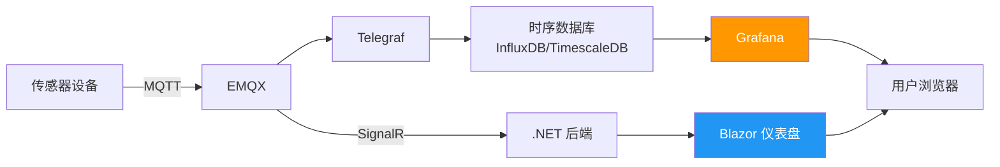
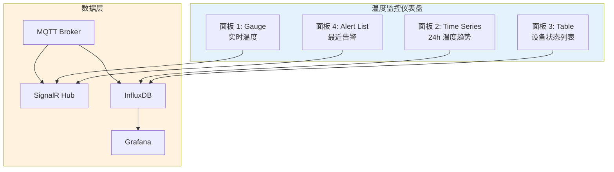

# IoT 数据可视化

数据采集、存储、规则引擎都就位了，最后一步是把数据"画出来"让人能看懂。IoT 可视化的核心需求是**实时性**（几秒内看到最新状态）和**上下文**（一台设备的温度是高是低，要看历史趋势和阈值线）。本文从 Grafana 开箱即用方案到 .NET 自定义仪表盘，覆盖 IoT 可视化全链路。

## 1. 可视化架构



两条路线：
- **Grafana 路线**：成熟生态，丰富的面板类型，零代码配置
- **.NET 自定义路线**：完全控制 UI/UX，深度集成业务逻辑

## 2. Grafana 仪表盘

### 2.1 Docker 部署

```yaml
# docker-compose.yml
version: "3.8"
services:
  grafana:
    image: grafana/grafana:latest
    container_name: grafana
    ports:
      - "3000:3000"
    environment:
      GF_SECURITY_ADMIN_USER: admin
      GF_SECURITY_ADMIN_PASSWORD: admin123
      GF_INSTALL_PLUGINS: grafana-clock-panel,grafana-worldmap-panel
    volumes:
      - grafana-storage:/var/lib/grafana
      - ./provisioning:/etc/grafana/provisioning
    depends_on:
      - influxdb

  influxdb:
    image: influxdb:2.7
    container_name: influxdb
    ports:
      - "8086:8086"
    volumes:
      - influxdb-storage:/var/lib/influxdb2

volumes:
  grafana-storage:
  influxdb-storage:
```

### 2.2 数据源配置

Grafana 通过 provisioning 实现配置即代码：

```yaml
# provisioning/datasources/influxdb.yml
apiVersion: 1
datasources:
  - name: InfluxDB-IoT
    type: influxdb
    access: proxy
    url: http://influxdb:8086
    secureJsonData:
      token: my-super-secret-token
    jsonData:
      version: Flux
      organization: my-org
      defaultBucket: iot-data
    isDefault: true
```

::: tip 配置即代码（Dashboard as Code）
Grafana 支持通过 YAML/JSON 文件管理数据源、仪表盘、告警规则。好处：版本控制、环境一致、CI/CD 自动部署。避免在 UI 上手动配置后忘记记录。
:::

### 2.3 面板类型

| 面板类型 | 用途 | IoT 场景 |
|----------|------|----------|
| Time Series | 时序曲线图 | 温度趋势、设备状态变化 |
| Gauge | 仪表盘 | 当前温度、湿度、电量 |
| Stat | 大数字 | 设备在线数、今日告警数 |
| Table | 表格 | 设备列表、告警历史 |
| Heatmap | 热力图 | 设备负载分布、温度分布 |
| Geomap | 地图 | 设备地理分布、车辆轨迹 |
| Bar Chart | 柱状图 | 各区域能耗对比 |
| Logs | 日志流 | 设备事件日志 |

### 2.4 实时数据与模板变量

```flux
// Grafana 查询：使用 $__interval 自动适配采样间隔
from(bucket: "iot-data")
  |> range(start: v.timeRangeStart, stop: v.timeRangeStop)
  |> filter(fn: (r) => r._measurement == "temperature")
  |> filter(fn: (r) => r.device_id == "${device}")
  |> aggregateWindow(every: $__interval, fn: mean, createEmpty: false)
  |> yield(name: "mean")
```

模板变量让仪表盘可复用：

```yaml
# provisioning/dashboards/variables.json — 仪表盘变量定义
# device 变量：从 InfluxDB 查询所有设备 ID
# query: from(bucket: "iot-data") |> range(start: -30d) |> keyValues(keyColumns: ["device_id"]) |> group()
```

| 变量名 | 类型 | 用途 |
|--------|------|------|
| `device` | Query | 选择设备 |
| `location` | Query | 选择区域 |
| `interval` | Interval | 采样间隔 |
| `timeRange` | Time | 时间范围 |

### 2.5 Grafana 告警规则

```yaml
# provisioning/alerting/rules.yml
apiVersion: 1
groups:
  - orgId: 1
    name: iot-temperature-alerts
    rules:
      - uid: temp-critical
        title: 温度超高告警
        condition: C
        data:
          - refId: A
            relativeTimeRange:
              from: 300
              to: 0
            datasourceUid: influxdb-uid
            model:
              query: >
                from(bucket: "iot-data")
                  |> range(start: -5m)
                  |> filter(fn: (r) => r._measurement == "temperature")
                  |> mean()
          - refId: B
            relativeTimeRange:
              from: 300
              to: 0
            datasourceUid: __expr__
            model:
              type: reduce
              expression: A
              reducer: last
          - refId: C
            relativeTimeRange:
              from: 300
              to: 0
            datasourceUid: __expr__
            model:
              type: threshold
              expression: B
              conditions:
                - evaluator:
                    params:
                      - 40
                    type: gt
        noDataState: NoData
        execErrState: Alerting
        for: 2m
        annotations:
          description: "设备温度超过 40°C"
        labels:
          severity: critical
```

## 3. .NET 自定义可视化

Grafana 适合运维监控，但产品级 UI 需要自定义。用 SignalR + Blazor 打造深度定制的实时仪表盘。

### 3.1 SignalR 实时推送

```csharp
// NuGet: Microsoft.AspNetCore.SignalR
public class TelemetryHub : Hub
{
    // 客户端调用此方法订阅设备数据
    public async Task SubscribeDevice(string deviceId)
    {
        await Groups.AddToGroupAsync(Context.ConnectionId, $"device-{deviceId}");
    }

    public async Task UnsubscribeDevice(string deviceId)
    {
        await Groups.RemoveFromGroupAsync(Context.ConnectionId, $"device-{deviceId}");
    }
}

// 后端推送服务
public class TelemetryPushService : BackgroundService
{
    private readonly IHubContext<TelemetryHub> _hubContext;
    private readonly IMqttClient _mqttClient;

    public TelemetryPushService(IHubContext<TelemetryHub> hubContext)
    {
        _hubContext = hubContext;
        var factory = new MqttFactory();
        _mqttClient = factory.CreateMqttClient();

        _mqttClient.ApplicationMessageReceivedAsync += async e =>
        {
            var deviceId = e.ApplicationMessage.Topic.Split('/')[1];
            var payload = Encoding.UTF8.GetString(e.ApplicationMessage.Payload);

            // 推送给订阅了该设备的客户端
            await _hubContext.Clients.Group($"device-{deviceId}")
                .SendAsync("TelemetryUpdate", deviceId, payload);
        };
    }

    protected override async Task ExecuteAsync(CancellationToken ct)
    {
        var options = new MqttClientOptionsBuilder()
            .WithTcpServer("localhost", 1883).Build();

        await _mqttClient.ConnectAsync(options, ct);
        await _mqttClient.SubscribeAsync("sensors/+/telemetry", ct);

        var tcs = new TaskCompletionSource();
        ct.Register(() => tcs.SetResult());
        await tcs.Task;
    }
}
```

### 3.2 Blazor 实时仪表盘

```razor
@* Pages/Dashboard.razor *@
@page "/dashboard"
@inject NavigationManager Navigation
@implements IAsyncDisposable

<div class="dashboard-grid">
    <!-- 实时温度卡片 -->
    <div class="card temperature-card">
        <h3>实时温度</h3>
        <div class="gauge">
            <span class="value">@LatestTemperature.ToString("F1")</span>
            <span class="unit">°C</span>
        </div>
        <div class="status @GetStatusClass()">@GetStatusText()</div>
    </div>

    <!-- 温度趋势图 -->
    <div class="card chart-card">
        <h3>温度趋势</h3>
        <canvas id="tempChart" width="600" height="300"></canvas>
    </div>

    <!-- 设备列表 -->
    <div class="card device-list-card">
        <h3>设备状态</h3>
        <table class="device-table">
            <thead>
                <tr><th>设备</th><th>温度</th><th>湿度</th><th>状态</th></tr>
            </thead>
            <tbody>
                @foreach (var device in Devices)
                {
                    <tr class="@GetDeviceRowClass(device)">
                        <td>@device.DeviceId</td>
                        <td>@device.Temperature.ToString("F1")°C</td>
                        <td>@device.Humidity.ToString("F1")%</td>
                        <td>@device.Status</td>
                    </tr>
                }
            </tbody>
        </table>
    </div>

    <!-- 告警列表 -->
    <div class="card alert-card">
        <h3>最近告警</h3>
        @foreach (var alert in RecentAlerts.Take(10))
        {
            <div class="alert-item @alert.Level.ToString().ToLower()">
                <span class="time">@alert.Timestamp:HH:mm:ss</span>
                <span class="message">@alert.Message</span>
            </div>
        }
    </div>
</div>

@code {
    private HubConnection? _hubConnection;
    private double LatestTemperature { get; set; }
    private List<DeviceState> Devices { get; set; } = new();
    private List<AlertRecord> RecentAlerts { get; set; } = new();

    protected override async Task OnInitializedAsync()
    {
        _hubConnection = new HubConnectionBuilder()
            .WithUrl(Navigation.ToAbsoluteUri("/telemetryHub"))
            .WithAutomaticReconnect()
            .Build();

        _hubConnection.On<string, string>("TelemetryUpdate", (deviceId, payload) =>
        {
            var data = JsonSerializer.Deserialize<SensorPayload>(payload);
            if (data is null) return;

            LatestTemperature = data.Temperature;

            var device = Devices.FirstOrDefault(d => d.DeviceId == deviceId);
            if (device is not null)
            {
                device.Temperature = data.Temperature;
                device.Humidity = data.Humidity;
                device.Status = data.Temperature > 40 ? "告警" :
                                data.Temperature > 35 ? "预警" : "正常";
            }

            InvokeAsync(StateHasChanged);
        });

        await _hubConnection.StartAsync();
    }

    private string GetStatusClass() => LatestTemperature > 40 ? "critical" :
                                       LatestTemperature > 35 ? "warning" : "normal";
    private string GetStatusText() => LatestTemperature > 40 ? "严重超限" :
                                      LatestTemperature > 35 ? "偏高预警" : "正常";

    public async ValueTask DisposeAsync()
    {
        if (_hubConnection is not null)
            await _hubConnection.DisposeAsync();
    }
}

public record SensorPayload(double Temperature, double Humidity);
public record DeviceState(string DeviceId, double Temperature, double Humidity, string Status);
public record AlertRecord(DateTime Timestamp, string Level, string Message);
```

### 3.3 Chart.js 集成

```javascript
// wwwroot/js/iot-chart.js — Blazor 互操作
let tempChart = null;

window.initTempChart = () => {
    const ctx = document.getElementById('tempChart').getContext('2d');
    tempChart = new Chart(ctx, {
        type: 'line',
        data: {
            labels: [],
            datasets: [{
                label: '温度 (°C)',
                data: [],
                borderColor: '#2196F3',
                backgroundColor: 'rgba(33,150,243,0.1)',
                fill: true,
                tension: 0.3,
                pointRadius: 0
            }, {
                label: '上限',
                data: [],
                borderColor: '#F44336',
                borderDash: [5, 5],
                pointRadius: 0,
                fill: false
            }]
        },
        options: {
            responsive: true,
            animation: { duration: 300 },
            scales: {
                x: { display: true, title: { display: true, text: '时间' } },
                y: { display: true, title: { display: true, text: '°C' }, min: 0, max: 60 }
            },
            plugins: {
                annotation: {
                    annotations: {
                        threshold: {
                            type: 'line', yMin: 40, yMax: 40,
                            borderColor: '#F44336', borderWidth: 2,
                            label: { display: true, content: '告警阈值 40°C' }
                        }
                    }
                }
            }
        }
    });
};

window.updateTempChart = (timestamp, value, threshold) => {
    if (!tempChart) return;
    const time = new Date(timestamp).toLocaleTimeString();
    tempChart.data.labels.push(time);
    tempChart.data.datasets[0].data.push(value);
    tempChart.data.datasets[1].data.push(threshold);

    // 保持最近 60 个点
    if (tempChart.data.labels.length > 60) {
        tempChart.data.labels.shift();
        tempChart.data.datasets[0].data.shift();
        tempChart.data.datasets[1].data.shift();
    }
    tempChart.update('none');  // 无动画更新，减少延迟
};
```

### 3.4 移动端适配

```css
/* wwwroot/css/dashboard.css */
.dashboard-grid {
    display: grid;
    grid-template-columns: repeat(2, 1fr);
    gap: 16px;
    padding: 16px;
}

/* 平板 */
@media (max-width: 1024px) {
    .dashboard-grid {
        grid-template-columns: repeat(2, 1fr);
    }
}

/* 手机 */
@media (max-width: 640px) {
    .dashboard-grid {
        grid-template-columns: 1fr;
    }

    .gauge .value { font-size: 2rem; }
    .chart-card canvas { height: 200px; }
}
```

::: important 移动端 IoT 仪表盘的特殊考量
- **触摸友好**：按钮最小 44px 点击区域，表格行可滑动
- **网络节俭**：移动网络不稳定，SignalR 用 WebSocket + Long Polling 降级
- **省电**：减少动画、降低刷新频率（5 秒 → 15 秒）、暗色模式
- **离线缓存**：Service Worker 缓存静态资源，IndexedDB 缓存历史数据
:::

## 4. 实战：温度监控仪表盘

构建一个 4 面板温度监控仪表盘：实时温度、趋势图、设备状态表、告警列表。



### Grafana 仪表盘 JSON（关键面板）

```json
{
  "dashboard": {
    "title": "IoT 温度监控",
    "panels": [
      {
        "id": 1,
        "title": "当前温度",
        "type": "gauge",
        "gridPos": { "h": 8, "w": 6, "x": 0, "y": 0 },
        "targets": [{
          "query": "from(bucket: \"iot-data\") |> range(start: -1m) |> filter(fn: (r) => r._measurement == \"temperature\" and r.device_id == \"${device}\") |> last()"
        }],
        "fieldConfig": {
          "defaults": {
            "unit": "celsius",
            "thresholds": {
              "steps": [
                { "value": null, "color": "green" },
                { "value": 35, "color": "yellow" },
                { "value": 40, "color": "red" }
              ]
            },
            "min": 0, "max": 60
          }
        }
      },
      {
        "id": 2,
        "title": "温度趋势",
        "type": "timeseries",
        "gridPos": { "h": 8, "w": 18, "x": 6, "y": 0 },
        "targets": [{
          "query": "from(bucket: \"iot-data\") |> range(start: v.timeRangeStart, stop: v.timeRangeStop) |> filter(fn: (r) => r._measurement == \"temperature\" and r.device_id == \"${device}\") |> aggregateWindow(every: $__interval, fn: mean)"
        }]
      },
      {
        "id": 3,
        "title": "设备状态",
        "type": "table",
        "gridPos": { "h": 8, "w": 12, "x": 0, "y": 8 },
        "targets": [{
          "query": "from(bucket: \"iot-data\") |> range(start: -5m) |> filter(fn: (r) => r._measurement == \"temperature\") |> last() |> group()"
        }]
      },
      {
        "id": 4,
        "title": "最近告警",
        "type": "alertlist",
        "gridPos": { "h": 8, "w": 12, "x": 12, "y": 8 },
        "options": { "stateFilter": ["Alerting", "Pending"] }
      }
    ],
    "templating": {
      "list": [{
        "name": "device",
        "type": "query",
        "query": "from(bucket: \"iot-data\") |> range(start: -30d) |> keyValues(keyColumns: [\"device_id\"]) |> group()"
      }]
    }
  }
}
```

> 参考：[Grafana 官方文档](https://grafana.com/docs/grafana/latest/) | [ASP.NET Core SignalR](https://learn.microsoft.com/zh-cn/aspnet/core/signalr/introduction) | [Blazor 官方文档](https://learn.microsoft.com/zh-cn/aspnet/core/blazor/) | [Chart.js 文档](https://www.chartjs.org/docs/latest/)

## 面试技巧

1. **"Grafana 和自定义仪表盘怎么选？"** —— Grafana 适合运维监控、快速原型，零代码开箱即用；自定义仪表盘适合产品交付，需要深度 UI 定制和业务逻辑集成。很多团队走混合路线：内部运维用 Grafana，面向客户用自定义。

2. **"实时数据推送用什么技术？"** —— WebSocket 是底层协议，SignalR 是 .NET 封装（自动降级 Long Polling）。关键是**推送频率控制**：前端渲染跟不上时做节流（throttle），一般 1~5 秒更新一次足够。

3. **"Grafana 仪表盘怎么做 CI/CD？"** —— Dashboard as Code：用 provisioning YAML 管理数据源和仪表盘 JSON，放入 Git 版本控制，CI 流水线 `docker compose up` 时自动加载。Grafana API 也可用于自动化部署。

4. **"移动端仪表盘有哪些坑？"** —— 三个核心问题：**网络不稳定**（SignalR 降级策略 + 离线缓存）、**屏幕空间有限**（精简面板、优先级排序）、**省电**（降低刷新频率、暗色模式、减少动画）。面试时不要只说"响应式布局"，要讲 IoT 移动端的特殊性。

5. **"Grafana 告警和规则引擎告警什么关系？"** —— Grafana 告警是**可视化层告警**，直接查数据库判断；规则引擎告警是**流处理层告警**，实时消费消息流。生产环境通常两层都有：规则引擎做实时告警（延迟秒级），Grafana 做趋势告警和可视化确认。
