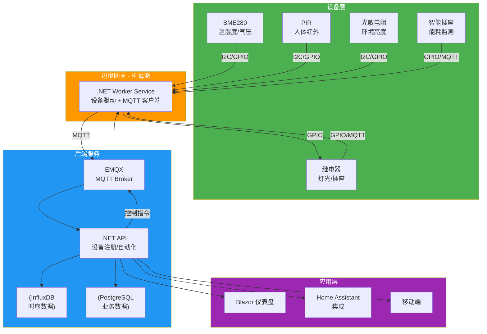
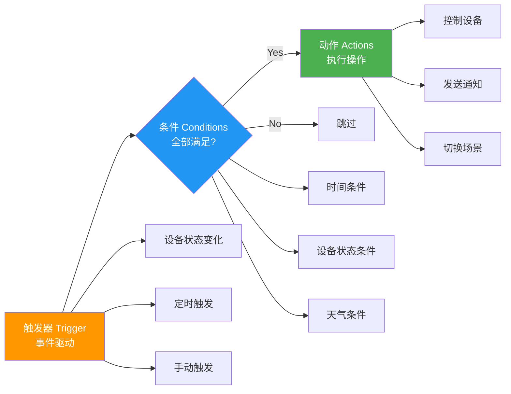

# 智能家居系统

从传感器到执行器，从数据采集到自动控制，智能家居是 IoT 技术最贴近生活的完整闭环。本文用 .NET 构建一个生产级智能家居系统：BME280 采集环境数据、PIR 检测人体移动、继电器控制灯光，通过规则引擎实现"有人+暗→开灯"的自动化场景。

## 1. 系统架构



## 2. 设备注册服务

### 2.1 数据模型

```csharp
// 设备注册模型
public class Device
{
    public string Id { get; set; }           // device-bme280-001
    public string Name { get; set; }         = "客厅温湿度"
    public string Type { get; set; }         = "BME280"  // BME280 / PIR / Relay / SmartPlug
    public string Room { get; set; }         = "LivingRoom"
    public string Zone { get; set; }         = "FirstFloor"
    public DeviceStatus Status { get; set; } = DeviceStatus.Offline
    public DateTime LastSeen { get; set; }
    public Dictionary<string, object> Properties { get; set; } = new();
    public List<string> Capabilities { get; set; } = new();  // temperature, humidity, motion, switch
}

public enum DeviceStatus { Online, Offline, Error }

// 房间与区域
public class Room
{
    public string Id { get; set; }
    public string Name { get; set; }
    public string Zone { get; set; }
    public List<string> DeviceIds { get; set; } = new();
}
```

### 2.2 设备注册 API

```csharp
[ApiController]
[Route("api/devices")]
public class DevicesController : ControllerBase
{
    private readonly IDeviceRegistry _registry;

    public DevicesController(IDeviceRegistry registry) => _registry = registry;

    [HttpGet]
    public async Task<ActionResult<List<Device>>> GetAll(
        [FromQuery] string? room, [FromQuery] string? type)
    {
        var devices = await _registry.GetAllAsync(room, type);
        return Ok(devices);
    }

    [HttpGet("{id}")]
    public async Task<ActionResult<Device>> Get(string id)
    {
        var device = await _registry.GetByIdAsync(id);
        return device is null ? NotFound() : Ok(device);
    }

    [HttpPost]
    public async Task<ActionResult<Device>> Register([FromBody] Device device)
    {
        device.Id ??= $"device-{device.Type.ToLower()}-{Guid.NewGuid():N}[..8]}";
        device.Status = DeviceStatus.Offline;
        await _registry.RegisterAsync(device);
        return CreatedAtAction(nameof(Get), new { id = device.Id }, device);
    }

    [HttpDelete("{id}")]
    public async Task<IActionResult> Unregister(string id)
    {
        await _registry.UnregisterAsync(id);
        return NoContent();
    }

    [HttpPut("{id}/status")]
    public async Task<IActionResult> UpdateStatus(string id, [FromBody] DeviceStatus status)
    {
        await _registry.UpdateStatusAsync(id, status);
        return NoContent();
    }
}
```

## 3. 自动化引擎

### 3.1 规则模型：触发→条件→动作



### 3.2 自动化规则定义

```csharp
public class AutomationRule
{
    public string Id { get; set; }
    public string Name { get; set; }
    public string Description { get; set; }
    public bool Enabled { get; set; } = true;
    public ITrigger Trigger { get; set; }
    public List<ICondition> Conditions { get; set; } = new();
    public List<IAction> Actions { get; set; } = new();
}

// 触发器
public interface ITrigger
{
    string Type { get; }
    Task SubscribeAsync(Func<TriggerContext, Task> onTriggered);
}

public record DeviceStateTrigger(string DeviceId, string Capability, object? Value)
    : ITrigger
{
    public string Type => "DeviceState";

    public async Task SubscribeAsync(Func<TriggerContext, Task> onTriggered)
    {
        // 由 MqttAutomationBridge 订阅设备状态变化并调用 onTriggered
        await Task.CompletedTask;
    }
}

public record TimeTrigger(string Cron) : ITrigger
{
    public string Type => "Time";
    public async Task SubscribeAsync(Func<TriggerContext, Task> onTriggered)
    {
        // 由定时调度器触发
        await Task.CompletedTask;
    }
}

// 条件
public interface ICondition
{
    string Type { get; }
    Task<bool> EvaluateAsync(TriggerContext context);
}

public record DeviceStateCondition(
    string DeviceId, string Capability, ComparisonOperator Op, object Value
) : ICondition
{
    public string Type => "DeviceState";

    public async Task<bool> EvaluateAsync(TriggerContext context)
    {
        var current = context.GetDeviceState(DeviceId, Capability);
        return CompareValues(current, Op, Value);
    }

    private static bool CompareValues(object? current, ComparisonOperator op, object target) => op switch
    {
        ComparisonOperator.Equals => current?.Equals(target) ?? false,
        ComparisonOperator.GreaterThan => Convert.ToDouble(current) > Convert.ToDouble(target),
        ComparisonOperator.LessThan => Convert.ToDouble(current) < Convert.ToDouble(target),
        _ => false
    };
}

public record TimeCondition(TimeSpan After, TimeSpan Before) : ICondition
{
    public string Type => "TimeRange";
    public Task<bool> EvaluateAsync(TriggerContext context)
    {
        var now = DateTime.Now.TimeOfDay;
        return Task.FromResult(now >= After && now <= Before);
    }
}

// 动作
public interface IAction
{
    string Type { get; }
    Task ExecuteAsync(TriggerContext context);
}

public record DeviceControlAction(string DeviceId, string Capability, object Value)
    : IAction
{
    public string Type => "DeviceControl";

    public async Task ExecuteAsync(TriggerContext context)
    {
        // 通过 MQTT 发送控制指令
        await context.SendCommandAsync(DeviceId, Capability, Value);
    }
}

public record NotifyAction(string Message, string Channel = "default") : IAction
{
    public string Type => "Notify";
    public async Task ExecuteAsync(TriggerContext context)
    {
        Console.WriteLine($"[Notify:{Channel}] {Message}");
        await Task.CompletedTask;
    }
}

public enum ComparisonOperator { Equals, GreaterThan, LessThan, NotEquals }
```

### 3.3 自动化引擎核心

```csharp
public class AutomationEngine
{
    private readonly List<AutomationRule> _rules = new();
    private readonly IServiceProvider _serviceProvider;

    public AutomationEngine(IServiceProvider serviceProvider) =>
        _serviceProvider = serviceProvider;

    public void AddRule(AutomationRule rule)
    {
        if (!rule.Enabled) return;
        _rules.Add(rule);
        _ = StartListeningAsync(rule);
    }

    private async Task StartListeningAsync(AutomationRule rule)
    {
        await rule.Trigger.SubscribeAsync(async context =>
        {
            // 评估所有条件
            foreach (var condition in rule.Conditions)
            {
                if (!await condition.EvaluateAsync(context))
                    return; // 条件不满足，跳过
            }

            // 执行所有动作
            foreach (var action in rule.Actions)
            {
                try { await action.ExecuteAsync(context); }
                catch (Exception ex)
                {
                    Console.Error.WriteLine($"自动化动作执行失败 [{rule.Name}]: {ex.Message}");
                }
            }
        });
    }
}
```

### 3.4 经典自动化场景

```csharp
// 场景 1：有人 + 暗 → 开灯
var motionLightRule = new AutomationRule
{
    Id = "auto-motion-light",
    Name = "人来灯亮",
    Description = "PIR 检测到人体移动且环境暗时自动开灯",
    Trigger = new DeviceStateTrigger("device-pir-living", "motion", true),
    Conditions =
    {
        new DeviceStateCondition("device-light-living", "illuminance", ComparisonOperator.LessThan, 50),
        new TimeCondition(TimeSpan.FromHours(18), TimeSpan.FromHours(7)) // 18:00-07:00
    },
    Actions =
    {
        new DeviceControlAction("device-relay-living", "switch", true),   // 开灯
        new NotifyAction("客厅灯光已自动开启")
    }
};

// 场景 2：温度过高 → 开空调
var tempAcRule = new AutomationRule
{
    Id = "auto-temp-ac",
    Name = "高温开空调",
    Trigger = new DeviceStateTrigger("device-bme280-living", "temperature", null),
    Conditions =
    {
        new DeviceStateCondition("device-bme280-living", "temperature",
            ComparisonOperator.GreaterThan, 28.0)
    },
    Actions =
    {
        new DeviceControlAction("device-ac-living", "power", true),
        new DeviceControlAction("device-ac-living", "setpoint", 26.0),
        new NotifyAction("客厅温度过高，已开启空调 26°C")
    }
};

// 场景 3：离家模式 — 关闭所有灯光和空调
var awayModeRule = new AutomationRule
{
    Id = "auto-away-mode",
    Name = "离家模式",
    Trigger = new DeviceStateTrigger("device-presence", "home", false),
    Conditions = { },
    Actions =
    {
        new DeviceControlAction("device-relay-living", "switch", false),
        new DeviceControlAction("device-relay-bedroom", "switch", false),
        new DeviceControlAction("device-ac-living", "power", false),
        new NotifyAction("离家模式已激活：灯光和空调已关闭")
    }
};
```

## 4. Home Assistant 集成

Home Assistant 是最流行的开源智能家居平台，通过 REST API 与 .NET 后端集成。

```csharp
public class HomeAssistantClient
{
    private readonly HttpClient _http;
    private readonly string _baseUrl;

    public HomeAssistantClient(HttpClient http, string baseUrl, string token)
    {
        _http = http;
        _baseUrl = baseUrl.TrimEnd('/');
        _http.DefaultRequestHeaders.Add("Authorization", $"Bearer {token}");
    }

    // 获取实体状态
    public async Task<HaState?> GetStateAsync(string entityId)
    {
        return await _http.GetFromJsonAsync<HaState>(
            $"{_baseUrl}/api/states/{entityId}");
    }

    // 调用服务（控制设备）
    public async Task CallServiceAsync(string domain, string service, object data)
    {
        var response = await _http.PostAsJsonAsync(
            $"{_baseUrl}/api/services/{domain}/{service}", data);
        response.EnsureSuccessStatusCode();
    }

    // 开灯
    public async Task TurnOnLightAsync(string entityId, int? brightness = null)
    {
        var data = new Dictionary<string, object> { ["entity_id"] = entityId };
        if (brightness.HasValue)
            data["brightness"] = brightness.Value;

        await CallServiceAsync("light", "turn_on", data);
    }

    // Webhook 事件触发
    public async Task TriggerWebhookAsync(string webhookId, object payload)
    {
        await _http.PostAsJsonAsync(
            $"{_baseUrl}/api/webhook/{webhookId}", payload);
    }
}

public record HaState(
    string EntityId, string State,
    Dictionary<string, object> Attributes,
    DateTime LastChanged);
```

## 5. 能耗监测

```csharp
public class EnergyMonitorService
{
    private readonly InfluxDbService _influxDb;

    public EnergyMonitorService(InfluxDbService influxDb) => _influxDb = influxDb;

    // 记录智能插座能耗数据
    public async Task RecordPowerAsync(string plugId, double powerW, double energyWh)
    {
        var data = new SensorData(plugId, "energy", powerW, energyWh, DateTime.UtcNow);
        await _influxDb.WriteBatchAsync(new[] { data });
    }

    // 计算日能耗
    public async Task<DailyEnergyReport> GetDailyReportAsync(DateTime date)
    {
        var flux = $"""
            from(bucket: "iot-data")
              |> range(start: {date:yyyy-MM-dd}T00:00:00Z, stop: {date.AddDays(1):yyyy-MM-dd}T00:00:00Z)
              |> filter(fn: (r) => r._measurement == "energy" and r._field == "energy_wh")
              |> integral(unit: 1h)
            """;

        var results = await _influxDb.QueryAggregateAsync("energy", "24h", "1h");
        return new DailyEnergyReport(date, results);
    }
}

public record DailyEnergyReport(DateTime Date, List<AggregatedResult> HourlyData);
```

## 6. 部署：Docker Compose

```yaml
# docker-compose.yml
version: "3.8"
services:
  # .NET 后端 API
  smart-home-api:
    build:
      context: .
      dockerfile: src/SmartHome.Api/Dockerfile
    ports:
      - "8080:8080"
    environment:
      - MQTT__Host=emqx
      - MQTT__Port=1883
      - InfluxDB__Url=http://influxdb:8086
      - InfluxDB__Token=${INFLUX_TOKEN}
      - ConnectionStrings__Postgres=Host=postgres;Database=smarthome;Username=smarthome;Password=${PG_PASSWORD}
    depends_on:
      - emqx
      - influxdb
      - postgres

  # .NET 边缘网关（树莓派）
  smart-home-gateway:
    build:
      context: .
      dockerfile: src/SmartHome.Gateway/Dockerfile
    environment:
      - MQTT__Host=emqx
      - MQTT__Port=1883
    depends_on:
      - emqx
    # 仅在树莓派上运行
    profiles: ["edge"]

  # EMQX MQTT Broker
  emqx:
    image: emqx/emqx:5.1
    ports:
      - "1883:1883"
      - "18083:18083"  # 管理界面
    volumes:
      - emqx-data:/opt/emqx/data

  # InfluxDB 时序数据库
  influxdb:
    image: influxdb:2.7
    ports:
      - "8086:8086"
    volumes:
      - influxdb-storage:/var/lib/influxdb2

  # PostgreSQL 业务数据库
  postgres:
    image: postgres:16
    environment:
      POSTGRES_DB: smarthome
      POSTGRES_USER: smarthome
      POSTGRES_PASSWORD: ${PG_PASSWORD}
    volumes:
      - pg-data:/var/lib/postgresql/data

  # Grafana 可视化
  grafana:
    image: grafana/grafana:latest
    ports:
      - "3000:3000"
    environment:
      GF_SECURITY_ADMIN_PASSWORD: ${GRAFANA_PASSWORD}
    volumes:
      - grafana-storage:/var/lib/grafana

volumes:
  emqx-data:
  influxdb-storage:
  pg-data:
  grafana-storage:
```

## 7. 项目结构

```
SmartHome/
├── src/
│   ├── SmartHome.Api/              # ASP.NET Core Web API
│   │   ├── Controllers/
│   │   ├── Services/
│   │   └── Program.cs
│   ├── SmartHome.Gateway/          # 树莓派边缘网关
│   │   ├── Drivers/                # BME280, PIR, Relay 驱动
│   │   ├── Services/
│   │   └── Program.cs
│   ├── SmartHome.Automation/       # 自动化引擎
│   │   ├── Models/                 # Rule, Trigger, Condition, Action
│   │   ├── Engine/
│   │   └── Presets/                # 预置自动化场景
│   ├── SmartHome.Dashboard/        # Blazor 仪表盘
│   └── SmartHome.Common/           # 共享模型和工具
├── docker-compose.yml
├── rules.json                      # 自动化规则配置
└── README.md
```

## 8. 物料清单

| 组件 | 型号 | 数量 | 单价(¥) | 用途 |
|------|------|------|---------|------|
| 主板 | 树莓派 4B 4GB | 1 | ~350 | 边缘网关 |
| 温湿度 | BME280 模块 | 3 | ~15 | 各房间环境监测 |
| 人体红外 | HC-SR501 PIR | 3 | ~5 | 各房间人体检测 |
| 光敏 | 光敏电阻模块 | 3 | ~3 | 环境亮度检测 |
| 继电器 | 5V 继电器模块 | 3 | ~5 | 灯光/插座控制 |
| 智能插座 | 涂鸦 Wi-Fi 插座 | 3 | ~40 | 能耗监测 |
| 杜邦线 | 母对母 20cm | 1 套 | ~10 | 连接线 |
| 面包板 | 830 孔 | 2 | ~10 | 原型搭建 |
| **合计** | | | **~540** | |

## 9. 时间线估算

| 阶段 | 内容 | 周期 |
|------|------|------|
| 第 1 周 | 硬件接线 + 传感器驱动验证 | 1 周 |
| 第 2 周 | MQTT 通信 + 后端 API + 设备注册 | 1 周 |
| 第 3 周 | 自动化引擎 + 规则配置 | 1 周 |
| 第 4 周 | Blazor 仪表盘 + Home Assistant 集成 | 1 周 |
| 第 5 周 | Docker 部署 + 联调 + 测试 | 1 周 |

::: warning 从原型到量产的鸿沟
本文是学习项目，使用面包板和杜邦线。实际智能家居产品还需要：**3D 打印外壳**（安全隔离强电）、**PCB 设计**（从面包板到定制板）、**CE/FCC 认证**（合规要求）、**强电隔离**（继电器驱动电路必须光电隔离）。安全第一！
:::

> 参考：[Home Assistant 官方文档](https://www.home-assistant.io/docs/) | [BME280 .NET 驱动](https://github.com/dotnet/iot/tree/main/src/devices/Bme280) | [EMQX Docker 部署](https://www.emqx.io/docs/zh/latest/deploy/install-docker.html)

## 面试技巧

1. **"智能家居的自动化怎么设计？"** —— 三要素模型：触发器（事件驱动）→条件（布尔判断）→动作（执行操作）。重点讲为什么需要"条件"：触发器只说"什么时候检查"，条件才决定"是否执行"。比如"有人移动"是触发器，"且环境暗"是条件。

2. **"设备注册和发现怎么做？"** —— 两种模式：**手动注册**（API 显式添加，适合固定设备）和**自动发现**（设备上电后广播身份，后端自动注册）。面试加分：提到 mDNS/SSDP 协议用于局域网自动发现。

3. **"Home Assistant 集成有什么价值？"** —— HA 提供现成的设备集成（1000+ 组件）、语音助手、移动端 App。.NET 后端专注业务逻辑和数据分析，HA 专注设备接入和用户体验。二者互补不是替代。

4. **"智能家居的安全风险？"** —— 继电器控制强电，必须**光电隔离**；MQTT 默认无认证，必须启用 TLS + 用户名密码；设备 OTA 更新必须签名验证；远程访问必须走 VPN/隧道，不要暴露端口到公网。

5. **"能耗监测怎么做？"** —— 智能插座上报实时功率（W）和累计电量（Wh），写入 InfluxDB。用 Flux 做积分运算算日能耗，Grafana 展示趋势图。面试加分：提到阶梯电价计算和峰谷分析。
