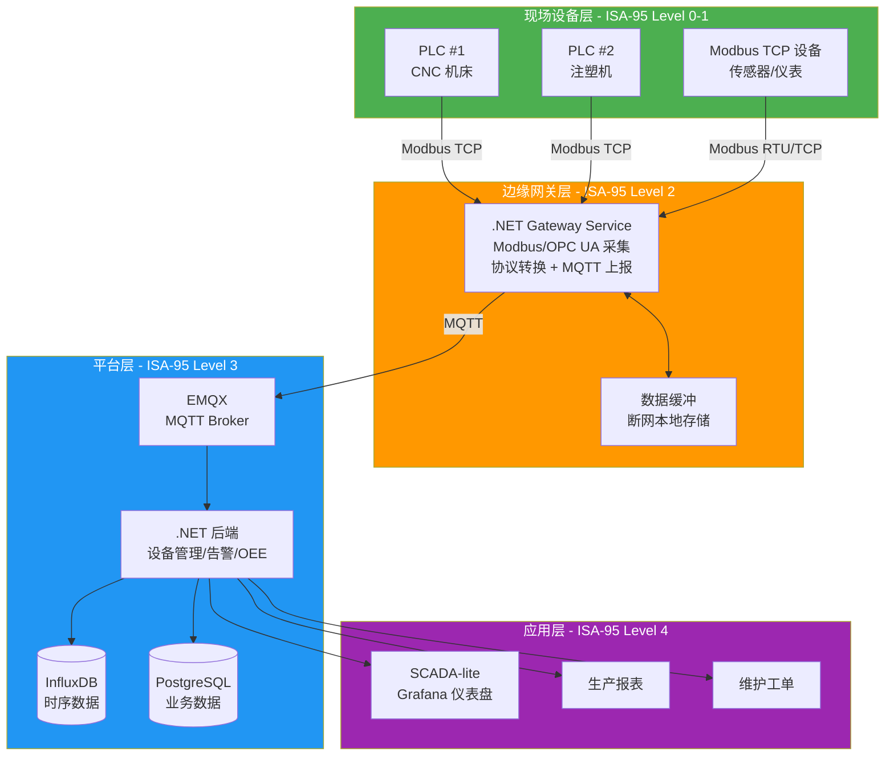
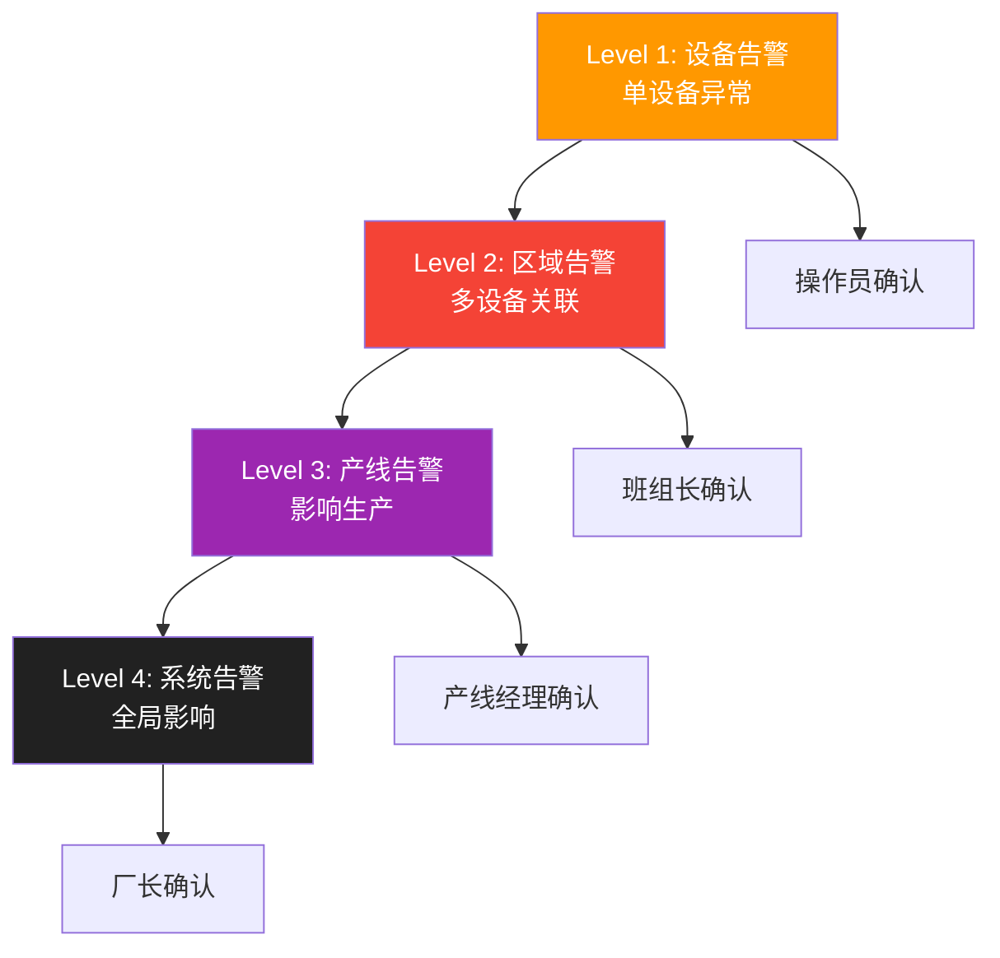
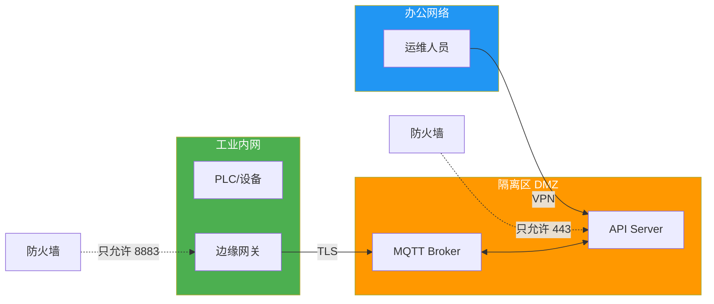

# 工业设备监控

工业物联网（IIoT）的核心诉求是**可靠性**——设备 7×24 运行，1 秒断网可能导致产线停机。本文用 .NET 构建工业设备监控系统：Modbus TCP 采集 PLC 数据、实时设备状态追踪、OEE 计算、告警分级管理，以及 SCADA-lite 可视化。

## 1. 系统架构



::: important ISA-95 参考架构
ISA-95 定义了企业与控制系统的集成层级：Level 0（物理过程）→ Level 1（传感/执行）→ Level 2（监控）→ Level 3（制造运营）→ Level 4（业务计划）。工业 IoT 网关通常在 Level 2-3 之间，连接 OT（操作技术）和 IT（信息技术）。
:::

## 2. Modbus TCP 数据采集

### 2.1 采集服务

```csharp
// NuGet: NModbus
using NModbus;
using System.Net.Sockets;

public class ModbusPollingService : BackgroundService
{
    private readonly ILogger<ModbusPollingService> _logger;
    private readonly List<DevicePollConfig> _pollConfigs;

    public ModbusPollingService(
        ILogger<ModbusPollingService> logger,
        IEnumerable<DevicePollConfig> pollConfigs)
    {
        _logger = logger;
        _pollConfigs = pollConfigs.ToList();
    }

    protected override async Task ExecuteAsync(CancellationToken ct)
    {
        // 为每个设备启动独立轮询任务
        var tasks = _pollConfigs.Select(config =>
            PollDeviceAsync(config, ct));

        await Task.WhenAll(tasks);
    }

    private async Task PollDeviceAsync(DevicePollConfig config, CancellationToken ct)
    {
        using var tcpClient = new TcpClient();
        var factory = new ModbusFactory();
        var master = factory.CreateMaster(tcpClient);

        while (!ct.IsCancellationRequested)
        {
            try
            {
                if (!tcpClient.Connected)
                {
                    await tcpClient.ConnectAsync(config.IpAddress, config.Port);
                    _logger.LogInformation("已连接 Modbus 设备 {Ip}:{Port}",
                        config.IpAddress, config.Port);
                }

                foreach (var register in config.Registers)
                {
                    var values = register.Type switch
                    {
                        RegisterType.HoldingRegister =>
                            await master.ReadHoldingRegistersAsync(
                                config.SlaveId, register.StartAddress, register.Count),
                        RegisterType.InputRegister =>
                            await master.ReadInputRegistersAsync(
                                config.SlaveId, register.StartAddress, register.Count),
                        RegisterType.Coil =>
                            (await master.ReadCoilsAsync(
                                config.SlaveId, register.StartAddress, register.Count))
                            .Select(b => b ? (ushort)1 : (ushort)0).ToArray(),
                        _ => Array.Empty<ushort>()
                    };

                    var payload = new RegisterData(
                        config.DeviceId, register.Name, values, DateTime.UtcNow);

                    // 发布到 MQTT
                    await PublishAsync(payload, ct);
                }

                await Task.Delay(config.PollInterval, ct);
            }
            catch (Exception ex) when (ex is not OperationCanceledException)
            {
                _logger.LogError(ex, "Modbus 轮询失败 {Device}", config.DeviceId);
                tcpClient.Close();
                await Task.Delay(TimeSpan.FromSeconds(5), ct); // 5 秒后重连
            }
        }
    }

    private async Task PublishAsync(RegisterData data, CancellationToken ct)
    {
        // MQTT 发布逻辑（注入 IMqttClient）
        await Task.CompletedTask;
    }
}

// 设备轮询配置
public class DevicePollConfig
{
    public string DeviceId { get; set; }
    public string IpAddress { get; set; }
    public int Port { get; set; } = 502;
    public byte SlaveId { get; set; } = 1;
    public TimeSpan PollInterval { get; set; } = TimeSpan.FromSeconds(1);
    public List<RegisterConfig> Registers { get; set; } = new();
}

public class RegisterConfig
{
    public string Name { get; set; }       // temperature, pressure, status
    public RegisterType Type { get; set; }
    public ushort StartAddress { get; set; }
    public ushort Count { get; set; } = 1;
}

public enum RegisterType { HoldingRegister, InputRegister, Coil }

public record RegisterData(string DeviceId, string RegisterName, ushort[] Values, DateTime Timestamp);
```

### 2.2 配置化采集

```json
// modbus-config.json — 可配置的 Modbus 采集规则
[
  {
    "DeviceId": "cnc-machine-01",
    "IpAddress": "192.168.1.101",
    "Port": 502,
    "SlaveId": 1,
    "PollInterval": "00:00:01",
    "Registers": [
      { "Name": "temperature", "Type": "InputRegister", "StartAddress": 0, "Count": 1 },
      { "Name": "spindle_speed", "Type": "InputRegister", "StartAddress": 1, "Count": 1 },
      { "Name": "status", "Type": "HoldingRegister", "StartAddress": 100, "Count": 1 },
      { "Name": "alarm_code", "Type": "HoldingRegister", "StartAddress": 101, "Count": 1 },
      { "Name": "part_count", "Type": "HoldingRegister", "StartAddress": 200, "Count": 2 }
    ]
  },
  {
    "DeviceId": "injection-molder-01",
    "IpAddress": "192.168.1.102",
    "Port": 502,
    "SlaveId": 1,
    "PollInterval": "00:00:00.500",
    "Registers": [
      { "Name": "mold_temperature", "Type": "InputRegister", "StartAddress": 0, "Count": 1 },
      { "Name": "injection_pressure", "Type": "InputRegister", "StartAddress": 1, "Count": 1 },
      { "Name": "cycle_count", "Type": "HoldingRegister", "StartAddress": 50, "Count": 2 },
      { "Name": "running", "Type": "Coil", "StartAddress": 0, "Count": 1 }
    ]
  }
]
```

::: tip OPC UA 替代方案
Modbus 简单但功能有限（无安全认证、无数据模型）。OPC UA 是工业 4.0 标准协议，支持：**安全通道**（证书+加密）、**信息模型**（节点/方法/事件）、**订阅模式**（数据变化时推送，无需轮询）。.NET 用 OPC Foundation 的 [OPC UA SDK](https://opcfoundation.org/developer-tools/solutions-net) 集成。新项目优先考虑 OPC UA。
:::

## 3. 设备状态管理

```csharp
public enum EquipmentStatus
{
    Running,    // 运行中
    Idle,       // 空闲
    Alarm,      // 告警
    Offline     // 离线
}

public class EquipmentStatusTracker
{
    private readonly Dictionary<string, EquipmentState> _states = new();
    private readonly TimeSpan _offlineThreshold = TimeSpan.FromMinutes(2);

    public void UpdateDevice(string deviceId, Dictionary<string, ushort> registers)
    {
        var status = DetermineStatus(registers);
        var now = DateTime.UtcNow;

        if (!_states.ContainsKey(deviceId))
            _states[deviceId] = new EquipmentState(deviceId);

        var prev = _states[deviceId];
        prev.PreviousStatus = prev.CurrentStatus;
        prev.CurrentStatus = status;
        prev.LastUpdate = now;

        // 状态变化事件
        if (prev.PreviousStatus != prev.CurrentStatus)
        {
            OnStatusChanged?.Invoke(deviceId, prev.PreviousStatus, prev.CurrentStatus);
        }
    }

    // 定时检查离线设备
    public void CheckOfflineDevices()
    {
        var now = DateTime.UtcNow;
        foreach (var (id, state) in _states)
        {
            if (state.CurrentStatus != EquipmentStatus.Offline &&
                now - state.LastUpdate > _offlineThreshold)
            {
                state.PreviousStatus = state.CurrentStatus;
                state.CurrentStatus = EquipmentStatus.Offline;
                OnStatusChanged?.Invoke(id, state.PreviousStatus, EquipmentStatus.Offline);
            }
        }
    }

    private EquipmentStatus DetermineStatus(Dictionary<string, ushort> registers)
    {
        if (registers.TryGetValue("alarm_code", out var alarm) && alarm != 0)
            return EquipmentStatus.Alarm;

        if (registers.TryGetValue("running", out var running))
            return running == 1 ? EquipmentStatus.Running : EquipmentStatus.Idle;

        if (registers.TryGetValue("status", out var status))
            return status switch
            {
                1 => EquipmentStatus.Running,
                2 => EquipmentStatus.Idle,
                3 => EquipmentStatus.Alarm,
                _ => EquipmentStatus.Offline
            };

        return EquipmentStatus.Offline;
    }

    public event Action<string, EquipmentStatus, EquipmentStatus>? OnStatusChanged;
}

public class EquipmentState
{
    public string DeviceId { get; }
    public EquipmentStatus CurrentStatus { get; set; } = EquipmentStatus.Offline;
    public EquipmentStatus PreviousStatus { get; set; } = EquipmentStatus.Offline;
    public DateTime LastUpdate { get; set; }

    public EquipmentState(string deviceId) => DeviceId = deviceId;
}
```

## 4. OEE 计算

OEE（Overall Equipment Effectiveness，设备综合效率）是工业生产最核心的指标：

$$OEE = Availability \times Performance \times Quality$$

| 指标 | 计算公式 | 含义 |
|------|----------|------|
| 可用率 A | 运行时间 / 计划生产时间 | 设备有没有在干活 |
| 性能率 P | 实际产量 / 理论产量 | 干得快不快 |
| 质量率 Q | 合格品数 / 总产量 | 干得好不好 |

```csharp
public class OeeCalculator
{
    // 计算 OEE
    public OeeResult Calculate(
        TimeSpan plannedTime,      // 计划生产时间
        TimeSpan runTime,          // 实际运行时间
        int actualOutput,          // 实际产量
        int theoreticalOutput,     // 理论产量（按最大速度）
        int goodParts,             // 合格品数
        int totalParts)            // 总产量
    {
        var availability = plannedTime.TotalSeconds > 0
            ? runTime.TotalSeconds / plannedTime.TotalSeconds
            : 0;

        var performance = theoreticalOutput > 0
            ? (double)actualOutput / theoreticalOutput
            : 0;

        var quality = totalParts > 0
            ? (double)goodParts / totalParts
            : 0;

        var oee = availability * performance * quality;

        return new OeeResult(availability, performance, quality, oee);
    }
}

public record OeeResult(
    double Availability, double Performance, double Quality, double Oee)
{
    public string Summary =>
        $"OEE: {Oee:P1} (A={Availability:P1}, P={Performance:P1}, Q={Quality:P1})";
}
```

```csharp
// 使用示例
var calculator = new OeeCalculator();

// 8 小时班次：计划 480 分钟，实际运行 420 分钟（60 分钟停机）
// 理论产量 600 件（1.25 件/分钟 × 480），实际产出 500 件
// 总产量 500 件，合格 480 件
var result = calculator.Calculate(
    plannedTime: TimeSpan.FromMinutes(480),
    runTime: TimeSpan.FromMinutes(420),
    actualOutput: 500,
    theoreticalOutput: 600,
    goodParts: 480,
    totalParts: 500);

// OEE: 68.0% (A=87.5%, P=83.3%, Q=96.0%)
Console.WriteLine(result.Summary);
```

::: warning OEE 的常见陷阱
- **世界级 OEE = 85%** 不是目标，是参考基准。不同行业差异很大（离散制造 vs 流程工业）
- **不要单独看 OEE**：OEE=0 可能是计划停机（A=0），需要结合班次和排产分析
- **数据粒度**：班次级 OEE 隐藏了细节，需要分钟级分析找到瓶颈
:::

## 5. 告警管理

### 5.1 告警层级



### 5.2 告警模型与升级

```csharp
public class Alarm
{
    public string Id { get; set; } = Guid.NewGuid().ToString();
    public string DeviceId { get; set; }
    public int AlarmCode { get; set; }
    public string Message { get; set; }
    public AlarmSeverity Severity { get; set; }
    public AlarmState State { get; set; } = AlarmState.Active;
    public DateTime TriggeredAt { get; set; } = DateTime.UtcNow;
    public DateTime? AcknowledgedAt { get; set; }
    public string? AcknowledgedBy { get; set; }
    public DateTime? ClearedAt { get; set; }
}

public enum AlarmSeverity { Low, Medium, High, Critical }
public enum AlarmState { Active, Acknowledged, Cleared }

public class AlarmManager
{
    private readonly List<Alarm> _activeAlarms = new();
    private readonly Dictionary<AlarmSeverity, TimeSpan> _escalationTimeouts = new()
    {
        [AlarmSeverity.Low] = TimeSpan.FromHours(4),
        [AlarmSeverity.Medium] = TimeSpan.FromHours(1),
        [AlarmSeverity.High] = TimeSpan.FromMinutes(15),
        [AlarmSeverity.Critical] = TimeSpan.FromMinutes(5)
    };

    public Alarm TriggerAlarm(string deviceId, int code, string message, AlarmSeverity severity)
    {
        // 去重：同一设备同一告警码不重复创建
        var existing = _activeAlarms.FirstOrDefault(a =>
            a.DeviceId == deviceId && a.AlarmCode == code && a.State == AlarmState.Active);

        if (existing is not null) return existing;

        var alarm = new Alarm
        {
            DeviceId = deviceId,
            AlarmCode = code,
            Message = message,
            Severity = severity
        };

        _activeAlarms.Add(alarm);
        OnAlarmTriggered?.Invoke(alarm);
        return alarm;
    }

    public void Acknowledge(string alarmId, string userId)
    {
        var alarm = _activeAlarms.FirstOrDefault(a => a.Id == alarmId);
        if (alarm is null) return;

        alarm.State = AlarmState.Acknowledged;
        alarm.AcknowledgedAt = DateTime.UtcNow;
        alarm.AcknowledgedBy = userId;
    }

    public void Clear(string alarmId)
    {
        var alarm = _activeAlarms.FirstOrDefault(a => a.Id == alarmId);
        if (alarm is null) return;

        alarm.State = AlarmState.Cleared;
        alarm.ClearedAt = DateTime.UtcNow;
        _activeAlarms.Remove(alarm);
    }

    // 检查是否需要升级
    public void CheckEscalation()
    {
        var now = DateTime.UtcNow;
        foreach (var alarm in _activeAlarms.Where(a => a.State == AlarmState.Active))
        {
            var timeout = _escalationTimeouts[alarm.Severity];
            if (now - alarm.TriggeredAt > timeout)
            {
                alarm.Severity = alarm.Severity switch
                {
                    AlarmSeverity.Low => AlarmSeverity.Medium,
                    AlarmSeverity.Medium => AlarmSeverity.High,
                    AlarmSeverity.High => AlarmSeverity.Critical,
                    _ => alarm.Severity
                };
                OnAlarmEscalated?.Invoke(alarm);
            }
        }
    }

    public event Action<Alarm>? OnAlarmTriggered;
    public event Action<Alarm>? OnAlarmEscalated;
}
```

## 6. 可靠性设计

### 6.1 Watchdog 与自动重连

```csharp
public class ReliableModbusClient
{
    private TcpClient? _tcpClient;
    private IModbusMaster? _master;
    private readonly DevicePollConfig _config;
    private int _consecutiveFailures;
    private readonly int _maxRetries = 3;

    public ReliableModbusClient(DevicePollConfig config) => _config = config;

    public async Task<ushort[]> ReadRegistersAsync(
        RegisterType type, ushort start, ushort count, CancellationToken ct)
    {
        for (var attempt = 0; attempt < _maxRetries; attempt++)
        {
            try
            {
                await EnsureConnectedAsync(ct);

                var result = type switch
                {
                    RegisterType.HoldingRegister =>
                        await _master!.ReadHoldingRegistersAsync(_config.SlaveId, start, count),
                    RegisterType.InputRegister =>
                        await _master!.ReadInputRegistersAsync(_config.SlaveId, start, count),
                    _ => throw new ArgumentException($"不支持的寄存器类型: {type}")
                };

                _consecutiveFailures = 0;
                return result;
            }
            catch (Exception ex) when (ex is not OperationCanceledException)
            {
                _consecutiveFailures++;
                Console.Error.WriteLine(
                    $"读取失败 [{attempt + 1}/{_maxRetries}]: {ex.Message}");

                // 关闭损坏的连接
                Disconnect();

                if (attempt < _maxRetries - 1)
                    await Task.Delay(TimeSpan.FromSeconds(Math.Pow(2, attempt)), ct); // 指数退避
            }
        }

        throw new InvalidOperationException(
            $"设备 {_config.DeviceId} 连续 {_maxRetries} 次读取失败");
    }

    private async Task EnsureConnectedAsync(CancellationToken ct)
    {
        if (_tcpClient?.Connected == true) return;

        _tcpClient = new TcpClient();
        await _tcpClient.ConnectAsync(_config.IpAddress, _config.Port, ct);

        var factory = new ModbusFactory();
        _master = factory.CreateMaster(_tcpClient);
        _master.Transport.ReadTimeout = 5000;
        _master.Transport.WriteTimeout = 5000;
    }

    private void Disconnect()
    {
        _master = null;
        _tcpClient?.Close();
        _tcpClient = null;
    }
}
```

### 6.2 断网数据缓冲

```csharp
// 断网时数据本地缓存，恢复后自动上传
public class DataBufferService
{
    private readonly string _bufferDir;
    private readonly IMqttClient _mqttClient;
    private readonly ILogger<DataBufferService> _logger;
    private bool _isConnected;

    public DataBufferService(IMqttClient mqttClient, ILogger<DataBufferService> logger)
    {
        _mqttClient = mqttClient;
        _logger = logger;
        _bufferDir = Path.Combine(AppContext.BaseDirectory, "data-buffer");
        Directory.CreateDirectory(_bufferDir);

        _mqttClient.UseConnectedHandler(_ => { _isConnected = true; FlushBufferAsync(); });
        _mqttClient.UseDisconnectedHandler(_ => { _isConnected = false; });
    }

    public async Task StoreOrPublishAsync(string topic, string payload)
    {
        if (_isConnected)
        {
            await _mqttClient.PublishStringAsync(topic, payload);
        }
        else
        {
            // 缓存到本地文件
            var filename = $"{DateTime.UtcNow:yyyyMMdd_HHmmss_fff}.json";
            var path = Path.Combine(_bufferDir, filename);
            await File.WriteAllTextAsync(path, $"{topic}\n{payload}");
            _logger.LogWarning("MQTT 断开，数据已缓存到 {Path}", path);
        }
    }

    private async void FlushBufferAsync()
    {
        var files = Directory.GetFiles(_bufferDir, "*.json").OrderBy(f => f);
        foreach (var file in files)
        {
            try
            {
                var lines = await File.ReadAllLinesAsync(file);
                if (lines.Length >= 2)
                {
                    await _mqttClient.PublishStringAsync(lines[0], lines[1]);
                    File.Delete(file);
                }
            }
            catch (Exception ex)
            {
                _logger.LogError(ex, "缓冲数据回放失败: {File}", file);
                break; // 回放失败，等下次
            }
        }
    }
}
```

## 7. 安全设计



| 安全措施 | 说明 |
|----------|------|
| 网络分段 | 工业内网、DMZ、办公网三层隔离 |
| VPN 访问 | 远程运维必须走 VPN，不暴露端口 |
| TLS 加密 | MQTT 连接使用 8883 端口 TLS |
| 证书认证 | 设备使用 X.509 证书双向认证 |
| 最小权限 | 每台网关只能访问其管理的设备 |

> 参考：[NModbus GitHub](https://github.com/NModbus/NModbus) | [OPC UA .NET SDK](https://opcfoundation.org/developer-tools/solutions-net) | [ISA-95 标准](https://www.isa.org/standards-and-publications/isa-standards/isa-95-standards) | [OEE 计算](https://www.oee.com/calculating-oee/)

## 面试技巧

1. **"Modbus 和 OPC UA 怎么选？"** —— Modbus 简单、通用、老设备支持好，但无安全机制、无信息模型、需要轮询。OPC UA 是工业 4.0 标准，安全+模型+订阅，但复杂度高。面试加分：说"新项目 OPC UA，老设备改造用 Modbus + 网关转换"。

2. **"OEE 怎么算？有什么坑？"** —— OEE = A × P × Q。三个坑：①不要只看 OEE 总值，要拆开看哪个因子拖后腿；②计划停机不应计入可用率分母；③数据粒度太粗会掩盖问题（班次级 vs 分钟级）。

3. **"工业 IoT 断网怎么办？"** —— 三层保障：**边缘自治**（网关本地缓存+本地控制逻辑）、**数据缓冲**（SQLite/文件缓存，恢复后回放）、**看门狗**（自动重连+指数退避）。核心原则：断网不能导致设备失控。

4. **"工业安全怎么做？"** —— 网络分段（工业内网/DMZ/办公网）、最小权限、TLS+证书、VPN 远程访问。面试时画三层网络拓扑图，强调 OT 和 IT 的安全策略不同——OT 更关注可用性（不能因为安全导致停机）。

5. **"ISA-95 是什么？和 IoT 架构什么关系？"** —— ISA-95 是企业与控制系统集成的国际标准，定义了 5 个层级。IoT 网关在 Level 2-3 之间，核心价值是打通 OT 和 IT 的数据孤岛。面试加分：提到 MES（制造执行系统）在 Level 3，ERP 在 Level 4。
