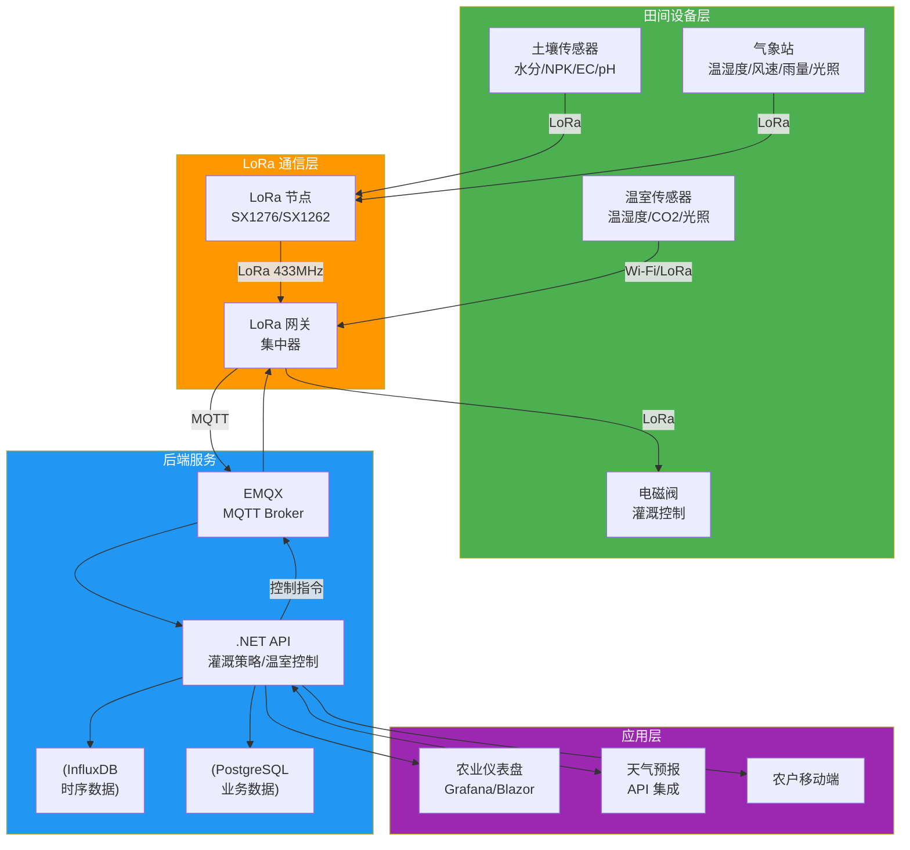
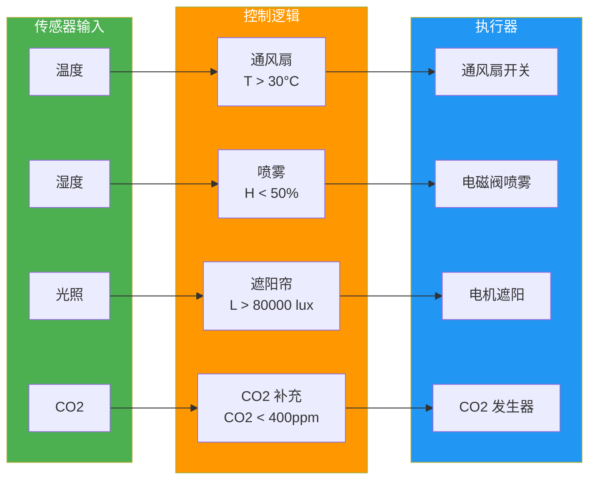
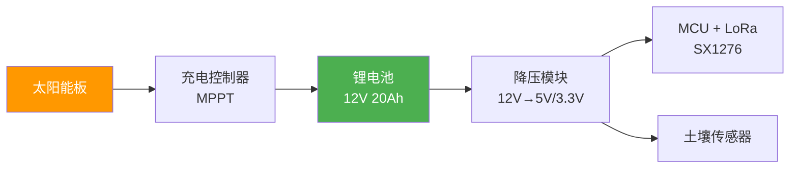

# 智慧农业物联网

农业 IoT 的核心挑战是**野外部署**：无市电、无网线、环境恶劣。土壤传感器分散在数平方公里的农田里，用 LoRa 实现远距离低功耗通信，用太阳能板自给供电。本文用 .NET 构建智慧农业系统：土壤监测驱动自动灌溉、温室环境闭环控制、作物生长模型（GDD）指导农事决策。

## 1. 系统架构



## 2. LoRa 通信

### 2.1 LoRa vs LoRaWAN

| 维度 | LoRa（私有协议） | LoRaWAN |
|------|------------------|---------|
| 网络架构 | 点对点/星型 | 星型+网络服务器 |
| 安全性 | 自定义 | AES-128 端到端加密 |
| 设备管理 | 手动 | ABP/OTAA 入网 |
| Class | 仅 Class A | Class A/B/C |
| 适用 | 小规模、快速原型 | 大规模、标准化部署 |
| 成本 | 低（自建网关） | 需网关+网络服务器 |

::: tip 农业场景 LoRa 选型建议
小型农场（< 50 节点）用私有 LoRa 足够，降低复杂度。大型农场或需要运营商网络覆盖时选 LoRaWAN。频段选择：中国用 470-510MHz（免授权），欧洲 868MHz，美国 915MHz。
:::

### 2.2 LoRa 节点数据帧

```csharp
// LoRa 数据帧格式（自定义轻量协议）
// [Header 1B][DeviceId 2B][MsgType 1B][Payload NB][CRC 2B]
public class LoRaFrame
{
    public byte Header { get; set; } = 0xAA;  // 帧头
    public ushort DeviceId { get; set; }
    public MsgType MessageType { get; set; }
    public byte[] Payload { get; set; } = Array.Empty<byte>();
    public ushort Crc { get; set; }

    public byte[] Serialize()
    {
        using var ms = new MemoryStream();
        using var writer = new BinaryWriter(ms);

        writer.Write(Header);
        writer.Write(DeviceId);
        writer.Write((byte)MessageType);
        writer.Write(Payload);
        writer.Write(Crc16(ms.ToArray()[..^0])); // CRC 不含自身

        return ms.ToArray();
    }

    public static LoRaFrame Deserialize(byte[] data)
    {
        using var ms = new MemoryStream(data);
        using var reader = new BinaryReader(ms);

        var frame = new LoRaFrame
        {
            Header = reader.ReadByte(),
            DeviceId = reader.ReadUInt16(),
            MessageType = (MsgType)reader.ReadByte()
        };

        var payloadLen = data.Length - 6; // 减去 Header(1)+DevId(2)+MsgType(1)+CRC(2)
        frame.Payload = reader.ReadBytes(payloadLen);
        frame.Crc = reader.ReadUInt16();

        return frame;
    }

    private static ushort Crc16(byte[] data)
    {
        ushort crc = 0xFFFF;
        foreach (var b in data)
        {
            crc ^= b;
            for (int i = 0; i < 8; i++)
                crc = (crc & 1) != 0 ? (ushort)((crc >> 1) ^ 0xA001) : (ushort)(crc >> 1);
        }
        return crc;
    }
}

public enum MsgType : byte
{
    SoilData = 0x01,        // 土壤数据
    WeatherData = 0x02,     // 气象数据
    GreenhouseData = 0x03,  // 温室数据
    IrrigationCmd = 0x10,   // 灌溉指令
    ValveStatus = 0x11,     // 阀门状态
    Heartbeat = 0xFF        // 心跳
}
```

## 3. 土壤监测与自动灌溉

### 3.1 土壤数据模型

```csharp
public record SoilData(
    string DeviceId,
    double Moisture,       // 土壤水分 %vol
    double Temperature,    // 土壤温度 °C
    double Ec,             // 电导率 μS/cm
    double Ph,             // pH 值
    double Nitrogen,       // 氮 mg/kg
    double Phosphorus,     // 磷 mg/kg
    double Potassium,      // 钾 mg/kg
    DateTime Timestamp
);
```

### 3.2 灌溉策略引擎

```csharp
public class IrrigationEngine
{
    private readonly IrrigationConfig _config;

    public IrrigationEngine(IrrigationConfig config) => _config = config;

    public IrrigationDecision Decide(SoilData soil, WeatherForecast? forecast)
    {
        var decision = new IrrigationDecision { ZoneId = soil.DeviceId };

        // 策略 1：土壤水分阈值
        if (soil.Moisture < _config.MoistureThreshold)
        {
            decision.ShouldIrrigate = true;
            decision.Reason = $"土壤水分 {soil.Moisture:F1}% 低于阈值 {_config.MoistureThreshold}%";
        }

        // 策略 2：天气预报 — 即将下雨则跳过灌溉
        if (decision.ShouldIrrigate && forecast is not null)
        {
            if (forecast.RainProbability > 0.6 && forecast.ExpectedRainfallMm > 5)
            {
                decision.ShouldIrrigate = false;
                decision.Reason += $" | 但预报 {forecast.ExpectedRainfallMm}mm 降雨，跳过灌溉";
            }
        }

        // 策略 3：时间窗口 — 只在允许时段灌溉（避免中午蒸发）
        if (decision.ShouldIrrigate)
        {
            var hour = DateTime.Now.Hour;
            if (hour < _config.IrrigationStartHour || hour > _config.IrrigationEndHour)
            {
                decision.ShouldIrrigate = false;
                decision.Reason += $" | 当前不在灌溉时段 ({_config.IrrigationStartHour}:00-{_config.IrrigationEndHour}:00)";
            }
        }

        // 计算灌溉量（基于缺水量）
        if (decision.ShouldIrrigate)
        {
            var deficit = _config.TargetMoisture - soil.Moisture;
            decision.DurationMinutes = (int)(deficit * _config.MinutesPerPercent);
            decision.DurationMinutes = Math.Clamp(decision.DurationMinutes,
                _config.MinDuration, _config.MaxDuration);
        }

        return decision;
    }
}

public class IrrigationConfig
{
    public double MoistureThreshold { get; set; } = 25.0;    // %vol，低于此值开始灌溉
    public double TargetMoisture { get; set; } = 35.0;        // 目标水分
    public int IrrigationStartHour { get; set; } = 5;         // 灌溉开始时段
    public int IrrigationEndHour { get; set; } = 9;           // 灌溉结束时段
    public double MinutesPerPercent { get; set; } = 2.0;      // 每 1% 缺水需要灌溉的分钟数
    public int MinDuration { get; set; } = 5;                 // 最短灌溉时间
    public int MaxDuration { get; set; } = 60;                // 最长灌溉时间
}

public class IrrigationDecision
{
    public string ZoneId { get; set; }
    public bool ShouldIrrigate { get; set; }
    public int DurationMinutes { get; set; }
    public string Reason { get; set; } = "";
}

public record WeatherForecast(
    double RainProbability,
    double ExpectedRainfallMm,
    DateTime ForecastTime);
```

### 3.3 天气预报集成

```csharp
public class WeatherService
{
    private readonly HttpClient _http;
    private readonly string _apiKey;
    private readonly string _location;

    public WeatherService(HttpClient http, string apiKey, string location)
    {
        _http = http;
        _apiKey = apiKey;
        _location = location;
    }

    public async Task<WeatherForecast?> GetForecastAsync()
    {
        try
        {
            // 使用 OpenWeatherMap 或和风天气 API
            var url = $"https://api.openweathermap.org/data/2.5/forecast?q={_location}&appid={_apiKey}&units=metric";
            var response = await _http.GetFromJsonAsync<JsonElement>(url);

            // 提取未来 12 小时降雨概率
            var rainProb = response.GetProperty("list")[0]
                .TryGetProperty("pop", out var pop) ? pop.GetDouble() : 0;
            var rainMm = response.GetProperty("list")[0]
                .TryGetProperty("rain", out var rain)
                ? rain.TryGetProperty("3h", out var h) ? h.GetDouble() : 0
                : 0;

            return new WeatherForecast(rainProb, rainMm, DateTime.UtcNow);
        }
        catch
        {
            return null; // 天气 API 不可用时不阻塞灌溉决策
        }
    }
}
```

## 4. 温室闭环控制



```csharp
public class GreenhouseController
{
    private readonly GreenhouseConfig _config;

    public GreenhouseController(GreenhouseConfig config) => _config = config;

    public List<ControlAction> Evaluate(GreenhouseData data)
    {
        var actions = new List<ControlAction>();

        // 温度控制：过高开通风扇
        if (data.Temperature > _config.TempHighThreshold)
            actions.Add(new("ventilation", true, $"温度 {data.Temperature:F1}°C 超过 {_config.TempHighThreshold}°C"));
        else if (data.Temperature < _config.TempLowThreshold)
            actions.Add(new("ventilation", false, $"温度 {data.Temperature:F1}°C 低于 {_config.TempLowThreshold}°C，关闭通风"));

        // 湿度控制：过低开喷雾
        if (data.Humidity < _config.HumidityLowThreshold)
            actions.Add(new("misting", true, $"湿度 {data.Humidity:F1}% 低于 {_config.HumidityLowThreshold}%"));
        else if (data.Humidity > _config.HumidityHighThreshold)
            actions.Add(new("misting", false, $"湿度 {data.Humidity:F1}% 超过 {_config.HumidityHighThreshold}%，停止喷雾"));

        // 光照控制：过强拉遮阳帘
        if (data.LightLux > _config.LightHighThreshold)
            actions.Add(new("shade", true, $"光照 {data.LightLux:F0} lux 超过 {_config.LightHighThreshold} lux"));
        else if (data.LightLux < _config.LightLowThreshold)
            actions.Add(new("shade", false, $"光照 {data.LightLux:F0} lux 低于 {_config.LightLowThreshold} lux，收起遮阳"));

        return actions;
    }
}

public class GreenhouseConfig
{
    public double TempHighThreshold { get; set; } = 30.0;
    public double TempLowThreshold { get; set; } = 15.0;
    public double HumidityLowThreshold { get; set; } = 50.0;
    public double HumidityHighThreshold { get; set; } = 85.0;
    public double LightHighThreshold { get; set; } = 80000;
    public double LightLowThreshold { get; set; } = 10000;
}

public record GreenhouseData(
    double Temperature, double Humidity, double LightLux, double Co2Ppm,
    DateTime Timestamp);

public record ControlAction(string Actuator, bool State, string Reason);
```

## 5. 作物生长模型：GDD

GDD（Growing Degree Days，有效积温）是农业最常用的作物生长指标：

$$GDD = \frac{T_{max} + T_{min}}{2} - T_{base}$$

其中 $T_{base}$ 是作物发育下限温度（如玉米 10°C，小麦 0°C）。

```csharp
public class GddCalculator
{
    private readonly double _baseTemp;

    public GddCalculator(double baseTemp) => _baseTemp = baseTemp;

    // 计算单日 GDD
    public double CalculateDaily(double tMax, double tMin)
    {
        var avg = (tMax + tMin) / 2.0;
        var gdd = avg - _baseTemp;
        return Math.Max(0, gdd); // GDD 不能为负
    }

    // 累计 GDD
    public double CalculateAccumulated(List<DailyWeather> weatherData)
    {
        return weatherData
            .Sum(d => CalculateDaily(d.TMax, d.TMin));
    }

    // 根据累计 GDD 判断作物生长阶段
    public string GetGrowthStage(double accumulatedGdd, CropProfile crop)
    {
        foreach (var stage in crop.Stages.OrderBy(s => s.GddThreshold))
        {
            if (accumulatedGdd < stage.GddThreshold)
                return stage.Name;
        }
        return crop.Stages.Last().Name;
    }
}

public record DailyWeather(DateTime Date, double TMax, double TMin);

public class CropProfile
{
    public string Name { get; set; }
    public double BaseTemp { get; set; }
    public List<GrowthStage> Stages { get; set; } = new();
}

public record GrowthStage(string Name, double GddThreshold);

// 玉米生长阶段
public static CropProfile Corn => new()
{
    Name = "玉米",
    BaseTemp = 10.0,
    Stages = new()
    {
        new("播种", 0),
        new("出苗", 50),
        new("拔节", 350),
        new("抽雄", 700),
        new("灌浆", 1000),
        new("成熟", 1500)
    }
};
```

```csharp
// 使用示例
var gdd = new GddCalculator(baseTemp: 10.0);
var daily = gdd.CalculateDaily(28.5, 15.2);  // (28.5+15.2)/2 - 10 = 11.85 GDD
var accumulated = gdd.CalculateAccumulated(weatherHistory);
var stage = gdd.GetGrowthStage(accumulated, CropProfile.Corn);
Console.WriteLine($"累计 GDD: {accumulated:F0}, 当前阶段: {stage}");
```

## 6. 太阳能供电设计



### 功耗计算

| 组件 | 工作电流 | 工作模式 | 日均功耗 |
|------|----------|----------|----------|
| MCU（STM32L4） | 10mA | 低功耗运行 | 240mAh |
| LoRa（SX1276） | 120mA × 2s/5min | 发射占空比 | 9.6mAh |
| 土壤传感器 | 20mA × 5s/5min | 采样占空比 | 8mAh |
| **合计** | | | **~258mAh/天** |

**电池续航**：20Ah ÷ 0.258Ah ≈ 77 天（无太阳情况）

**太阳能板选型**：日发电量应 > 日功耗 × 3（考虑阴雨天和冬季效率）
- 258mAh × 3 = 774mAh
- 12V 系统需要 774mAh × 12V = 9.3Wh
- 假设有效日照 4 小时：9.3Wh ÷ 4h ÷ 0.6（效率）≈ 4W
- **选择 5W/6V 太阳能板**

## 7. 防水外壳设计

```
┌─────────────────────────────┐
│  防水外壳 (IP65/IP67)        │
│  ┌─────────────────────┐    │
│  │  MCU + LoRa 模块     │    │
│  │  [STM32L4] [SX1276] │    │
│  │                      │    │
│  │  锂电池 12V 20Ah     │    │
│  │  [████████████████]  │    │
│  └─────────────────────┘    │
│                              │
│  [太阳能板接口] [天线接口]    │
│  [传感器接口 IP68]           │
└─────────────────────────────┘
```

| 设计要点 | 说明 |
|----------|------|
| 防水等级 | IP65（防喷水）或 IP67（防浸水） |
| 传感器接口 | IP68 航空插头 |
| 散热 | 自然对流，避免阳光直射 |
| 防虫 | 通风口加防虫网 |
| 防雷 | 天线接口加气体放电管 |
| 安装 | 立杆安装，离地 1.5m |

## 8. 项目结构

```
SmartAgriculture/
├── src/
│   ├── Agri.Api/                   # ASP.NET Core 后端
│   │   ├── Controllers/
│   │   ├── Services/
│   │   │   ├── IrrigationEngine.cs
│   │   │   ├── GreenhouseController.cs
│   │   │   ├── GddCalculator.cs
│   │   │   └── WeatherService.cs
│   │   └── Program.cs
│   ├── Agri.Gateway/               # LoRa 网关服务
│   │   ├── LoRa/
│   │   └── Program.cs
│   ├── Agri.Dashboard/             # Blazor 仪表盘
│   └── Agri.Common/                # 共享模型
├── hardware/
│   ├── lora-node/                  # LoRa 节点固件 (C/Arduino)
│   ├── enclosure/                  # 外壳设计文件
│   └── pcb/                        # PCB 设计文件
├── docker-compose.yml
└── README.md
```

## 9. 物料清单

| 组件 | 型号 | 数量 | 单价(¥) | 用途 |
|------|------|------|---------|------|
| LoRa 节点 | SX1276 模块 | 10 | ~25 | 田间通信 |
| LoRa 网关 | SX1302 集中器 | 1 | ~350 | LoRa 基站 |
| 土壤传感器 | RS485 土壤五合一 | 10 | ~80 | 水分/NPK/EC/pH |
| 气象站 | WH-SP-01 | 1 | ~500 | 温湿度/风速/雨量 |
| 电磁阀 | DN25 12V 常闭 | 5 | ~30 | 灌溉控制 |
| 太阳能板 | 5W 6V | 10 | ~20 | 节点供电 |
| 锂电池 | 12V 20Ah | 10 | ~60 | 节点储能 |
| 防水外壳 | IP65 200×150×100 | 10 | ~25 | 节点保护 |
| 树莓派 | 4B 4GB | 1 | ~350 | 网关主机 |
| **合计** | | | **~3,300** | |

> 参考：[LoRa SX1276 数据手册](https://www.semtech.com/products/wireless-rf/lora-connect/sx1276) | [LoRaWAN 规范](https://lora-alliance.org/resource_hub/lorawan-specification-v1-0-4/) | [和风天气 API](https://dev.qweather.com/) | [GDD 作物模型](https://mrcc.purdue.edu/ggdm/)

## 面试技巧

1. **"LoRa 和 NB-IoT 在农业场景怎么选？"** —— LoRa 适合自建网络、低频上报（每天几次）、双向上行为主；NB-IoT 适合运营商网络覆盖、不需要自建基站。农业场景 LoRa 更主流：农场偏远无运营商覆盖，且 LoRa 功耗更低（AA 电池用 2 年 vs NB-IoT 1 年）。

2. **"自动灌溉策略怎么设计？"** —— 三层决策：土壤水分阈值（基本）、时间窗口限制（避免蒸发）、天气预报（即将下雨则跳过）。面试加分：提到"滞后回差"——开启阈值和关闭阈值不同，避免阀门频繁开关。

3. **"GDD 是什么？有什么用？"** —— 有效积温，用日均温减去作物发育下限温度的累计值。用来判断作物生长阶段，指导农事操作（施肥、灌溉、收获时机）。不同作物有不同的 $T_{base}$ 和阶段 GDD 阈值。

4. **"野外设备供电怎么解决？"** —— 太阳能+锂电池方案。关键计算：日均功耗 → 电池容量（满足 7 天无日照）→ 太阳能板功率（日均发电 > 日均功耗 × 3）。面试加分：提到 MPPT 充电控制器比 PWM 效率高 15-30%。

5. **"农业 IoT 的防水防雷怎么做？"** —— 外壳 IP65 以上，传感器接口用 IP68 航空插头，天线接口加气体放电管防雷。立杆安装离地 1.5m 防积水。面试时强调"户外设备 80% 的故障是进水"，防水是最关键的可靠性指标。
