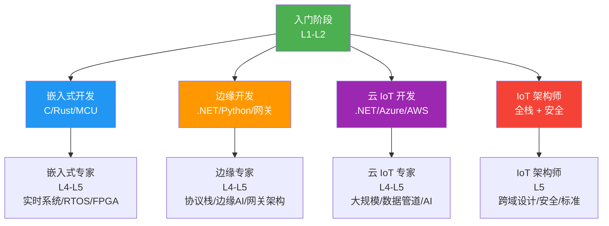
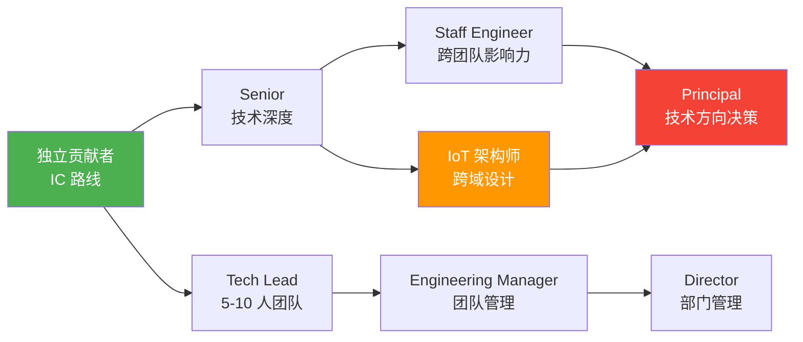
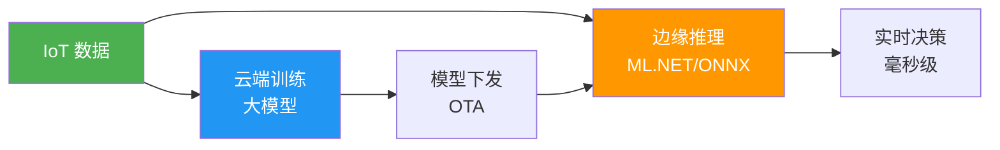

# IoT 工程师职业路线

IoT 不是单一岗位，而是横跨硬件、嵌入式、通信、后端、云平台、安全的完整技术栈。选对赛道、构建差异化能力，才能从"会写代码"成长为"能设计系统"的 IoT 架构师。本文梳理 4 条职业路径、5 级技能矩阵、行业认证和成长建议。

## 1. 四条职业路径

| 路径 | 核心技能 | 典型岗位 | 天花板 |
|------|----------|----------|--------|
| 嵌入式开发 | C/Rust、RTOS、MCU 外设 | 固件工程师、嵌入式工程师 | 嵌入式架构师 |
| 边缘开发 | .NET/Python、协议转换、网关 | 边缘开发工程师、IoT 平台工程师 | 边缘计算架构师 |
| 云 IoT 开发 | .NET/Java、云平台、数据管道 | IoT 后端工程师、云解决方案架构 | 云架构师 |
| IoT 架构师 | 全栈+安全+行业Know-how | IoT 架构师、解决方案架构师 | CTO/技术VP |

::: tip 如何选择路径？
按兴趣和背景选：喜欢硬件调试用示波器 → 嵌入式；喜欢写服务端代码做系统集成 → 边缘/云；喜欢画架构图做技术决策 → 架构师。**关键：L3 之前不要过度 specialize**，IoT 架构师需要每层都懂。
:::

## 2. 技能矩阵

### L1 初级（0-1 年）

| 维度 | 技能要求 |
|------|----------|
| 硬件 | 能接线、看原理图、用万用表 |
| 协议 | 了解 MQTT 基本概念、HTTP REST |
| 编程 | C#/.NET 基础、能写 Console App |
| 平台 | 能部署 Docker、使用 Azure IoT Hub 基本功能 |
| 数据 | SQL 基础、了解时序数据库概念 |
| 安全 | 知道 TLS 是什么、不用明文传输 |
| 软技能 | 问题描述清晰、能写技术文档 |

### L2 中级（1-3 年）

| 维度 | 技能要求 |
|------|----------|
| 硬件 | I2C/SPI/UART 调试、能写传感器驱动 |
| 协议 | MQTT QoS/保留消息、Modbus RTU/TCP、CoAP |
| 编程 | System.Device.Gpio、MQTTnet、ASP.NET Core API |
| 平台 | Azure IoT Edge 模块、设备孪生、消息路由 |
| 数据 | InfluxDB 写入查询、Grafana 仪表盘配置 |
| 安全 | X.509 证书配置、SAS Token 管理 |
| 软技能 | 独立交付小功能、代码评审参与 |

### L3 高级（3-5 年）

| 维度 | 技能要求 |
|------|----------|
| 硬件 | PCB 布局审查、EMC 基础、信号完整性 |
| 协议 | OPC UA、LoRaWAN、协议选型决策 |
| 编程 | 规则引擎设计、流处理、批量数据管道 |
| 平台 | IoT 平台选型（Azure/AWS/自建）、DPS 大规模部署 |
| 数据 | 降采样策略、异常检测算法、Kafka 流处理 |
| 安全 | DPS attestation、TPM、安全审计 |
| 软技能 | 技术方案评审、指导初中级工程师 |

### L4 专家（5-8 年）

| 维度 | 技能要求 |
|------|----------|
| 硬件 | 体系结构设计、功耗优化、可靠性工程 |
| 协议 | 自定义协议设计、协议栈移植 |
| 编程 | 边缘 AI 推理、ML.NET 集成、微服务架构 |
| 平台 | 多云混合架构、10 万+设备管理 |
| 数据 | 实时数据湖、数据治理、GDPR/数据安全法 |
| 安全 | OWASP IoT Top 10、安全开发生命周期 |
| 软技能 | 跨团队协调、技术决策、行业方案设计 |

### L5 架构师（8+ 年）

| 维度 | 技能要求 |
|------|----------|
| 全栈 | 端-边-云-用全局架构设计 |
| 安全 | 零信任架构、合规框架（ISO 27001/IEC 62443） |
| 行业 | 懂行业 Know-how（制造/农业/城市） |
| 战略 | 技术路线图、团队建设、技术品牌 |
| 创新 | AIoT、数字孪生、5G+IoT 融合方案 |

## 3. 行业认证

### 3.1 Azure IoT Developer Specialty (AZ-220)

| 项目 | 说明 |
|------|------|
| 考试代码 | AZ-220 |
| 前置要求 | AZ-900（可选但推荐） |
| 考试内容 | IoT Hub 配置、设备注册、DPS、Edge、消息路由、安全 |
| 准备时间 | 2-3 个月（有 .NET 基础） |
| 费用 | ~$165（中国区约 ¥1,100） |
| 有效期 | 1 年（需续期） |

### 3.2 AWS IoT Specialty

| 项目 | 说明 |
|------|------|
| 考试代码 | AWS Certified IoT Specialty |
| 前置要求 | AWS Cloud Practitioner + 2 年 IoT 经验 |
| 考试内容 | AWS IoT Core、Greengrass、Device Defender、Analytics |
| 准备时间 | 3-4 个月 |
| 费用 | ~$300 |

### 3.3 Cisco IoT

| 项目 | 说明 |
|------|------|
| 认证 | Cisco Certified IoT Specialist |
| 偏重 | 网络层、工业网络、ISA-95 |
| 适合 | 网络工程师转型 IoT |

::: important 认证值不值得考？
认证不是能力的证明，但是**学习路线图**的价值远大于证书本身。AZ-220 的备考过程能系统掌握 Azure IoT 全链路，比零散看文档效率高。简历上加一个认证，HR 筛选时至少不会被机器过滤掉。
:::

## 4. 中国 IoT 薪资参考

| 级别 | 城市 | 岗位 | 年薪范围（万元） |
|------|------|------|------------------|
| L1 初级 | 一线 | IoT 开发工程师 | 12-18 |
| L2 中级 | 一线 | IoT 工程师 | 18-30 |
| L3 高级 | 一线 | 高级 IoT 工程师 | 30-45 |
| L4 专家 | 一线 | IoT 技术专家 | 45-70 |
| L5 架构师 | 一线 | IoT 架构师 | 60-100+ |
| L2 中级 | 二线 | IoT 工程师 | 12-22 |
| L3 高级 | 二线 | 高级 IoT 工程师 | 22-35 |

::: warning 薪资的冰山模型
上述数字是基本薪资，IoT 行业还有几个隐性变量：**项目奖金**（工业项目可能很丰厚）、**股权**（初创公司）、**出差补贴**（现场部署多）。但也要注意：IoT 项目周期长、交付压力大、经常需要出差驻场——不是所有人都能接受。
:::

## 5. 从 IC 到架构师

### IC 路线 vs 管理路线

| 维度 | IC 路线 | 管理路线 |
|------|---------|----------|
| 核心价值 | 技术深度、方案设计 | 团队效率、人才培养 |
| 典型产出 | 架构方案、技术标准、关键代码 | 招聘、绩效、流程优化 |
| 晋升瓶颈 | 技术影响力不够广 | 管理天花板（公司规模） |
| 适合 | 不喜欢开会、享受技术攻关 | 喜欢带人、擅长协调 |

::: tip IoT 架构师的独特价值
IoT 架构师比纯软件架构师更稀缺，因为需要**跨域知识**：既要懂嵌入式限制（内存、功耗），又要懂云平台架构（弹性、安全），还要懂行业（制造、农业、城市）。这种跨界能力很难速成，5-8 年深耕是基本门槛。
:::

## 6. 推荐学习资源

### 6.1 书籍

| 级别 | 书籍 | 说明 |
|------|------|------|
| L1-L2 | 《.NET IoT 入门》 | System.Device.Gpio 实战 |
| L2-L3 | 《IoT and Edge Computing for Architects》 | 架构师视角，覆盖全栈 |
| L2-L3 | 《MQTT Essentials》 | MQTT 协议深度 |
| L3-L4 | 《Designing Data-Intensive Applications》 | 数据系统设计经典 |
| L3-L4 | 《Embedded Systems Architecture》 | 嵌入式架构 |
| L4-L5 | 《Industrial Cybersecurity》 | 工业安全 |
| L4-L5 | 《The Art of Scalability》 | 大规模系统设计 |

### 6.2 在线课程

| 平台 | 课程 | 说明 |
|------|------|------|
| Microsoft Learn | [AZ-220 学习路径](https://learn.microsoft.com/zh-cn/certifications/exams/az-220) | Azure IoT 官方免费课程 |
| Coursera | IoT Specialization (UC San Diego) | 大学体系化课程 |
| Udemy | ESP32 + MQTT 全栈开发 | 实战导向 |
| B 站 | 正点原子/野火嵌入式教程 | 中文嵌入式入门 |

## 7. 行业趋势

### 7.1 AIoT：AI + IoT 融合

- **边缘 AI**：在网关/设备端运行推理模型，减少延迟和带宽
- **预测性维护**：设备振动/温度数据 → ML 模型 → 预测故障
- **视觉 IoT**：摄像头 + 目标检测 → 人员计数、缺陷检测

### 7.2 数字孪生

物理设备的虚拟镜像，实时同步状态、模拟预测、优化决策。

- 制造：产线数字孪生 → 排产优化
- 城市：建筑数字孪生 → 能耗优化
- 农业：作物数字孪生 → 产量预测

### 7.3 5G + IoT

| 特性 | 对 IoT 的影响 |
|------|--------------|
| eMBB（大带宽） | 4K 视频监控、AR 远程协助 |
| URLLC（低延迟） | 工业远程控制、自动驾驶 |
| mMTC（海量连接） | 100 万设备/km² 密度 |

## 8. 构建作品集

### 8.1 GitHub 项目

| 项目类型 | 示例 | 展示能力 |
|----------|------|----------|
| 传感器驱动 | .NET BME280 多传感器采集 | 硬件接口 + I2C/SPI |
| MQTT 网关 | Modbus→MQTT 协议转换网关 | 协议 + 消息中间件 |
| 规则引擎 | 可配置 IoT 告警规则引擎 | 流处理 + 架构设计 |
| 全栈项目 | 智能家居/农业系统 | 端到端交付能力 |
| 工具库 | IoT 设备模拟器 | 测试 + 开发效率 |

### 8.2 技术博客

- 写你踩过的坑（面试官最爱看）
- 每篇文章解决一个具体问题
- 包含代码 + 架构图 + 避坑经验

### 8.3 开源贡献

- 从 Iot.Device.Bindings 提 PR 开始
- 修 bug → 加驱动 → review PR
- 在 .NET IoT 社区建立影响力

> 参考：[AZ-220 认证](https://learn.microsoft.com/zh-cn/certifications/exams/az-220) | [AWS IoT Specialty](https://aws.amazon.com/certification/certified-iot-specialty/) | [IEEE IoT Initiative](https://iot.ieee.org/) | [Eclipse IoT](https://iot.eclipse.org/)

## 面试技巧

1. **"你的职业规划是什么？"** —— 不要说"看机会"，要给出清晰路径："我现在 L2 边缘开发，3 年目标是 L3 能独立设计网关架构，5 年目标是 IoT 架构师，能做端-边-云全局设计。"

2. **"IoT 工程师和普通后端工程师有什么区别？"** —— 三个差异：**约束意识**（内存/功耗/带宽有限）、**实时性**（设备数据不能丢、控制不能延迟）、**跨域协作**（需要和硬件、嵌入式、运维配合）。IoT 工程师的价值在于跨域整合。

3. **"如何准备 AZ-220？"** —— 三步：① Microsoft Learn 官方学习路径（免费）；② 动手搭建 Azure IoT 项目（设备注册→Edge→消息路由）；③ 刷题库查漏补缺。2-3 个月足够。

4. **"AIoT 时代需要什么新技能？"** —— 边缘推理（ML.NET/ONNX Runtime）、数据标注和模型训练基础、MLOps（模型部署和版本管理）。不需要成为 ML 专家，但要能和 AI 团队协作。

5. **"如何证明自己的 IoT 能力？"** —— 四个维度：**GitHub 项目**（能跑的代码比证书有说服力）、**技术博客**（踩坑记录展示深度）、**开源贡献**（社区影响力）、**行业方案**（实际项目经验，NDA 下可以讲方法论）。
