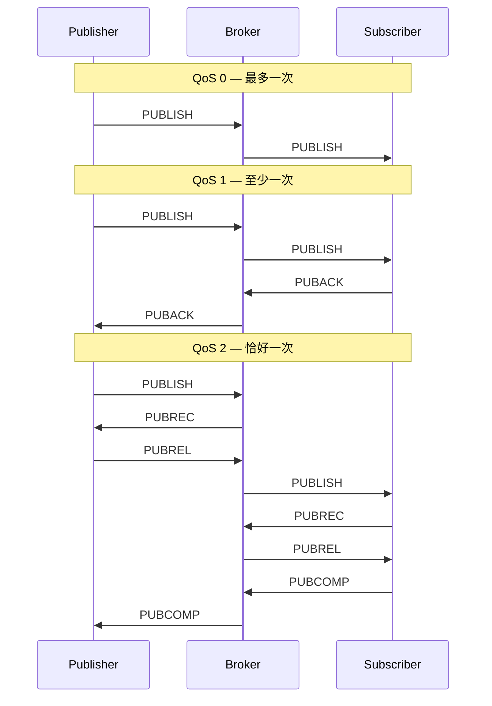
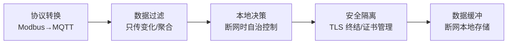
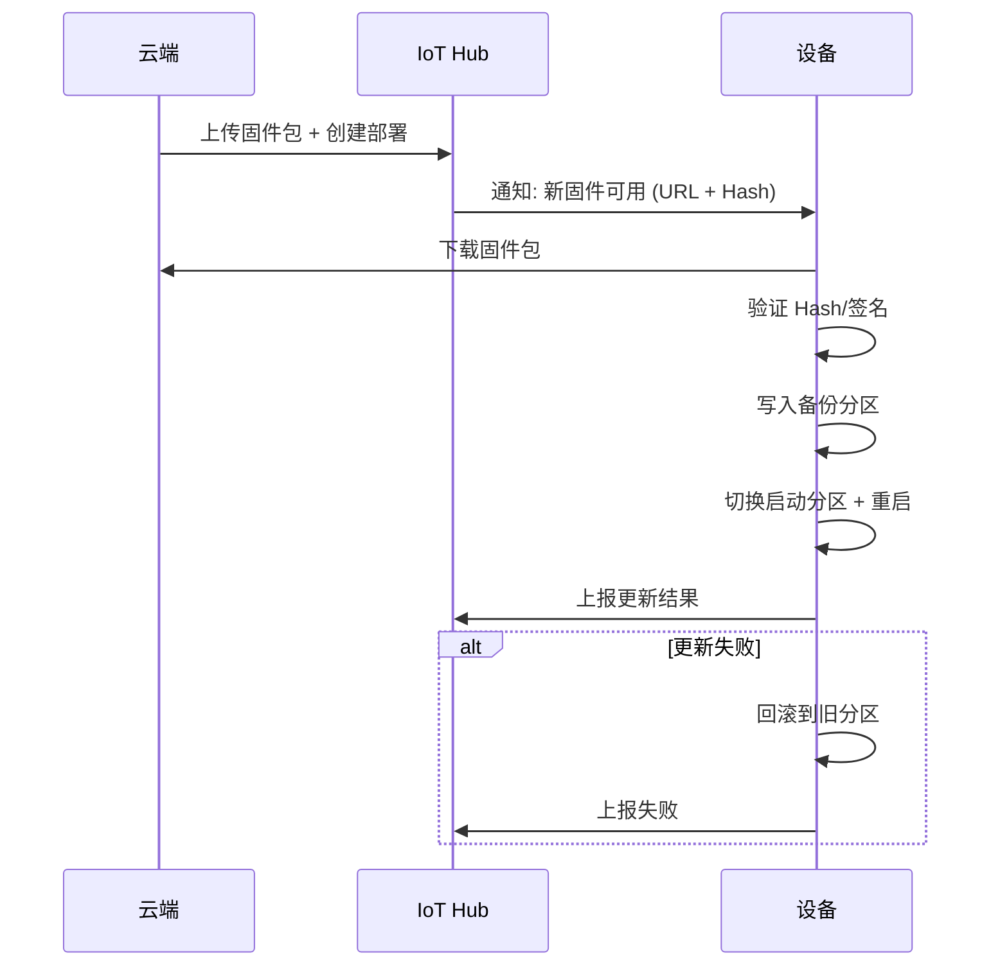
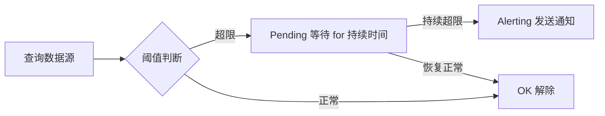

# IoT 面试题精选

精选 30 道 IoT 高频面试题，覆盖基础、协议、.NET IoT、架构、安全、数据六大方向。每道题给出**简洁答案 + 面试加分点**，帮你从"知道"升级到"能讲清楚"。

## 1. 基础篇（5 题）

### Q1：IoT 四层架构是什么？

**答案**：感知层→网络层→平台层→应用层。

- **感知层**：传感器采集数据，执行器执行动作（BME280、继电器）
- **网络层**：协议传输，MQTT/CoAP/LoRa/NB-IoT
- **平台层**：设备管理、消息路由、边缘网关（IoT Hub、设备影子）
- **应用层**：业务逻辑，仪表盘、规则引擎、告警

::: tip 加分点
画出端-边-云-用模式图，强调边缘计算的三重价值：**低延迟**、**带宽优化**、**离线自治**。举工业场景断网例子：1 秒断网阀门未关闭的后果。
:::

### Q2：IoT 常用通信协议有哪些？怎么选？

**答案**：

| 协议 | 层级 | 特点 | 场景 |
|------|------|------|------|
| MQTT | 应用层 | 轻量 Pub/Sub，QoS | 通用遥测上报 |
| CoAP | 应用层 | UDP，类 HTTP 语义 | 受限设备 |
| HTTP | 应用层 | 通用，开销大 | 配置管理 |
| AMQP | 应用层 | 可靠消息，企业级 | 金融/医疗 |
| Modbus | 工业协议 | 简单寄存器读写 | PLC/工业设备 |
| LoRa | 物理层 | 远距离低功耗 | 农业野外 |

选型三维度：**带宽**（数据量多大）、**功耗**（电池还是市电）、**可靠性**（QoS 要求）。

### Q3：边缘计算和云计算的区别？

**答案**：

| 维度 | 边缘计算 | 云计算 |
|------|----------|--------|
| 延迟 | 毫秒~秒级 | 秒~分钟级 |
| 带宽 | 本地处理，不上传 | 全部上传 |
| 离线 | 可自治运行 | 依赖网络 |
| 算力 | 有限（ARM/x86 小主机） | 近乎无限 |
| 存储 | 本地缓存 | 海量存储 |

二者互补：边缘做实时决策，云端做全局分析。不是替代关系。

::: important 面试关键词
**数据引力**——数据在哪，计算就在哪。IoT 数据在边缘产生，低延迟处理就应该在边缘做。只有需要全局视角的分析（跨设备关联、模型训练）才需要上云。
:::

### Q4：受约束设备（Constrained Device）是什么？

**答案**：RFC 7228 定义了三类受约束设备：

| 类别 | RAM | Flash | 典型 |
|------|-----|-------|------|
| Class 0 | < 10KB | < 100KB | 8-bit MCU |
| Class 1 | ~10KB | ~100KB | ESP8266 |
| Class 2 | ~50KB | ~250KB | ESP32 |

受约束设备不能运行完整的 TCP/IP + TLS 栈，所以有 CoAP（UDP）、DTLS 等轻量协议。.NET nanoFramework 可以在 Class 2 设备上运行。

### Q5：IoT 和 IIoT 有什么不同？

**答案**：

| 维度 | IoT（消费） | IIoT（工业） |
|------|-------------|-------------|
| 可靠性 | 中 | 极高 |
| 延迟 | 秒级可接受 | 毫秒级 |
| 安全 | 中 | 高（IEC 62443） |
| 协议 | Wi-Fi/Matter | Modbus/OPC UA |
| 断网 | 可接受 | 不可接受 |
| 合规 | GDPR | ISA-95/IEC 62443 |

核心差异：**IIoT 的 OT 属性**——操作技术（OT）关注可用性和安全性，IT 关注机密性。IT/OT 融合是当前趋势。

## 2. 协议篇（5 题）

### Q6：MQTT 的 QoS 0/1/2 有什么区别？

**答案**：



| QoS | 消息保证 | 开销 | 场景 |
|-----|----------|------|------|
| 0 | 最多一次（可能丢） | 最低 | 高频遥测（丢一条无所谓） |
| 1 | 至少一次（可能重复） | 中 | 告警（不能丢，可去重） |
| 2 | 恰好一次 | 最高（4 次握手） | 控制（不能丢也不能重复执行） |

::: warning QoS 2 的性能陷阱
QoS 2 需要四次握手，吞吐量大幅下降。大部分场景用 QoS 1 + 业务层去重更实际。QoS 2 只用于不能重复执行的指令（如"转账 100 元"）。
:::

### Q7：CoAP 和 MQTT 的区别？

**答案**：

| 维度 | CoAP | MQTT |
|------|------|------|
| 传输层 | UDP | TCP |
| 模式 | 请求/响应 | 发布/订阅 |
| 开销 | 4 字节头 | 2 字节头 |
| 观察 | Observe 选项 | 订阅机制 |
| 发现 | /.well-known/core | 无 |
| 安全 | DTLS | TLS |
| 适用 | 受约束设备 | 通用 |

CoAP 更像"轻量 HTTP"，适合设备资源查询和配置。MQTT 更像"轻量消息队列"，适合持续遥测上报。

### Q8：Modbus 常用功能码？

**答案**：

| 功能码 | 名称 | 操作 |
|--------|------|------|
| 0x01 | Read Coils | 读线圈（开关量输出） |
| 0x02 | Read Discrete Inputs | 读离散输入（开关量输入） |
| 0x03 | Read Holding Registers | 读保持寄存器（可读写） |
| 0x04 | Read Input Registers | 读输入寄存器（只读） |
| 0x05 | Write Single Coil | 写单个线圈 |
| 0x06 | Write Single Register | 写单个寄存器 |
| 0x0F | Write Multiple Coils | 写多个线圈 |
| 0x10 | Write Multiple Registers | 写多个寄存器 |

面试最常考 0x03（读保持寄存器）和 0x06/0x10（写寄存器）。

### Q9：LoRaWAN 的 Class A/B/C？

**答案**：

| Class | 上行 | 下行窗口 | 功耗 | 场景 |
|-------|------|----------|------|------|
| A | 随时 | 上行后短暂打开 | 最低 | 电池供电传感器 |
| B | 随时 | 固定时间信标窗口 | 中 | 需要定时下行 |
| C | 随时 | 一直打开 | 最高 | 市电设备 |

Class A 是默认且最常用。关键理解：**LoRaWAN 是上行驱动**——设备上行后才有下行窗口，不能随时下发指令。

### Q10：AMQP 在 IoT 中什么场景用？

**答案**：AMQP（高级消息队列协议）提供可靠消息传递、事务、队列模型。IoT 场景中用于：

- **设备到云的高可靠消息**：金融终端、医疗设备（不能丢消息）
- **服务端内部消息路由**：Azure IoT Hub 内部用 AMQP
- **与 MQTT 对比**：AMQP 更重但更可靠，MQTT 更轻但功能有限

## 3. .NET IoT 篇（5 题）

### Q11：System.Device.Gpio 是什么？

**答案**：.NET 官方 GPIO 库，提供跨平台 GPIO/I2C/SPI/UART 访问。

```csharp
using System.Device.Gpio;

using var controller = new GpioController();
controller.OpenPin(18, PinMode.Output);
controller.Write(18, PinValue.High);
await Task.Delay(1000);
controller.Write(18, PinValue.Low);
```

支持 Linux（libgpiod）、Windows（WinRT）后端。在树莓派上跑 .NET 控制硬件的基石。

### Q12：I2C 和 SPI 的区别？

**答案**：

| 维度 | I2C | SPI |
|------|-----|-----|
| 线数 | 2（SDA + SCL） | 4+（MOSI + MISO + SCK + CS） |
| 速度 | 100kHz~3.4MHz | 可达数十 MHz |
| 多设备 | 地址寻址（7/10 位） | CS 片选 |
| 双工 | 半双工 | 全双工 |
| 适用 | 传感器（BME280） | 高速设备（显示屏、Flash） |

```csharp
// I2C 示例
using var device = I2cDevice.Create(new I2cConnectionSettings(1, 0x76));
var bme280 = new Bme280(device);
var reading = await bme280.ReadAsync();

// SPI 示例
using var spi = SpiDevice.Create(new SpiConnectionSettings(0, 0));
var buffer = new byte[2];
spi.TransferFullDuplex(new byte[] { 0x03, 0x00 }, buffer);
```

### Q13：Iot.Device.Bindings 是什么？

**答案**：社区维护的设备驱动库，包含 100+ 传感器的 .NET 封装。

| 类别 | 示例 |
|------|------|
| 环境传感器 | Bme280, Sht3x, Dhtxx |
| 显示屏 | Ssd1306, St7789 |
| 加速度/陀螺仪 | Mpu6050, Adxl345 |
| GPS | Mt3339 |
| 继电器/电机 | Relay, ServoMotor |
| RFID | Mfrc522 |

NuGet 包：`Iot.Device.Bindings`，按需引用或整体安装。

### Q14：Azure IoT SDK for .NET 核心类？

**答案**：

| 类 | 用途 |
|----|------|
| `DeviceClient` | 设备端：发送遥测、接收指令、上报属性 |
| `ServiceClient` | 服务端：发送 C2D 消息、调用直接方法 |
| `RegistryManager` | 管理设备注册 |
| `ModuleClient` | IoT Edge 模块通信 |

```csharp
// 设备端发送遥测
var client = DeviceClient.CreateFromConnectionString(connStr, TransportType.Mqtt);
var message = new Message(Encoding.UTF8.GetBytes("{\"temp\":23.5}"));
await client.SendEventAsync(message);

// 接收 C2D 消息
var received = await client.ReceiveAsync(TimeSpan.FromSeconds(10));
```

### Q15：MQTTnet 怎么用？

**答案**：

```csharp
var factory = new MqttFactory();
var client = factory.CreateMqttClient();

var options = new MqttClientOptionsBuilder()
    .WithTcpServer("broker.hivemq.com")
    .Build();

client.ApplicationMessageReceivedAsync += e =>
{
    Console.WriteLine($"Received: {Encoding.UTF8.GetString(e.ApplicationMessage.Payload)}");
    return Task.CompletedTask;
};

await client.ConnectAsync(options);
await client.SubscribeAsync("sensors/+/telemetry");
await client.PublishStringAsync("sensors/device01/telemetry",
    "{\"temperature\":23.5}", MQTTnet.Protocol.MqttQualityOfServiceLevel.AtLeastOnce);
```

核心 API：`ConnectAsync`、`SubscribeAsync`、`PublishAsync`、`ApplicationMessageReceivedAsync`。

## 4. 架构篇（5 题）

### Q16：边缘网关的核心职责？

**答案**：



五大职责：**协议转换**、**数据过滤**、**本地决策**、**安全隔离**、**数据缓冲**。

### Q17：设备孪生（Device Twin）是什么？

**答案**：设备孪生是云端维护的设备状态镜像，包含三部分：

| 部分 | 说明 | 方向 |
|------|------|------|
| Reported Properties | 设备上报的实际状态 | 设备→云 |
| Desired Properties | 云端下发的期望状态 | 云→设备 |
| Tags | 云端元数据（不同步到设备） | 仅云端 |

典型流程：云端设 Desired `{"fanSpeed": 3}` → 设备收到 → 设备执行 → 设备上报 Reported `{"fanSpeed": 3}` → 云端对比 Desired == Reported，状态同步完成。

### Q18：IoT Hub 和 Event Hub 的区别？

**答案**：

| 维度 | IoT Hub | Event Hub |
|------|---------|-----------|
| 定位 | IoT 设备接入 | 通用事件流 |
| 设备身份 | 有（Device ID + 认证） | 无（共享访问策略） |
| 双向通信 | 支持（C2D 消息） | 仅单向入站 |
| 设备孪生 | 支持 | 不支持 |
| 协议 | MQTT/AMQP/HTTPS | AMQP/Kafka/HTTPS |
| 适用 | IoT 场景 | 日志/事件流 |

IoT Hub 是 Event Hub 的 IoT 超集：加上了设备管理、双向通信、设备孪生。

### Q19：消息路由怎么设计？

**答案**：

```mermaid
flowchart TB
    MSG[设备消息] --> R1{消息类型?}
    R1 |遥测| --> T1[时序数据库]
    R1 |告警| --> T2[告警服务]
    R1 |状态变更| --> T3[设备注册表]
    R1 |OTA 状态| --> T4[OTA 管理服务]

    R1 --> CUSTOM["自定义路由<br/>基于消息头/Body"]
```

路由策略：
- **按 Topic 路由**：`devices/{id}/telemetry/*`、`devices/{id}/alerts/*`
- **按消息体路由**：解析 JSON 字段决定去向
- **按优先级路由**：告警消息走快通道，遥测走批量通道

### Q20：OTA 更新策略？

**答案**：



关键设计：**A/B 分区**（失败可回滚）、**签名验证**（防篡改）、**断点续传**（大固件包）、**灰度发布**（先 5% 设备，再全量）。

## 5. 安全篇（5 题）

### Q21：IoT 设备为什么需要 TLS？

**答案**：IoT 设备面临三大网络威胁：

1. **窃听**：明文 MQTT 流量可被抓包读取传感器数据
2. **伪造**：无认证，任何人可发布假数据或下发假指令
3. **中间人**：修改通信内容（如篡改控制指令）

TLS 解决：**加密**（防窃听）、**身份认证**（防伪造）、**完整性**（防篡改）。MQTT 使用 8883 端口 TLS。

### Q22：X.509 证书链在 IoT 中怎么用？

**答案**：

```
根 CA (Root CA)
  └── 中间 CA (Intermediate CA)
        ├── 设备证书 A
        ├── 设备证书 B
        └── 设备证书 C
```

| 证书 | 用途 | 存储 |
|------|------|------|
| 根 CA | 信任锚，验证整条链 | 云端/服务端 |
| 中间 CA | 批量签发设备证书 | HSM 或安全存储 |
| 设备证书 | 设备身份凭证 | 设备 TPM/Flash |

面试加分：提到 **PKI hierarchy**——每个工厂/产品线一个中间 CA，设备证书泄露只影响该批次，吊销中间 CA 即可。

### Q23：DPS（Device Provisioning Service）的认证方式？

**答案**：

| 方式 | 原理 | 适用场景 |
|------|------|----------|
| Symmetric Key | 共享密钥 + HMAC | 开发测试 |
| X.509 证书 | 证书链验证 | 生产部署 |
| TPM | 硬件安全模块 | 高安全要求 |

DPS 流程：设备启动 → 连接 DPS → 提供认证凭据 → DPS 验证 → 分配 IoT Hub + Device ID → 返回连接信息。实现**零接触部署**。

### Q24：OWASP IoT Top 10 是什么？

**答案**：

| # | 风险 | 说明 |
|---|------|------|
| 1 | 弱/可猜测密码 | 默认密码未改 |
| 2 | 不安全的网络服务 | 不必要的端口开放 |
| 3 | 不安全的生态接口 | API 缺少认证 |
| 4 | 缺乏安全更新机制 | 无法 OTA 或不验证 |
| 5 | 使用不安全组件 | 过时的库/框架 |
| 6 | 隐私保护不足 | 过度收集数据 |
| 7 | 不安全的数据传输 | 明文通信 |
| 8 | 缺乏设备管理 | 无法监控/吊销设备 |
| 9 | 不安全的默认配置 | 出厂配置不安全 |
| 10 | 缺乏物理加固 | 调试口暴露 |

### Q25：TPM 在 IoT 中怎么用？

**答案**：TPM（Trusted Platform Module）是硬件安全芯片，提供：

- **密钥存储**：私钥永远不离开 TPM
- **远程证明**：证明设备软件状态未被篡改
- **密封存储**：数据绑定到特定 TPM 状态

IoT 场景：TPM 存储 DPS 认证密钥 → 设备启动时 TPM 签名 → DPS 验证 → 分配 IoT Hub。比 Symmetric Key 安全：密钥无法被提取，即使 Flash 被读取也无法伪造设备身份。

## 6. 数据篇（5 题）

### Q26：时序数据库怎么选？

**答案**：

| 场景 | 推荐 | 理由 |
|------|------|------|
| 纯 IoT 时序 + 云原生 | InfluxDB | 生态成熟，Telegraf+Grafana 开箱即用 |
| 时序 + 业务混合 | TimescaleDB | PostgreSQL 兼容，SQL JOIN |
| 超大规模 + 国产化 | TDengine | 100 万点/秒写入，信创友好 |

选型三问：**需要 JOIN 吗**？**集群是刚需吗**？**有国产化要求吗**？

### Q27：流处理和批处理的区别？

**答案**：

| 维度 | 流处理 | 批处理 |
|------|--------|--------|
| 数据 | 无界（持续到达） | 有界（固定集合） |
| 延迟 | 毫秒~秒级 | 分钟~小时级 |
| 处理 | 逐条/微批 | 全量 |
| 场景 | 实时告警 | 离线报表 |

IoT 流处理关键概念：**窗口**（滚动/滑动/会话）、**水位线**（事件时间 vs 处理时间）、**状态管理**（触发历史）。

### Q28：降采样策略怎么设计？

**答案**：级联降采样：原始 → 分钟 → 小时 → 天，每层保留期递增。

```
原始（1s）→ 保留 7 天 → 占 70% 存储
分钟级 → 保留 30 天 → 占 20%
小时级 → 保留 180 天 → 占 8%
天级 → 永久 → 占 2%
```

InfluxDB 用 Task 实现自动降采样，TimescaleDB 用 Continuous Aggregate。

### Q29：异常检测有哪些方法？

**答案**：

| 方法 | 原理 | 优缺点 |
|------|------|--------|
| 静态阈值 | x > limit | 简单，但不适应变化 |
| Z-score | \|x-μ\|/σ > k | 适应数据分布，但假设正态 |
| 变化率 | \|Δx/Δt\| > rate | 检测突变，但不检测缓慢漂移 |
| IQR | x < Q1-1.5×IQR 或 x > Q3+1.5×IQR | 不假设正态，鲁棒 |
| ML | 训练模型 | 最强，但需要数据和算力 |

面试加分：提到 **规则引擎 + ML 双层**——规则引擎做实时粗筛，ML 做离线精筛。

### Q30：Grafana 仪表盘怎么做告警？

**答案**：

Grafana 告警分两步：
1. **定义告警规则**：查询数据源 + 设置阈值条件 + 持续时间
2. **配置通知渠道**：Email / Slack / Webhook / PagerDuty



关键概念：**for 持续时间**（避免毛刺误报）、**No Data 策略**（设备离线是否触发告警）、**告警抑制**（维护窗口期不告警）。

> 参考：[OWASP IoT Top 10](https://owasp.org/www-project-internet-of-things/) | [Azure IoT Hub 文档](https://learn.microsoft.com/zh-cn/azure/iot-hub/) | [MQTT 5.0 规范](https://docs.oasis-open.org/mqtt/mqtt/v5.0/os/mqtt-v5.0-os.html) | [LoRaWAN 规范](https://lora-alliance.org/resource_hub/lorawan-specification-v1-0-4/)

## 面试技巧

1. **"你对 IoT 了解多少？"** —— 不要从定义讲起，直接画架构图：端-边-云-用，每层说一个你做过的项目或踩过的坑。30 秒内建立"我是实践者"的印象。

2. **"你遇到过最难的问题是什么？"** —— 准备 2-3 个真实故事，用 STAR 框架讲：Situation（场景）→ Task（任务）→ Action（行动）→ Result（结果）。IoT 面试官想听的是**调试过程**（怎么定位问题）而不是**最终答案**。

3. **"你有什么问题想问我们？"** —— 问三个问题：① 你们的设备规模？（判断技术复杂度）② 用什么协议和平台？（判断技术栈匹配度）③ 团队里嵌入式和后端的比例？（判断协作模式）

4. **"IoT 行业有什么风险？"** —— 展现你的行业理解：项目周期长（6-12 个月）、硬件坑多（供应链/兼容性/认证）、交付压力大（现场部署）。但同时也说明这正是壁垒——纯软件工程师做不了 IoT。

5. **"为什么选择 IoT 而不是纯软件开发？"** —— 三点：① **有形产出**——代码控制物理世界，成就感强；② **跨界整合**——硬件+软件+通信+行业，能力壁垒高；③ **长期价值**——IoT 渗透率还在上升，赛道够长。
