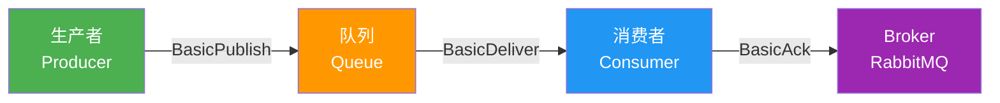
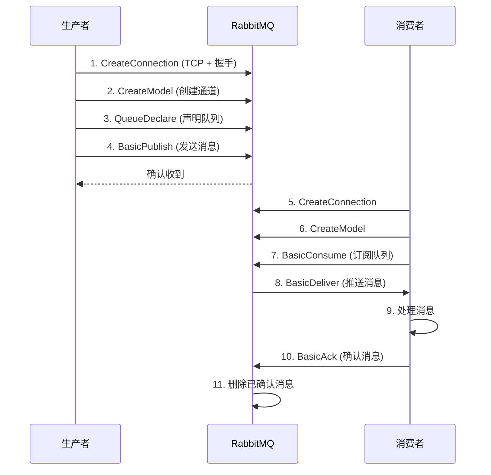
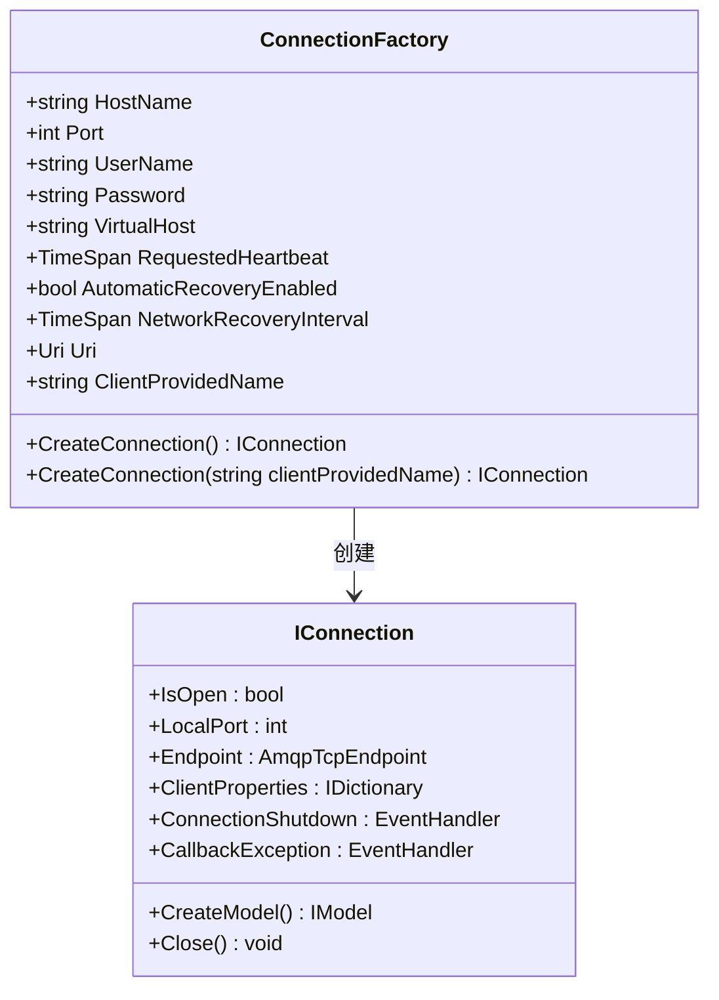

# 02 · 第一个 RabbitMQ 程序

## Hello World 概览

RabbitMQ 是消息代理（Message Broker），核心模型是：**生产者 → 队列 → 消费者**。



::: important 核心概念速记
- **Producer**：发送消息的应用程序
- **Consumer**：接收消息的应用程序
- **Queue**：存储消息的缓冲区，存在于 RabbitMQ 内部
- **Message**：在生产者和消费者之间传递的数据
- **Exchange**：本篇使用默认交换机，后续章节详解
:::

## 完整通信流程



## 生产者实现

### 项目准备

```bash
dotnet new console -n RabbitMQProducer
cd RabbitMQProducer
dotnet add package RabbitMQ.Client
```

### 完整生产者代码

```csharp
using System.Text;
using RabbitMQ.Client;

// 1. 创建连接工厂
var factory = new ConnectionFactory
{
    HostName = "localhost",
    UserName = "admin",
    Password = "admin123",
    VirtualHost = "/"
};

// 2. 创建连接和通道
using var connection = factory.CreateConnection();
using var channel = connection.CreateModel();

// 3. 声明队列
const string queueName = "hello";
channel.QueueDeclare(
    queue: queueName,
    durable: false,     // 不持久化
    exclusive: false,   // 不排他
    autoDelete: false,  // 不自动删除
    arguments: null     // 无额外参数
);

// 4. 发送消息
for (int i = 1; i <= 10; i++)
{
    string message = $"Hello RabbitMQ! 消息编号: {i}";
    var body = Encoding.UTF8.GetBytes(message);

    // 5. 设置消息属性
    var properties = new BasicProperties
    {
        ContentType = "text/plain",
        MessageId = Guid.NewGuid().ToString(),
        DeliveryMode = 1,  // 1 = 非持久化, 2 = 持久化
        Timestamp = new AmqpTimestamp(DateTimeOffset.UtcNow.ToUnixTimeSeconds())
    };

    // 6. 发布消息（使用默认交换机）
    channel.BasicPublish(
        exchange: "",          // 默认交换机
        routingKey: queueName, // 路由键 = 队列名
        basicProperties: properties,
        body: body
    );

    Console.WriteLine($" [x] 已发送: {message}");
    Thread.Sleep(500);
}

Console.WriteLine(" 按回车退出...");
Console.ReadLine();
```

## 消费者实现

### 项目准备

```bash
dotnet new console -n RabbitMQConsumer
cd RabbitMQConsumer
dotnet add package RabbitMQ.Client
```

### 完整消费者代码

```csharp
using System.Text;
using RabbitMQ.Client;
using RabbitMQ.Client.Events;

// 1. 创建连接工厂
var factory = new ConnectionFactory
{
    HostName = "localhost",
    UserName = "admin",
    Password = "admin123",
    VirtualHost = "/"
};

// 2. 创建连接和通道
using var connection = factory.CreateConnection();
using var channel = connection.CreateModel();

// 3. 声明队列（与生产者保持一致，确保队列存在）
const string queueName = "hello";
channel.QueueDeclare(
    queue: queueName,
    durable: false,
    exclusive: false,
    autoDelete: false,
    arguments: null
);

// 4. 设置预取数量（公平分发）
channel.BasicQos(prefetchSize: 0, prefetchCount: 1, global: false);

// 5. 创建消费者
var consumer = new EventingBasicConsumer(channel);

// 6. 注册消息接收事件
consumer.Received += (model, ea) =>
{
    var body = ea.Body.ToArray();
    var message = Encoding.UTF8.GetString(body);
    var messageId = ea.BasicProperties.MessageId;
    var timestamp = ea.BasicProperties.Timestamp.UnixTime;

    Console.WriteLine($" [x] 收到消息: {message}");
    Console.WriteLine($"     MessageId: {messageId}");
    Console.WriteLine($"     Timestamp: {DateTimeOffset.FromUnixTimeSeconds(timestamp).DateTime:yyyy-MM-dd HH:mm:ss}");

    // 模拟处理耗时
    Thread.Sleep(1000);

    // 7. 手动确认消息
    channel.BasicAck(deliveryTag: ea.DeliveryTag, multiple: false);
    Console.WriteLine($" [✓] 已确认: deliveryTag={ea.DeliveryTag}");
};

// 8. 开始消费
channel.BasicConsume(
    queue: queueName,
    autoAck: false,  // 手动确认
    consumer: consumer
);

Console.WriteLine(" [*] 等待消息。按回车退出...");
Console.ReadLine();
```

## ConnectionFactory 详解



### 关键配置项

```csharp
var factory = new ConnectionFactory
{
    // 基本连接参数
    HostName = "localhost",
    Port = 5672,
    UserName = "admin",
    Password = "admin123",
    VirtualHost = "/",

    // 心跳与恢复
    RequestedHeartbeat = TimeSpan.FromSeconds(60),   // 心跳间隔
    AutomaticRecoveryEnabled = true,                  // 自动重连
    NetworkRecoveryInterval = TimeSpan.FromSeconds(5), // 重连间隔

    // 客户端标识
    ClientProvidedName = "MyApp-Producer",            // 在管理界面中显示
};
```

::: warning AutomaticRecoveryEnabled 的局限
- 自动恢复**仅恢复连接和通道**，不会恢复：
  - 交换机声明
  - 队列声明
  - 绑定关系
  - 消费者注册
- 如需完整恢复，需注册 `ConnectionShutdown` 事件手动重建
- 推荐使用 [EasyNetQ](https://github.com/EasyNetQ/EasyNetQ) 或 [MassTransit](https://github.com/MassTransit/MassTransit) 等高级客户端，内置完整拓扑恢复
:::

## Using 语句模式

RabbitMQ 的 `IConnection` 和 `IModel` 实现了 `IDisposable`，必须正确释放资源：

```csharp
// 推荐写法：using 声明（C# 8+）
using var connection = factory.CreateConnection();
using var channel = connection.CreateModel();

// 连接和通道在作用域结束时自动关闭
```

```csharp
// 传统写法：using 块
using (var connection = factory.CreateConnection())
using (var channel = connection.CreateModel())
{
    // 操作...
} // 自动关闭
```

::: important 资源释放顺序
1. 先关闭 `IModel`（通道）
2. 再关闭 `IConnection`（连接）
3. `using` 声明的释放顺序与声明顺序相反，自动保证正确
4. **不要在消费者事件处理中关闭连接或通道**
:::

## BasicProperties 详解

消息属性是 AMQP 协议的核心特性，共有 14 个标准属性：

```csharp
var properties = new BasicProperties
{
    // 内容描述
    ContentType = "application/json",        // 消息体 MIME 类型
    ContentEncoding = "utf-8",               // 消息体编码
    Type = "order.created",                  // 消息类型名称

    // 投递控制
    DeliveryMode = 2,                        // 1=非持久化, 2=持久化
    Priority = 5,                            // 优先级 0-9
    Expiration = "60000",                    // TTL（毫秒，字符串）

    // 关联与追踪
    MessageId = Guid.NewGuid().ToString(),   // 消息唯一 ID
    CorrelationId = "corr-123",              // 关联 ID（RPC 用）
    Timestamp = new AmqpTimestamp(           // 时间戳
        DateTimeOffset.UtcNow.ToUnixTimeSeconds()),

    // 回复
    ReplyTo = "reply-queue",                 // 回复队列（RPC 用）

    // 认证
    UserId = "admin",                        // 发送者用户名（需验证）

    // 应用标识
    AppId = "OrderService",                  // 应用标识
    ClusterId = "",                          // 集群 ID（内部使用）

    // 自定义头
    Headers = new Dictionary<string, object>
    {
        { "x-trace-id", "trace-abc-123" },
        { "x-source", "order-service" }
    }
};
```

### 常用属性速查

| 属性 | 类型 | 常用场景 |
|------|------|----------|
| `ContentType` | string | 标识消息体格式：`application/json`、`text/plain` |
| `DeliveryMode` | byte | `1` = 非持久化，`2` = 持久化 |
| `MessageId` | string | 幂等去重、消息追踪 |
| `CorrelationId` | string | RPC 请求-响应关联 |
| `ReplyTo` | string | RPC 回复队列名 |
| `Expiration` | string | 消息 TTL（毫秒） |
| `Priority` | byte | 优先级队列中消息的优先级 |
| `Timestamp` | AmqpTimestamp | 消息创建时间 |
| `Headers` | IDictionary | 自定义元数据、Headers 交换机路由 |

## 默认交换机

当 `exchange` 参数传空字符串 `""` 时，RabbitMQ 使用默认交换机：

```csharp
// 使用默认交换机发送
channel.BasicPublish(
    exchange: "",           // 默认交换机（直连类型）
    routingKey: "hello",   // 路由键 = 目标队列名
    basicProperties: null,
    body: body
);
```

::: tip 默认交换机特点
- 名称：空字符串 `""`
- 类型：Direct（直连）
- 自动绑定：每个队列都会自动绑定到默认交换机，routing key 等于队列名
- 无需显式声明，始终存在
- 适合简单场景，生产环境建议使用具名交换机
:::

## 运行效果

**终端 1 — 启动消费者：**

```
 [*] 等待消息。按回车退出...
 [x] 收到消息: Hello RabbitMQ! 消息编号: 1
     MessageId: a1b2c3d4-e5f6-7890-abcd-ef1234567890
     Timestamp: 2026-06-04 22:30:00
 [✓] 已确认: deliveryTag=1
 [x] 收到消息: Hello RabbitMQ! 消息编号: 2
     MessageId: f1e2d3c4-b5a6-0987-6543-21fedcba0987
     Timestamp: 2026-06-04 22:30:01
 [✓] 已确认: deliveryTag=2
```

**终端 2 — 启动生产者：**

```
 [x] 已发送: Hello RabbitMQ! 消息编号: 1
 [x] 已发送: Hello RabbitMQ! 消息编号: 2
 [x] 已发送: Hello RabbitMQ! 消息编号: 3
 ...
 按回车退出...
```

## 参考资料

- [RabbitMQ 官方教程 - Hello World](https://www.rabbitmq.com/tutorials/tutorial-one-dotnet)
- [RabbitMQ .NET Client API](https://rabbitmq.github.io/rabbitmq-dotnet-client/)
- [RabbitMQ 官方文档 - 连接与通道](https://www.rabbitmq.com/connections.html)
- 《RabbitMQ 实战指南》第 2 章 — 朱忠华
- [RabbitMQ in Depth](https://www.manning.com/books/rabbitmq-in-depth) Chapter 2 — Alvaro Videla

## 面试技巧

::: tip 高频面试问题
1. **RabbitMQ 的 Connection 和 Channel 是什么关系？**
   - 回答要点：Connection 是 TCP 连接，Channel 是 Connection 上的虚拟连接。一个 Connection 可以复用多个 Channel，减少 TCP 连接开销。Channel 不是线程安全的，每个线程应使用独立 Channel。

2. **为什么消费者也要 QueueDeclare？**
   - 回答要点：确保队列存在。生产者可能还未启动，消费者先启动时队列不存在会报错。QueueDeclare 是幂等的，队列已存在时不会重复创建。

3. **autoAck=false 和 autoAck=true 的区别？**
   - 回答要点：`autoAck=true` 消息投递后立即从队列删除，消费者处理失败消息丢失；`autoAck=false` 消费者需手动 BasicAck，处理失败可以 NACK 重回队列。**生产环境务必手动确认**。

4. **DeliveryMode=1 和 DeliveryMode=2 的区别？**
   - 回答要点：`1` = 非持久化（消息仅存在内存，重启丢失）；`2` = 持久化（消息写入磁盘，重启可恢复）。但仅 DeliveryMode=2 不够，Exchange 和 Queue 也必须 durable=true 才能真正持久化。
:::
