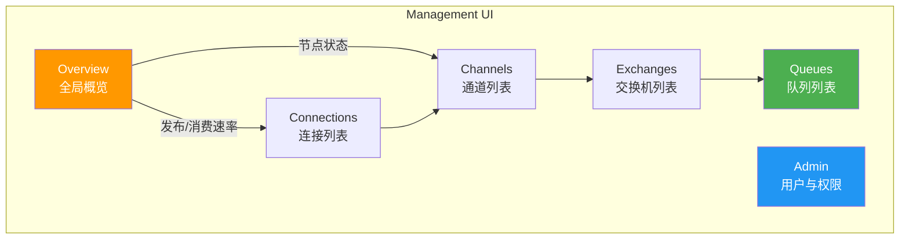
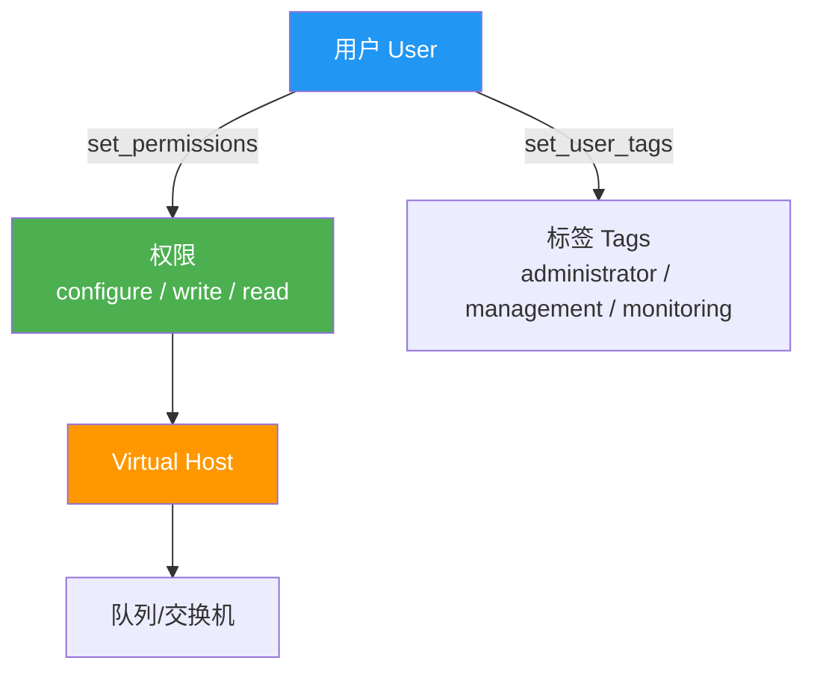

# 03 · 管理界面与命令行

## 启用 Management 插件

```bash
# 方式一：Docker 镜像已包含（推荐）
docker run -d --name rabbitmq -p 5672:5672 -p 15672:15672 rabbitmq:3.13-management

# 方式二：手动启用
rabbitmq-plugins enable rabbitmq_management
```

::: tip 插件列表查看
```bash
rabbitmq-plugins list
# [E*] rabbitmq_management     ← E 表示已启用
# [ ] rabbitmq_shovel           ← 空格表示未启用
# [e*] rabbitmq_management_agent ← e 表示隐式启用（被其他插件依赖）
```
:::

访问 `http://localhost:15672`，默认账号密码：`guest / guest`。

::: warning guest 账户限制
`guest` 账户默认只能从 `localhost` 登录。远程访问需创建新用户：

```bash
rabbitmqctl add_user admin admin123
rabbitmqctl set_user_tags admin administrator
rabbitmqctl set_permissions -p / admin ".*" ".*" ".*"
```
:::

## Web UI 导览



### Overview 页面关键指标

| 指标 | 含义 | 关注场景 |
|------|------|----------|
| **Queued messages** | 队列中待消费消息数（Ready + Unacked） | 消息堆积告警 |
| **Message rates** | Publish/Deliver/Ack 速率 | 吞吐量监控 |
| **Nodes** | 节点状态（内存/磁盘/运行时间） | 集群健康检查 |
| **Ports/Contexts** | 监听端口和协议 | 安全审计 |

### Queues 页面操作

| 操作 | 说明 |
|------|------|
| **Publish message** | 向队列发送测试消息 |
| **Get message(s)** | 从队列拉取消息（Ack 模式可选） |
| **Purge messages** | 清空队列所有消息 |
| **Delete queue** | 删除队列 |
| **Move messages** | 迁移消息到另一个队列 |
| **Add a policy** | 为队列添加策略 |

## rabbitmqctl 命令详解

### 基础运维命令

```bash
# 查看节点状态
rabbitmqctl status

# 查看环境信息
rabbitmqctl environment

# 查看节点运行状态（简洁版）
rabbitmqctl node_health_check
```

### 队列管理

```bash
# 列出所有队列
rabbitmqctl list_queues name messages consumers

# 列出队列详细信息
rabbitmqctl list_queues name messages messages_ready messages_unacknowledged \
  deliveries consumers memory durable auto_delete

# 清空队列消息
rabbitmqctl purge_queue my_queue

# 删除队列（空队列）
rabbitmqctl delete_queue my_queue
```

输出示例：

```
Listing queues for vhost / ...
hello   5       1
order.created  0       2
payment.notify 120     0
```

### 交换机管理

```bash
# 列出所有交换机
rabbitmqctl list_exchanges name type durable

# 列出交换机详细信息
rabbitmqctl list_exchanges name type durable auto_delete internal arguments
```

### 绑定管理

```bash
# 列出所有绑定
rabbitmqctl list_bindings source_name source_kind destination_name destination_kind routing_key

# 列出指定队列的绑定
rabbitmqctl list_bindings -p / destination routing_key source | grep my_queue
```

### 连接管理

```bash
# 列出所有连接
rabbitmqctl list_connections name user state channels

# 列出连接详细信息
rabbitmqctl list_connections peer_host peer_port state channels \
  recv_cnt send_cnt recv_oct send_oct

# 关闭指定连接
rabbitmqctl close_connection "<connection-pid>" "reason"
```

### 通道管理

```bash
# 列出所有通道
rabbitmqctl list_channels name user state consumer_count

# 列出通道详细信息
rabbitmqctl list_channels number user consumer_count \
  messages_unacknowledged prefetch_count
```

## 用户与权限管理



### 用户管理命令

```bash
# 创建用户
rabbitmqctl add_user myuser mypassword

# 删除用户
rabbitmqctl delete_user myuser

# 修改密码
rabbitmqctl change_password myuser newpassword

# 列出所有用户
rabbitmqctl list_users

# 设置用户标签（角色）
rabbitmqctl set_user_tags myuser administrator
rabbitmqctl set_user_tags myuser management monitoring
```

### 用户标签说明

| 标签 | 权限 |
|------|------|
| `administrator` | 全部权限：管理用户、策略、虚拟主机等 |
| `monitoring` | 查看所有连接、通道、节点信息 |
| `management` | 使用管理界面，查看自己有权限的虚拟主机 |
| `policymaker` | 管理 policy 和 parameter |
| 无标签 | 只能通过 AMQP 发送/接收消息 |

### 权限管理

```bash
# 设置权限（正则匹配资源名称）
# 格式: set_permissions [-p vhost] user configure write read
rabbitmqctl set_permissions -p / myuser ".*" ".*" ".*"

# 精细权限控制
rabbitmqctl set_permissions -p / order_service "^order\." "^order\." "^order\."

# 清除权限
rabbitmqctl clear_permissions -p / myuser

# 列出虚拟主机权限
rabbitmqctl list_permissions -p /
```

::: important 权限三要素
- **configure**：允许创建/删除的资源名称正则（交换机、队列）
- **write**：允许写入的交换机名称正则
- **read**：允许读取的交换机和队列名称正则

例如 `"^order\."` 表示只允许操作以 `order.` 开头的资源。
:::

### Virtual Host 管理

```bash
# 创建虚拟主机
rabbitmqctl add_vhost /order

# 删除虚拟主机
rabbitmqctl delete_vhost /order

# 列出所有虚拟主机
rabbitmqctl list_vhosts name tracing

# 为用户授权虚拟主机
rabbitmqctl set_permissions -p /order myuser ".*" ".*" ".*"
```

## rabbitmq-plugins 命令

```bash
# 列出所有插件及状态
rabbitmq-plugins list

# 启用插件（及依赖）
rabbitmq-plugins enable rabbitmq_management
rabbitmq-plugins enable rabbitmq_delayed_message_exchange
rabbitmq-plugins enable rabbitmq_shovel
rabbitmq-plugins enable rabbitmq_federation
rabbitmq-plugins enable rabbitmq_prometheus

# 禁用插件
rabbitmq-plugins disable rabbitmq_management

# 启用插件（仅此插件，不含依赖）
rabbitmq-plugins enable --offline rabbitmq_management
```

### 常用插件列表

| 插件 | 用途 |
|------|------|
| `rabbitmq_management` | Web 管理界面 + HTTP API |
| `rabbitmq_delayed_message_exchange` | 延迟消息交换机 |
| `rabbitmq_shovel` | 跨 Broker 消息搬运 |
| `rabbitmq_federation` | 跨集群联邦 |
| `rabbitmq_prometheus` | Prometheus 指标暴露 |
| `rabbitmq_tracing` | 消息追踪 |
| `rabbitmq_consistent_hash_exchange` | 一致性哈希交换机 |

## HTTP API

Management 插件同时提供了 RESTful HTTP API，便于自动化运维和监控集成。

### 基础请求格式

```bash
# 所有请求需要 Basic 认证
curl -u admin:admin123 http://localhost:15672/api/overview
```

### 常用 API 示例

```bash
# 概览信息
curl -u admin:admin123 http://localhost:15672/api/overview

# 列出所有队列
curl -u admin:admin123 http://localhost:15672/api/queues

# 列出指定虚拟主机的队列
curl -u admin:admin123 http://localhost:15672/api/queues/%2F

# 获取队列详细信息
curl -u admin:admin123 http://localhost:15672/api/queues/%2F/hello

# 清空队列
curl -u admin:admin123 -X DELETE \
  http://localhost:15672/api/queues/%2F/hello/contents

# 列出所有交换机
curl -u admin:admin123 http://localhost:15672/api/exchanges

# 列出所有连接
curl -u admin:admin123 http://localhost:15672/api/connections

# 关闭连接
curl -u admin:admin123 -X DELETE \
  http://localhost:15672/api/connections/<name>

# 列出所有绑定
curl -u admin:admin123 http://localhost:15672/api/bindings

# 发布消息
curl -u admin:admin123 -X POST \
  -H "Content-Type: application/json" \
  -d '{"properties":{},"routing_key":"hello","payload":"test message","payload_encoding":"string"}' \
  http://localhost:15672/api/exchanges/%2F/amq.default/publish

# 获取消息（拉取）
curl -u admin:admin123 -X POST \
  -H "Content-Type: application/json" \
  -d '{"count":5,"ackmode":"ack_requeue_false","encoding":"auto"}' \
  http://localhost:15672/api/queues/%2F/hello/get
```

::: tip URL 编码
虚拟主机名中的 `/` 需要编码为 `%2F`。例如 vhost `/` 在 API 中使用 `%2F`。
:::

## .NET 管理 API 客户端

使用 `RabbitMQ.Client` 通过 HTTP API 管理 RabbitMQ：

```csharp
using System.Net.Http.Headers;
using System.Text.Json;

// 创建 HttpClient
var client = new HttpClient
{
    BaseAddress = new Uri("http://localhost:15672/api/")
};
client.DefaultRequestHeaders.Authorization =
    new AuthenticationHeaderValue("Basic",
        Convert.ToBase64String(System.Text.Encoding.ASCII.GetBytes("admin:admin123")));

// 获取概览
var overview = await client.GetStringAsync("overview");
Console.WriteLine(JsonSerializer.Deserialize<JsonElement>(overview)
    .GetProperty("message_stats").GetProperty("publish_details")
    .GetProperty("rate").GetDouble());

// 获取队列列表
var queues = await client.GetStringAsync("queues/%2F");
var queueList = JsonSerializer.Deserialize<JsonElement>(queues);
foreach (var q in queueList.EnumerateArray())
{
    var name = q.GetProperty("name").GetString();
    var messages = q.GetProperty("messages").GetInt32();
    Console.WriteLine($"队列: {name}, 待消费: {messages}");
}

// 清空队列
await client.DeleteAsync("queues/%2F/hello/contents");
Console.WriteLine("队列已清空");
```

更推荐使用专门的 NuGet 包：`RabbitMQ.Manager` 或直接使用 `MassTransit` 的管理 API。

## 监控最佳实践

```mermaid
flowchart TB
    subgraph 监控体系
        P["Prometheus<br/>指标采集"] --> G["Grafana<br/>可视化"]
        A["AlertManager<br/>告警"] <-- G
        R["RabbitMQ<br/>rabbitmq_prometheus 插件"] --> P
    end

    subgraph 关键指标
        M1[队列消息堆积数]
        M2[消费者数量]
        M3[连接/通道数]
        M4[内存/磁盘使用率]
        M5[发布/消费速率]
        M6[未确认消息数]
    end

    M1 & M2 & M3 & M4 & M5 & M6 --> P

    style P fill:#E65100,color:#fff
    style G fill:#F57C00,color:#fff
    style A fill:#FF3D00,color:#fff
```

### 关键告警指标

| 指标 | 告警阈值 | 说明 |
|------|----------|------|
| 队列消息数 | > 10000 | 消息堆积，消费者处理不及时 |
| 消费者数 | = 0 | 无人消费，消息持续堆积 |
| 内存使用率 | > 80% | 可能触发流控 |
| 磁盘剩余 | < 2x 内存 | 触发磁盘告警，阻止生产者 |
| 未确认消息 | > 1000 | 消费者处理缓慢或卡死 |
| 连接数 | > 1000 | 可能连接泄漏 |

### .NET 健康检查示例

```csharp
using RabbitMQ.Client;

public class RabbitMQHealthCheck
{
    private readonly ConnectionFactory _factory;

    public RabbitMQHealthCheck(ConnectionFactory factory)
    {
        _factory = factory;
    }

    public async Task<(bool IsHealthy, string Message)> CheckAsync()
    {
        try
        {
            using var connection = _factory.CreateConnection();
            using var channel = connection.CreateModel();

            // 检查连接是否正常
            if (!connection.IsOpen)
                return (false, "连接未打开");

            // 检查关键队列状态
            var result = channel.QueueDeclarePassive("critical-queue");
            if (result.MessageCount > 10000)
                return (false, $"队列堆积: {result.MessageCount} 条消息");

            return (true, "健康");
        }
        catch (Exception ex)
        {
            return (false, $"健康检查失败: {ex.Message}");
        }
    }
}
```

## 参考资料

- [RabbitMQ 官方文档 - Management 插件](https://www.rabbitmq.com/management.html)
- [RabbitMQ 官方文档 - rabbitmqctl](https://www.rabbitmq.com/rabbitmqctl.8.html)
- [RabbitMQ 官方文档 - HTTP API](https://www.rabbitmq.com/management.html#http-api)
- [RabbitMQ 官方文档 - 监控](https://www.rabbitmq.com/monitoring.html)
- [RabbitMQ 官方文档 - Prometheus 插件](https://www.rabbitmq.com/prometheus.html)
- 《RabbitMQ 实战指南》第 3 章 — 朱忠华

## 面试技巧

::: tip 高频面试问题
1. **rabbitmqctl 和 HTTP API 的区别？**
   - 回答要点：`rabbitmqctl` 是 Erlang 节点间通信，需要与 Broker 同机或有 Erlang Cookie；HTTP API 基于 REST，可远程调用，适合运维自动化。`rabbitmqctl` 功能更全，HTTP API 更方便集成。

2. **Virtual Host 的作用？**
   - 回答要点：逻辑隔离，类似数据库的 schema。不同业务使用不同 vhost，权限互不影响。用户需要在 vhost 上显式授权才能操作。

3. **如何监控 RabbitMQ 的消息堆积？**
   - 回答要点：关键指标是 `messages_ready`（待消费）和 `messages_unacknowledged`（已投递未确认）。推荐使用 `rabbitmq_prometheus` 插件 + Grafana 监控，设置队列深度告警阈值。

4. **guest 用户为什么不能远程登录？**
   - 回答要点：安全考虑。`guest/guest` 是默认超级用户，允许远程登录会带来巨大安全风险。RabbitMQ 3.3+ 默认限制 guest 只能从 localhost 连接。生产环境应创建专用账户并设置精细权限。
:::
