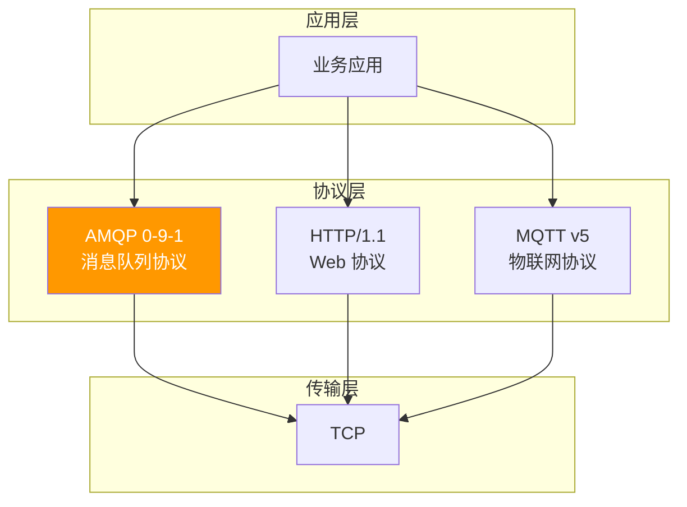
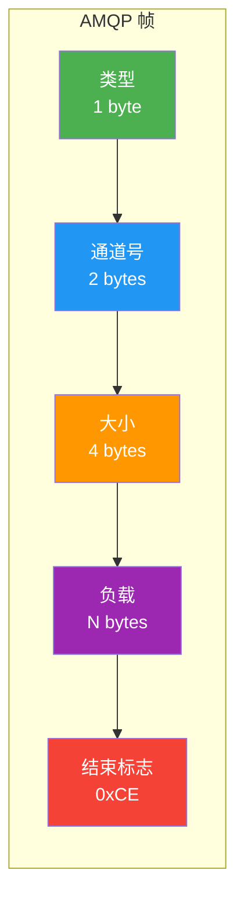
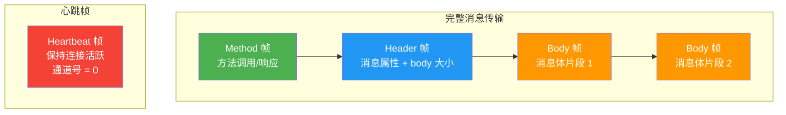
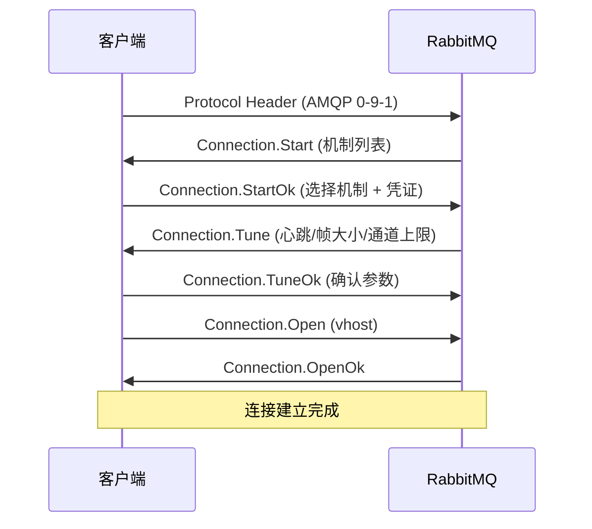
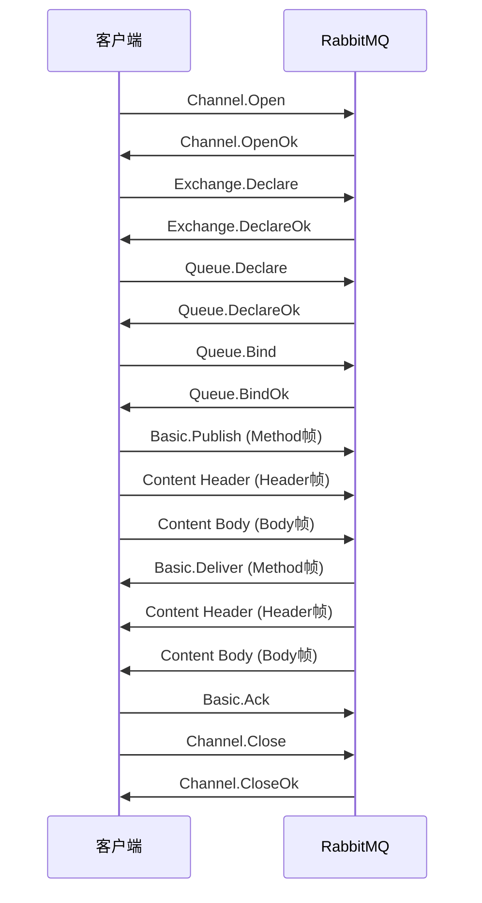
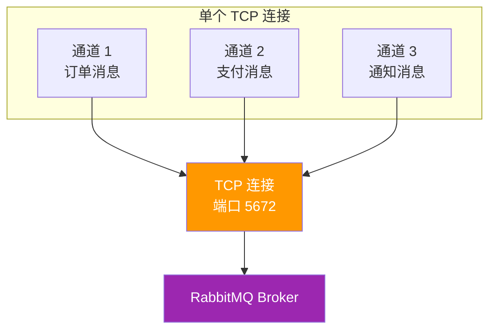
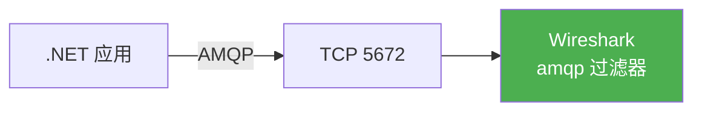

# 01 · AMQP 协议详解

## AMQP 是什么

AMQP（Advanced Message Queuing Protocol）是应用层协议规范，定义了消息的格式、路由、可靠传递等规则。RabbitMQ 实现了 AMQP 0-9-1 版本。



### 为什么 AMQP 是二进制协议？

| 特性 | 二进制协议 (AMQP) | 文本协议 (HTTP) |
|------|-------------------|-----------------|
| 解析效率 | 高（无需解析文本） | 低（需解析文本） |
| 带宽占用 | 小 | 大（头部冗余） |
| 调试难度 | 较高（需工具） | 低（可读性好） |
| 扩展性 | 强（帧结构灵活） | 一般 |

::: tip 二进制协议的优势
消息队列场景下，每秒可能处理数万条消息，二进制协议的解析效率优势非常明显。AMQP 的帧结构天然支持多路复用，而 HTTP/1.1 需要多个 TCP 连接才能实现并发。
:::

## AMQP 帧结构

### 帧组成



| 字段 | 大小 | 说明 |
|------|------|------|
| **Type** | 1 byte | 帧类型：1=Method, 2=Header, 3=Body, 4=Heartbeat, 8=Protocol Header |
| **Channel** | 2 bytes | 通道号（0 为连接级帧） |
| **Size** | 4 bytes | 负载长度 |
| **Payload** | N bytes | 帧内容 |
| **End** | 1 byte | 固定值 `0xCE` |

### 四种帧类型



#### Method 帧

承载 AMQP 协议命令，由**类（Class）+ 方法（Method）+ 参数**组成：

```
类 60 (Basic) + 方法 40 (Publish) + 参数 (exchange, routing-key, mandatory, immediate)
类 60 (Basic) + 方法 60 (Deliver) + 参数 (consumer-tag, delivery-tag, redelivered, exchange, routing-key)
类 60 (Basic) + 方法 80 (Ack) + 参数 (delivery-tag, multiple)
```

#### Header 帧

包含消息属性（14 个标准属性 + 自定义 Headers）和消息体大小：

```
Content-Type: application/json
Delivery-Mode: 2
Message-Id: abc-123
Body-Size: 1024
```

#### Body 帧

消息体数据。大消息会被拆分为多个 Body 帧，每个帧最大 `frame_max` 字节（默认 128KB，可配置到 0）。

#### Heartbeat 帧

保持 TCP 连接活跃，防止防火墙/负载均衡器关闭空闲连接。通道号固定为 0。

## AMQP 通信流程

### 连接建立



### 通道与消息操作



## 通道多路复用



### 为什么需要多路复用？

- **减少 TCP 连接数**：每个连接消耗文件描述符和内存
- **独立流量控制**：每个通道独立背压，互不影响
- **降低握手开销**：一次 TCP 握手，多通道复用

::: warning 通道不是线程安全的
- **一个通道同一时刻只能被一个线程使用**
- 多线程共享通道会导致帧交错，协议错误
- 推荐做法：每个线程创建独立通道，共享连接
- .NET 客户端中 `IModel` 不是线程安全的
:::

### 通道级错误处理

AMQP 的通道错误采用"通道关闭"模型：

```
通道上发生错误 → 通道立即关闭 → 客户端收到 Channel.Close
→ 该通道上所有操作失败 → 需要创建新通道
```

```csharp
// 监听通道关闭事件
channel.ChannelShutdown += (sender, args) =>
{
    Console.WriteLine($"通道关闭: {args.ReplyCode} - {args.ReplyText}");
    Console.WriteLine($"关闭原因: 类={args.ClassId}, 方法={args.MethodId}");
};
```

::: important 常见通道错误
| 错误码 | 含义 | 原因 |
|--------|------|------|
| 403 | ACCESS_REFUSED | 权限不足 |
| 404 | NOT_FOUND | 队列/交换机不存在 |
| 405 | RESOURCE_LOCKED | 资源被锁（排他队列） |
| 406 | PRECONDITION_FAILED | 参数不匹配（durable/类型冲突） |
| 530 | NOT_ALLOWED | 操作不允许 |
:::

## AMQP 核心命令

### 连接级命令

| 命令 | 方向 | 说明 |
|------|------|------|
| `Connection.Start/StartOk` | S→C / C→S | 能力协商 |
| `Connection.Tune/TuneOk` | S→C / C→S | 参数协商（心跳/帧大小） |
| `Connection.Open/OpenOk` | C→S / S→C | 打开虚拟主机 |
| `Connection.Close/CloseOk` | 双向 | 关闭连接 |

### 通道级命令

| 命令 | 方向 | 说明 |
|------|------|------|
| `Channel.Open/OpenOk` | C→S / S→C | 打开通道 |
| `Exchange.Declare/DeclareOk` | C→S / S→C | 声明交换机 |
| `Queue.Declare/DeclareOk` | C→S / S→C | 声明队列 |
| `Queue.Bind/BindOk` | C→S / S→C | 绑定队列到交换机 |
| `Basic.Publish` | C→S | 发布消息 |
| `Basic.Consume/ConsumeOk` | C→S / S→C | 订阅消费 |
| `Basic.Deliver` | S→C | 投递消息 |
| `Basic.Ack` | C→S | 确认消息 |
| `Basic.Nack` | C→S | 否认消息 |
| `Basic.Reject` | C→S | 拒绝消息 |
| `Basic.Get/GetOk/GetEmpty` | C→S / S→C | 拉取消息 |

## 协议对比

| 维度 | AMQP 0-9-1 | HTTP/1.1 | MQTT v5 |
|------|------------|-----------|---------|
| **设计目标** | 消息队列 | Web 应用 | 物联网 |
| **通信模式** | 双向、异步 | 请求-响应 | 发布-订阅 |
| **多路复用** | 通道 | 无（HTTP/2 有） | 无 |
| **消息可靠性** | ACK/NACK/TX | 无内置 | QoS 0/1/2 |
| **路由能力** | 强（交换机/绑定） | 无 | 主题通配符 |
| **协议开销** | 低（二进制） | 高（文本头部） | 极低 |
| **适用场景** | 后端服务间通信 | API 调用 | 设备到云端 |

## Wire-level 调试

### Wireshark 抓包



1. 安装 [Wireshark](https://www.wireshark.org/)
2. 过滤器输入：`tcp.port == 5672`
3. 右键帧 → Decode As → AMQP
4. 查看 Method/Header/Body 帧详情

### .NET 客户端 Wire-level 调试

```csharp
using RabbitMQ.Client;

var factory = new ConnectionFactory
{
    HostName = "localhost",
    UserName = "admin",
    Password = "admin123",
    AutomaticRecoveryEnabled = true,
    ClientProvidedName = "WireDebug-Client"
};

using var connection = factory.CreateConnection();

// 监听连接事件
connection.ConnectionShutdown += (sender, args) =>
{
    Console.WriteLine($"连接关闭: {args.ReplyCode} - {args.ReplyText}");
};

using var channel = connection.CreateModel();

// 监听通道事件
channel.ModelShutdown += (sender, args) =>
{
    Console.WriteLine($"通道关闭: {args.ReplyCode} - {args.ReplyText}");
};

// 启用帧追踪（环境变量）
// RABBITMQ_CLIENT_TRACE=true 会输出帧级别日志
Environment.SetEnvironmentVariable("RABBITMQ_CLIENT_TRACE", "true");

Console.WriteLine($"连接状态: {connection.IsOpen}");
Console.WriteLine($"通道状态: {channel.IsOpen}");
Console.WriteLine($"本地端口: {connection.LocalPort}");
```

::: tip 帧大小配置
默认 `frame_max = 0`（无限制），建议设置为合理值：

```csharp
var factory = new ConnectionFactory
{
    HostName = "localhost",
    // 设置最大帧大小为 128KB
    RequestedFrameMax = 131072
};
```
:::

## 参考资料

- [AMQP 0-9-1 规范](https://www.rabbitmq.com/resources/specs/amqp0-9-1.pdf)
- [RabbitMQ 官方文档 - 协议](https://www.rabbitmq.com/protocol.html)
- [RabbitMQ 官方文档 - 连接](https://www.rabbitmq.com/connections.html)
- [RabbitMQ 官方文档 - 通道](https://www.rabbitmq.com/channels.html)
- 《RabbitMQ 实战指南》第 4 章 — 朱忠华
- [RabbitMQ in Depth](https://www.manning.com/books/rabbitmq-in-depth) Chapter 4 — Alvaro Videla

## 面试技巧

::: tip 高频面试问题
1. **AMQP 协议的帧有哪几种类型？**
   - 回答要点：四种——Method 帧（命令）、Header 帧（消息属性）、Body 帧（消息体）、Heartbeat 帧（心跳）。一个完整的消息发送包含 Method + Header + Body 三个帧。

2. **为什么要使用通道多路复用？**
   - 回答要点：减少 TCP 连接数（连接创建开销大），每个通道独立流量控制，互不影响。但通道不是线程安全的，每个线程应使用独立通道。

3. **通道错误怎么处理？**
   - 回答要点：AMQP 采用"通道关闭"模型，通道上任何错误都会导致通道关闭。客户端需监听 `ChannelShutdown` 事件，创建新通道继续工作。常见错误包括参数不匹配（406）、权限不足（403）。

4. **AMQP 和 MQTT 的区别？**
   - 回答要点：AMQP 面向后端服务间通信，路由能力强（交换机+绑定），可靠性高（ACK/NACK）；MQTT 面向物联网设备，协议开销极低，支持 QoS 级别，但路由能力有限。RabbitMQ 同时支持两种协议。
:::
