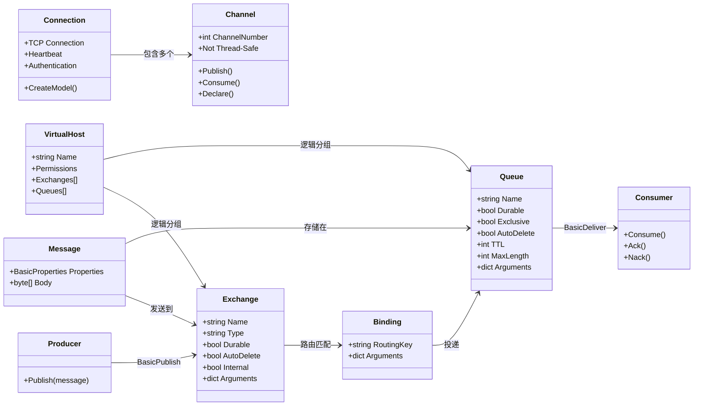
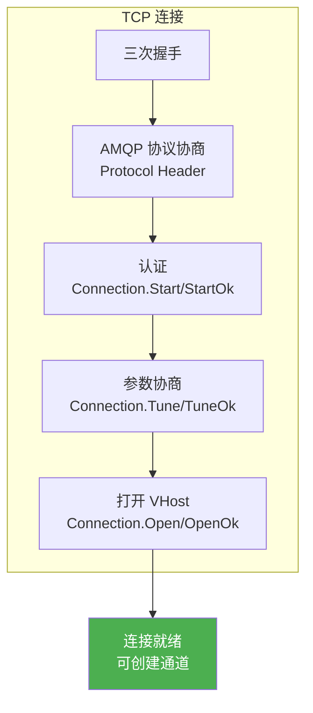
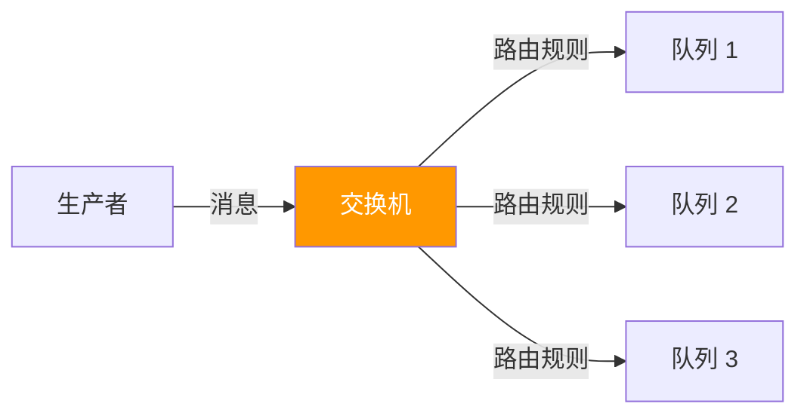
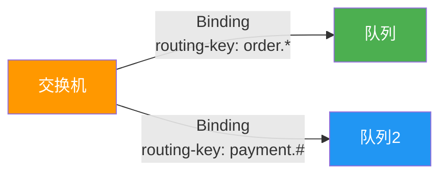
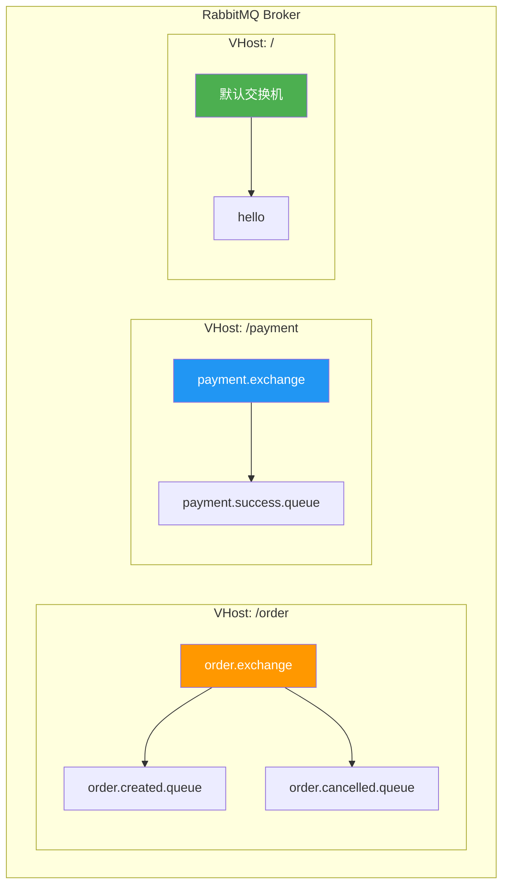

# 02 · 核心概念全解

## 整体架构



## Connection — 连接



### 连接特性

| 特性 | 说明 |
|------|------|
| **TCP 长连接** | 基于 TCP，非 HTTP 短连接 |
| **认证** | SASL 机制（PLAIN/AMQPLAIN/RABBIT-CR-DEMO） |
| **心跳** | 默认 60 秒，检测连接是否存活 |
| **多通道** | 一个连接可创建 65535 个通道 |
| **自动恢复** | `AutomaticRecoveryEnabled` 可自动重连 |

### 连接生命周期

```csharp
var factory = new ConnectionFactory
{
    HostName = "localhost",
    UserName = "admin",
    Password = "admin123",
    VirtualHost = "/",
    RequestedHeartbeat = TimeSpan.FromSeconds(60),
    AutomaticRecoveryEnabled = true,
    NetworkRecoveryInterval = TimeSpan.FromSeconds(5)
};

// 创建连接
using var connection = factory.CreateConnection("MyApp-Connection");

// 监听事件
connection.ConnectionShutdown += (sender, args) =>
{
    Console.WriteLine($"连接关闭: {args.ReplyCode} - {args.ReplyText}");
};

connection.CallbackException += (sender, args) =>
{
    Console.WriteLine($"回调异常: {args.Exception.Message}");
};

connection.ConnectionBlocked += (sender, args) =>
{
    Console.WriteLine($"连接被阻塞: {args.Reason}");
};

connection.ConnectionUnblocked += (sender, args) =>
{
    Console.WriteLine("连接解除阻塞");
};
```

::: important 连接最佳实践
- **应用级共享连接**：一个应用实例共享一个 Connection，多线程各用独立 Channel
- **不要频繁创建/销毁连接**：TCP 连接创建开销大
- **启用自动恢复**：`AutomaticRecoveryEnabled = true`
- **设置合理的 ClientProvidedName**：方便在管理界面识别
:::

## Channel — 通道

通道是连接内的**轻量级虚拟连接**，所有 AMQP 操作都在通道上执行。

### 通道特性

| 特性 | 说明 |
|------|------|
| **轻量级** | 创建/销毁开销远小于 TCP 连接 |
| **非线程安全** | 一个通道同一时刻只能被一个线程使用 |
| **独立流控** | 每个通道独立流量控制 |
| **编号** | 1~65535（0 为连接级） |
| **错误隔离** | 通道错误只关闭当前通道，不影响其他通道 |

```csharp
// 正确用法：每个线程使用独立通道
using var connection = factory.CreateConnection();

// 线程 1
var channel1 = connection.CreateModel();

// 线程 2
var channel2 = connection.CreateModel();

// 错误用法：多线程共享通道
// var sharedChannel = connection.CreateModel();
// Task.Run(() => sharedChannel.BasicPublish(...)); // 危险！
// Task.Run(() => sharedChannel.BasicConsume(...)); // 危险！
```

::: warning 通道泄漏
每个通道占用 Broker 端内存。生产环境中应：
- 使用 `using` 确保 `IModel` 被释放
- 不再使用时主动关闭
- 监控通道数量，告警阈值建议 1000
:::

## Exchange — 交换机

交换机是消息路由的核心组件，负责接收生产者消息并根据路由规则投递到队列。



### 交换机属性

| 属性 | 类型 | 说明 |
|------|------|------|
| `Name` | string | 交换机名称，不能以 `amq.` 开头 |
| `Type` | string | direct / fanout / topic / headers |
| `Durable` | bool | 是否持久化（Broker 重启后是否保留） |
| `AutoDelete` | bool | 最后一个绑定解除后是否自动删除 |
| `Internal` | bool | 是否为内部交换机（客户端不能直接发消息） |
| `Arguments` | dict | 额外参数（如 alternate-exchange） |

### 交换机声明

```csharp
// 声明持久化交换机
channel.ExchangeDeclare(
    exchange: "order.exchange",
    type: ExchangeType.Direct,
    durable: true,
    autoDelete: false,
    arguments: null
);

// 声明带备用交换机的交换机
var arguments = new Dictionary<string, object>
{
    { "alternate-exchange", "order.fallback" }
};
channel.ExchangeDeclare(
    exchange: "order.exchange",
    type: ExchangeType.Topic,
    durable: true,
    arguments: arguments
);

// 被动声明（检查交换机是否存在，不存在则抛异常）
channel.ExchangeDeclarePassive("order.exchange");

// 删除交换机
channel.ExchangeDelete("order.exchange", ifUnused: true);
```

### 四种交换机类型预览

| 类型 | 路由逻辑 | 典型场景 |
|------|----------|----------|
| **Direct** | routing key 精确匹配 | 点对点、日志级别 |
| **Fanout** | 广播到所有绑定队列 | 事件通知、广播 |
| **Topic** | routing key 模式匹配 | 发布订阅、层级分类 |
| **Headers** | 消息头匹配 | 特殊路由需求 |

> 四种交换机类型的详细说明请参阅 [01 · 四种交换机类型](../03_交换机与路由/01_四种交换机类型.md)

### 默认交换机

```csharp
// 默认交换机特性：
// - 名称为空字符串 ""
// - 类型为 Direct
// - 每个队列自动绑定，routing key = 队列名
// - 不能被删除
channel.BasicPublish(
    exchange: "",              // 默认交换机
    routingKey: "my-queue",    // 直接发送到队列
    basicProperties: null,
    body: Encoding.UTF8.GetBytes("hello")
);
```

## Binding — 绑定

绑定定义了**交换机和队列之间的关系**，包含路由规则。



### 绑定操作

```csharp
// 将队列绑定到交换机
channel.QueueBind(
    queue: "order.created.queue",
    exchange: "order.exchange",
    routingKey: "order.created",
    arguments: null
);

// 带参数的绑定（用于 Headers 交换机）
var bindArgs = new Dictionary<string, object>
{
    { "x-match", "all" },
    { "format", "pdf" },
    { "type", "report" }
};
channel.QueueBind(
    queue: "report.pdf.queue",
    exchange: "headers.exchange",
    routingKey: "",
    arguments: bindArgs
);

// 解除绑定
channel.QueueUnbind(
    queue: "order.created.queue",
    exchange: "order.exchange",
    routingKey: "order.created",
    arguments: null
);
```

### Exchange 到 Exchange 绑定

```csharp
// 交换机间也可以绑定（RabbitMQ 扩展）
channel.ExchangeBind(
    destination: "downstream.exchange",
    source: "upstream.exchange",
    routingKey: "important.#"
);
```

## Queue — 队列

队列是消息的最终存储地，消费者从队列获取消息。

### 队列属性

| 属性 | 类型 | 说明 |
|------|------|------|
| `Name` | string | 队列名称，空字符串则自动生成 |
| `Durable` | bool | 是否持久化（定义在 Broker 重启后保留） |
| `Exclusive` | bool | 是否排他（仅创建连接可见，连接关闭自动删除） |
| `AutoDelete` | bool | 最后一个消费者取消订阅后自动删除 |
| `Arguments` | dict | 额外参数（TTL、最大长度、死信等） |

### 队列声明

```csharp
// 基本声明
channel.QueueDeclare(
    queue: "order.created",
    durable: true,
    exclusive: false,
    autoDelete: false,
    arguments: null
);

// 带扩展参数的声明
var args = new Dictionary<string, object>
{
    { "x-message-ttl", 3600000 },                  // 消息 TTL（毫秒）
    { "x-max-length", 10000 },                      // 队列最大长度
    { "x-overflow", "reject-publish" },             // 溢出策略
    { "x-dead-letter-exchange", "dlx.exchange" },   // 死信交换机
    { "x-dead-letter-routing-key", "dlx.order" },   // 死信路由键
    { "x-max-priority", 10 },                       // 最大优先级
    { "x-queue-type", "quorum" }                    // 仲裁队列
};

channel.QueueDeclare(
    queue: "order.priority.queue",
    durable: true,
    exclusive: false,
    autoDelete: false,
    arguments: args
);

// 被动声明（检查队列是否存在）
channel.QueueDeclarePassive("order.created");

// 自动生成队列名（Server 命名）
var result = channel.QueueDeclare(
    queue: "",          // 空字符串，RabbitMQ 自动生成名称
    durable: false,
    exclusive: true,
    autoDelete: true,
    arguments: null
);
Console.WriteLine($"自动生成队列名: {result.QueueName}");
```

::: warning 声明一致性
多次声明同一个队列时，参数必须一致，否则会抛出 `PRECONDITION_FAILED` 异常（错误码 406）。如果需要修改队列参数，必须先删除再重建。
:::

### 排他队列

```csharp
// 排他队列特点：
// 1. 仅对创建它的连接可见
// 2. 连接关闭时自动删除
// 3. 不能被其他连接重新声明
// 4. 适合临时队列场景（如 RPC ReplyTo 队列）

using var connection = factory.CreateConnection();
using var channel = connection.CreateModel();

var replyQueue = channel.QueueDeclare(
    queue: "",
    durable: false,
    exclusive: true,     // 排他
    autoDelete: false,
    arguments: null
);
Console.WriteLine($"RPC 回复队列: {replyQueue.QueueName}");
```

## Virtual Host — 虚拟主机

虚拟主机是 RabbitMQ 中的**逻辑分组**和**权限边界**。



### 虚拟主机特点

- **逻辑隔离**：不同 vhost 的交换机、队列完全隔离
- **权限边界**：用户需要在 vhost 上显式授权
- **资源独立**：每个 vhost 独立管理连接和策略
- **默认 vhost**：`/`，默认用户 `guest` 有全部权限

```csharp
// 连接到指定虚拟主机
var factory = new ConnectionFactory
{
    HostName = "localhost",
    VirtualHost = "/order",   // 指定虚拟主机
    UserName = "order_service",
    Password = "password"
};
```

## Message — 消息

### 消息属性（14 个标准属性）

| 属性 | 类型 | 用途 |
|------|------|------|
| `ContentType` | string | 消息体 MIME 类型 |
| `ContentEncoding` | string | 消息体编码 |
| `Headers` | IDictionary | 自定义头（键值对） |
| `DeliveryMode` | byte | 1=非持久化, 2=持久化 |
| `Priority` | byte | 优先级 0-9 |
| `CorrelationId` | string | 关联 ID（RPC 请求/响应匹配） |
| `ReplyTo` | string | 回复队列名（RPC） |
| `Expiration` | string | 消息 TTL（毫秒，字符串格式） |
| `MessageId` | string | 消息唯一 ID |
| `Timestamp` | AmqpTimestamp | 消息时间戳 |
| `Type` | string | 消息类型名称 |
| `UserId` | string | 发送者用户名 |
| `AppId` | string | 应用标识 |
| `ClusterId` | string | 集群 ID（内部使用） |

### 消息属性 .NET 示例

```csharp
var properties = new BasicProperties
{
    ContentType = "application/json",
    ContentEncoding = "utf-8",
    DeliveryMode = 2,
    Priority = 5,
    MessageId = Guid.NewGuid().ToString(),
    Timestamp = new AmqpTimestamp(DateTimeOffset.UtcNow.ToUnixTimeSeconds()),
    CorrelationId = "req-12345",
    ReplyTo = "amq.rabbitmq.reply-to",
    Expiration = "300000",
    Type = "order.created",
    AppId = "OrderService",
    Headers = new Dictionary<string, object>
    {
        { "x-trace-id", "trace-abc-123" },
        { "x-span-id", "span-def-456" },
        { "x-env", "production" }
    }
};

var body = Encoding.UTF8.GetBytes("{\"orderId\":\"ORD-001\",\"amount\":99.9}");

channel.BasicPublish(
    exchange: "order.exchange",
    routingKey: "order.created",
    basicProperties: properties,
    body: body
);
```

## 参考资料

- [RabbitMQ 官方文档 - 概念](https://www.rabbitmq.com/tutorials/amqp-concepts)
- [AMQP 0-9-1 规范](https://www.rabbitmq.com/resources/specs/amqp0-9-1.pdf)
- [RabbitMQ 官方文档 - 交换机](https://www.rabbitmq.com/exchanges.html)
- [RabbitMQ 官方文档 - 队列](https://www.rabbitmq.com/queues.html)
- 《RabbitMQ 实战指南》第 4 章 — 朱忠华
- [RabbitMQ in Depth](https://www.manning.com/books/rabbitmq-in-depth) Chapter 3 — Alvaro Videla

## 面试技巧

::: tip 高频面试问题
1. **Exchange 和 Queue 的关系？**
   - 回答要点：通过 Binding 关联。Exchange 负责路由，Queue 负责存储。一个 Exchange 可以绑定多个 Queue，一个 Queue 也可以绑定多个 Exchange。消息先到 Exchange，经路由规则匹配后投递到 Queue。

2. **Durable 和 DeliveryMode 有什么区别？**
   - 回答要点：`Durable` 是 Exchange/Queue 的属性，表示**定义**在 Broker 重启后是否保留；`DeliveryMode` 是消息属性，表示**消息内容**是否持久化到磁盘。三者都必须设置（Exchange durable + Queue durable + Message persistent）才能真正持久化。

3. **排他队列的使用场景？**
   - 回答要点：RPC 场景中的临时回复队列。排他队列只对创建它的连接可见，连接关闭自动删除，不需要手动清理。注意重连后排他队列会消失。

4. **Virtual Host 的作用？**
   - 回答要点：逻辑隔离和权限边界。不同业务使用不同 vhost，交换机和队列互不可见。用户需要在 vhost 上显式授权才能操作资源。类似数据库中的 schema 概念。
:::
