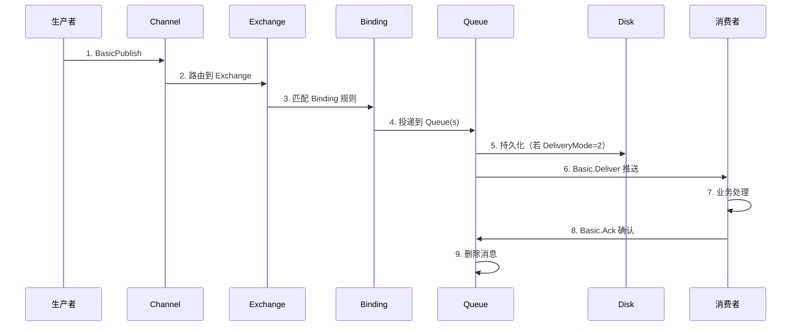
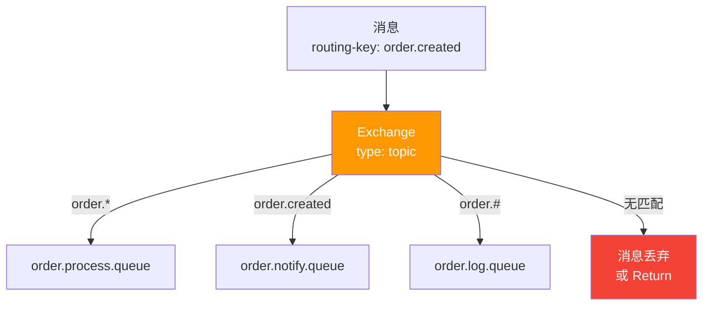
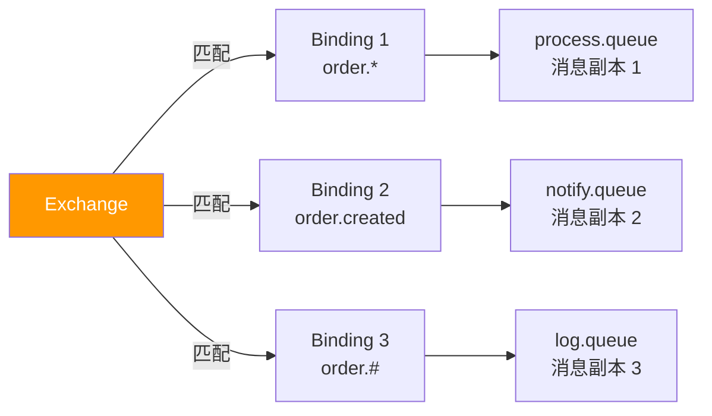
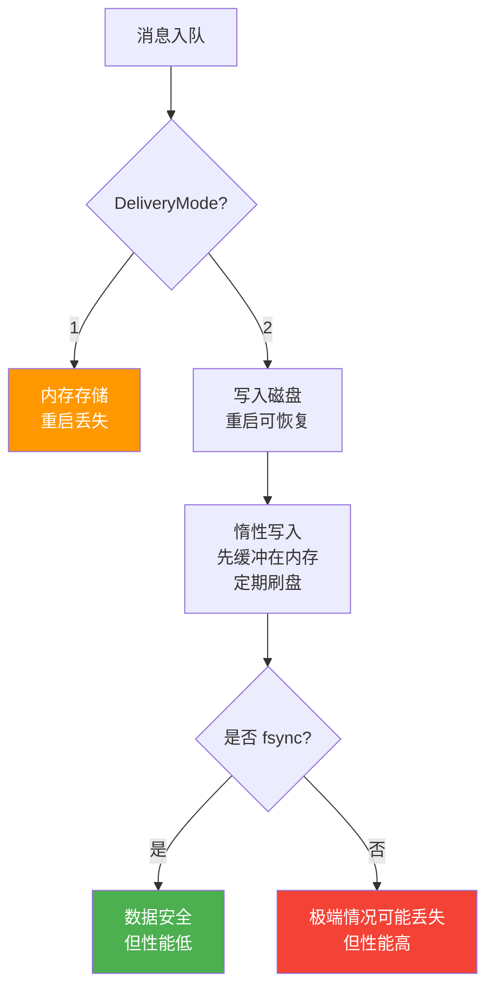
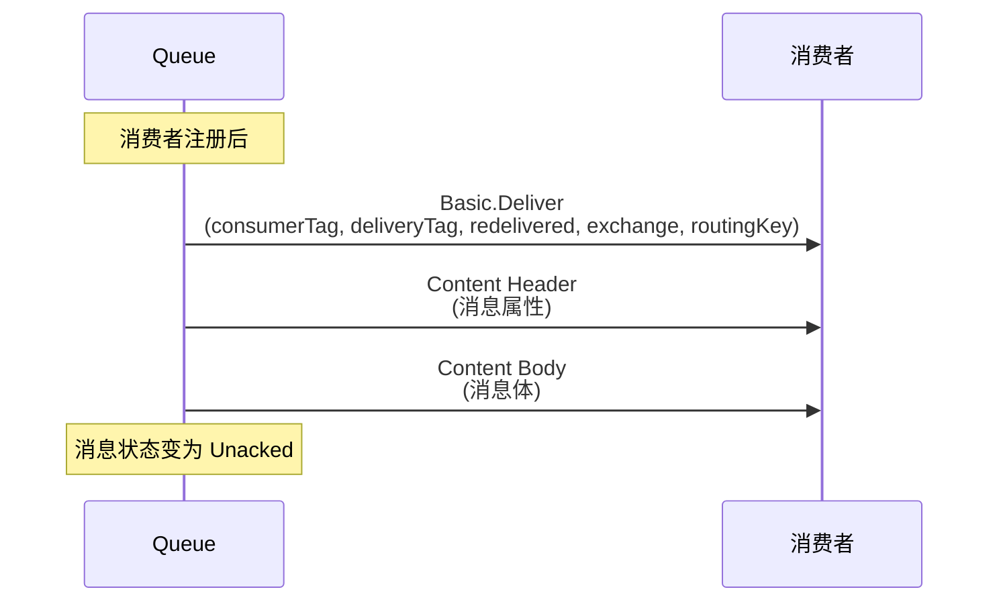
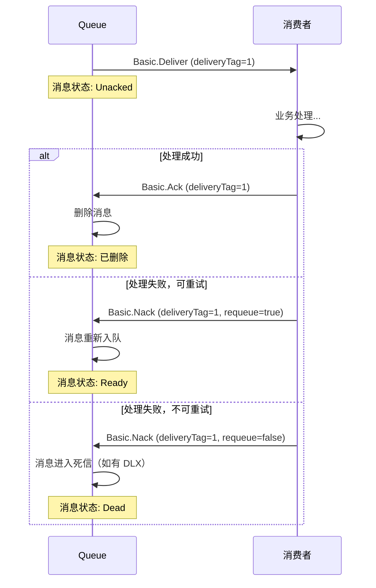
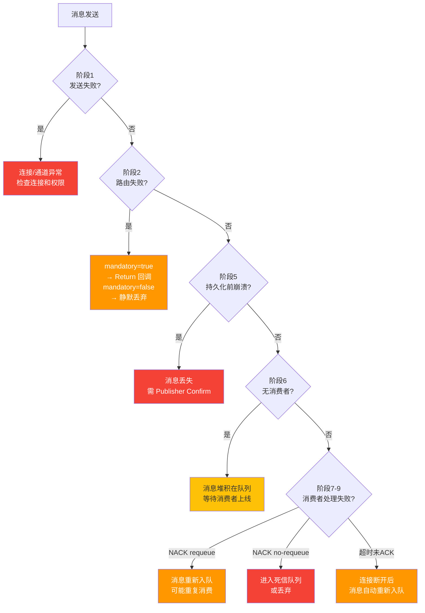

# 03 · 一条消息的旅程

## 全景旅程

一条消息从生产者发出到消费者确认，经历 7 个关键阶段：



## 阶段详解

### 阶段 1：生产者发送

```csharp
// 生产者代码
using var connection = factory.CreateConnection();
using var channel = connection.CreateModel();

var properties = new BasicProperties
{
    ContentType = "application/json",
    DeliveryMode = 2,   // 持久化
    MessageId = Guid.NewGuid().ToString(),
    Timestamp = new AmqpTimestamp(DateTimeOffset.UtcNow.ToUnixTimeSeconds())
};

var body = Encoding.UTF8.GetBytes("{\"orderId\":\"ORD-001\",\"amount\":99.9}");

channel.BasicPublish(
    exchange: "order.exchange",
    routingKey: "order.created",
    mandatory: true,         // 路由失败时触发 Return 回调
    basicProperties: properties,
    body: body
);
```

**此阶段可能失败的情况：**

| 失败场景 | 处理方式 |
|----------|----------|
| 连接未建立 | 抛出 `AlreadyClosedException` |
| 交换机不存在 | 通道关闭（404 NOT_FOUND） |
| 无权限 | 通道关闭（403 ACCESS_REFUSED） |
| 消息过大 | 通道关闭（帧大小超限） |

::: important mandatory 标志
- `mandatory=false`（默认）：消息无法路由时**静默丢弃**
- `mandatory=true`：消息无法路由时触发 `BasicReturn` 事件

```csharp
channel.BasicReturn += (sender, args) =>
{
    Console.WriteLine($"消息无法路由! Exchange={args.Exchange}, " +
                      $"RoutingKey={args.RoutingKey}, " +
                      $"ReplyCode={args.ReplyCode}, " +
                      $"ReplyText={args.ReplyText}");
};
```
:::

### 阶段 2：Exchange 路由

Exchange 收到消息后，根据**交换机类型**和**绑定规则**决定投递到哪些队列：



**路由逻辑：**

| 交换机类型 | 路由规则 |
|------------|----------|
| Direct | routing key 精确匹配 binding key |
| Fanout | 忽略 routing key，投递到所有绑定队列 |
| Topic | routing key 模式匹配 binding key（`*` 和 `#`） |
| Headers | 匹配消息 headers（`x-match=all/any`） |

```csharp
// 消费者侧声明绑定
channel.ExchangeDeclare("order.exchange", ExchangeType.Topic, durable: true);
channel.QueueDeclare("order.process.queue", durable: true, exclusive: false, autoDelete: false);
channel.QueueBind("order.process.queue", "order.exchange", "order.*");

channel.QueueDeclare("order.notify.queue", durable: true, exclusive: false, autoDelete: false);
channel.QueueBind("order.notify.queue", "order.exchange", "order.created");

channel.QueueDeclare("order.log.queue", durable: true, exclusive: false, autoDelete: false);
channel.QueueBind("order.log.queue", "order.exchange", "order.#");
```

### 阶段 3-4：绑定匹配 → 入队

Exchange 匹配 Binding 后，消息被投递到一个或多个队列。**一条消息可以被投递到多个队列**（Fanout/Topic 多匹配场景），每个队列拥有消息的独立副本。



::: important 消息复制
- Exchange → 多个 Queue 时，每个队列收到**独立的消息副本**
- 一个队列中的消息被消费确认，不影响其他队列中的副本
- 这不是"广播共享"，而是"独立投递"
:::

### 阶段 5：持久化

消息入队后，RabbitMQ 根据 `DeliveryMode` 决定存储策略：



**持久化三要素缺一不可：**

| 要素 | 设置 | 说明 |
|------|------|------|
| Exchange Durable | `durable: true` | 交换机定义在重启后保留 |
| Queue Durable | `durable: true` | 队列定义在重启后保留 |
| Message Persistent | `DeliveryMode = 2` | 消息内容写入磁盘 |

```csharp
// 完整持久化示例
channel.ExchangeDeclare("order.exchange", ExchangeType.Topic, durable: true);
channel.QueueDeclare("order.queue", durable: true, exclusive: false, autoDelete: false);
channel.QueueBind("order.queue", "order.exchange", "order.#");

var properties = new BasicProperties
{
    DeliveryMode = 2  // 消息持久化
};

channel.BasicPublish("order.exchange", "order.created", false, properties, body);
```

::: warning 持久化不等于不丢消息
即使三个持久化条件都满足，仍可能在以下场景丢失：
1. 消息还在内存缓冲区，未刷盘时 Broker 崩溃
2. Broker 在 fsync 完成前崩溃
3. 磁盘故障

需要更高可靠性，请配合 Publisher Confirms 机制。
:::

### 阶段 6：推送给消费者



**推送模式 vs 拉取模式：**

| 模式 | API | 特点 |
|------|-----|------|
| **Push** | `BasicConsume` | Broker 主动推送，实时性好，推荐 |
| **Pull** | `BasicGet` | 客户端主动拉取，轮询效率低，不推荐 |

```csharp
// Push 模式（推荐）
var consumer = new EventingBasicConsumer(channel);
consumer.Received += (model, ea) =>
{
    // 处理消息
    var body = ea.Body.ToArray();
    var message = Encoding.UTF8.GetString(body);
    Console.WriteLine($"收到: {message}");

    // 确认消息
    channel.BasicAck(ea.DeliveryTag, multiple: false);
};

channel.BasicConsume("order.queue", autoAck: false, consumer: consumer);
```

```csharp
// Pull 模式（不推荐，仅用于调试）
var result = channel.BasicGet("order.queue", autoAck: false);
if (result != null)
{
    var message = Encoding.UTF8.GetString(result.Body.ToArray());
    Console.WriteLine($"拉取到: {message}");
    channel.BasicAck(result.DeliveryTag, multiple: false);
}
```

### 阶段 7-9：消费者确认与消息删除



**Delivery Tag 机制：**

- 每个 Channel 内的消息有一个递增的 `deliveryTag`（从 1 开始）
- `deliveryTag` 是消费者确认/拒绝的依据
- `multiple=true` 时，确认所有 `<= deliveryTag` 的消息

```csharp
var consumer = new EventingBasicConsumer(channel);
consumer.Received += (model, ea) =>
{
    try
    {
        // 处理业务逻辑
        ProcessOrder(ea.Body.ToArray());

        // 成功：确认消息
        channel.BasicAck(ea.DeliveryTag, multiple: false);
        Console.WriteLine($"已确认 deliveryTag={ea.DeliveryTag}");
    }
    catch (RetryableException ex)
    {
        // 可重试错误：拒绝并重新入队
        channel.BasicNack(ea.DeliveryTag, multiple: false, requeue: true);
        Console.WriteLine($"重新入队 deliveryTag={ea.DeliveryTag}: {ex.Message}");
    }
    catch (Exception ex)
    {
        // 不可重试错误：拒绝且不重新入队（进入死信）
        channel.BasicNack(ea.DeliveryTag, multiple: false, requeue: false);
        Console.WriteLine($"拒绝消息 deliveryTag={ea.DeliveryTag}: {ex.Message}");
    }
};

channel.BasicConsume("order.queue", autoAck: false, consumer: consumer);
```

## 各阶段失败分析



## 时序考虑

| 阶段 | 典型耗时 | 说明 |
|------|----------|------|
| 生产者发送 | < 1ms | 发送到 Broker（同机房） |
| Exchange 路由 | < 0.1ms | 内存操作，极快 |
| 入队 | < 1ms | 内存操作 |
| 持久化写盘 | 1~10ms | 取决于磁盘和刷盘策略 |
| 推送消费者 | < 1ms | 网络 + 序列化 |
| 消费者处理 | 业务相关 | 取决于业务逻辑复杂度 |
| ACK + 删除 | < 1ms | Broker 内存操作 |

::: tip 端到端延迟
同机房环境下，从消息发送到消费者收到，典型延迟为 **1~5ms**（非持久化）或 **5~20ms**（持久化）。跨机房则需加上网络延迟。
:::

## 完整 .NET 端到端示例

```csharp
using System.Text;
using RabbitMQ.Client;
using RabbitMQ.Client.Events;

// ========== 生产者 ==========
var factory = new ConnectionFactory
{
    HostName = "localhost",
    UserName = "admin",
    Password = "admin123"
};

using var producerConnection = factory.CreateConnection("Journey-Producer");
using var producerChannel = producerConnection.CreateModel();

// 声明拓扑
producerChannel.ExchangeDeclare("journey.exchange", ExchangeType.Topic, durable: true);
producerChannel.QueueDeclare("journey.queue", durable: true, exclusive: false, autoDelete: false);
producerChannel.QueueBind("journey.queue", "journey.exchange", "journey.#");

// 发送消息
var props = producerChannel.CreateBasicProperties();
props.ContentType = "application/json";
props.DeliveryMode = 2;
props.MessageId = Guid.NewGuid().ToString();
props.Timestamp = new AmqpTimestamp(DateTimeOffset.UtcNow.ToUnixTimeSeconds());

var message = new { OrderId = "ORD-001", Amount = 99.9, Items = new[] { "Book", "Pen" } };
var json = System.Text.Json.JsonSerializer.Serialize(message);
var body = Encoding.UTF8.GetBytes(json);

producerChannel.BasicPublish("journey.exchange", "journey.created", false, props, body);
Console.WriteLine($"[生产者] 发送消息: MessageId={props.MessageId}");

// ========== 消费者 ==========
using var consumerConnection = factory.CreateConnection("Journey-Consumer");
using var consumerChannel = consumerConnection.CreateModel();

consumerChannel.BasicQos(prefetchSize: 0, prefetchCount: 1, global: false);

var consumer = new EventingBasicConsumer(consumerChannel);
consumer.Received += (model, ea) =>
{
    var receivedJson = Encoding.UTF8.GetString(ea.Body.ToArray());
    var receivedMessage = System.Text.Json.JsonSerializer.Deserialize<JsonElement>(receivedJson);

    Console.WriteLine($"[消费者] 收到消息:");
    Console.WriteLine($"  MessageId: {ea.BasicProperties.MessageId}");
    Console.WriteLine($"  RoutingKey: {ea.RoutingKey}");
    Console.WriteLine($"  Body: {receivedJson}");

    try
    {
        // 模拟业务处理
        Thread.Sleep(100);
        consumerChannel.BasicAck(ea.DeliveryTag, multiple: false);
        Console.WriteLine($"[消费者] 确认消息: deliveryTag={ea.DeliveryTag}");
    }
    catch (Exception ex)
    {
        consumerChannel.BasicNack(ea.DeliveryTag, multiple: false, requeue: true);
        Console.WriteLine($"[消费者] 拒绝消息: {ex.Message}");
    }
};

consumerChannel.BasicConsume("journey.queue", autoAck: false, consumer: consumer);
Console.WriteLine("[消费者] 等待消息...");

Console.ReadLine();
```

## 参考资料

- [RabbitMQ 官方文档 - 发布消息](https://www.rabbitmq.com/publishers.html)
- [RabbitMQ 官方文档 - 消费消息](https://www.rabbitmq.com/consumers.html)
- [RabbitMQ 官方文档 - 持久化](https://www.rabbitmq.com/persistence.html)
- [AMQP 0-9-1 规范](https://www.rabbitmq.com/resources/specs/amqp0-9-1.pdf)
- 《RabbitMQ 实战指南》第 5 章 — 朱忠华
- [RabbitMQ in Depth](https://www.manning.com/books/rabbitmq-in-depth) Chapter 5 — Alvaro Videla

## 面试技巧

::: tip 高频面试问题
1. **一条消息从发送到被消费经历了哪些步骤？**
   - 回答要点：7 步——① 生产者 BasicPublish → ② Exchange 路由 → ③ Binding 匹配 → ④ Queue 入队 → ⑤ 持久化（可选） → ⑥ 推送给消费者 → ⑦ 消费者 ACK 后删除。面试中能完整说出这 7 步并解释每步的含义，非常加分。

2. **消息在哪些环节可能丢失？**
   - 回答要点：① 发送时网络异常（需 Publisher Confirm）② 路由失败被静默丢弃（需 mandatory + Return）③ 持久化前 Broker 崩溃（需持久化 + Confirm）④ 消费者处理失败未 ACK（需手动 ACK + 重试机制）。

3. **Push 和 Pull 模式的区别？**
   - 回答要点：Push（BasicConsume）是 Broker 主动推送，实时性好，是推荐模式；Pull（BasicGet）是客户端轮询拉取，效率低且增加 Broker 负担，仅在调试场景使用。

4. **一条消息能被投递到多个队列吗？**
   - 回答要点：能。Fanout 交换机会投递到所有绑定队列；Topic/Direct 交换机如果多个 Binding 匹配同一个 routing key，也会投递到多个队列。每个队列收到的是独立副本，互不影响。
:::
