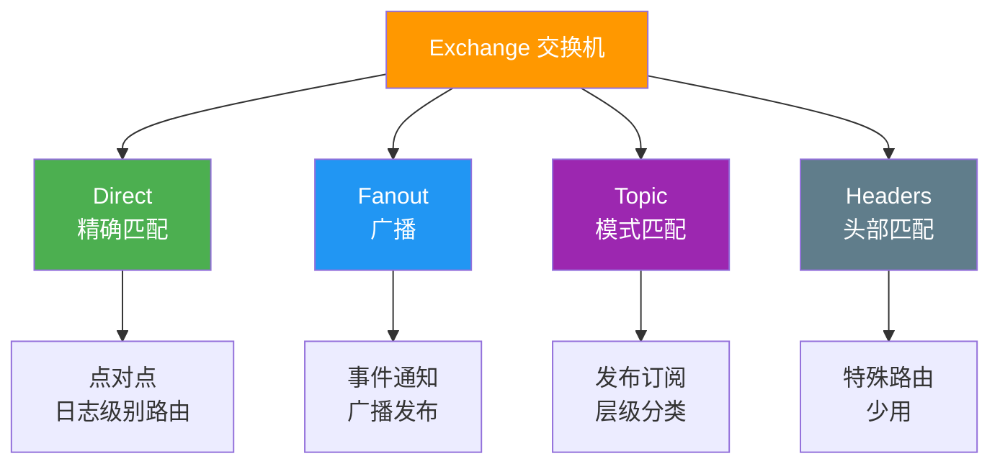
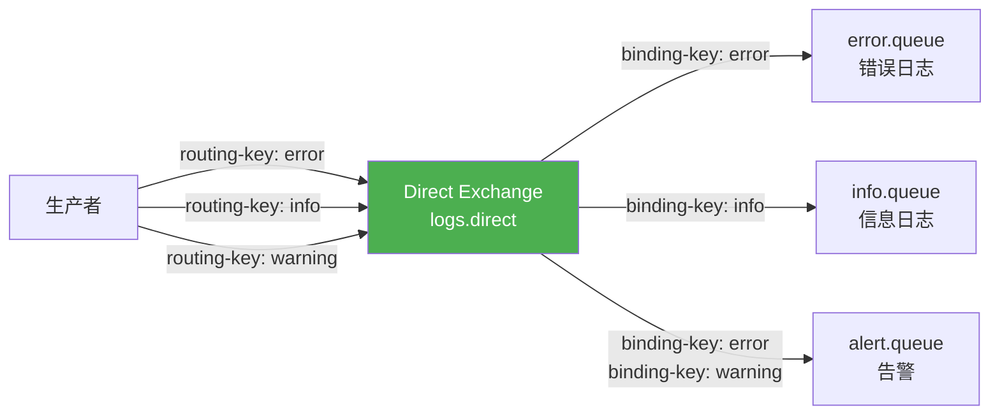
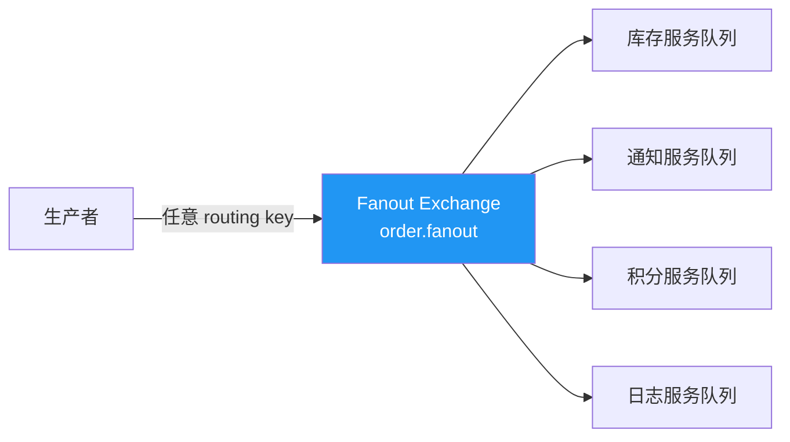
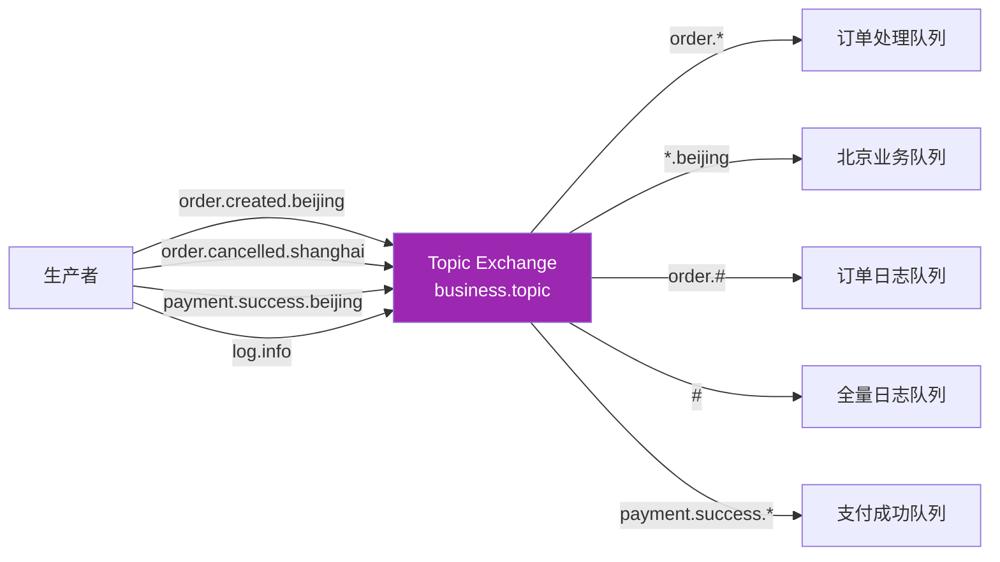
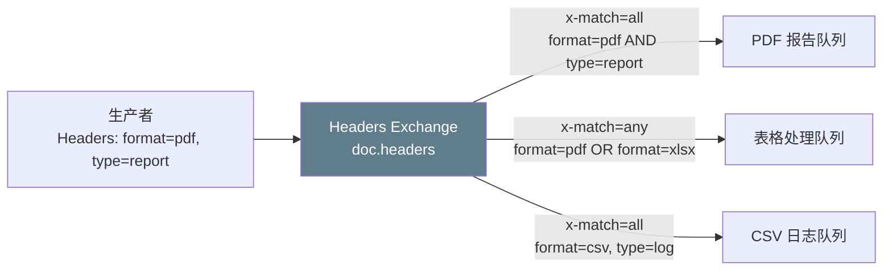
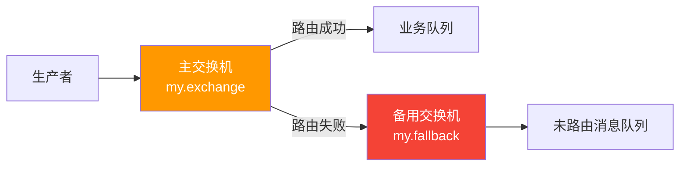
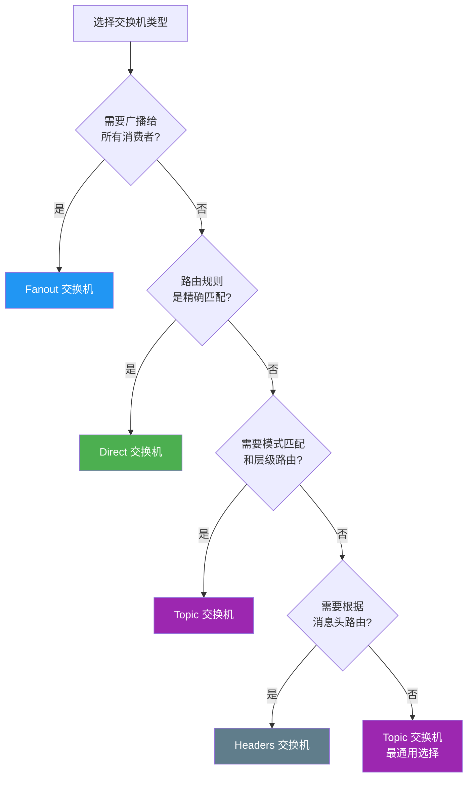

# 01 · 四种交换机类型

## 交换机类型总览



## Direct 交换机 — 精确匹配

路由规则：**routing key 完全等于 binding key** 才投递。



### .NET 实现

```csharp
using System.Text;
using RabbitMQ.Client;
using RabbitMQ.Client.Events;

var factory = new ConnectionFactory { HostName = "localhost", UserName = "admin", Password = "admin123" };

using var connection = factory.CreateConnection();
using var channel = connection.CreateModel();

// 1. 声明 Direct 交换机
channel.ExchangeDeclare("logs.direct", ExchangeType.Direct, durable: true);

// 2. 声明队列
channel.QueueDeclare("error.queue", durable: true, exclusive: false, autoDelete: false);
channel.QueueDeclare("info.queue", durable: true, exclusive: false, autoDelete: false);
channel.QueueDeclare("alert.queue", durable: true, exclusive: false, autoDelete: false);

// 3. 绑定
channel.QueueBind("error.queue", "logs.direct", "error");
channel.QueueBind("info.queue", "logs.direct", "info");
channel.QueueBind("alert.queue", "logs.direct", "error");
channel.QueueBind("alert.queue", "logs.direct", "warning");

// 4. 生产者发送
var levels = new[] { "error", "info", "warning" };
foreach (var level in levels)
{
    var message = $"Log message at {level} level - {DateTime.Now:HH:mm:ss}";
    var body = Encoding.UTF8.GetBytes(message);

    channel.BasicPublish("logs.direct", level, null, body);
    Console.WriteLine($"[x] Sent [{level}]: {message}");
}

// 5. 消费者接收（error.queue）
var consumer = new EventingBasicConsumer(channel);
consumer.Received += (model, ea) =>
{
    var message = Encoding.UTF8.GetString(ea.Body.ToArray());
    Console.WriteLine($"[error.queue] Received: {message}");
    channel.BasicAck(ea.DeliveryTag, false);
};
channel.BasicConsume("error.queue", autoAck: false, consumer: consumer);
```

**运行结果：**

| 发送 routing key | error.queue | info.queue | alert.queue |
|-----------------|-------------|------------|-------------|
| `error` | 收到 | - | 收到 |
| `info` | - | 收到 | - |
| `warning` | - | - | 收到 |

::: tip Direct 交换机适用场景
- 点对点通信
- 日志级别路由（error/warning/info/debug）
- 任务分发（按任务类型路由到不同处理队列）
:::

## Fanout 交换机 — 广播

路由规则：**忽略 routing key，投递到所有绑定的队列**。



### .NET 实现

```csharp
using var connection = factory.CreateConnection();
using var channel = connection.CreateModel();

// 1. 声明 Fanout 交换机
channel.ExchangeDeclare("order.fanout", ExchangeType.Fanout, durable: true);

// 2. 声明队列
var queues = new[] { "inventory.queue", "notification.queue", "points.queue", "audit.queue" };
foreach (var q in queues)
{
    channel.QueueDeclare(q, durable: true, exclusive: false, autoDelete: false);
    // 注意：Fanout 绑定不需要 routing key（即使写了也会被忽略）
    channel.QueueBind(q, "order.fanout", "");
}

// 3. 生产者发送（routing key 无意义）
var orderJson = """{"orderId":"ORD-001","userId":"U-123","amount":299.9}""";
var body = Encoding.UTF8.GetBytes(orderJson);

channel.BasicPublish("order.fanout", routingKey: "", null, body);
Console.WriteLine($"[x] 广播订单消息: {orderJson}");

// 4. 每个队列的消费者都会收到消息
// 例如：notification.queue 消费者
var consumer = new EventingBasicConsumer(channel);
consumer.Received += (model, ea) =>
{
    var message = Encoding.UTF8.GetString(ea.Body.ToArray());
    Console.WriteLine($"[notification.queue] 收到订单: {message}");
    channel.BasicAck(ea.DeliveryTag, false);
};
channel.BasicConsume("notification.queue", autoAck: false, consumer: consumer);
```

**运行结果：**

| 发送消息 | inventory.queue | notification.queue | points.queue | audit.queue |
|----------|-----------------|-------------------|--------------|-------------|
| 订单消息 | 收到 | 收到 | 收到 | 收到 |

::: tip Fanout 交换机适用场景
- 事件通知（订单创建后通知所有下游服务）
- 广播配置更新
- 多服务同步处理同一事件
- Fanout 是最快的一种交换机（无需路由计算）
:::

## Topic 交换机 — 模式匹配

路由规则：**routing key 与 binding key 进行模式匹配**。

通配符规则：
- `*`（星号）：匹配**恰好一个**单词
- `#`（井号）：匹配**零个或多个**单词
- 单词间用 `.`（点号）分隔



### 匹配示例

| routing key | binding key `order.*` | binding key `*.beijing` | binding key `order.#` | binding key `#` |
|-------------|----------------------|------------------------|----------------------|-----------------|
| `order.created.beijing` | 不匹配（3 个单词） | 不匹配（3 个单词） | 匹配 | 匹配 |
| `order.created` | 匹配 | 不匹配 | 匹配 | 匹配 |
| `payment.beijing` | 不匹配 | 匹配 | 不匹配 | 匹配 |
| `beijing` | 不匹配 | 不匹配 | 不匹配 | 匹配 |
| `order` | 不匹配 | 不匹配 | 匹配 | 匹配 |

::: warning 通配符陷阱
- `order.*` 只匹配 `order.xxx`（两个单词），不匹配 `order.xxx.yyy`
- `order.#` 匹配 `order`、`order.xxx`、`order.xxx.yyy.zzz`
- `*` 和 `#` 只在 Topic 交换机中有特殊含义，Direct 交换机中是普通字符
:::

### .NET 实现

```csharp
using var connection = factory.CreateConnection();
using var channel = connection.CreateModel();

// 1. 声明 Topic 交换机
channel.ExchangeDeclare("business.topic", ExchangeType.Topic, durable: true);

// 2. 声明队列并绑定
channel.QueueDeclare("order.process.queue", durable: true, exclusive: false, autoDelete: false);
channel.QueueDeclare("beijing.queue", durable: true, exclusive: false, autoDelete: false);
channel.QueueDeclare("order.log.queue", durable: true, exclusive: false, autoDelete: false);
channel.QueueDeclare("all.log.queue", durable: true, exclusive: false, autoDelete: false);

channel.QueueBind("order.process.queue", "business.topic", "order.*");
channel.QueueBind("beijing.queue", "business.topic", "*.beijing");
channel.QueueBind("order.log.queue", "business.topic", "order.#");
channel.QueueBind("all.log.queue", "business.topic", "#");

// 3. 生产者发送
var messages = new[]
{
    ("order.created", "新订单创建"),
    ("order.cancelled", "订单取消"),
    ("payment.beijing", "北京支付"),
    ("order.shipped.beijing", "订单已发货-北京"),
    ("log.info", "信息日志")
};

foreach (var (routingKey, content) in messages)
{
    var body = Encoding.UTF8.GetBytes(content);
    channel.BasicPublish("business.topic", routingKey, null, body);
    Console.WriteLine($"[x] Sent [{routingKey}]: {content}");
}
```

::: tip Topic 交换机适用场景
- 发布-订阅模式（带层级分类）
- 地域路由（`order.created.beijing`、`order.created.shanghai`）
- 多维度分类（`<业务>.<事件>.<地域>`）
- 最灵活的交换机类型，使用最广泛
:::

## Headers 交换机 — 头部匹配

路由规则：**根据消息的 Headers 属性匹配**，忽略 routing key。

匹配模式由 `x-match` 参数控制：
- `x-match=all`：所有 header 都匹配才投递（AND）
- `x-match=any`：任一 header 匹配即投递（OR）



### .NET 实现

```csharp
using var connection = factory.CreateConnection();
using var channel = connection.CreateModel();

// 1. 声明 Headers 交换机
channel.ExchangeDeclare("doc.headers", ExchangeType.Headers, durable: true);

// 2. 声明队列
channel.QueueDeclare("pdf.report.queue", durable: true, exclusive: false, autoDelete: false);
channel.QueueDeclare("spreadsheet.queue", durable: true, exclusive: false, autoDelete: false);

// 3. 绑定（使用 headers 参数）
channel.QueueBind("pdf.report.queue", "doc.headers", "",
    new Dictionary<string, object>
    {
        { "x-match", "all" },
        { "format", "pdf" },
        { "type", "report" }
    });

channel.QueueBind("spreadsheet.queue", "doc.headers", "",
    new Dictionary<string, object>
    {
        { "x-match", "any" },
        { "format", "pdf" },
        { "format", "xlsx" }
    });

// 4. 生产者发送（设置 Headers）
var properties = new BasicProperties
{
    Headers = new Dictionary<string, object>
    {
        { "format", "pdf" },
        { "type", "report" }
    }
};

var body = Encoding.UTF8.GetBytes("PDF Report Content");
channel.BasicPublish("doc.headers", routingKey: "", properties, body);
Console.WriteLine("[x] Sent PDF report — pdf.report.queue 和 spreadsheet.queue 都会收到");

// 5. 发送不匹配的消息
properties = new BasicProperties
{
    Headers = new Dictionary<string, object>
    {
        { "format", "docx" },
        { "type", "memo" }
    }
};

body = Encoding.UTF8.GetBytes("Word Memo Content");
channel.BasicPublish("doc.headers", routingKey: "", properties, body);
Console.WriteLine("[x] Sent DOCX memo — 两个队列都不会收到");
```

**运行结果：**

| 消息 Headers | pdf.report.queue (all: pdf+report) | spreadsheet.queue (any: pdf|xlsx) |
|-------------|-------------------------------------|-------------------------------------|
| `format=pdf, type=report` | 收到 | 收到 |
| `format=pdf, type=memo` | 不收到 | 收到 |
| `format=xlsx, type=budget` | 不收到 | 收到 |
| `format=docx, type=memo` | 不收到 | 不收到 |

::: important Headers 交换机局限
- 性能较差：每次路由都需要遍历 Headers 字典
- 不直观：路由规则不如 routing key 可读
- 少用：大多数场景 Topic 交换机都能满足
- 适用场景：路由维度不在 routing key 中，而需要根据多个属性组合路由
:::

## 交换机声明参数

```csharp
channel.ExchangeDeclare(
    exchange: "my.exchange",
    type: ExchangeType.Topic,
    durable: true,           // 是否持久化
    autoDelete: false,       // 最后一个绑定解除后是否自动删除
    internal: false,         // 是否为内部交换机
    arguments: new Dictionary<string, object>
    {
        { "alternate-exchange", "my.fallback" }  // 备用交换机
    }
);
```

| 参数 | 说明 |
|------|------|
| `durable` | Broker 重启后交换机定义是否保留 |
| `autoDelete` | 最后一个绑定被解除后，交换机自动删除 |
| `internal` | 客户端不能直接发布消息到此交换机，仅用于内部路由 |
| `alternate-exchange` | 消息无法路由时的备用交换机 |

### 备用交换机（Alternate Exchange）



```csharp
// 声明备用交换机（通常为 Fanout 或 Direct）
channel.ExchangeDeclare("my.fallback", ExchangeType.Fanout, durable: true);
channel.QueueDeclare("unrouted.queue", durable: true, exclusive: false, autoDelete: false);
channel.QueueBind("unrouted.queue", "my.fallback", "");

// 声明主交换机，指定备用交换机
channel.ExchangeDeclare("my.exchange", ExchangeType.Direct, durable: true,
    autoDelete: false,
    arguments: new Dictionary<string, object>
    {
        { "alternate-exchange", "my.fallback" }
    });
```

## 选择决策



| 场景 | 推荐类型 | 原因 |
|------|----------|------|
| 日志级别分发 | Direct | 精确匹配，简单高效 |
| 事件广播 | Fanout | 无需路由计算，性能最佳 |
| 多维度业务路由 | Topic | 模式匹配，最灵活 |
| 微服务事件驱动 | Topic | 支持层级命名，便于扩展 |
| 文档类型路由 | Headers | 多属性组合路由（少用） |
| 简单点对点 | Direct | 最简单，默认交换机即 Direct |

## 参考资料

- [RabbitMQ 官方文档 - 交换机](https://www.rabbitmq.com/exchanges.html)
- [RabbitMQ 官方教程 - 路由](https://www.rabbitmq.com/tutorials/tutorial-four-dotnet)
- [RabbitMQ 官方教程 - Topic](https://www.rabbitmq.com/tutorials/tutorial-five-dotnet)
- [AMQP 0-9-1 规范](https://www.rabbitmq.com/resources/specs/amqp0-9-1.pdf)
- 《RabbitMQ 实战指南》第 4 章 — 朱忠华
- [RabbitMQ in Depth](https://www.manning.com/books/rabbitmq-in-depth) Chapter 3 — Alvaro Videla

## 面试技巧

::: tip 高频面试问题
1. **四种交换机类型的区别？**
   - 回答要点：Direct（精确匹配 routing key）、Fanout（广播到所有队列，忽略 routing key）、Topic（模式匹配，`*` 匹配一个单词，`#` 匹配零或多个）、Headers（匹配消息头，x-match=all/any）。性能排序：Fanout > Direct > Topic > Headers。

2. **Topic 交换机中 `*` 和 `#` 的区别？**
   - 回答要点：`*` 匹配恰好一个单词（`order.*` 匹配 `order.created` 但不匹配 `order.created.beijing`），`#` 匹配零或多个单词（`order.#` 匹配 `order`、`order.created`、`order.created.beijing`）。

3. **什么场景用 Fanout 而不是 Topic？**
   - 回答要点：当所有绑定的队列都需要收到每条消息时用 Fanout（如事件广播），性能最优。如果需要选择性订阅，则用 Topic。

4. **什么是备用交换机（Alternate Exchange）？**
   - 回答要点：当消息无法被主交换机路由到任何队列时，转发到备用交换机。通过 `alternate-exchange` 参数设置。与 `mandatory` 标志不同：mandatory 会 Return 给生产者，AE 则在 Broker 端处理，生产者无感知。
:::
