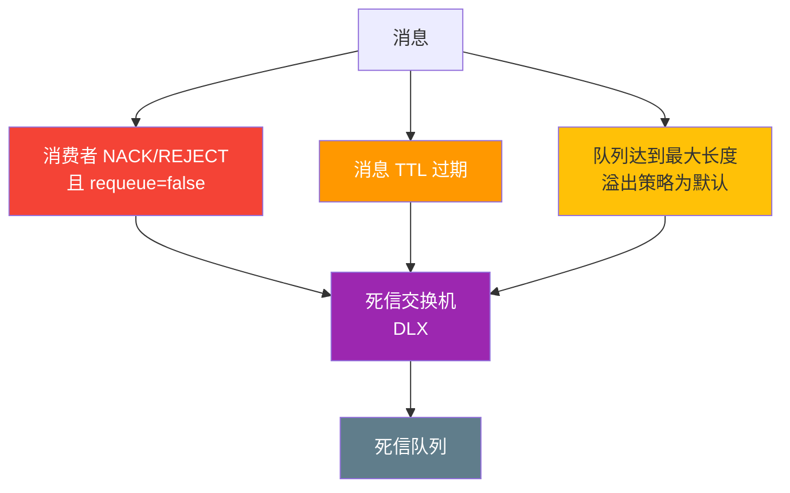
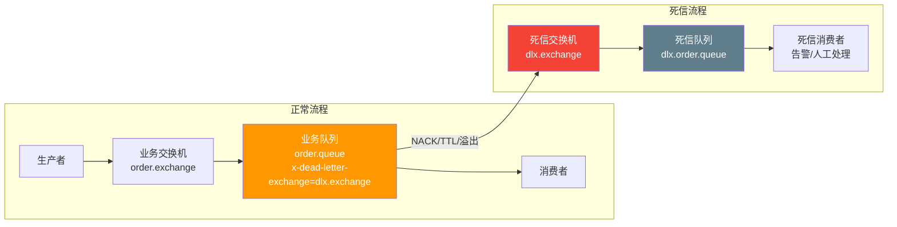
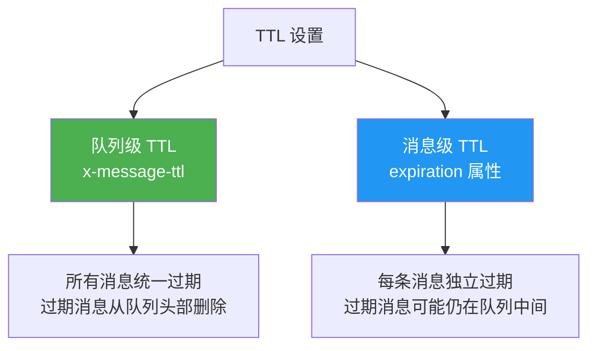
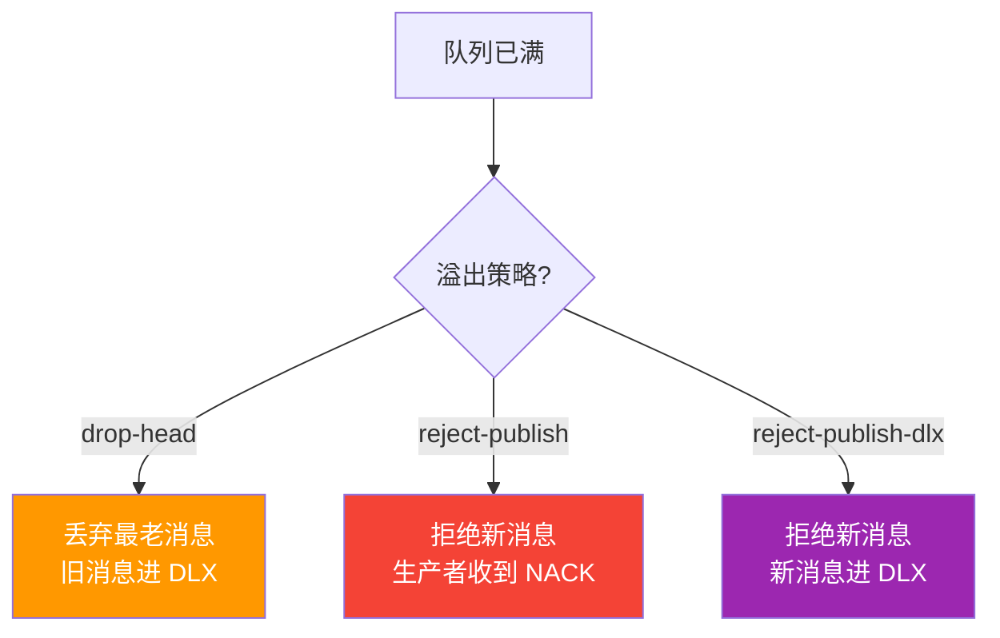
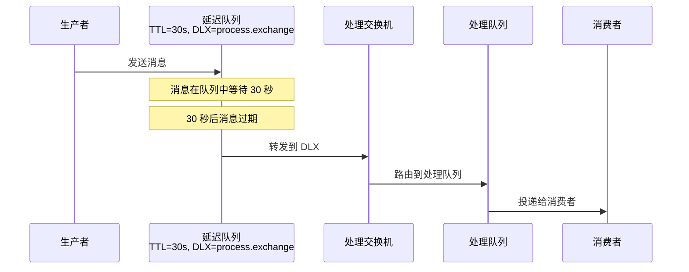
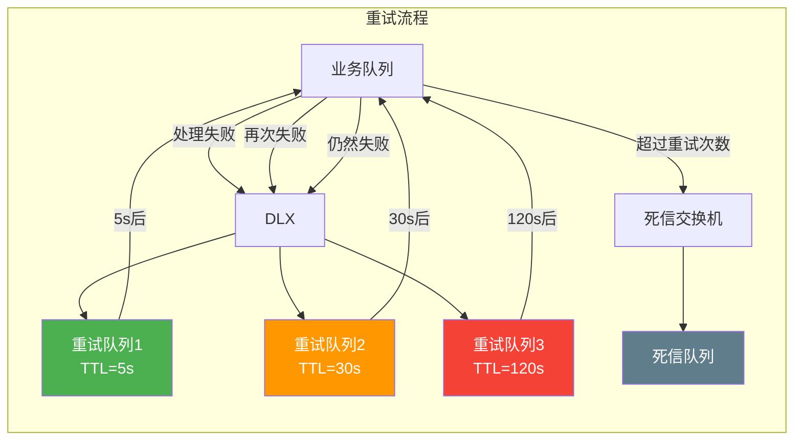

# 02 · 死信交换机与 TTL

## 什么是死信

死信（Dead Letter）是无法被正常消费的消息。消息变成死信的三种情况：



| 死信原因 | 说明 |
|----------|------|
| **NACK/REJECT + requeue=false** | 消费者明确拒绝且不重新入队 |
| **TTL 过期** | 消息在队列中存活时间超过设定值 |
| **队列溢出** | 队列消息数超过 `x-max-length`，默认丢弃最老的消息 |

## 死信交换机（DLX）

DLX 本质上就是一个**普通的交换机**，只是被指定为某个队列的死信目标。



### .NET 实现

```csharp
using System.Text;
using RabbitMQ.Client;
using RabbitMQ.Client.Events;

var factory = new ConnectionFactory { HostName = "localhost", UserName = "admin", Password = "admin123" };
using var connection = factory.CreateConnection();
using var channel = connection.CreateModel();

// 1. 声明死信交换机和死信队列
channel.ExchangeDeclare("dlx.exchange", ExchangeType.Direct, durable: true);
channel.QueueDeclare("dlx.order.queue", durable: true, exclusive: false, autoDelete: false);
channel.QueueBind("dlx.order.queue", "dlx.exchange", "dlx.order");

// 2. 声明业务队列，指定死信交换机
channel.ExchangeDeclare("order.exchange", ExchangeType.Direct, durable: true);
channel.QueueDeclare("order.queue", durable: true, exclusive: false, autoDelete: false,
    arguments: new Dictionary<string, object>
    {
        { "x-dead-letter-exchange", "dlx.exchange" },           // 死信交换机
        { "x-dead-letter-routing-key", "dlx.order" }            // 死信路由键
    });
channel.QueueBind("order.queue", "order.exchange", "order.created");

// 3. 生产者发送消息
var properties = new BasicProperties
{
    MessageId = Guid.NewGuid().ToString(),
    ContentType = "application/json"
};
var body = Encoding.UTF8.GetBytes("{\"orderId\":\"ORD-001\"}");
channel.BasicPublish("order.exchange", "order.created", false, properties, body);

// 4. 消费者拒绝消息（模拟死信场景）
var consumer = new EventingBasicConsumer(channel);
consumer.Received += (model, ea) =>
{
    Console.WriteLine($"[业务消费者] 收到消息，模拟处理失败...");
    // 拒绝且不重新入队 → 消息变为死信
    channel.BasicReject(ea.DeliveryTag, requeue: false);
};
channel.BasicConsume("order.queue", autoAck: false, consumer: consumer);

// 5. 死信消费者
var dlxConsumer = new EventingBasicConsumer(channel);
dlxConsumer.Received += (model, ea) =>
{
    // 读取死信头信息
    var deathHeaders = ea.BasicProperties.Headers;
    if (deathHeaders != null && deathHeaders.ContainsKey("x-death"))
    {
        var deaths = (List<object>)deathHeaders["x-death"];
        foreach (var death in deaths)
        {
            var deathDict = (Dictionary<string, object>)death;
            var queue = Encoding.UTF8.GetString((byte[])deathDict["queue"]);
            var reason = Encoding.UTF8.GetString((byte[])deathDict["reason"]);
            var time = deathDict["time"];
            Console.WriteLine($"[死信消费者] 死信来源: queue={queue}, reason={reason}");
        }
    }

    var message = Encoding.UTF8.GetString(ea.Body.ToArray());
    Console.WriteLine($"[死信消费者] 处理死信: {message}");
    channel.BasicAck(ea.DeliveryTag, false);
};
channel.BasicConsume("dlx.order.queue", autoAck: false, consumer: dlxConsumer);
```

### 死信头信息（x-death）

消息变为死信后，RabbitMQ 会在消息头中添加 `x-death` 数组，记录死信详情：

| 字段 | 类型 | 说明 |
|------|------|------|
| `queue` | string | 消息死亡时所在的队列 |
| `reason` | string | 死亡原因：`rejected`/`expired`/`maxlen` |
| `time` | timestamp | 消息死亡时间 |
| `exchange` | string | 消息最初发布的交换机 |
| `routing-keys` | list | 消息的路由键列表 |
| `count` | int | 此队列中死亡的次数 |
| `original-expiration` | string | 原始消息的 TTL 值（reason=expired 时） |

## TTL（消息存活时间）

### 两种设置方式



### 队列级 TTL

```csharp
// 所有消息统一 30 秒 TTL
channel.QueueDeclare("order.ttl.queue", durable: true, exclusive: false, autoDelete: false,
    arguments: new Dictionary<string, object>
    {
        { "x-message-ttl", 30000 },  // 毫秒
        { "x-dead-letter-exchange", "dlx.exchange" },
        { "x-dead-letter-routing-key", "dlx.order" }
    });
```

**特点：**
- 队列中所有消息共享同一个 TTL
- 过期消息**从队列头部删除**（高效，队列本身有序）
- 消息过期后立即移除（如果有 DLX 则转发）

### 消息级 TTL

```csharp
// 每条消息独立设置 TTL
var properties = new BasicProperties
{
    Expiration = "60000"  // 60 秒，注意是字符串类型
};

channel.BasicPublish("order.exchange", "order.created", false, properties, body);
```

**特点：**
- 每条消息可以有不同的 TTL
- 过期消息**可能仍在队列中间**，不会立即删除
- 只有当消息到达队列头部时才检查是否过期
- 消息级 TTL 比队列级 TTL 更灵活，但**过期清理不如队列级及时**

::: warning 队列级 TTL vs 消息级 TTL 的关键区别
- **队列级 TTL**：Broker 知道队列的 TTL，可以在消息过期时**主动**从头部删除，效率高
- **消息级 TTL**：每条消息 TTL 不同，Broker 无法高效地从中间删除过期消息，只能等到消息**到达头部**时才检查
- 如果同时设置了两种 TTL，取**较小值**
:::

### TTL 为 0 的特殊用法

```csharp
// TTL = 0：消息立即过期
// 配合 DLX 实现"延迟消息"（RabbitMQ 原生不支持延迟消息的替代方案）
var properties = new BasicProperties
{
    Expiration = "0"
};

// 消息到达队列后立即过期 → 转发到 DLX → 死信队列的消费者处理
```

## 队列长度限制

```csharp
channel.QueueDeclare("limited.queue", durable: true, exclusive: false, autoDelete: false,
    arguments: new Dictionary<string, object>
    {
        { "x-max-length", 1000 },                  // 最多 1000 条消息
        { "x-overflow", "drop-head" }              // 溢出策略
    });
```

### 溢出策略

| 策略 | 说明 | 死信 |
|------|------|------|
| `drop-head`（默认） | 丢弃最老的消息 | 被丢弃的消息进入 DLX |
| `reject-publish` | 拒绝新消息（不丢弃旧消息） | 新消息不进入 DLX |
| `reject-publish-dlx` | 拒绝新消息并将其路由到 DLX | 被拒绝的新消息进入 DLX |



## 经典模式：DLX + TTL 实现延迟消息

RabbitMQ 原生不支持延迟消息，但通过 **DLX + TTL** 组合可以实现：



### .NET 实现

```csharp
using var connection = factory.CreateConnection();
using var channel = connection.CreateModel();

// 1. 声明处理交换机和队列
channel.ExchangeDeclare("process.exchange", ExchangeType.Direct, durable: true);
channel.QueueDeclare("process.queue", durable: true, exclusive: false, autoDelete: false);
channel.QueueBind("process.queue", "process.exchange", "process");

// 2. 声明延迟队列（TTL + DLX，无消费者）
channel.ExchangeDeclare("delay.exchange", ExchangeType.Direct, durable: true);
channel.QueueDeclare("delay.30s.queue", durable: true, exclusive: false, autoDelete: false,
    arguments: new Dictionary<string, object>
    {
        { "x-message-ttl", 30000 },                          // 30 秒延迟
        { "x-dead-letter-exchange", "process.exchange" },     // 过期后转发到处理交换机
        { "x-dead-letter-routing-key", "process" }
    });
channel.QueueBind("delay.30s.queue", "delay.exchange", "delay.30s");

// 3. 生产者发送延迟消息
var body = Encoding.UTF8.GetBytes("{\"action\":\"send_email\",\"to\":\"user@example.com\"}");
channel.BasicPublish("delay.exchange", "delay.30s", null, body);
Console.WriteLine("[x] 延迟消息已发送，30 秒后处理");

// 4. 处理消费者（30 秒后收到消息）
var consumer = new EventingBasicConsumer(channel);
consumer.Received += (model, ea) =>
{
    var message = Encoding.UTF8.GetString(ea.Body.ToArray());
    Console.WriteLine($"[处理消费者] 收到延迟消息: {message}");
    channel.BasicAck(ea.DeliveryTag, false);
};
channel.BasicConsume("process.queue", autoAck: false, consumer: consumer);
```

::: important 多级延迟
不同延迟时间需要不同的延迟队列：

```csharp
// 5 秒延迟队列
channel.QueueDeclare("delay.5s.queue", durable: true, exclusive: false, autoDelete: false,
    arguments: new Dictionary<string, object>
    {
        { "x-message-ttl", 5000 },
        { "x-dead-letter-exchange", "process.exchange" },
        { "x-dead-letter-routing-key", "process" }
    });

// 30 秒延迟队列
channel.QueueDeclare("delay.30s.queue", ...); // 如上

// 5 分钟延迟队列
channel.QueueDeclare("delay.5m.queue", durable: true, exclusive: false, autoDelete: false,
    arguments: new Dictionary<string, object>
    {
        { "x-message-ttl", 300000 },
        { "x-dead-letter-exchange", "process.exchange" },
        { "x-dead-letter-routing-key", "process" }
    });
```

推荐使用 [rabbitmq_delayed_message_exchange 插件](https://github.com/rabbitmq/rabbitmq-delayed-message-exchange)，支持在消息级别设置延迟时间，无需为每种延迟创建队列。
:::

## 经典模式：指数退避重试



### .NET 实现

```csharp
using var connection = factory.CreateConnection();
using var channel = connection.CreateModel();

// 业务交换机和队列
channel.ExchangeDeclare("order.exchange", ExchangeType.Direct, durable: true);
channel.QueueDeclare("order.queue", durable: true, exclusive: false, autoDelete: false,
    arguments: new Dictionary<string, object>
    {
        { "x-dead-letter-exchange", "order.retry.exchange" },
        { "x-dead-letter-routing-key", "order.retry" }
    });
channel.QueueBind("order.queue", "order.exchange", "order.created");

// 重试交换机
channel.ExchangeDeclare("order.retry.exchange", ExchangeType.Direct, durable: true);

// 三级重试队列（指数退避：5s → 30s → 120s）
var retryLevels = new[] { 5000, 30000, 120000 };
for (int i = 0; i < retryLevels.Length; i++)
{
    var retryQueueName = $"order.retry.{i}.queue";
    channel.QueueDeclare(retryQueueName, durable: true, exclusive: false, autoDelete: false,
        arguments: new Dictionary<string, object>
        {
            { "x-message-ttl", retryLevels[i] },
            { "x-dead-letter-exchange", "order.exchange" },     // 过期后回到业务交换机
            { "x-dead-letter-routing-key", "order.created" }
        });
    channel.QueueBind(retryQueueName, "order.retry.exchange", "order.retry");
}

// 消费者：根据 x-death 中的 count 判断重试次数
var consumer = new EventingBasicConsumer(channel);
consumer.Received += (model, ea) =>
{
    int retryCount = 0;
    if (ea.BasicProperties.Headers != null &&
        ea.BasicProperties.Headers.TryGetValue("x-death", out var deathObj))
    {
        var deaths = (List<object>)deathObj;
        if (deaths.Count > 0)
        {
            var lastDeath = (Dictionary<string, object>)deaths[0];
            retryCount = Convert.ToInt32(lastDeath["count"]);
        }
    }

    try
    {
        Console.WriteLine($"处理消息 (重试次数: {retryCount})");
        // 模拟业务处理
        ProcessOrder(ea.Body.ToArray());
        channel.BasicAck(ea.DeliveryTag, false);
    }
    catch (Exception ex)
    {
        if (retryCount >= 3)
        {
            // 超过重试次数，进入死信（不设 requeue）
            Console.WriteLine($"超过最大重试次数: {ex.Message}");
            channel.BasicReject(ea.DeliveryTag, requeue: false);
        }
        else
        {
            Console.WriteLine($"处理失败，进入重试: {ex.Message}");
            channel.BasicReject(ea.DeliveryTag, requeue: false);
        }
    }
};
channel.BasicConsume("order.queue", autoAck: false, consumer: consumer);

void ProcessOrder(byte[] body)
{
    // 模拟 50% 概率失败
    if (Random.Shared.NextDouble() < 0.5)
        throw new Exception("订单处理异常");
}
```

## 参考资料

- [RabbitMQ 官方文档 - 死信交换机](https://www.rabbitmq.com/dlx.html)
- [RabbitMQ 官方文档 - TTL](https://www.rabbitmq.com/ttl.html)
- [RabbitMQ 官方文档 - 队列长度限制](https://www.rabbitmq.com/maxlength.html)
- [RabbitMQ 延迟消息插件](https://github.com/rabbitmq/rabbitmq-delayed-message-exchange)
- 《RabbitMQ 实战指南》第 6 章 — 朱忠华
- [RabbitMQ in Depth](https://www.manning.com/books/rabbitmq-in-depth) Chapter 6 — Alvaro Videla

## 面试技巧

::: tip 高频面试问题
1. **消息变成死信的条件？**
   - 回答要点：三种情况——① 消费者 NACK/REJECT 且 requeue=false；② 消息 TTL 过期；③ 队列达到最大长度（默认 drop-head）。消息变为死信后如果队列配置了 DLX，会被转发到死信交换机。

2. **队列级 TTL 和消息级 TTL 的区别？**
   - 回答要点：队列级 TTL 在队列声明时设置，所有消息统一过期，过期消息从头部**主动删除**，效率高；消息级 TTL 在发送时设置，每条消息独立过期，过期消息可能**仍在队列中间**，只有到达头部时才被移除，过期清理不及时。

3. **如何用 RabbitMQ 实现延迟消息？**
   - 回答要点：两种方案——① DLX + TTL：消息发送到设置 TTL 的延迟队列（无消费者），过期后转发到 DLX 再到业务队列；② 使用 `rabbitmq_delayed_message_exchange` 插件，在消息的 `x-delay` 头中设置延迟时间。方案一需要为每种延迟时间创建队列，方案二更灵活。

4. **x-death 头信息包含什么？**
   - 回答要点：包含 queue（原队列名）、reason（死信原因：rejected/expired/maxlen）、time（死亡时间）、exchange（原始交换机）、routing-keys（路由键列表）、count（在此队列中死亡的次数）。通过 count 可以判断重试次数。
:::
