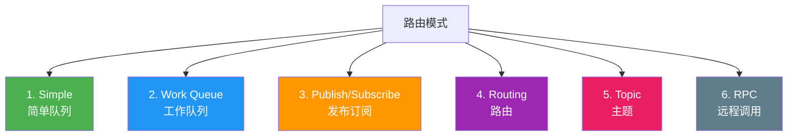
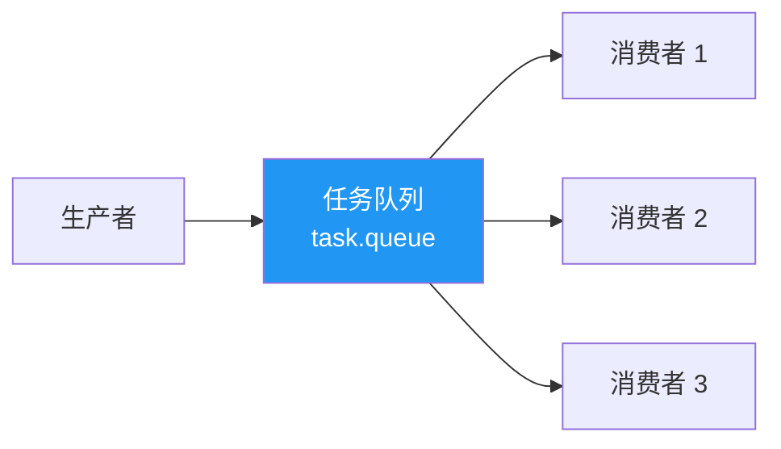
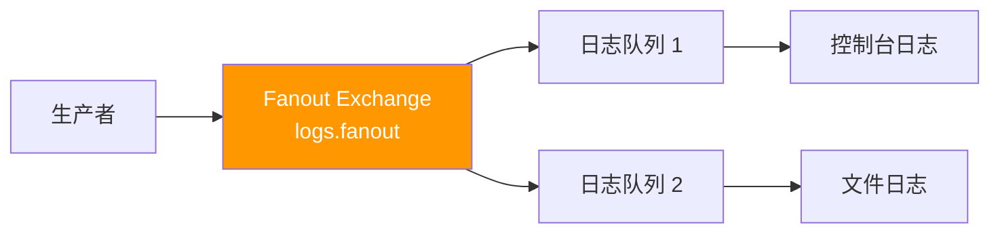
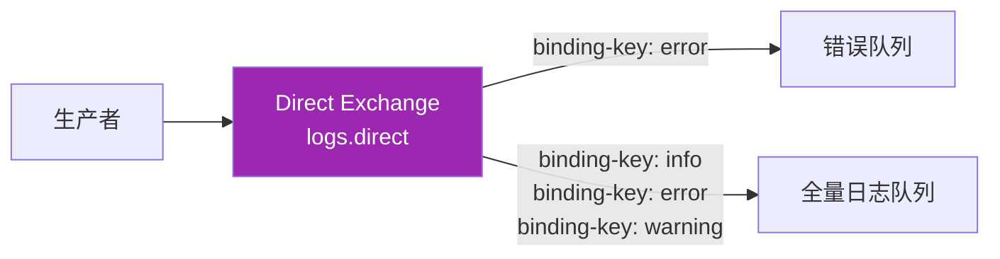
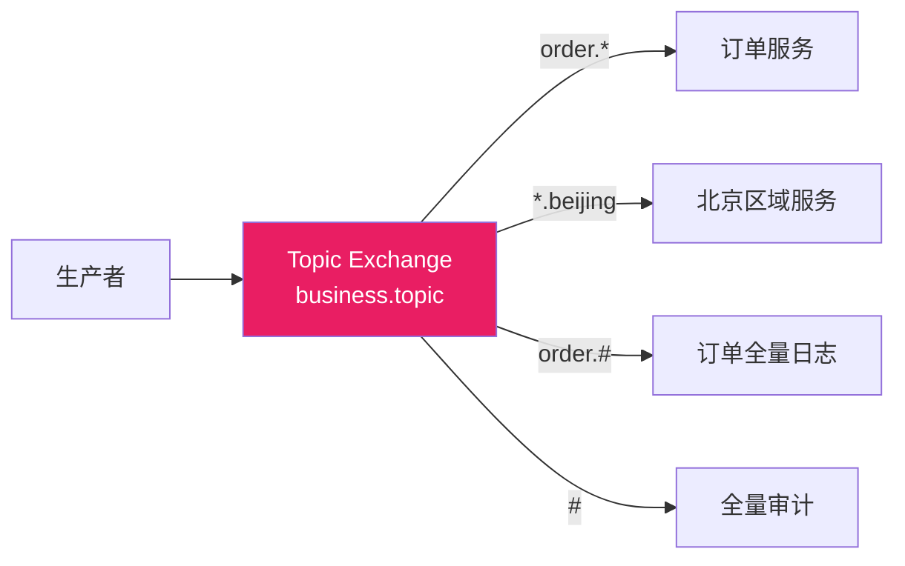
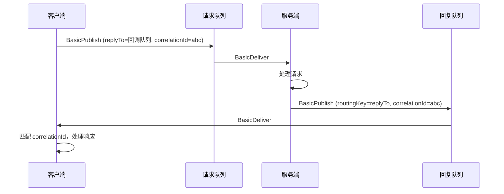

# 03 · 路由模式与实战

## 六种路由模式总览



| 模式 | 交换机 | 特点 | 适用场景 |
|------|--------|------|----------|
| Simple | 默认 | 一对一 | 简单任务 |
| Work Queue | 默认 | 一对多，竞争消费 | 任务分发 |
| Publish/Subscribe | Fanout | 广播 | 事件通知 |
| Routing | Direct | 精确路由 | 条件分发 |
| Topic | Topic | 模式匹配 | 灵活订阅 |
| RPC | 默认 | 请求-响应 | 远程调用 |

## 模式 1：Simple Queue — 简单队列


最简单的模式：一个生产者，一个队列，一个消费者。使用默认交换机。

```csharp
// ===== 生产者 =====
using var connection = factory.CreateConnection();
using var channel = connection.CreateModel();

channel.QueueDeclare("simple.queue", durable: true, exclusive: false, autoDelete: false);

var body = Encoding.UTF8.GetBytes("Hello Simple Queue!");
channel.BasicPublish("", "simple.queue", null, body);

// ===== 消费者 =====
var consumer = new EventingBasicConsumer(channel);
consumer.Received += (model, ea) =>
{
    var message = Encoding.UTF8.GetString(ea.Body.ToArray());
    Console.WriteLine($"[x] Received: {message}");
    channel.BasicAck(ea.DeliveryTag, false);
};
channel.BasicConsume("simple.queue", autoAck: false, consumer: consumer);
```

## 模式 2：Work Queue — 工作队列



多个消费者竞争消费同一队列，每条消息只被一个消费者处理。

### 轮询分发（Round-Robin）

默认策略：消息按顺序轮流分配给消费者。

```
消息1 → 消费者1
消息2 → 消费者2
消息3 → 消费者3
消息4 → 消费者1
...
```

::: warning 轮询的问题
轮询不考虑消费者处理速度差异。消费者1处理快，消费者2处理慢，但两者分配的消息数相同，导致消费者2积压。
:::

### 公平分发（Fair Dispatch）

设置 `prefetchCount = 1`：消费者在确认当前消息之前，不会收到新消息。

```csharp
using var connection = factory.CreateConnection();
using var channel = connection.CreateModel();

channel.QueueDeclare("task.queue", durable: true, exclusive: false, autoDelete: false);

// 关键设置：预取数量 = 1（公平分发）
channel.BasicQos(prefetchSize: 0, prefetchCount: 1, global: false);

var consumer = new EventingBasicConsumer(channel);
consumer.Received += (model, ea) =>
{
    var message = Encoding.UTF8.GetString(ea.Body.ToArray());
    Console.WriteLine($"[x] Received: {message}");

    // 模拟不同耗时的任务
    var dots = message.Count(c => c == '.');
    Thread.Sleep(dots * 1000);

    Console.WriteLine($"[x] Done: {message}");
    channel.BasicAck(ea.DeliveryTag, false);
};

channel.BasicConsume("task.queue", autoAck: false, consumer: consumer);
```

### 生产者发送任务

```csharp
channel.QueueDeclare("task.queue", durable: true, exclusive: false, autoDelete: false);

var tasks = new[] { "Task 1", "Task 2...", "Task 3", "Task 4....", "Task 5..", "Task 6" };

var properties = new BasicProperties { DeliveryMode = 2 };

foreach (var task in tasks)
{
    var body = Encoding.UTF8.GetBytes(task);
    channel.BasicPublish("", "task.queue", properties, body);
    Console.WriteLine($"[x] Sent: {task}");
}
```

::: tip prefetchCount 选择
| 值 | 效果 | 适用场景 |
|----|------|----------|
| `1` | 最公平，处理完一条再取下一条 | 消息处理耗时差异大 |
| `10~50` | 适度预取，提高吞吐 | 消息处理耗时较均匀 |
| `0` | 无限制预取（轮询模式） | 不推荐 |
:::

## 模式 3：Publish/Subscribe — 发布订阅



```csharp
using var connection = factory.CreateConnection();
using var channel = connection.CreateModel();

// 声明 Fanout 交换机
channel.ExchangeDeclare("logs.fanout", ExchangeType.Fanout, durable: true);

// 声明临时队列（自动生成名称，排他，自动删除）
var queue1 = channel.QueueDeclare("", durable: false, exclusive: true, autoDelete: true);
var queue2 = channel.QueueDeclare("", durable: false, exclusive: true, autoDelete: true);

// 绑定到交换机
channel.QueueBind(queue1.QueueName, "logs.fanout", "");
channel.QueueBind(queue2.QueueName, "logs.fanout", "");

Console.WriteLine($"队列1: {queue1.QueueName}");
Console.WriteLine($"队列2: {queue2.QueueName}");

// 生产者
var body = Encoding.UTF8.GetBytes($"Log message at {DateTime.Now:HH:mm:ss}");
channel.BasicPublish("logs.fanout", "", null, body);

// 消费者1：控制台输出
var consumer1 = new EventingBasicConsumer(channel);
consumer1.Received += (model, ea) =>
{
    var msg = Encoding.UTF8.GetString(ea.Body.ToArray());
    Console.WriteLine($"[Console] {msg}");
    channel.BasicAck(ea.DeliveryTag, false);
};
channel.BasicConsume(queue1.QueueName, autoAck: false, consumer: consumer1);
```

## 模式 4：Routing — 路由模式



```csharp
using var connection = factory.CreateConnection();
using var channel = connection.CreateModel();

channel.ExchangeDeclare("logs.direct", ExchangeType.Direct, durable: true);

channel.QueueDeclare("error.queue", durable: true, exclusive: false, autoDelete: false);
channel.QueueDeclare("all_logs.queue", durable: true, exclusive: false, autoDelete: false);

// 错误队列只绑定 error
channel.QueueBind("error.queue", "logs.direct", "error");

// 全量队列绑定所有级别
channel.QueueBind("all_logs.queue", "logs.direct", "error");
channel.QueueBind("all_logs.queue", "logs.direct", "warning");
channel.QueueBind("all_logs.queue", "logs.direct", "info");

// 生产者：按级别发送
var severities = new[] { "error", "warning", "info" };
foreach (var severity in severities)
{
    var body = Encoding.UTF8.GetBytes($"[{severity}] Log at {DateTime.Now:HH:mm:ss}");
    channel.BasicPublish("logs.direct", severity, null, body);
    Console.WriteLine($"[x] Sent [{severity}]");
}

// 消费者：只接收指定级别
var consumer = new EventingBasicConsumer(channel);
consumer.Received += (model, ea) =>
{
    var msg = Encoding.UTF8.GetString(ea.Body.ToArray());
    Console.WriteLine($"[error.queue] {msg}");
    channel.BasicAck(ea.DeliveryTag, false);
};
channel.BasicConsume("error.queue", autoAck: false, consumer: consumer);
```

## 模式 5：Topic — 主题模式



```csharp
using var connection = factory.CreateConnection();
using var channel = connection.CreateModel();

channel.ExchangeDeclare("business.topic", ExchangeType.Topic, durable: true);

channel.QueueDeclare("order.service.queue", durable: true, exclusive: false, autoDelete: false);
channel.QueueDeclare("beijing.service.queue", durable: true, exclusive: false, autoDelete: false);
channel.QueueDeclare("order.audit.queue", durable: true, exclusive: false, autoDelete: false);
channel.QueueDeclare("full.audit.queue", durable: true, exclusive: false, autoDelete: false);

channel.QueueBind("order.service.queue", "business.topic", "order.*");
channel.QueueBind("beijing.service.queue", "business.topic", "*.beijing");
channel.QueueBind("order.audit.queue", "business.topic", "order.#");
channel.QueueBind("full.audit.queue", "business.topic", "#");

// 生产者
var messages = new[]
{
    ("order.created", "新订单创建"),
    ("order.shipped.beijing", "订单已发往北京"),
    ("payment.beijing", "北京支付"),
    ("return.requested", "退货申请")
};

foreach (var (routingKey, content) in messages)
{
    var body = Encoding.UTF8.GetBytes(content);
    channel.BasicPublish("business.topic", routingKey, null, body);
    Console.WriteLine($"[x] Sent [{routingKey}]: {content}");
}
```

**路由结果：**

| routing key | order.* | *.beijing | order.# | # |
|-------------|---------|-----------|---------|---|
| `order.created` | 匹配 | - | 匹配 | 匹配 |
| `order.shipped.beijing` | - | - | 匹配 | 匹配 |
| `payment.beijing` | - | 匹配 | - | 匹配 |
| `return.requested` | - | - | - | 匹配 |

## 模式 6：RPC — 远程过程调用



### .NET RPC 客户端

```csharp
using System.Collections.Concurrent;
using System.Text;
using RabbitMQ.Client;
using RabbitMQ.Client.Events;

public class RpcClient : IDisposable
{
    private readonly IConnection _connection;
    private readonly IModel _channel;
    private readonly string _replyQueueName;
    private readonly EventingBasicConsumer _consumer;
    private readonly ConcurrentDictionary<string, TaskCompletionSource<string>> _pendingTasks
        = new();
    private readonly string _correlationId;

    public RpcClient()
    {
        var factory = new ConnectionFactory { HostName = "localhost", UserName = "admin", Password = "admin123" };

        _connection = factory.CreateConnection();
        _channel = _connection.CreateModel();

        // 声明临时回复队列
        _replyQueueName = _channel.QueueDeclare("", durable: false, exclusive: true, autoDelete: true).QueueName;

        // 注册消费者
        _consumer = new EventingBasicConsumer(_channel);
        _consumer.Received += (model, ea) =>
        {
            // 只处理匹配 correlationId 的响应
            if (_pendingTasks.TryRemove(ea.BasicProperties.CorrelationId, out var tcs))
            {
                var response = Encoding.UTF8.GetString(ea.Body.ToArray());
                tcs.TrySetResult(response);
            }
        };

        _channel.BasicConsume(_replyQueueName, autoAck: true, consumer: _consumer);
    }

    public Task<string> CallAsync(string message, CancellationToken cancellationToken = default)
    {
        var correlationId = Guid.NewGuid().ToString();
        var tcs = new TaskCompletionSource<string>();

        using var ctr = cancellationToken.Register(() => _pendingTasks.TryRemove(correlationId, out _));
        _pendingTasks[correlationId] = tcs;

        var properties = _channel.CreateBasicProperties();
        properties.CorrelationId = correlationId;
        properties.ReplyTo = _replyQueueName;

        var body = Encoding.UTF8.GetBytes(message);
        _channel.BasicPublish("", "rpc.queue", properties, body);

        return tcs.Task;
    }

    public void Dispose()
    {
        _connection.Close();
        _channel.Close();
        _connection.Dispose();
        _channel.Dispose();
    }
}
```

### .NET RPC 服务端

```csharp
using System.Text;
using RabbitMQ.Client;
using RabbitMQ.Client.Events;

var factory = new ConnectionFactory { HostName = "localhost", UserName = "admin", Password = "admin123" };
using var connection = factory.CreateConnection();
using var channel = connection.CreateModel();

channel.QueueDeclare("rpc.queue", durable: false, exclusive: false, autoDelete: false);
channel.BasicQos(prefetchSize: 0, prefetchCount: 1, global: false);

var consumer = new EventingBasicConsumer(channel);
consumer.Received += (model, ea) =>
{
    var request = Encoding.UTF8.GetString(ea.Body.ToArray());
    Console.WriteLine($"[RPC Server] 收到请求: {request}");

    // 处理请求（示例：计算斐波那契数列）
    var n = int.Parse(request);
    var result = Fibonacci(n);

    // 回复
    var replyProperties = channel.CreateBasicProperties();
    replyProperties.CorrelationId = ea.BasicProperties.CorrelationId;

    var replyBody = Encoding.UTF8.GetBytes(result.ToString());
    channel.BasicPublish("", ea.BasicProperties.ReplyTo, replyProperties, replyBody);
    channel.BasicAck(ea.DeliveryTag, false);

    Console.WriteLine($"[RPC Server] 返回结果: Fib({n}) = {result}");
};

channel.BasicConsume("rpc.queue", autoAck: false, consumer: consumer);
Console.WriteLine("[RPC Server] 等待请求...");

static int Fibonacci(int n) => n <= 1 ? n : Fibonacci(n - 1) + Fibonacci(n - 2);
```

### RPC 客户端调用

```csharp
using var client = new RpcClient();

Console.WriteLine("请求 Fib(30)...");
var response = await client.CallAsync("30");
Console.WriteLine($"响应: Fib(30) = {response}");
```

::: warning RPC 模式的局限
- **耦合度高**：客户端需要知道服务端存在
- **超时处理**：需要客户端设置超时（TaskCompletionSource + CancellationToken）
- **不适合长耗时操作**：请求-响应模式阻塞等待
- **推荐替代方案**：使用异步消息 + CorrelationId 代替 RPC，降低耦合
:::

## 队列命名约定

| 模式 | 命名约定 | 示例 |
|------|----------|------|
| 业务队列 | `{服务名}.{业务}.{动作}` | `order.service.created` |
| 重试队列 | `{业务}.retry.{级别}` | `order.retry.1` |
| 死信队列 | `dlx.{业务}` | `dlx.order` |
| 延迟队列 | `delay.{时间}` | `delay.30s` |
| RPC 队列 | `rpc.{服务名}` | `rpc.payment` |
| 临时队列 | 自动生成 | `amq.gen-xxxx` |

## Consumer Tag 与取消

```csharp
// 开始消费，返回 consumerTag
var consumerTag = channel.BasicConsume("order.queue", autoAck: false, consumer: consumer);
Console.WriteLine($"消费者标签: {consumerTag}");

// 取消消费
channel.BasicCancel(consumerTag);
Console.WriteLine("消费者已取消");

// 消费者取消事件
consumer.Registered += (model, args) =>
{
    Console.WriteLine($"消费者注册: {string.Join(",", args.ConsumerTags)}");
};

consumer.Unregistered += (model, args) =>
{
    Console.WriteLine($"消费者取消: {string.Join(",", args.ConsumerTags)}");
};

consumer.ConsumerCancelled += (model, args) =>
{
    Console.WriteLine($"消费者被取消: {string.Join(",", args.ConsumerTags)}");
};
```

## 参考资料

- [RabbitMQ 官方教程 - Work Queues](https://www.rabbitmq.com/tutorials/tutorial-two-dotnet)
- [RabbitMQ 官方教程 - Pub/Sub](https://www.rabbitmq.com/tutorials/tutorial-three-dotnet)
- [RabbitMQ 官方教程 - Routing](https://www.rabbitmq.com/tutorials/tutorial-four-dotnet)
- [RabbitMQ 官方教程 - Topic](https://www.rabbitmq.com/tutorials/tutorial-five-dotnet)
- [RabbitMQ 官方教程 - RPC](https://www.rabbitmq.com/tutorials/tutorial-six-dotnet)
- 《RabbitMQ 实战指南》第 5 章 — 朱忠华
- [MassTransit 文档 - 请求-响应](https://masstransit.io/documentation/patterns/request-response)

## 面试技巧

::: tip 高频面试问题
1. **六种路由模式的区别？**
   - 回答要点：Simple（1对1）、Work Queue（1对多竞争消费）、Pub/Sub（1对多广播）、Routing（1对多条件路由）、Topic（1对多模式匹配）、RPC（请求-响应）。前两种用默认交换机，中间三种用 Fanout/Direct/Topic 交换机，RPC 用 CorrelationId + ReplyTo。

2. **Work Queue 的轮询和公平分发有什么区别？**
   - 回答要点：轮询（默认）按顺序分配消息，不考虑消费者处理能力差异；公平分发（prefetchCount=1）在消费者确认当前消息后才分配新消息，处理快的消费者处理更多消息。生产环境应使用公平分发。

3. **RPC 模式如何保证请求-响应匹配？**
   - 回答要点：通过 CorrelationId 匹配。客户端为每个请求生成唯一 CorrelationId，服务端回复时携带相同的 CorrelationId。客户端根据 CorrelationId 将响应与请求匹配。回复队列使用排他临时队列。

4. **什么时候用 Pub/Sub，什么时候用 Topic？**
   - 回答要点：Pub/Sub（Fanout）用于所有消费者都需要收到每条消息的场景（如事件广播）；Topic 用于消费者需要选择性订阅的场景（如只关注特定类型的消息）。Fanout 性能更好（无需路由计算），Topic 更灵活。
:::
