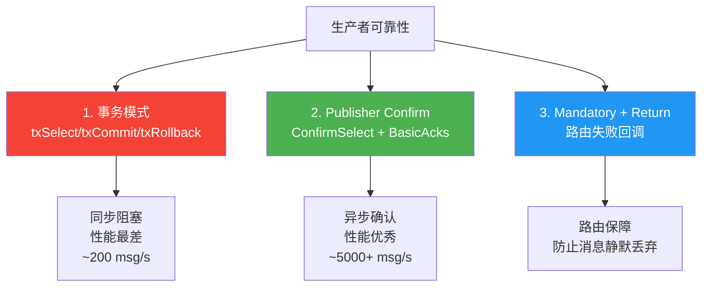
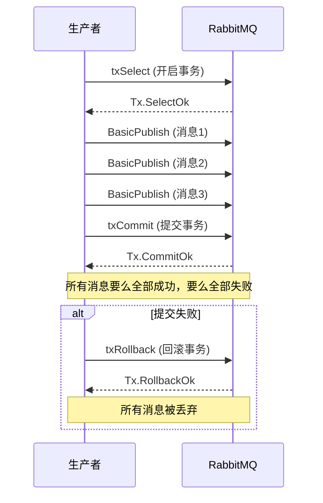
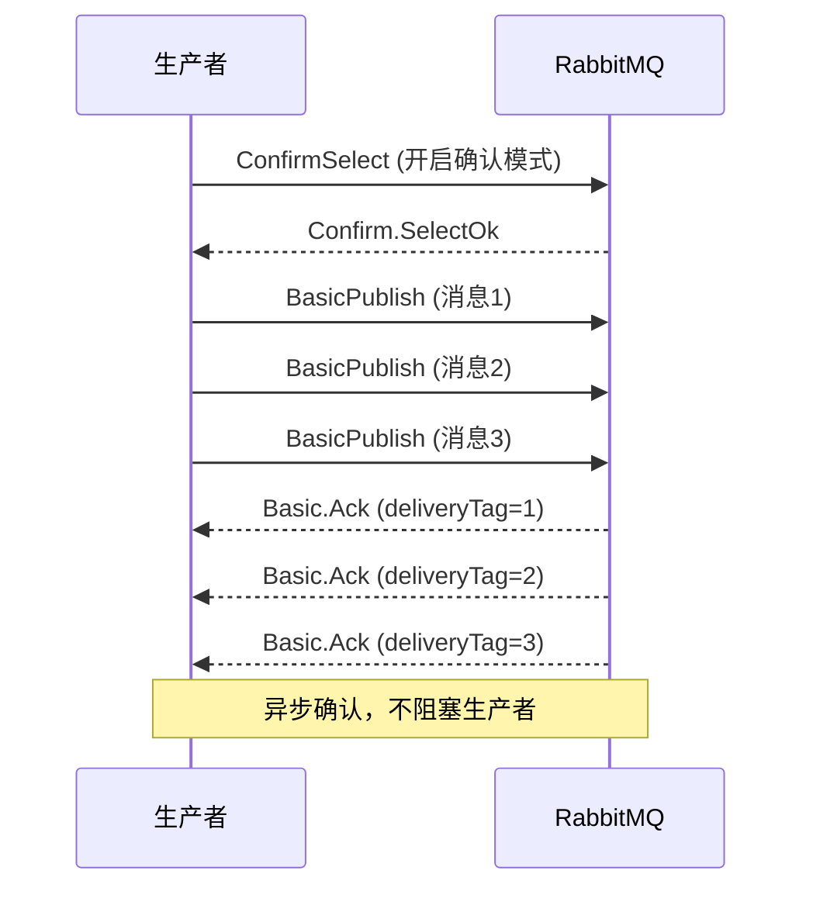
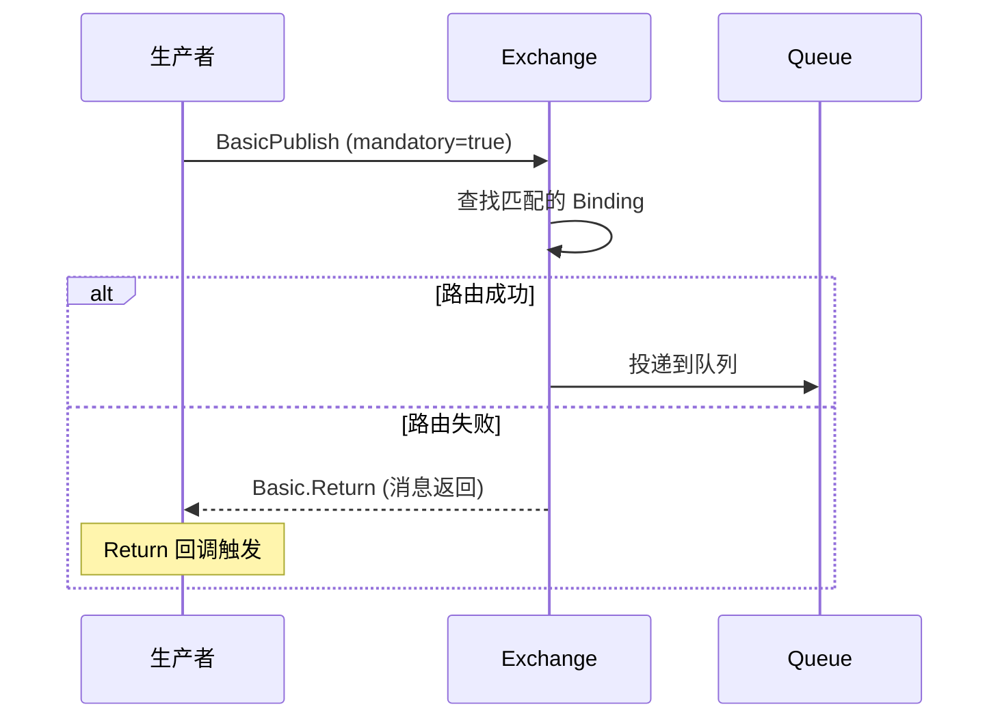
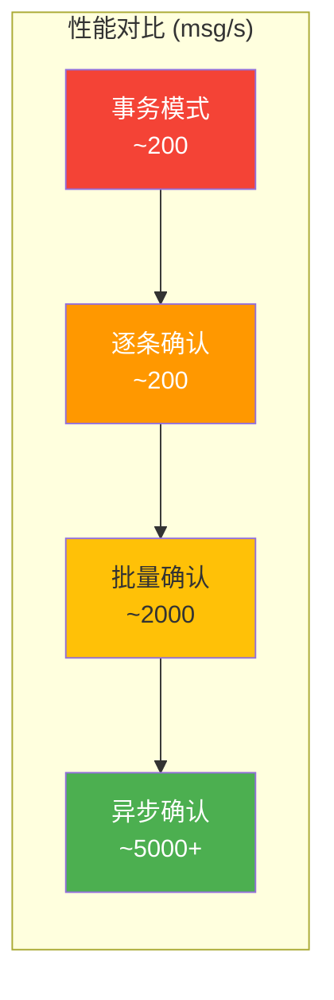

# 01 · 生产者确认机制

## 三层可靠性保障



## 1. 事务模式

事务模式是最早的生产者可靠性方案，采用**同步阻塞**方式。



### .NET 实现

```csharp
using System.Text;
using RabbitMQ.Client;

var factory = new ConnectionFactory { HostName = "localhost", UserName = "admin", Password = "admin123" };
using var connection = factory.CreateConnection();
using var channel = connection.CreateModel();

channel.ExchangeDeclare("tx.exchange", ExchangeType.Direct, durable: true);
channel.QueueDeclare("tx.queue", durable: true, exclusive: false, autoDelete: false);
channel.QueueBind("tx.queue", "tx.exchange", "tx.key");

try
{
    // 开启事务模式
    channel.TxSelect();

    for (int i = 1; i <= 5; i++)
    {
        var body = Encoding.UTF8.GetBytes($"Transaction message {i}");
        channel.BasicPublish("tx.exchange", "tx.key", null, body);
        Console.WriteLine($"[x] Sent: Transaction message {i}");
    }

    // 提交事务
    channel.TxCommit();
    Console.WriteLine("事务提交成功");
}
catch (Exception ex)
{
    // 回滚事务
    channel.TxRollback();
    Console.WriteLine($"事务回滚: {ex.Message}");
}
```

### 性能问题

::: warning 事务模式的性能瓶颈
每条消息发送都需要等待 Broker 确认，**同步阻塞**：

```
发送消息1 → 等待 Broker 处理 → 收到确认
发送消息2 → 等待 Broker 处理 → 收到确认
发送消息3 → 等待 Broker 处理 → 收到确认
...

吞吐量：约 200 msg/s
```

**生产环境不推荐使用事务模式**，应使用 Publisher Confirm 替代。
:::

## 2. Publisher Confirm — 发布确认

Publisher Confirm 是异步确认机制，性能远优于事务模式。



### .NET 实现 — 异步事件处理

```csharp
using System.Text;
using RabbitMQ.Client;

var factory = new ConnectionFactory { HostName = "localhost", UserName = "admin", Password = "admin123" };
using var connection = factory.CreateConnection();
using var channel = connection.CreateModel();

channel.ExchangeDeclare("confirm.exchange", ExchangeType.Direct, durable: true);
channel.QueueDeclare("confirm.queue", durable: true, exclusive: false, autoDelete: false);
channel.QueueBind("confirm.queue", "confirm.exchange", "confirm.key");

// 开启确认模式
channel.ConfirmSelect();

// 注册确认事件
channel.BasicAcks += (sender, args) =>
{
    Console.WriteLine($"[确认] 消息成功: deliveryTag={args.DeliveryTag}, multiple={args.Multiple}");
};

channel.BasicNacks += (sender, args) =>
{
    Console.WriteLine($"[拒绝] 消息失败: deliveryTag={args.DeliveryTag}, multiple={args.Multiple}");
    // 处理失败逻辑：重发、日志、告警
};

// 发送消息
for (int i = 1; i <= 10; i++)
{
    var body = Encoding.UTF8.GetBytes($"Confirm message {i}");
    var properties = new BasicProperties
    {
        MessageId = Guid.NewGuid().ToString(),
        DeliveryMode = 2
    };
    channel.BasicPublish("confirm.exchange", "confirm.key", properties, body);
    Console.WriteLine($"[x] Sent: Confirm message {i}");
}

// 等待所有消息确认
channel.WaitForConfirmsOrDie(TimeSpan.FromSeconds(5));
Console.WriteLine("所有消息已确认");
```

### .NET 实现 — TaskCompletionSource 同步式确认

将异步确认转换为同步等待，适合需要逐条确认的场景：

```csharp
using System.Collections.Concurrent;
using System.Text;
using RabbitMQ.Client;

public class ConfirmPublisher : IDisposable
{
    private readonly IConnection _connection;
    private readonly IModel _channel;
    private readonly ConcurrentDictionary<ulong, TaskCompletionSource<bool>> _pendingConfirms = new();
    private ulong _nextDeliveryTag = 1;

    public ConfirmPublisher(ConnectionFactory factory)
    {
        _connection = factory.CreateConnection();
        _channel = _connection.CreateModel();

        _channel.ConfirmSelect();

        _channel.BasicAcks += (sender, args) =>
        {
            if (args.Multiple)
            {
                // 批量确认：确认所有 <= deliveryTag 的消息
                foreach (var tag in _pendingConfirms.Keys.Where(k => k <= args.DeliveryTag).ToList())
                {
                    if (_pendingConfirms.TryRemove(tag, out var tcs))
                        tcs.TrySetResult(true);
                }
            }
            else
            {
                if (_pendingConfirms.TryRemove(args.DeliveryTag, out var tcs))
                    tcs.TrySetResult(true);
            }
        };

        _channel.BasicNacks += (sender, args) =>
        {
            if (_pendingConfirms.TryRemove(args.DeliveryTag, out var tcs))
                tcs.TrySetResult(false);
        };
    }

    public async Task<bool> PublishAsync(string exchange, string routingKey, byte[] body,
        CancellationToken cancellationToken = default)
    {
        var deliveryTag = _nextDeliveryTag++;
        var tcs = new TaskCompletionSource<bool>();

        using var ctr = cancellationToken.Register(() =>
        {
            _pendingConfirms.TryRemove(deliveryTag, out _);
            tcs.TrySetCanceled();
        });

        _pendingConfirms[deliveryTag] = tcs;

        _channel.BasicPublish(exchange, routingKey, null, body);

        return await tcs.Task;
    }

    public void Dispose()
    {
        _channel.Close();
        _connection.Close();
        _channel.Dispose();
        _connection.Dispose();
    }
}
```

### 使用方式

```csharp
var factory = new ConnectionFactory { HostName = "localhost", UserName = "admin", Password = "admin123" };
using var publisher = new ConfirmPublisher(factory);

for (int i = 1; i <= 10; i++)
{
    var body = Encoding.UTF8.GetBytes($"Reliable message {i}");
    var confirmed = await publisher.PublishAsync("confirm.exchange", "confirm.key", body);

    if (confirmed)
        Console.WriteLine($"[x] 消息 {i} 已确认");
    else
        Console.WriteLine($"[!] 消息 {i} 被拒绝");
}
```

## 3. Mandatory + Return — 路由失败回调



```csharp
using var connection = factory.CreateConnection();
using var channel = connection.CreateModel();

// 注册 Return 回调
channel.BasicReturn += (sender, args) =>
{
    var body = Encoding.UTF8.GetString(args.Body.ToArray());
    Console.WriteLine($"[Return] 消息无法路由!");
    Console.WriteLine($"  Exchange: {args.Exchange}");
    Console.WriteLine($"  RoutingKey: {args.RoutingKey}");
    Console.WriteLine($"  ReplyCode: {args.ReplyCode}");
    Console.WriteLine($"  ReplyText: {args.ReplyText}");
    Console.WriteLine($"  Body: {body}");

    // 处理无法路由的消息：记录日志、重发、告警
};

channel.ExchangeDeclare("mandatory.exchange", ExchangeType.Direct, durable: true);
// 注意：不声明任何队列和绑定，故意让路由失败

var body = Encoding.UTF8.GetBytes("Test mandatory message");

// mandatory=true：路由失败时触发 Return 回调，而非静默丢弃
channel.BasicPublish("mandatory.exchange", "no.match.key", mandatory: true, null, body);
```

| mandatory 值 | 路由失败行为 |
|--------------|-------------|
| `false`（默认） | 消息静默丢弃，生产者无感知 |
| `true` | 消息返回生产者，触发 `BasicReturn` 事件 |

## 批量确认策略

### 策略 1：逐条确认

```csharp
channel.ConfirmSelect();

for (int i = 1; i <= 100; i++)
{
    channel.BasicPublish("exchange", "key", null, body);
    // 同步等待每条消息确认
    channel.WaitForConfirms(TimeSpan.FromSeconds(5));
}
// 性能：与事务模式类似，约 200 msg/s
```

### 策略 2：批量确认

```csharp
channel.ConfirmSelect();

int batchSize = 100;
for (int i = 1; i <= 10000; i++)
{
    channel.BasicPublish("exchange", "key", null, body);

    if (i % batchSize == 0)
    {
        // 每 100 条等待一次确认
        channel.WaitForConfirmsOrDie(TimeSpan.FromSeconds(5));
        Console.WriteLine($"批量确认: {i} 条消息");
    }
}
// 性能：约 1000~3000 msg/s
// 缺点：确认失败时无法确定是哪条消息失败
```

### 策略 3：异步确认（推荐）

```csharp
channel.ConfirmSelect();

channel.BasicAcks += (sender, args) =>
{
    // 异步确认，不阻塞生产者
    Console.WriteLine($"确认: deliveryTag={args.DeliveryTag}, multiple={args.Multiple}");
};

channel.BasicNacks += (sender, args) =>
{
    // 处理失败
    Console.WriteLine($"拒绝: deliveryTag={args.DeliveryTag}");
};

for (int i = 1; i <= 10000; i++)
{
    channel.BasicPublish("exchange", "key", null, body);
}
// 性能：5000+ msg/s
```

## 性能对比



| 策略 | 吞吐量 | 可靠性 | 失败定位 | 推荐度 |
|------|--------|--------|----------|--------|
| 事务模式 | ~200 msg/s | 高 | 能回滚 | 不推荐 |
| 逐条确认 | ~200 msg/s | 高 | 能定位 | 不推荐 |
| 批量确认 | ~2000 msg/s | 高 | 不能定位 | 一般 |
| 异步确认 | ~5000+ msg/s | 高 | 能定位 | **推荐** |

## 最佳实践

::: important 生产者可靠性最佳实践
1. **使用 Confirm 模式**替代事务模式
2. **异步确认** + `TaskCompletionSource` 实现同步式语义
3. **mandatory=true** + Return 回调，防止消息静默丢弃
4. **Confirm + Mandatory** 组合使用，覆盖写入失败和路由失败两种场景
5. 确认失败时，**记录消息 ID + 日志**，支持重发
6. 使用 `WaitForConfirmsOrDie` 在关键路径上同步等待
:::

```csharp
// 完整的最佳实践组合
channel.ConfirmSelect();

// Confirm 确认
channel.BasicAcks += (sender, args) => { /* 成功处理 */ };
channel.BasicNacks += (sender, args) => { /* 失败处理：日志 + 重发 */ };

// Return 回调
channel.BasicReturn += (sender, args) => { /* 路由失败处理 */ };

// 发送消息
var properties = channel.CreateBasicProperties();
properties.MessageId = Guid.NewGuid().ToString();
properties.DeliveryMode = 2;

channel.BasicPublish(
    exchange: "order.exchange",
    routingKey: "order.created",
    mandatory: true,          // 路由失败回调
    basicProperties: properties,
    body: body
);
```

## 参考资料

- [RabbitMQ 官方文档 - Publisher Confirms](https://www.rabbitmq.com/confirms.html#publisher-confirms)
- [RabbitMQ 官方文档 - 事务](https://www.rabbitmq.com/confirms.html#transactions)
- [RabbitMQ 官方文档 - Mandatory 标志](https://www.rabbitmq.com/confirms.html#mandatory-flag)
- [AMQP 0-9-1 规范 - Confirm 类](https://www.rabbitmq.com/resources/specs/amqp0-9-1.pdf)
- 《RabbitMQ 实战指南》第 6 章 — 朱忠华
- [RabbitMQ in Depth](https://www.manning.com/books/rabbitmq-in-depth) Chapter 7 — Alvaro Videla

## 面试技巧

::: tip 高频面试问题
1. **事务模式和 Confirm 模式的区别？**
   - 回答要点：事务模式（txSelect/txCommit）是同步阻塞的，每条消息需等待 Broker 确认，吞吐量约 200 msg/s；Confirm 模式是异步的，Broker 批量确认，吞吐量 5000+ msg/s。两者都保证消息到达 Broker，但 Confirm 性能高出 25 倍以上，**生产环境必须用 Confirm**。

2. **mandatory 标志的作用？**
   - 回答要点：`mandatory=true` 时，如果消息无法路由到任何队列（Exchange 没有匹配的 Binding），Broker 会通过 `BasicReturn` 将消息返回给生产者；`mandatory=false`（默认）时，无法路由的消息被静默丢弃。配合 Confirm 模式使用，可以覆盖路由失败和写入失败两种场景。

3. **Confirm 模式下如何知道哪条消息确认失败了？**
   - 回答要点：通过 `deliveryTag` 追踪。每条消息在 Confirm 模式下有一个递增的 deliveryTag，`BasicAcks`/`BasicNacks` 事件中携带 deliveryTag。维护一个 `ConcurrentDictionary<ulong, TaskCompletionSource>` 可以精确追踪每条消息的确认状态。

4. **批量确认和异步确认的区别？**
   - 回答要点：批量确认发送 N 条后调用 `WaitForConfirms()` 同步等待，确认失败时无法确定是哪条消息失败；异步确认通过事件回调处理，不阻塞生产者，且能精确定位失败消息。异步确认性能和可靠性都更优。
:::
