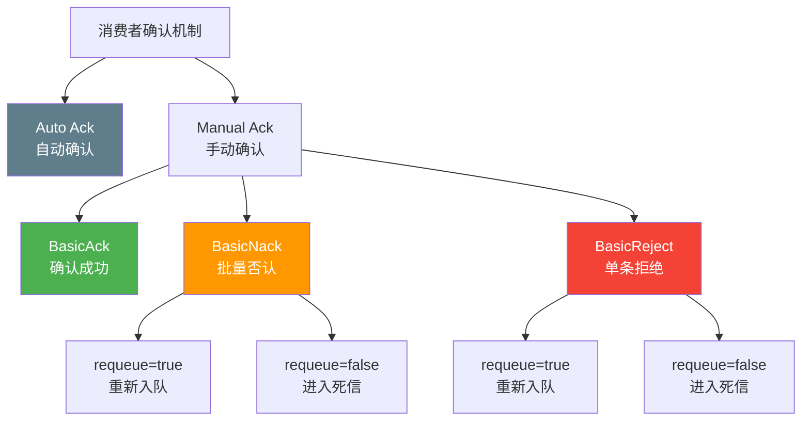
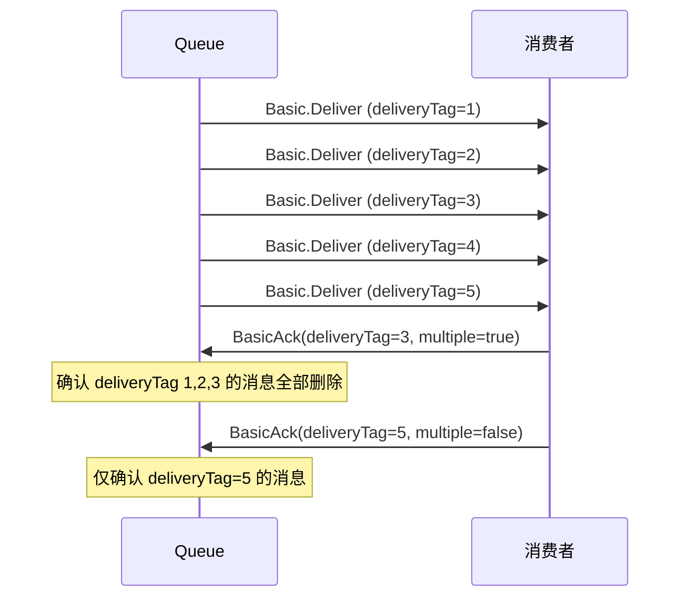
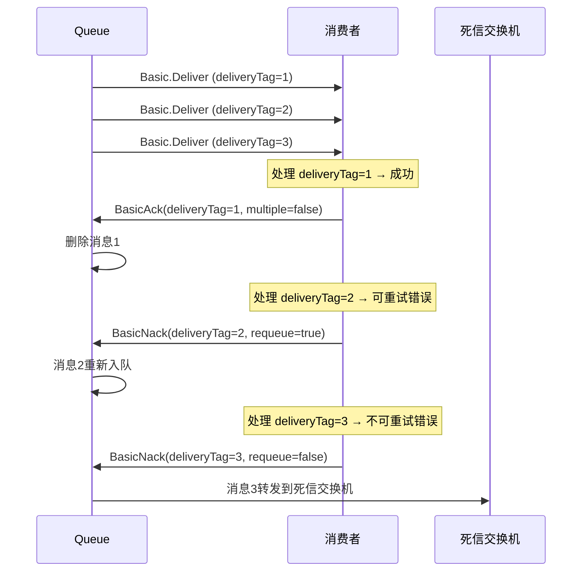
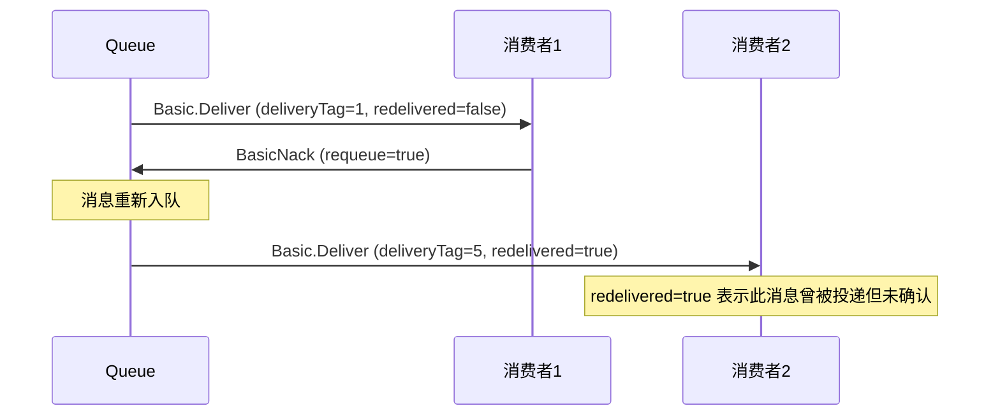
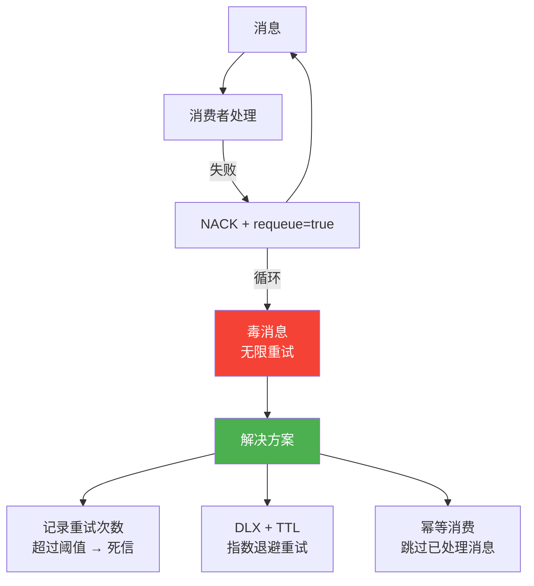

# 02 · 消费者确认与拒绝

## 确认机制概览



## Auto Ack vs Manual Ack

| 模式 | 消息确认时机 | 消息丢失风险 | 适用场景 |
|------|-------------|-------------|----------|
| **Auto Ack** (`autoAck=true`) | 消息投递后**立即**从队列删除 | 高（消费者处理失败，消息已丢） | 日志等可丢失场景 |
| **Manual Ack** (`autoAck=false`) | 消费者**显式**调用 ACK 后删除 | 低（处理失败可 NACK 重回队列） | 业务消息，生产环境必选 |

::: warning 永远不要在业务场景使用 autoAck=true
自动确认模式下，消息一旦投递就从队列删除。如果消费者处理过程中崩溃，消息**永久丢失**。生产环境务必使用手动确认。
:::

## BasicAck — 确认消息

```csharp
channel.BasicAck(deliveryTag: ea.DeliveryTag, multiple: false);
```

| 参数 | 类型 | 说明 |
|------|------|------|
| `deliveryTag` | ulong | 消息的唯一标识（Channel 内递增） |
| `multiple` | bool | `false`=确认单条，`true`=确认所有 <= deliveryTag 的消息 |



### Multiple ACK 使用场景

```csharp
// 批量确认：适用于高吞吐场景
var lastDeliveryTag = 0UL;
var consumer = new EventingBasicConsumer(channel);
consumer.Received += (model, ea) =>
{
    // 处理消息
    ProcessMessage(ea.Body.ToArray());

    lastDeliveryTag = ea.DeliveryTag;

    // 每 100 条批量确认一次
    if (lastDeliveryTag % 100 == 0)
    {
        channel.BasicAck(lastDeliveryTag, multiple: true);
        Console.WriteLine($"批量确认到 deliveryTag={lastDeliveryTag}");
    }
};

// 消费结束前确认剩余消息
channel.BasicAck(lastDeliveryTag, multiple: true);
```

::: tip Multiple ACK 性能提升
批量确认可以减少网络往返次数。在高吞吐场景下，每 100 或 1000 条消息批量确认一次，可以显著提升性能。但**失败时无法精确定位**是哪条消息出了问题。
:::

## BasicNack — 批量否认

```csharp
channel.BasicNack(deliveryTag: ea.DeliveryTag, multiple: false, requeue: false);
```

| 参数 | 类型 | 说明 |
|------|------|------|
| `deliveryTag` | ulong | 消息标识 |
| `multiple` | bool | `true`=否认所有 <= deliveryTag 的未确认消息 |
| `requeue` | bool | `true`=重新入队，`false`=丢弃/进死信 |

## BasicReject — 单条拒绝

```csharp
channel.BasicReject(deliveryTag: ea.DeliveryTag, requeue: false);
```

| 参数 | 类型 | 说明 |
|------|------|------|
| `deliveryTag` | ulong | 消息标识 |
| `requeue` | bool | `true`=重新入队，`false`=丢弃/进死信 |

### Nack vs Reject

| API | 批量支持 | 使用频率 |
|-----|----------|----------|
| `BasicReject` | 不支持，只能拒绝单条 | 常用 |
| `BasicNack` | 支持 `multiple` 参数 | 批量场景 |

## ACK/NACK/REJECT 完整流程



### .NET 完整实现

```csharp
using System.Text;
using RabbitMQ.Client;
using RabbitMQ.Client.Events;

var factory = new ConnectionFactory { HostName = "localhost", UserName = "admin", Password = "admin123" };
using var connection = factory.CreateConnection();
using var channel = connection.CreateModel();

// 声明队列（带死信）
channel.ExchangeDeclare("dlx.exchange", ExchangeType.Direct, durable: true);
channel.QueueDeclare("dlx.queue", durable: true, exclusive: false, autoDelete: false);
channel.QueueBind("dlx.queue", "dlx.exchange", "dlx");

channel.QueueDeclare("order.queue", durable: true, exclusive: false, autoDelete: false,
    arguments: new Dictionary<string, object>
    {
        { "x-dead-letter-exchange", "dlx.exchange" },
        { "x-dead-letter-routing-key", "dlx" }
    });

channel.BasicQos(prefetchSize: 0, prefetchCount: 10, global: false);

var consumer = new EventingBasicConsumer(channel);
consumer.Received += (model, ea) =>
{
    var message = Encoding.UTF8.GetString(ea.Body.ToArray());
    Console.WriteLine($"[x] 收到消息 (deliveryTag={ea.DeliveryTag}): {message}");

    try
    {
        // 处理业务逻辑
        var result = ProcessOrder(message);

        if (result.Success)
        {
            // 处理成功 → ACK
            channel.BasicAck(ea.DeliveryTag, multiple: false);
            Console.WriteLine($"[✓] ACK deliveryTag={ea.DeliveryTag}");
        }
        else if (result.Retryable)
        {
            // 可重试错误 → NACK + requeue
            channel.BasicNack(ea.DeliveryTag, multiple: false, requeue: true);
            Console.WriteLine($"[↻] NACK + requeue deliveryTag={ea.DeliveryTag}");
        }
        else
        {
            // 不可重试错误 → NACK + 不 requeue（进死信）
            channel.BasicNack(ea.DeliveryTag, multiple: false, requeue: false);
            Console.WriteLine($"[✗] NACK + 死信 deliveryTag={ea.DeliveryTag}");
        }
    }
    catch (Exception ex)
    {
        // 异常 → REJECT + 不 requeue
        channel.BasicReject(ea.DeliveryTag, requeue: false);
        Console.WriteLine($"[!] REJECT deliveryTag={ea.DeliveryTag}: {ex.Message}");
    }
};

channel.BasicConsume("order.queue", autoAck: false, consumer: consumer);
Console.WriteLine("[*] 等待消息...");

ProcessResult ProcessOrder(string message)
{
    // 模拟不同处理结果
    var rand = Random.Shared.Next(3);
    return rand switch
    {
        0 => new ProcessResult { Success = true },
        1 => new ProcessResult { Success = false, Retryable = true },
        _ => new ProcessResult { Success = false, Retryable = false }
    };
}

record ProcessResult
{
    public bool Success { get; init; }
    public bool Retryable { get; init; }
}
```

## Requeue 与 Redelivered



### Redelivered 标志

消息被重新投递时，`ea.Redelivered` 属性为 `true`：

```csharp
consumer.Received += (model, ea) =>
{
    if (ea.Redelivered)
    {
        Console.WriteLine($"[警告] 收到重复投递的消息: deliveryTag={ea.DeliveryTag}");
        // 可以选择：1. 检查是否已处理（幂等性）2. 直接拒绝进入死信
    }

    // 正常处理...
    channel.BasicAck(ea.DeliveryTag, false);
};
```

::: warning 无限重试陷阱
NACK + `requeue=true` 会导致消息无限重试。如果消息永远处理失败（如数据格式错误），会不断重新入队、重新投递，形成**无限循环**。

**解决方案**：
1. 在消息头中记录重试次数，超过阈值后 NACK + `requeue=false`
2. 使用 DLX + TTL 实现延迟重试（指数退避）
3. 使用 `x-delivery-count` header（RabbitMQ 3.12+ 仲裁队列）
:::

## 毒消息处理

"毒消息"（Poison Message）是指**始终无法被成功处理**的消息，如果不加以控制会阻塞消费者。



### 基于重试次数的毒消息处理

```csharp
const int MAX_RETRY = 3;

var consumer = new EventingBasicConsumer(channel);
consumer.Received += (model, ea) =>
{
    int retryCount = GetRetryCount(ea);

    try
    {
        ProcessOrder(ea.Body.ToArray());
        channel.BasicAck(ea.DeliveryTag, false);
    }
    catch (Exception ex)
    {
        if (retryCount >= MAX_RETRY)
        {
            // 超过最大重试次数 → 进入死信
            Console.WriteLine($"[毒消息] 超过 {MAX_RETRY} 次重试: {ex.Message}");
            channel.BasicReject(ea.DeliveryTag, requeue: false);
        }
        else
        {
            // 未超限 → 重新入队
            Console.WriteLine($"[重试] 第 {retryCount + 1} 次处理失败: {ex.Message}");
            channel.BasicReject(ea.DeliveryTag, requeue: true);
        }
    }
};

int GetRetryCount(BasicDeliverEventArgs ea)
{
    if (ea.BasicProperties.Headers != null &&
        ea.BasicProperties.Headers.TryGetValue("x-death", out var deathObj))
    {
        var deaths = (List<object>)deathObj;
        if (deaths.Count > 0)
        {
            var lastDeath = (Dictionary<string, object>)deaths[0];
            return Convert.ToInt32(lastDeath["count"]);
        }
    }

    // 通过 redelivered 标志判断是否被重新投递
    return ea.Redelivered ? 1 : 0;
}
```

## AsyncEventingBasicConsumer

RabbitMQ .NET Client 6.0+ 提供了异步消费者，避免阻塞线程池：

```csharp
using var connection = factory.CreateConnection();
using var channel = connection.CreateModel();

channel.BasicQos(prefetchSize: 0, prefetchCount: 10, global: false);

var consumer = new AsyncEventingBasicConsumer(channel);
consumer.Received += async (model, ea) =>
{
    var message = Encoding.UTF8.GetString(ea.Body.ToArray());

    // 异步处理
    await ProcessOrderAsync(message);

    channel.BasicAck(ea.DeliveryTag, false);
    Console.WriteLine($"[✓] ACK deliveryTag={ea.DeliveryTag}");
};

channel.BasicConsume("order.queue", autoAck: false, consumer: consumer);

async Task ProcessOrderAsync(string message)
{
    await Task.Delay(100); // 模拟异步 IO
    Console.WriteLine($"处理: {message}");
}
```

::: important AsyncEventingBasicConsumer 注意事项
- `Received` 事件处理器**必须返回 Task**
- 不要在事件处理器中抛出未捕获的异常
- 异常会被 `CallbackException` 事件捕获
- 确保异步操作完成后才调用 ACK/NACK
:::

## 消费者最佳实践

::: important 消费者可靠性最佳实践
1. **始终手动确认**（`autoAck: false`）
2. **先处理，后确认**（处理成功后才 ACK）
3. **消费者必须幂等**（重复消费不会产生副作用）
4. **设置合理的 prefetchCount**（1~50，根据处理耗时调整）
5. **NACK + requeue=true 谨慎使用**，避免无限重试
6. **毒消息兜底**：超过重试次数后 NACK + requeue=false，进入死信
7. **优先使用 AsyncEventingBasicConsumer**，避免阻塞
8. **消费失败时记录完整上下文**（消息 ID、异常、堆栈），便于排查
:::

## 参考资料

- [RabbitMQ 官方文档 - 消费者确认](https://www.rabbitmq.com/confirms.html#consumer-acknowledgements)
- [RabbitMQ 官方文档 - 消费者预取](https://www.rabbitmq.com/consumer-prefetch.html)
- [RabbitMQ 官方文档 - 消费者](https://www.rabbitmq.com/consumers.html)
- [AMQP 0-9-1 规范 - Basic 类](https://www.rabbitmq.com/resources/specs/amqp0-9-1.pdf)
- 《RabbitMQ 实战指南》第 6 章 — 朱忠华
- [RabbitMQ in Depth](https://www.manning.com/books/rabbitmq-in-depth) Chapter 7 — Alvaro Videla

## 面试技巧

::: tip 高频面试问题
1. **ACK、NACK、REJECT 的区别？**
   - 回答要点：ACK 确认消息成功处理；NACK 可批量否认消息（支持 multiple 参数），可选择是否重新入队；REJECT 只能拒绝单条消息。NACK/REJECT 的 `requeue=true` 让消息重新入队，`requeue=false` 让消息进入死信或被丢弃。

2. **autoAck=true 有什么风险？**
   - 回答要点：消息投递后立即从队列删除。如果消费者处理过程中崩溃或抛异常，消息**永久丢失**，无法恢复。生产环境必须使用 `autoAck=false`，处理成功后手动 ACK。

3. **如何避免消息无限重试？**
   - 回答要点：三种方案——① 在消息头中记录重试次数（x-death count），超过阈值后拒绝并进入死信；② 使用 DLX + TTL 实现指数退避重试；③ 实现幂等消费者，重复消费不会产生副作用。推荐方案 ② + ③ 组合。

4. **redelivered 标志的含义？**
   - 回答要点：`redelivered=true` 表示此消息曾经被投递但未被确认（可能是消费者断开连接或 NACK + requeue）。消费者可以根据此标志判断是否是重复投递，结合幂等性处理。注意 redelivered 只是布尔值，不记录重试次数。
:::
