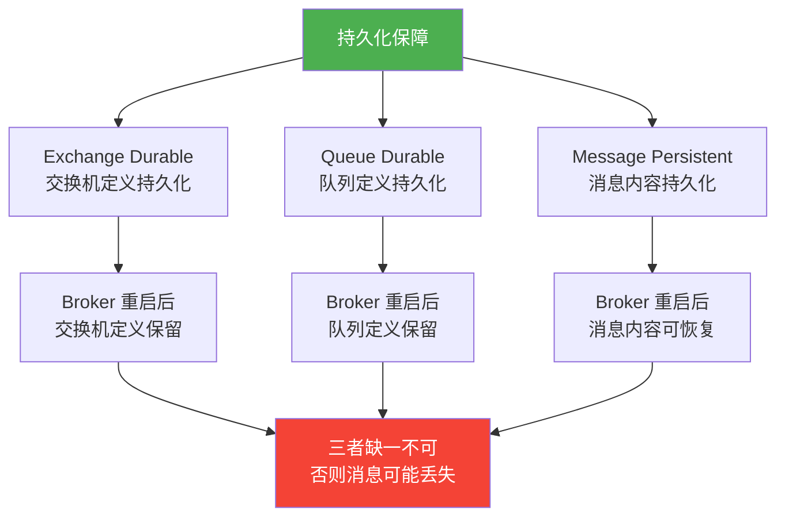
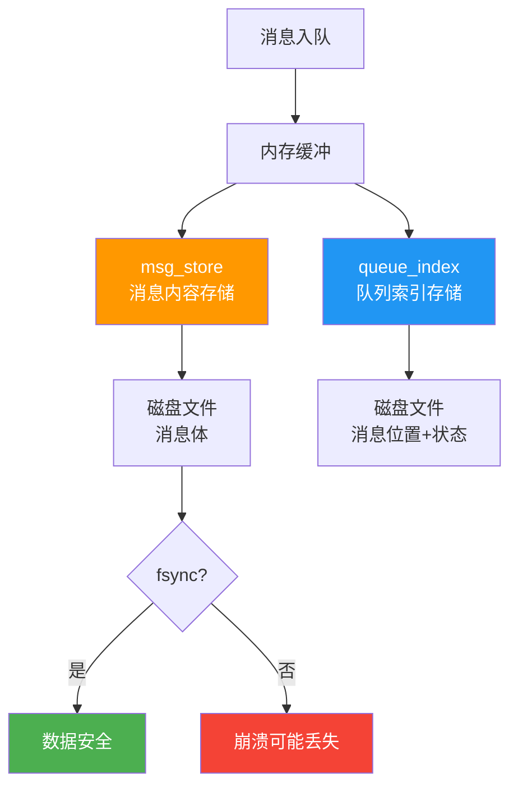
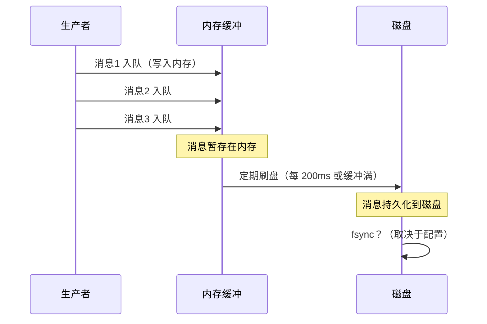
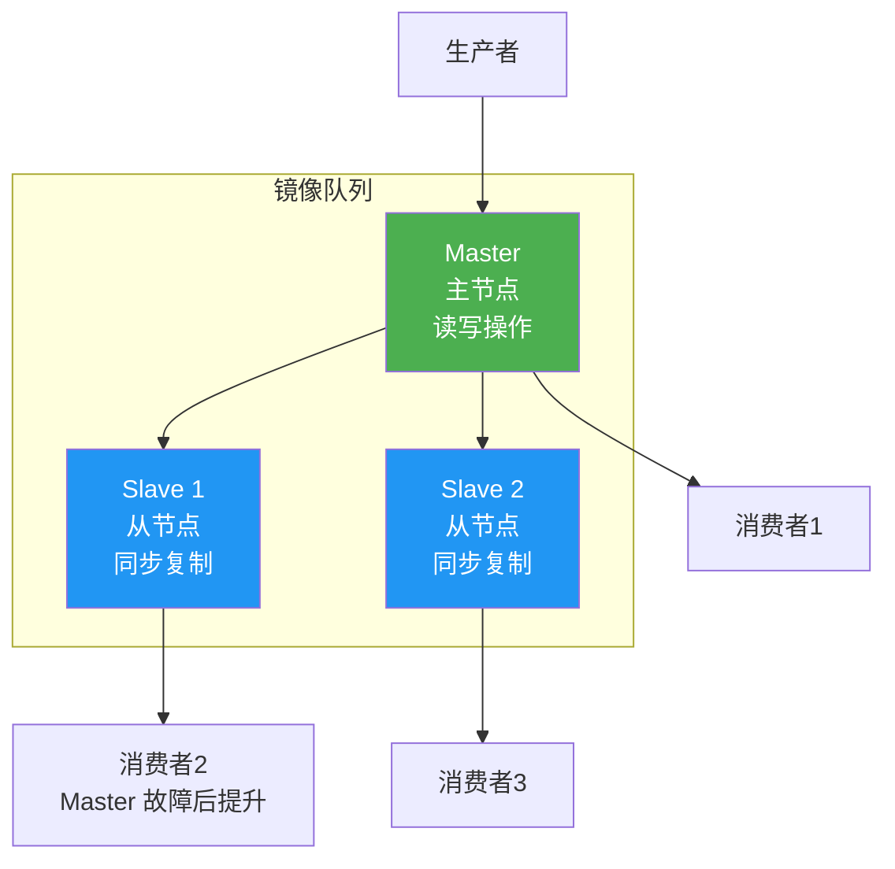
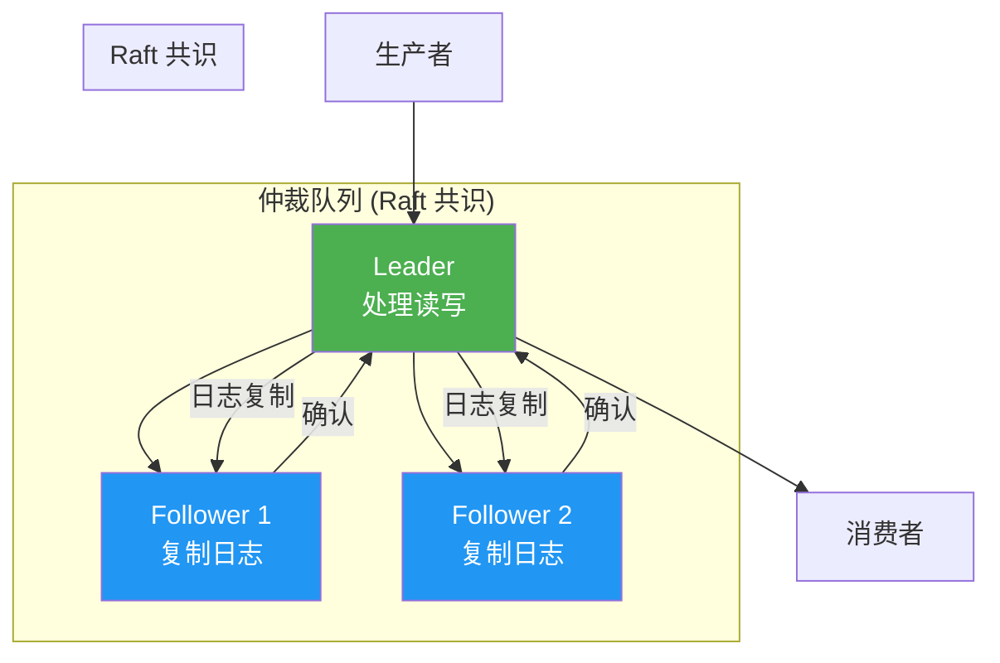
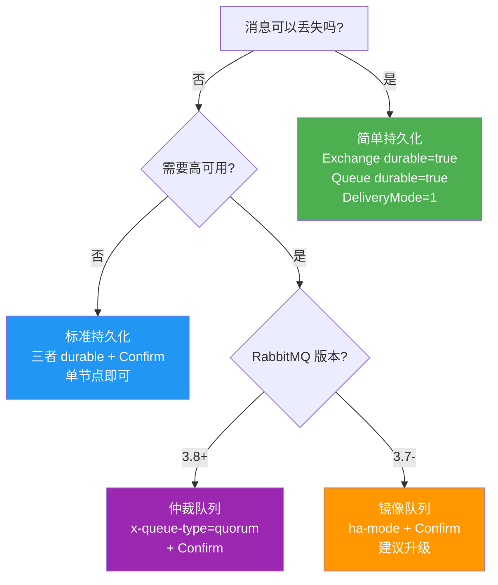

# 03 · 持久化与镜像

## 持久化三层保障



::: warning 三者缺一不可
- Exchange 不 durable：重启后交换机不存在，消息无处路由
- Queue 不 durable：重启后队列不存在，消息无处存储
- Message 不 persistent：重启后队列和交换机还在，但消息内容丢失
- **只有三者同时满足，消息才能在 Broker 重启后完整恢复**
:::

## 第一层：Exchange Durable

```csharp
// 持久化交换机
channel.ExchangeDeclare("order.exchange", ExchangeType.Topic, durable: true);

// 非持久化交换机
channel.ExchangeDeclare("temp.exchange", ExchangeType.Fanout, durable: false);
```

| durable | 重启行为 | 使用场景 |
|---------|----------|----------|
| `true` | 交换机定义保留 | 生产环境，所有业务交换机 |
| `false` | 交换机定义丢失 | 临时交换机 |

## 第二层：Queue Durable

```csharp
// 持久化队列
channel.QueueDeclare("order.queue", durable: true, exclusive: false, autoDelete: false);

// 非持久化队列
channel.QueueDeclare("temp.queue", durable: false, exclusive: true, autoDelete: true);
```

| durable | 重启行为 | 使用场景 |
|---------|----------|----------|
| `true` | 队列定义保留 | 生产环境，所有业务队列 |
| `false` | 队列定义丢失 | 临时队列（如 RPC ReplyTo） |

## 第三层：Message Persistent

```csharp
// 持久化消息
var properties = new BasicProperties
{
    DeliveryMode = 2  // 2 = 持久化
};

channel.BasicPublish("order.exchange", "order.created", false, properties, body);
```

| DeliveryMode | 行为 | 使用场景 |
|--------------|------|----------|
| `1` | 消息仅存在内存 | 实时数据，可丢失 |
| `2` | 消息写入磁盘 | 业务数据，不可丢失 |

## 完整持久化示例

```csharp
using System.Text;
using RabbitMQ.Client;

var factory = new ConnectionFactory { HostName = "localhost", UserName = "admin", Password = "admin123" };
using var connection = factory.CreateConnection();
using var channel = connection.CreateModel();

// 1. 持久化交换机
channel.ExchangeDeclare("persistent.exchange", ExchangeType.Direct, durable: true);

// 2. 持久化队列
channel.QueueDeclare("persistent.queue",
    durable: true,       // 队列定义持久化
    exclusive: false,
    autoDelete: false,
    arguments: null);
channel.QueueBind("persistent.queue", "persistent.exchange", "persistent.key");

// 3. 持久化消息
var properties = new BasicProperties
{
    DeliveryMode = 2,                          // 消息内容持久化
    ContentType = "application/json",
    MessageId = Guid.NewGuid().ToString()
};

var body = Encoding.UTF8.GetBytes("{\"orderId\":\"ORD-001\",\"amount\":299.9}");

// 4. 开启 Publisher Confirm，确保消息确实写入磁盘
channel.ConfirmSelect();

channel.BasicPublish("persistent.exchange", "persistent.key", false, properties, body);

// 等待确认
if (channel.WaitForConfirms(TimeSpan.FromSeconds(5)))
{
    Console.WriteLine("消息已持久化并确认");
}
else
{
    Console.WriteLine("消息确认失败");
}
```

## RabbitMQ 持久化内部机制

### Write-Ahead Log

RabbitMQ 使用 WAL（预写日志）机制保证消息持久化：



### 存储结构

| 组件 | 存储 | 说明 |
|------|------|------|
| **msg_store** | 消息体内容 | 持久化消息的实际内容，写入磁盘文件 |
| **queue_index** | 消息位置+状态 | 每条消息在队列中的位置、是否已 ACK 等 |

### 惰性写入（Lazy Write）



**关键点：**
- 消息先写入内存缓冲，**不立即刷盘**
- 刷盘时机：每 200ms、缓冲区满、或消费者需要时
- `fsync` 是否调用取决于操作系统和 RabbitMQ 配置
- 在 `fsync` 完成前 Broker 崩溃，消息可能丢失

::: important 持久化 ≠ 不丢消息
即使设置了三个持久化条件，仍可能在以下场景丢失：
1. 消息在内存缓冲中，未刷盘时 Broker 崩溃
2. 操作系统 Page Cache 未 flush 到磁盘时断电
3. 磁盘故障

**要确保消息不丢，必须配合 Publisher Confirm 机制**。Confirm 消息意味着 Broker 已将消息写入磁盘（或至少写入 Page Cache）。
:::

### 同步 vs 异步刷盘

| 模式 | 性能 | 安全性 | 配置 |
|------|------|--------|------|
| 异步刷盘（默认） | 高 | 中（崩溃可能丢少量消息） | 默认行为 |
| 同步刷盘 | 低 | 高（每次写入都 fsync） | `rabbit.disk_write_rate` 调优 |

## 镜像队列（Classic Mirrored Queue）

::: warning 镜像队列已在 3.13 版本废弃
镜像队列在 RabbitMQ 3.13 中被标记为废弃，推荐迁移到**仲裁队列（Quorum Queue）**。本节内容供理解历史方案和维护遗留系统参考。
:::

### 镜像队列原理



### 镜像策略配置

```bash
# 通过 Policy 配置镜像
rabbitmqctl set_policy ha-all "^order\." \
  '{"ha-mode":"all","ha-sync-mode":"automatic"}' \
  --apply-to queues

# 精确镜像数量
rabbitmqctl set_policy ha-two "^order\." \
  '{"ha-mode":"exactly","ha-params":2,"ha-sync-mode":"automatic"}' \
  --apply-to queues
```

| 参数 | 说明 |
|------|------|
| `ha-mode=all` | 所有节点镜像 |
| `ha-mode=exactly` + `ha-params=N` | 精确 N 个节点镜像 |
| `ha-mode=nodes` + `ha-params=[node1,node2]` | 指定节点镜像 |
| `ha-sync-mode=automatic` | 新 Slave 自动同步历史消息 |
| `ha-sync-mode=manual` | 新 Slave 仅同步新消息（默认） |

### 镜像队列的性能问题

| 问题 | 原因 |
|------|------|
| **写入放大** | 每条消息需要写入 Master + 所有 Slave |
| **同步阻塞** | Slave 同步时 Master 可能阻塞 |
| **脑裂风险** | 网络分区时可能出现双主 |
| **故障恢复慢** | Slave 提升为新 Master 需要时间 |
| **内存占用** | 每个副本都占用内存 |

## 仲裁队列（Quorum Queue）

仲裁队列是 RabbitMQ 3.8+ 引入的**新一代高可用队列**，替代镜像队列。



### 仲裁队列 vs 镜像队列

| 维度 | 镜像队列 | 仲裁队列 |
|------|----------|----------|
| **共识协议** | 无（主从复制） | Raft |
| **数据安全** | 异步复制，可能丢数据 | 多数派确认，不丢数据 |
| **脑裂处理** | 可能出现双主 | Raft 保证唯一 Leader |
| **性能** | 写入放大严重 | 相对更好 |
| **磁盘依赖** | 可选 | 必须持久化（所有消息写磁盘） |
| **迁移路径** | 废弃 | 推荐 |

### .NET 声明仲裁队列

```csharp
channel.QueueDeclare("order.quorum.queue",
    durable: true,       // 仲裁队列必须 durable=true
    exclusive: false,
    autoDelete: false,
    arguments: new Dictionary<string, object>
    {
        { "x-queue-type", "quorum" }   // 队列类型：仲裁队列
    });
```

### 迁移路径：镜像队列 → 仲裁队列


::: important 迁移注意事项
- 仲裁队列和镜像队列**不能直接转换**，需删除重建
- 仲裁队列**所有消息都持久化到磁盘**，磁盘 IO 要求更高
- 仲裁队列不支持 `lazy mode`（本身就是 disk-based）
- 仲裁队列不支持 `x-max-priority`（3.10+ 支持有限优先级）
- 仲裁队列的消费者不支持 `exclusive` 模式
:::

## 持久化决策矩阵



## 参考资料

- [RabbitMQ 官方文档 - 持久化](https://www.rabbitmq.com/persistence.html)
- [RabbitMQ 官方文档 - 镜像队列](https://www.rabbitmq.com/ha.html)
- [RabbitMQ 官方文档 - 仲裁队列](https://www.rabbitmq.com/quorum-queues.html)
- [RabbitMQ 官方文档 - 队列类型](https://www.rabbitmq.com/queues.html)
- [RabbitMQ 3.13 发布说明 - 镜像队列废弃](https://www.rabbitmq.com/release-information)
- 《RabbitMQ 实战指南》第 7 章 — 朱忠华
- [RabbitMQ in Depth](https://www.manning.com/books/rabbitmq-in-depth) Chapter 8 — Alvaro Videla

## 面试技巧

::: tip 高频面试问题
1. **RabbitMQ 持久化的三个层次？**
   - 回答要点：Exchange Durable（交换机定义持久化）、Queue Durable（队列定义持久化）、Message Persistent（DeliveryMode=2 消息内容持久化）。三者缺一不可，少一层都可能导致消息丢失。

2. **持久化消息一定不会丢吗？**
   - 回答要点：不一定。消息先写入内存缓冲，定期刷盘，在 fsync 完成前 Broker 崩溃仍可能丢失。需要配合 Publisher Confirm 机制，Confirm 确认后才表示消息已安全写入。

3. **镜像队列为什么被废弃？**
   - 回答要点：三个核心问题——① 异步复制可能导致数据丢失（Slave 未同步完成时 Master 崩溃）；② 脑裂风险（网络分区可能出现双主）；③ 性能开销大（写入放大、同步阻塞）。仲裁队列使用 Raft 共识协议，多数派确认写入，解决了这些问题。

4. **仲裁队列和镜像队列的核心区别？**
   - 回答要点：仲裁队列使用 Raft 协议保证数据一致性（多数派确认），镜像队列使用简单主从复制（异步同步可能丢数据）。仲裁队列所有消息必须持久化到磁盘，不依赖内存；镜像队列可以内存+磁盘混合。仲裁队列是 RabbitMQ 推荐的未来方向。
:::
