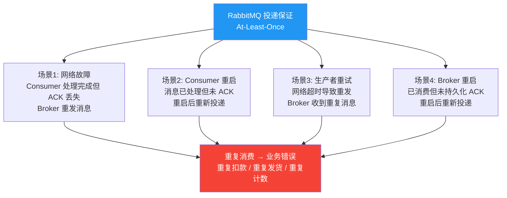
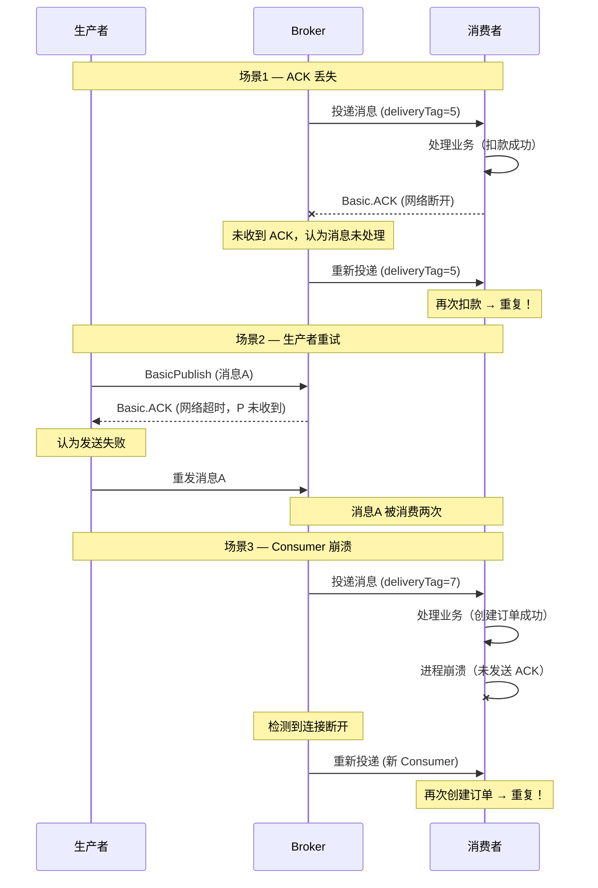
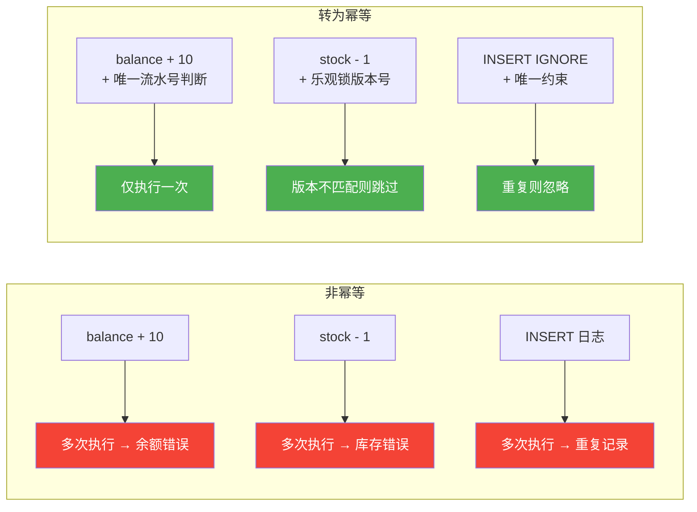
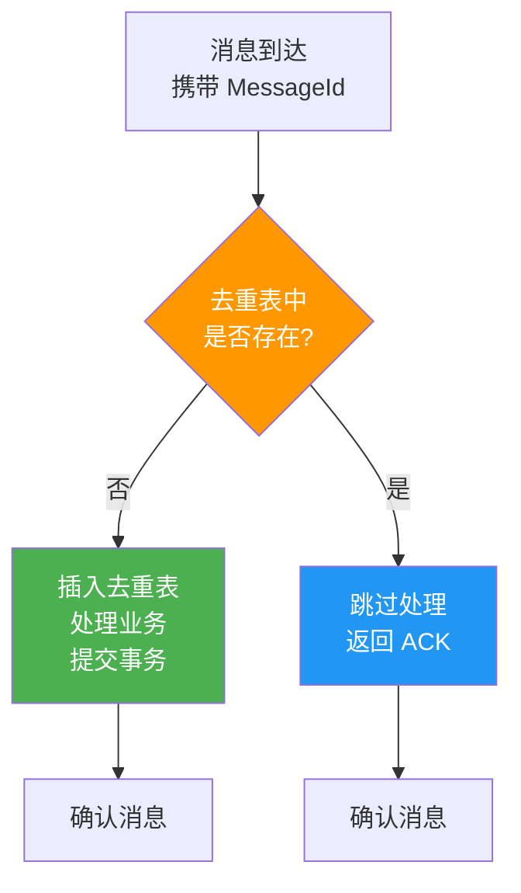
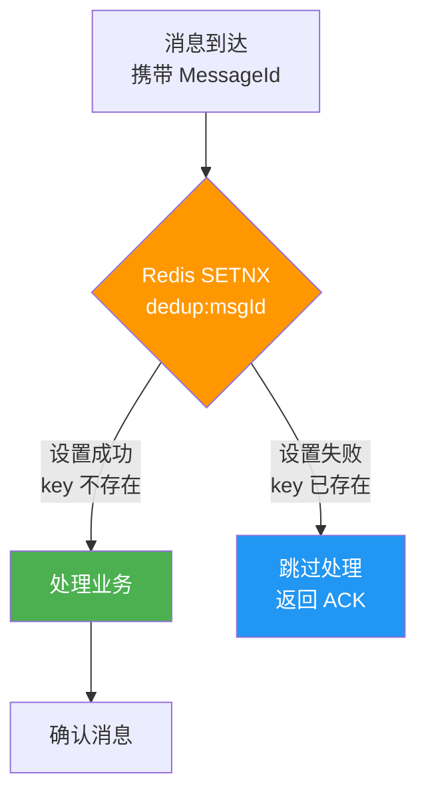
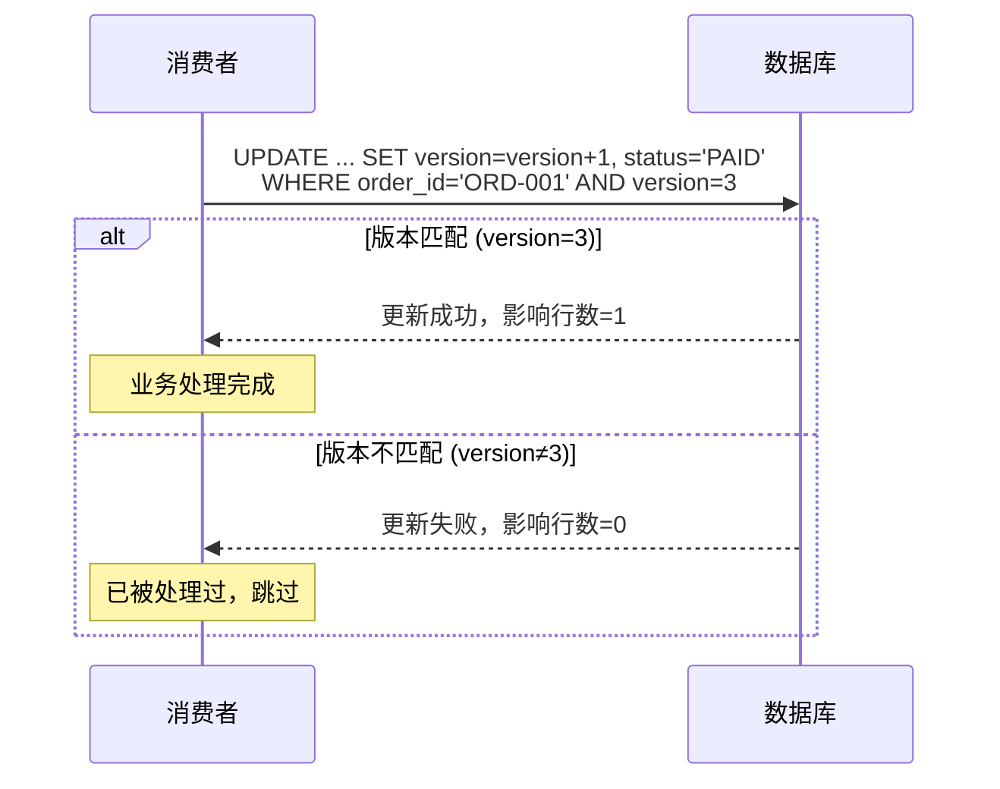
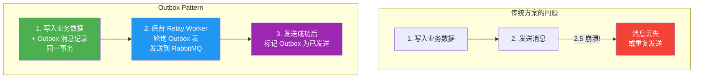
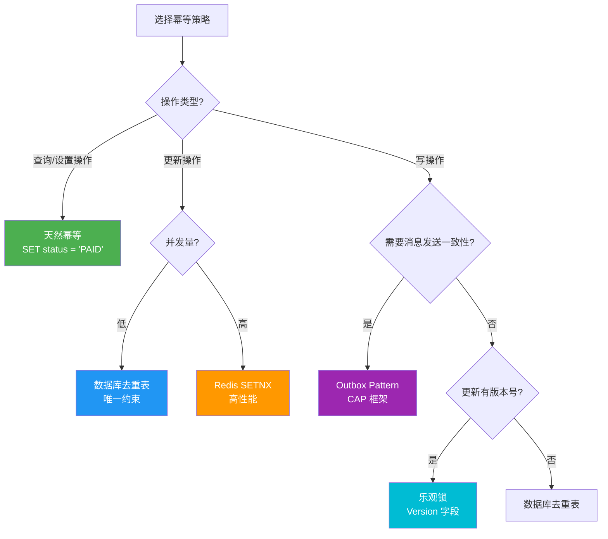

# 04 · 幂等性与消息去重

## 为什么需要幂等性

RabbitMQ 保证 **至少一次投递（At-Least-Once Delivery）**，这意味着消息可能被重复消费。如果不做幂等处理，重复消息会导致业务数据错误。



### 重复消息的完整场景



::: warning 幂等性是消费者的责任
RabbitMQ 不提供内置的去重机制（除仲裁队列的 At-Most-Once 实验特性外）。**幂等性必须由消费者端保证**，这是分布式系统的基本设计原则。
:::

## 1. 天然幂等

某些操作本身具有幂等性——执行一次和执行多次的结果相同。

### 幂等 vs 非幂等操作

```sql
-- 幂等操作：无论执行多少次，结果一致
UPDATE account SET balance = 100 WHERE user_id = 'U001';
UPDATE order SET status = 'PAID' WHERE order_id = 'ORD-001';
DELETE FROM temp_data WHERE expire_time < NOW();

-- 非幂等操作：每次执行结果不同
UPDATE account SET balance = balance + 10 WHERE user_id = 'U001';
INSERT INTO order_log (order_id, action) VALUES ('ORD-001', 'PAYMENT');
UPDATE product SET stock = stock - 1 WHERE product_id = 'P001';
```

### 将非幂等转为幂等



```csharp
// 非幂等：每次消费都增加余额
public async Task HandlePaymentAsync(PaymentMessage message)
{
    // 危险！重复消费会导致余额多加
    await _dbContext.Database.ExecuteSqlRawAsync(
        "UPDATE account SET balance = balance + {0} WHERE user_id = {1}",
        message.Amount, message.UserId);
}

// 幂等改造：先查后更新（基于业务状态判断）
public async Task HandlePaymentAsync(PaymentMessage message)
{
    var account = await _dbContext.Accounts.FindAsync(message.UserId);
    if (account == null) return;

    // 检查是否已处理过这笔交易
    var alreadyProcessed = await _dbContext.Transactions
        .AnyAsync(t => t.TransactionId == message.TransactionId);

    if (alreadyProcessed)
    {
        _logger.LogWarning("交易已处理，跳过: {TransactionId}", message.TransactionId);
        return;
    }

    // 在同一事务中：记录交易 + 更新余额
    account.Balance += message.Amount;
    _dbContext.Transactions.Add(new Transaction
    {
        TransactionId = message.TransactionId,
        UserId = message.UserId,
        Amount = message.Amount,
        ProcessedAt = DateTime.UtcNow
    });

    await _dbContext.SaveChangesAsync();
}
```

## 2. 全局 MessageId + 去重表

为每条消息分配全局唯一 ID，消费时先查去重表判断是否已处理。



### 数据库设计

```sql
-- 消息去重表
CREATE TABLE message_dedup (
    message_id       VARCHAR(64)  NOT NULL PRIMARY KEY,  -- 消息唯一ID
    consumer_group   VARCHAR(128) NOT NULL,              -- 消费者组标识
    created_at       DATETIME     NOT NULL,              -- 创建时间（用于清理）
    expire_at        DATETIME     NOT NULL,              -- 过期时间

    INDEX idx_expire (expire_at)                         -- 清理索引
);

-- 复合主键方案（支持同一条消息被不同消费者组分别处理）
-- PRIMARY KEY (message_id, consumer_group)
```

### .NET 完整实现

```csharp
using Microsoft.EntityFrameworkCore;
using RabbitMQ.Client;
using RabbitMQ.Client.Events;
using System.Text;
using System.Text.Json;

// ========== EF Core 实体 ==========

public class MessageDedupRecord
{
    public string MessageId { get; set; } = null!;
    public string ConsumerGroup { get; set; } = null!;
    public DateTime CreatedAt { get; set; }
    public DateTime ExpireAt { get; set; }
}

public class AppDbContext : DbContext
{
    public DbSet<MessageDedupRecord> MessageDedups => Set<MessageDedupRecord>();

    public AppDbContext(DbContextOptions<AppDbContext> options) : base(options) { }

    protected override void OnModelCreating(ModelBuilder modelBuilder)
    {
        modelBuilder.Entity<MessageDedupRecord>(entity =>
        {
            entity.HasKey(e => new { e.MessageId, e.ConsumerGroup });
            entity.HasIndex(e => e.ExpireAt);
            entity.Property(e => e.MessageId).HasMaxLength(64);
            entity.Property(e => e.ConsumerGroup).HasMaxLength(128);
        });
    }
}

// ========== 去重服务 ==========

public interface IMessageDedupService
{
    /// <summary>
    /// 判断消息是否为重复消息，若非重复则记录
    /// </summary>
    Task<bool> IsDuplicateAsync(string messageId, string consumerGroup, TimeSpan ttl);
}

public class DbMessageDedupService : IMessageDedupService
{
    private readonly AppDbContext _dbContext;
    private readonly ILogger<DbMessageDedupService> _logger;

    public DbMessageDedupService(AppDbContext dbContext, ILogger<DbMessageDedupService> logger)
    {
        _dbContext = dbContext;
        _logger = logger;
    }

    public async Task<bool> IsDuplicateAsync(string messageId, string consumerGroup, TimeSpan ttl)
    {
        // 检查是否已存在
        var exists = await _dbContext.MessageDedups
            .AnyAsync(e => e.MessageId == messageId && e.ConsumerGroup == consumerGroup);

        if (exists)
        {
            _logger.LogWarning("检测到重复消息: MessageId={MessageId}, ConsumerGroup={ConsumerGroup}",
                messageId, consumerGroup);
            return true;
        }

        // 插入去重记录
        _dbContext.MessageDedups.Add(new MessageDedupRecord
        {
            MessageId = messageId,
            ConsumerGroup = consumerGroup,
            CreatedAt = DateTime.UtcNow,
            ExpireAt = DateTime.UtcNow.Add(ttl)
        });

        try
        {
            await _dbContext.SaveChangesAsync();
            return false;
        }
        catch (DbUpdateException ex) when (IsUniqueConstraintViolation(ex))
        {
            // 并发场景：另一个实例已插入，视为重复
            _logger.LogWarning("并发去重命中: MessageId={MessageId}", messageId);
            return true;
        }
    }

    private static bool IsUniqueConstraintViolation(DbUpdateException ex)
    {
        // SQL Server: 2601 (唯一索引) / 2627 (主键)
        // MySQL: 1062
        // PostgreSQL: 23505
        var inner = ex.InnerException;
        return inner != null && (
            inner.Message.Contains("2601") ||
            inner.Message.Contains("2627") ||
            inner.Message.Contains("1062") ||
            inner.Message.Contains("23505") ||
            inner.Message.Contains("unique constraint") ||
            inner.Message.Contains("duplicate key"));
    }
}

// ========== 消费者 ==========

public class OrderPaymentConsumer : IDisposable
{
    private readonly IConnection _connection;
    private readonly IModel _channel;
    private readonly IServiceScope _scope;
    private readonly IMessageDedupService _dedupService;
    private readonly ILogger<OrderPaymentConsumer> _logger;

    private const string ConsumerGroup = "order-payment-service";
    private static readonly TimeSpan DedupTtl = TimeSpan.FromHours(24);

    public OrderPaymentConsumer(
        ConnectionFactory factory,
        IServiceScopeFactory scopeFactory,
        ILogger<OrderPaymentConsumer> logger)
    {
        _logger = logger;
        _connection = factory.CreateConnection();
        _channel = _connection.CreateModel();
        _scope = scopeFactory.CreateScope();

        var dbContext = _scope.ServiceProvider.GetRequiredService<AppDbContext>();
        _dedupService = new DbMessageDedupService(dbContext,
            _scope.ServiceProvider.GetRequiredService<ILogger<DbMessageDedupService>>());
    }

    public void Start()
    {
        _channel.ExchangeDeclare("order.exchange", ExchangeType.Topic, durable: true);
        _channel.QueueDeclare("order.payment.queue", durable: true, exclusive: false, autoDelete: false);
        _channel.QueueBind("order.payment.queue", "order.exchange", "order.paid");
        _channel.BasicQos(0, 10, false);

        var consumer = new EventingBasicConsumer(_channel);
        consumer.Received += async (_, ea) =>
        {
            try
            {
                var messageId = ea.BasicProperties.MessageId;
                if (string.IsNullOrEmpty(messageId))
                {
                    _logger.LogError("消息缺少 MessageId，无法去重");
                    _channel.BasicReject(ea.DeliveryTag, requeue: false);
                    return;
                }

                // 去重检查
                var isDuplicate = await _dedupService.IsDuplicateAsync(messageId, ConsumerGroup, DedupTtl);
                if (isDuplicate)
                {
                    _channel.BasicAck(ea.DeliveryTag, false);
                    return;
                }

                // 处理业务
                var body = Encoding.UTF8.GetString(ea.Body.ToArray());
                var message = JsonSerializer.Deserialize<OrderPaidMessage>(body)!;
                await ProcessPaymentAsync(message);

                _channel.BasicAck(ea.DeliveryTag, false);
            }
            catch (Exception ex)
            {
                _logger.LogError(ex, "消息处理异常");
                _channel.BasicNack(ea.DeliveryTag, false, requeue: true);
            }
        };

        _channel.BasicConsume("order.payment.queue", autoAck: false, consumer);
    }

    private async Task ProcessPaymentAsync(OrderPaidMessage message)
    {
        _logger.LogInformation("处理支付: OrderId={OrderId}, Amount={Amount}",
            message.OrderId, message.Amount);
        await Task.Delay(100); // 模拟业务处理
    }

    public void Dispose()
    {
        _channel?.Close();
        _connection?.Close();
        _scope?.Dispose();
    }
}

public record OrderPaidMessage(string OrderId, decimal Amount, DateTime PaidAt);
```

### 去重表清理策略

```csharp
public class DedupCleanupService : BackgroundService
{
    private readonly IServiceProvider _serviceProvider;
    private readonly ILogger<DedupCleanupService> _logger;
    private static readonly TimeSpan CleanupInterval = TimeSpan.FromHours(1);

    public DedupCleanupService(IServiceProvider serviceProvider, ILogger<DedupCleanupService> logger)
    {
        _serviceProvider = serviceProvider;
        _logger = logger;
    }

    protected override async Task ExecuteAsync(CancellationToken stoppingToken)
    {
        while (!stoppingToken.IsCancellationRequested)
        {
            try
            {
                using var scope = _serviceProvider.CreateScope();
                var dbContext = scope.ServiceProvider.GetRequiredService<AppDbContext>();

                var deleted = await dbContext.MessageDedups
                    .Where(e => e.ExpireAt < DateTime.UtcNow)
                    .ExecuteDeleteAsync(stoppingToken);

                if (deleted > 0)
                    _logger.LogInformation("清理过期去重记录: {Count} 条", deleted);
            }
            catch (Exception ex)
            {
                _logger.LogError(ex, "去重表清理失败");
            }

            await Task.Delay(CleanupInterval, stoppingToken);
        }
    }
}
```

::: tip 去重表 TTL 设计
TTL 应设置为 **最大消息处理时间 × 2**。例如消息处理最长 30 分钟，TTL 设为 1 小时。过短会导致过期后重复消息无法识别，过长会浪费存储空间。
:::

## 3. Redis SETNX 去重

利用 Redis 的 `SET key value NX EX seconds` 原子操作实现分布式去重。



### .NET 完整实现

```csharp
using StackExchange.Redis;
using System.Text.Json;

public class RedisMessageDedupService : IMessageDedupService
{
    private readonly IConnectionMultiplexer _redis;
    private readonly ILogger<RedisMessageDedupService> _logger;

    public RedisMessageDedupService(IConnectionMultiplexer redis, ILogger<RedisMessageDedupService> logger)
    {
        _redis = redis;
        _logger = logger;
    }

    public async Task<bool> IsDuplicateAsync(string messageId, string consumerGroup, TimeSpan ttl)
    {
        var db = _redis.GetDatabase();
        var key = $"dedup:{consumerGroup}:{messageId}";

        // SETNX + EXPIRE 原子操作
        // NX = Only set if not exists, EX = expire in seconds
        var inserted = await db.StringSetAsync(
            key,
            DateTime.UtcNow.ToString("O"),
            expiry: ttl,
            when: When.NotExists);

        if (!inserted)
        {
            _logger.LogWarning("Redis 去重命中: Key={Key}", key);
            return true;
        }

        return false;
    }
}

// ========== 生产者端：确保消息携带唯一 ID ==========

public class ReliablePublisher : IDisposable
{
    private readonly IConnection _connection;
    private readonly IModel _channel;

    public ReliablePublisher(ConnectionFactory factory)
    {
        _connection = factory.CreateConnection();
        _channel = _connection.CreateModel();
        _channel.ConfirmSelect();
    }

    public void Publish<T>(string exchange, string routingKey, T message, string? messageId = null)
    {
        var body = Encoding.UTF8.GetBytes(JsonSerializer.Serialize(message));

        var properties = new BasicProperties
        {
            MessageId = messageId ?? Guid.NewGuid().ToString("N"),  // 全局唯一 ID
            DeliveryMode = 2,
            ContentType = "application/json",
            Timestamp = new AmqpTimestamp(DateTimeOffset.UtcNow.ToUnixTimeSeconds())
        };

        _channel.BasicPublish(exchange, routingKey, false, properties, body);
        _channel.WaitForConfirms(TimeSpan.FromSeconds(5));
    }

    public void Dispose()
    {
        _channel?.Close();
        _connection?.Close();
    }
}

// ========== 消费者端：Redis 去重 ==========

public class RedisDedupConsumer : IDisposable
{
    private readonly IConnection _connection;
    private readonly IModel _channel;
    private readonly RedisMessageDedupService _dedupService;
    private readonly ILogger<RedisDedupConsumer> _logger;

    private const string ConsumerGroup = "inventory-service";
    private static readonly TimeSpan DedupTtl = TimeSpan.FromMinutes(30); // 处理时间 15min × 2

    public RedisDedupConsumer(
        ConnectionFactory factory,
        IConnectionMultiplexer redis,
        ILogger<RedisDedupConsumer> logger)
    {
        _logger = logger;
        _connection = factory.CreateConnection();
        _channel = _connection.CreateModel();
        _dedupService = new RedisMessageDedupService(redis,
            LoggerFactory.Create(b => b.AddConsole()).CreateLogger<RedisMessageDedupService>());
    }

    public void Start()
    {
        _channel.ExchangeDeclare("order.exchange", ExchangeType.Topic, durable: true);
        _channel.QueueDeclare("inventory.deduct.queue", durable: true, exclusive: false, autoDelete: false);
        _channel.QueueBind("inventory.deduct.queue", "order.exchange", "order.paid");
        _channel.BasicQos(0, 20, false);

        var consumer = new EventingBasicConsumer(_channel);
        consumer.Received += async (_, ea) =>
        {
            var messageId = ea.BasicProperties.MessageId;
            if (string.IsNullOrEmpty(messageId))
            {
                _channel.BasicReject(ea.DeliveryTag, false);
                return;
            }

            var isDuplicate = await _dedupService.IsDuplicateAsync(messageId, ConsumerGroup, DedupTtl);
            if (isDuplicate)
            {
                _channel.BasicAck(ea.DeliveryTag, false);
                return;
            }

            try
            {
                var body = Encoding.UTF8.GetString(ea.Body.ToArray());
                var message = JsonSerializer.Deserialize<OrderPaidMessage>(body)!;
                await DeductInventoryAsync(message);
                _channel.BasicAck(ea.DeliveryTag, false);
            }
            catch (Exception ex)
            {
                _logger.LogError(ex, "库存扣减失败");
                _channel.BasicNack(ea.DeliveryTag, false, requeue: true);
            }
        };

        _channel.BasicConsume("inventory.deduct.queue", autoAck: false, consumer);
    }

    private async Task DeductInventoryAsync(OrderPaidMessage message)
    {
        _logger.LogInformation("扣减库存: OrderId={OrderId}", message.OrderId);
        await Task.Delay(50);
    }

    public void Dispose()
    {
        _channel?.Close();
        _connection?.Close();
    }
}
```

::: important Redis 去重的 Key 设计
- 格式：`dedup:{consumerGroup}:{messageId}`
- `consumerGroup` 区分不同消费者组——同一条消息可被不同服务分别消费
- TTL = 最大处理时间 × 2（确保重投递的消息仍在 TTL 内）
- Redis 宕机时去重失效，需降级到数据库去重或接受短暂重复
:::

## 4. 乐观锁（Version）

利用版本号实现幂等更新，适用于更新类操作。



### .NET 实现

```csharp
using Microsoft.EntityFrameworkCore;

// ========== 实体 ==========

public class Order
{
    public string OrderId { get; set; } = null!;
    public string Status { get; set; } = "PENDING";
    public decimal Amount { get; set; }
    public int Version { get; set; }           // 乐观锁版本号
    public DateTime UpdatedAt { get; set; }
}

// ========== 幂等消费者 ==========

public class OptimisticLockConsumer
{
    private readonly AppDbContext _dbContext;
    private readonly ILogger<OptimisticLockConsumer> _logger;

    public OptimisticLockConsumer(AppDbContext dbContext, ILogger<OptimisticLockConsumer> logger)
    {
        _dbContext = dbContext;
        _logger = logger;
    }

    /// <summary>
    /// 使用乐观锁处理支付完成消息
    /// </summary>
    public async Task HandleOrderPaidAsync(OrderPaidMessage message)
    {
        var order = await _dbContext.Orders.FindAsync(message.OrderId);
        if (order == null)
        {
            _logger.LogWarning("订单不存在: {OrderId}", message.OrderId);
            return;
        }

        // 状态判断：如果已经是 PAID 状态，直接跳过
        if (order.Status == "PAID")
        {
            _logger.LogInformation("订单已支付，跳过: {OrderId}", message.OrderId);
            return;
        }

        if (order.Status != "PENDING")
        {
            _logger.LogWarning("订单状态异常: {OrderId}, Status={Status}", message.OrderId, order.Status);
            return;
        }

        // 乐观锁更新：Version 不匹配则更新失败
        var affected = await _dbContext.Database.ExecuteSqlRawAsync(
            @"UPDATE orders
              SET status = 'PAID',
                  version = version + 1,
                  updated_at = @p0
              WHERE order_id = @p1 AND version = @p2",
            DateTime.UtcNow, message.OrderId, order.Version);

        if (affected == 0)
        {
            _logger.LogWarning("乐观锁冲突，订单可能已被处理: {OrderId}", message.OrderId);
            return;
        }

        _logger.LogInformation("订单支付成功: {OrderId}", message.OrderId);
    }

    /// <summary>
    /// 使用 EF Core 并发令牌实现乐观锁
    /// </summary>
    public async Task HandleOrderPaidWithEfCoreAsync(OrderPaidMessage message)
    {
        try
        {
            var order = await _dbContext.Orders.FindAsync(message.OrderId);
            if (order == null) return;

            if (order.Status == "PAID") return; // 天然幂等

            order.Status = "PAID";
            order.UpdatedAt = DateTime.UtcNow;
            // Version 字段标记为 [ConcurrencyCheck]，SaveChanges 自动检查

            await _dbContext.SaveChangesAsync();
        }
        catch (DbUpdateConcurrencyException ex)
        {
            _logger.LogWarning(ex, "并发冲突，订单可能已被处理: {OrderId}", message.OrderId);
            // 重新加载确认状态
            foreach (var entry in ex.Entries)
            {
                await entry.ReloadAsync();
            }
        }
    }
}
```

```csharp
// EF Core 配置 — Version 作为并发令牌
protected override void OnModelCreating(ModelBuilder modelBuilder)
{
    modelBuilder.Entity<Order>(entity =>
    {
        entity.HasKey(e => e.OrderId);
        entity.Property(e => e.Version).IsConcurrencyToken();  // 乐观锁
        entity.Property(e => e.Status).HasMaxLength(20);
    });
}
```

## 5. Outbox Pattern（发件箱模式）

Outbox Pattern 是保证 **消息发送与业务数据一致性** 的核心模式，同时实现幂等消费。



### Outbox 表设计

```sql
CREATE TABLE outbox_messages (
    id              BIGINT        AUTO_INCREMENT PRIMARY KEY,
    message_id      VARCHAR(64)   NOT NULL UNIQUE,         -- 消息唯一 ID（去重）
    exchange        VARCHAR(256)  NOT NULL,                 -- 目标 Exchange
    routing_key     VARCHAR(256)  NOT NULL,                 -- 路由键
    message_type    VARCHAR(256)  NOT NULL,                 -- 消息类型名
    payload         TEXT          NOT NULL,                 -- 消息体 JSON
    status          VARCHAR(20)   NOT NULL DEFAULT 'PENDING', -- PENDING / SENT / FAILED
    created_at      DATETIME      NOT NULL,
    sent_at         DATETIME      NULL,
    retry_count     INT           NOT NULL DEFAULT 0,
    next_retry_at   DATETIME      NULL,

    INDEX idx_status_created (status, created_at),
    INDEX idx_next_retry (status, next_retry_at)
);
```

### .NET 完整实现 — SaveChanges 拦截器 + 后台 Relay

```csharp
using Microsoft.EntityFrameworkCore;
using Microsoft.EntityFrameworkCore.Diagnostics;
using RabbitMQ.Client;
using StackExchange.Redis;
using System.Text;
using System.Text.Json;

// ========== Outbox 实体 ==========

public class OutboxMessage
{
    public long Id { get; set; }
    public string MessageId { get; set; } = null!;
    public string Exchange { get; set; } = null!;
    public string RoutingKey { get; set; } = null!;
    public string MessageType { get; set; } = null!;
    public string Payload { get; set; } = null!;
    public string Status { get; set; } = "PENDING";
    public DateTime CreatedAt { get; set; }
    public DateTime? SentAt { get; set; }
    public int RetryCount { get; set; }
    public DateTime? NextRetryAt { get; set; }
}

// ========== DbContext 扩展 ==========

public class AppDbContext : DbContext
{
    public DbSet<OutboxMessage> OutboxMessages => Set<OutboxMessage>();
    public DbSet<Order> Orders => Set<Order>();
    public DbSet<MessageDedupRecord> MessageDedups => Set<MessageDedupRecord>();

    public AppDbContext(DbContextOptions<AppDbContext> options) : base(options) { }

    // 内部暂存待发送消息（线程安全）
    private readonly List<OutboxMessage> _pendingOutbox = new();
    private readonly object _outboxLock = new();

    /// <summary>
    /// 添加 Outbox 消息（与业务数据一起 SaveChanges）
    /// </summary>
    public void AddOutboxMessage<T>(T message, string exchange, string routingKey) where T : class
    {
        var outboxMsg = new OutboxMessage
        {
            MessageId = Guid.NewGuid().ToString("N"),
            Exchange = exchange,
            RoutingKey = routingKey,
            MessageType = typeof(T).FullName!,
            Payload = JsonSerializer.Serialize(message),
            Status = "PENDING",
            CreatedAt = DateTime.UtcNow
        };

        lock (_outboxLock)
        {
            _pendingOutbox.Add(outboxMsg);
        }

        OutboxMessages.Add(outboxMsg);
    }

    public override int SaveChanges()
    {
        // Outbox 消息与业务数据在同一事务中保存
        return base.SaveChanges();
    }

    public override async Task<int> SaveChangesAsync(CancellationToken ct = default)
    {
        return await base.SaveChangesAsync(ct);
    }
}

// ========== 业务服务 — 使用 Outbox ==========

public class OrderService
{
    private readonly AppDbContext _dbContext;
    private readonly ILogger<OrderService> _logger;

    public OrderService(AppDbContext dbContext, ILogger<OrderService> logger)
    {
        _dbContext = dbContext;
        _logger = logger;
    }

    /// <summary>
    /// 创建订单 — 业务数据 + Outbox 消息在同一事务
    /// </summary>
    public async Task<string> CreateOrderAsync(decimal amount)
    {
        var orderId = $"ORD-{DateTime.UtcNow:yyyyMMddHHmmss}-{Guid.NewGuid():N8}";

        var order = new Order
        {
            OrderId = orderId,
            Status = "CREATED",
            Amount = amount,
            Version = 0,
            UpdatedAt = DateTime.UtcNow
        };

        _dbContext.Orders.Add(order);

        // 将消息写入 Outbox（不直接发送到 RabbitMQ）
        _dbContext.AddOutboxMessage(
            new OrderCreatedEvent(orderId, amount, DateTime.UtcNow),
            "order.exchange",
            "order.created");

        // 一个事务：订单 + Outbox 消息一起保存
        await _dbContext.SaveChangesAsync();

        _logger.LogInformation("订单创建成功: {OrderId}", orderId);
        return orderId;
    }
}

public record OrderCreatedEvent(string OrderId, decimal Amount, DateTime CreatedAt);

// ========== 后台 Relay Worker — 轮询 Outbox 发送到 RabbitMQ ==========

public class OutboxRelayWorker : BackgroundService
{
    private readonly IServiceProvider _serviceProvider;
    private readonly ILogger<OutboxRelayWorker> _logger;
    private readonly ConnectionFactory _factory;
    private static readonly TimeSpan PollInterval = TimeSpan.FromSeconds(2);
    private static readonly int MaxRetryCount = 5;

    public OutboxRelayWorker(
        IServiceProvider serviceProvider,
        ILogger<OutboxRelayWorker> logger)
    {
        _serviceProvider = serviceProvider;
        _logger = logger;
        _factory = new ConnectionFactory
        {
            HostName = "localhost",
            UserName = "guest",
            Password = "guest",
            AutomaticRecoveryEnabled = true
        };
    }

    protected override async Task ExecuteAsync(CancellationToken stoppingToken)
    {
        _logger.LogInformation("Outbox Relay Worker 启动");

        using var connection = _factory.CreateConnection();
        using var channel = connection.CreateModel();
        channel.ConfirmSelect();

        while (!stoppingToken.IsCancellationRequested)
        {
            try
            {
                await RelayPendingMessagesAsync(channel, stoppingToken);
            }
            catch (Exception ex)
            {
                _logger.LogError(ex, "Outbox Relay 出错");
            }

            await Task.Delay(PollInterval, stoppingToken);
        }
    }

    private async Task RelayPendingMessagesAsync(IModel channel, CancellationToken ct)
    {
        using var scope = _serviceProvider.CreateScope();
        var dbContext = scope.ServiceProvider.GetRequiredService<AppDbContext>();

        // 查询待发送消息
        var pending = await dbContext.OutboxMessages
            .Where(m => m.Status == "PENDING" ||
                       (m.Status == "FAILED" && m.NextRetryAt <= DateTime.UtcNow))
            .OrderBy(m => m.CreatedAt)
            .Take(50)
            .ToListAsync(ct);

        if (pending.Count == 0) return;

        _logger.LogInformation("待发送 Outbox 消息: {Count} 条", pending.Count);

        foreach (var msg in pending)
        {
            try
            {
                var properties = new BasicProperties
                {
                    MessageId = msg.MessageId,
                    DeliveryMode = 2,
                    ContentType = "application/json",
                    Type = msg.MessageType,
                    Timestamp = new AmqpTimestamp(DateTimeOffset.UtcNow.ToUnixTimeSeconds())
                };

                var body = Encoding.UTF8.GetBytes(msg.Payload);
                channel.BasicPublish(msg.Exchange, msg.RoutingKey, false, properties, body);
                channel.WaitForConfirms(TimeSpan.FromSeconds(5));

                msg.Status = "SENT";
                msg.SentAt = DateTime.UtcNow;
            }
            catch (Exception ex)
            {
                _logger.LogError(ex, "Outbox 消息发送失败: {MessageId}", msg.MessageId);
                msg.RetryCount++;
                if (msg.RetryCount >= MaxRetryCount)
                {
                    msg.Status = "DEAD_LETTER";
                }
                else
                {
                    msg.Status = "FAILED";
                    msg.NextRetryAt = DateTime.UtcNow.AddSeconds(Math.Pow(2, msg.RetryCount) * 10);
                }
            }
        }

        await dbContext.SaveChangesAsync(ct);
    }
}

// ========== 注册服务 ==========

// Program.cs
var builder = WebApplication.CreateBuilder(args);

builder.Services.AddDbContext<AppDbContext>(options =>
    options.UseNpgsql(builder.Configuration.GetConnectionString("Default")));

builder.Services.AddSingleton<IConnectionMultiplexer>(
    ConnectionMultiplexer.Connect("localhost"));

builder.Services.AddScoped<OrderService>();
builder.Services.AddScoped<RedisMessageDedupService>();
builder.Services.AddHostedService<OutboxRelayWorker>();
builder.Services.AddHostedService<DedupCleanupService>();

var app = builder.Build();
app.Run();
```

::: tip Outbox Pattern 的核心价值
1. **原子性**：业务数据和消息在同一个数据库事务中，不会出现"数据写了但消息没发"或"消息发了但数据没写"
2. **幂等消费**：Outbox 中的 `MessageId` 就是全局唯一 ID，消费端可用它做去重
3. **可靠重试**：Relay Worker 发送失败会自动重试，不会丢失消息
4. **审计追踪**：Outbox 表记录了所有消息的发送历史

**代价**：额外的数据库写操作、Relay Worker 延迟（非实时）、需要清理历史数据
:::

### CAP 框架

[DotNetCore.CAP](https://cap.dotnetcore.xyz/) 是 .NET 生态中 Outbox Pattern 的成熟实现，内置 RabbitMQ + 数据库事务集成：

```csharp
// 安装
// dotnet add package DotNetCore.CAP
// dotnet add package DotNetCore.CAP.RabbitMQ
// dotnet add package DotNetCore.CAP.PostgreSql  (或 SqlServer / MySQL)

// Program.cs
builder.Services.AddCap(x =>
{
    x.UsePostgreSql(builder.Configuration.GetConnectionString("Default"));
    x.UseRabbitMQ(r =>
    {
        r.HostName = "localhost";
        r.UserName = "guest";
        r.Password = "guest";
    });
    x.DefaultGroupName = "cap.default";
    x.FailedRetryCount = 5;
});

// 发布 — 自动写入 Outbox
public class OrderService
{
    private readonly ICapPublisher _capPublisher;

    public OrderService(ICapPublisher capPublisher)
    {
        _capPublisher = capPublisher;
    }

    public async Task CreateOrderAsync(decimal amount)
    {
        var orderId = Guid.NewGuid().ToString();

        using var transaction = _dbContext.Database.BeginTransaction(_capPublisher, autoCommit: true);

        _dbContext.Orders.Add(new Order { OrderId = orderId, Amount = amount, Status = "CREATED" });
        await _dbContext.SaveChangesAsync();

        // 自动写入 Outbox 表，CAP 后台线程负责发送
        await _capPublisher.PublishAsync("order.created", new OrderCreatedEvent(orderId, amount, DateTime.UtcNow));
    }
}

// 消费 — 自动幂等（CAP 去重）
public class OrderCreatedConsumer : ICapSubscribe
{
    [CapSubscribe("order.created")]
    public async Task HandleOrderCreatedAsync(OrderCreatedEvent message)
    {
        // CAP 自动去重，无需手动处理
        Console.WriteLine($"处理订单: {message.OrderId}");
    }
}
```

## 五种策略对比



| 策略 | 适用场景 | 性能 | 实现复杂度 | 依赖 | 一致性保证 |
|------|----------|------|------------|------|-----------|
| 天然幂等 | 状态设置类操作 | 最高 | 最低 | 无 | 业务逻辑保证 |
| 去重表 | 通用去重 | 中 | 中 | 数据库 | 强一致（事务内） |
| Redis SETNX | 高并发去重 | 高 | 低 | Redis | 最终一致（Redis 宕机失效） |
| 乐观锁 | 更新类操作 | 中 | 低 | 数据库 | 强一致（行锁） |
| Outbox Pattern | 消息+业务一致性 | 低 | 高 | 数据库 + MQ | 强一致（事务） |

::: important 生产环境推荐组合
1. **简单场景**：天然幂等 + 去重表（或 Redis SETNX）
2. **微服务场景**：Outbox Pattern（CAP 框架）+ 消费端去重
3. **高并发场景**：Redis SETNX（主）+ 数据库去重（降级兜底）
4. **更新场景**：乐观锁 + 状态判断（双重保障）
:::

## 参考资料

- [RabbitMQ 官方文档 - Confirms and Publisher Confirms](https://www.rabbitmq.com/confirms.html)
- [RabbitMQ 官方文档 - Reliability Guide](https://www.rabbitmq.com/reliability.html)
- [AMQP 0-9-1 规范](https://www.rabbitmq.com/resources/specs/amqp0-9-1.pdf)
- 《RabbitMQ 实战指南》第 6 章 — 朱忠华
- [RabbitMQ in Depth](https://www.manning.com/books/rabbitmq-in-depth) Chapter 7 — Alvaro Videla
- [Microservices.io - Idempotent Consumer](https://microservices.io/patterns/communication-style/idempotent-consumer.html)
- [Microservices.io - Transactional Outbox](https://microservices.io/patterns/data/transactional-outbox.html)
- [DotNetCore.CAP 官方文档](https://cap.dotnetcore.xyz/)

## 面试技巧

::: tip 高频面试问题
1. **为什么 RabbitMQ 会出现重复消息？**
   - 回答要点：RabbitMQ 保证 At-Least-Once 投递。重复场景包括：① Consumer 处理完但 ACK 网络丢失 → Broker 重发；② Consumer 处理中崩溃未发 ACK → 重启后重投递；③ Producer 发送后超时重试 → Broker 收到重复消息；④ Broker 重启后未持久化的 ACK 丢失 → 重新投递。**幂等性是消费者端的责任**。

2. **幂等性有哪些实现方案？各有什么优缺点？**
   - 回答要点：① 天然幂等（SET 操作），最简单但适用范围有限；② 去重表 + 唯一约束，通用但依赖数据库，有性能瓶颈；③ Redis SETNX，高性能但 Redis 宕机失效；④ 乐观锁（Version），适合更新操作但有冲突开销；⑤ Outbox Pattern，解决消息发送与业务一致性问题，最完整但复杂度最高。

3. **Outbox Pattern 的原理？解决了什么问题？**
   - 回答要点：将"业务数据 + 消息记录"写入同一数据库事务，后台 Relay Worker 轮询 Outbox 表发送到 MQ。解决了"业务成功但消息丢失"和"消息成功但业务失败"的不一致问题。CAP 框架是 .NET 生态的成熟实现。

4. **Redis SETNX 去重的 Key 怎么设计？TTL 怎么设置？**
   - 回答要点：Key 格式 `dedup:{consumerGroup}:{messageId}`，consumerGroup 区分不同消费者组。TTL = 最大消息处理时间 × 2（例如处理 15 分钟则 TTL 设 30 分钟）。过短则过期后无法识别重复，过长则浪费内存。注意 Redis 宕机时需降级到数据库去重。

5. **乐观锁和去重表分别适合什么场景？**
   - 回答要点：乐观锁适合**更新操作**（如 `UPDATE ... SET version=version+1 WHERE version=@expected`），天然防并发冲突；去重表适合**任意操作**（INSERT + 唯一约束），通用性更强。两者可组合使用：去重表判断是否已处理 + 乐观锁保证更新幂等。
:::
