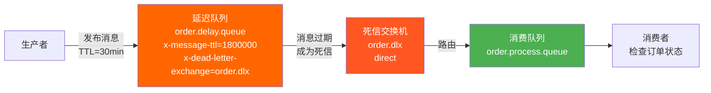
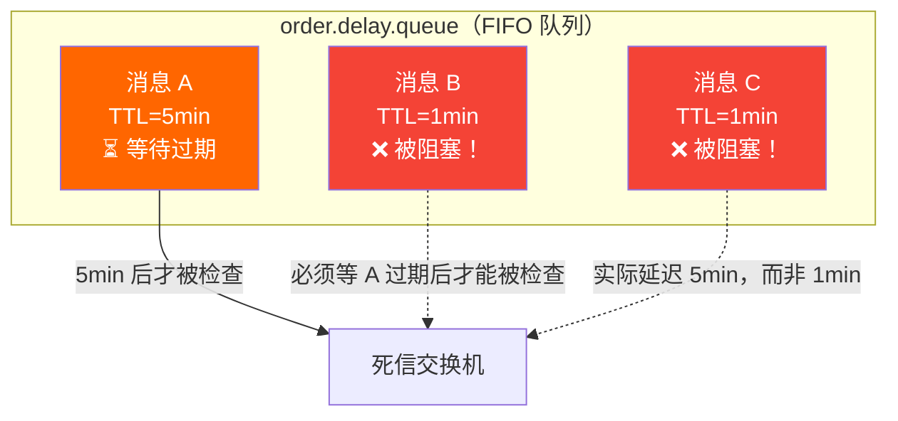
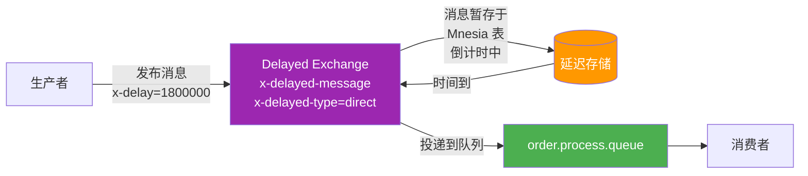
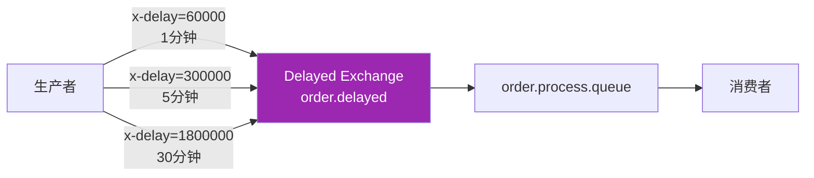
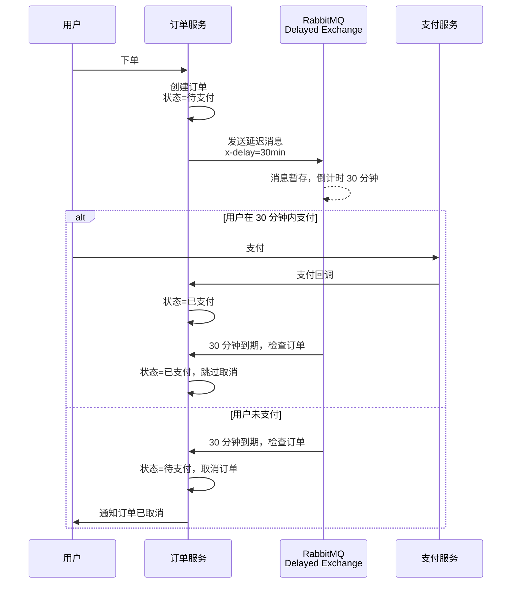

# 延迟消息与死信方案

延迟消息是消息队列的高频需求：订单 30 分钟未支付自动取消、预约提醒提前 15 分钟推送、重试退避间隔逐步拉长……RabbitMQ 本身没有原生的"延迟投递"指令，但提供了两种经典方案：**TTL + DLX 组合**和 **rabbitmq_delayed_message_exchange 插件**。

## 1. TTL + DLX：经典方案

### 核心思路

消息设置 TTL（Time To Live），过期后变为"死信"，被路由到 Dead Letter Exchange（DLX），再由 DLX 投递到实际消费队列——过期等待的时间就是延迟时间。



### 死信的三种来源

| 来源 | 说明 |
|------|------|
| 消息被拒绝 | `basic.nack` / `basic.reject` 且 `requeue=false` |
| 消息 TTL 过期 | 消息的 TTL 到期，或队列的 `x-message-ttl` 到期 |
| 队列达到最大长度 | 队列 `x-max-length` 溢出，最早的消息成为死信 |

### .NET 实现

```csharp
using RabbitMQ.Client;
using RabbitMQ.Client.Events;
using System.Text;
using System.Text.Json;

// ==================== 声明拓扑 ====================
var factory = new ConnectionFactory { HostName = "localhost" };
using var connection = factory.CreateConnection();
using var channel = connection.CreateModel();

// 死信交换机
channel.ExchangeDeclare("order.dlx", ExchangeType.Direct, durable: true);

// 消费队列 —— 绑定到死信交换机
channel.QueueDeclare("order.process.queue", durable: true, exclusive: false, autoDelete: false);
channel.QueueBind("order.process.queue", "order.dlx", "order.timeout");

// 延迟队列 —— 设置 TTL + DLX
channel.QueueDeclare("order.delay.queue", durable: true, exclusive: false, autoDelete: false,
    new Dictionary<string, object>
    {
        { "x-message-ttl", 1800000 },            // 30 分钟 = 1,800,000 ms
        { "x-dead-letter-exchange", "order.dlx" },
        { "x-dead-letter-routing-key", "order.timeout" }
    });

// ==================== 生产者：发送延迟消息 ====================
var order = new { OrderId = "ORD-20240601-001", Amount = 299.00m, CreatedAt = DateTime.UtcNow };
var body = Encoding.UTF8.GetBytes(JsonSerializer.Serialize(order));

var props = channel.CreateBasicProperties();
props.DeliveryMode = 2; // 持久化

channel.BasicPublish("", "order.delay.queue", props, body);
Console.WriteLine($"订单 {order.OrderId} 已发送，30 分钟后自动检查");

// ==================== 消费者：处理到期订单 ====================
var consumer = new EventingBasicConsumer(channel);
consumer.Received += (model, ea) =>
{
    var json = Encoding.UTF8.GetString(ea.Body.ToArray());
    var orderMsg = JsonSerializer.Deserialize<OrderMessage>(json);
    Console.WriteLine($"收到超时检查: {orderMsg?.OrderId}");

    // 查询数据库：订单是否已支付？
    bool isPaid = CheckOrderStatus(orderMsg!.OrderId);
    if (!isPaid)
    {
        CancelOrder(orderMsg.OrderId);
        Console.WriteLine($"订单 {orderMsg.OrderId} 已取消");
    }

    channel.BasicAck(ea.DeliveryTag, false);
};

channel.BasicConsume("order.process.queue", false, consumer);

record OrderMessage(string OrderId, decimal Amount, DateTime CreatedAt);

// 模拟业务方法
bool CheckOrderStatus(string orderId) => false; // 模拟未支付
void CancelOrder(string orderId) { /* 取消订单逻辑 */ }
```

::: tip 每条消息独立 TTL
除了在队列上设置 `x-message-ttl`，也可以在单条消息上设置 `props.Expiration = "60000"`（单位毫秒）。当两者同时存在时，取**较小值**。
:::

### 致命问题：队头阻塞（Head-Blocking）

TTL + DLX 方案有一个严重缺陷：**RabbitMQ 只从队列头部检查过期消息**。



消息 A（TTL=5min）排在前头，消息 B（TTL=1min）排在后面。即使 B 先到期，RabbitMQ 也不会跳过 A 去处理 B——B 必须等 A 过期后才能被检查和投递，**实际延迟变成 5 分钟而非 1 分钟**。

::: warning 队头阻塞的影响
- 不同 TTL 的消息**不能**共用同一个延迟队列
- 必须为每种 TTL 创建独立的延迟队列（如 `delay.5min.queue`、`delay.30min.queue`）
- 队列数量膨胀，运维成本上升
:::

## 2. Delayed Message Exchange 插件：优雅方案

### 安装与启用

```bash
# 下载插件（版本须与 RabbitMQ 版本匹配）
# https://github.com/rabbitmq/rabbitmq-delayed-message-exchange/releases

# 将 ez 文件放入 plugins 目录
cp rabbitmq_delayed_message_exchange-3.x.x.ez /usr/lib/rabbitmq/plugins/

# 启用插件
rabbitmq-plugins enable rabbitmq_delayed_message_exchange

# 验证
rabbitmq-plugins list | grep delayed
# [E*] rabbitmq_delayed_message_exchange
```

### 原理

插件定义了一种新的交换机类型 `x-delayed-message`，消息在**交换机层面**延迟，而非在队列中等待过期：



关键参数：

| 参数 | 说明 |
|------|------|
| `x-delayed-type` | 底层交换机类型：direct / topic / fanout / headers |
| `x-delay` | 消息头部，延迟时间（毫秒） |

**没有队头阻塞问题**——每条消息独立计时，到期即投递。

### .NET 实现

```csharp
using RabbitMQ.Client;
using RabbitMQ.Client.Events;
using System.Text;
using System.Text.Json;

var factory = new ConnectionFactory { HostName = "localhost" };
using var connection = factory.CreateConnection();
using var channel = connection.CreateModel();

// 声明延迟交换机
channel.ExchangeDeclare("order.delayed", "x-delayed-message", durable: true,
    new Dictionary<string, object>
    {
        { "x-delayed-type", "direct" }
    });

// 声明消费队列并绑定
channel.QueueDeclare("order.process.queue", durable: true, exclusive: false, autoDelete: false);
channel.QueueBind("order.process.queue", "order.delayed", "order.timeout");

// ==================== 生产者 ====================
var order = new { OrderId = "ORD-20240601-002", Amount = 599.00m };
var body = Encoding.UTF8.GetBytes(JsonSerializer.Serialize(order));

var props = channel.CreateBasicProperties();
props.DeliveryMode = 2;
props.Headers = new Dictionary<string, object>
{
    { "x-delay", 1800000 }  // 30 分钟延迟
};

channel.BasicPublish("order.delayed", "order.timeout", props, body);
Console.WriteLine($"订单 {order.OrderId} 已发送，30 分钟后检查（Delayed Exchange）");

// ==================== 消费者 ====================
var consumer = new EventingBasicConsumer(channel);
consumer.Received += (model, ea) =>
{
    var json = Encoding.UTF8.GetString(ea.Body.ToArray());
    var orderMsg = JsonSerializer.Deserialize<OrderMessage>(json);
    Console.WriteLine($"[Delayed] 收到超时检查: {orderMsg?.OrderId}");

    bool isPaid = CheckOrderStatus(orderMsg!.OrderId);
    if (!isPaid)
    {
        CancelOrder(orderMsg.OrderId);
    }
    channel.BasicAck(ea.DeliveryTag, false);
};

channel.BasicConsume("order.process.queue", false, consumer);

record OrderMessage(string OrderId, decimal Amount);

bool CheckOrderStatus(string orderId) => false;
void CancelOrder(string orderId) { }
```

## 3. 多级延迟队列

当需要多种延迟时间时，TTL+DLX 方案需要为每种 TTL 创建一个队列，而 Delayed Exchange 只需一个交换机：



TTL+DLX 方案的多级延迟实现：

```csharp
// 为每种延迟时间创建独立队列
var delayConfigs = new[] { 60000, 300000, 1800000 }; // 1min, 5min, 30min
foreach (var ttl in delayConfigs)
{
    channel.QueueDeclare($"order.delay.{ttl}ms", durable: true, exclusive: false, autoDelete: false,
        new Dictionary<string, object>
        {
            { "x-message-ttl", ttl },
            { "x-dead-letter-exchange", "order.dlx" },
            { "x-dead-letter-routing-key", "order.timeout" }
        });
}
```

::: important 选择建议
- **少量固定延迟**（如只有 30 分钟）：TTL+DLX 方案够用，无需额外插件
- **多种灵活延迟**：强烈推荐 Delayed Exchange 插件，避免队头阻塞和队列膨胀
:::

## 4. 性能对比

| 维度 | TTL + DLX | Delayed Message Exchange |
|------|-----------|--------------------------|
| 延迟精度 | 高（队列级 TTL 精确） | 高（每条消息独立计时） |
| 队头阻塞 | **有**（不同 TTL 必须分队列） | **无** |
| 队列数量 | O(N)，N = TTL 种类 | O(1)，一个交换机搞定 |
| 持久化 | 队列消息可持久化 | Mnesia 表存储，重启后延迟消息**丢失** |
| 吞吐量 | 高 | 中（Mnesia 表有写放大） |
| 插件依赖 | 无 | 需要 rabbitmq_delayed_message_exchange |
| 最大延迟 | 无限制 | 约 2³¹ ms ≈ 24.8 天 |

::: warning Delayed Exchange 的持久化缺陷
Delayed Exchange 将待延迟消息存储在 Erlang Mnesia 表中，而非队列。如果 RabbitMQ 节点在消息延迟期间重启，**这些消息会丢失**。对于不能丢失的延迟消息，需要额外的持久化保障（如在数据库中记录延迟任务，启动时补偿）。
:::

## 5. 实战案例：订单超时取消

完整的订单超时取消流程：



```csharp
// 订单服务 —— 完整实现
public class OrderTimeoutService : BackgroundService
{
    private readonly IConnection _connection;
    private readonly IModel _channel;
    private readonly IServiceScopeFactory _scopeFactory;

    public OrderTimeoutService(IServiceScopeFactory scopeFactory)
    {
        _scopeFactory = scopeFactory;
        var factory = new ConnectionFactory { HostName = "localhost" };
        _connection = factory.CreateConnection();
        _channel = _connection.CreateModel();

        // 声明延迟交换机
        _channel.ExchangeDeclare("order.delayed", "x-delayed-message", durable: true,
            new Dictionary<string, object> { { "x-delayed-type", "direct" } });

        _channel.QueueDeclare("order.timeout.check", durable: true, exclusive: false, autoDelete: false);
        _channel.QueueBind("order.timeout.check", "order.delayed", "order.timeout");
    }

    // 发送延迟消息
    public void ScheduleTimeoutCheck(string orderId, int delayMs = 1800000)
    {
        var msg = Encoding.UTF8.GetBytes(JsonSerializer.Serialize(new { OrderId = orderId }));
        var props = _channel.CreateBasicProperties();
        props.DeliveryMode = 2;
        props.Headers = new Dictionary<string, object> { { "x-delay", delayMs } };

        _channel.BasicPublish("order.delayed", "order.timeout", props, msg);
    }

    protected override Task ExecuteAsync(CancellationToken stoppingToken)
    {
        var consumer = new EventingBasicConsumer(_channel);
        consumer.Received += async (model, ea) =>
        {
            var json = Encoding.UTF8.GetString(ea.Body.ToArray());
            var msg = JsonSerializer.Deserialize<OrderTimeoutMessage>(json);

            using var scope = _scopeFactory.CreateScope();
            var db = scope.ServiceProvider.GetRequiredService<OrderDbContext>();

            var order = await db.Orders.FindAsync(msg!.OrderId);
            if (order is { Status: OrderStatus.Pending })
            {
                order.Status = OrderStatus.Cancelled;
                order.CancelledAt = DateTime.UtcNow;
                order.CancelReason = "支付超时，自动取消";
                await db.SaveChangesAsync(stoppingToken);
                Console.WriteLine($"订单 {msg.OrderId} 已自动取消");
            }

            _channel.BasicAck(ea.DeliveryTag, false);
        };

        _channel.BasicConsume("order.timeout.check", false, consumer);
        return Task.CompletedTask;
    }

    public override void Dispose()
    {
        _channel?.Dispose();
        _connection?.Dispose();
        base.Dispose();
    }
}

record OrderTimeoutMessage(string OrderId);

enum OrderStatus { Pending, Paid, Cancelled }

class OrderDbContext { } // 模拟
```

## 面试技巧

::: tip 高频考点
1. **"RabbitMQ 如何实现延迟消息？"** —— 先答 TTL+DLX 方案（面试官预期的基础答案），再主动提队头阻塞问题，最后引出 Delayed Exchange 插件。体现深度。
2. **"队头阻塞是什么？怎么解决？"** —— RabbitMQ 只从队列头部检查过期消息，不同 TTL 的消息不能共享队列。解决方案：分队列 或 使用 Delayed Exchange 插件。
3. **"Delayed Exchange 插件有什么缺陷？"** —— Mnesia 存储不持久化，重启丢消息；最大延迟约 24.8 天；社区插件非官方核心。
4. **"订单超时取消除了 MQ 还有什么方案？"** —— 数据库定时轮询（简单但低效）、时间轮（Netty HashedWheelTimer）、Redis 键空间通知、延迟线程池。对比各方案优缺点。
5. **"死信队列还有哪些用途？"** —— 除了延迟消息，还用于：消费失败重试（nack → DLX → 重试队列）、消息审计（所有死信集中处理）、兜底消费。
:::

---

**参考资料**

- [RabbitMQ 官方文档 - Dead Letter Exchanges](https://www.rabbitmq.com/docs/dlx)
- [RabbitMQ 官方文档 - TTL](https://www.rabbitmq.com/docs/ttl)
- [rabbitmq_delayed_message_exchange 插件](https://github.com/rabbitmq/rabbitmq-delayed-message-exchange)
- 《RabbitMQ 实战指南》朱忠华 — 第 5 章高级特性
- RabbitMQ in Depth (Alvaro Videla) — Chapter 6: Dead Lettering
